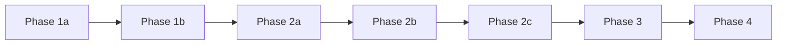

# Phase Docs

> This directory maintains platform progression documents organized by phase.
> Each phase document should describe objectives, entry conditions, scope, non-goals, deliverables, dependencies, validation metrics, exit criteria, and hand-off boundaries.
> Phase-level "Acceptance and Exit Criteria" should remain consistent with [module_acceptance_criteria_matrix.md](../module_acceptance_criteria_matrix.md).

## Current Phase Documents

- [phase-1a-foundation.md](./phase-1a-foundation.md)
- [phase-1b-orchestration.md](./phase-1b-orchestration.md)
- [phase-2a-multi-division.md](./phase-2a-multi-division.md)
- [phase-2b-memory-governance-stability.md](./phase-2b-memory-governance-stability.md)
- [phase-2c-skills-hr-evolution.md](./phase-2c-skills-hr-evolution.md)
- [phase-3-pmf-commercialization.md](./phase-3-pmf-commercialization.md)
- [phase-4-enterprise-ecosystem.md](./phase-4-enterprise-ecosystem.md)

## Unified Template

Each phase document should contain at least the following sections:

1. Objectives
2. Entry Conditions
3. Required Scope
4. Non-Goals
5. Key Contracts / Main Documents
6. Core Deliverables
7. Acceptance and Exit Criteria
8. Risks and Control Points
9. Hand-off to Next Phase

## Phase Relationships

## Usage Rules

- `Phase 1a` is the only phase currently permitted to enter final document sign-off and pre-coding gate.
- `Phase 1b ~ Phase 4` are currently document-complete and plannable, but not immediately actionable for coding.
- If a phase boundary changes, first update the corresponding phase document, then update `05_delivery_scope_and_milestones.md` and `phase_readiness_matrix.md`.
- If the current phase objective includes "stable operation," you must also comply with `stable_core_scope.md` and `stable_runtime_validation_plan.md`.
