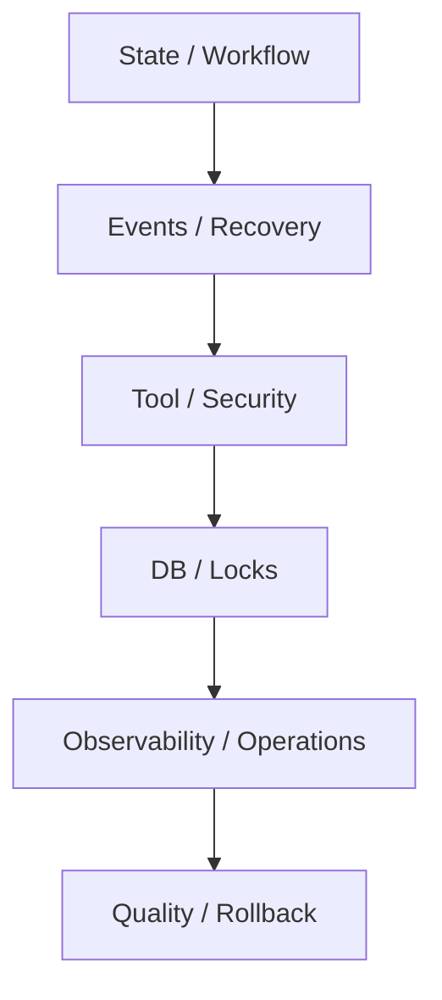

# Pre-Launch Top 20 Hard Checklist

## 1. Goal

This document further compresses all remediation items into the most core `Top 20` hard checklist before launch.

Judgment rule:

- If these items are not completed, the system should not claim it's close to stable launch.

## 2. Top 20

1. Unified `task/workflow/decision` state machine.
2. Step idempotency key and execution receipt.
3. Tier 1 events write to DB first, then emit.
4. Event resend and consumer acknowledgment.
5. `kill -9` crash recovery auto-test.
6. Tool `timeout/cancel/cleanup` complete closed loop.
7. `write/edit/bash/MCP` security boundary implementation.
8. Sensitive paths and secrets unified `deny/redact`.
9. Step output schema validate.
10. Workflow DAG static check.
11. Task cancel full chain abort.
12. DB `integrity_check` and backup verification.
13. Lock TTL and zombie lock recovery.
14. `healthz + metrics + timeline` query.
15. Stalled agent detection.
16. Cost circuit breaker test.
17. Admission control.
18. Manual takeover capability.
19. Golden tasks regression.
20. Rollback playbook.

## 3. Classification View

## 4. Related Documents

- [module_remediation_backlog.md](./module_remediation_backlog.md)
- [stable_launch_execution_plan.md](./stable_launch_execution_plan.md)
- [stable_runtime_validation_plan.md](./stable_runtime_validation_plan.md)
- [../reviews/pre_stable_launch_blockers_checklist.md](../reviews/pre_stable_launch_blockers_checklist.md)

## 5. Closure Conclusion

If subsequent implementation or launch preparation starts, these 20 items should be viewed as the first set of hard thresholds to implement, not "enhancements to do when time permits".

## 4. Classification View

## 5. Closure Conclusion

If subsequent implementation or launch preparation starts, these 20 items should be viewed as the first set of hard thresholds to implement, not "enhancements to do when time permits".
