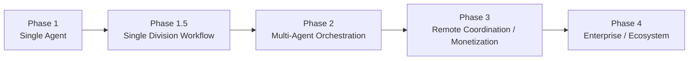
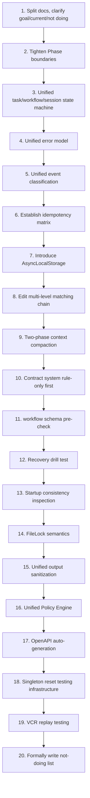

# System Improvement Roadmap

## 1. Objective

This document organizes current system-level improvement suggestions into a formal advancement roadmap, preventing improvements from staying only in chat conclusions.

It answers 4 questions:

- Which improvements must be done first.
- Which improvements are high-priority supporting items.
- Which improvements are suitable to do after the system runs stably.
- Which capabilities are currently explicitly not being done.
- How to first shrink to Stable Core, then pursue "can run stably".

## 2. Execution Principles

- First tighten the 5 foundations: state, error, event, recovery, security.
- First eliminate the instability sources most likely to cause online incidents, then consider expanding features.
- First stabilize capabilities truly needed for the current phase, then move to the next phase.
- Any super-phase capability that has not entered the formal phase goal is not implemented by default.
- Improvement items must be traceable to contracts, phase docs, backlog, or ADR, not just existing in verbal conclusions.

## 3. Phase Mapping

User-suggested execution waves and their mapping to current project phases:

| Suggested Wave | Current Project Phase Mapping | Core Goal |
| --- | --- | --- |
| `Phase 1` | `Phase 1a` | Single Agent stable operation |
| `Phase 1.5` | `Phase 1b` | Single division workflow + minimal orchestration |
| `Phase 2` | `Phase 2a / 2b / 2c` | Multi-Agent orchestration, recovery, stability, skills |
| `Phase 3` | `Phase 3` | Perception, monetization, remote coordination precursor capabilities |
| `Phase 4` | `Phase 4` | Enterprise, multi-tenant, marketplace, ecosystem |

## 4. P0: Must Do First

| ID | Improvement | Current Handling |
| --- | --- | --- |
| `P0-01` | Document split and layering | Has foundation, continue tightening "current/future/not doing" expression |
| `P0-02` | Phase boundary tightening | Incorporated into formal roadmap this round |
| `P0-03` | Unified master state machine | Added `state_transition_matrix_contract` baseline |
| `P0-04` | Unified error model | Added `app_error_contract` and `error_code_registry` baselines |
| `P0-05` | Unified event classification and reliability | Added `event_reliability_matrix_contract` baseline |
| `P0-06` | Idempotency matrix | Added `idempotency_and_recovery_matrix_contract` baseline |
| `P0-07` | Single dispatch abstraction | Started, continue reflecting dispatch taxonomy to main documents |
| `P0-08` | Converge CEO / VP / Lead engineering boundaries | Started canonical id + alias |
| `P0-09` | Formalize "current not doing list" | Formally written this round |
| `P0-10` | Establish ADR mechanism and fill key ADR | Added ADR 011~015 first version |

## 5. P1: High Priority

| ID | Improvement | Target Phase |
| --- | --- | --- |
| `P1-11` | AsyncLocalStorage context propagation | Phase 1a |
| `P1-12` | Edit tool multi-level matching chain | Phase 1a / 1b |
| `P1-13` | Two-phase context overflow handling | Phase 1b |
| `P1-14` | Contract system deterministic precondition first | Phase 1a |
| `P1-15` | Workflow input/output compatibility pre-check | Phase 1b |
| `P1-16` | Crash recovery drill | Phase 1a / 1b |
| `P1-17` | Startup consistency inspection | Phase 1a |
| `P1-18` | FileLock semantics completion | Phase 1a / 1b |
| `P1-19` | Tool output unified sanitization pipeline | Phase 1a |
| `P1-20` | Unified Policy Engine | Phase 1b / 2 |
| `P1-21` | Sensitive operation classification databaselization | Phase 1a / 1b |
| `P1-22` | Tool / Skill / Plugin permission closed loop | Phase 2 |
| `P1-23` | OpenAPI auto-generation | Phase 2 |
| `P1-24` | Test singleton reset system | Phase 1a |
| `P1-25` | VCR / fixture testing system | Phase 1a / 1b |

P1 items that formed baseline contracts this round:

- `P1-11` `context_propagation_contract.md`
- `P1-15` `workflow_io_compatibility_precheck_contract.md`
- `P1-16 / P1-17` `startup_consistency_and_recovery_drill_contract.md`
- `P1-18` `file_lock_contract.md`
- `P1-19` `tool_output_sanitization_contract.md`
- `P1-20 / P1-21` `policy_engine_contract.md`
- `P1-12` `edit_replacement_chain_contract.md`
- `P1-13` `context_compaction_and_overflow_contract.md`
- `P1-24` `testing_singleton_reset_contract.md`
- `P1-25` `vcr_and_fixture_testing_contract.md`

Continued to fill this round:

- Event registry and ops thresholds: `event_registry_and_ops_threshold_contract.md`
- Debug / inspect / health / backpressure: `debug_inspect_health_backpressure_contract.md`
- ADR 011~015: Added alternatives / trade-off / adoption trigger / exit criteria
- Tool metadata and recovery declaration: `tool_metadata_and_recovery_contract.md`
- `AppError` provider / tenant / monetization segmented error codes: Added to `error_code_registry.md`
- Unified execution unit: `executable_unit_contract.md`
- Unified result envelope: `result_envelope_contract.md`
- Lifecycle and termination reasons: `lifecycle_and_termination_contract.md`
- Configuration four layers and defaults: `configuration_layers_and_defaults_contract.md`
- Diagnostics snapshot and minimal repro bundle: `diagnostics_snapshot_and_repro_bundle_contract.md`
- Token budget fine-grained allocation: `token_budget_allocation_contract.md`
- Data classification and prompt handling strategy: `data_classification_and_prompt_handling_contract.md`
- Naming and engineering boundaries: `naming_and_engineering_boundary_contract.md`

## 6. P2: Medium Priority

| ID | Improvement | Target Phase |
| --- | --- | --- |
| `P2-26` | Message Parts | Phase 2 |
| `P2-27` | Typed event bus | Phase 2 |
| `P2-28` | Model-aware tool selection | Phase 2 |
| `P2-29` | Bash arity / command signature table | Phase 2 |
| `P2-30` | Permission cascade rejection | Phase 2 |
| `P2-31` | JSONC configuration support | Phase 2 |
| `P2-32` | models.json metadata center | Phase 2 |
| `P2-33` | Artifact model further unified | Phase 2 |
| `P2-34` | Task / Workflow / Decision inspect query layer | Phase 2 |
| `P2-35` | Debug toolchain completion | Phase 2 |
| `P2-36` | Health check enhancement | Phase 2 |
| `P2-37` | Backpressure strategy implementation | Phase 2 |
| `P2-38` | Technical debt registry institutionalization | Ongoing |

## 7. P3: Long-term Optimization

| ID | Improvement | Target Phase |
| --- | --- | --- |
| `P3-39` | Repo Map full enhancement | Phase 3+ |
| `P3-40` | LSP integration | Phase 3+ |
| `P3-41` | PTY support | Phase 3+ |
| `P3-42` | Git worktree isolation | Phase 3+ |
| `P3-43` | Semantic cache | Phase 3+ |
| `P3-44` | Evolution engine extension | Phase 3+ |
| `P3-45` | Remote Worker standardization | Phase 3+ |
| `P3-46` | Multi-consumer event queue replacement | Phase 3+ |
| `P3-47` | Multi-tenant architecture upgrade | Phase 4 |
| `P3-48` | Enterprise policy engine | Phase 4 |
| `P3-49` | Compile-time DCE | Late optimization |
| `P3-50` | Sandbox advanced features | Phase 4 |

## 8. P4: Do After Commercialization

| ID | Improvement | Target Phase |
| --- | --- | --- |
| `P4-51` | Unified Marketplace | Phase 4 |
| `P4-52` | License / Quota / Billing closed loop | Phase 3 / 4 |
| `P4-53` | User reports and ROI analysis | Phase 4 |
| `P4-54` | Web UI complete event panel | Phase 4 |
| `P4-55` | Enterprise security features | Phase 4 |
| `P4-56` | Multi-channel gateway completion | Phase 4 |
| `P4-57` | Data export and migration tools | Phase 4 |
| `P4-58` | Commercialization onboarding | Phase 3 / 4 |
| `P4-59` | Growth flywheel system | After commercialization |
| `P4-60` | Compliance system | After revenue |

## 9. Current Explicit Not-Doing List

Explicitly not doing in Phase 1a / 1b:

- Complete implementation of 8-dimensional evolution
- Semantic cache
- Dual Marketplace
- Multi-language SDK
- Remote kill switch service
- Sandbox warm pool
- Complex virtual path mapping
- Remote worker fleet
- Enterprise SSO / RBAC / SOC2 suite

Rules:

- If these capabilities have not explicitly entered the current phase document, they default to not being implemented ahead in execution.
- If these need to be introduced early in the future, must first add ADR or phase scope revision.

## 10. Recommended Top 20 Items to Execute Immediately

Recommended execution order:

1. Split docs, clarify goal/current/not doing
2. Tighten Phase boundaries
3. Unified task / workflow / session state machine
4. Unified error model
5. Unified event classification
6. Establish idempotency matrix
7. Introduce AsyncLocalStorage
8. Do Edit multi-level matching chain
9. Do two-phase context compaction
10. Contract system rule-only first
11. Do workflow schema pre-check
12. Do recovery drill test
13. Do startup consistency inspection
14. Fill FileLock semantics
15. Do unified output sanitization
16. Merge into unified Policy Engine
17. Do OpenAPI auto-generation
18. Establish singleton reset testing infrastructure
19. Do VCR replay testing
20. Formally write all "not doing items" into roadmap

## 11. Current Conclusion

The most important improvement direction for the current system is not to continue adding features, but to first tighten the following 5 foundations:

- State
- Error
- Event
- Recovery
- Security

After these foundations are tightened, the subsequent division, skills, remote worker, commercialization capabilities will not need repeated rework.

## 12. Stable Core Convergence Rules

To reach "can run stably" as soon as possible, must first shrink to Stable Core:

- Single machine.
- SQLite.
- Single division.
- No remote worker.
- No plugin marketplace.
- No HR dynamic role creation.
- No complex evolution engine.
- Few core tools.
- `supervised / auto` two modes running stably first.

Corresponding documents:

- `stable_core_scope.md`
- `stable_runtime_validation_plan.md`
- `../reviews/stable_runtime_blockers_checklist.md`

## 13. Mature Industrial Platform Reinforcement Topics

Beyond the "production threshold", when continuing toward mature industrial platform, must fill the following topics, already having formal contracts:

- Architecture governance and version governance: `architecture_governance_and_versioning_contract.md`

## 14. High-consensus Backfills from `research/analysis`

After deduplication of multiple comparative analyses in `doc/research/analysis/`, a batch of "high consensus, should enter formal solution" conclusions has emerged.

These conclusions no longer stay only at the research layer, currently uniformly backfilled into project solutions as follows:

### 14.1 High-consensus Items Currently to be Incorporated into Formal Roadmap

| Topic | Research Consensus | Current Incorporation Method | Suggested Phase |
| --- | --- | --- | --- |
| Middleware formally integrated into runtime | DeerFlow / Claude Code / Summary conclusion | Incorporated into runtime and stabilization main line | `Phase 2a` |
| Tool parallel execution | Claude Code / LangGraph / DeerFlow / OpenCode | Incorporated into tool/runtime main line | `Phase 2a` |
| Resource-aware retry | Temporal / Goose / DeerFlow / Aider | Incorporated into retry / provider / runtime main line | `Phase 2a` |
| `max_output_tokens` continuation recovery | Claude Code / Goose | Incorporated into provider/runtime reliability main line | `Phase 2a` |
| Effect Buffer / post-transaction side effects | Temporal / Summary conclusion | Incorporated into event and storage consistency main line | `Phase 2a` |
| Compositional rate limiter | Temporal / Summary conclusion | Incorporated into retry / provider / runtime governance main line | `Phase 2a` |
| Real token counting | Goose / OpenCode / DeerFlow / MetaGPT | Incorporated into compaction / budget / memory main line | `Phase 2a` |
| Progressive tool result summary | Goose / Claude Code / OpenCode | Incorporated into compaction / message-part main line | `Phase 2a` |
| STM -> LTM auto migration | MetaGPT / DeerFlow / Aider | Incorporated into memory system roadmap | `Phase 2b` |
| Structured long-term memory | DeerFlow / MetaGPT / LangGraph Store | Incorporated into memory system roadmap | `Phase 2b` |
| Semantic Repo Map | Aider / MetaGPT / Summary conclusion | Incorporated into code understanding roadmap | `Phase 2b / 3` |
| Apply Patch / patch DSL | Codex / OpenCode | Incorporated into code modification roadmap | `Phase 2b` |
| Multi-edit atomic operation | OpenCode / Codex | Incorporated into code modification roadmap | `Phase 2b` |
| LSP diagnostics closure | OpenCode | Incorporated into development feedback closure | `Phase 2b / 3` |
| Git snapshot + undo / redo | OpenCode / Codex / Goose / Aider | Incorporated into safe trial-and-error and recovery roadmap | `Phase 2b / 3` |
| WebFetch tool | Claw-Code / OpenCode | Incorporated into tool system enhancement roadmap | `Phase 2a / 2b` |
| Tool recommendation / deferred discovery | MetaGPT / Claude Code / DeerFlow | Incorporated into tool system enhancement roadmap | `Phase 2b` |
| Question tool | OpenCode | Incorporated into structured HITL / user input roadmap | `Phase 2b` |
| TodoWrite session-level todo | Claw-Code / Goose / OpenCode | Incorporated into long task transparency roadmap | `Phase 2b` |
| Dynamic config constraint override | Temporal / Summary conclusion | Incorporated into config / policy / rollout governance roadmap | `Phase 2b` |
| Experience cache and few-shot reuse | MetaGPT / DeerFlow / Summary conclusion | Incorporated into learning and evolution roadmap | `Phase 2c / 3` |
| Network egress audit | Goose | Incorporated into security and observability roadmap | `Phase 2a / 2b` |
| Unicode steganography sanitization | Goose | Incorporated into sanitize / prompt-safety roadmap | `Phase 2a` |
| Session dual storage (JSONL + SQLite) | Codex / MetaGPT / Summary conclusion | Incorporated into long-term audit and replay roadmap | `Phase 2c / 3` |

### 14.2 Research Conclusions Explicitly Not Directly Copied

- Do not switch main tech stack due to research conclusions; continue TypeScript main line.
- Do not directly adopt LangGraph, Temporal, Rust multi-crate, Next.js full-stack UI etc. implementation forms as this project's default architecture.
- Do not migrate lightweight governance, lightweight persistence, lightweight security assumptions from research subjects into current Stable Core.
- Do not directly incorporate massive UX / app scale from mature product period into current phase scope.

### 14.3 Solution Layer Update Rules

- If research-layer conclusions belong to "high consensus + current phase relevant", must enter `system_improvement_roadmap.md`, `module_remediation_backlog.md`, or `development_sequence_roadmap.md`.
- If only long-term direction or implementation style reference, can stay in research layer, not forced into current solution.
- If research conclusions would change phase boundaries or source of truth, must first write back phase documents and contracts.
- Workflow static analysis, compensation, and long task chunking: `workflow_static_analysis_and_compensation_contract.md`
- Quality engineering, regression baseline, chaos engineering: `quality_engineering_and_chaos_testing_contract.md`
- Trace, business/technical metrics layering, RCA: `trace_and_root_cause_observability_contract.md`
- Supply chain and dependency security: `supply_chain_and_dependency_security_contract.md`
- Environment layering and configuration center governance: `environment_and_configuration_governance_contract.md`
- Approval experience, human takeover, and explainability: `hitl_experience_and_explainability_contract.md`
- License / capability boundary engineering: `license_and_capability_boundary_contract.md`
- Memory decay, quality, and permission linkage: `memory_decay_and_quality_contract.md`
- Remote coordination, file consistency, and cross-region disaster recovery: `remote_coordination_and_disaster_recovery_contract.md`
