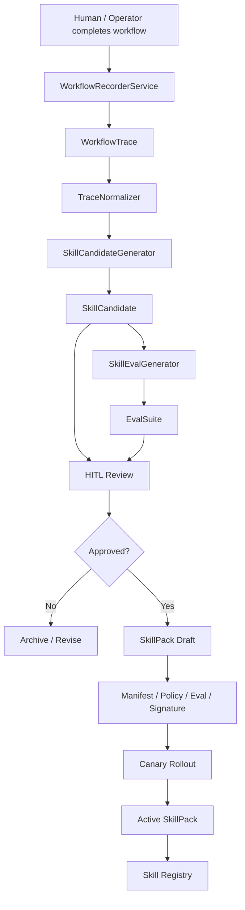
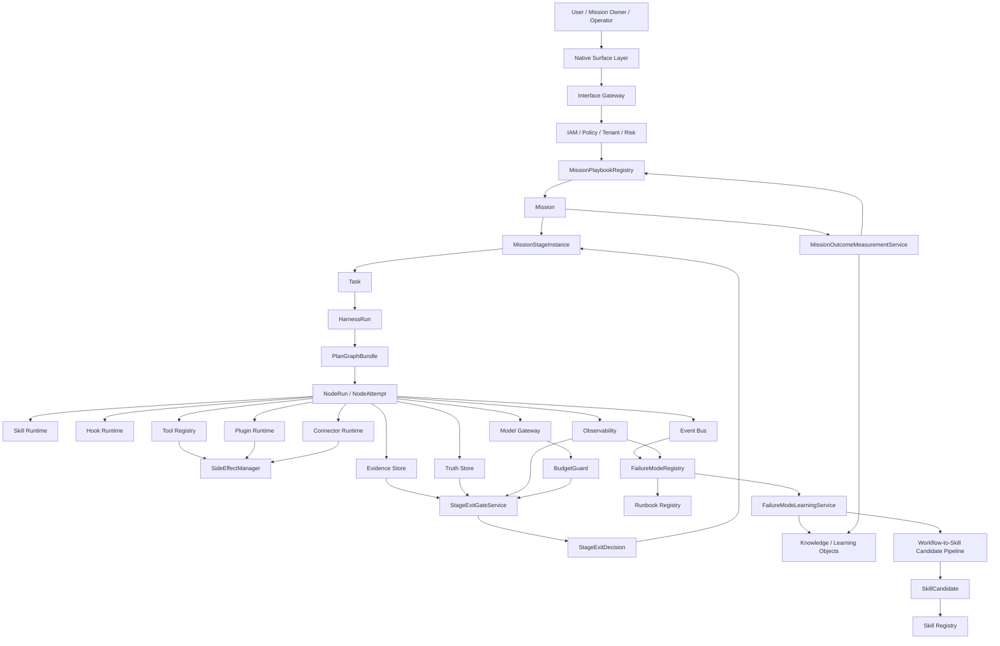

# Adapting Anthropic's "The Founder's Playbook" to the Automatic Agent Platform — Architectural Reference and Implementation Plan

> Document status: reviewed-reference / architecture-patch-candidate
> Registry status: repo_validation_patch_present / main_baseline_acceptance_pending
> Version: v1.6.2 — Mission Playbook Release Metadata Patch, reviewed and revised on 2026-05-21
> Date: 2026-05-20, reviewed and revised: 2026-05-21
> Source material: Anthropic "The Founder's Playbook: Building an AI-Native Startup" PDF, 36 pages; official source: [Claude Blog original](https://claude.com/blog/the-founders-playbook)
> Applicable system: Automatic Agent Platform / AI-native Mission Operating System
> Goal: Abstract the AI-native startup methodology in the Playbook into Agent platform architectural capabilities that are implementable, verifiable, auditable, and rollback-able, and close the loop with the existing Mission, Task, Session, Skill, Workflow, Evidence, Validation, and Runtime Governance systems.

---

## Review Conclusions and This Revision

This document is suitable as a reference design draft for "external methodology to platform capabilities," but it should not be read directly as a contract already accepted by the current repository or as an existing implementation baseline. This review tightens the document according to the current state of the repository's documentation and code as follows:

| Finding | Risk | This Revision |
|---|---|---|
| The document header writes itself as `release-ready`, while also declaring that Registry, Evidence, and Runtime are still pending closure | Easy to misread the reference draft as having passed main baseline acceptance | Status changed to `reviewed-reference / architecture-patch-candidate`, clarifying that the current repository has not yet registered these entries |
| Commands such as `npm run playbook:*`, `stage-exit`, `mission-outcome` are written as "must execute" | At review time, `package.json` did not yet contain these commands; the acceptance path becomes paper commands | First change to a proposed command inventory; on 2026-05-21 the in-repo closure commands, registry patch, and report artifacts have been added, but main baseline acceptance still requires separate sign-off |
| The document adds MissionPlaybook / StageExit models, but the authority relationship is not placed at the very front | May form a second execution runtime with the existing Mission, PlanGraph, HarnessRun, NodeRun main chain | Add "Authority Boundary and Implementation Gap" to fix Mission Playbook as business stage governance only, and not as a replacement for the canonical runtime |
| Source Traceability only has PDF page numbers, missing official source anchoring rules | Source mapping drifts when the PDF is reissued | Add official source at the top, retain page-number confidence, and require re-verification of sourceRef when formally merging |
| Metric table allows `missionId` in labels | Inconsistent with Mission high-cardinality governance | Remove high-cardinality `missionId` label, switch to low-cardinality labels and trace/evidence back-references |
| Proposals, patch plans, and implementation tracks are mixed together | Readers struggle to judge "what can be used now" | Clarify the three layers of "proposal, main baseline patch, implementation Track"; the remaining content is kept as design input |

This review does not reject the main design direction of this document. The retained core recommendation is: translate the Playbook's stages, exit criteria, failure modes, and outcome measurement into Mission governance capabilities; remove or tighten the over-strong wording of "already accepted, already executed, already blocked."

---

## Version Change Log

| Version | Status | Major Changes |
|---|---|---|
| v1.0 | proposal / ready-for-review | Based on Anthropic Founder's Playbook, proposed MissionPlaybookRegistry, StageExitGateService, FailureModeRegistry, MissionOutcomeMeasurementService, and Workflow-to-Skill Candidate Pipeline. |
| v1.1 | proposal / integration-ready after review | Fixed issues found in v1.0 review: completed Gate / Metric / Event / Runbook Registry integration; added Mission / Task / Session lifecycle alignment; added StageExit CAS/RSM/transaction semantics; changed ExitCriterion.expression to a safe DSL; clarified that MissionStageGraph may have controlled cycles while PlanGraphBundle must be a DAG; added FailureMode detection governance, Outcome delayed measurement, WorkflowRecordingPolicy, SkillCandidate lifecycle alignment, Source Traceability Matrix, and Native Surface Matrix; renamed Phase A-D to Implementation Track A-D. |
| v1.2 | proposal / baseline-integration-candidate | Fixed final-board blocking items in v1.1 review: clarified proposed registry status and runtime enforcement boundary; added v2.0 Baseline Integration Patch Plan; added StageExitGateService transaction pseudocode and the rule against split transactions; added ExitCriterion DSL Validator; fixed MissionStageStatus and HITL inconsistency in the state machine; split SkillCandidate and SkillPack lifecycles; added WorkflowRecordingPolicy default least-privilege configuration; added MissionPlaybook version governance, lifecycle, rollout/rollback/signature; added Outcome score layering, FailureMode vs Gate severity relationship, Native Surface action permission matrix, and Implementation Track owner/dependency/exit/rollback; clarified the way to merge into v2.0 main document. |
| v1.3 | proposal / registry-closure-candidate | Fixed closure issues in v1.2 review: truly split SkillCandidate and SkillPack lifecycles; added StageExit nextStageInstance atomic creation, Mission currentStage pointer update, idempotencyKey and duplicate-call semantics; added MissionPlaybookResolutionPolicy and MissionPlaybookMigrationPlan; changed WorkflowRecordingPolicy to a safe enum defaulting to redacted_summary; unified SkillCandidate event aggregation boundary; changed Runbook severity to defaultSeverity + escalationRules; added ExitCriterion snapshot binding, actual/expected value recording; added OutcomeObservation/source/confidence; added MissionStageGraph edge-level guard; added observe_only→enforcing strategy in Implementation Tracks; bound Native Surface Matrix to Policy Action / Required Capability; added chapter/page range in Source Traceability Matrix; added Benchmark Monitoring Mission playbook example, Outcome→Knowledge/Artifact promotion, and SkillPack policy/eval/rollback examples. |
| v1.4 | proposal / baseline-acceptance-candidate | Fixed acceptance blockers in v1.3 review: split SkillCandidate conversion gate and SkillPack activation gate; added SkillPack exception/terminal events and violation metrics; fixed StageExit event causal order, added held/rollback/terminate branch events; StageExitGateInput added playbookVersion, remediationRef, and HITL re-evaluation mandatory check; FailureMode type added triggerCondition; added MissionPlaybook governance gates/metrics; WorkflowRecordingPolicy added retention deletion proof, sweep, deletion events/metrics; ExitCriterion window changed to BoundedTimeWindow; StageEdgeGuard added risk/data/evidence/outcome constraints; MissionOutcome first phase used BusinessImpactObservation; Runbook/CI/Track/Traceability further machine-closed. |
| v1.5 | proposal / final-acceptance-candidate | Fixed final acceptance issues in v1.4 review: fixed Markdown code fence; MissionStageInstance used the version field, expectedVersion retained only in input/command; StageEdgeGuard completed risk/data/evidence/outcome; StageExit event payload added playbookVersion/idempotencyKey/criterionResults/sequence/correlationId; Runbook Registry added ack/resolve SLA and manual approval fields; CI Job Registry added Track A-D observe_only/enforcing mode; tightened BoundedTimeWindow, use_last_active, fencingToken, MissionOutcome score source, SkillPack event order, and SkillCandidate/SkillPack gate boundary. |
| v1.6 | proposal / ready-to-merge-candidate | Fixed final integration closure issues in v1.5 review: added v1.5 version record and cleaned up residual v1.4 wording; Patch Plan added GATE-SKILLPACK-001, skillpack-validate, and SkillPack evidence refs; unified StageTransitionEventBase with EventEnvelope/Payload boundary; added MissionPlaybook validation_failed/rejected/suspended events; tightened use_last_active fallback; added GATE-WORKFLOW-RECORDING-003; Runbook D.35/D.40 added migration compatibility and retention/deletion metrics; deduplicated MissionOutcome types; clarified mapDecisionToStageStatus, canonical enum references, SkillPack rollback semantics, structured metric alert and gate-level CI mode. |
| v1.6.1 | proposal / final-release-closure-candidate | Fixed release closure issues in v1.6 review: removed unregistered mission.stage.rollback_completed reference; completed mission-outcome / skill-candidate / skillpack verification commands in the merge checklist; mission.stage.completed added decisionId and inherited StageTransitionEventBase; §14 modification points synchronized SkillPack, WorkflowRecording retention, SkillPack metrics and skillpack-validate; Evidence Bundle Patch Plan added playbookId / playbookResolutionRef / playbookMigrationPlanRefs; clarified Metric Alert table as human-readable summary, main registry must generate metric-alert-policy.yaml; Source Traceability Matrix added per-line sourceRefConfidence. |
| v1.6.2 | reviewed-reference / architecture-patch-candidate | Added Release Evidence, Release Scope, Release Decision, and Merge Closure candidate commands; after the 2026-05-21 review revision, this document is tightened to a reference design and main baseline patch candidate, and runtime enforcement and release blocking take effect only after the main repository's Gate / Metric / Event / Runbook / CI / Evidence Bundle closure passes and is written into the evidence package. |

---

## 0. One-Page Conclusion

The core of this Anthropic Playbook is not "startup advice" but a clear **AI-native operating model**:

```text
Idea → MVP → Launch → Scale
```

Each stage includes:

```text
Goal → Exit Criteria → Common Failure Modes → Suitable AI Surface → Executable Exercise → Judgment to Enter the Next Stage
```

The direct inspiration for the Automatic Agent Platform is:

> We should not treat the Agent as a "task executor" only, but upgrade the system into an **AI-native Mission Operating System**: every Mission has stages, exit criteria, failure modes, evidence requirements, metric measurement, Skill orchestration, HITL decisions, and a learning and improvement loop.

The core design conclusions of this document:

```text
MissionPlaybookRegistry
StageExitGateService
FailureModeRegistry
MissionOutcomeMeasurementService
Workflow-to-Skill Candidate Pipeline
```

If these five new objects are subsequently adopted, they cannot stay as "concept documents" but must integrate with the existing platform's:

```text
Gate Registry
Metric Registry
Event Registry
Runbook Registry
CI Job Registry
Evidence Bundle
RSM / CAS / Lease / Fencing
Lifecycle Matrix
Data Governance
Skill / Plugin Runtime
```

### 0.1 Registry Status and Enforcement Boundary

The Gate / Metric / Event / Runbook / CI Job proposed in this document are **proposed registry entries** before being merged into the main `v2.0 Validation Baseline`; they can only be converted to accepted entries after the main Registry Closure passes. The main runtime, main contracts, and main tests of the current repository must not treat the proposed entries in this reference document as accepted facts.

```yaml
registryStatus: proposed_for_validation_baseline
runtimeEnforcement: not_enabled_until_registered
releaseBlocking: false_until_accepted
```

Constraints:

```text
1. The proposed Gates in this document must not serve as formal release blockers before main baseline acceptance.
2. The proposed Metrics in this document must not serve as the sole alerting basis before being accepted by the main Metric Registry.
3. The proposed Events in this document must first generate machine-executable payload schemas before entering the Event Registry.
4. The proposed Runbooks in this document must first bind accepted Gates and accepted Metrics before entering the Runbook Registry.
5. Once merged into the main document, all proposed entries must pass Registry Closure validation.
```

Target state after merge:

```yaml
registryStatus: accepted
runtimeEnforcement: enabled_by_validation_profile
releaseBlocking: true_for_declared_blocking_gates
```

End goal:

```text
Upgrade from "Agent can execute" to "Mission can run, measure, learn, and accumulate."
```

### 0.2 Release Scope / Evidence / Decision

The scope of this version is the **reference document layer and architecture baseline patch candidate layer**, used to evaluate whether to merge into `v2.0 Validation Baseline`. Before the main baseline closure, it is neither a code release nor a runtime release.

```yaml
releaseScope:
  document: true
  architectureBaselinePatchCandidate: true
  registryPatchCandidate: true
  runtimeCodeChange: true_for_repo_baseline
  productionRuntimeEnforcement: false_until_main_baseline_accepts_registry_patch
```

Release determination has two layers:

| Layer | Current State | Description |
|---|---|---|
| Reference document review | reviewed | The document structure, Registry Patch, and Gate/Metric/Event/Runbook/CI/Evidence Bundle integration relationships in this document can serve as review input. |
| Main baseline merge | repo closure passed / main acceptance pending | Registry Closure, Markdown Render Closure, and Track B/C/D validation commands have been executed in-repo; formal main baseline acceptance still needs to be incorporated into the corresponding validation profile. |
| Runtime enforcement | pending accepted registry | Only after the main Registry accepts and enables the validation profile can the new Gates become release blockers. |

Before formal merge into the main baseline, a Release Evidence Bundle must be formed:

```yaml
releaseEvidence:
  gateRegistryClosure: pending
  metricRegistryClosure: pending
  eventRegistryClosure: pending
  runbookRegistryClosure: pending
  ciJobRegistryClosure: pending
  evidenceBundleClosure: pending
  markdownRenderClosure: pending
  metricAlertPolicyGenerated: pending
  releaseEvidenceBundleRef: TBD
  registryPatchHash: TBD
  signedBy: []
  signedAt: TBD
```

The following commands were originally the **closure command contracts** proposed in this document. The 2026-05-21 in-repo baseline implementation has written the command entries into `package.json`, and `scripts/validation/mission-operating-model-closure.mjs` generates machine reports; they can serve as registry patch evidence, but whether the main Validation Baseline promotes these gates to release blockers still requires separate acceptance:

```bash
npm run registry:closure
npm run playbook:validate
npm run test:e2e:stage-exit
npm run mission-outcome:validate
npm run skill-candidate:validate
npm run skillpack:validate
npm run workflow-recording:policy
npm run workflow-recording:data-boundary
npm run workflow-recording:retention
npm run docs:markdown-render
```

After being checked in, at least three categories of evidence need to be added:

| Evidence | Minimum Requirement |
|---|---|
| Command existence | `package.json` or CI workflow can locate the command entry, and the command returns non-zero status on failure |
| Artifact existence | Each closure command defines machine-readable artifact path, hash, and owner |
| Main baseline reference | Gate / Metric / Event / Runbook / CI Job Registry references these artifacts, not just this document |

After passing, the main baseline status can move from:

```yaml
registryStatus: proposed_for_validation_baseline
runtimeEnforcement: not_enabled_until_registered
releaseBlocking: false_until_accepted
```

to:

```yaml
registryStatus: accepted
runtimeEnforcement: enabled_by_validation_profile
releaseBlocking: true_for_declared_blocking_gates
```

### 0.3 Authority Boundary and Implementation Gap

This document is in `docs_zh/reference/`, positioned as reference design input. If this document conflicts with the current platform's authoritative objects, handle according to the table below:

| Topic | Current Authority | What This Document May Do | What This Document Must Not Do |
|---|---|---|---|
| Mission positioning | `docs_zh/reference/mission_architecture_design_review_v1_4_full_merged.md` and existing Mission contracts | Add Playbook / Stage governance candidates to Mission | Turn MissionStage into a second execution state machine for Harness/Node |
| Execution main chain | `PlanGraphBundle`, `HarnessRun`, `NodeRun`, `NodeAttempt` canonical runtime | Provide business stage gates, outcomes, and evidence constraints | Revive step-centric or linear workflow truth |
| Validation baseline | Registry closure rules in `docs_zh/reference/automatic_agent_platform_validation_monitoring_full_v1_7_1.md` | Provide Gate/Metric/Event/Runbook/CI patches to be merged | Claim that proposed registry has been accepted |
| Machine contracts | Zod/OpenAPI/Event schema/CI tests | Provide candidate schemas and command lists | Become release blockers based on Markdown text alone |

Current repository review baseline:

| Object | Current Judgment |
|---|---|
| `MissionPlaybookRegistry`, `StageExitGateService` | Already in-repo baseline: Mission Playbook schema, stage instance schema, safe Exit Criterion DSL, Playbook reference validation, snapshot-based StageExit decision, and `platform.mission.stage_exit_evaluated` audit event; not yet main Validation Baseline release blockers |
| `MissionFailureModeRegistry`, `MissionOutcomeMeasurementService` | Track B already in-repo baseline: failure mode registration, P0 routing requirements, dedup/suppression approval, Mission outcome layered scores, and outcome event audit all have referenceable services and targeted tests |
| `WorkflowRecordingService`, `SkillCandidatePipeline` | Track C already in-repo baseline: recording policy, restricted consent/redaction fail-closed, retention deletion proof, Trace→Candidate→SkillPack approval/eval/policy/signature/canary/rollback gate all have testable services |
| Research / Code / Ops Playbook | Track D already in-repo baseline: three categories of active builtin playbooks include stage evidence, default skill, HITL edge, and gate refs; still does not mistake Mission Stage for execution truth |
| `playbook:validate`, `test:e2e:stage-exit`, `mission-outcome:validate`, `skill-candidate:validate`, `skillpack:validate`, `workflow-recording:*` | Already in-repo script entries, with `config/validation/mission-operating-model-registry.json` and closure report forming registry patch evidence |
| Mission / Task / Session boundary, PlanGraph DAG, Evidence / Policy / Budget / HITL constraints | Should continue to reuse the canonical design of the current platform, not start another set of fact models in this document |

First batch of implementation evidence:

| Capability | Code | Targeted Test |
|---|---|---|
| Mission Playbook, Stage, Exit Criterion, StageExitDecision contracts | `src/platform/contracts/mission/playbook.ts` | `tests/unit/platform/contracts/mission-contracts.test.ts` |
| Playbook Registry validation and snapshot-based StageExit Gate | `src/platform/five-plane-control-plane/mission/index.ts` | `tests/unit/platform/control-plane/mission-services.test.ts` |
| Mission StageExit audit event types | `src/platform/contracts/mission/index.ts` | `tests/unit/platform/control-plane/mission-services.test.ts` |
| FailureMode / Outcome / Workflow Recording / SkillCandidate / SkillPack operating-model contracts | `src/platform/contracts/mission/operating-model.ts` | `tests/unit/platform/control-plane/mission-operating-model.test.ts` |
| Track B failure mode detection, Outcome measurement, and Mission audit events | `src/platform/five-plane-control-plane/mission/operating-model.ts` | `tests/unit/platform/control-plane/mission-operating-model.test.ts` |
| Track C Workflow Trace retention and Candidate→SkillPack safety chain | `src/platform/five-plane-control-plane/mission/operating-model.ts` | `tests/unit/platform/control-plane/mission-operating-model.test.ts` |
| Track D Research / Code / Ops builtin Playbook | `src/platform/five-plane-control-plane/mission/operating-model.ts` | `tests/unit/platform/control-plane/mission-operating-model.test.ts` |
| Validation registry patch, closure commands, and report generator | `config/validation/mission-operating-model-registry.json`, `scripts/validation/mission-operating-model-closure.mjs`, `package.json` | `npm run registry:closure`, `npm run playbook:validate`, `npm run mission-outcome:validate`, `npm run skill-candidate:validate`, `npm run skillpack:validate`, `npm run workflow-recording:*` |

This baseline deliberately does not do three things:

1. Does not persist `MissionStageInstance` as a second execution truth; it is currently a Mission governance contract, and subsequent persistence must go through Mission truth/event design review.
2. Does not let StageExit directly rewrite `HarnessRun`, `PlanGraphBundle`, or `NodeRun` state; the execution surface continues to be controlled by the canonical runtime.
3. Does not declare in advance that the main Validation Baseline has promoted Gate / Metric / Runbook / CI Registry to release blockers; this round only checks the registry patch, commands, and closure artifacts into the repository.

---

## 1. Playbook Core Content Abstraction

### 1.1 Four-Stage Lifecycle

The Playbook divides the AI-native startup into four stages:

| Stage | Core Question | Key Artifacts | Exit Condition |
|---|---|---|---|
| Idea | Is this problem real, concrete, and worth solving? | problem hypothesis, customer discovery, competitive map, solution concept | problem-solution fit |
| MVP | What minimum viable product should be built first? | MVP scope, architecture context, security review, measurement framework | real PMF evidence |
| Launch | Can the business grow steadily and withstand production pressure? | production hardening, ops workflows, security/compliance, product management process | repeatable growth, production-ready operation, operations no longer depend on founder |
| Scale | Can the organization and product be audited, sustained, and hard to replicate? | governance, SLA, support infra, GTM system, data/workflow moat | systematic growth, mature governance, established moat |

For us, this stage model should not be directly copied but should be abstracted as:

```text
Mission Stage Model
```

Different Mission Types have their own stage graphs:

```text
Research Intelligence Mission:
  discover → review → validate → publish → monitor → improve

Code Agent Mission:
  understand → plan → implement → test → review → merge → monitor

Ops Mission:
  detect → triage → mitigate → recover → postmortem → harden

Benchmark Monitoring Mission:
  ingest → normalize → evaluate → compare → report → alert → improve
```

---

### 1.2 Founder Transforms from Individual Contributor to Orchestrator

The Playbook clearly points out that in an AI-native startup, the founder's role shifts from personally writing code, operating, and managing daily tasks to **orchestrator of agents**. This corresponds exactly to our system's:

```text
Mission Owner / Operator / Reviewer
```

The platform UI and runtime should be layered:

| Role | Objects to See | Objects Not Directly Exposed |
|---|---|---|
| Ordinary business user | Mission goal, progress, risk, evidence, decision needed, final output | NodeAttempt, lease, fencing, CAS, raw events |
| Operator | Mission, Task, PlanGraph, NodeRun, HITL Queue, Runbook, SLO | Low-level storage implementation details |
| Platform engineering | EventLog, TruthStore, CAS, Lease, Fencing, DLQ, Projection, Metric, Trace | None |

This again supports the direction in system design to "weaken the step concept": users should not face Steps but should face Mission / Stage / Outcome / Evidence.

---

### 1.3 AI-native Is Not Faster Execution, but Evidence-Based Execution

The Playbook repeatedly emphasizes in the Idea stage that AI lowers the build threshold, but "can build" must not be mistaken for "verified." In the MVP stage, it also emphasizes that AI coding will bring agentic technical debt, requiring architecture context, scope documents, security review, and a measurement framework.

Corresponding to the Automatic Agent Platform:

```text
AI-native ≠ skip process
AI-native = automatic execution + automatic evidence + automatic evaluation + automatic feedback + humans handle high-value judgment
```

Must insist on:

```text
No evidence, no release allowed
No exit criteria, no advance allowed
No policy decision, no side effect allowed
No budget reservation, no model/tool call allowed
No audit trail, no HITL / autonomy override allowed
No stage exit decision, no MissionStage advance allowed
```

---

## 2. Source Traceability Matrix: From Anthropic Playbook to Platform Design Objects

> Note: page numbers / chapter ranges are manually proofread based on the current PDF table of contents and paragraph structure, `sourceRefConfidence=medium`; before formal merge into the main document, the document owner should do a final page number check.

> The page range uses the 36-page PDF uploaded by the user as a reference, for internal traceability. If the PDF is reissued later, the `sourceRef` in this table should be regenerated.

> Translation boundary: the "platform object / Gate / Registry" in the table below is an architectural derivation of the Automatic Agent Platform and does not mean the original Anthropic text defines these objects. If the original text is subsequently cited for product or market conclusions, it should go back to the official original for verification, and this table should not be used in reverse as a substitute for the original.

| Playbook Source | PDF Chapter / Page Range | sourceRefConfidence | Original Topic / Design Intent | Our Abstraction | Platform Object | Corresponding Gate / Registry |
|---|---|---|---|---|---|---|
| Startup lifecycle rebooted | Ch.1 / p.3-4 | medium | Idea / MVP / Launch / Scale redefine AI-native startup lifecycle | Mission Stage Model | MissionPlaybook, MissionStageGraph | GATE-MISSION-PLAYBOOK-001 |
| Founder as orchestrator | Ch.2 / p.5-7 | medium | Founder shifts from individual contributor to agent orchestrator | Mission Owner / Operator | Native Surface Matrix, Operator Cockpit | UI Authorization Matrix / Runbook Registry |
| Idea Stage | Ch.3 / p.8-14 | medium | Validate before build, avoid mistaking "can build" for "worth building" | Stage exit criteria pre-positioned | StageExitGateService, ExitCriterion DSL | GATE-MISSION-PLAYBOOK-002 / 004 |
| Idea Stage Exercises | Ch.3 / p.8-14 | medium | Customer discovery, competitive landscape, hypothesis pressure test | Research / Market / Hypothesis SkillPack | Mission Template, SkillPack | GATE-SKILL-CANDIDATE-001 |
| MVP Stage | Ch.4 / p.15-20 | medium | AI coding accelerates but creates technical debt | Code Agent hardening gates | Architecture Gate, Security Gate, Test Quality Gate | GATE-TEST-001 / GATE-SECURITY-001 |
| MVP Stage | Ch.4 / p.15-20 | medium | Scope, architecture context, measurement framework | Mission must be measurable, not just produce output | MissionOutcomeMeasurementService | GATE-MISSION-OUTCOME-001 |
| Launch Stage | Ch.5 / p.21-24 | medium | Operating system uses agentic workflows to replace founder attention | Mission Operating Workflow | MissionPlaybook + Runbook + Operator Cockpit | GATE-RUNTIME-001 / GATE-OBS-001 |
| Launch Stage | Ch.5 / p.21-24 | medium | Security, compliance, production hardening | Governance cannot be retrofitted | Policy, Data Governance, SideEffect | GATE-DATA-001 / GATE-SIDEEFFECT-001 |
| Scale Stage | Ch.6 / p.25-30 | medium | Workflow/data moat, domain knowledge, proprietary process | Capabilities accumulate as Skill / Knowledge / Playbook | Workflow-to-Skill Candidate Pipeline | GATE-WORKFLOW-RECORDING-001 / 002 |
| Scale Stage | Ch.6 / p.25-30 | medium | Auditable governance, organizational maturity, data flywheel | Platform moat comes from workflow/evidence/knowledge compound interest | Knowledge Graph, Skill Catalog, MissionOutcome | Metric / Evidence / Knowledge Registry |

---

## 3. Core Lessons for the Automatic Agent Platform

### 3.1 Mission Must Be Staged

The existing Mission should not be just a long-term container. It should have:

```text
MissionStageGraph
MissionStageInstance
StageExitCriteria
StageFailureModes
StageMetrics
StageDefaultSkills
StageRunbooks
StageEvidenceRequirements
```

Key constraints:

```text
Mission Stage is not a Step.
Stage is a business lifecycle state; NodeRun is the execution-time node; Task is a work unit under Mission.
```

---

### 3.2 MissionStageGraph May Have Controlled Cycles, but PlanGraphBundle Must Be a DAG

The semantics of the two "graphs" must be clearly distinguished:

| Graph | Cycles Allowed | Purpose | Constraint |
|---|---:|---|---|
| MissionStageGraph | Controlled cycles allowed | Express business lifecycle, e.g. monitor → improve → review | Each cycle must create a new `stageInstanceId`, constrained by maxCycle / dwellTime / budget / approval guard |
| PlanGraphBundle | No cycles, must be a DAG | Express the execution plan of a HarnessRun | Must pass DAG validation, dependency validation, worst-path budget validation |

Example:

```text
MissionStageGraph:
  publish → monitor → improve → review   # legal, represents business continuous improvement loop

PlanGraphBundle:
  nodeA → nodeB → nodeA                   # illegal, execution plan cannot cycle
```

Proposed object:

```ts
type MissionStageInstance = {
  stageInstanceId: string;
  missionId: string;
  playbookId: string;
  playbookVersion: string;
  stageId: string;
  cycleIndex: number;
  parentStageInstanceId?: string;
  status: MissionStageStatus;
  version: number; // current CAS version; expectedVersion is only allowed in command/input
  enteredAt: string;
  exitedAt?: string;
};
```

Cycle control:

```ts
type MissionStageCycleGuard = {
  maxCycles: number;
  minDwellTimeMs?: number;
  maxDwellTimeMs?: number;
  requireApprovalAfterCycle?: number;
  maxBudgetUsdPerCycle?: number;
};

type MissionStageEdgeGuard = {
  edgeId: string;
  fromStageId: string;
  toStageId: string;
  requiredGates: string[];
  requiresHitl: boolean;
  requiredCapabilities: string[];
  minDwellTimeMs?: number;
  maxBudgetUsd?: number;
  allowedRuntimeModes: RuntimeMode[];
  maxAllowedRiskLevel: RiskLevel;
  allowedDataClasses: DataClass[];
  requiresEvidenceBundle: boolean;
  requiresOutcomeReport: boolean;
};
```

Edge-level guard is used to distinguish risk for different stage edges. For example, `validate → publish` should be stricter than `monitor → improve`. All stage transitions must first check the edge guard and then evaluate exit criteria.

Canonical enum requirement:

```text
RiskLevel / DataClass / RuntimeMode must reference v2.0 canonical contracts; this document must not redefine these enums.
All Playbook DSL, StageEdgeGuard, Policy Action, and Native Surface Matrix must reuse the same set of canonical enums, to avoid multiple definitions and ordering conflicts for RiskLevel / RuntimeMode.
```

```yaml
edges:
  - edgeId: research.validate_to_publish
    from: validate
    to: publish
    requiredGates:
      - GATE-EVIDENCE-001
      - GATE-MISSION-OUTCOME-001
      - GATE-DATA-001
    requiresHitl: true
    requiredCapabilities:
      - mission.publish
    allowedRuntimeModes:
      - supervised
      - manual_only
    maxAllowedRiskLevel: medium
    allowedDataClasses:
      - public
      - internal
    requiresEvidenceBundle: true
    requiresOutcomeReport: true
```

---

### 3.3 MissionStageStatus Adjustment

In v1.0, `rolled_back` was defined as a long-term state. v1.1 corrected it: rollback is a transition result, not a stable long-term state.

```ts
type MissionStageStatus =
  | "pending"
  | "active"
  | "exit_evaluating"
  | "held"
  | "blocked"
  | "completed"
  | "terminated";
```

Rollback is expressed through events and decisions:

```text
mission.stage.rollback_requested
```

Rollback completion is expressed by recovery/migration processes through independent Runbook or MigrationPlan; StageExit itself only produces `rollback_requested` and does not define `mission.stage.rollback_completed`, to avoid mistaking rollback completion for a synchronous result of StageExit.

---

### 3.4 Every Stage Must Have Exit Criteria and Must Use a Safe DSL

v1.0 used:

```ts
expression: string;
```

This introduces risks of arbitrary code execution, inability to be statically analyzed, inability to be audited, and inability to be replayed. v1.1 changed to a safe DSL.

```ts
type BoundedTimeWindow =
  | { type: "duration"; iso8601: string; maxDurationMs: number }
  | { type: "stage"; stageInstanceId: string; maxDurationMs: number }
  | { type: "mission"; missionId: string; maxDurationMs: number };

type ExitCriterionExpression =
  | {
      type: "metric_threshold";
      metric: string;
      operator: "==" | "!=" | ">=" | ">" | "<=" | "<";
      value: number | string | boolean;
      window?: BoundedTimeWindow;
    }
  | {
      type: "event_count";
      eventName: string;
      operator: "==" | "!=" | ">=" | ">" | "<=" | "<";
      value: number;
      window?: BoundedTimeWindow;
    }
  | {
      type: "evidence_exists";
      evidenceKind: string;
      minCount?: number;
    }
  | {
      type: "hitl_decision";
      decisionType: string;
      requiredDecision: "approved" | "rejected" | "request_changes";
    }
  | {
      type: "all_of";
      criteria: ExitCriterionExpression[];
    }
  | {
      type: "any_of";
      criteria: ExitCriterionExpression[];
    }
  | {
      type: "not";
      criterion: ExitCriterionExpression;
    };

type ExitCriterion = {
  criterionId: string;
  name: string;
  severity: "P0" | "P1" | "P2";
  expression: ExitCriterionExpression;
  requiredEvidenceRefs: string[];
  requiredMetricRefs: string[];
  failureModeRef?: string;
  gateId: string;
};
```

Safety requirements:

```text
Prohibit arbitrary JS / Python / shell execution.
Prohibit network IO.
Prohibit reading real-time mutable state.
Only metric/evidence/risk/budget/HITL snapshot bound in StageExitGateInput can be read.
All metric / event / evidence kind must exist in the Registry.
Expressions must be statically verifiable, serializable, and replayable.
```

#### 3.4.1 ExitCriterion Snapshot Binding and Validator

ExitCriterion can only be computed based on the immutable snapshot in the StageExit input. Each computation must record the actual value, expected value, expression hash, and snapshot reference, to ensure that subsequent replay is explainable.

```ts
type ExitCriterionEvaluationContext = {
  metricSnapshotRef: string;
  evidenceSnapshotRef: string;
  riskSnapshotRef: string;
  budgetSnapshotRef: string;
  hitlDecisionSnapshotRef?: string;
  evaluatedAt: string;
};

type ExitCriterionEvaluationResult = {
  criterionId: string;
  expressionHash: string;
  passed: boolean;
  actualValue: number | string | boolean | null;
  expectedValue: number | string | boolean | null;
  snapshotRefs: string[];
  evidenceRefs: string[];
  reasonCode?: string;
};

type ExitCriterionValidationResult = {
  valid: boolean;
  errors: Array<{
    code:
      | "UNKNOWN_METRIC"
      | "UNKNOWN_EVENT"
      | "UNKNOWN_EVIDENCE_KIND"
      | "INVALID_OPERATOR"
      | "TYPE_MISMATCH"
      | "UNBOUNDED_WINDOW"
      | "UNSAFE_NEGATION"
      | "MAX_DEPTH_EXCEEDED";
    path: string;
    message: string;
  }>;
};
```

Validation rules:

| Validation Item | Requirement |
|---|---|
| metric | Must exist in Metric Registry |
| eventName | Must exist in Event Registry |
| evidenceKind | Must exist in Evidence Schema Registry |
| operator | Must be compatible with value type |
| window | Must use `BoundedTimeWindow`, bare string or infinite window not allowed |
| not | P0 gate does not allow bare `not` wrapping external event absence |
| recursive depth | DSL nesting depth must be limited to prevent DoS |

`BoundedTimeWindow` additional constraints:

```text
The maxDurationMs of the stage window must be explicitly provided; active stage does not allow unbounded windows.
The maxDurationMs of the duration window must be less than or equal to MissionProfile.maxExitEvaluationWindowMs.
The mission window only allows reading the current mission's immutable snapshot, and does not allow cross-mission aggregation.
```

Research Intelligence Mission example:

```yaml
missionType: research_intelligence
stage: review
exitCriteria:
  - criterionId: research.review.evidence_coverage
    severity: P0
    gateId: GATE-EVIDENCE-001
    expression:
      type: metric_threshold
      metric: aa.mission.outcome.evidence_coverage_ratio
      operator: ==
      value: 1.0

  - criterionId: research.review.quality
    severity: P1
    gateId: GATE-MISSION-OUTCOME-001
    expression:
      type: metric_threshold
      metric: aa.mission.outcome.quality_score
      operator: ">="
      value: 0.85

  - criterionId: research.review.no_unresolved_claim
    severity: P0
    gateId: GATE-EVIDENCE-001
    expression:
      type: metric_threshold
      metric: aa.claim.unsupported.count
      operator: ==
      value: 0
```

---

### 3.5 Establish a Failure Mode Registry

The Playbook gives common failure modes at each stage. We should systematize them:

```ts
type FailureMode = {
  failureModeId: string;
  missionType: string;
  stage: string;
  name: string;
  severity: "P0" | "P1" | "P2";
  description: string;
  detectionMetrics: string[];
  detectionEvents: string[];
  triggerCondition: ExitCriterionExpression;
  linkedGates: string[];
  linkedRunbooks: string[];
  defaultAction: "block" | "hold" | "require_hitl" | "rollback" | "quarantine" | "monitor";
  recoveryPlaybookRef?: string;
  learningAction?: "create_eval" | "update_skill" | "update_playbook" | "add_guardrail";
  detectionPolicy: FailureModeDetectionPolicy;
};

type FailureModeDetectionPolicy = {
  minSampleSize?: number;
  debounceWindowMs?: number;
  recurrenceWindowMs?: number;
  dedupeKeyTemplate: string;
  falsePositiveReviewRequired: boolean;
  suppressionRequiresApproval: boolean;
  suppressionTtlMs?: number;
  escalationRules: Array<{
    condition: ExitCriterionExpression;
    severity: "P0" | "P1" | "P2";
  }>;
};
```

Governance requirements:

```text
The same failure mode must be deduplicated by dedupeKey.
High-frequency false positives must enter false-positive review.
Temporary suppression must have owner, expiry, and auditRef.
P0 failure mode does not allow silent suppression.
Recurrence must generate a learning object or eval case.
```

---

### 3.6 Introduce the Mission Outcome Measurement Framework

The Playbook mentions that the measurement framework should be established early in the MVP stage to avoid mistaking early heat for PMF. For us, an Agent completing a task is not equal to a Mission being successful.

This document splits Outcome into four layers and adds `OutcomeObservation` to prevent the system from "claiming success" without evidence:

```text
Execution Success        # whether execution is complete
Immediate Outcome        # whether the output is qualified
Delayed Outcome          # whether it is adopted after a period of time
Business Impact          # whether business value / experiment / decision / knowledge asset is formed
```

Proposed object:

```ts
type BusinessImpactObservation =
  | { type: "downstream_task_created"; taskId: string; evidenceRefs: string[] }
  | { type: "experiment_created"; experimentId: string; evidenceRefs: string[] }
  | { type: "knowledge_promoted"; knowledgeObjectId: string; evidenceRefs: string[] };

type MissionOutcomeScores = {
  executionScore: number;
  qualityScore: number;
  evidenceScore: number;
  adoptionScore?: number;
  // In the first phase, do not directly hand-write an abstract businessImpactScore;
  // business impact is aggregated by BusinessImpactObservation.
  businessImpactScore?: number;
};

type OutcomeObservation = {
  observationId: string;
  outcomeType:
    | "human_adoption"
    | "experiment_created"
    | "decision_adopted"
    | "knowledge_promoted"
    | "downstream_task_created";
  source: "manual_review" | "system_event" | "downstream_task" | "external_integration";
  confidence: number;
  observedAt: string;
  evidenceRefs: string[];
  reviewerRefs?: string[];
};

type MissionOutcomeReport = {
  reportId: string;
  missionId: string;
  missionType: string;
  generatedAt: string;
  measurementWindow: "immediate" | "7d" | "30d" | "custom";
  baselineRef?: string;
  delayedOutcomeRef?: string;
  reviewerRefs: string[];
  scores: MissionOutcomeScores;
  observations: OutcomeObservation[];
  scoresGeneratedFromRefs: string[];

  completion: {
    completed: boolean;
    terminalStatus: string;
    stageCompletionRatio: number;
  };

  quality: {
    score: number;
    rubricVersion: string;
    humanReviewScore?: number;
  };

  evidence: {
    coverageRatio: number;
    sourceReliabilityMean: number;
    unresolvedClaimCount: number;
  };

  cost: {
    totalUsd: number;
    modelUsd: number;
    toolUsd: number;
    costPerAcceptedOutput: number;
  };

  latency: {
    timeToFirstUsefulOutputMs: number;
    totalDurationMs: number;
  };

  risk: {
    highestRiskLevel: string;
    policyDenialCount: number;
    hitlEscalationCount: number;
  };

  learning: {
    skillCandidateCount: number;
    evalCaseCreatedCount: number;
    playbookUpdateCount: number;
    knowledgeObjectPromotedCount: number;
  };
};
```

Core principle:

```text
Mission success = output adopted / complete evidence / controllable cost / controllable risk / able to accumulate improvement.
Not just "completed running".
MissionOutcomeScores are standardized results; MissionOutcomeReport.quality/evidence/cost/latency/risk are original scoring details.
Metric Registry only collects standardized fields of MissionOutcomeScores and traces back to original sources through scoresGeneratedFromRefs.
```

---

### 3.7 Workflow-to-Skill Candidate Pipeline

The Playbook emphasizes that operational workflows can be taken over by AI and that founder's tacit knowledge in the Scale stage can be turned into a reusable system. We can implement it as:

```text
Workflow Trace
→ Skill Candidate
→ Eval Set
→ HITL Review
→ SkillPack Draft
→ Policy / Sandbox / SBOM / Eval
→ Canary Rollout
→ Active Skill
```

New components:

```text
WorkflowRecorderService
TraceNormalizer
SkillCandidateGenerator
SkillEvalGenerator
SkillPromotionService
SkillRolloutService
```

Key constraints:

```text
The recording process must not directly become a production Skill.
SkillCandidate approval is not equal to active Skill.
SkillCandidate only expresses "candidate capability has been accepted" and cannot carry SkillPack / SkillRuntime lifecycle.
SkillPack must independently pass manifest, policy, SBOM, eval, signature, canary, and activation.
```

#### 3.7.1 SkillCandidate Lifecycle

```text
draft
→ under_review
→ approved
→ converted_to_skillpack
```

Exception paths:

```text
under_review → rejected
approved → rejected       # re-review finds risk
```

```ts
type SkillCandidateStatus =
  | "draft"
  | "under_review"
  | "approved"
  | "rejected"
  | "converted_to_skillpack";

type SkillCandidate = {
  candidateId: string;
  sourceWorkflowTraceRef: string;
  proposedSkillId: string;
  proposedName: string;
  proposedDescription: string;
  inferredTriggers: string[];
  requiredTools: string[];
  requiredPermissions: string[];
  riskLevel: RiskLevel;
  generatedInstructionsRef: string;
  generatedEvalSuiteRef: string;
  policyDraftRef: string;
  rollbackStrategyRef: string;
  owner: string;
  status: SkillCandidateStatus;
};
```

#### 3.7.2 SkillPack Lifecycle

```text
draft
→ manifest_validated
→ policy_validated
→ sbom_scanned
→ eval_passed
→ signed
→ canary
→ active
→ suspended / deprecated / revoked / archived
```

```ts
type SkillPackStatus =
  | "draft"
  | "manifest_validated"
  | "policy_validated"
  | "sbom_scanned"
  | "eval_passed"
  | "signed"
  | "canary"
  | "active"
  | "suspended"
  | "deprecated"
  | "revoked"
  | "archived";
```

Transition rules:

```text
skill_candidate.approved
→ skill_candidate.converted_to_skillpack
→ skillpack.draft.created
→ skillpack.manifest.validated
→ skillpack.policy.validated
→ skillpack.sbom.scanned
→ skillpack.eval.passed
→ skillpack.signed
→ skillpack.canary.started
→ skillpack.activated
```

---

## 4. Mission / Task / Session Lifecycle Alignment

### 4.1 All Three Need a Lifecycle, but Cannot Share a Lifecycle

```text
Mission lifecycle = business goal / long-term plan / stage advancement
Task lifecycle    = executable work item / queued execution / blocked recovery
Session lifecycle = human-machine interaction context / dialog window / approval context
```

| Object | Lifecycle Type | Role |
|---|---|---|
| Mission | Business lifecycle + stage lifecycle | Manage long-term goals, stage advancement, result accumulation |
| Task | Work item lifecycle | Manage creation, execution, blocking, completion of a single executable task |
| Session | Interaction lifecycle | Manage human-machine dialog, approval, context window |
| HarnessRun | Execution lifecycle | Manage a controlled run |
| PlanGraphBundle | Plan lifecycle | Manage DAG plan generation, validation, replacement |
| NodeRun | Running node lifecycle | Manage execution of a single node |
| NodeAttempt | Attempt lifecycle | Manage a specific execution attempt |

---

### 4.2 Mission Lifecycle

```text
draft → active → paused → completed → archived
```

Exception paths:

```text
draft → cancelled
active → failed
active → cancelled
active → suspended
paused → active
failed → archived
cancelled → archived
completed → archived
suspended → active / cancelled / archived
```

Mission completion must satisfy:

```text
All Mission exit criteria are satisfied
All required Tasks are terminal
All required evidence is complete
No open blocker
No unresolved HITL
No blocking incident
```

---

### 4.3 MissionStage Lifecycle

```text
pending → active → exit_evaluating → completed
```

Exception paths:

```text
active → held
active → blocked
active → terminated
exit_evaluating → held / blocked / terminated
held → active
blocked → active / terminated
```

Stage advancement must be generated by `StageExitGateService` producing `StageExitDecision`; manually modifying `currentStageId` is prohibited.

---

### 4.4 Task Lifecycle

```text
created → admitted → planned → queued → running → completed
```

Blocked paths:

```text
running → blocked → running
running → waiting_hitl → running
running → failed → retrying → queued
```

Terminal states:

```text
completed
failed
cancelled
expired
completed_with_exception
```

Tasks should not carry long-term business stages. For example, do not use:

```text
Task.stage = discover / review / validate / publish
```

More reasonable:

```text
Mission.stage = review
Task.type = paper_review
Task.status = running
```

---

### 4.5 Session Lifecycle

```text
open → active → idle → closed → archived
```

Exception paths:

```text
active → suspended
active → expired
active → transferred
idle → active
suspended → active / closed
```

Session is an interaction entry, not the main axis of long-term lifecycle. Session can create Task, but Task should not depend on Session being alive.

Correct relationship:

```text
Session creates Task
Task links back to Session as sourceSessionId
Task continues even if Session closed
```

Wrong relationship:

```text
Session closed → Task cancelled
Session expired → Mission paused
Session memory = Mission truth
```

---

### 4.6 Lifecycle Invariants

```text
INV-LIFECYCLE-001:
Mission, Task, and Session must have independent lifecycles and cannot share the same state enum.

INV-LIFECYCLE-002:
Session terminal must not automatically terminate Task or Mission.

INV-LIFECYCLE-003:
Task terminal must not automatically complete Mission, and must be judged by StageExitGate.

INV-LIFECYCLE-004:
Mission stage advance must generate a StageExitDecision.

INV-LIFECYCLE-005:
All terminal states must be immutable, unless a new run is generated through an explicit repair / reopen protocol.

INV-LIFECYCLE-006:
All state transitions must produce PlatformFactEvent.

INV-LIFECYCLE-007:
Cross-layer state propagation must go through events and decision services, and direct mutation of upper-layer objects is not allowed.

INV-LIFECYCLE-008:
Session memory is not Truth and cannot serve as the authoritative state source for Mission / Task.
```

---

## 5. New Architecture Module Design

### 5.1 MissionPlaybookRegistry

Responsibilities:

```text
Manage stage graphs, default skills, exit criteria, failure modes, measurement framework, and runtime boundaries for different MissionTypes.
```

Proposed directory:

```text
src/platform/orchestration/mission-playbooks/
  mission-playbook-model.ts
  mission-playbook-registry.ts
  mission-playbook-validator.ts
  mission-stage-graph-validator.ts
  mission-playbook-repository.ts
  builtins/
    research-intelligence.playbook.yaml
    code-agent.playbook.yaml
    ops-incident.playbook.yaml
    benchmark-monitoring.playbook.yaml
```

Playbook schema example:

```yaml
playbookId: research_intelligence_v1
missionType: research_intelligence
version: 1.0.0
owner: research-platform
status: active

stageGraph:
  cycleGuard:
    maxCycles: 5
    requireApprovalAfterCycle: 3
    maxBudgetUsdPerCycle: 20
  nodes:
    - discover
    - review
    - validate
    - publish
    - monitor
    - improve
  edges:
    - from: discover
      to: review
    - from: review
      to: validate
    - from: validate
      to: publish
    - from: publish
      to: monitor
    - from: monitor
      to: improve
    - from: improve
      to: review

stageDefinitions:
  review:
    purpose: "extract claims, evidence, and self-research value"
    defaultSkills:
      - paper-review
      - claim-evidence-linking
    exitCriteria:
      - criterionId: research.review.evidence_coverage
        severity: P0
        gateId: GATE-EVIDENCE-001
        expression:
          type: metric_threshold
          metric: aa.mission.outcome.evidence_coverage_ratio
          operator: ==
          value: 1.0
    failureModes:
      - unsupported_claim
      - summary_without_judgment
```

---

### 5.1.1 MissionPlaybook Version Governance and Lifecycle

MissionPlaybook itself must be governed as a configuration/policy object and cannot be statically referenced as a normal Markdown document.

Lifecycle:

```text
draft
→ validated
→ canary
→ active
→ deprecated
→ archived
```

Exception paths:

```text
validation_failed → rejected
active → suspended
critical_issue → revoked
```

Proposed fields:

```yaml
playbookId: research_intelligence_v1
version: 1.0.0
status: active
compatibility:
  minPlatformVersion: "2.0.0"
  compatibleMissionSchemaVersions:
    - "1.x"
rollout:
  mode: canary
  percentage: 5
  targetTenants:
    - internal-research
rollback:
  previousVersion: research_intelligence_v0_9
  rollbackAllowed: true
signature:
  signedBy: platform-architecture
  signatureRef: artifact://signature/research_intelligence_v1
```

New events:

```text
mission.playbook.validated
mission.playbook.validation_failed
mission.playbook.rejected
mission.playbook.canary.started
mission.playbook.activated
mission.playbook.deprecated
mission.playbook.suspended
mission.playbook.revoked
mission.playbook.archived
```

Hard constraints:

```text
Active MissionPlaybook must have version, compatibility, signature, and rollbackRef.
Canary playbook cannot serve as the default playbook for all tenants.
Revoked playbook cannot continue to create new Missions.
Existing Missions using a revoked playbook must enter controlled migration / hold.
```

### 5.1.2 MissionPlaybookResolutionPolicy

`playbookId + playbookVersion` must be resolved and locked at Mission creation, and running Missions must not drift automatically with active playbooks.

```ts
type MissionPlaybookResolutionPolicy = {
  missionType: string;
  tenantId: string;
  requestedPlaybookId?: string;
  requestedVersion?: string;
  allowCanary: boolean;
  tenantOverrideAllowed: boolean;
  fallbackPolicy: "fail_closed" | "use_last_active" | "manual_selection";
};

type MissionPlaybookResolutionResult = {
  playbookId: string;
  playbookVersion: string;
  resolutionReason: "explicit_request" | "tenant_override" | "canary_rollout" | "default_active";
  rolloutRef?: string;
  auditRef: string;
};
```

Resolution rules:

```text
playbookId + playbookVersion must be locked at Mission creation.
Running Missions must not automatically drift to new playbooks.
Revoked playbooks cannot create new Missions.
Existing Missions using a revoked playbook enter hold / controlled migration.
Canary playbooks can only be hit by explicit rollout policy.
When no playbook is available, fail-closed; fallback to no-playbook running is not allowed.
`use_last_active` is only allowed when all the following conditions are met: the last active playbook is not revoked / suspended / archived; compatibility still passes; tenant still has authorization; rollback / migration policy allows; and a resolution auditRef is generated. Otherwise `fail_closed` must be used.
Any fallback hit must generate `aa.mission.playbook.use_last_active.count`; any blocked unsafe fallback must generate `aa.mission.playbook.unsafe_fallback_blocked.count`.
```

### 5.1.3 MissionPlaybookMigrationPlan

When a Playbook is upgraded, revoked, or breaks compatibility, an explicit migration plan must be generated.

```ts
type MissionPlaybookMigrationPlan = {
  migrationPlanId: string;
  fromPlaybookId: string;
  fromVersion: string;
  toPlaybookId: string;
  toVersion: string;
  affectedMissionIds: string[];
  migrationMode: "hold_then_manual" | "auto_if_compatible" | "terminate_and_recreate";
  compatibilityReportRef: string;
  approvalRef?: string;
  rollbackPlanRef: string;
  auditRef: string;
};
```

Hard constraints:

```text
Direct replacement of playbookVersion for running Missions is not allowed.
Incompatible migration must be HITL approved.
compatibilityReportRef must be generated before migration.
The original playbookVersion must be retained after migration for replay.
```

### 5.2 StageExitGateService

Responsibilities:

```text
Before the end of each MissionStage, read playbook, metrics, evidence, risk, budget, and HITL decisions, and determine whether to enter the next stage.
```

Input:

```ts
type StageExitGateInput = {
  missionId: string;
  stageInstanceId: string;
  stageId: string;
  playbookId: string;
  playbookVersion: string;
  expectedVersion: number;
  idempotencyKey: string;
  metricSnapshotRef: string;
  evidenceSnapshotRef: string;
  evidenceRefs: string[];
  riskStateRef: string;
  budgetStateRef: string;
  hitlDecisionSnapshotRef?: string;
  hitlDecisionRefs?: string[];
  remediationRef?: string;
  principal: PlatformPrincipal;
  auditRef: string;
};
```

Output:

```ts
type StageExitDecision = {
  decisionId: string;
  missionId: string;
  stageInstanceId: string;
  stageId: string;
  playbookId: string;
  playbookVersion: string;
  idempotencyKey: string;
  decision: "advance" | "hold" | "rollback" | "require_hitl" | "terminate";
  targetStageId?: string;
  failedCriteria: string[];
  passedCriteria: string[];
  criterionResults: ExitCriterionEvaluationResult[];
  evidenceRefs: string[];
  metricSnapshotRefs: string[];
  failureModeRefs: string[];
  requiredActions: string[];
  auditRef: string;
  decidedAt: string;
};
```

CAS / RSM / Transaction semantics:

```ts
type StageTransitionCommand = {
  missionId: string;
  stageInstanceId: string;
  expectedVersion: number;
  fromStage: string;
  toStage?: string;
  decisionId: string;
  fencingToken: string;
  auditRef: string;
};
```

Hard constraints:

```text
StageExitDecision, current stage update, next stage creation, mission currentStageInstanceId update, and event append must be in the same transaction.
expectedVersion mismatch must be rejected.
The same stageInstanceId can have only one successful terminal decision.
StageExitGateService failure must fail-closed.
Stage advance must not bypass RSM / CAS.
All metric/evidence/risk/budget/HITL inputs must come from immutable snapshots.
input.playbookId / input.playbookVersion must be exactly the same as Mission's locked version and StageInstance version.
held state re-evaluation must provide remediationRef or approved hitlDecisionRef.
StageTransitionCommand.fencingToken must be provided; only when same-transaction getForUpdate + row-level lock can prove equivalent fencing can the implementation layer encapsulate it as an internal token.
```

Repeated call semantics:

| Scenario | Behavior |
|---|---|
| Same `idempotencyKey` retry | Return original decision, do not re-create stage / event |
| Different `idempotencyKey` but stage already completed / terminated | Reject, return `STAGE_ALREADY_TERMINAL` |
| Re-evaluate after stage held | Must carry remediationRef / hitlDecisionRef, generate a new idempotencyKey |
| Rollback / advance concurrency | CAS only allows one success, the other returns version conflict |

Uniqueness constraints:

```text
unique(missionId, stageInstanceId, idempotencyKey)
unique(stageInstanceId, successfulTerminalDecision)
```

Recommended transaction flow:

```ts
type StageTransitionEventBase = {
  missionId: string;
  stageInstanceId: string;
  stageId: string;
  playbookId: string;
  playbookVersion: string;
  decisionId: string;
  sequence: number;
  correlationId: string;
  causationId?: string;
  auditRef: string;
};

function toStageExitEvaluatedPayload(
  decision: StageExitDecision,
  eventMeta: Pick<StageTransitionEventBase, "sequence" | "correlationId" | "causationId">,
): MissionStageExitEvaluatedPayload {
  return {
    ...decision,
    sequence: eventMeta.sequence,
    correlationId: eventMeta.correlationId,
    causationId: eventMeta.causationId,
  };
}

async function evaluateAndTransitionStage(input: StageExitGateInput) {
  return db.transaction(async (tx) => {
    const priorDecision = await stageExitDecisionRepo.findByIdempotencyKey(tx, {
      missionId: input.missionId,
      stageInstanceId: input.stageInstanceId,
      idempotencyKey: input.idempotencyKey,
    });
    if (priorDecision) return priorDecision;

    const mission = await missionRepo.getForUpdate(tx, input.missionId);
    const stage = await stageRepo.getForUpdate(tx, input.stageInstanceId);

    assert(stage.version === input.expectedVersion);
    assert(mission.currentStageInstanceId === stage.stageInstanceId);
    assert(stage.status === "active" || stage.status === "exit_evaluating" || stage.status === "held");
    assert(input.playbookId === mission.playbookId);
    assert(input.playbookVersion === mission.playbookVersion);
    assert(stage.playbookId === mission.playbookId);
    assert(stage.playbookVersion === mission.playbookVersion);
    if (stage.status === "held") {
      assert(input.remediationRef || hasApprovedHitlDecision(input.hitlDecisionRefs ?? []));
    }

    const metricSnapshot = await metricSnapshotRepo.loadImmutable(tx, input.metricSnapshotRef);
    const evidenceSnapshot = await evidenceRepo.loadImmutableSnapshot(tx, input.evidenceSnapshotRef);
    const playbook = await playbookRepo.loadVersion(tx, mission.playbookId, mission.playbookVersion);
    const edgeGuard = resolveEdgeGuard(playbook, stage.stageId);

    const criterionResults = evaluateCriteria({
      playbook,
      stage,
      edgeGuard,
      metricSnapshot,
      evidenceSnapshot,
      riskStateRef: input.riskStateRef,
      budgetStateRef: input.budgetStateRef,
      hitlDecisionRefs: input.hitlDecisionRefs ?? [],
    });

    const decision = buildStageExitDecision({ input, stage, criterionResults });
    await stageExitDecisionRepo.append(tx, decision);

    const exitEventPayload = toStageExitEvaluatedPayload(decision, {
      sequence: nextSequence(),
      correlationId: input.auditRef,
      causationId: input.stageInstanceId,
    });
    const exitEvaluatedEvent = await eventAppender.append(tx, {
      type: "mission.stage.exit_evaluated",
      payload: exitEventPayload,
    });

    if (decision.decision === "advance") {
      const nextStage = buildNextStageInstance({
        mission,
        currentStage: stage,
        targetStageId: decision.targetStageId!,
        cycleGuard: playbook.cycleGuard,
      });

      await stageRepo.casUpdate(tx, {
        stageInstanceId: stage.stageInstanceId,
        expectedVersion: stage.version,
        nextStatus: "completed",
        decisionId: decision.decisionId,
      });
      await stageRepo.insert(tx, nextStage);
      await missionRepo.casUpdate(tx, {
        missionId: mission.missionId,
        expectedVersion: mission.version,
        currentStageInstanceId: nextStage.stageInstanceId,
      });
      await eventAppender.append(tx, {
        type: "mission.stage.advanced",
        payload: {
          missionId: mission.missionId,
          stageInstanceId: stage.stageInstanceId,
          stageId: stage.stageId,
          fromStageInstanceId: stage.stageInstanceId,
          fromStageId: stage.stageId,
          toStageInstanceId: nextStage.stageInstanceId,
          toStageId: nextStage.stageId,
          playbookId: mission.playbookId,
          playbookVersion: mission.playbookVersion,
          decisionId: decision.decisionId,
          sequence: nextSequence(),
          correlationId: input.auditRef,
          causationId: exitEvaluatedEvent.eventId,
          auditRef: input.auditRef,
        },
      });
    } else {
      const nextStatus = mapDecisionToStageStatus(decision);
      await stageRepo.casUpdate(tx, {
        stageInstanceId: stage.stageInstanceId,
        expectedVersion: stage.version,
        nextStatus,
        decisionId: decision.decisionId,
      });

      const eventType =
        decision.decision === "rollback"
          ? "mission.stage.rollback_requested"
          : decision.decision === "terminate"
            ? "mission.stage.terminated"
            : "mission.stage.held";
      await eventAppender.append(tx, {
        type: eventType,
        payload: {
          missionId: mission.missionId,
          stageInstanceId: stage.stageInstanceId,
          stageId: stage.stageId,
          playbookId: mission.playbookId,
          playbookVersion: mission.playbookVersion,
          decisionId: decision.decisionId,
          targetStageId: decision.targetStageId,
          requiredActions: decision.requiredActions,
          reasonCode: decision.failedCriteria?.[0],
          sequence: nextSequence(),
          correlationId: input.auditRef,
          causationId: exitEvaluatedEvent.eventId,
          auditRef: input.auditRef,
        },
      });
    }

    return decision;
  });
}
```

`mapDecisionToStageStatus` must be implemented according to the following table; it is prohibited to add `require_hitl` back into `MissionStageStatus`:

| StageExitDecision.decision | Current Stage Status | Next Stage Behavior | Event |
|---|---|---|---|
| `advance` | `completed` | Create nextStageInstance, update mission.currentStageInstanceId | `mission.stage.advanced` |
| `hold` | `held` | Do not create a new stage | `mission.stage.held` |
| `require_hitl` | `held` | `requiredActions` must contain `hitl_required` | `mission.stage.held` |
| `rollback` | `held` | Only generate rollback request; whether to create previous/new stage is decided by Migration/Recovery policy | `mission.stage.rollback_requested` |
| `terminate` | `terminated` | MissionStage terminates, no longer auto-advances | `mission.stage.terminated` |

`StageExitDecision` is a business decision object; `EventEnvelope` / event payload is an event fact object. When an event is appended, `sequence / correlationId / causationId` must be filled in; the bare decision cannot be directly used as the complete event payload.

Prohibitions:

```text
Prohibit separate transactions where StageExitDecision is written first and stage state is asynchronously written later.
Prohibit advancing stage first and asynchronously completing decision later.
Prohibit completing only the current stage without atomically creating nextStageInstance.
Prohibit separating mission.currentStageInstanceId from stage truth updates.
Prohibit concurrent evaluate without locking stage version.
Prohibit reading exit metric directly from mutable dashboard current value.
Within the same transaction, the event order must be: `mission.stage.exit_evaluated` → `mission.stage.advanced / mission.stage.held / mission.stage.rollback_requested / mission.stage.terminated`, and stored with monotonic sequence.
```

---

### 5.3 FailureModeRegistry

Responsibilities:

```text
Turn common failure modes into first-class platform objects that are detectable, governable, and learnable.
```

Proposed directory:

```text
src/platform/orchestration/failure-modes/
  failure-mode-model.ts
  failure-mode-registry.ts
  failure-mode-detector.ts
  failure-mode-learning-service.ts
  builtins/
    research-failure-modes.yaml
    code-agent-failure-modes.yaml
    ops-failure-modes.yaml
```

Example:

```yaml
failureModeId: research.unsupported_claim
missionType: research_intelligence
stage: review
severity: P0
description: "Generated report contains claims without evidence references."
detectionMetrics:
  - aa.claim.unsupported.count
detectionEvents:
  - evidence.claim.unsupported_detected
linkedGates:
  - GATE-EVIDENCE-001
linkedRunbooks:
  - D.36
triggerCondition:
  type: metric_threshold
  metric: aa.claim.unsupported.count
  operator: ">"
  value: 0
defaultAction: block
learningAction: create_eval
detectionPolicy:
  minSampleSize: 1
  debounceWindowMs: 300000
  recurrenceWindowMs: 604800000
  dedupeKeyTemplate: "${missionId}:${stageInstanceId}:${failureModeId}"
  falsePositiveReviewRequired: true
  suppressionRequiresApproval: true
```

---

### 5.3.1 Relationship Between FailureMode Severity and Gate Severity

FailureMode severity and Gate severity have different divisions of labor:

```text
Gate severity controls release / runtime blocking level.
FailureMode severity controls response level, Runbook routing, and learning priority.
```

Recommended effective severity:

```text
effectiveSeverity = max(linkedGate.effectiveSeverity, failureMode.severity)
```

Governance rules:

```text
P0 FailureMode must be bound to at least one Gate or Runbook.
When P0 Gate triggers, even if FailureMode is P1, respond as P0.
FailureMode suppression must have owner, expiry, and auditRef, and P0 gate failure cannot be suppressed.
The same dedupeKey triggering repeatedly within recurrenceWindow should escalate the recurrence signal, not repeat the alert.
```

### 5.4 MissionOutcomeMeasurementService

Responsibilities:

```text
Determine the actual business value of the Mission, not just whether the run is successful.
```

Output object is in §3.6. The Outcome service must support:

```text
immediate measurement
7d delayed measurement
30d delayed measurement
baseline comparison
human adoption review
experiment / downstream task linkage
```

---

MissionOutcome must distinguish execution quality, content quality, evidence quality, adoption, and business impact, and cannot use a single `quality_score` to cover everything. The complete data model takes §3.6 as the sole source; §5.4 only describes service responsibilities, input/output, measurement windows, and delayed observations, to avoid duplicate definition of Outcome types.

`MissionOutcomeScores` are the standardized results; `MissionOutcomeReport.quality`, `MissionOutcomeReport.evidence`, `MissionOutcomeReport.cost` etc. are the original details; Metric Registry only collects standardized fields, and all score sources must be traceable through `scoresGeneratedFromRefs`.

Layered explanation:

| Layer | Meaning | Immediately Available |
|---|---|---:|
| Execution Success | Whether the system ran to completion and there is no P0 gate failure | Yes |
| Immediate Outcome | Whether the output is readable, evidence is complete, and quality score meets the standard | Yes |
| Delayed Outcome | Whether it is adopted and produces downstream tasks after 7d / 30d | No |
| Business Impact | Whether it saves labor, produces experiments, and supports decisions | No |

### 5.5 Workflow-to-Skill Candidate Pipeline

Responsibilities:

```text
Convert high-quality, repetitive, automatable human or Agent workflows into governable SkillPacks.
```

Flow:



---

### 5.6 WorkflowRecordingPolicy

Workflow Recording must have an independent data governance boundary. Browser / IDE / desktop recording especially cannot default to capturing complete DOM, screen, or request body.

```ts
type DomCaptureMode = "none" | "metadata_only" | "redacted_summary" | "full";
type NetworkCaptureMode = "none" | "metadata_only" | "summary" | "full";

type WorkflowRecordingPolicy = {
  policyId: string;
  allowedSurfaces: string[];
  captureDom: DomCaptureMode;
  captureScreen: boolean;
  captureNetworkSummary: NetworkCaptureMode;
  captureRequestBody: "none" | "redacted" | "full";
  captureResponseBody: "none" | "redacted" | "full";
  captureSecrets: false;
  piiRedactionRequired: true;
  retentionDays: number;
  requiresConsent: boolean;
  allowedTenants: string[];
  deniedDataClasses: Array<"restricted" | "secret" | "credential" | "regulated_pii">;
  auditRequired: true;
  redactionReportRequired: true;
  deletionProofRequired: true;
  retentionSweepIntervalHours: number;
};
```

Default least-privilege policy:

```yaml
defaultWorkflowRecordingPolicy:
  captureDom: redacted_summary
  captureScreen: false
  captureNetworkSummary: metadata_only
  captureRequestBody: none
  captureResponseBody: none
  captureSecrets: false
  piiRedactionRequired: true
  redactionReportRequired: true
  deletionProofRequired: true
  retentionSweepIntervalHours: 24
  retentionDays: 7
  requiresConsent: true
  deniedDataClasses:
    - restricted
    - secret
    - credential
    - regulated_pii
```

Default rules:

```text
Any recording policy that is not explicitly set is treated as the stricter value.
Production environment does not record request body / response body by default.
full DOM capture can only be enabled under sandbox / internal tenant / explicit consent / short retention.
redactionReportRef must be generated before DOM persistence.
redactionReportRef must enter the WorkflowTrace.
Expired recordings must be deleted by the retention sweeper and generate deletion proof; deletion failure must enter Runbook D.40.
Traces containing credential / secret / regulated_pii must fail-closed and must not enter SkillCandidateGenerator.
```

Hard constraints:

```text
Recording cannot bypass the Policy Engine.
Recording cannot bypass the Data Governance Gate.
Recording cannot capture secret / credential.
Recording cannot directly generate active Skill.
Recording trace must have retention policy, redaction report, and auditRef.
```

New Gates:

```text
GATE-WORKFLOW-RECORDING-001:
Workflow recording without policy decision.

GATE-WORKFLOW-RECORDING-002:
Recording captures restricted data without redaction / consent.
```

---

## 6. Relationship with Existing Architecture Objects

### 6.1 Mission / Task / Session / Workflow / Runtime Relationship Correction

```text
Mission:
  Container of long-term goals and business stages. Must be bound to MissionPlaybook.

MissionStage:
  Business stage in the Mission lifecycle. Not a Step, does not directly execute tools.

Task:
  Manageable work unit under MissionStage. Can be created by a human or derived automatically by StageExitGate or Playbook.

Session:
  Human-machine interaction context. Not an authoritative execution object, should not carry long-term truth.

PlanGraphBundle:
  Execution plan of Task/HarnessRun. Must be a DAG; reverting to linear PlanStep[] is not allowed.

HarnessRun:
  A controlled execution run, responsible for budget, risk, evidence, state machine, and scheduling.

NodeRun:
  Running instance of an executable node in the PlanGraph.

NodeAttempt:
  An attempt of NodeRun, recording tool calls, model calls, errors, and receipt.

Workflow:
  Reusable process template or business process description, should not replace Mission / Task / HarnessRun.
```

---

### 6.2 Relationship Between New Objects and OAPEFLIR

OAPEFLIR is the execution cognition loop:

```text
Observe → Assess → Plan → Execute → Feedback → Learn → Improve → Release
```

MissionPlaybook is the business lifecycle framework:

```text
discover → review → validate → publish → monitor → improve
```

The two are related:

```text
MissionStage decides "what stage the current business is in, what the goal is, and what the exit conditions are."
OAPEFLIR decides "to complete the current stage task, how the Agent observes, assesses, plans, executes, feedbacks, learns, improves, and releases."
```

| MissionStage | OAPEFLIR Main Stage | Description |
|---|---|---|
| discover | Observe / Assess | Source ingestion, risk judgment, data governance |
| review | Assess / Plan / Execute / Feedback | Paper reading, claim extraction, evidence linking |
| validate | Feedback / Learn | Cross-validation, conflict detection, quality assessment |
| publish | Release | Output publishing, artifact lifecycle, permission check |
| monitor | Observe / Feedback | Monitor new papers, new data, metric changes |
| improve | Learn / Improve / Release | Generate new Skill, update Playbook, rollout |

---

## 7. Native Surface Matrix

The Anthropic Playbook distinguishes between different surfaces such as Chat / Claude Cowork / Claude Code. Our platform should also clarify the entry, allowed actions, Policy Action, and backend object relationships.

| Surface | Suitable Tasks | Backend Object | Risk Boundary |
|---|---|---|---|
| Session Chat | Quick Q&A, requirement clarification, single consultation | Session only / Task optional | Default no side effect |
| Operator Cockpit | Mission management, HITL, Runbook, SLO | Mission / Task / HITL / Incident | All write operations go through Policy / Audit |
| CLI / SDK | Engineering automation, batch processing, validation tasks | Task / HarnessRun | Must carry principal, tenant, idempotencyKey |
| IDE Surface | Code Agent, code modification, test | Code Mission / PlanGraph / NodeRun | File write / shell must be sandbox + approval |
| Browser Extension | Workflow recording, web evidence capture | WorkflowTrace / Evidence | Read-only by default, write operations must have HITL |
| Mobile | Approval, alert, lightweight review | HITL / Incident / Notification | High-risk configuration modification not allowed |
| API / Integration | Inter-system calls | RequestEnvelope / Task | Must have ContractEnvelope / version / signature |

---

### 7.1 Native Surface Allowed Action Matrix

| Surface | Operation | Read | Suggest | Write | Side Effect | Requires HITL | Policy Action | Required Capability |
|---|---|---:|---:|---:|---:|---:|---|---|
| Session Chat | create lightweight task | yes | yes | limited | no | high risk | task.create | task.write |
| Operator Cockpit | advance stage | yes | yes | yes | guarded | role-dependent | mission.stage.advance | mission.manage |
| Operator Cockpit | approve HITL | yes | yes | yes | no direct side effect | yes | hitl.approve | hitl.approve |
| CLI / SDK | create task / run validation | yes | yes | yes | guarded | depends on risk | task.create / harness.run | task.write / harness.execute |
| IDE Surface | file write | yes | yes | guarded | guarded | high-risk write | code.file.write | tool.execute.file_write |
| IDE Surface | shell execution | yes | yes | guarded | guarded | high risk | tool.shell.execute | tool.execute.shell |
| Browser Extension | capture DOM summary | yes | yes | no by default | no | if sensitive | workflow.record | workflow.record.read |
| Browser Extension | generate SkillCandidate | yes | yes | no active skill | no direct side effect | yes | skill_candidate.create | skill.create_candidate |
| Mobile | approve / reject decision | yes | decision only | limited | no direct side effect | yes | hitl.decide | hitl.approve |

Constraints:

```text
Native Surface must not directly write the Truth Store.
Native Surface must not bypass Interface Gateway / Policy Engine / Tool Registry.
Browser Extension is read-only by default, write operations must go through Gateway + HITL + SideEffectRecord.
CLI / SDK write operations must carry principal, tenantId, correlationId, and idempotencyKey.
All Surface operations must be mapped to Policy Action and Required Capability.
```

## 8. System Architecture Diagram



---

## 9. Recommended Candidate Sections to Add to v2.0 Validation Baseline After Review

Suggested new section:

```text
AI-Native Mission Operating Model Validation
```

### 9.1 New Gate Registry Entries

> The following Gates are v2.0 Gate Registry patches pending review. If not yet merged into the main document, they should be marked as `proposed_for_v2_0` and must not be treated as frozen Gates in the main text.

| Gate ID | defaultSeverity | escalationRules | Blocking Condition | CI Job | Runbook |
|---|---|---|---|---|---|
| GATE-MISSION-PLAYBOOK-001 | P0 | none | MissionType not bound to MissionPlaybook | playbook-validate | D.35 |
| GATE-MISSION-PLAYBOOK-002 | P0 | none | MissionStage missing exit criteria | playbook-validate | D.35 |
| GATE-MISSION-PLAYBOOK-003 | P1 | P0 if production mission | MissionStage missing failure mode declaration | playbook-validate | D.36 |
| GATE-MISSION-PLAYBOOK-004 | P0 | none | Stage advance did not generate StageExitDecision | stage-exit-e2e | D.37 |
| GATE-MISSION-OUTCOME-001 | P1 | P0 if final release missing outcome | Mission completion missing outcome measurement | mission-outcome-validate | D.38 |
| GATE-MISSION-PLAYBOOK-005 | P0 | none | Active playbook missing signature / compatibility / rollback | playbook-validate | D.35 |
| GATE-MISSION-PLAYBOOK-006 | P0 | none | Mission created from revoked/suspended playbook | playbook-validate | D.35 |
| GATE-MISSION-PLAYBOOK-007 | P0 | none | Running mission automatically drifts to new playbookVersion without migration plan | playbook-validate | D.35 |
| GATE-MISSION-PLAYBOOK-008 | P1 | P0 if production mission | Playbook migration missing compatibilityReport / approval / rollbackPlan | playbook-validate | D.35 |
| GATE-SKILL-CANDIDATE-001 | P1 | P0 if production conversion | SkillCandidate missing owner/policy/eval/rollback | skill-candidate-validate | D.39A |
| GATE-SKILL-CANDIDATE-002 | P0 | none | SkillCandidate converted to SkillPack without HITL approval / owner / policyDraft / evalSuite | skill-candidate-validate | D.39A |
| GATE-SKILLPACK-001 | P0 | none | SkillPack enters active without manifest/policy/SBOM/eval/signature/canary/rollback | skillpack-validate | D.39B |
| GATE-WORKFLOW-RECORDING-001 | P0 | none | Workflow recording bypasses policy | workflow-recording-policy-validate | D.40 |
| GATE-WORKFLOW-RECORDING-002 | P0 | none | Workflow recording captures restricted data without redaction / authorization | workflow-recording-data-boundary-validate | D.40 |
| GATE-WORKFLOW-RECORDING-003 | P1 | P0 if restricted/credential data | Workflow recording expired without deletion, missing deletion proof, or deletion failure | workflow-recording-retention-validate | D.40 |

Description:

```text
GATE-SKILL-CANDIDATE-001 is used to block SkillCandidate definition incomplete, occurring before creation / review.
GATE-SKILL-CANDIDATE-002 is used to block SkillCandidate unsafe conversion, occurring before approved → converted_to_skillpack.
GATE-SKILLPACK-001 is used to block SkillPack unsafe activation, occurring before canary / active.
```

The `GATE-QUALITY-001` in the v1.0 example has been removed and is no longer used as an unregistered Gate. Research quality is uniformly subsumed into the combination of `GATE-MISSION-OUTCOME-001`, `GATE-EVIDENCE-001`, and `GATE-TEST-003`.

---

### 9.2 New Metric Registry Entries

> The following metrics are v2.0 Metric Registry patches pending review. The formal definition should include name, type, formula, window, labels, source, dashboard, alert, owner, and target.

| Metric | Type | Formula | Window | Labels | Source | Dashboard | Alert | Owner | Target |
|---|---|---|---|---|---|---|---|---|---|
| aa.mission.playbook.missing.count | counter | count(MissionType without playbook) | 5m | missionType, tenantId | MissionPlaybookRegistry | Mission Ops | P0 > 0 | Orchestration Owner | 0 |
| aa.mission.playbook.signature_missing.count | counter | count(active playbook without signature) | 5m | playbookId, version | PlaybookValidator | Mission Ops | P0 > 0 | Orchestration Owner | 0 |
| aa.mission.playbook.rollback_missing.count | counter | count(active playbook without rollback plan) | 5m | playbookId, version | PlaybookValidator | Mission Ops | P0 > 0 | Orchestration Owner | 0 |
| aa.mission.playbook.revoked_used_for_new_mission.count | counter | count(new mission created from revoked playbook) | realtime | playbookId, tenantId | MissionFactory | Mission Ops | P0 > 0 | Orchestration Owner | 0 |
| aa.mission.playbook.auto_drift.count | counter | count(running mission playbookVersion changed without migration) | realtime | missionType, playbookId, reasonCode | Mission Audit | Mission Ops | P0 > 0 | Runtime Owner | 0 |
| aa.mission.playbook.migration_without_approval.count | counter | count(playbook migration without approval) | realtime | migrationPlanId | PlaybookMigrationService | Mission Ops | P0 > 0 | Orchestration Owner | 0 |
| aa.mission.playbook.migration_without_compatibility_report.count | counter | count(playbook migration without compatibility report) | realtime | migrationPlanId | PlaybookMigrationService | Mission Ops | P1 > 0 | Orchestration Owner | 0 |
| aa.mission.playbook.use_last_active.count | counter | count(playbook resolution using last active fallback) | realtime | missionType, tenantId, playbookId | MissionPlaybookResolver | Mission Ops | info / audit required | Orchestration Owner | monitored |
| aa.mission.playbook.unsafe_fallback_blocked.count | counter | count(blocked unsafe use_last_active fallback) | realtime | missionType, tenantId, reasonCode | MissionPlaybookResolver | Mission Ops | P1 > 0 / P0 if production mission | Orchestration Owner | monitored |
| aa.mission.stage.exit_criteria_missing.count | counter | count(stage without exitCriteria) | 5m | missionType, stageId | PlaybookValidator | Mission Ops | P0 > 0 | Orchestration Owner | 0 |
| aa.mission.stage.failure_mode_missing.count | counter | count(stage without failureModes) | 1h | missionType, stageId | PlaybookValidator | Mission Ops | P1 > 0 | Orchestration Owner | 0 |
| aa.mission.stage.advance_without_decision.count | counter | count(stage transition without StageExitDecision) | realtime | missionType, stageId | Event/Truth Audit | Mission Ops | P0 > 0 | Runtime Owner | 0 |
| aa.mission.outcome.measurement_missing.count | counter | count(completed mission without outcome report) | 1h | missionType | MissionOutcomeService | Mission Ops | P1 > 0 | Quality Owner | 0 |
| aa.mission.outcome.quality_score | gauge | rubric_score | per mission | missionType, rubricVersion | OutcomeReport | Research Quality | P1 < threshold | Quality Owner | >= 0.85 |
| aa.mission.outcome.evidence_coverage_ratio | gauge | claims_with_evidence / total_claims | per mission | missionType | EvidenceStore | Evidence | P0 < 1.0 for release | Evidence Owner | 1.0 |
| aa.mission.outcome.cost_per_accepted_output_usd | gauge | total_cost_usd / accepted_outputs | per mission | missionType, provider | CostTracker | Cost | P2 regression | Cost Owner | profile-specific |
| aa.mission.outcome.time_to_useful_output_ms | histogram | first_useful_output_at - mission_started_at | per mission | missionType | OutcomeService | Latency | P2 regression | Runtime Owner | profile-specific |
| aa.mission.outcome.adoption_ratio | gauge | adopted_outputs / completed_outputs | 7d/30d | missionType | OutcomeService | Mission Value | P2 low trend | Mission Owner | profile-specific |
| aa.failure_mode.detected.count | counter | count(failure_mode.detected) | 5m | failureModeId, severity | FailureModeDetector | Reliability | severity-based | Reliability Owner | monitored |
| aa.failure_mode.recurrence.count | counter | count(recurrent failure mode by dedupe key) | 7d | failureModeId | FailureModeRegistry | Reliability | P1 recurrence | Reliability Owner | trending down |
| aa.skill_candidate.created.count | counter | count(skill_candidate.created) | 1d | source, tenantId | SkillCandidateService | Skill Ops | none | Skill Owner | monitored |
| aa.skill_candidate.approved.count | counter | count(skill_candidate.approved) | 1d | source, tenantId | SkillCandidateService | Skill Ops | none | Skill Owner | monitored |
| aa.skill_candidate.converted_to_skillpack.count | counter | count(skill_candidate.converted_to_skillpack) | 1d | skillId, tenantId | SkillCandidateService | Skill Ops | P1 if approved candidate not converted within SLA | Skill Owner | monitored |
| aa.skill_candidate.conversion_without_approval.count | counter | count(candidate converted without HITL approval) | realtime | skillId, tenantId | SkillCandidateAudit | Skill Ops | P0 > 0 | Skill Owner | 0 |
| aa.skill_candidate.conversion_without_eval.count | counter | count(candidate converted without eval suite) | realtime | skillId, tenantId | SkillCandidateAudit | Skill Ops | P0 > 0 | Skill Owner | 0 |
| aa.skill_candidate.conversion_without_policy.count | counter | count(candidate converted without policy draft) | realtime | skillId, tenantId | SkillCandidateAudit | Skill Ops | P0 > 0 | Skill Owner | 0 |
| aa.skillpack.activated.count | counter | count(skillpack.activated) | 1d | skillId, tenantId | SkillRolloutService | Skill Ops | none | Skill Owner | monitored |
| aa.skillpack.activation_without_manifest_validation.count | counter | count(active skillpack without manifest validation) | realtime | skillId, version | SkillRegistryAudit | Skill Ops | P0 > 0 | Skill Owner | 0 |
| aa.skillpack.activation_without_policy_validation.count | counter | count(active skillpack without policy validation) | realtime | skillId, version | SkillRegistryAudit | Skill Ops | P0 > 0 | Skill Owner | 0 |
| aa.skillpack.activation_without_sbom_scan.count | counter | count(active skillpack without SBOM scan) | realtime | skillId, version | SkillRegistryAudit | Skill Ops | P0 > 0 | Security Owner | 0 |
| aa.skillpack.activation_without_eval_pass.count | counter | count(active skillpack without eval pass) | realtime | skillId, version | SkillRegistryAudit | Skill Ops | P0 > 0 | Skill Owner | 0 |
| aa.skillpack.activation_without_signature.count | counter | count(active skillpack without signature) | realtime | skillId, version | SkillRegistryAudit | Skill Ops | P0 > 0 | Security Owner | 0 |
| aa.skillpack.activation_without_canary.count | counter | count(active skillpack without canary evidence) | realtime | skillId, version | SkillRegistryAudit | Skill Ops | P0 > 0 | Skill Owner | 0 |
| aa.skillpack.activation_without_rollback.count | counter | count(active skillpack without rollback plan) | realtime | skillId, version | SkillRegistryAudit | Skill Ops | P0 > 0 | Skill Owner | 0 |
| aa.workflow.recording.policy_bypass.count | counter | count(recording without policy decision) | realtime | surface, tenantId | WorkflowRecorder | Security | P0 > 0 | Security Owner | 0 |
| aa.workflow.recording.restricted_data_capture.count | counter | count(restricted data captured without redaction/consent) | realtime | surface, dataClass | WorkflowRecorder | Security | P0 > 0 | Security Owner | 0 |
| aa.workflow.recording.retention_expired_not_deleted.count | counter | count(expired recording not deleted) | 1h | tenantId, surface | WorkflowRetentionSweeper | Security | default=P1; escalate=P0 if dataClass in restricted/secret/credential/regulated_pii | Security Owner | 0 |
| aa.workflow.recording.deletion_failed.count | counter | count(recording deletion failure) | 1h | tenantId, reasonCode | WorkflowRetentionSweeper | Security | P1 > 0 | Security Owner | 0 |
| aa.claim.unsupported.count | counter | count(claim without evidenceRef) | per mission | missionType | EvidenceValidator | Evidence | P0 > 0 for release | Evidence Owner | 0 |
| aa.source.reliability.mean | gauge | avg(source_reliability_score) | per mission | sourceType | SourceTrustService | Data Governance | P1 < threshold | Data Owner | >= 0.8 |
| aa.security.critical_findings.count | counter | count(critical security finding) | per run | missionType | SecurityScanner | Security | P0 > 0 | Security Owner | 0 |
| aa.test.unit.failed.count | counter | count(failed unit tests) | per CI run | package | CI | Test Quality | P0 > 0 in protected branch | Test Owner | 0 |

Structured Metric Alert requirements:

```yaml
metricAlertPolicy:
  defaultSeverity: P1
  escalationRules:
    - condition: dataClass in ["restricted", "secret", "credential", "regulated_pii"]
      severity: P0
```

P0/P1 mixed expressions must not only be written in human-readable text; when entering the main Metric Registry, they must be converted to `defaultSeverity + escalationRules` and be auto-parseable by alert/router.

> Note: the `Alert` column in the table above is a human-readable summary. When merging into the main Metric Registry, a machine-readable `metric-alert-policy.yaml` must be generated, and the reference to that file must be written into the Release Evidence Bundle. Each P0/P1 metric must use `defaultSeverity + escalationRules`; only retaining natural language thresholds is prohibited.


---

### 9.3 New Event Registry Entries

> The following events are v2.0 Event Registry patches pending review. The formal registry needs to add payload schema files, producer / consumer, compatibility policy, and replay behavior.

| Event | Producer | Consumer | Required Payload Fields | Replay Behavior |
|---|---|---|---|---|
| mission.playbook.registered | MissionPlaybookRegistry | Audit / Dashboard | playbookId, version, missionType, owner, auditRef | replay_projection |
| mission.playbook.validated | PlaybookValidator | MissionPlaybookRegistry | playbookId, version, validationReportRef, auditRef | replay_projection |
| mission.playbook.validation_failed | PlaybookValidator | Runbook / Audit | playbookId, version, reasonCode, validationReportRef, auditRef | replay_projection |
| mission.playbook.rejected | MissionPlaybookRegistry | Audit | playbookId, version, reasonCode, validationReportRef, auditRef | replay_projection |
| mission.playbook.canary.started | PlaybookRolloutService | Dashboard / Audit | playbookId, version, rolloutRef, percentage, auditRef | replay_projection |
| mission.playbook.activated | PlaybookRolloutService | MissionFactory | playbookId, version, activatedAt, auditRef | replay_projection |
| mission.playbook.updated | MissionPlaybookRegistry | Audit / Dashboard | playbookId, version, changeSetRef, auditRef | replay_projection |
| mission.playbook.deprecated | MissionPlaybookRegistry | MissionFactory / Audit | playbookId, version, replacementVersion, auditRef | replay_projection |
| mission.playbook.suspended | MissionPlaybookRegistry | MissionFactory / Runbook | playbookId, version, reasonCode, affectedMissionRefs, auditRef | replay_projection |
| mission.playbook.revoked | MissionPlaybookRegistry | MissionFactory / Runbook | playbookId, version, reasonCode, affectedMissionRefs, auditRef | replay_projection |
| mission.playbook.archived | MissionPlaybookRegistry | Audit | playbookId, version, archivedAt, auditRef | replay_projection |
| mission.stage.started | MissionRuntime | Dashboard / Audit | missionId, stageInstanceId, stageId, playbookId, playbookVersion, auditRef | replay_projection |
| mission.stage.exit_evaluated | StageExitGateService | MissionProjection / Audit | MissionStageExitEvaluatedPayload | replay_projection |
| mission.stage.advanced | StageExitGateService | MissionRuntime / Dashboard | MissionStageTransitionEventBase + fromStageInstanceId, fromStageId, toStageInstanceId, toStageId | replay_projection |
| mission.stage.held | StageExitGateService | HITL / Dashboard | MissionStageTransitionEventBase + requiredActions | replay_projection |
| mission.stage.rollback_requested | StageExitGateService | Runbook / MissionRuntime | MissionStageTransitionEventBase + targetStageId, reasonCode | replay_projection |
| mission.stage.terminated | StageExitGateService | MissionRuntime / Audit | MissionStageTransitionEventBase + reasonCode | replay_projection |
| mission.stage.completed | MissionRuntime | Dashboard / Audit | MissionStageTransitionEventBase + completedAt | replay_projection |
| mission.outcome.measured | MissionOutcomeMeasurementService | Dashboard / Knowledge | missionId, reportId, measurementWindow, scores, observations, evidenceRefs, auditRef | replay_projection |
| failure_mode.detected | FailureModeDetector | Runbook / Dashboard | failureModeId, missionId, stageInstanceId, dedupeKey, triggerConditionRef, evidenceRefs, auditRef | replay_projection |
| failure_mode.learning_object_created | FailureModeLearningService | Knowledge / Eval | failureModeId, learningObjectId, evidenceRefs, auditRef | replay_projection |
| workflow.recording.started | WorkflowRecorderService | Audit | recordingId, surface, policyId, principal, auditRef | replay_projection |
| workflow.recording.completed | WorkflowRecorderService | SkillCandidateGenerator | recordingId, traceRef, redactionReportRef, auditRef | replay_projection |
| workflow.recording.retention_scheduled | WorkflowRecordingRetentionSweeper | Audit | recordingId, expiresAt, sweepRunId, auditRef | replay_projection |
| workflow.recording.deleted | WorkflowRecordingRetentionSweeper | Audit / Compliance | recordingId, deletionProofRef, sweepRunId, auditRef | replay_projection |
| workflow.recording.deletion_failed | WorkflowRecordingRetentionSweeper | Runbook / Compliance | recordingId, reasonCode, sweepRunId, auditRef | replay_projection |
| skill_candidate.created | SkillCandidateGenerator | Skill Review | candidateId, sourceWorkflowTraceRef, sourceRecordingId, owner, auditRef | replay_projection |
| skill_candidate.review_requested | SkillCandidateService | HITL / Skill Review | candidateId, reviewerRefs, evalSuiteRef, auditRef | replay_projection |
| skill_candidate.approved | SkillReviewService | SkillPromotionService | candidateId, reviewerId, approvalRef, auditRef | replay_projection |
| skill_candidate.converted_to_skillpack | SkillPromotionService | Skill Registry / Audit | candidateId, skillId, skillVersion, auditRef | replay_projection |
| skill_candidate.rejected | SkillCandidateService | Audit / Learning | candidateId, reasonCode, reviewerId, auditRef | replay_projection |
| skillpack.draft.created | SkillPromotionService | Skill Registry | skillId, candidateId, version, owner, auditRef | replay_projection |
| skillpack.manifest.validated | Skill Registry | Audit / Rollout | skillId, version, validationReportRef, auditRef | replay_projection |
| skillpack.policy.validated | Skill Policy Service | Skill Registry / Audit | skillId, version, policyReportRef, auditRef | replay_projection |
| skillpack.policy.rejected | Skill Policy Service | Skill Registry / Runbook | skillId, version, policyReportRef, reasonCode, auditRef | replay_projection |
| skillpack.sbom.scanned | Skill Security Service | Skill Registry / Audit | skillId, version, sbomRef, scanReportRef, auditRef | replay_projection |
| skillpack.sbom.failed | Skill Security Service | Skill Registry / Runbook | skillId, version, scanReportRef, reasonCode, auditRef | replay_projection |
| skillpack.eval.passed | Skill Eval Service | Rollout | skillId, version, evalSuiteRef, score, auditRef | replay_projection |
| skillpack.eval.failed | Skill Eval Service | Skill Registry / Runbook | skillId, version, evalSuiteRef, score, reasonCode, auditRef | replay_projection |
| skillpack.signed | Skill Registry | Security / Audit | skillId, version, signatureRef, signedBy, auditRef | replay_projection |
| skillpack.canary.started | SkillRolloutService | Dashboard | skillId, version, rolloutRef, percentage, auditRef | replay_projection |
| skillpack.canary.failed | SkillRolloutService | Skill Registry / Runbook | skillId, version, rolloutRef, reasonCode, auditRef | replay_projection |
| skillpack.activated | SkillRolloutService | Skill Runtime | skillId, version, auditRef | replay_projection |
| skillpack.suspended | SkillRegistry | Skill Runtime / Runbook | skillId, version, reasonCode, auditRef | replay_projection |
| skillpack.deprecated | SkillRegistry | Skill Runtime / Audit | skillId, version, replacementSkillId, auditRef | replay_projection |
| skillpack.revoked | SkillRegistry | Skill Runtime / Runbook | skillId, version, reasonCode, affectedMissionRefs, auditRef | replay_projection |
| skillpack.archived | SkillRegistry | Audit | skillId, version, archivedAt, auditRef | replay_projection |
| skillpack.rollback.requested | SkillRolloutService | Runbook / Audit | skillId, version, targetVersion, reasonCode, auditRef | replay_projection |
| skillpack.rollback.completed | SkillRolloutService | Skill Runtime / Audit | skillId, fromVersion, toVersion, auditRef | replay_projection |

Example payload schema:

```ts
type MissionStageTransitionEventBase = {
  missionId: string;
  stageInstanceId: string;
  stageId: string;
  playbookId: string;
  playbookVersion: string;
  decisionId: string;
  sequence: number;
  correlationId: string;
  causationId?: string;
  auditRef: string;
};
```

```ts
type MissionStageExitEvaluatedPayload = {
  missionId: string;
  stageInstanceId: string;
  stageId: string;
  playbookId: string;
  playbookVersion: string;
  decisionId: string;
  idempotencyKey: string;
  decision: "advance" | "hold" | "rollback" | "require_hitl" | "terminate";
  targetStageId?: string;
  passedCriteriaRefs: string[];
  failedCriteriaRefs: string[];
  criterionResults: ExitCriterionEvaluationResult[];
  metricSnapshotRefs: string[];
  evidenceRefs: string[];
  failureModeRefs: string[];
  requiredActions: string[];
  auditRef: string;
  sequence: number;
  correlationId: string;
  causationId?: string;
};
```

Event payload rules:

```text
mission.stage.exit_evaluated must be written before mission.stage.advanced / held / rollback_requested / terminated in the same transaction.
All stage transition events must include `MissionStageTransitionEventBase` fields: missionId, stageInstanceId, stageId, playbookId, playbookVersion, decisionId, sequence, correlationId, causationId, auditRef.
The boundary between StageExitDecision and EventEnvelope / EventPayload must be clear: Decision is not directly equivalent to event; when an event is appended, sequence, correlationId, and causationId must be filled in by the EventAppender.
criterionResults must include actualValue / expectedValue / expressionHash / snapshotRefs to ensure replay is explainable.
```

---

### 9.4 New Runbook Registry Entries

| Runbook ID | Title | linkedGates | linkedMetrics | Owner | defaultSeverity | escalationRules | ackSla | resolveSla | automationAllowed | requiresHumanApproval | rollbackSupported | lastReviewedAt |
|---|---|---|---|---|---|---|---|---|---|---|---|---|
| D.35 | Mission Playbook Missing / Invalid | GATE-MISSION-PLAYBOOK-001, GATE-MISSION-PLAYBOOK-002, GATE-MISSION-PLAYBOOK-005, GATE-MISSION-PLAYBOOK-006, GATE-MISSION-PLAYBOOK-007, GATE-MISSION-PLAYBOOK-008 | aa.mission.playbook.missing.count, aa.mission.stage.exit_criteria_missing.count, aa.mission.playbook.signature_missing.count, aa.mission.playbook.rollback_missing.count, aa.mission.playbook.revoked_used_for_new_mission.count, aa.mission.playbook.auto_drift.count, aa.mission.playbook.migration_without_approval.count, aa.mission.playbook.migration_without_compatibility_report.count | Orchestration Owner | P0 | P0 always for missing/unsafe active playbook; P1 for non-production migration drift | 15m | 4h | partial | true | true | 2026-05-20 |
| D.36 | Stage Failure Mode Coverage Missing | GATE-MISSION-PLAYBOOK-003 | aa.mission.stage.failure_mode_missing.count | Reliability Owner | P1 | P0 if production mission | 1h | 1d | partial | true | false | 2026-05-20 |
| D.37 | Stage Exit Decision Missing | GATE-MISSION-PLAYBOOK-004 | aa.mission.stage.advance_without_decision.count | Runtime Owner | P0 | P0 always | 15m | 2h | partial | true | true | 2026-05-20 |
| D.38 | Mission Outcome Measurement Missing | GATE-MISSION-OUTCOME-001 | aa.mission.outcome.measurement_missing.count | Quality Owner | P1 | P0 if release stage | 1h | 1d | partial | true | false | 2026-05-20 |
| D.39A | SkillCandidate Unsafe Conversion | GATE-SKILL-CANDIDATE-001, GATE-SKILL-CANDIDATE-002 | aa.skill_candidate.conversion_without_approval.count, aa.skill_candidate.conversion_without_eval.count, aa.skill_candidate.conversion_without_policy.count | Skill Owner | P1 | P0 if candidate converts without HITL/policy/eval | 30m | 4h | partial | true | true | 2026-05-20 |
| D.39B | SkillPack Unsafe Activation | GATE-SKILLPACK-001 | aa.skillpack.activation_without_manifest_validation.count, aa.skillpack.activation_without_policy_validation.count, aa.skillpack.activation_without_sbom_scan.count, aa.skillpack.activation_without_eval_pass.count, aa.skillpack.activation_without_signature.count, aa.skillpack.activation_without_canary.count, aa.skillpack.activation_without_rollback.count | Skill Owner / Security Owner | P0 | P0 always | 15m | 4h | partial | true | true | 2026-05-20 |
| D.40 | Workflow Recording Policy / Retention Failure | GATE-WORKFLOW-RECORDING-001, GATE-WORKFLOW-RECORDING-002, GATE-WORKFLOW-RECORDING-003 | aa.workflow.recording.policy_bypass.count, aa.workflow.recording.restricted_data_capture.count, aa.workflow.recording.retention_expired_not_deleted.count, aa.workflow.recording.deletion_failed.count | Security Owner | P0 | P0 always | 15m | 4h | partial | true | true | 2026-05-20 |

---

### 9.5 New CI Job Registry Entries

| CI Job | Command | Artifact | Required On | Blocks | Track A Mode | Track B Mode | Track C Mode | Track D Mode |
|---|---|---|---|---|---|---|---|---|
| playbook-validate | npm run playbook:validate | playbook-validation-report.json | PR / main / staging | GATE-MISSION-PLAYBOOK-001, GATE-MISSION-PLAYBOOK-002, GATE-MISSION-PLAYBOOK-003, GATE-MISSION-PLAYBOOK-005, GATE-MISSION-PLAYBOOK-006, GATE-MISSION-PLAYBOOK-007, GATE-MISSION-PLAYBOOK-008 | enforcing | enforcing | enforcing | enforcing |
| stage-exit-e2e | npm run test:e2e:stage-exit | stage-exit-e2e-report.json | staging | GATE-MISSION-PLAYBOOK-004 | enforcing | enforcing | enforcing | enforcing |
| mission-outcome-validate | npm run mission-outcome:validate | mission-outcome-report.json | staging / nightly | GATE-MISSION-OUTCOME-001 | observe_only | observe_only | enforcing | enforcing |
| skill-candidate-validate | npm run skill-candidate:validate | skill-candidate-validation-report.json | PR / main / staging | GATE-SKILL-CANDIDATE-001, GATE-SKILL-CANDIDATE-002 | N/A | N/A | enforcing | enforcing |
| skillpack-validate | npm run skillpack:validate | skillpack-validation-report.json | PR / main / staging | GATE-SKILLPACK-001 | N/A | N/A | enforcing | enforcing |
| workflow-recording-policy-validate | npm run workflow-recording:policy | workflow-recording-policy-report.json | PR / main / staging | GATE-WORKFLOW-RECORDING-001 | N/A | N/A | observe_only | enforcing |
| workflow-recording-data-boundary-validate | npm run workflow-recording:data-boundary | workflow-recording-data-boundary-report.json | PR / main / staging | GATE-WORKFLOW-RECORDING-002 | N/A | N/A | enforcing | enforcing |
| workflow-recording-retention-validate | npm run workflow-recording:retention | workflow-recording-retention-report.json | nightly / staging | GATE-WORKFLOW-RECORDING-003 | N/A | N/A | observe_only | enforcing |

Structured CI mode requirements:

```yaml
gatingModeByTrack:
  TrackA: {}
  TrackB: {}
  TrackC:
    GATE-WORKFLOW-RECORDING-001: observe_only
    GATE-WORKFLOW-RECORDING-002: enforcing
    GATE-WORKFLOW-RECORDING-003: observe_only
  TrackD:
    GATE-WORKFLOW-RECORDING-001: enforcing
    GATE-WORKFLOW-RECORDING-002: enforcing
    GATE-WORKFLOW-RECORDING-003: enforcing
```

The same physical CI job can cover multiple gates, but when entering the main CI Job Registry, it must be expanded into gate-level mode; mixed text such as "observe_only for X; enforcing for Y" that is not machine-parseable is prohibited.

---

## 10. v2.0 Baseline Integration Patch Plan

This section defines how this document merges into the main `v2.0 Validation Baseline` after review approval. Before merge, all registry entries in this document remain `proposed_for_v2_0`; the current repository should not declare these registry entries accepted just because this section exists.

| Main Document Location | Patch Content | Closure Validation |
|---|---|---|
| Gate Registry | Add `GATE-MISSION-PLAYBOOK-*`, `GATE-MISSION-OUTCOME-001`, `GATE-SKILL-CANDIDATE-*`, `GATE-SKILLPACK-001`, `GATE-WORKFLOW-RECORDING-*` | Gate ID unique, CI Job exists, Runbook exists |
| Metric Registry | Add `aa.mission.*`, `aa.failure_mode.*`, `aa.skill_candidate.*`, `aa.skillpack.*`, `aa.workflow.recording.*`, `aa.claim.*` | All main text / Runbook / Dashboard metrics are registered |
| Event Registry | Add `mission.stage.*`, `mission.playbook.*`, `mission.outcome.*`, `failure_mode.*`, `workflow.*`, `skill_candidate.*`, `skillpack.*` | Payload schema exists and can generate TS types |
| Runbook Registry | Add D.35-D.40 | Each P0/P1 Gate is bound to a Runbook |
| CI Job Registry | Add `playbook-validate`, `stage-exit-e2e`, `mission-outcome-validate`, `skill-candidate-validate`, `skillpack-validate`, `workflow-recording-policy-validate`, `workflow-recording-data-boundary-validate`, `workflow-recording-retention-validate` | All CI jobs referenced by Gates exist |
| Lifecycle Matrix | Add `MissionPlaybook`, `MissionStageInstance`, `SkillCandidate`, `SkillPack`, `WorkflowRecording` | Terminal state immutable |
| Evidence Bundle | Add `playbookId`, `playbookVersion`, `playbookResolutionRef`, `playbookMigrationPlanRefs`, `stageExitDecisionRefs`, `missionOutcomeReportRefs`, `workflowTraceRefs`, `skillCandidateRefs`, `skillPackRefs`, `skillPackActivationRefs`, `skillPackRollbackRefs` | Bundle signature/hash covers new fields |
| Freeze Checklist | Add MissionPlaybook registry closure | Not closed cannot be accepted |

Recommended merge method:

```text
1. Add new section to main document: AI-Native Mission Operating Model Validation.
2. This document as appendix: Appendix X — Anthropic Founder's Playbook Mapping.
3. Gate / Metric / Event / Runbook / CI entries merged into the main Registry.
4. The registryStatus in this document changes from proposed_for_v2_0 to accepted, executed only after the main registry closure passes.
```

After the candidate commands are checked in, the main baseline merge process should execute:

```text
npm run registry:closure
npm run playbook:validate
npm run test:e2e:stage-exit
npm run mission-outcome:validate
npm run skill-candidate:validate
npm run skillpack:validate
npm run workflow-recording:policy
npm run workflow-recording:data-boundary
npm run workflow-recording:retention
```

## 11. Mapping from Anthropic Exercises to SkillPack

| Anthropic Exercise / Workflow | Our SkillPack / Mission Template | Description |
|---|---|---|
| Pressure-test hypothesis | hypothesis-adversarial-review | Perform counterexample, boundary, and cost-benefit analysis on research / product hypotheses |
| Competitor landscape | competitive-research | Collect competitors, open source solutions, pros and cons, and lessons to learn |
| Customer discovery synthesis | interview-synthesis | Organize interviews, pain points, requirement clustering, evidence strength |
| MVP scope definition | scope-boundary-builder | Generate minimum scope, non-goals, risk boundaries, deferred items |
| Architecture context | architecture-context-builder | Prepare architecture context for Code Agent / Claude Code / OpenCode |
| Security review first pass | security-review-first-pass | Initial threat modeling, sensitive capability identification, configuration risk check |
| Measurement framework | outcome-measurement-designer | Generate measurable goals, metrics, baselines, data sources |
| Workflow audit | workflow-automation-candidate-mining | Mine automatable processes, generate SkillCandidate |
| Launch operating system | mission-ops-workflow-builder | Build Runbook, SLO, handoff, operator workflow |
| Scale moat mapping | workflow-data-moat-analysis | Analyze proprietary workflow, data flywheel, knowledge accumulation |

SkillPack entries should be supplemented with:

```yaml
skillId: competitive-research
input:
  - targetCompany
  - marketSegment
output:
  - competitorMatrix
  - differentiatorSummary
  - evidenceRefs
requiredTools:
  - web.search
  - knowledge.query
riskLevel: low
owner: research-platform
evalSuite: competitive_research_golden_v1
policy:
  allowedTools:
    - web.search
    - knowledge.query
  deniedTools:
    - shell.exec
    - external.publish
  dataClasses:
    - public
    - internal
  requiresEvidenceRefs: true
eval:
  goldenCases:
    - competitive_research_case_001
    - competitive_research_case_002
  passThreshold: 0.85
rollback:
  previousVersion: competitive-research@0.9.0
  rollbackAllowed: true
```

---

### 11.1 Benchmark Monitoring Mission Playbook Example

```yaml
playbookId: benchmark_monitoring_v1
missionType: benchmark_monitoring
version: 1.0.0
stages:
  - ingest
  - normalize
  - evaluate
  - compare
  - report
  - alert
  - improve
stageDefinitions:
  ingest:
    defaultSkills:
      - benchmark-source-ingestion
    exitCriteria:
      - criterionId: benchmark.ingest.source_coverage
        gateId: GATE-EVIDENCE-001
        severity: P0
        expression:
          type: evidence_exists
          evidenceKind: benchmark_source_snapshot
          minCount: 1
  evaluate:
    defaultSkills:
      - benchmark-run-analysis
    exitCriteria:
      - criterionId: benchmark.evaluate.result_validated
        gateId: GATE-MISSION-OUTCOME-001
        severity: P1
        expression:
          type: metric_threshold
          metric: aa.mission.outcome.quality_score
          operator: ">="
          value: 0.85
  alert:
    failureModes:
      - benchmark.regression_unexplained
      - benchmark.contamination_risk
      - benchmark.metric_drift
```

Applicable benchmarks: OpenCompass, AIME, GPQA, MMLU-Pro, LiveCodeBench, BFCL, τ-Bench, τ²-Bench. Benchmark Mission output must not be directly published externally; it must first pass the evidence / contamination / source reliability gate.

### 11.2 Outcome → Knowledge / Artifact Promotion Rules

| Outcome Type | Default Handling | Knowledge Entry Condition | Artifact Entry Condition |
|---|---|---|---|
| high-quality research review | quarantine → promote | evidence coverage=100%, qualityScore≥0.85, source reliability≥0.8 | Can generate internal wiki artifact |
| benchmark regression finding | quarantine | Has reproduction experiment / log / version binding | Can generate incident / analysis report |
| unsupported claim | block | Promotion not allowed | Publishing not allowed |
| skill improvement suggestion | learning object | Passes eval / HITL / rollout | Can generate SkillCandidate |
| external-facing report | requires approval | Requires copyright / data governance / review | Requires artifact signature + recall plan |

Promotion must record: `outcomeReportRef`, `evidenceRefs`, `reviewerRefs`, `promotionDecisionRef`, `artifactHash`.

---

## 12. Content That Should Not Be Directly Copied

### 12.1 Do Not Directly Copy Idea / MVP / Launch / Scale

This set of stages is suitable for the startup lifecycle, but our platform is a general-purpose Agent platform and should be abstracted as:

```text
Mission Stage Model
```

Different businesses use different stage graphs.

---

### 12.2 Do Not Understand AI-native as Removing Governance

The Playbook repeatedly explains that AI lowers execution cost, but is more likely to lead to error acceleration, technical debt, scope creep, false signal, and security exposure.

We must strengthen in the opposite direction:

```text
Policy
Evidence
Budget
HITL
Security
Data Governance
Runbook
Rollback
```

---

### 12.3 Do Not Let Workflow Recording Directly Produce Production Automation

The recorded process can only be a candidate and must go through:

```text
policy review
security review
data governance review
eval generation
HITL approval
canary rollout
rollback plan
```

---

### 12.4 Do Not Turn MissionPlaybook Into a Static Document

MissionPlaybook must be a machine-readable, verifiable, versioned object:

```text
YAML / JSON schema
versioned
signed
owned
tested
rolled out
rollback-able
```

---

## 13. Implementation Tracks

### 13.0 Track Governance Matrix

| Track | Owner | Dependencies | Exit Criteria | Rollback Plan | Artifacts |
|---|---|---|---|---|---|
| A: Minimum Viable Version | Orchestration Owner | Mission / Task / Session lifecycle; Event Registry | Research Mission can advance by stages, StageExitDecision transaction closed loop | Disable StageExit enforcement, retain locked playbook read-only, stop new stage transition; existing Missions can only be completed through legacy Task flow after operator approval | playbook model, DSL validator, stage-exit report |
| B: Failure Mode and Outcome Closed Loop | Reliability Owner + Quality Owner | Track A; Metric Registry; Runbook Registry | unsupported claim can be detected, OutcomeReport can be generated | Close detector enforcement, retain metrics observe-only | failure mode pack, outcome report, runbook mapping |
| C: Workflow-to-Skill Candidate | Skill Owner + Security Owner | Track A/B; WorkflowRecordingPolicy; Skill Registry | Candidate cannot bypass HITL/eval/policy; recording has no restricted capture | Disable recording-to-candidate promotion, retain trace archive | workflow trace, candidate, eval suite, redaction report |
| D: Extend to Code Agent / Ops Mission | Domain Owners | Track A/B/C; Code/Ops playbooks | Code/Ops Missions have independent playbooks, stage gates, failure mode packs | Fall back to Research-only playbook enablement | code playbook, ops playbook, SLO profiles |

### 13.0.1 observe_only → enforcing Progressive Strategy

| Gate | Track A | Track B | Track C | Track D |
|---|---|---|---|---|
| GATE-MISSION-PLAYBOOK-001 | enforcing | enforcing | enforcing | enforcing |
| GATE-MISSION-PLAYBOOK-002 | enforcing | enforcing | enforcing | enforcing |
| GATE-MISSION-PLAYBOOK-003 | observe_only | enforcing | enforcing | enforcing |
| GATE-MISSION-PLAYBOOK-004 | enforcing | enforcing | enforcing | enforcing |
| GATE-MISSION-OUTCOME-001 | observe_only | observe_only | enforcing | enforcing |
| GATE-SKILL-CANDIDATE-001 | N/A | N/A | enforcing | enforcing |
| GATE-SKILL-CANDIDATE-002 | N/A | N/A | enforcing | enforcing |
| GATE-SKILLPACK-001 | N/A | N/A | enforcing | enforcing |
| GATE-WORKFLOW-RECORDING-001 | N/A | N/A | observe_only | enforcing |
| GATE-WORKFLOW-RECORDING-002 | N/A | N/A | enforcing | enforcing |

Principle: the proposed gate first collects metrics and false positives in observe_only mode; it can only enter enforcing after Runbook, Metric, Event, CI, and Owner are fully closed-loop.

### Implementation Track A: Minimum Viable Version

Goal: enable Research Intelligence Mission to run in stages.

Deliverables:

```text
MissionPlaybook model
Research Intelligence built-in playbook
Mission / Task / Session lifecycle alignment
StageExitGateService MVP
Safe ExitCriteria DSL evaluator
StageExitDecision event
basic MissionOutcomeReport
```

Acceptance:

```text
Research Mission must advance through discover → review → validate → publish stages.
Each stage advance must generate a StageExitDecision.
All publishes must satisfy evidence coverage = 100%.
StageExitDecision append and stage state update must be in the same transaction.
```

---

### Implementation Track B: Failure Mode and Outcome Closed Loop

Deliverables:

```text
FailureModeRegistry
FailureModeDetector
FailureMode detection policy / dedupe / suppression
MissionOutcomeMeasurementService
Research Failure Mode Pack
Metric / Gate / Runbook integration
```

Acceptance:

```text
unsupported claim must trigger failure mode.
Quality score not up to standard must hold stage.
After mission completed, MissionOutcomeReport must be generated.
Recurring failure must generate learning object or eval case.
```

---

### Implementation Track C: Workflow-to-Skill Candidate

Deliverables:

```text
WorkflowRecorderService
WorkflowRecordingPolicy
WorkflowTrace schema
SkillCandidateGenerator
SkillEvalGenerator
SkillCandidate review UI
SkillCandidate rollout gate
```

Acceptance:

```text
Repetitive manual process can generate SkillCandidate.
SkillCandidate cannot bypass owner/policy/eval/rollback/HITL.
Workflow recording cannot capture restricted data without redaction / consent.
SkillCandidate approved cannot directly active, must enter SkillPack lifecycle.
```

---

### Implementation Track D: Extend to Code Agent / Ops Mission

Deliverables:

```text
Code Agent Playbook
Ops Incident Playbook
Code Failure Mode Pack
Ops Failure Mode Pack
Stage-specific SLO Profiles
Native Surface Matrix integration
```

Acceptance:

```text
Code Agent Mission does not allow execution without PlanGraph.
Ops Mission must be bound to incident runbook.
High-risk stage must have HITL.
PlanGraphBundle must be DAG; MissionStageGraph may have controlled cycles.
```

---

## 14. Specific Modification Points to the Existing System

| Module | Modification Suggestion | Priority |
|---|---|---:|
| Mission | Add playbookId, currentStageInstanceId, stageHistory, outcomeReportRefs | P0 |
| MissionStage | Add MissionStageInstance, cycleIndex, version; expectedVersion is only used for transition command | P0 |
| Task | Add missionStageId, stageExitDependency | P0 |
| Session | Clarify Session lifecycle, not allowed as Mission truth | P0 |
| HarnessRun | Add missionStageContext, exitCriteriaRefs | P1 |
| Event Bus | Add mission.stage.*, mission.playbook.*, failure_mode.*, mission.outcome.*, workflow.recording.*, skill_candidate.*, skillpack.* events | P0 |
| Evidence Bundle | Add playbookId, playbookVersion, playbookResolutionRef, playbookMigrationPlanRefs, stageExitDecisionRefs, missionOutcomeReportRefs, workflowTraceRefs, skillCandidateRefs, skillPackRefs, skillPackActivationRefs, skillPackRollbackRefs | P1 |
| RSM / CAS | Stage transition must use expectedVersion + same transaction | P0 |
| Skill Registry | Split SkillCandidate / SkillPack lifecycles, add candidate→skillpack conversion gate and SkillPack activation gate | P1 |
| Workflow Recorder | Add WorkflowRecordingPolicy, redaction report, retention sweeper, deletion proof and deletion failure handling | P1 |
| UI Cockpit | Add MissionStage timeline, Exit Criteria panel, Failure Mode panel | P1 |
| Gate Registry | Add MissionPlaybook / StageExit / Outcome / SkillCandidate / SkillPack / WorkflowRecording policy/data-boundary/retention gates | P0 |
| Metric Registry | Add Mission outcome / failure mode / skill candidate / skillpack / workflow recording retention metrics | P0 |
| Runbook Registry | Add D.35-D.40 | P0 |
| CI Job Registry | Add playbook / stage-exit / mission-outcome / skill-candidate / skillpack / workflow-recording-policy / workflow-recording-data-boundary / workflow-recording-retention jobs | P0 |

---

## 15. Final Recommendation

The greatest value of this Anthropic Playbook for us is to abstract AI-native into a "staged, evidence-based, measurable, and orchestrable" operating system.

For the Automatic Agent Platform, it should be absorbed as:

```text
AI-native Mission Operating Model
```

Final system form:

```text
Mission is not just a long-term task.
Mission is a business operating system unit with playbooks, stages, exit criteria, failure modes, outcome measurement, and learning loops.
```

Suggested status after v1.6.2 review revision:

```text
Document status: reviewed-reference / architecture-patch-candidate
Suggested next step: first truly implement the proposed closure commands, artifacts, CI jobs, and registry patches listed in Release Evidence into the main repository; after passing Gate / Metric / Event / Runbook / CI / Evidence Bundle / Markdown Render closure, then merge them into the main document as a new section + appendix of the v2.0 Validation Baseline, and change the registryStatus to accepted.
```

Prioritized implementation order:

```text
1. MissionPlaybookRegistry + StageExitGateService for Research Intelligence Mission.
2. Write Mission / Task / Session Lifecycle Alignment into the main architecture document and contracts.
3. Connect FailureModeRegistry with Gate / Metric / Runbook.
4. Add MissionStage Timeline and Exit Criteria panels in UI Cockpit.
5. Workflow-to-Skill Candidate enters observe_only / internal enforcing in Track C; full production enablement must wait for SkillPack activation gate, Workflow Recording policy/data-boundary/retention gates, and Runbook D.39/D.40 to be fully closed-loop.
```

This will upgrade the Automatic Agent Platform from an "executable Agent platform" to:

> **AI-native Mission Operating System**
> An Agent ecosystem that can define goals, validate stages, execute tasks, collect evidence, measure results, identify failures, accumulate skills, and continuously improve.
