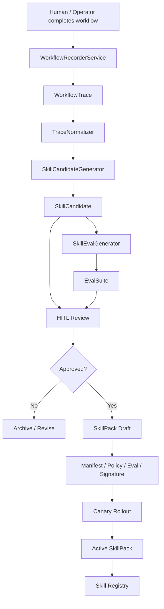
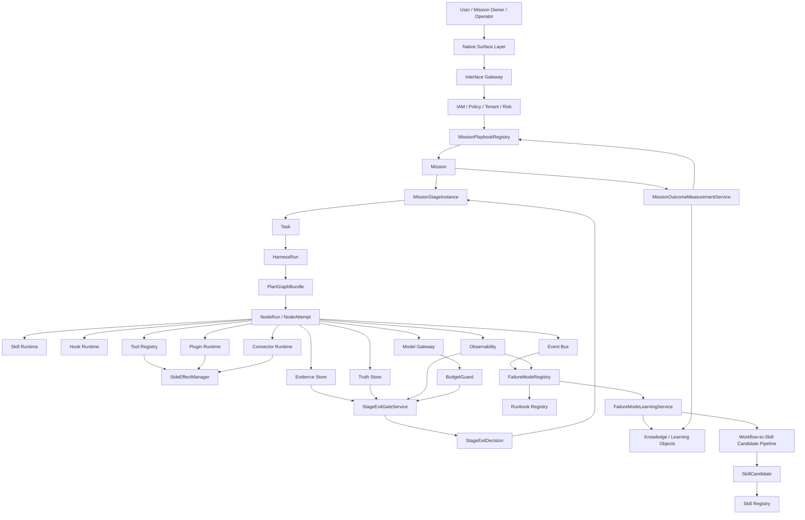

# Anthropic's Founder's Playbook to Automatic Agent Platform: Architectural Reference and Implementation Plan

> Document Status: reviewed-reference / architecture-patch-candidate
> Registry Status: repo_validation_patch_present / main_baseline_acceptance_pending
> Version: v1.6.2 — Mission Playbook Release Metadata Patch, reviewed and revised 2026-05-21
> Date: 2026-05-20, reviewed and revised: 2026-05-21
> Source Material: Anthropic "The Founder's Playbook: Building an AI-Native Startup" PDF, 36 pages; official source at [Claude Blog](https://claude.com/blog/the-founders-playbook)
> Applicable System: Automatic Agent Platform / AI-native Mission Operating System
> Goal: Abstract the AI-native startup methodology from the Playbook into platform architecture capabilities that are implementable, verifiable, auditable, and rollback-able, and close the loop with existing Mission, Task, Session, Skill, Workflow, Evidence, Validation, and Runtime Governance systems.

---

## Review Conclusions and This Revision

This document is suitable as a reference design draft for "external methodology to platform capability," but should not be read as contracts already accepted by the current repository or implementation baselines already in place. This review tightens the following based on current repository documentation and code status:

| Finding | Risk | This Revision |
|---|---|---|
| Document header declares itself `release-ready` while also stating Registry, Evidence, Runtime still pending closure | Easy to misread reference draft as already passed main baseline acceptance | Status changed to `reviewed-reference / architecture-patch-candidate`, explicitly stating these items are not yet registered in the main repository |
| Commands like `npm run playbook:*`, `stage-exit`, `mission-outcome` written as "must execute" | During review, `package.json` does not yet have these commands; acceptance path becomes paper-only | Changed to proposed command inventory; 2026-05-21 closure commands, registry patch, and report artifacts have been added to the repository; main baseline acceptance still requires separate sign-off |
| Document introduces MissionPlaybook / StageExit models but authority relationships not placed front and center | May form a second execution runtime alongside existing Mission, PlanGraph, HarnessRun, NodeRun main chain | Added "Authority Boundary and Implementation Gap", establishing that Mission Playbook only handles business stage governance and cannot replace canonical runtime |
| Source Traceability only has PDF page numbers, lacks official source fixed rules | PDF revision would cause source mapping drift | Added official source to header, preserving page number confidence level and requiring sourceRef review when formally merging |
| Metric table allows `missionId` into labels | Inconsistent with Mission high-cardinality governance | Removed high-cardinality `missionId` label, changed to low-cardinality labels with trace/evidence back-links |
| Proposals, patch plans, implementation tracks mixed together | Readers cannot determine "what can be used now" | Clearly separated "proposal, main baseline patch, implementation track" three-layer口径; remaining content still retained as design input |

This review does not negate the main design direction. Core recommendations retained: translate Playbook stages, exit criteria, failure modes, and outcome measurement into Mission governance capabilities; deleted or tightened are the over-strong statements about "already accepted, already executed, already blocked."

---

## Version History

| Version | Status | Major Changes |
|---|---|---|
| v1.0 | proposal / ready-for-review | Based on Anthropic Founder's Playbook, proposed MissionPlaybookRegistry, StageExitGateService, FailureModeRegistry, MissionOutcomeMeasurementService, Workflow-to-Skill Candidate Pipeline. |
| v1.1 | proposal / integration-ready after review | Fixed issues from v1.0 review: completed Gate/Metric/Event/Runbook Registry integration; added Mission/Task/Session lifecycle alignment; supplemented StageExit CAS/RSM/transaction semantics; changed ExitCriterion.expression to safe DSL; clarified MissionStageGraph allows controlled loops, PlanGraphBundle must be DAG; added FailureMode detection governance, Outcome delayed measurement, WorkflowRecordingPolicy, SkillCandidate lifecycle alignment, Source Traceability Matrix, Native Surface Matrix; renamed Phase A-D to Implementation Track A-D. |
| v1.2 | proposal / baseline-integration-candidate | Fixed blocking issues from v1.1 review: clarified proposed registry status and runtime enforcement boundaries; added v2.0 Baseline Integration Patch Plan; supplemented StageExitGateService transaction pseudocode and prohibited separation transaction rules; supplemented ExitCriterion DSL Validator; fixed MissionStageStatus and state machine HITL inconsistency; split SkillCandidate and SkillPack lifecycles; supplemented WorkflowRecordingPolicy default least-privilege configuration; supplemented MissionPlaybook version governance, lifecycle, rollout/rollback/signature; supplemented Outcome score layering, FailureMode vs Gate severity relationship, Native Surface action permission matrix, Implementation Track owner/dependency/exit/rollback; clarified and merged into v2.0 main document approach. |
| v1.3 | proposal / registry-closure-candidate | Fixed closure issues from v1.2 review: truly split SkillCandidate and SkillPack lifecycles; supplemented StageExit nextStageInstance atomic creation, Mission currentStage pointer update, idempotencyKey and duplicate call semantics; added MissionPlaybookResolutionPolicy and MissionPlaybookMigrationPlan; WorkflowRecordingPolicy changed to safe enum and default redacted_summary; unified SkillCandidate event aggregation boundary; Runbook severity changed to defaultSeverity + escalationRules; supplemented ExitCriterion snapshot binding, actual/expected value records; supplemented OutcomeObservation/source/confidence; supplemented MissionStageGraph edge-level guard; Implementation Tracks added observe_only→enforcing strategy; Native Surface Matrix bound Policy Action / Required Capability; Source Traceability Matrix supplemented chapter/page range; added Benchmark Monitoring Mission playbook example, Outcome→Knowledge/Artifact promotion, SkillPack policy/eval/rollback example. |
| v1.4 | proposal / baseline-acceptance-candidate | Fixed acceptance blockers from v1.3 review: split SkillCandidate conversion gate and SkillPack activation gate; supplemented SkillPack exception/terminal event and violation metrics; corrected StageExit event causality order, supplemented held/rollback/terminate branch events; StageExitGateInput added playbookVersion, remediationRef, HITL re-evaluation mandatory check; FailureMode type added triggerCondition; supplemented MissionPlaybook governance gates/metrics; WorkflowRecordingPolicy added retention deletion proof, sweep, deletion events/metrics; ExitCriterion window changed to BoundedTimeWindow; StageEdgeGuard completed risk/data/evidence/outcome; MissionOutcome Phase 1 uses BusinessImpactObservation; Runbook/CI/Track/Traceability further machine-closed. |
| v1.5 | proposal / final-acceptance-candidate | Fixed final acceptance issues from v1.4 review: fixed Markdown code fence; MissionStageInstance uses version field, expectedVersion only retained in input/command; StageEdgeGuard completed risk/data/evidence/outcome; StageExit event payload supplemented playbookVersion/idempotencyKey/criterionResults/sequence/correlationId; Runbook Registry supplemented ack/resolve SLA and human approval fields; CI Job Registry added Track A-D observe_only/enforcing mode; tightened BoundedTimeWindow, use_last_active, fencingToken, MissionOutcome score source, SkillPack Event order, and SkillCandidate/SkillPack gate boundaries. |
| v1.6 | proposal / ready-to-merge-candidate | Fixed final integration closure issues from v1.5 review: supplemented v1.5 version record and cleaned up residual v1.4 statements; Patch Plan supplemented GATE-SKILLPACK-001, skillpack-validate, SkillPack evidence refs; unified StageTransitionEventBase with EventEnvelope/Payload boundary; supplemented MissionPlaybook validation_failed/rejected/suspended events; tightened use_last_active fallback; added GATE-WORKFLOW-RECORDING-003; Runbook D.35/D.40 supplemented migration compatibility and retention/deletion metrics; MissionOutcome type deduplication; clarified mapDecisionToStageStatus, canonical enum reference, SkillPack rollback semantics, structured metric alert and gate-level CI mode. |
| v1.6.1 | proposal / final-release-closure-candidate | Fixed release closure issues from v1.6 review: deleted unregistered mission.stage.rollback_completed reference; supplemented merge checklist mission-outcome / skill-candidate / skillpack validation commands; mission.stage.completed supplemented decisionId and inherits StageTransitionEventBase; §14 transformation points synchronized SkillPack, WorkflowRecording retention, SkillPack metrics and skillpack-validate; Evidence Bundle Patch Plan supplemented playbookId / playbookResolutionRef / playbookMigrationPlanRefs; clarified Metric Alert table as human-readable summary, main registry must generate metric-alert-policy.yaml; Source Traceability Matrix added line-by-line sourceRefConfidence. |
| v1.6.2 | reviewed-reference / architecture-patch-candidate | Supplemented Release Evidence, Release Scope, Release Decision, and Merge Closure candidate commands; after 2026-05-21 review revision, document positioning tightened to reference design and main baseline patch candidate; runtime enforcement and release blocking only take effect after main repository Gate/Metric/Event/Runbook/CI/Evidence Bundle closure passes and writes to evidence bundle. |

---

## 0. One-Page Conclusion

Anthropic's Playbook core is not "startup advice," but a clear **AI-native operating model**:

```text
Idea → MVP → Launch → Scale
```

Each stage contains:

```text
Goal → Exit Criteria → Common Failure Modes → Suitable AI Surface → Executable Exercise → Judgment to Enter Next Stage
```

The direct inspiration for Automatic Agent Platform:

> We should not just treat Agent as a "task executor," but upgrade the system to an **AI-native Mission Operating System**: each Mission has stages, exit criteria, failure modes, evidence requirements, metric measurement, Skill orchestration, HITL decisions, and learning/improvement loops.

Core design conclusions:

```text
MissionPlaybookRegistry
StageExitGateService
FailureModeRegistry
MissionOutcomeMeasurementService
Workflow-to-Skill Candidate Pipeline
```

If subsequently adopted, these five new objects cannot stay as "concept documents," but must integrate with the platform's:

```text
Gate Registry
Metric Registry
Event Registry
Runbook Registry
CI Job Registry
Evidence Bundle
RSM / CAS / Lease / Fencing
Lifecycle Matrix
Data Governance
Skill / Plugin Runtime
```

### 0.1 Registry Status and Enforcement Boundaries

The Gate/Metric/Event/Runbook/CI Job proposed in this document are **proposed registry entries** before merging into the main `v2.0 Validation Baseline`; they become accepted entries only after main Registry Closure passes. The main runtime, main contracts, and main tests of the current repository must not treat entries in this reference document as accepted facts.

```yaml
registryStatus: proposed_for_validation_baseline
runtimeEnforcement: not_enabled_until_registered
releaseBlocking: false_until_accepted
```

Constraints:

```text
1. Proposed Gates in this document cannot be formal release blockers before main baseline acceptance.
2. Proposed Metrics in this document cannot be the sole alarm basis before main Metric Registry acceptance.
3. Proposed Events must first generate machine-executable payload schema before entering Event Registry.
4. Proposed Runbooks must first bind accepted Gates and accepted Metrics before entering Runbook Registry.
5. Once merged into main document, all proposed entries must pass Registry Closure validation.
```

Target merge state:

```yaml
registryStatus: accepted
runtimeEnforcement: enabled_by_validation_profile
releaseBlocking: true_for_declared_blocking_gates
```

Final goal:

```text
Upgrade from "Agent will execute" to "Mission will operate, measure, learn, and沉淀".
```

### 0.2 Release Scope / Evidence / Decision

This version's scope is **reference document layer and architecture baseline patch candidate layer**, for evaluating whether to merge into `v2.0 Validation Baseline`. Before main baseline closure, it is not called a code release, nor a runtime release.

```yaml
releaseScope:
  document: true
  architectureBaselinePatchCandidate: true
  registryPatchCandidate: true
  runtimeCodeChange: true_for_repo_baseline
  productionRuntimeEnforcement: false_until_main_baseline_accepts_registry_patch
```

Release decision has two layers:

| Layer | Current Status | Description |
|---|---|---|
| Reference Document Review | reviewed | Document structure, Registry Patch, Gate/Metric/Event/Runbook/CI/Evidence Bundle integration relationships can serve as review input. |
| Main Baseline Merge | repo closure passed / main acceptance pending | Repository has executed Registry Closure, Markdown Render Closure and Track B/C/D validation commands; formal main baseline acceptance still requires incorporating into corresponding validation profile. |
| Runtime enforcement | pending accepted registry | Only after main Registry receives and enables validation profile can new Gates become release blockers. |

Before formal merge into main baseline, must form Release Evidence Bundle:

```yaml
releaseEvidence:
  gateRegistryClosure: pending
  metricRegistryClosure: pending
  eventRegistryClosure: pending
  runbookRegistryClosure: pending
  ciJobRegistryClosure: pending
  evidenceBundleClosure: pending
  markdownRenderClosure: pending
  metricAlertPolicyGenerated: pending
  releaseEvidenceBundleRef: TBD
  registryPatchHash: TBD
  signedBy: []
  signedAt: TBD
```

The following commands were initially **closure command contracts** suggested in this document. The 2026-05-21 repository baseline implementation has written the command entries into `package.json`, generated by `scripts/validation/mission-operating-model-closure.mjs` to produce machine reports; they can serve as registry patch evidence, but whether main Validation Baseline elevates these gates to release blockers still requires separate acceptance:

```bash
npm run registry:closure
npm run playbook:validate
npm run test:e2e:stage-exit
npm run mission-outcome:validate
npm run skill-candidate:validate
npm run skillpack:validate
npm run workflow-recording:policy
npm run workflow-recording:data-boundary
npm run workflow-recording:retention
npm run docs:markdown-render
```

After sinking to database, still need to supplement three types of evidence:

| Evidence | Minimum Requirement |
|---|---|
| Command existence | `package.json` or CI workflow can locate command entry; command failure returns non-zero status |
| Artifact existence | Each closure command defines machine-readable artifact path, hash, owner |
| Main baseline reference | Gate / Metric / Event / Runbook / CI Job Registry reference these artifacts, not just this document |

After passing, main baseline status can be updated from:

```yaml
registryStatus: proposed_for_validation_baseline
runtimeEnforcement: not_enabled_until_registered
releaseBlocking: false_until_accepted
```

To:

```yaml
registryStatus: accepted
runtimeEnforcement: enabled_by_validation_profile
releaseBlocking: true_for_declared_blocking_gates
```

### 0.3 Authority Boundary and Implementation Gap

This document is in `docs_zh/reference/`; its positioning is reference design input. If this document conflicts with current platform authoritative objects, handle per the following table:

| Topic | Current Authority | What This Document Allows | What This Document Must Not Do |
|---|---|---|---|
| Mission positioning | `docs_zh/reference/mission_architecture_design_review_v1_4_full_merged.md` and existing Mission contracts | Add Mission Playbook / Stage governance candidates for Mission | Turn MissionStage into a second execution state machine alongside Harness/Node |
| Execution main chain | `PlanGraphBundle`, `HarnessRun`, `NodeRun`, `NodeAttempt` canonical runtime | Provide business stage gate, outcome, evidence constraints | Revive Step-centric or linear workflow truth |
| Validation baseline | Registry closure rules in `docs_zh/reference/automatic_agent_platform_validation_monitoring_full_v1_7_1.md` | Provide Gate/Metric/Event/Runbook/CI patch to be merged | Claim proposed registry already accepted |
| Machine contracts | Zod/OpenAPI/Event schema/CI tests | Give candidate schema and command list | Become release blocker through Markdown text alone |

Current repository review baseline:

| Object | Current Judgment |
|---|---|
| `MissionPlaybookRegistry`, `StageExitGateService` | Landed in repository baseline: Mission Playbook schema, stage instance schema, safe Exit Criterion DSL, Playbook reference validation, snapshot-based StageExit decision and `platform.mission.stage_exit_evaluated` audit event; still not main Validation Baseline release blocker |
| `MissionFailureModeRegistry`, `MissionOutcomeMeasurementService` | Track B landed in repository baseline: failure mode registration, P0 routing requirements, deduplication/suppression approval, Mission outcome layered score and outcome event audit all have referenceable services and targeted tests |
| `WorkflowRecordingService`, `SkillCandidatePipeline` | Track C landed in repository baseline: recording policy, restricted consent/redaction fail-closed, retention deletion proof, Trace→Candidate→SkillPack approval/eval/policy/signature/canary/rollback gate all have testable services |
| Research / Code / Ops Playbook | Track D landed in repository baseline: three active builtin playbooks include stage evidence, default skill, HITL edge and gate refs; still not incorrectly treating Mission Stage as execution truth |
| `playbook:validate`, `test:e2e:stage-exit`, `mission-outcome:validate`, `skill-candidate:validate`, `skillpack:validate`, `workflow-recording:*` | Become repository script entries, with registry patch evidence formed by `config/validation/mission-operating-model-registry.json` and closure report |
| Mission / Task / Session boundary, PlanGraph DAG, Evidence / Policy / Budget / HITL constraints | Should continue reusing current platform existing canonical design, not starting another set of factual models in this document |

First batch implementation evidence:

| Capability | Code | Targeted Test |
|---|---|---|
| Mission Playbook, Stage, Exit Criterion, StageExitDecision contracts | `src/platform/contracts/mission/playbook.ts` | `tests/unit/platform/contracts/mission-contracts.test.ts` |
| Playbook Registry validation and snapshot-based StageExit Gate | `src/platform/five-plane-control-plane/mission/index.ts` | `tests/unit/platform/control-plane/mission-services.test.ts` |
| Mission StageExit audit event types | `src/platform/contracts/mission/index.ts` | `tests/unit/platform/control-plane/mission-services.test.ts` |
| FailureMode / Outcome / Workflow Recording / SkillCandidate / SkillPack operating-model contracts | `src/platform/contracts/mission/operating-model.ts` | `tests/unit/platform/control-plane/mission-operating-model.test.ts` |
| Track B failure mode detection, Outcome measurement and Mission audit events | `src/platform/five-plane-control-plane/mission/operating-model.ts` | `tests/unit/platform/control-plane/mission-operating-model.test.ts` |
| Track C Workflow Trace retention and Candidate→SkillPack secure chain | `src/platform/five-plane-control-plane/mission/operating-model.ts` | `tests/unit/platform/control-plane/mission-operating-model.test.ts` |
| Track D Research / Code / Ops builtin Playbook | `src/platform/five-plane-control-plane/mission/operating-model.ts` | `tests/unit/platform/control-plane/mission-operating-model.test.ts` |
| Validation registry patch, closure commands and report generator | `config/validation/mission-operating-model-registry.json`, `scripts/validation/mission-operating-model-closure.mjs`, `package.json` | `npm run registry:closure`, `npm run playbook:validate`, `npm run mission-outcome:validate`, `npm run skill-candidate:validate`, `npm run skillpack:validate`, `npm run workflow-recording:*` |

This baseline deliberately does not do three things:

1. Does not persist `MissionStageInstance` as a second execution truth; it is currently a Mission governance contract, subsequent persistence must go through Mission truth/event design review.
2. Does not directly modify `HarnessRun`, `PlanGraphBundle` or `NodeRun` status through StageExit; execution plane continues to be controlled by canonical runtime.
3. Does not prematurely declare main Validation Baseline has elevated Gate / Metric / Runbook / CI Registry to release blockers; this round only sinks registry patch, commands and closure artifact to repository.

---

## 1. Core Content Abstraction from Playbook

### 1.1 Four-Stage Lifecycle

Playbook divides AI-native startup into four stages:

| Stage | Core Question | Key Output | Exit Condition |
|---|---|---|---|
| Idea | Is this problem real, specific, and worth doing? | problem hypothesis, customer discovery, competitive map, solution concept | problem-solution fit |
| MVP | What minimum verifiable product should be built first? | MVP scope, architecture context, security review, measurement framework | real PMF evidence |
| Launch | Can the business grow stably and withstand production pressure? | production hardening, ops workflows, security/compliance, product management process | repeatable growth, production-ready, operations no longer depend on founder |
| Scale | Can the organization and product be audited, sustainable, and hard to replicate? | governance, SLA, support infra, GTM system, data/workflow moat | systematic growth, governance maturity, moat established |

For us, this stage model should not be directly copied, but abstracted as:

```text
Mission Stage Model
```

Different Mission Types have their own stage graphs:

```text
Research Intelligence Mission:
  discover → review → validate → publish → monitor → improve

Code Agent Mission:
  understand → plan → implement → test → review → merge → monitor

Ops Mission:
  detect → triage → mitigate → recover → postmortem → harden

Benchmark Monitoring Mission:
  ingest → normalize → evaluate → compare → report → alert → improve
```

---

### 1.2 Founder Changes from Individual Contributor to Orchestrator

Playbook explicitly points out: in AI-native startup, founder's role shifts from personally writing code, operating, and managing daily tasks to **orchestrator of agents**. This exactly corresponds to our system:

```text
Mission Owner / Operator / Reviewer
```

Platform UI and runtime should be layered:

| Role | Should See | Should Not Directly Expose |
|---|---|---|
| Regular business user | Mission goal, progress, risk, evidence, decision needed, final output | NodeAttempt, lease, fencing, CAS, raw events |
| Operator | Mission, Task, PlanGraph, NodeRun, HITL Queue, Runbook, SLO | Low-level storage implementation details |
| Platform Engineering | EventLog, TruthStore, CAS, Lease, Fencing, DLQ, Projection, Metric, Trace | None |

This again supports "de-emphasizing step concept" direction in system design: users should face Mission / Stage / Outcome / Evidence, not Step.

---

### 1.3 AI-native's Key Is Not Faster Execution, But Evidence-Based Execution

Playbook repeatedly emphasizes in Idea stage: AI lowers build threshold, but cannot mistake "can build" for "already validated." In MVP stage, it also emphasizes AI coding accelerates but creates agentic technical debt, requiring architecture context, scope documentation, security review and measurement framework.

Corresponding to Automatic Agent Platform:

```text
AI-native ≠ skip process
AI-native = automatic execution + automatic evidence + automatic evaluation + automatic feedback + human handles high-value judgment
```

Must insist on:

```text
no evidence, not allowed to release
no exit criteria, not allowed to advance
no policy decision, not allowed to have side effect
no budget reservation, not allowed to make model/tool call
no audit trail, not allowed to have HITL / autonomy override
no stage exit decision, not allowed to advance MissionStage
```

---

## 2. Source Traceability Matrix: From Anthropic Playbook to Platform Design Objects

> Note: Page/chapter ranges are manually verified based on current PDF table of contents and paragraph structure, `sourceRefConfidence=medium`; should be re-verified by document owner before formal merge.

> Page ranges reference the 36-page PDF uploaded by user, for internal traceability. If PDF is subsequently revised, should regenerate `sourceRef` for this table.

> Translation boundary: "platform objects / Gate / Registry" in the table below are Automatic Agent Platform architectural derivations, not Anthropic original definitions. If subsequently citing original text for product or market conclusions, should return to official original for review, should not反向把本表当成原文替代.

| Playbook Source | PDF Chapter / Page Range | sourceRefConfidence | Original Topic / Design Intent | Our Abstraction | Platform Object | Corresponding Gate / Registry |
|---|---|---|---|---|---|---|
| Startup lifecycle rebooted | Ch.1 / p.3-4 | medium | Idea / MVP / Launch / Scale redefine AI-native startup lifecycle | Mission Stage Model | MissionPlaybook, MissionStageGraph | GATE-MISSION-PLAYBOOK-001 |
| Founder as orchestrator | Ch.2 / p.5-7 | medium | founder shifts from individual contributor to agent orchestrator | Mission Owner / Operator | Native Surface Matrix, Operator Cockpit | UI Authorization Matrix / Runbook Registry |
| Idea Stage | Ch.3 / p.8-14 | medium | Validate before build, avoid mistaking "can build" for "worth building" | stage exit criteria upfront | StageExitGateService, ExitCriterion DSL | GATE-MISSION-PLAYBOOK-002 / 004 |
| Idea Stage Exercises | Ch.3 / p.8-14 | medium | customer discovery, competitive landscape, hypothesis pressure test | Research / Market / Hypothesis SkillPack | Mission Template, SkillPack | GATE-SKILL-CANDIDATE-001 |
| MVP Stage | Ch.4 / p.15-20 | medium | AI coding accelerates but creates technical debt | Code Agent hardening gates | Architecture Gate, Security Gate, Test Quality Gate | GATE-TEST-001 / GATE-SECURITY-001 |
| MVP Stage | Ch.4 / p.15-20 | medium | Scope, architecture context, measurement framework | Mission cannot just produce output, must also be measurable | MissionOutcomeMeasurementService | GATE-MISSION-OUTCOME-001 |
| Launch Stage | Ch.5 / p.21-24 | medium | Operating system uses agentic workflows to replace founder attention | Mission Operating Workflow | MissionPlaybook + Runbook + Operator Cockpit | GATE-RUNTIME-001 / GATE-OBS-001 |
| Launch Stage | Ch.5 / p.21-24 | medium | Security, compliance, production hardening | Governance cannot be的后置 | Policy, Data Governance, SideEffect | GATE-DATA-001 / GATE-SIDEEFFECT-001 |
| Scale Stage | Ch.6 / p.25-30 | medium | Workflow/data moat, domain knowledge, proprietary process | Capabilities沉淀 as Skill / Knowledge / Playbook | Workflow-to-Skill Candidate Pipeline | GATE-WORKFLOW-RECORDING-001 / 002 |
| Scale Stage | Ch.6 / p.25-30 | medium | Auditable governance, organizational maturity, data flywheel | Platform moat comes from workflow/evidence/knowledge compound interest | Knowledge Graph, Skill Catalog, MissionOutcome | Metric / Evidence / Knowledge Registry |

---

## 3. Core Insights for Automatic Agent Platform

### 3.1 Mission Must Be Staged

Current Mission should not just be a long-term container. It should have:

```text
MissionStageGraph
MissionStageInstance
StageExitCriteria
StageFailureModes
StageMetrics
StageDefaultSkills
StageRunbooks
StageEvidenceRequirements
```

Key constraints:

```text
Mission Stage is not Step.
Stage is business lifecycle state; NodeRun is execution-time node; Task is work unit under Mission.
```

---

### 3.2 MissionStageGraph Can Have Controlled Loops, But PlanGraphBundle Must Be DAG

Must clarify the semantic difference between two "graphs":

| Graph | Allow Loop | Purpose | Constraint |
|---|---:|---|---|
| MissionStageGraph | Allows controlled loops | Express business lifecycle, e.g., monitor → improve → review | Each loop must create new `stageInstanceId`, constrained by maxCycle / dwellTime / budget / approval guard |
| PlanGraphBundle | No loops, must be DAG | Express one HarnessRun execution plan | Must pass DAG validation, dependency validation, worst-path budget validation |

Example:

```text
MissionStageGraph:
  publish → monitor → improve → review   # legal, represents business continuous improvement loop

PlanGraphBundle:
  nodeA → nodeB → nodeA                   # illegal, execution plan cannot loop
```

Suggested objects:

```ts
type MissionStageInstance = {
  stageInstanceId: string;
  missionId: string;
  playbookId: string;
  playbookVersion: string;
  stageId: string;
  cycleIndex: number;
  parentStageInstanceId?: string;
  status: MissionStageStatus;
  version: number; // current CAS version; expectedVersion only allowed in command/input
  enteredAt: string;
  exitedAt?: string;
};
```

Loop control:

```ts
type MissionStageCycleGuard = {
  maxCycles: number;
  minDwellTimeMs?: number;
  maxDwellTimeMs?: number;
  requireApprovalAfterCycle?: number;
  maxBudgetUsdPerCycle?: number;
};

type MissionStageEdgeGuard = {
  edgeId: string;
  fromStageId: string;
  toStageId: string;
  requiredGates: string[];
  requiresHitl: boolean;
  requiredCapabilities: string[];
  minDwellTimeMs?: number;
  maxBudgetUsd?: number;
  allowedRuntimeModes: RuntimeMode[];
  maxAllowedRiskLevel: RiskLevel;
  allowedDataClasses: DataClass[];
  requiresEvidenceBundle: boolean;
  requiresOutcomeReport: boolean;
};
```

Edge-level guard distinguishes risk of different stage edges. For example `validate → publish` should be stricter than `monitor → improve`. All stage transitions must first check edge guard, then evaluate exit criteria.

Canonical enum requirement:

```text
RiskLevel / DataClass / RuntimeMode must reference v2.0 canonical contracts; this document must not redefine these enums.
All Playbook DSL, StageEdgeGuard, Policy Action and Native Surface Matrix must reuse the same canonical enum, avoiding RiskLevel / RuntimeMode appearing in multiple places with definition and sort conflicts.
```

```yaml
edges:
  - edgeId: research.validate_to_publish
    from: validate
    to: publish
    requiredGates:
      - GATE-EVIDENCE-001
      - GATE-MISSION-OUTCOME-001
      - GATE-DATA-001
    requiresHitl: true
    requiredCapabilities:
      - mission.publish
    allowedRuntimeModes:
      - supervised
      - manual_only
    maxAllowedRiskLevel: medium
    allowedDataClasses:
      - public
      - internal
    requiresEvidenceBundle: true
    requiresOutcomeReport: true
```

---

### 3.3 MissionStageStatus Adjustment

In v1.0, `rolled_back` was defined as a long-term state. v1.1 corrects: rollback is a transition result, not a stable long-term state.

```ts
type MissionStageStatus =
  | "pending"
  | "active"
  | "exit_evaluating"
  | "held"
  | "blocked"
  | "completed"
  | "terminated";
```

Rollback is expressed through events and decisions:

```text
mission.stage.rollback_requested
```

Rollback completion is expressed by recovery/migration process through separate Runbook or MigrationPlan; StageExit itself only produces `rollback_requested`, does not define `mission.stage.rollback_completed`, avoiding treating rollback completion as synchronous result of StageExit.

---

### 3.4 Each Stage Must Have Exit Criteria, and Must Use Safe DSL

v1.0 used:

```ts
expression: string;
```

This introduces risks of arbitrary code execution, unanalyzable statically, unauditable, unplayable. v1.1 changed to safe DSL.

```ts
type BoundedTimeWindow =
  | { type: "duration"; iso8601: string; maxDurationMs: number }
  | { type: "stage"; stageInstanceId: string; maxDurationMs: number }
  | { type: "mission"; missionId: string; maxDurationMs: number };

type ExitCriterionExpression =
  | {
      type: "metric_threshold";
      metric: string;
      operator: "==" | "!=" | ">=" | ">" | "<=" | "<";
      value: number | string | boolean;
      window?: BoundedTimeWindow;
    }
  | {
      type: "event_count";
      eventName: string;
      operator: "==" | "!=" | ">=" | ">" | "<=" | "<";
      value: number;
      window?: BoundedTimeWindow;
    }
  | {
      type: "evidence_exists";
      evidenceKind: string;
      minCount?: number;
    }
  | {
      type: "hitl_decision";
      decisionType: string;
      requiredDecision: "approved" | "rejected" | "request_changes";
    }
  | {
      type: "all_of";
      criteria: ExitCriterionExpression[];
    }
  | {
      type: "any_of";
      criteria: ExitCriterionExpression[];
    }
  | {
      type: "not";
      criterion: ExitCriterionExpression;
    };

type ExitCriterion = {
  criterionId: string;
  name: string;
  severity: "P0" | "P1" | "P2";
  expression: ExitCriterionExpression;
  requiredEvidenceRefs: string[];
  requiredMetricRefs: string[];
  failureModeRef?: string;
  gateId: string;
};
```

Safety requirements:

```text
Prohibit arbitrary JS / Python / shell execution.
Prohibit network IO.
Prohibit reading real-time mutable state.
Can only read metric/evidence/risk/budget/HITL snapshot bound in StageExitGateInput.
All metric / event / evidence kind must exist in Registry.
Expressions must be statically verifiable, serializable, replayable.
```

#### 3.4.1 ExitCriterion Snapshot Binding and Validator

ExitCriterion can only compute based on immutable snapshot in StageExit input. Each computation must record actual value, expected value, expression hash and snapshot reference, ensuring subsequent replay interpretability.

```ts
type ExitCriterionEvaluationContext = {
  metricSnapshotRef: string;
  evidenceSnapshotRef: string;
  riskSnapshotRef: string;
  budgetSnapshotRef: string;
  hitlDecisionSnapshotRef?: string;
  evaluatedAt: string;
};

type ExitCriterionEvaluationResult = {
  criterionId: string;
  expressionHash: string;
  passed: boolean;
  actualValue: number | string | boolean | null;
  expectedValue: number | string | boolean | null;
  snapshotRefs: string[];
  evidenceRefs: string[];
  reasonCode?: string;
};

type ExitCriterionValidationResult = {
  valid: boolean;
  errors: Array<{
    code:
      | "UNKNOWN_METRIC"
      | "UNKNOWN_EVENT"
      | "UNKNOWN_EVIDENCE_KIND"
      | "INVALID_OPERATOR"
      | "TYPE_MISMATCH"
      | "UNBOUNDED_WINDOW"
      | "UNSAFE_NEGATION"
      | "MAX_DEPTH_EXCEEDED";
    path: string;
    message: string;
  }>;
};
```

Validation rules:

| Validation Item | Requirement |
|---|---|
| metric | Must exist in Metric Registry |
| eventName | Must exist in Event Registry |
| evidenceKind | Must exist in Evidence Schema Registry |
| operator | Must be type-compatible with value |
| window | Must use `BoundedTimeWindow`, not bare string or unlimited window |
| not | P0 gate does not allow bare `not` wrapping external event absence |
| recursive depth | DSL nesting depth must be limited, prevent DoS |

`BoundedTimeWindow` additional constraints:

```text
stage window maxDurationMs must be explicitly provided; active stage does not allow unlimited window.
duration window maxDurationMs must be less than or equal to MissionProfile.maxExitEvaluationWindowMs.
mission window only allows reading current mission's immutable snapshot, not cross-mission aggregation.
```

Research Intelligence Mission example:

```yaml
missionType: research_intelligence
stage: review
exitCriteria:
  - criterionId: research.review.evidence_coverage
    severity: P0
    gateId: GATE-EVIDENCE-001
    expression:
      type: metric_threshold
      metric: aa.mission.outcome.evidence_coverage_ratio
      operator: ==
      value: 1.0

  - criterionId: research.review.quality
    severity: P1
    gateId: GATE-MISSION-OUTCOME-001
    expression:
      type: metric_threshold
      metric: aa.mission.outcome.quality_score
      operator: ">="
      value: 0.85

  - criterionId: research.review.no_unresolved_claim
    severity: P0
    gateId: GATE-EVIDENCE-001
    expression:
      type: metric_threshold
      metric: aa.claim.unsupported.count
      operator: ==
      value: 0
```

---

### 3.5 Establish Failure Mode Registry

Playbook gives common failure modes at each stage. We should systematize this:

```ts
type FailureMode = {
  failureModeId: string;
  missionType: string;
  stage: string;
  name: string;
  severity: "P0" | "P1" | "P2";
  description: string;
  detectionMetrics: string[];
  detectionEvents: string[];
  triggerCondition: ExitCriterionExpression;
  linkedGates: string[];
  linkedRunbooks: string[];
  defaultAction: "block" | "hold" | "require_hitl" | "rollback" | "quarantine" | "monitor";
  recoveryPlaybookRef?: string;
  learningAction?: "create_eval" | "update_skill" | "update_playbook" | "add_guardrail";
  detectionPolicy: FailureModeDetectionPolicy;
};

type FailureModeDetectionPolicy = {
  minSampleSize?: number;
  debounceWindowMs?: number;
  recurrenceWindowMs?: number;
  dedupeKeyTemplate: string;
  falsePositiveReviewRequired: boolean;
  suppressionRequiresApproval: boolean;
  suppressionTtlMs?: number;
  escalationRules: Array<{
    condition: ExitCriterionExpression;
    severity: "P0" | "P1" | "P2";
  }>;
};
```

Governance requirements:

```text
Same failure mode must be deduplicated by dedupeKey.
High-frequency false positives must enter false-positive review.
Temporary suppression must have owner, expiry, auditRef.
P0 failure mode does not allow silent suppression.
recurrence must generate learning object or eval case.
```

---

### 3.6 Introduce Mission Outcome Measurement Framework

Playbook mentions MVP stage should establish measurement framework early, avoiding misreading early heat as PMF. For us, Agent completing task does not equal Mission success.

This document splits Outcome into four layers, adding `OutcomeObservation` to prevent system "claiming success" without adopting evidence:

```text
Execution Success        # whether execution completed
Immediate Outcome        # whether output is qualified
Delayed Outcome          # whether adopted after some time
Business Impact          # whether formed business value / experiment / decision / knowledge asset
```

Suggested objects:

```ts
type BusinessImpactObservation =
  | { type: "downstream_task_created"; taskId: string; evidenceRefs: string[] }
  | { type: "experiment_created"; experimentId: string; evidenceRefs: string[] }
  | { type: "knowledge_promoted"; knowledgeObjectId: string; evidenceRefs: string[] };

type MissionOutcomeScores = {
  executionScore: number;
  qualityScore: number;
  evidenceScore: number;
  adoptionScore?: number;
  // Phase 1 does not directly hand-write abstract businessImpactScore;
  // business impact is obtained through BusinessImpactObservation aggregation.
  businessImpactScore?: number;
};

type OutcomeObservation = {
  observationId: string;
  outcomeType:
    | "human_adoption"
    | "experiment_created"
    | "decision_adopted"
    | "knowledge_promoted"
    | "downstream_task_created";
  source: "manual_review" | "system_event" | "downstream_task" | "external_integration";
  confidence: number;
  observedAt: string;
  evidenceRefs: string[];
  reviewerRefs?: string[];
};

type MissionOutcomeReport = {
  reportId: string;
  missionId: string;
  missionType: string;
  generatedAt: string;
  measurementWindow: "immediate" | "7d" | "30d" | "custom";
  baselineRef?: string;
  delayedOutcomeRef?: string;
  reviewerRefs: string[];
  scores: MissionOutcomeScores;
  observations: OutcomeObservation[];
  scoresGeneratedFromRefs: string[];

  completion: {
    completed: boolean;
    terminalStatus: string;
    stageCompletionRatio: number;
  };

  quality: {
    score: number;
    rubricVersion: string;
    humanReviewScore?: number;
  };

  evidence: {
    coverageRatio: number;
    sourceReliabilityMean: number;
    unresolvedClaimCount: number;
  };

  cost: {
    totalUsd: number;
    modelUsd: number;
    toolUsd: number;
    costPerAcceptedOutput: number;
  };

  latency: {
    timeToFirstUsefulOutputMs: number;
    totalDurationMs: number;
  };

  risk: {
    highestRiskLevel: string;
    policyDenialCount: number;
    hitlEscalationCount: number;
  };

  learning: {
    skillCandidateCount: number;
    evalCaseCreatedCount: number;
    playbookUpdateCount: number;
    knowledgeObjectPromotedCount: number;
  };
};
```

Core principles:

```text
Mission success = output adopted / evidence complete / cost controlled / risk controlled / can沉淀 improvement.
Not just "finished running".
MissionOutcomeScores are standardized results; MissionOutcomeReport.quality/evidence/cost/latency/risk are original scoring details.
Metric Registry only collects standardized fields of MissionOutcomeScores, and traces back to original sources through scoresGeneratedFromRefs.
```

---

### 3.7 Workflow-to-Skill Candidate Pipeline

Playbook emphasizes operational workflows can be taken over by AI, and in Scale stage founder's implicit knowledge becomes reusable systems. We can implement this as:

```text
Workflow Trace
→ Skill Candidate
→ Eval Set
→ HITL Review
→ SkillPack Draft
→ Policy / Sandbox / SBOM / Eval
→ Canary Rollout
→ Active Skill
```

New components:

```text
WorkflowRecorderService
TraceNormalizer
SkillCandidateGenerator
SkillEvalGenerator
SkillPromotionService
SkillRolloutService
```

Key constraints:

```text
Recording process cannot directly become production Skill.
SkillCandidate approved does not equal active Skill.
SkillCandidate only expresses "candidate capability has been accepted", cannot carry SkillPack / SkillRuntime lifecycle.
SkillPack must independently go through manifest, policy, SBOM, eval, signature, canary, activation.
```

#### 3.7.1 SkillCandidate Lifecycle

```text
draft
→ under_review
→ approved
→ converted_to_skillpack
```

Exception paths:

```text
under_review → rejected
approved → rejected       # re-review discovers risk
```

```ts
type SkillCandidateStatus =
  | "draft"
  | "under_review"
  | "approved"
  | "rejected"
  | "converted_to_skillpack";

type SkillCandidate = {
  candidateId: string;
  sourceWorkflowTraceRef: string;
  proposedSkillId: string;
  proposedName: string;
  proposedDescription: string;
  inferredTriggers: string[];
  requiredTools: string[];
  requiredPermissions: string[];
  riskLevel: RiskLevel;
  generatedInstructionsRef: string;
  generatedEvalSuiteRef: string;
  policyDraftRef: string;
  rollbackStrategyRef: string;
  owner: string;
  status: SkillCandidateStatus;
};
```

#### 3.7.2 SkillPack Lifecycle

```text
draft
→ manifest_validated
→ policy_validated
→ sbom_scanned
→ eval_passed
→ signed
→ canary
→ active
→ suspended / deprecated / revoked / archived
```

```ts
type SkillPackStatus =
  | "draft"
  | "manifest_validated"
  | "policy_validated"
  | "sbom_scanned"
  | "eval_passed"
  | "signed"
  | "canary"
  | "active"
  | "suspended"
  | "deprecated"
  | "revoked"
  | "archived";
```

Conversion rules:

```text
skill_candidate.approved
→ skill_candidate.converted_to_skillpack
→ skillpack.draft.created
→ skillpack.manifest.validated
→ skillpack.policy.validated
→ skillpack.sbom.scanned
→ skillpack.eval.passed
→ skillpack.signed
→ skillpack.canary.started
→ skillpack.activated
```

---

## 4. Mission / Task / Session Lifecycle Alignment

### 4.1 All Three Need Lifecycle, But Cannot Share One Lifecycle

```text
Mission lifecycle = business goal / long-term plan / stage advancement
Task lifecycle    = executable work item / queued execution / blocked recovery
Session lifecycle = human-machine interaction context / conversation window / approval context
```

| Object | Lifecycle Type | Role |
|---|---|---|
| Mission | Business lifecycle + stage lifecycle | Manage long-term goals, stage advancement, output沉淀 |
| Task | Work item lifecycle | Manage creation, execution, blocking, completion of single executable task |
| Session | Interaction lifecycle | Manage human-machine dialogue, approval, context window |
| HarnessRun | Execution lifecycle | Manage one controlled run |
| PlanGraphBundle | Plan lifecycle | Manage DAG plan generation, validation, replacement |
| NodeRun | Running node lifecycle | Manage single node execution |
| NodeAttempt | Attempt lifecycle | Manage one specific execution attempt |

---

### 4.2 Mission Lifecycle

```text
draft → active → paused → completed → archived
```

Exception paths:

```text
draft → cancelled
active → failed
active → cancelled
active → suspended
paused → active
failed → archived
cancelled → archived
completed → archived
suspended → active / cancelled / archived
```

Mission completion must satisfy:

```text
Mission exit criteria all satisfied
All required Task terminal
All required evidence complete
No open blocker
No unresolved HITL
No blocking incident
```

---

### 4.3 MissionStage Lifecycle

```text
pending → active → exit_evaluating → completed
```

Exception paths:

```text
active → held
active → blocked
active → terminated
exit_evaluating → held / blocked / terminated
held → active
blocked → active / terminated
```

Stage advancement must be generated by `StageExitGateService` creating `StageExitDecision`, manual modification of `currentStageId` prohibited.

---

### 4.4 Task Lifecycle

```text
created → admitted → planned → queued → running → completed
```

Blocking paths:

```text
running → blocked → running
running → waiting_hitl → running
running → failed → retrying → queued
```

Terminal states:

```text
completed
failed
cancelled
expired
completed_with_exception
```

Task should not carry long-term business stage. For example, should not use:

```text
Task.stage = discover / review / validate / publish
```

More reasonable:

```text
Mission.stage = review
Task.type = paper_review
Task.status = running
```

---

### 4.5 Session Lifecycle

```text
open → active → idle → closed → archived
```

Exception paths:

```text
active → suspended
active → expired
active → transferred
idle → active
suspended → active / closed
```

Session is interaction entry, not long-term lifecycle main axis. Session can create Task, but Task should not depend on Session survival.

Correct relationship:

```text
Session creates Task
Task links back to Session as sourceSessionId
Task continues even if Session closed
```

Wrong relationship:

```text
Session closed → Task cancelled
Session expired → Mission paused
Session memory = Mission truth
```

---

### 4.6 Lifecycle Invariants

```text
INV-LIFECYCLE-001:
Mission, Task, Session must have independent lifecycles, cannot share same state enum.

INV-LIFECYCLE-002:
Session terminal must not automatically terminate Task or Mission.

INV-LIFECYCLE-003:
Task terminal must not automatically complete Mission, must go through StageExitGate judgment.

INV-LIFECYCLE-004:
Mission stage advance must generate StageExitDecision.

INV-LIFECYCLE-005:
All terminal states must be immutable, unless through explicit repair / reopen protocol generating new run.

INV-LIFECYCLE-006:
All state transitions must produce PlatformFactEvent.

INV-LIFECYCLE-007:
Cross-layer state propagation must go through events and decision services, direct mutation of upper-layer objects not allowed.

INV-LIFECYCLE-008:
Session memory is not Truth, cannot be used as Mission / Task authoritative state source.
```

---

## 5. New Architecture Module Design

### 5.1 MissionPlaybookRegistry

Responsibilities:

```text
Manage stage graphs, default skills, exit criteria, failure modes, measurement frameworks, operational boundaries for different MissionTypes.
```

Suggested directory:

```text
src/platform/orchestration/mission-playbooks/
  mission-playbook-model.ts
  mission-playbook-registry.ts
  mission-playbook-validator.ts
  mission-stage-graph-validator.ts
  mission-playbook-repository.ts
  builtins/
    research-intelligence.playbook.yaml
    code-agent.playbook.yaml
    ops-incident.playbook.yaml
    benchmark-monitoring.playbook.yaml
```

Playbook schema example:

```yaml
playbookId: research_intelligence_v1
missionType: research_intelligence
version: 1.0.0
owner: research-platform
status: active

stageGraph:
  cycleGuard:
    maxCycles: 5
    requireApprovalAfterCycle: 3
    maxBudgetUsdPerCycle: 20
  nodes:
    - discover
    - review
    - validate
    - publish
    - monitor
    - improve
  edges:
    - from: discover
      to: review
    - from: review
      to: validate
    - from: validate
      to: publish
    - from: publish
      to: monitor
    - from: monitor
      to: improve
    - from: improve
      to: review

stageDefinitions:
  review:
    purpose: "extract claims, evidence, and self-research value"
    defaultSkills:
      - paper-review
      - claim-evidence-linking
    exitCriteria:
      - criterionId: research.review.evidence_coverage
        severity: P0
        gateId: GATE-EVIDENCE-001
        expression:
          type: metric_threshold
          metric: aa.mission.outcome.evidence_coverage_ratio
          operator: ==
          value: 1.0
    failureModes:
      - unsupported_claim
      - summary_without_judgment
```

---

### 5.1.1 MissionPlaybook Version Governance and Lifecycle

MissionPlaybook itself must be governed as a config/policy object, cannot be statically referenced as an ordinary Markdown document.

Lifecycle:

```text
draft
→ validated
→ canary
→ active
→ deprecated
→ archived
```

Exception paths:

```text
validation_failed → rejected
active → suspended
critical_issue → revoked
```

Suggested fields:

```yaml
playbookId: research_intelligence_v1
version: 1.0.0
status: active
compatibility:
  minPlatformVersion: "2.0.0"
  compatibleMissionSchemaVersions:
    - "1.x"
rollout:
  mode: canary
  percentage: 5
  targetTenants:
    - internal-research
rollback:
  previousVersion: research_intelligence_v0_9
  rollbackAllowed: true
signature:
  signedBy: platform-architecture
  signatureRef: artifact://signature/research_intelligence_v1
```

New events:

```text
mission.playbook.validated
mission.playbook.validation_failed
mission.playbook.rejected
mission.playbook.canary.started
mission.playbook.activated
mission.playbook.deprecated
mission.playbook.suspended
mission.playbook.revoked
mission.playbook.archived
```

Hard constraints:

```text
active MissionPlaybook must have version, compatibility, signature, rollbackRef.
canary playbook cannot be default playbook for all tenants.
revoked playbook cannot create new Mission.
existing Mission using revoked playbook must enter controlled migration / hold.
```

### 5.1.2 MissionPlaybookResolutionPolicy

When Mission is created, must resolve and lock `playbookId + playbookVersion`; running Mission must not automatically drift to new playbook.

```ts
type MissionPlaybookResolutionPolicy = {
  missionType: string;
  tenantId: string;
  requestedPlaybookId?: string;
  requestedVersion?: string;
  allowCanary: boolean;
  tenantOverrideAllowed: boolean;
  fallbackPolicy: "fail_closed" | "use_last_active" | "manual_selection";
};

type MissionPlaybookResolutionResult = {
  playbookId: string;
  playbookVersion: string;
  resolutionReason: "explicit_request" | "tenant_override" | "canary_rollout" | "default_active";
  rolloutRef?: string;
  auditRef: string;
};
```

Resolution rules:

```text
Mission creation must lock playbookId + playbookVersion.
Running Mission must not automatically drift to new playbookVersion.
revoked playbook cannot create new Mission.
existing Mission using revoked playbook must enter hold / controlled migration.
canary playbook can only be hit through explicit rollout policy.
No available playbook must fail-closed, cannot fallback to running without playbook.
`use_last_active` only allowed when all following conditions are met: last active playbook not revoked / suspended / archived; compatibility still passes; tenant still authorized; rollback / migration policy allows; and generates resolution auditRef. Otherwise must `fail_closed`.
Any fallback hit must produce `aa.mission.playbook.use_last_active.count`; any blocked unsafe fallback must produce `aa.mission.playbook.unsafe_fallback_blocked.count`.
```

### 5.1.3 MissionPlaybookMigrationPlan

When playbook upgrades, revokes, or compatibility breaks, must generate explicit migration plan.

```ts
type MissionPlaybookMigrationPlan = {
  migrationPlanId: string;
  fromPlaybookId: string;
  fromVersion: string;
  toPlaybookId: string;
  toVersion: string;
  affectedMissionIds: string[];
  migrationMode: "hold_then_manual" | "auto_if_compatible" | "terminate_and_recreate";
  compatibilityReportRef: string;
  approvalRef?: string;
  rollbackPlanRef: string;
  auditRef: string;
};
```

Hard constraints:

```text
Directly replacing running Mission's playbookVersion not allowed.
Incompatible migration must have HITL approval.
Before migration must generate compatibilityReportRef.
After migration must retain original playbookVersion for replay.
```

### 5.2 StageExitGateService

Responsibilities:

```text
Before each MissionStage ends, read playbook, metrics, evidence, risk, budget, HITL decisions, judge whether allowed to enter next stage.
```

Input:

```ts
type StageExitGateInput = {
  missionId: string;
  stageInstanceId: string;
  stageId: string;
  playbookId: string;
  playbookVersion: string;
  expectedVersion: number;
  idempotencyKey: string;
  metricSnapshotRef: string;
  evidenceSnapshotRef: string;
  evidenceRefs: string[];
  riskStateRef: string;
  budgetStateRef: string;
  hitlDecisionSnapshotRef?: string;
  hitlDecisionRefs?: string[];
  remediationRef?: string;
  principal: PlatformPrincipal;
  auditRef: string;
};
```

Output:

```ts
type StageExitDecision = {
  decisionId: string;
  missionId: string;
  stageInstanceId: string;
  stageId: string;
  playbookId: string;
  playbookVersion: string;
  idempotencyKey: string;
  decision: "advance" | "hold" | "rollback" | "require_hitl" | "terminate";
  targetStageId?: string;
  failedCriteria: string[];
  passedCriteria: string[];
  criterionResults: ExitCriterionEvaluationResult[];
  evidenceRefs: string[];
  metricSnapshotRefs: string[];
  failureModeRefs: string[];
  requiredActions: string[];
  auditRef: string;
  decidedAt: string;
};
```

CAS / RSM / Transaction semantics:

```ts
type StageTransitionCommand = {
  missionId: string;
  stageInstanceId: string;
  expectedVersion: number;
  fromStage: string;
  toStage?: string;
  decisionId: string;
  fencingToken: string;
  auditRef: string;
};
```

Hard constraints:

```text
StageExitDecision, current stage update, next stage creation, mission currentStageInstanceId update, event append must be in same transaction.
expectedVersion mismatch must reject.
Only one successful terminal decision per stageInstanceId.
StageExitGateService failure must fail-closed.
Stage advance not allowed to bypass RSM / CAS.
All metric/evidence/risk/budget/HITL input must come from immutable snapshot.
input.playbookId / input.playbookVersion must exactly match Mission locked version, StageInstance version.
stage held state re-evaluate must provide remediationRef or approved hitlDecisionRef.
StageTransitionCommand.fencingToken must be provided; only equivalent fencing via same-transaction getForUpdate + row-level lock can be encapsulated as internal token at implementation layer.
```

Duplicate call semantics:

| Scenario | Behavior |
|---|---|
| Same `idempotencyKey` retry | Return original decision, do not repeat create stage / event |
| Different `idempotencyKey` but stage already completed / terminated | Reject, return `STAGE_ALREADY_TERMINAL` |
| stage held re-evaluate | Must carry remediationRef / hitlDecisionRef, generate new idempotencyKey |
| rollback / advance concurrency | CAS only allows one to succeed, other returns version conflict |

Unique constraints:

```text
unique(missionId, stageInstanceId, idempotencyKey)
unique(stageInstanceId, successfulTerminalDecision)
```

Transaction flow suggestion:

```ts
type StageTransitionEventBase = {
  missionId: string;
  stageInstanceId: string;
  stageId: string;
  playbookId: string;
  playbookVersion: string;
  decisionId: string;
  sequence: number;
  correlationId: string;
  causationId?: string;
  auditRef: string;
};

function toStageExitEvaluatedPayload(
  decision: StageExitDecision,
  eventMeta: Pick<StageTransitionEventBase, "sequence" | "correlationId" | "causationId">,
): MissionStageExitEvaluatedPayload {
  return {
    ...decision,
    sequence: eventMeta.sequence,
    correlationId: eventMeta.correlationId,
    causationId: eventMeta.causationId,
  };
}

async function evaluateAndTransitionStage(input: StageExitGateInput) {
  return db.transaction(async (tx) => {
    const priorDecision = await stageExitDecisionRepo.findByIdempotencyKey(tx, {
      missionId: input.missionId,
      stageInstanceId: input.stageInstanceId,
      idempotencyKey: input.idempotencyKey,
    });
    if (priorDecision) return priorDecision;

    const mission = await missionRepo.getForUpdate(tx, input.missionId);
    const stage = await stageRepo.getForUpdate(tx, input.stageInstanceId);

    assert(stage.version === input.expectedVersion);
    assert(mission.currentStageInstanceId === stage.stageInstanceId);
    assert(stage.status === "active" || stage.status === "exit_evaluating" || stage.status === "held");
    assert(input.playbookId === mission.playbookId);
    assert(input.playbookVersion === mission.playbookVersion);
    assert(stage.playbookId === mission.playbookId);
    assert(stage.playbookVersion === mission.playbookVersion);
    if (stage.status === "held") {
      assert(input.remediationRef || hasApprovedHitlDecision(input.hitlDecisionRefs ?? []));
    }

    const metricSnapshot = await metricSnapshotRepo.loadImmutable(tx, input.metricSnapshotRef);
    const evidenceSnapshot = await evidenceRepo.loadImmutableSnapshot(tx, input.evidenceSnapshotRef);
    const playbook = await playbookRepo.loadVersion(tx, mission.playbookId, mission.playbookVersion);
    const edgeGuard = resolveEdgeGuard(playbook, stage.stageId);

    const criterionResults = evaluateCriteria({
      playbook,
      stage,
      edgeGuard,
      metricSnapshot,
      evidenceSnapshot,
      riskStateRef: input.riskStateRef,
      budgetStateRef: input.budgetStateRef,
      hitlDecisionRefs: input.hitlDecisionRefs ?? [],
    });

    const decision = buildStageExitDecision({ input, stage, criterionResults });
    await stageExitDecisionRepo.append(tx, decision);

    const exitEventPayload = toStageExitEvaluatedPayload(decision, {
      sequence: nextSequence(),
      correlationId: input.auditRef,
      causationId: input.stageInstanceId,
    });
    const exitEvaluatedEvent = await eventAppender.append(tx, {
      type: "mission.stage.exit_evaluated",
      payload: exitEventPayload,
    });

    if (decision.decision === "advance") {
      const nextStage = buildNextStageInstance({
        mission,
        currentStage: stage,
        targetStageId: decision.targetStageId!,
        cycleGuard: playbook.cycleGuard,
      });

      await stageRepo.casUpdate(tx, {
        stageInstanceId: stage.stageInstanceId,
        expectedVersion: stage.version,
        nextStatus: "completed",
        decisionId: decision.decisionId,
      });
      await stageRepo.insert(tx, nextStage);
      await missionRepo.casUpdate(tx, {
        missionId: mission.missionId,
        expectedVersion: mission.version,
        currentStageInstanceId: nextStage.stageInstanceId,
      });
      await eventAppender.append(tx, {
        type: "mission.stage.advanced",
        payload: {
          missionId: mission.missionId,
          stageInstanceId: stage.stageInstanceId,
          stageId: stage.stageId,
          fromStageInstanceId: stage.stageInstanceId,
          fromStageId: stage.stageId,
          toStageInstanceId: nextStage.stageInstanceId,
          toStageId: nextStage.stageId,
          playbookId: mission.playbookId,
          playbookVersion: mission.playbookVersion,
          decisionId: decision.decisionId,
          sequence: nextSequence(),
          correlationId: input.auditRef,
          causationId: exitEvaluatedEvent.eventId,
          auditRef: input.auditRef,
        },
      });
    } else {
      const nextStatus = mapDecisionToStageStatus(decision);
      await stageRepo.casUpdate(tx, {
        stageInstanceId: stage.stageInstanceId,
        expectedVersion: stage.version,
        nextStatus,
        decisionId: decision.decisionId,
      });

      const eventType =
        decision.decision === "rollback"
          ? "mission.stage.rollback_requested"
          : decision.decision === "terminate"
            ? "mission.stage.terminated"
            : "mission.stage.held";
      await eventAppender.append(tx, {
        type: eventType,
        payload: {
          missionId: mission.missionId,
          stageInstanceId: stage.stageInstanceId,
          stageId: stage.stageId,
          playbookId: mission.playbookId,
          playbookVersion: mission.playbookVersion,
          decisionId: decision.decisionId,
          targetStageId: decision.targetStageId,
          requiredActions: decision.requiredActions,
          reasonCode: decision.failedCriteria?.[0],
          sequence: nextSequence(),
          correlationId: input.auditRef,
          causationId: exitEvaluatedEvent.eventId,
          auditRef: input.auditRef,
        },
      });
    }

    return decision;
  });
}
```

`mapDecisionToStageStatus` must implement per the following table, prohibiting adding `require_hitl` back to `MissionStageStatus`:

| StageExitDecision.decision | Current Stage Status | Next Stage Behavior | Event |
|---|---|---|---|
| `advance` | `completed` | Create nextStageInstance, update mission.currentStageInstanceId | `mission.stage.advanced` |
| `hold` | `held` | Do not create new stage | `mission.stage.held` |
| `require_hitl` | `held` | `requiredActions` must contain `hitl_required` | `mission.stage.held` |
| `rollback` | `held` | Only generate rollback request; whether to create previous/new stage decided by Migration/Recovery policy | `mission.stage.rollback_requested` |
| `terminate` | `terminated` | MissionStage terminates, no longer auto-advances | `mission.stage.terminated` |

`StageExitDecision` is a business decision object; `EventEnvelope` / event payload is an event fact object. When appending events, must supplement `sequence / correlationId / causationId`, cannot directly use bare decision as complete event payload.

Prohibited items:

```text
Prohibited: StageExitDecision written first, stage state written asynchronously later (separated transaction).
Prohibited: advance stage first, async supplement decision.
Prohibited: only complete current stage without atomic creating nextStageInstance.
Prohibited: mission.currentStageInstanceId and stage truth separately updated.
Prohibited: concurrent evaluate without locking stage version.
Prohibited: directly reading mutable dashboard current values for exit metric.
Event order in same transaction must be: `mission.stage.exit_evaluated` → `mission.stage.advanced / mission.stage.held / mission.stage.rollback_requested / mission.stage.terminated`, with monotonically increasing sequence written to database.
```

---

### 5.3 FailureModeRegistry

Responsibilities:

```text
Turn common failure modes into first-class objects that are platform-detectable, governable, learnable.
```

Directory suggestion:

```text
src/platform/orchestration/failure-modes/
  failure-mode-model.ts
  failure-mode-registry.ts
  failure-mode-detector.ts
  failure-mode-learning-service.ts
  builtins/
    research-failure-modes.yaml
    code-agent-failure-modes.yaml
    ops-failure-modes.yaml
```

Example:

```yaml
failureModeId: research.unsupported_claim
missionType: research_intelligence
stage: review
severity: P0
description: "Generated report contains claims without evidence references."
detectionMetrics:
  - aa.claim.unsupported.count
detectionEvents:
  - evidence.claim.unsupported_detected
linkedGates:
  - GATE-EVIDENCE-001
linkedRunbooks:
  - D.36
triggerCondition:
  type: metric_threshold
  metric: aa.claim.unsupported.count
  operator: ">"
  value: 0
defaultAction: block
learningAction: create_eval
detectionPolicy:
  minSampleSize: 1
  debounceWindowMs: 300000
  recurrenceWindowMs: 604800000
  dedupeKeyTemplate: "${missionId}:${stageInstanceId}:${failureModeId}"
  falsePositiveReviewRequired: true
  suppressionRequiresApproval: true
```

---

### 5.3.1 Relationship Between FailureMode Severity and Gate Severity

FailureMode severity and Gate severity have different divisions:

```text
Gate severity controls release / runtime blocking level.
FailureMode severity controls response level, Runbook routing and learning priority.
```

Recommended effective severity:

```text
effectiveSeverity = max(linkedGate.effectiveSeverity, failureMode.severity)
```

Governance rules:

```text
P0 FailureMode must bind at least one Gate or Runbook.
When P0 Gate triggers, even if FailureMode is P1, respond as P0.
FailureMode suppression must have owner, expiry, auditRef; P0 gate failure not allowed to suppress.
Same dedupeKey triggers repeatedly within recurrenceWindow should escalate recurrence signal, not repeatedly spam alerts.
```

### 5.4 MissionOutcomeMeasurementService

Responsibilities:

```text
Judge Mission's actual business value, not just whether it ran successfully.
```

Output objects see §3.6. Outcome service must support:

```text
immediate measurement
7d delayed measurement
30d delayed measurement
baseline comparison
human adoption review
experiment / downstream task linkage
```

---

MissionOutcome must distinguish execution quality, content quality, evidence quality, adoption, and business impact; cannot cover everything with one `quality_score`. Complete data model uses §3.6 as sole source; §5.4 only describes service responsibilities, input/output, measurement window and delayed observation, avoiding Outcome type duplicate definition.

`MissionOutcomeScores` are standardized results; `MissionOutcomeReport.quality`, `MissionOutcomeReport.evidence`, `MissionOutcomeReport.cost` etc. are original details; Metric Registry only collects standardized fields; all score sources must trace back through `scoresGeneratedFromRefs`.

Layered explanation:

| Layer | Meaning | Immediately Available |
|---|---|---:|
| Execution Success | Whether system finished running, whether no P0 gate failure | Yes |
| Immediate Outcome | Whether output is readable, evidence complete, quality score meets standard | Yes |
| Delayed Outcome | Whether adopted after 7d / 30d, whether downstream tasks created | No |
| Business Impact | Whether saved labor, generated experiment, supported decisions | No |

### 5.5 Workflow-to-Skill Candidate Pipeline

Responsibilities:

```text
Convert high-quality, recurring, automatable human or Agent workflows into governable SkillPacks.
```

Process:



---

### 5.6 WorkflowRecordingPolicy

Workflow Recording must have independent data governance boundary. Browser / IDE / desktop recording especially cannot default-capture complete DOM, screen, or request body.

```ts
type DomCaptureMode = "none" | "metadata_only" | "redacted_summary" | "full";
type NetworkCaptureMode = "none" | "metadata_only" | "summary" | "full";

type WorkflowRecordingPolicy = {
  policyId: string;
  allowedSurfaces: string[];
  captureDom: DomCaptureMode;
  captureScreen: boolean;
  captureNetworkSummary: NetworkCaptureMode;
  captureRequestBody: "none" | "redacted" | "full";
  captureResponseBody: "none" | "redacted" | "full";
  captureSecrets: false;
  piiRedactionRequired: true;
  retentionDays: number;
  requiresConsent: boolean;
  allowedTenants: string[];
  deniedDataClasses: Array<"restricted" | "secret" | "credential" | "regulated_pii">;
  auditRequired: true;
  redactionReportRequired: true;
  deletionProofRequired: true;
  retentionSweepIntervalHours: number;
};
```

Default least-privilege policy:

```yaml
defaultWorkflowRecordingPolicy:
  captureDom: redacted_summary
  captureScreen: false
  captureNetworkSummary: metadata_only
  captureRequestBody: none
  captureResponseBody: none
  captureSecrets: false
  piiRedactionRequired: true
  redactionReportRequired: true
  deletionProofRequired: true
  retentionSweepIntervalHours: 24
  retentionDays: 7
  requiresConsent: true
  deniedDataClasses:
    - restricted
    - secret
    - credential
    - regulated_pii
```

Default rules:

```text
Any recording policy not explicitly set is handled with stricter values.
Production environment does not record request body / response body by default.
full DOM capture only allowed under sandbox / internal tenant / explicit consent / short retention.
redactionReportRef must be generated before DOM persistence.
redactionReportRef must enter WorkflowTrace.
Expired recording must be deleted by retention sweeper, and generate deletion proof; deletion failure must enter Runbook D.40.
Trace containing credential / secret / regulated_pii must fail-closed, cannot enter SkillCandidateGenerator.
```

Hard constraints:

```text
Recording cannot bypass Policy Engine.
Recording cannot bypass Data Governance Gate.
Recording cannot capture secret / credential.
Recording cannot directly generate active Skill.
Recording trace must have retention policy, redaction report, auditRef.
```

New Gates:

```text
GATE-WORKFLOW-RECORDING-001:
Workflow recording without policy decision.

GATE-WORKFLOW-RECORDING-002:
Recording captures restricted data without redaction / consent.
```

---

## 6. Relationship with Existing Architecture Objects

### 6.1 Mission / Task / Session / Workflow / Runtime Relationship Correction

```text
Mission:
  Container for long-term goals and business stages. Must bind MissionPlaybook.

MissionStage:
  Business stage in Mission lifecycle. Not Step; does not directly execute tools.

Task:
  Manageable work unit under MissionStage. Can be created by humans, or derived by StageExitGate or Playbook automatically.

Session:
  Human-machine interaction context. Not authoritative execution object; should not carry long-term truth.

PlanGraphBundle:
  Execution plan for Task/HarnessRun. Must be DAG; linear PlanStep[] not allowed to return.

HarnessRun:
  One controlled execution cycle; responsible for budget, risk, evidence, state machine, scheduling.

NodeRun:
  Running instance of one executable node in PlanGraph.

NodeAttempt:
  One attempt of NodeRun; records tool calls, model calls, errors and receipt.

Workflow:
  Reusable process template or business process description; should not replace Mission / Task / HarnessRun.
```

---

### 6.2 Relationship Between New Objects and OAPEFLIR

OAPEFLIR is the execution cognitive loop:

```text
Observe → Assess → Plan → Execute → Feedback → Learn → Improve → Release
```

MissionPlaybook is the business lifecycle framework:

```text
discover → review → validate → publish → monitor → improve
```

Relationship:

```text
MissionStage determines "what business stage we are in, what the goal is, what the exit conditions are".
OAPEFLIR determines "to complete current stage tasks, how does the Agent observe, assess, plan, execute, feedback, learn, improve, release".
```

| MissionStage | OAPEFLIR Main Stage | Description |
|---|---|---|
| discover | Observe / Assess | Source ingestion, risk judgment, data governance |
| review | Assess / Plan / Execute / Feedback | Paper reading, claim extraction, evidence linking |
| validate | Feedback / Learn | Cross-validation, conflict detection, quality assessment |
| publish | Release | Output publishing, artifact lifecycle, permission check |
| monitor | Observe / Feedback | Monitor new papers, new data, metric changes |
| improve | Learn / Improve / Release | Generate new Skill, update Playbook, rollout |

---

## 7. Native Surface Matrix

Anthropic Playbook distinguishes Chat / Claude Cowork / Claude Code and other different surfaces. Our platform should also clarify entry points, allowed actions, Policy Action and backend object relationships.

| Surface | Suitable Tasks | Backend Object | Risk Boundary |
|---|---|---|---|
| Session Chat | Quick Q&A, requirement clarification, single consultation | Session only / Task optional | No side effect by default |
| Operator Cockpit | Mission management, HITL, Runbook, SLO | Mission / Task / HITL / Incident | All writes go through Policy / Audit |
| CLI / SDK | Engineering automation, batch processing, validation tasks | Task / HarnessRun | Must carry principal, tenant, idempotencyKey |
| IDE Surface | Code Agent, code modification, testing | Code Mission / PlanGraph / NodeRun | file write / shell must sandbox + approval |
| Browser Extension | Workflow recording, web evidence capture | WorkflowTrace / Evidence | Read-only by default; write operations require HITL |
| Mobile | Approval, alerting, lightweight review | HITL / Incident / Notification | High-risk config modification not allowed |
| API / Integration | Inter-system calls | RequestEnvelope / Task | Must have ContractEnvelope / version / signature |

---

### 7.1 Native Surface Allowed Actions Matrix

| Surface | Operation | Read | Suggest | Write | Side Effect | Requires HITL | Policy Action | Required Capability |
|---|---|---:|---:|---:|---:|---:|---|---|
| Session Chat | create lightweight task | yes | yes | limited | no | high risk | task.create | task.write |
| Operator Cockpit | advance stage | yes | yes | yes | guarded | role-dependent | mission.stage.advance | mission.manage |
| Operator Cockpit | approve HITL | yes | yes | yes | no direct side effect | yes | hitl.approve | hitl.approve |
| CLI / SDK | create task / run validation | yes | yes | yes | guarded | depends on risk | task.create / harness.run | task.write / harness.execute |
| IDE Surface | file write | yes | yes | guarded | guarded | high-risk write | code.file.write | tool.execute.file_write |
| IDE Surface | shell execution | yes | yes | guarded | guarded | high risk | tool.shell.execute | tool.execute.shell |
| Browser Extension | capture DOM summary | yes | yes | no by default | no | if sensitive | workflow.record | workflow.record.read |
| Browser Extension | generate SkillCandidate | yes | yes | no active skill | no direct side effect | yes | skill_candidate.create | skill.create_candidate |
| Mobile | approve / reject decision | yes | decision only | limited | no direct side effect | yes | hitl.decide | hitl.approve |

Constraints:

```text
Native Surface cannot directly write Truth Store.
Native Surface cannot bypass Interface Gateway / Policy Engine / Tool Registry.
Browser Extension is read-only by default; write operations must go through Gateway + HITL + SideEffectRecord.
CLI / SDK write operations must carry principal, tenantId, correlationId, idempotencyKey.
All Surface operations must map to Policy Action and Required Capability.
```

## 8. System Architecture Diagram



---

## 9. Recommended Chapters to Merge into v2.0 Validation Baseline After Review

Suggested new chapter:

```text
AI-Native Mission Operating Model Validation
```

### 9.1 New Gate Registry Entries

> The following Gates are v2.0 Gate Registry patch pending review. If not yet merged into main document, should be marked as `proposed_for_v2_0`; cannot be used as frozen Gates in body text.

| Gate ID | defaultSeverity | escalationRules | Blocking Condition | CI Job | Runbook |
|---|---|---|---|---|---|
| GATE-MISSION-PLAYBOOK-001 | P0 | none | MissionType not bound to MissionPlaybook | playbook-validate | D.35 |
| GATE-MISSION-PLAYBOOK-002 | P0 | none | MissionStage missing exit criteria | playbook-validate | D.35 |
| GATE-MISSION-PLAYBOOK-003 | P1 | P0 if production mission | MissionStage missing failure mode declaration | playbook-validate | D.36 |
| GATE-MISSION-PLAYBOOK-004 | P0 | none | Stage advance not generating StageExitDecision | stage-exit-e2e | D.37 |
| GATE-MISSION-OUTCOME-001 | P1 | P0 if final release missing outcome | Mission completed missing outcome measurement | mission-outcome-validate | D.38 |
| GATE-MISSION-PLAYBOOK-005 | P0 | none | Active playbook missing signature / compatibility / rollback | playbook-validate | D.35 |
| GATE-MISSION-PLAYBOOK-006 | P0 | none | Mission created from revoked/suspended playbook | playbook-validate | D.35 |
| GATE-MISSION-PLAYBOOK-007 | P0 | none | Running mission automatically drifts to new playbookVersion without migration | playbook-validate | D.35 |
| GATE-MISSION-PLAYBOOK-008 | P1 | P0 if production mission | Playbook migration missing compatibilityReport / approval / rollbackPlan | playbook-validate | D.35 |
| GATE-SKILL-CANDIDATE-001 | P1 | P0 if production conversion | SkillCandidate missing owner/policy/eval/rollback | skill-candidate-validate | D.39A |
| GATE-SKILL-CANDIDATE-002 | P0 | none | SkillCandidate converting to SkillPack without HITL approval / owner / policyDraft / evalSuite | skill-candidate-validate | D.39A |
| GATE-SKILLPACK-001 | P0 | none | SkillPack entering active without manifest/policy/SBOM/eval/signature/canary/rollback | skillpack-validate | D.39B |
| GATE-WORKFLOW-RECORDING-001 | P0 | none | Workflow recording bypasses policy | workflow-recording-policy-validate | D.40 |
| GATE-WORKFLOW-RECORDING-002 | P0 | none | Workflow recording captures restricted data without redaction / authorization | workflow-recording-data-boundary-validate | D.40 |
| GATE-WORKFLOW-RECORDING-003 | P1 | P0 if restricted/credential data | Workflow recording expired not deleted, missing deletion proof or deletion failed | workflow-recording-retention-validate | D.40 |

Note:

```text
GATE-SKILL-CANDIDATE-001 is used to block SkillCandidate definition incomplete, occurs before creation / review.
GATE-SKILL-CANDIDATE-002 is used to block SkillCandidate unsafe conversion, occurs before approved → converted_to_skillpack.
GATE-SKILLPACK-001 is used to block SkillPack unsafe activation, occurs before canary / active.
```

`GATE-QUALITY-001` in v1.0 example has been removed; no longer using unregistered Gates. Research quality is uniformly incorporated into `GATE-MISSION-OUTCOME-001`, `GATE-EVIDENCE-001`, `GATE-TEST-003` combination.

---

### 9.2 New Metric Registry Entries

> The following metrics are v2.0 Metric Registry patch pending review. Formal definition should include name, type, formula, window, labels, source, dashboard, alert, owner, target.

| Metric | Type | Formula | Window | Labels | Source | Dashboard | Alert | Owner | Target |
|---|---|---|---|---|---|---|---|---|---|
| aa.mission.playbook.missing.count | counter | count(MissionType without playbook) | 5m | missionType, tenantId | MissionPlaybookRegistry | Mission Ops | P0 > 0 | Orchestration Owner | 0 |
| aa.mission.playbook.signature_missing.count | counter | count(active playbook without signature) | 5m | playbookId, version | PlaybookValidator | Mission Ops | P0 > 0 | Orchestration Owner | 0 |
| aa.mission.playbook.rollback_missing.count | counter | count(active playbook without rollback plan) | 5m | playbookId, version | PlaybookValidator | Mission Ops | P0 > 0 | Orchestration Owner | 0 |
| aa.mission.playbook.revoked_used_for_new_mission.count | counter | count(new mission created from revoked playbook) | realtime | playbookId, tenantId | MissionFactory | Mission Ops | P0 > 0 | Orchestration Owner | 0 |
| aa.mission.playbook.auto_drift.count | counter | count(running mission playbookVersion changed without migration) | realtime | missionType, playbookId, reasonCode | Mission Audit | Mission Ops | P0 > 0 | Runtime Owner | 0 |
| aa.mission.playbook.migration_without_approval.count | counter | count(playbook migration without approval) | realtime | migrationPlanId | PlaybookMigrationService | Mission Ops | P0 > 0 | Orchestration Owner | 0 |
| aa.mission.playbook.migration_without_compatibility_report.count | counter | count(playbook migration without compatibility report) | realtime | migrationPlanId | PlaybookMigrationService | Mission Ops | P1 > 0 | Orchestration Owner | 0 |
| aa.mission.playbook.use_last_active.count | counter | count(playbook resolution using last active fallback) | realtime | missionType, tenantId, playbookId | MissionPlaybookResolver | Mission Ops | info / audit required | Orchestration Owner | monitored |
| aa.mission.playbook.unsafe_fallback_blocked.count | counter | count(blocked unsafe use_last_active fallback) | realtime | missionType, tenantId, reasonCode | MissionPlaybookResolver | Mission Ops | P1 > 0 / P0 if production mission | Orchestration Owner | monitored |
| aa.mission.stage.exit_criteria_missing.count | counter | count(stage without exitCriteria) | 5m | missionType, stageId | PlaybookValidator | Mission Ops | P0 > 0 | Orchestration Owner | 0 |
| aa.mission.stage.failure_mode_missing.count | counter | count(stage without failureModes) | 1h | missionType, stageId | PlaybookValidator | Mission Ops | P1 > 0 | Orchestration Owner | 0 |
| aa.mission.stage.advance_without_decision.count | counter | count(stage transition without StageExitDecision) | realtime | missionType, stageId | Event/Truth Audit | Mission Ops | P0 > 0 | Runtime Owner | 0 |
| aa.mission.outcome.measurement_missing.count | counter | count(completed mission without outcome report) | 1h | missionType | MissionOutcomeService | Mission Ops | P1 > 0 | Quality Owner | 0 |
| aa.mission.outcome.quality_score | gauge | rubric_score | per mission | missionType, rubricVersion | OutcomeReport | Research Quality | P1 < threshold | Quality Owner | >= 0.85 |
| aa.mission.outcome.evidence_coverage_ratio | gauge | claims_with_evidence / total_claims | per mission | missionType | EvidenceStore | Evidence | P0 < 1.0 for release | Evidence Owner | 1.0 |
| aa.mission.outcome.cost_per_accepted_output_usd | gauge | total_cost_usd / accepted_outputs | per mission | missionType, provider | CostTracker | Cost | P2 regression | Cost Owner | profile-specific |
| aa.mission.outcome.time_to_useful_output_ms | histogram | first_useful_output_at - mission_started_at | per mission | missionType | OutcomeService | Latency | P2 regression | Runtime Owner | profile-specific |
| aa.mission.outcome.adoption_ratio | gauge | adopted_outputs / completed_outputs | 7d/30d | missionType | OutcomeService | Mission Value | P2 low trend | Mission Owner | profile-specific |
| aa.failure_mode.detected.count | counter | count(failure_mode.detected) | 5m | failureModeId, severity | FailureModeDetector | Reliability | severity-based | Reliability Owner | monitored |
| aa.failure_mode.recurrence.count | counter | count(recurrent failure mode by dedupe key) | 7d | failureModeId | FailureModeRegistry | Reliability | P1 recurrence | Reliability Owner | trending down |
| aa.skill_candidate.created.count | counter | count(skill_candidate.created) | 1d | source, tenantId | SkillCandidateService | Skill Ops | none | Skill Owner | monitored |
| aa.skill_candidate.approved.count | counter | count(skill_candidate.approved) | 1d | source, tenantId | SkillCandidateService | Skill Ops | none | Skill Owner | monitored |
| aa.skill_candidate.converted_to_skillpack.count | counter | count(skill_candidate.converted_to_skillpack) | 1d | skillId, tenantId | SkillCandidateService | Skill Ops | P1 if approved candidate not converted within SLA | Skill Owner | monitored |
| aa.skill_candidate.conversion_without_approval.count | counter | count(candidate converted without HITL approval) | realtime | skillId, tenantId | SkillCandidateAudit | Skill Ops | P0 > 0 | Skill Owner | 0 |
| aa.skill_candidate.conversion_without_eval.count | counter | count(candidate converted without eval suite) | realtime | skillId, tenantId | SkillCandidateAudit | Skill Ops | P0 > 0 | Skill Owner | 0 |
| aa.skill_candidate.conversion_without_policy.count | counter | count(candidate converted without policy draft) | realtime | skillId, tenantId | SkillCandidateAudit | Skill Ops | P0 > 0 | Skill Owner | 0 |
| aa.skillpack.activated.count | counter | count(skillpack.activated) | 1d | skillId, tenantId | SkillRolloutService | Skill Ops | none | Skill Owner | monitored |
| aa.skillpack.activation_without_manifest_validation.count | counter | count(active skillpack without manifest validation) | realtime | skillId, version | SkillRegistryAudit | Skill Ops | P0 > 0 | Skill Owner | 0 |
| aa.skillpack.activation_without_policy_validation.count | counter | count(active skillpack without policy validation) | realtime | skillId, version | SkillRegistryAudit | Skill Ops | P0 > 0 | Skill Owner | 0 |
| aa.skillpack.activation_without_sbom_scan.count | counter | count(active skillpack without SBOM scan) | realtime | skillId, version | SkillRegistryAudit | Skill Ops | P0 > 0 | Security Owner | 0 |
| aa.skillpack.activation_without_eval_pass.count | counter | count(active skillpack without eval pass) | realtime | skillId, version | SkillRegistryAudit | Skill Ops | P0 > 0 | Skill Owner | 0 |
| aa.skillpack.activation_without_signature.count | counter | count(active skillpack without signature) | realtime | skillId, version | SkillRegistryAudit | Skill Ops | P0 > 0 | Security Owner | 0 |
| aa.skillpack.activation_without_canary.count | counter | count(active skillpack without canary evidence) | realtime | skillId, version | SkillRegistryAudit | Skill Ops | P0 > 0 | Skill Owner | 0 |
| aa.skillpack.activation_without_rollback.count | counter | count(active skillpack without rollback plan) | realtime | skillId, version | SkillRegistryAudit | Skill Ops | P0 > 0 | Skill Owner | 0 |
| aa.workflow.recording.policy_bypass.count | counter | count(recording without policy decision) | realtime | surface, tenantId | WorkflowRecorder | Security | P0 > 0 | Security Owner | 0 |
| aa.workflow.recording.restricted_data_capture.count | counter | count(restricted data captured without redaction/consent) | realtime | surface, dataClass | WorkflowRecorder | Security | P0 > 0 | Security Owner | 0 |
| aa.workflow.recording.retention_expired_not_deleted.count | counter | count(expired recording not deleted) | 1h | tenantId, surface | WorkflowRetentionSweeper | Security | default=P1; escalate=P0 if dataClass in restricted/secret/credential/regulated_pii | Security Owner | 0 |
| aa.workflow.recording.deletion_failed.count | counter | count(recording deletion failure) | 1h | tenantId, reasonCode | WorkflowRetentionSweeper | Security | P1 > 0 | Security Owner | 0 |
| aa.claim.unsupported.count | counter | count(claim without evidenceRef) | per mission | missionType | EvidenceValidator | Evidence | P0 > 0 for release | Evidence Owner | 0 |
| aa.source.reliability.mean | gauge | avg(source_reliability_score) | per mission | sourceType | SourceTrustService | Data Governance | P1 < threshold | Data Owner | >= 0.8 |
| aa.security.critical_findings.count | counter | count(critical security finding) | per run | missionType | SecurityScanner | Security | P0 > 0 | Security Owner | 0 |
| aa.test.unit.failed.count | counter | count(failed unit tests) | per CI run | package | CI | Test Quality | P0 > 0 in protected branch | Test Owner | 0 |

Metric Alert structured requirements:

```yaml
metricAlertPolicy:
  defaultSeverity: P1
  escalationRules:
    - condition: dataClass in ["restricted", "secret", "credential", "regulated_pii"]
      severity: P0
```

P0/P1 mixed expressions cannot only be written in human-readable text; when entering main Metric Registry must convert to `defaultSeverity + escalationRules`, and be auto-parsed by alert/router.

> Note: The `Alert` column in the above table is a human-readable summary. When merging into main Metric Registry, must generate machine-readable `metric-alert-policy.yaml`, and write that file reference into Release Evidence Bundle, where each P0/P1 metric uses `defaultSeverity + escalationRules` expression; natural language thresholds alone are prohibited.

---

### 9.3 New Event Registry Entries

> The following events are v2.0 Event Registry patch pending review. Formal registry needs to supplement payload schema files, producer / consumer, compatibility policy, replay behavior.

| Event | Producer | Consumer | Required Payload Fields | Replay Behavior |
|---|---|---|---|---|
| mission.playbook.registered | MissionPlaybookRegistry | Audit / Dashboard | playbookId, version, missionType, owner, auditRef | replay_projection |
| mission.playbook.validated | PlaybookValidator | MissionPlaybookRegistry | playbookId, version, validationReportRef, auditRef | replay_projection |
| mission.playbook.validation_failed | PlaybookValidator | Runbook / Audit | playbookId, version, reasonCode, validationReportRef, auditRef | replay_projection |
| mission.playbook.rejected | MissionPlaybookRegistry | Audit | playbookId, version, reasonCode, validationReportRef, auditRef | replay_projection |
| mission.playbook.canary.started | PlaybookRolloutService | Dashboard / Audit | playbookId, version, rolloutRef, percentage, auditRef | replay_projection |
| mission.playbook.activated | PlaybookRolloutService | MissionFactory | playbookId, version, activatedAt, auditRef | replay_projection |
| mission.playbook.updated | MissionPlaybookRegistry | Audit / Dashboard | playbookId, version, changeSetRef, auditRef | replay_projection |
| mission.playbook.deprecated | MissionPlaybookRegistry | MissionFactory / Audit | playbookId, version, replacementVersion, auditRef | replay_projection |
| mission.playbook.suspended | MissionPlaybookRegistry | MissionFactory / Runbook | playbookId, version, reasonCode, affectedMissionRefs, auditRef | replay_projection |
| mission.playbook.revoked | MissionPlaybookRegistry | MissionFactory / Runbook | playbookId, version, reasonCode, affectedMissionRefs, auditRef | replay_projection |
| mission.playbook.archived | MissionPlaybookRegistry | Audit | playbookId, version, archivedAt, auditRef | replay_projection |
| mission.stage.started | MissionRuntime | Dashboard / Audit | missionId, stageInstanceId, stageId, playbookId, playbookVersion, auditRef | replay_projection |
| mission.stage.exit_evaluated | StageExitGateService | MissionProjection / Audit | MissionStageExitEvaluatedPayload | replay_projection |
| mission.stage.advanced | StageExitGateService | MissionRuntime / Dashboard | MissionStageTransitionEventBase + fromStageInstanceId, fromStageId, toStageInstanceId, toStageId | replay_projection |
| mission.stage.held | StageExitGateService | HITL / Dashboard | MissionStageTransitionEventBase + requiredActions | replay_projection |
| mission.stage.rollback_requested | StageExitGateService | Runbook / MissionRuntime | MissionStageTransitionEventBase + targetStageId, reasonCode | replay_projection |
| mission.stage.terminated | StageExitGateService | MissionRuntime / Audit | MissionStageTransitionEventBase + reasonCode | replay_projection |
| mission.stage.completed | MissionRuntime | Dashboard / Audit | MissionStageTransitionEventBase + completedAt | replay_projection |
| mission.outcome.measured | MissionOutcomeMeasurementService | Dashboard / Knowledge | missionId, reportId, measurementWindow, scores, observations, evidenceRefs, auditRef | replay_projection |
| failure_mode.detected | FailureModeDetector | Runbook / Dashboard | failureModeId, missionId, stageInstanceId, dedupeKey, triggerConditionRef, evidenceRefs, auditRef | replay_projection |
| failure_mode.learning_object_created | FailureModeLearningService | Knowledge / Eval | failureModeId, learningObjectId, evidenceRefs, auditRef | replay_projection |
| workflow.recording.started | WorkflowRecorderService | Audit | recordingId, surface, policyId, principal, auditRef | replay_projection |
| workflow.recording.completed | WorkflowRecorderService | SkillCandidateGenerator | recordingId, traceRef, redactionReportRef, auditRef | replay_projection |
| workflow.recording.retention_scheduled | WorkflowRecordingRetentionSweeper | Audit | recordingId, expiresAt, sweepRunId, auditRef | replay_projection |
| workflow.recording.deleted | WorkflowRecordingRetentionSweeper | Audit / Compliance | recordingId, deletionProofRef, sweepRunId, auditRef | replay_projection |
| workflow.recording.deletion_failed | WorkflowRecordingRetentionSweeper | Runbook / Compliance | recordingId, reasonCode, sweepRunId, auditRef | replay_projection |
| skill_candidate.created | SkillCandidateGenerator | Skill Review | candidateId, sourceWorkflowTraceRef, sourceRecordingId, owner, auditRef | replay_projection |
| skill_candidate.review_requested | SkillCandidateService | HITL / Skill Review | candidateId, reviewerRefs, evalSuiteRef, auditRef | replay_projection |
| skill_candidate.approved | SkillReviewService | SkillPromotionService | candidateId, reviewerId, approvalRef, auditRef | replay_projection |
| skill_candidate.converted_to_skillpack | SkillPromotionService | Skill Registry / Audit | candidateId, skillId, skillVersion, auditRef | replay_projection |
| skill_candidate.rejected | SkillCandidateService | Audit / Learning | candidateId, reasonCode, reviewerId, auditRef | replay_projection |
| skillpack.draft.created | SkillPromotionService | Skill Registry | skillId, candidateId, version, owner, auditRef | replay_projection |
| skillpack.manifest.validated | Skill Registry | Audit / Rollout | skillId, version, validationReportRef, auditRef | replay_projection |
| skillpack.policy.validated | Skill Policy Service | Skill Registry / Audit | skillId, version, policyReportRef, auditRef | replay_projection |
| skillpack.policy.rejected | Skill Policy Service | Skill Registry / Runbook | skillId, version, policyReportRef, reasonCode, auditRef | replay_projection |
| skillpack.sbom.scanned | Skill Security Service | Skill Registry / Audit | skillId, version, sbomRef, scanReportRef, auditRef | replay_projection |
| skillpack.sbom.failed | Skill Security Service | Skill Registry / Runbook | skillId, version, scanReportRef, reasonCode, auditRef | replay_projection |
| skillpack.eval.passed | Skill Eval Service | Rollout | skillId, version, evalSuiteRef, score, auditRef | replay_projection |
| skillpack.eval.failed | Skill Eval Service | Skill Registry / Runbook | skillId, version, evalSuiteRef, score, reasonCode, auditRef | replay_projection |
| skillpack.signed | Skill Registry | Security / Audit | skillId, version, signatureRef, signedBy, auditRef | replay_projection |
| skillpack.canary.started | SkillRolloutService | Dashboard | skillId, version, rolloutRef, percentage, auditRef | replay_projection |
| skillpack.canary.failed | SkillRolloutService | Skill Registry / Runbook | skillId, version, rolloutRef, reasonCode, auditRef | replay_projection |
| skillpack.activated | SkillRolloutService | Skill Runtime | skillId, version, auditRef | replay_projection |
| skillpack.suspended | SkillRegistry | Skill Runtime / Runbook | skillId, version, reasonCode, auditRef | replay_projection |
| skillpack.deprecated | SkillRegistry | Skill Runtime / Audit | skillId, version, replacementSkillId, auditRef | replay_projection |
| skillpack.revoked | SkillRegistry | Skill Runtime / Runbook | skillId, version, reasonCode, affectedMissionRefs, auditRef | replay_projection |
| skillpack.archived | SkillRegistry | Audit | skillId, version, archivedAt, auditRef | replay_projection |
| skillpack.rollback.requested | SkillRolloutService | Runbook / Audit | skillId, version, targetVersion, reasonCode, auditRef | replay_projection |
| skillpack.rollback.completed | SkillRolloutService | Skill Runtime / Audit | skillId, fromVersion, toVersion, auditRef | replay_projection |

Example payload schema:

```ts
type MissionStageTransitionEventBase = {
  missionId: string;
  stageInstanceId: string;
  stageId: string;
  playbookId: string;
  playbookVersion: string;
  decisionId: string;
  sequence: number;
  correlationId: string;
  causationId?: string;
  auditRef: string;
};
```

```ts
type MissionStageExitEvaluatedPayload = {
  missionId: string;
  stageInstanceId: string;
  stageId: string;
  playbookId: string;
  playbookVersion: string;
  decisionId: string;
  idempotencyKey: string;
  decision: "advance" | "hold" | "rollback" | "require_hitl" | "terminate";
  targetStageId?: string;
  passedCriteriaRefs: string[];
  failedCriteriaRefs: string[];
  criterionResults: ExitCriterionEvaluationResult[];
  metricSnapshotRefs: string[];
  evidenceRefs: string[];
  failureModeRefs: string[];
  requiredActions: string[];
  auditRef: string;
  sequence: number;
  correlationId: string;
  causationId?: string;
};
```

Event payload rules:

```text
mission.stage.exit_evaluated must be written before mission.stage.advanced / held / rollback_requested / terminated in the same transaction.
All stage transition events must include `MissionStageTransitionEventBase` fields: missionId, stageInstanceId, stageId, playbookId, playbookVersion, decisionId, sequence, correlationId, causationId, auditRef.
StageExitDecision and EventEnvelope / EventPayload boundary must be clear: Decision is not directly equivalent to event; when appending event must supplement sequence, correlationId, causationId via EventAppender.
criterionResults must include actualValue / expectedValue / expressionHash / snapshotRefs, ensuring replay interpretability.
```

---

### 9.4 New Runbook Registry Entries

| Runbook ID | Title | linkedGates | linkedMetrics | Owner | defaultSeverity | escalationRules | ackSla | resolveSla | automationAllowed | requiresHumanApproval | rollbackSupported | lastReviewedAt |
|---|---|---|---|---|---|---|---|---|---|---|---|---|
| D.35 | Mission Playbook Missing / Invalid | GATE-MISSION-PLAYBOOK-001, GATE-MISSION-PLAYBOOK-002, GATE-MISSION-PLAYBOOK-005, GATE-MISSION-PLAYBOOK-006, GATE-MISSION-PLAYBOOK-007, GATE-MISSION-PLAYBOOK-008 | aa.mission.playbook.missing.count, aa.mission.stage.exit_criteria_missing.count, aa.mission.playbook.signature_missing.count, aa.mission.playbook.rollback_missing.count, aa.mission.playbook.revoked_used_for_new_mission.count, aa.mission.playbook.auto_drift.count, aa.mission.playbook.migration_without_approval.count, aa.mission.playbook.migration_without_compatibility_report.count | Orchestration Owner | P0 | P0 always for missing/unsafe active playbook; P1 for non-production migration drift | 15m | 4h | partial | true | true | 2026-05-20 |
| D.36 | Stage Failure Mode Coverage Missing | GATE-MISSION-PLAYBOOK-003 | aa.mission.stage.failure_mode_missing.count | Reliability Owner | P1 | P0 if production mission | 1h | 1d | partial | true | false | 2026-05-20 |
| D.37 | Stage Exit Decision Missing | GATE-MISSION-PLAYBOOK-004 | aa.mission.stage.advance_without_decision.count | Runtime Owner | P0 | P0 always | 15m | 2h | partial | true | true | 2026-05-20 |
| D.38 | Mission Outcome Measurement Missing | GATE-MISSION-OUTCOME-001 | aa.mission.outcome.measurement_missing.count | Quality Owner | P1 | P0 if release stage | 1h | 1d | partial | true | false | 2026-05-20 |
| D.39A | SkillCandidate Unsafe Conversion | GATE-SKILL-CANDIDATE-001, GATE-SKILL-CANDIDATE-002 | aa.skill_candidate.conversion_without_approval.count, aa.skill_candidate.conversion_without_eval.count, aa.skill_candidate.conversion_without_policy.count | Skill Owner | P1 | P0 if candidate converts without HITL/policy/eval | 30m | 4h | partial | true | true | 2026-05-20 |
| D.39B | SkillPack Unsafe Activation | GATE-SKILLPACK-001 | aa.skillpack.activation_without_manifest_validation.count, aa.skillpack.activation_without_policy_validation.count, aa.skillpack.activation_without_sbom_scan.count, aa.skillpack.activation_without_eval_pass.count, aa.skillpack.activation_without_signature.count, aa.skillpack.activation_without_canary.count, aa.skillpack.activation_without_rollback.count | Skill Owner / Security Owner | P0 | P0 always | 15m | 4h | partial | true | true | 2026-05-20 |
| D.40 | Workflow Recording Policy / Retention Failure | GATE-WORKFLOW-RECORDING-001, GATE-WORKFLOW-RECORDING-002, GATE-WORKFLOW-RECORDING-003 | aa.workflow.recording.policy_bypass.count, aa.workflow.recording.restricted_data_capture.count, aa.workflow.recording.retention_expired_not_deleted.count, aa.workflow.recording.deletion_failed.count | Security Owner | P0 | P0 always | 15m | 4h | partial | true | true | 2026-05-20 |

---

### 9.5 New CI Job Registry Entries

| CI Job | Command | Artifact | Required On | Blocks | Track A Mode | Track B Mode | Track C Mode | Track D Mode |
|---|---|---|---|---|---|---|---|---|
| playbook-validate | npm run playbook:validate | playbook-validation-report.json | PR / main / staging | GATE-MISSION-PLAYBOOK-001, GATE-MISSION-PLAYBOOK-002, GATE-MISSION-PLAYBOOK-003, GATE-MISSION-PLAYBOOK-005, GATE-MISSION-PLAYBOOK-006, GATE-MISSION-PLAYBOOK-007, GATE-MISSION-PLAYBOOK-008 | enforcing | enforcing | enforcing | enforcing |
| stage-exit-e2e | npm run test:e2e:stage-exit | stage-exit-e2e-report.json | staging | GATE-MISSION-PLAYBOOK-004 | enforcing | enforcing | enforcing | enforcing |
| mission-outcome-validate | npm run mission-outcome:validate | mission-outcome-report.json | staging / nightly | GATE-MISSION-OUTCOME-001 | observe_only | observe_only | enforcing | enforcing |
| skill-candidate-validate | npm run skill-candidate:validate | skill-candidate-validation-report.json | PR / main / staging | GATE-SKILL-CANDIDATE-001, GATE-SKILL-CANDIDATE-002 | N/A | N/A | enforcing | enforcing |
| skillpack-validate | npm run skillpack:validate | skillpack-validation-report.json | PR / main / staging | GATE-SKILLPACK-001 | N/A | N/A | enforcing | enforcing |
| workflow-recording-policy-validate | npm run workflow-recording:policy | workflow-recording-policy-report.json | PR / main / staging | GATE-WORKFLOW-RECORDING-001 | N/A | N/A | observe_only | enforcing |
| workflow-recording-data-boundary-validate | npm run workflow-recording:data-boundary | workflow-recording-data-boundary-report.json | PR / main / staging | GATE-WORKFLOW-RECORDING-002 | N/A | N/A | enforcing | enforcing |
| workflow-recording-retention-validate | npm run workflow-recording:retention | workflow-recording-retention-report.json | nightly / staging | GATE-WORKFLOW-RECORDING-003 | N/A | N/A | observe_only | enforcing |

CI mode structured requirements:

```yaml
gatingModeByTrack:
  TrackA: {}
  TrackB: {}
  TrackC:
    GATE-WORKFLOW-RECORDING-001: observe_only
    GATE-WORKFLOW-RECORDING-002: enforcing
    GATE-WORKFLOW-RECORDING-003: observe_only
  TrackD:
    GATE-WORKFLOW-RECORDING-001: enforcing
    GATE-WORKFLOW-RECORDING-002: enforcing
    GATE-WORKFLOW-RECORDING-003: enforcing
```

The same physical CI job can cover multiple gates, but when entering main CI Job Registry must expand to gate-level mode; mixed text like "observe_only for X; enforcing for Y" that cannot be machine-parsed is prohibited.

---

## 10. v2.0 Baseline Integration Patch Plan

This section defines how this document merges into main `v2.0 Validation Baseline` after review passes. Before merging, all registry entries in this document remain `proposed_for_v2_0`; current repository should not prematurely declare these registry entries accepted just because this section exists.

| Main Document Location | Patch Content | Closure Verification |
|---|---|---|
| Gate Registry | Add `GATE-MISSION-PLAYBOOK-*`, `GATE-MISSION-OUTCOME-001`, `GATE-SKILL-CANDIDATE-*`, `GATE-SKILLPACK-001`, `GATE-WORKFLOW-RECORDING-*` | Gate ID unique, CI Job exists, Runbook exists |
| Metric Registry | Add `aa.mission.*`, `aa.failure_mode.*`, `aa.skill_candidate.*`, `aa.skillpack.*`, `aa.workflow.recording.*`, `aa.claim.*` | All body/Runbook/Dashboard metrics registered |
| Event Registry | Add `mission.stage.*`, `mission.playbook.*`, `mission.outcome.*`, `failure_mode.*`, `workflow.*`, `skill_candidate.*`, `skillpack.*` | payload schema exists and can generate TS types |
| Runbook Registry | Add D.35-D.40 | each P0/P1 Gate binds Runbook |
| CI Job Registry | Add `playbook-validate`, `stage-exit-e2e`, `mission-outcome-validate`, `skill-candidate-validate`, `skillpack-validate`, `workflow-recording-policy-validate`, `workflow-recording-data-boundary-validate`, `workflow-recording-retention-validate` | All Gates referenced CI jobs exist |
| Lifecycle Matrix | Add `MissionPlaybook`, `MissionStageInstance`, `SkillCandidate`, `SkillPack`, `WorkflowRecording` | terminal state immutable |
| Evidence Bundle | Add `playbookId`, `playbookVersion`, `playbookResolutionRef`, `playbookMigrationPlanRefs`, `stageExitDecisionRefs`, `missionOutcomeReportRefs`, `workflowTraceRefs`, `skillCandidateRefs`, `skillPackRefs`, `skillPackActivationRefs`, `skillPackRollbackRefs` | bundle signature/hash covers new fields |
| Freeze Checklist | Add MissionPlaybook registry closure | not closed cannot be accepted |

Recommended merge approach:

```text
1. Main document adds chapter: AI-Native Mission Operating Model Validation.
2. This document as appendix: Appendix X — Anthropic Founder's Playbook Mapping.
3. Gate / Metric / Event / Runbook / CI entries merge to main Registry.
4. This document's registryStatus changes from proposed_for_v2_0 to accepted; only executed after main registry closure passes.
```

After candidate commands sink to repository, main baseline merge process should execute:

```text
npm run registry:closure
npm run playbook:validate
npm run test:e2e:stage-exit
npm run mission-outcome:validate
npm run skill-candidate:validate
npm run skillpack:validate
npm run workflow-recording:policy
npm run workflow-recording:data-boundary
npm run workflow-recording:retention
```

## 11. Anthropic Exercises to SkillPack Mapping

| Anthropic Exercise / Workflow | Our SkillPack / Mission Template | Description |
|---|---|---|
| Pressure-test hypothesis | hypothesis-adversarial-review | Adversarial examples, boundary, cost-benefit analysis for research / product hypotheses |
| Competitor landscape | competitive-research | Collect competitors, open-source solutions, pros/cons, borrowable points |
| Customer discovery synthesis | interview-synthesis | Organize interviews, pain points, requirement clustering, evidence strength |
| MVP scope definition | scope-boundary-builder | Generate minimum scope, out-of-scope, risk boundaries, deferred items |
| Architecture context | architecture-context-builder | Prepare architecture context for Code Agent / Claude Code / OpenCode |
| Security review first pass | security-review-first-pass | Initial threat modeling, sensitive capability identification, config risk check |
| Measurement framework | outcome-measurement-designer | Generate measurable goals, metrics, baseline, data sources |
| Workflow audit | workflow-automation-candidate-mining | Mine automatable flows, generate SkillCandidate |
| Launch operating system | mission-ops-workflow-builder | Establish Runbook, SLO, handoff, operator workflow |
| Scale moat mapping | workflow-data-moat-analysis | Analyze proprietary workflow, data flywheel, knowledge沉淀 |

SkillPack entries should supplement:

```yaml
skillId: competitive-research
input:
  - targetCompany
  - marketSegment
output:
  - competitorMatrix
  - differentiatorSummary
  - evidenceRefs
requiredTools:
  - web.search
  - knowledge.query
riskLevel: low
owner: research-platform
evalSuite: competitive_research_golden_v1
policy:
  allowedTools:
    - web.search
    - knowledge.query
  deniedTools:
    - shell.exec
    - external.publish
  dataClasses:
    - public
    - internal
  requiresEvidenceRefs: true
eval:
  goldenCases:
    - competitive_research_case_001
    - competitive_research_case_002
  passThreshold: 0.85
rollback:
  previousVersion: competitive-research@0.9.0
  rollbackAllowed: true
```

---

### 11.1 Benchmark Monitoring Mission Playbook Example

```yaml
playbookId: benchmark_monitoring_v1
missionType: benchmark_monitoring
version: 1.0.0
stages:
  - ingest
  - normalize
  - evaluate
  - compare
  - report
  - alert
  - improve
stageDefinitions:
  ingest:
    defaultSkills:
      - benchmark-source-ingestion
    exitCriteria:
      - criterionId: benchmark.ingest.source_coverage
        gateId: GATE-EVIDENCE-001
        severity: P0
        expression:
          type: evidence_exists
          evidenceKind: benchmark_source_snapshot
          minCount: 1
  evaluate:
    defaultSkills:
      - benchmark-run-analysis
    exitCriteria:
      - criterionId: benchmark.evaluate.result_validated
        gateId: GATE-MISSION-OUTCOME-001
        severity: P1
        expression:
          type: metric_threshold
          metric: aa.mission.outcome.quality_score
          operator: ">="
          value: 0.85
  alert:
    failureModes:
      - benchmark.regression_unexplained
      - benchmark.contamination_risk
      - benchmark.metric_drift
```

Applicable benchmarks: OpenCompass, AIME, GPQA, MMLU-Pro, LiveCodeBench, BFCL, τ-Bench, τ²-Bench. Benchmark Mission output must not directly enter external release; must first pass evidence / contamination / source reliability gate.

### 11.2 Outcome → Knowledge / Artifact Promotion Rules

| Outcome Type | Default Handling | Enter Knowledge Condition | Enter Artifact Condition |
|---|---|---|---|
| high-quality research review | quarantine → promote | evidence coverage=100%, qualityScore≥0.85, source reliability≥0.8 | can generate internal wiki artifact |
| benchmark regression finding | quarantine | has reproduction experiment / log / version binding | can generate incident / analysis report |
| unsupported claim | block | not allowed to promote | not allowed to publish |
| skill improvement suggestion | learning object | passes eval / HITL / rollout | can generate SkillCandidate |
| external-facing report | requires approval | needs copyright / data governance / review | needs artifact signature + recall plan |

Promotion must record: `outcomeReportRef`, `evidenceRefs`, `reviewerRefs`, `promotionDecisionRef`, `artifactHash`.

---

## 12. Content That Should Not Be Directly Copied

### 12.1 Do Not Directly Copy Idea / MVP / Launch / Scale

This stage set fits startup lifecycle, but our platform is a general Agent platform; should abstract to:

```text
Mission Stage Model
```

Different businesses use different stage graphs.

---

### 12.2 Do Not Understand AI-native as Canceling Governance

Playbook repeatedly explains AI lowers execution cost, but更容易导致错误加速、技术债、scope creep、false signal, security exposure.

We must反向强化:

```text
Policy
Evidence
Budget
HITL
Security
Data Governance
Runbook
Rollback
```

---

### 12.3 Do Not Let Workflow Recording Directly Produce Production Automation

Recorded flows can only be candidates; must go through:

```text
policy review
security review
data governance review
eval generation
HITL approval
canary rollout
rollback plan
```

---

### 12.4 Do Not Let MissionPlaybook Become a Static Document

MissionPlaybook must be machine-readable, verifiable, versioned objects:

```text
YAML / JSON schema
versioned
signed
owned
tested
rolled out
rollback-able
```

---

## 13. Implementation Tracks

### 13.0 Track Governance Matrix

| Track | Owner | Dependencies | Exit Criteria | Rollback Plan | Artifacts |
|---|---|---|---|---|---|
| A: Minimum Viable Version | Orchestration Owner | Mission / Task / Session lifecycle; Event Registry | Research Mission can stage-based advance, StageExitDecision transaction closed | disable StageExit enforcement, keep locked playbook read-only, stop new stage transition; existing Mission only can complete via legacy Task flow after operator approval | playbook model, DSL validator, stage-exit report |
| B: Failure Mode and Outcome Closed Loop | Reliability Owner + Quality Owner | Track A; Metric Registry; Runbook Registry | unsupported claim detectable, OutcomeReport generatable | close detector enforcement, keep metrics observe-only | failure mode pack, outcome report, runbook mapping |
| C: Workflow-to-Skill Candidate | Skill Owner + Security Owner | Track A/B; WorkflowRecordingPolicy; Skill Registry | Candidate cannot bypass HITL/eval/policy; recording has no restricted capture | disable recording-to-candidate promotion, keep trace archive | workflow trace, candidate, eval suite, redaction report |
| D: Expand to Code Agent / Ops Mission | Domain Owners | Track A/B/C; Code/Ops playbooks | Code/Ops Mission has independent playbook, stage gate, failure mode pack | rollback to Research-only playbook enablement | code playbook, ops playbook, SLO profiles |

### 13.0.1 observe_only → enforcing Progressive Strategy

| Gate | Track A | Track B | Track C | Track D |
|---|---|---|---|---|
| GATE-MISSION-PLAYBOOK-001 | enforcing | enforcing | enforcing | enforcing |
| GATE-MISSION-PLAYBOOK-002 | enforcing | enforcing | enforcing | enforcing |
| GATE-MISSION-PLAYBOOK-003 | observe_only | enforcing | enforcing | enforcing |
| GATE-MISSION-PLAYBOOK-004 | enforcing | enforcing | enforcing | enforcing |
| GATE-MISSION-OUTCOME-001 | observe_only | observe_only | enforcing | enforcing |
| GATE-SKILL-CANDIDATE-001 | N/A | N/A | enforcing | enforcing |
| GATE-SKILL-CANDIDATE-002 | N/A | N/A | enforcing | enforcing |
| GATE-SKILLPACK-001 | N/A | N/A | enforcing | enforcing |
| GATE-WORKFLOW-RECORDING-001 | N/A | N/A | observe_only | enforcing |
| GATE-WORKFLOW-RECORDING-002 | N/A | N/A | enforcing | enforcing |

Principle: proposed gate first collects metrics and false positives in observe_only mode; only after Runbook, Metric, Event, CI, Owner fully closed can it enter enforcing.

### Implementation Track A: Minimum Viable Version

Goal: Let Research Intelligence Mission support stage-based execution.

Deliverables:

```text
MissionPlaybook model
Research Intelligence built-in playbook
Mission / Task / Session lifecycle alignment
StageExitGateService MVP
Safe ExitCriteria DSL evaluator
StageExitDecision event
basic MissionOutcomeReport
```

Acceptance:

```text
Research Mission must advance through discover → review → validate → publish stages.
Each stage advance must generate StageExitDecision.
All publishes must satisfy evidence coverage = 100%.
StageExitDecision append and stage state update must be in same transaction.
```

---

### Implementation Track B: Failure Mode and Outcome Closed Loop

Deliverables:

```text
FailureModeRegistry
FailureModeDetector
FailureMode detection policy / dedupe / suppression
MissionOutcomeMeasurementService
Research Failure Mode Pack
Metric / Gate / Runbook integration
```

Acceptance:

```text
unsupported claim must trigger failure mode.
quality score not meeting standard must hold stage.
mission completed must generate MissionOutcomeReport.
recurring failure must generate learning object or eval case.
```

---

### Implementation Track C: Workflow-to-Skill Candidate

Deliverables:

```text
WorkflowRecorderService
WorkflowRecordingPolicy
WorkflowTrace schema
SkillCandidateGenerator
SkillEvalGenerator
SkillCandidate review UI
SkillCandidate rollout gate
```

Acceptance:

```text
Repetitive human flow can generate SkillCandidate.
SkillCandidate cannot bypass owner/policy/eval/rollback/HITL.
Workflow recording cannot capture restricted data without redaction / consent.
SkillCandidate approved cannot directly become active; must enter SkillPack lifecycle.
```

---

### Implementation Track D: Expand to Code Agent / Ops Mission

Deliverables:

```text
Code Agent Playbook
Ops Incident Playbook
Code Failure Mode Pack
Ops Failure Mode Pack
Stage-specific SLO Profiles
Native Surface Matrix integration
```

Acceptance:

```text
Code Agent Mission does not allow execution without PlanGraph.
Ops Mission must bind incident runbook.
High-risk stages must be HITL.
PlanGraphBundle must be DAG; MissionStageGraph can have controlled loops.
```

---

## 14. Specific Transformation Points for Existing Systems

| Module | Transformation Suggestion | Priority |
|---|---|---:|
| Mission | Add playbookId, currentStageInstanceId, stageHistory, outcomeReportRefs | P0 |
| MissionStage | New MissionStageInstance, cycleIndex, version; expectedVersion only in transition command | P0 |
| Task | Add missionStageId, stageExitDependency | P0 |
| Session | Clarify Session lifecycle; not allowed as Mission truth | P0 |
| HarnessRun | Add missionStageContext, exitCriteriaRefs | P1 |
| Event Bus | Add mission.stage.*, mission.playbook.*, failure_mode.*, mission.outcome.*, workflow.recording.*, skill_candidate.*, skillpack.* events | P0 |
| Evidence Bundle | Add playbookId, playbookVersion, playbookResolutionRef, playbookMigrationPlanRefs, stageExitDecisionRefs, missionOutcomeReportRefs, workflowTraceRefs, skillCandidateRefs, skillPackRefs, skillPackActivationRefs, skillPackRollbackRefs | P1 |
| RSM / CAS | Stage transition must expectedVersion + same transaction | P0 |
| Skill Registry | Split SkillCandidate / SkillPack lifecycle; add candidate→skillpack conversion gate and SkillPack activation gate | P1 |
| Workflow Recorder | New WorkflowRecordingPolicy, redaction report, retention sweeper, deletion proof and deletion failure handling | P1 |
| UI Cockpit | Add MissionStage timeline, Exit Criteria panel, Failure Mode panel | P1 |
| Gate Registry | Add MissionPlaybook / StageExit / Outcome / SkillCandidate / SkillPack / WorkflowRecording policy/data-boundary/retention gates | P0 |
| Metric Registry | Add Mission outcome / failure mode / skill candidate / skillpack / workflow recording retention metrics | P0 |
| Runbook Registry | Add D.35-D.40 | P0 |
| CI Job Registry | Add playbook / stage-exit / mission-outcome / skill-candidate / skillpack / workflow-recording-policy / workflow-recording-data-boundary / workflow-recording-retention jobs | P0 |

---

## 15. Final Recommendations

Anthropic's Playbook's greatest value to us is abstracting AI-native as a "staged, evidenced, measurable, orchestratable" operating system.

For Automatic Agent Platform, should absorb as:

```text
AI-native Mission Operating Model
```

Final system form:

```text
Mission is not just a long-term task.
Mission is a business operating system unit with playbook, stages, exit criteria, failure modes, outcome measurement, and learning loop.
```

v1.6.2 review revision recommendations:

```text
Document status: reviewed-reference / architecture-patch-candidate
Recommended next step: First truly implement the proposed closure commands, artifacts, CI job and registry patch listed in Release Evidence into main repository; after Gate / Metric / Event / Runbook / CI / Evidence Bundle / Markdown Render closure passes, then merge as new chapter + appendix in v2.0 Validation Baseline, and change registryStatus to accepted.
```

Priority implementation order:

```text
1. MissionPlaybookRegistry + StageExitGateService for Research Intelligence Mission.
2. Write Mission / Task / Session Lifecycle Alignment to main architecture document and contract.
3. Connect FailureModeRegistry with Gate / Metric / Runbook.
4. UI Cockpit adds MissionStage Timeline and Exit Criteria panel.
5. Workflow-to-Skill Candidate enters observe_only / internal enforcing in Track C; full production enablement must wait SkillPack activation gate, Workflow Recording policy/data-boundary/retention gates, Runbook D.39/D.40 all closed.
```

This will upgrade Automatic Agent Platform from "executable Agent platform" to:

> **AI-native Mission Operating System**
> An Agent ecosystem that can define goals, validate stages, execute tasks, collect evidence, measure results, identify failures,沉淀 skills, and continuously improve.