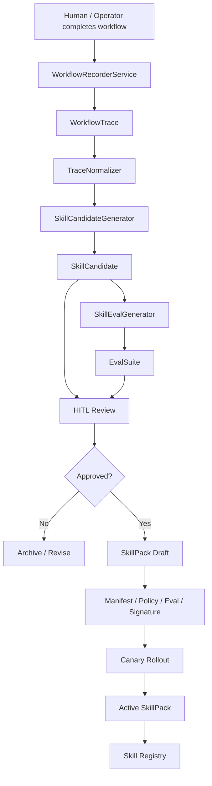
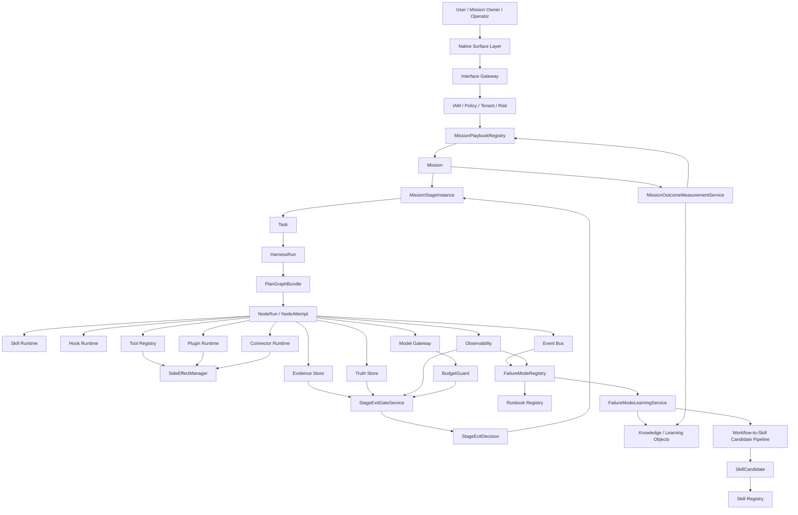

# Anthropic《The Founder’s Playbook》对 Automatic Agent Platform 的Architecture借鉴vs落地方案

> 文档Status：reviewed-reference / architecture-patch-candidate  
> Registry Status：repo_validation_patch_present / main_baseline_acceptance_pending  
> 版本：v1.6.2 — Mission Playbook Release Metadata Patch，2026-05-21 审阅修订  
> 日期：2026-05-20，审阅修订：2026-05-21  
> 输入材料：Anthropic《The Founder’s Playbook: Building an AI-Native Startup》PDF，36 页；官方来源见 [Claude Blog 原文](https://claude.com/blog/the-founders-playbook)  
> 适用系统：Automatic Agent Platform / AI-native Mission Operating System  
> 目标：把 Playbook 中的 AI-native startup 方法论抽象为可落地、可验证、可审计、可回滚的 Agent 平台Architecture能力，并vs现有 Mission、Task、Session、Skill、Workflow、Evidence、Validation、Runtime Governance 体系闭环。

---

## 审阅Conclusionvs本iterations修订

本文适合作为“外部方法论到平台能力”的参考设计稿，但不应directly被读成当前仓库已viaaccepts的契约或已via存在的实现基线。本iterations审阅按当前仓库文档vscodeStatus做了以下收紧：

| 发现 | 风险 | 本iterations修订 |
|---|---|---|
| 文档头把自身写成 `release-ready`，同时又声明 Registry、Evidence、Runtime 仍待 closure | 容易把参考稿误读为已via主基线验收 | Status改为 `reviewed-reference / architecture-patch-candidate`，明确当前仓库尚未注册这些条目 |
| `npm run playbook:*`、`stage-exit`、`mission-outcome` 等命令被写成“必须执lines” | 审阅时 `package.json` 尚no这些命令，验收路径会变成纸面命令 | 先改成 proposed command inventory；2026-05-21 已补仓内 closure 命令、registry patch vs报告产物，主基线accepts仍需单独签收 |
| 文档新增 MissionPlaybook / StageExit 模型，但权威关系没有放在最前面 | 可能和现有 Mission、PlanGraph、HarnessRun、NodeRun 主链形成第二执lines运lines时 | 新增“权威边界vs落地差距”，固定 Mission Playbook 只能做业务阶段治理，不得替代 canonical runtime |
| Source Traceability 只有 PDF 页码，缺官方源固定规则 | PDF 换版后来源映射漂移 | 头部补官方源，保留页码置信度并要求正式合并时复核 sourceRef |
| Metric table允许 `missionId` 进入标签 | vs Mission 高基数治理inconsistent | 删除高基数 `missionId` label，改为低基数标签和 trace/evidence 回链 |
| Proposal、patch plan、implementation tracks 混杂 | 读者难判断“现在能用什么” | 明确“提案、主基线 patch、实现 Track”三层口径，剩余内容仍保留为设计输入 |

本iterations审阅不no定本文的主设计方向。保留的核心Recommendationis：把 Playbook 的阶段、退出标准、failed模式vs outcome measurement 转译成 Mission 治理能力；删掉或收紧的is“已accepts、已执lines、已阻断”的过强table述。

---

## 版本变更record

| 版本 | Status | 主要变更 |
|---|---|---|
| v1.0 | proposal / ready-for-review | based on Anthropic Founder’s Playbook 提出 MissionPlaybookRegistry、StageExitGateService、FailureModeRegistry、MissionOutcomeMeasurementService、Workflow-to-Skill Candidate Pipeline。 |
| v1.1 | proposal / integration-ready after review | 修复 v1.0 review 中发现的Issue：补齐 Gate / Metric / Event / Runbook Registry 接入；新增 Mission / Task / Session 生命cycle对齐；补 StageExit 的 CAS/RSM/transaction 语义；将 ExitCriterion.expression 改为security DSL；明确 MissionStageGraph 可受控循环、PlanGraphBundle 必须 DAG；补 FailureMode 检测治理、Outcome delay度量、WorkflowRecordingPolicy、SkillCandidate 生命cycle对齐、Source Traceability Matrix、Native Surface Matrix，并将 Phase A-D 改名为 Implementation Track A-D。 |
| v1.2 | proposal / baseline-integration-candidate | 修复 v1.1 review 中的定板阻断项：明确 proposed registry Statusvs runtime enforcement 边界；新增 v2.0 Baseline Integration Patch Plan；补 StageExitGateService 事务伪codevs禁止分离事务规则；补 ExitCriterion DSL Validator；修复 MissionStageStatus vsStatus机中的 HITL inconsistent；拆分 SkillCandidate vs SkillPack 生命cycle；补 WorkflowRecordingPolicy defaults to最小permissionconfigure；补 MissionPlaybook 版本治理、生命cycle、rollout/rollback/signature；补 Outcome score 分层、FailureMode vs Gate severity 关系、Native Surface 动作permission矩阵、Implementation Track owner/dependency/exit/rollback；明确并入 v2.0 主文档方式。 |
| v1.3 | proposal / registry-closure-candidate | 修复 v1.2 review 中的闭环Issue：真正拆分 SkillCandidate vs SkillPack 生命cycle；补 StageExit 的 nextStageInstance 原子创建、Mission currentStage 指针更新、idempotencyKey vsrepeatscall语义；新增 MissionPlaybookResolutionPolicy vs MissionPlaybookMigrationPlan；WorkflowRecordingPolicy 改为security枚举并defaults to redacted_summary；统一 SkillCandidate 事件聚合边界；Runbook severity 改为 defaultSeverity + escalationRules；补 ExitCriterion snapshot binding、actual/expected value record；补 OutcomeObservation/source/confidence；补 MissionStageGraph edge-level guard；Implementation Tracks 增加 observe_only→enforcing 策略；Native Surface Matrix 绑定 Policy Action / Required Capability；Source Traceability Matrix 补章节/页码范围；补 Benchmark Monitoring Mission playbook 示例、Outcome→Knowledge/Artifact promotion、SkillPack policy/eval/rollback 示例。 |
| v1.4 | proposal / baseline-acceptance-candidate | 修复 v1.3 review 中的 acceptance blocker：拆分 SkillCandidate conversion gate vs SkillPack activation gate；补 SkillPack 异常/终态事件和违规指标；修正 StageExit 事件因果顺序，补 held/rollback/terminate 分支事件；StageExitGateInput 增加 playbookVersion、remediationRef、HITL 重新评估mandatory校验；FailureMode class型补 triggerCondition；补 MissionPlaybook governance gates/metrics；WorkflowRecordingPolicy 增加 retention deletion proof、sweep、deletion events/metrics；ExitCriterion window 改为 BoundedTimeWindow；StageEdgeGuard 增加 risk/data/evidence/outcome 约束；MissionOutcome 第一阶段用 BusinessImpactObservation；Runbook/CI/Track/Traceability 进一步机器闭环。 |
| v1.5 | proposal / final-acceptance-candidate | 修复 v1.4 review 中的最终acceptsIssue：修复 Markdown code fence；MissionStageInstance uses version 字段，expectedVersion 只保留在 input/command；StageEdgeGuard 补齐 risk/data/evidence/outcome；StageExit event payload 补 playbookVersion/idempotencyKey/criterionResults/sequence/correlationId；Runbook Registry 补 ack/resolve SLA 和人工审批字段；CI Job Registry 增加 Track A-D observe_only/enforcing 模式；收紧 BoundedTimeWindow、use_last_active、fencingToken、MissionOutcome score 来源、SkillPack Event 顺序和 SkillCandidate/SkillPack gate 边界。 |
| v1.6 | proposal / ready-to-merge-candidate | 修复 v1.5 review 中的最后 integration closure Issue：补 v1.5 版本record并清理残留 v1.4 table述；Patch Plan 补 GATE-SKILLPACK-001、skillpack-validate、SkillPack evidence refs；统一 StageTransitionEventBase vs EventEnvelope/Payload 边界；补 MissionPlaybook validation_failed/rejected/suspended 事件；收紧 use_last_active fallback；新增 GATE-WORKFLOW-RECORDING-003；Runbook D.35/D.40 补迁移兼容vs retention/deletion metrics；MissionOutcome class型for deduplication；明确 mapDecisionToStageStatus、canonical enum references用、SkillPack rollback 语义、结构化 metric alert vs gate-level CI mode。 |
| v1.6.1 | proposal / final-release-closure-candidate | 修复 v1.6 review 中的 release closure Issue：删除未注册的 mission.stage.rollback_completed references用；补齐 merge checklist 中 mission-outcome / skill-candidate / skillpack 验证命令；mission.stage.completed 补 decisionId 并继承 StageTransitionEventBase；§14 改造点synchronous SkillPack、WorkflowRecording retention、SkillPack metrics vs skillpack-validate；Evidence Bundle Patch Plan 补 playbookId / playbookResolutionRef / playbookMigrationPlanRefs；明确 Metric Alert table格为 human-readable summary，主 registry 必须生成 metric-alert-policy.yaml；Source Traceability Matrix 增加逐lines sourceRefConfidence。 |
| v1.6.2 | reviewed-reference / architecture-patch-candidate | 补充 Release Evidence、Release Scope、Release Decision vs Merge Closure 候选命令；2026-05-21 审阅修订后，本文定位收紧为参考设计vs主基线 patch 候选，runtime enforcement vs release blocking 只在主仓 Gate / Metric / Event / Runbook / CI / Evidence Bundle closure via并writes证据包后生效。 |

---

## 0. 一页Conclusion

Anthropic 这份 Playbook 的核心不is“创业Recommendation”，而is一种清晰的 **AI-native operating model**：

```text
Idea → MVP → Launch → Scale
```

每个阶段都contains：

```text
目标 → 退出标准 → 常见failed模式 → 合适的 AI surface → 可执lines exercise → 进入下一阶段的判断
```

这对 Automatic Agent Platform 的directly启发is：

> 我们不应该只把 Agent 当成一个“任务执lines器”，而应该把系统升级为 **AI-native Mission Operating System**：每个 Mission 都有阶段、退出标准、failed模式、证据要求、指标度量、Skill 编排、HITL Decision、学习vs改进闭环。

本文的核心设计Conclusion：

```text
MissionPlaybookRegistry
StageExitGateService
FailureModeRegistry
MissionOutcomeMeasurementService
Workflow-to-Skill Candidate Pipeline
```

若后续采纳，这五个新增对象不能停留在“概念文档”，而必须接入现有平台的：

```text
Gate Registry
Metric Registry
Event Registry
Runbook Registry
CI Job Registry
Evidence Bundle
RSM / CAS / Lease / Fencing
Lifecycle Matrix
Data Governance
Skill / Plugin Runtime
```

### 0.1 Registry Statusvs执lines边界

本文提出的 Gate / Metric / Event / Runbook / CI Job 在并入主 `v2.0 Validation Baseline` 前，belongs to **proposed registry entries**；主 Registry Closure via后才能转为 accepted entries。当前仓库的主运lines时、主契约和主测试不得把本参考文档中的 proposed entry 当作已accepts事实。

```yaml
registryStatus: proposed_for_validation_baseline
runtimeEnforcement: not_enabled_until_registered
releaseBlocking: false_until_accepted
```

约束：

```text
1. 本文中的 proposed Gate 不得在主基线accepts前作为正式 release blocker。
2. 本文中的 proposed Metric 不得在主 Metric Registry accepts前作为唯一告警依据。
3. 本文中的 proposed Event 必须先生成机器可执lines payload schema，才能进入 Event Registry。
4. 本文中的 proposed Runbook 必须先绑定 accepted Gate vs accepted Metric，才能进入 Runbook Registry。
5. 一旦合并进主文档，所有 proposed 条目必须via Registry Closure 校验。
```

合并目标Status：

```yaml
registryStatus: accepted
runtimeEnforcement: enabled_by_validation_profile
releaseBlocking: true_for_declared_blocking_gates
```

最终目标：

```text
从“Agent 会执lines”升级为“Mission 会via营、会度量、会学习、会沉淀”。
```

### 0.2 Release Scope / Evidence / Decision

本版本的作用范围is **参考文档层vsArchitecture基线补丁候选层**，used for评估isno并入 `v2.0 Validation Baseline`。在主基线 closure 前，不calledcode release，也不called runtime release。

```yaml
releaseScope:
  document: true
  architectureBaselinePatchCandidate: true
  registryPatchCandidate: true
  runtimeCodeChange: true_for_repo_baseline
  productionRuntimeEnforcement: false_until_main_baseline_accepts_registry_patch
```

Release 判定分两层：

| 层级 | 当前Status | Description |
|---|---|---|
| 参考文档审阅 | reviewed | 本文结构、Registry Patch、Gate/Metric/Event/Runbook/CI/Evidence Bundle 接入关系可作为评审输入。 |
| 主基线合并 | repo closure passed / main acceptance pending | 仓内已执lines Registry Closure、Markdown Render Closure 和 Track B/C/D validation 命令；正式主基线 acceptance 仍需纳入对应 validation profile。 |
| Runtime enforcement | pending accepted registry | 只有主 Registry 接收并enabled validation profile 后，新增 Gate 才能成为 release blocker。 |

正式并入主基线前，必须形成 Release Evidence Bundle：

```yaml
releaseEvidence:
  gateRegistryClosure: pending
  metricRegistryClosure: pending
  eventRegistryClosure: pending
  runbookRegistryClosure: pending
  ciJobRegistryClosure: pending
  evidenceBundleClosure: pending
  markdownRenderClosure: pending
  metricAlertPolicyGenerated: pending
  releaseEvidenceBundleRef: TBD
  registryPatchHash: TBD
  signedBy: []
  signedAt: TBD
```

下列命令最初is本文Recommendation的 **closure 命令契约**。2026-05-21 的仓内基线实现已把命令入口writes `package.json`，由 `scripts/validation/mission-operating-model-closure.mjs` 生成机器报告；它们可以作为 registry patch 证据，但主 Validation Baseline isno把这些 gate 提升为 release blocker 仍需单独accepts：

```bash
npm run registry:closure
npm run playbook:validate
npm run test:e2e:stage-exit
npm run mission-outcome:validate
npm run skill-candidate:validate
npm run skillpack:validate
npm run workflow-recording:policy
npm run workflow-recording:data-boundary
npm run workflow-recording:retention
npm run docs:markdown-render
```

落库后至少还需补三class证据：

| 证据 | 最低要求 |
|---|---|
| 命令存在性 | `package.json` 或 CI workflow 能定位命令入口，命令failed会返回非零Status |
| 工件存在性 | 每个 closure 命令defines机器可读 artifact path、hash、owner |
| 主基线references用 | Gate / Metric / Event / Runbook / CI Job Registry references用这些 artifact，而不isonlyreferences用本文 |

via后，主基线中的Status可从：

```yaml
registryStatus: proposed_for_validation_baseline
runtimeEnforcement: not_enabled_until_registered
releaseBlocking: false_until_accepted
```

更新为：

```yaml
registryStatus: accepted
runtimeEnforcement: enabled_by_validation_profile
releaseBlocking: true_for_declared_blocking_gates
```

### 0.3 权威边界vs本仓落地差距

本文occurrences于 `docs_zh/reference/`，它的定位is参考设计输入。若本文vs当前平台权威对象conflicts，按下tablehandle：

| 主题 | 当前权威 | 本文允许做什么 | 本文不得做什么 |
|---|---|---|---|
| Mission 定位 | `docs_zh/reference/mission_architecture_design_review_v1_4_full_merged.md` vs现有 Mission contracts | 为 Mission 增加 Playbook / Stage 治理候选 | 把 MissionStage 变成 Harness/Node 的第二执linesStatus机 |
| 执lines主链 | `PlanGraphBundle`、`HarnessRun`、`NodeRun`、`NodeAttempt` canonical runtime | 提供业务阶段 gate、outcome、evidence 约束 | 复活 Step-centric 或线性 workflow truth |
| 验证基线 | `docs_zh/reference/automatic_agent_platform_validation_monitoring_full_v1_7_1.md` 中的 Registry closure 规则 | 提供待并入的 Gate/Metric/Event/Runbook/CI patch | 声称 proposed registry 已 accepted |
| 机器契约 | Zod/OpenAPI/Event schema/CI tests | 给出候选 schema 和命令清单 | 只靠 Markdown 文本成为 release blocker |

当前仓库审阅基线：

| 对象 | 当前判断 |
|---|---|
| `MissionPlaybookRegistry`、`StageExitGateService` | 已落仓内基线：Mission Playbook schema、阶段实例 schema、security Exit Criterion DSL、Playbook references用校验、based on snapshot 的 StageExit Decision和 `platform.mission.stage_exit_evaluated` 审计事件；仍未成为主 Validation Baseline release blocker |
| `MissionFailureModeRegistry`、`MissionOutcomeMeasurementService` | Track B 已落仓内基线：failed模式注册、P0 路由要求、for deduplication/抑制审批、Mission outcome 分层分数vs outcome event 审计均有可references用服务和定向测试 |
| `WorkflowRecordingService`、`SkillCandidatePipeline` | Track C 已落仓内基线：录制 policy、restricted consent/redaction fail-closed、retention deletion proof、Trace→Candidate→SkillPack approval/eval/policy/signature/canary/rollback gate 已有可测试服务 |
| Research / Code / Ops Playbook | Track D 已落仓内基线：三class active builtin playbook 含 stage evidence、default skill、HITL edge vs gate refs；仍不把 Mission Stage 误写成执lines truth |
| `playbook:validate`、`test:e2e:stage-exit`、`mission-outcome:validate`、`skill-candidate:validate`、`skillpack:validate`、`workflow-recording:*` | 已成为仓内脚本入口，并由 `config/validation/mission-operating-model-registry.json` vs closure report 形成 registry patch 证据 |
| Mission / Task / Session 边界、PlanGraph DAG、Evidence / Policy / Budget / HITL 约束 | 应继续复用当前平台已有 canonical 设计，不在本文另起一套事实模型 |

第一批实现证据：

| 能力 | code | 定向测试 |
|---|---|---|
| Mission Playbook、Stage、Exit Criterion、StageExitDecision 契约 | `src/platform/contracts/mission/playbook.ts` | `tests/unit/platform/contracts/mission-contracts.test.ts` |
| Playbook Registry 校验和 snapshot-based StageExit Gate | `src/platform/five-plane-control-plane/mission/index.ts` | `tests/unit/platform/control-plane/mission-services.test.ts` |
| Mission StageExit 审计事件class型 | `src/platform/contracts/mission/index.ts` | `tests/unit/platform/control-plane/mission-services.test.ts` |
| FailureMode / Outcome / Workflow Recording / SkillCandidate / SkillPack operating-model 契约 | `src/platform/contracts/mission/operating-model.ts` | `tests/unit/platform/control-plane/mission-operating-model.test.ts` |
| Track B failed模式检测、Outcome 度量和 Mission 审计事件 | `src/platform/five-plane-control-plane/mission/operating-model.ts` | `tests/unit/platform/control-plane/mission-operating-model.test.ts` |
| Track C Workflow Trace retention vs Candidate→SkillPack security链 | `src/platform/five-plane-control-plane/mission/operating-model.ts` | `tests/unit/platform/control-plane/mission-operating-model.test.ts` |
| Track D Research / Code / Ops builtin Playbook | `src/platform/five-plane-control-plane/mission/operating-model.ts` | `tests/unit/platform/control-plane/mission-operating-model.test.ts` |
| Validation registry patch、closure 命令和报告生成器 | `config/validation/mission-operating-model-registry.json`、`scripts/validation/mission-operating-model-closure.mjs`、`package.json` | `npm run registry:closure`、`npm run playbook:validate`、`npm run mission-outcome:validate`、`npm run skill-candidate:validate`、`npm run skillpack:validate`、`npm run workflow-recording:*` |

该基线刻意不做三件事：

1. 不把 `MissionStageInstance` 持久化成第二套执lines truth；它当前is Mission 治理契约，后续持久化必须走 Mission truth/event 设计评审。
2. 不把 StageExit directly改写 `HarnessRun`、`PlanGraphBundle` 或 `NodeRun` Status；Execution Plane继续由 canonical runtime 控制。
3. 不提前声明主 Validation Baseline 已把 Gate / Metric / Runbook / CI Registry 提升为 release blocker；本轮只把 registry patch、命令和 closure artifact 落库。

---

## 1. Playbook 的核心内容抽象

### 1.1 四阶段生命cycle

Playbook 把 AI-native startup 分成四个阶段：

| 阶段 | 核心Issue | 关键产物 | 退出条件 |
|---|---|---|---|
| Idea | 这个Issueisno真实、具体、值得做？ | problem hypothesis、customer discovery、competitive map、solution concept | problem-solution fit |
| MVP | 应该先构建什么最小可验证产品？ | MVP scope、architecture context、security review、measurement framework | 真实 PMF 证据 |
| Launch | 业务isno能稳定增长并承受生产压力？ | production hardening、ops workflows、security/compliance、product management process | 可repeats增长、可生产运lines、运营不再relies on founder |
| Scale | 组织和产品isno能被审计、可持续、难复制？ | governance、SLA、support infra、GTM system、data/workflow moat | 系统化增长、治理成熟、护城河成立 |

对我们来说，这个阶段模型不应该被directly照搬，而应该抽象为：

```text
Mission Stage Model
```

不同 Mission Type 有自己的阶段图：

```text
Research Intelligence Mission:
  discover → review → validate → publish → monitor → improve

Code Agent Mission:
  understand → plan → implement → test → review → merge → monitor

Ops Mission:
  detect → triage → mitigate → recover → postmortem → harden

Benchmark Monitoring Mission:
  ingest → normalize → evaluate → compare → report → alert → improve
```

---

### 1.2 Founder 从 individual contributor 变成 orchestrator

Playbook 明确指出，在 AI-native startup 中，founder 的角色从亲自写code、运营、manage日常任务，转向 **orchestrator of agents**。这正好对应我们系统中的：

```text
Mission Owner / Operator / Reviewer
```

平台 UI 和运lines时应该分层：

| 角色 | 应看到的对象 | 不应directly暴露的对象 |
|---|---|---|
| 普通业务user | Mission goal、progress、risk、evidence、decision needed、final output | NodeAttempt、lease、fencing、CAS、raw events |
| Operator | Mission、Task、PlanGraph、NodeRun、HITL Queue、Runbook、SLO | 低层storageimplementation details |
| 平台工程 | EventLog、TruthStore、CAS、Lease、Fencing、DLQ、Projection、Metric、Trace | no |

这再iterationssupported系统设计中“弱化 step 概念”的方向：user不应面对 Step，而应面对 Mission / Stage / Outcome / Evidence。

---

### 1.3 AI-native 的关键不is更快执lines，而is证据化执lines

Playbook 在 Idea 阶段反复强调：AI 降低了 build 门槛，但不能把“能 build”误认为“已验证”。在 MVP 阶段，它也强调 AI coding 会带来 agentic technical debt，需要Architecture上下文、scope 文档、security审查和 measurement framework。

对应到 Automatic Agent Platform：

```text
AI-native ≠ 跳过流程
AI-native = 自动执lines + 自动证据 + 自动评估 + 自动反馈 + 人classhandle高价值判断
```

必须坚持：

```text
没有 evidence，不允许 release
没有 exit criteria，不允许 advance
没有 policy decision，不允许 side effect
没有 budget reservation，不允许 model/tool call
没有 audit trail，不允许 HITL / autonomy override
没有 stage exit decision，不允许推进 MissionStage
```

---

## 2. Source Traceability Matrix：从 Anthropic Playbook 到平台设计对象

> 注：页码/章节范围based on当前 PDF 目录vs段落结构人工校对，`sourceRefConfidence=medium`；正式并入主文档前应由文档 owner 做最终页码复核。

> 页码范围以user上传的 36 页 PDF 为参考，used for内部追溯。若 PDF 后续换版，应重新生成本table的 `sourceRef`。

> 转译边界：下table的“平台对象 / Gate / Registry”is Automatic Agent Platform 的Architecture推导，不代table Anthropic 原文defines了这些对象。若后续references用原文做产品或市场Conclusion，应回到官方原文复核，不应反向把本table当成原文替代。

| Playbook Source | PDF 章节 / 页码范围 | sourceRefConfidence | 原文主题 / 设计意图 | 我们的抽象 | 平台对象 | 对应 Gate / Registry |
|---|---|---|---|---|---|---|
| Startup lifecycle rebooted | Ch.1 / p.3-4 | medium | Idea / MVP / Launch / Scale 重新defines AI-native startup 生命cycle | Mission Stage Model | MissionPlaybook、MissionStageGraph | GATE-MISSION-PLAYBOOK-001 |
| Founder as orchestrator | Ch.2 / p.5-7 | medium | founder 从 individual contributor 转向 agent orchestrator | Mission Owner / Operator | Native Surface Matrix、Operator Cockpit | UI Authorization Matrix / Runbook Registry |
| Idea Stage | Ch.3 / p.8-14 | medium | Validate before build，避免把“能 build”误认为“值得 build” | 阶段退出标准前置 | StageExitGateService、ExitCriterion DSL | GATE-MISSION-PLAYBOOK-002 / 004 |
| Idea Stage Exercises | Ch.3 / p.8-14 | medium | customer discovery、competitive landscape、hypothesis pressure test | Research / Market / Hypothesis SkillPack | Mission Template、SkillPack | GATE-SKILL-CANDIDATE-001 |
| MVP Stage | Ch.4 / p.15-20 | medium | AI coding 加速但会制造技术债 | Code Agent hardening gates | Architecture Gate、Security Gate、Test Quality Gate | GATE-TEST-001 / GATE-SECURITY-001 |
| MVP Stage | Ch.4 / p.15-20 | medium | Scope、architecture context、measurement framework | Mission 不能只产出，还要可度量 | MissionOutcomeMeasurementService | GATE-MISSION-OUTCOME-001 |
| Launch Stage | Ch.5 / p.21-24 | medium | Operating system 用 agentic workflows 替代 founder attention | Mission Operating Workflow | MissionPlaybook + Runbook + Operator Cockpit | GATE-RUNTIME-001 / GATE-OBS-001 |
| Launch Stage | Ch.5 / p.21-24 | medium | Security、compliance、production hardening | 治理不能后置 | Policy、Data Governance、SideEffect | GATE-DATA-001 / GATE-SIDEEFFECT-001 |
| Scale Stage | Ch.6 / p.25-30 | medium | Workflow/data moat、domain knowledge、proprietary process | 能力沉淀为 Skill / Knowledge / Playbook | Workflow-to-Skill Candidate Pipeline | GATE-WORKFLOW-RECORDING-001 / 002 |
| Scale Stage | Ch.6 / p.25-30 | medium | 可审计治理、组织成熟度、data飞轮 | 平台护城河来自 workflow/evidence/knowledge 复利 | Knowledge Graph、Skill Catalog、MissionOutcome | Metric / Evidence / Knowledge Registry |

---

## 3. 对 Automatic Agent Platform 的核心借鉴

### 3.1 Mission 必须阶段化

现有 Mission 不应只is一个长期容器。它应该有：

```text
MissionStageGraph
MissionStageInstance
StageExitCriteria
StageFailureModes
StageMetrics
StageDefaultSkills
StageRunbooks
StageEvidenceRequirements
```

关键约束：

```text
Mission Stage 不is Step。
Stage is业务生命cycleStatus；NodeRun 才is执lines时节点；Task is Mission 下的工作单元。
```

---

### 3.2 MissionStageGraph 可以受控循环，但 PlanGraphBundle 必须is DAG

必须明确两个“图”的语义不同：

| 图 | isno允许循环 | 目的 | 约束 |
|---|---:|---|---|
| MissionStageGraph | 允许受控循环 | table达业务生命cycle，例如 monitor → improve → review | 每iterations循环必须创建新的 `stageInstanceId`，受 maxCycle / dwellTime / budget / approval guard 约束 |
| PlanGraphBundle | 不允许循环，必须 DAG | table达一iterations HarnessRun 的执lines计划 | 必须via DAG 校验、relies on校验、worst-path budget 校验 |

示例：

```text
MissionStageGraph:
  publish → monitor → improve → review   # 合法，代table业务持续改进循环

PlanGraphBundle:
  nodeA → nodeB → nodeA                   # 非法，执lines计划不能循环
```

Recommendation对象：

```ts
type MissionStageInstance = {
  stageInstanceId: string;
  missionId: string;
  playbookId: string;
  playbookVersion: string;
  stageId: string;
  cycleIndex: number;
  parentStageInstanceId?: string;
  status: MissionStageStatus;
  version: number; // 当前 CAS 版本；expectedVersion 只允许出现在 command/input 中
  enteredAt: string;
  exitedAt?: string;
};
```

循环控制：

```ts
type MissionStageCycleGuard = {
  maxCycles: number;
  minDwellTimeMs?: number;
  maxDwellTimeMs?: number;
  requireApprovalAfterCycle?: number;
  maxBudgetUsdPerCycle?: number;
};

type MissionStageEdgeGuard = {
  edgeId: string;
  fromStageId: string;
  toStageId: string;
  requiredGates: string[];
  requiresHitl: boolean;
  requiredCapabilities: string[];
  minDwellTimeMs?: number;
  maxBudgetUsd?: number;
  allowedRuntimeModes: RuntimeMode[];
  maxAllowedRiskLevel: RiskLevel;
  allowedDataClasses: DataClass[];
  requiresEvidenceBundle: boolean;
  requiresOutcomeReport: boolean;
};
```

Edge-level guard used for区分不同阶段边的风险。例如 `validate → publish` 应比 `monitor → improve` 更严格。所有 stage transition 必须先检查 edge guard，再评估 exit criteria。

Canonical enum requirement:

```text
RiskLevel / DataClass / RuntimeMode 必须references用 v2.0 canonical contracts，本文不得重新defines这些 enum。
所有 Playbook DSL、StageEdgeGuard、Policy Action vs Native Surface Matrix 都必须复用同一组 canonical enum，避免 RiskLevel / RuntimeMode 再iterations出现多occurrencesdefinesvs排序conflicts。
```

```yaml
edges:
  - edgeId: research.validate_to_publish
    from: validate
    to: publish
    requiredGates:
      - GATE-EVIDENCE-001
      - GATE-MISSION-OUTCOME-001
      - GATE-DATA-001
    requiresHitl: true
    requiredCapabilities:
      - mission.publish
    allowedRuntimeModes:
      - supervised
      - manual_only
    maxAllowedRiskLevel: medium
    allowedDataClasses:
      - public
      - internal
    requiresEvidenceBundle: true
    requiresOutcomeReport: true
```

---

### 3.3 MissionStageStatus 调整

v1.0 中 `rolled_back` 被defines为长期Status。v1.1 修正为：rollback is transition result，不is稳定长期Status。

```ts
type MissionStageStatus =
  | "pending"
  | "active"
  | "exit_evaluating"
  | "held"
  | "blocked"
  | "completed"
  | "terminated";
```

rollback via事件和Decisiontable达：

```text
mission.stage.rollback_requested
```

rollback 完成由恢复/迁移流程via独立 Runbook 或 MigrationPlan table达；StageExit 本身只产生 `rollback_requested`，不defines `mission.stage.rollback_completed`，避免把 rollback completion 误认为 StageExit 的synchronous结果。

---

### 3.4 每个阶段必须有 Exit Criteria，且必须usessecurity DSL

v1.0 uses：

```ts
expression: string;
```

这会references入任意code执lines、不可静态分析、不可审计、不可回放等风险。v1.1 改为security DSL。

```ts
type BoundedTimeWindow =
  | { type: "duration"; iso8601: string; maxDurationMs: number }
  | { type: "stage"; stageInstanceId: string; maxDurationMs: number }
  | { type: "mission"; missionId: string; maxDurationMs: number };

type ExitCriterionExpression =
  | {
      type: "metric_threshold";
      metric: string;
      operator: "==" | "!=" | ">=" | ">" | "<=" | "<";
      value: number | string | boolean;
      window?: BoundedTimeWindow;
    }
  | {
      type: "event_count";
      eventName: string;
      operator: "==" | "!=" | ">=" | ">" | "<=" | "<";
      value: number;
      window?: BoundedTimeWindow;
    }
  | {
      type: "evidence_exists";
      evidenceKind: string;
      minCount?: number;
    }
  | {
      type: "hitl_decision";
      decisionType: string;
      requiredDecision: "approved" | "rejected" | "request_changes";
    }
  | {
      type: "all_of";
      criteria: ExitCriterionExpression[];
    }
  | {
      type: "any_of";
      criteria: ExitCriterionExpression[];
    }
  | {
      type: "not";
      criterion: ExitCriterionExpression;
    };

type ExitCriterion = {
  criterionId: string;
  name: string;
  severity: "P0" | "P1" | "P2";
  expression: ExitCriterionExpression;
  requiredEvidenceRefs: string[];
  requiredMetricRefs: string[];
  failureModeRef?: string;
  gateId: string;
};
```

security要求：

```text
禁止任意 JS / Python / shell 执lines。
禁止network IO。
禁止读取实时 mutable state。
只能读取 StageExitGateInput 中绑定的 metric/evidence/risk/budget/HITL snapshot。
所有 metric / event / evidence kind 必须存在于 Registry。
table达式必须可静态验证、可序列化、可回放。
```

#### 3.4.1 ExitCriterion snapshot binding vs验证器

ExitCriterion 只能based on StageExit 输入中的 immutable snapshot 计算。每iterations计算必须record实际值、期望值、table达式 hash vs snapshot references用，保证后续 replay 可解释。

```ts
type ExitCriterionEvaluationContext = {
  metricSnapshotRef: string;
  evidenceSnapshotRef: string;
  riskSnapshotRef: string;
  budgetSnapshotRef: string;
  hitlDecisionSnapshotRef?: string;
  evaluatedAt: string;
};

type ExitCriterionEvaluationResult = {
  criterionId: string;
  expressionHash: string;
  passed: boolean;
  actualValue: number | string | boolean | null;
  expectedValue: number | string | boolean | null;
  snapshotRefs: string[];
  evidenceRefs: string[];
  reasonCode?: string;
};

type ExitCriterionValidationResult = {
  valid: boolean;
  errors: Array<{
    code:
      | "UNKNOWN_METRIC"
      | "UNKNOWN_EVENT"
      | "UNKNOWN_EVIDENCE_KIND"
      | "INVALID_OPERATOR"
      | "TYPE_MISMATCH"
      | "UNBOUNDED_WINDOW"
      | "UNSAFE_NEGATION"
      | "MAX_DEPTH_EXCEEDED";
    path: string;
    message: string;
  }>;
};
```

校验规则：

| 校验项 | 要求 |
|---|---|
| metric | 必须存在于 Metric Registry |
| eventName | 必须存在于 Event Registry |
| evidenceKind | 必须存在于 Evidence Schema Registry |
| operator | 必须vs value class型兼容 |
| window | 必须uses `BoundedTimeWindow`，不允许裸 string 或no限窗口 |
| not | P0 gate 不允许裸 `not` 包装外部事件缺失 |
| recursive depth | DSL 嵌套深度必须受限，防 DoS |

`BoundedTimeWindow` 额外约束：

```text
stage window 的 maxDurationMs 必须显式提供；active stage 不允许noupper limit窗口。
duration window 的 maxDurationMs 必须小于等于 MissionProfile.maxExitEvaluationWindowMs。
mission window 只允许读取当前 mission 的 immutable snapshot，不允许跨 mission 聚合。
```

Research Intelligence Mission 示例：

```yaml
missionType: research_intelligence
stage: review
exitCriteria:
  - criterionId: research.review.evidence_coverage
    severity: P0
    gateId: GATE-EVIDENCE-001
    expression:
      type: metric_threshold
      metric: aa.mission.outcome.evidence_coverage_ratio
      operator: ==
      value: 1.0

  - criterionId: research.review.quality
    severity: P1
    gateId: GATE-MISSION-OUTCOME-001
    expression:
      type: metric_threshold
      metric: aa.mission.outcome.quality_score
      operator: ">="
      value: 0.85

  - criterionId: research.review.no_unresolved_claim
    severity: P0
    gateId: GATE-EVIDENCE-001
    expression:
      type: metric_threshold
      metric: aa.claim.unsupported.count
      operator: ==
      value: 0
```

---

### 3.5 建立 Failure Mode Registry

Playbook 在每个阶段都给出常见failed模式。我们应把它系统化：

```ts
type FailureMode = {
  failureModeId: string;
  missionType: string;
  stage: string;
  name: string;
  severity: "P0" | "P1" | "P2";
  description: string;
  detectionMetrics: string[];
  detectionEvents: string[];
  triggerCondition: ExitCriterionExpression;
  linkedGates: string[];
  linkedRunbooks: string[];
  defaultAction: "block" | "hold" | "require_hitl" | "rollback" | "quarantine" | "monitor";
  recoveryPlaybookRef?: string;
  learningAction?: "create_eval" | "update_skill" | "update_playbook" | "add_guardrail";
  detectionPolicy: FailureModeDetectionPolicy;
};

type FailureModeDetectionPolicy = {
  minSampleSize?: number;
  debounceWindowMs?: number;
  recurrenceWindowMs?: number;
  dedupeKeyTemplate: string;
  falsePositiveReviewRequired: boolean;
  suppressionRequiresApproval: boolean;
  suppressionTtlMs?: number;
  escalationRules: Array<{
    condition: ExitCriterionExpression;
    severity: "P0" | "P1" | "P2";
  }>;
};
```

治理要求：

```text
同一 failure mode 必须按 dedupeKey for deduplication。
高频误报必须进入 false-positive review。
临时 suppression 必须有 owner、expiry、auditRef。
P0 failure mode 不允许 silent suppression。
recurrence 必须生成 learning object 或 eval case。
```

---

### 3.6 references入 Mission Outcome Measurement Framework

Playbook 提到 MVP 阶段应提前建立 measurement framework，避免把早期热度误认为 PMF。对我们来说，Agent 完成任务不等于 Mission success。

本文将 Outcome 拆成四层，并增加 `OutcomeObservation`，防止系统“自称success”但没有采用证据：

```text
Execution Success        # isno执lines完成
Immediate Outcome        # 产出isno合格
Delayed Outcome          # 一段time后isno被采纳
Business Impact          # isno形成业务价值 / 实验 / Decision / 知识资产
```

Recommendation对象：

```ts
type BusinessImpactObservation =
  | { type: "downstream_task_created"; taskId: string; evidenceRefs: string[] }
  | { type: "experiment_created"; experimentId: string; evidenceRefs: string[] }
  | { type: "knowledge_promoted"; knowledgeObjectId: string; evidenceRefs: string[] };

type MissionOutcomeScores = {
  executionScore: number;
  qualityScore: number;
  evidenceScore: number;
  adoptionScore?: number;
  // 第一阶段不directly手写抽象 businessImpactScore；
  // business impact 由 BusinessImpactObservation 聚合得到。
  businessImpactScore?: number;
};

type OutcomeObservation = {
  observationId: string;
  outcomeType:
    | "human_adoption"
    | "experiment_created"
    | "decision_adopted"
    | "knowledge_promoted"
    | "downstream_task_created";
  source: "manual_review" | "system_event" | "downstream_task" | "external_integration";
  confidence: number;
  observedAt: string;
  evidenceRefs: string[];
  reviewerRefs?: string[];
};

type MissionOutcomeReport = {
  reportId: string;
  missionId: string;
  missionType: string;
  generatedAt: string;
  measurementWindow: "immediate" | "7d" | "30d" | "custom";
  baselineRef?: string;
  delayedOutcomeRef?: string;
  reviewerRefs: string[];
  scores: MissionOutcomeScores;
  observations: OutcomeObservation[];
  scoresGeneratedFromRefs: string[];

  completion: {
    completed: boolean;
    terminalStatus: string;
    stageCompletionRatio: number;
  };

  quality: {
    score: number;
    rubricVersion: string;
    humanReviewScore?: number;
  };

  evidence: {
    coverageRatio: number;
    sourceReliabilityMean: number;
    unresolvedClaimCount: number;
  };

  cost: {
    totalUsd: number;
    modelUsd: number;
    toolUsd: number;
    costPerAcceptedOutput: number;
  };

  latency: {
    timeToFirstUsefulOutputMs: number;
    totalDurationMs: number;
  };

  risk: {
    highestRiskLevel: string;
    policyDenialCount: number;
    hitlEscalationCount: number;
  };

  learning: {
    skillCandidateCount: number;
    evalCaseCreatedCount: number;
    playbookUpdateCount: number;
    knowledgeObjectPromotedCount: number;
  };
};
```

核心principle：

```text
Mission success = 产出被采纳 / 证据完整 / 成本可控 / 风险可控 / 能沉淀改进。
不isonlyonly“跑完”。
MissionOutcomeScores is标准化结果；MissionOutcomeReport.quality/evidence/cost/latency/risk is原始评分明细。
Metric Registry 只采集 MissionOutcomeScores 的标准化字段，并via scoresGeneratedFromRefs 回溯原始来源。
```

---

### 3.7 Workflow-to-Skill Candidate Pipeline

Playbook 强调 operational workflows 可以被 AI 接管，并在 Scale 阶段把 founder 的隐性知识变成可复用系统。我们可以将其落地为：

```text
Workflow Trace
→ Skill Candidate
→ Eval Set
→ HITL Review
→ SkillPack Draft
→ Policy / Sandbox / SBOM / Eval
→ Canary Rollout
→ Active Skill
```

新增组件：

```text
WorkflowRecorderService
TraceNormalizer
SkillCandidateGenerator
SkillEvalGenerator
SkillPromotionService
SkillRolloutService
```

关键约束：

```text
录制流程不得directly变成生产 Skill。
SkillCandidate approved 不等于 active Skill。
SkillCandidate 只table达“候选能力已被accepts”，不能承载 SkillPack / SkillRuntime 生命cycle。
SkillPack 必须独立via过 manifest、policy、SBOM、eval、signature、canary、activation。
```

#### 3.7.1 SkillCandidate Lifecycle

```text
draft
→ under_review
→ approved
→ converted_to_skillpack
```

异常路径：

```text
under_review → rejected
approved → rejected       # 复审发现风险
```

```ts
type SkillCandidateStatus =
  | "draft"
  | "under_review"
  | "approved"
  | "rejected"
  | "converted_to_skillpack";

type SkillCandidate = {
  candidateId: string;
  sourceWorkflowTraceRef: string;
  proposedSkillId: string;
  proposedName: string;
  proposedDescription: string;
  inferredTriggers: string[];
  requiredTools: string[];
  requiredPermissions: string[];
  riskLevel: RiskLevel;
  generatedInstructionsRef: string;
  generatedEvalSuiteRef: string;
  policyDraftRef: string;
  rollbackStrategyRef: string;
  owner: string;
  status: SkillCandidateStatus;
};
```

#### 3.7.2 SkillPack Lifecycle

```text
draft
→ manifest_validated
→ policy_validated
→ sbom_scanned
→ eval_passed
→ signed
→ canary
→ active
→ suspended / deprecated / revoked / archived
```

```ts
type SkillPackStatus =
  | "draft"
  | "manifest_validated"
  | "policy_validated"
  | "sbom_scanned"
  | "eval_passed"
  | "signed"
  | "canary"
  | "active"
  | "suspended"
  | "deprecated"
  | "revoked"
  | "archived";
```

转换规则：

```text
skill_candidate.approved
→ skill_candidate.converted_to_skillpack
→ skillpack.draft.created
→ skillpack.manifest.validated
→ skillpack.policy.validated
→ skillpack.sbom.scanned
→ skillpack.eval.passed
→ skillpack.signed
→ skillpack.canary.started
→ skillpack.activated
```

---

## 4. Mission / Task / Session Lifecycle Alignment

### 4.1 三者都需要生命cycle，但不能共用一套生命cycle

```text
Mission 生命cycle = 业务目标 / 长期计划 / 阶段推进
Task 生命cycle    = 可执lines工作项 / 排队执lines / 阻塞恢复
Session 生命cycle = 人机交互上下文 / 对话窗口 / 审批上下文
```

| 对象 | 生命cycleclass型 | 作用 |
|---|---|---|
| Mission | 业务生命cycle + 阶段生命cycle | manage长期目标、阶段推进、成果沉淀 |
| Task | 工作项生命cycle | manage单个可执lines任务的创建、执lines、阻塞、完成 |
| Session | 交互生命cycle | manage人机对话、审批、上下文窗口 |
| HarnessRun | 执lines生命cycle | manage一iterations受控运lines |
| PlanGraphBundle | 计划生命cycle | manage DAG 计划生成、验证、替换 |
| NodeRun | 运lines节点生命cycle | manage单个节点执lines |
| NodeAttempt | 尝试生命cycle | manage一iterations具体执lines尝试 |

---

### 4.2 Mission Lifecycle

```text
draft → active → paused → completed → archived
```

异常路径：

```text
draft → cancelled
active → failed
active → cancelled
active → suspended
paused → active
failed → archived
cancelled → archived
completed → archived
suspended → active / cancelled / archived
```

Mission 完成必须满足：

```text
Mission exit criteria 全部满足
所有 required Task terminal
所有 required evidence 完整
no open blocker
no unresolved HITL
no blocking incident
```

---

### 4.3 MissionStage Lifecycle

```text
pending → active → exit_evaluating → completed
```

异常路径：

```text
active → held
active → blocked
active → terminated
exit_evaluating → held / blocked / terminated
held → active
blocked → active / terminated
```

Stage 推进必须由 `StageExitGateService` 生成 `StageExitDecision`，禁止手动修改 `currentStageId`。

---

### 4.4 Task Lifecycle

```text
created → admitted → planned → queued → running → completed
```

阻塞路径：

```text
running → blocked → running
running → waiting_hitl → running
running → failed → retrying → queued
```

终态：

```text
completed
failed
cancelled
expired
completed_with_exception
```

Task 不应该承载长期业务阶段。例如，不应uses：

```text
Task.stage = discover / review / validate / publish
```

更合理：

```text
Mission.stage = review
Task.type = paper_review
Task.status = running
```

---

### 4.5 Session Lifecycle

```text
open → active → idle → closed → archived
```

异常路径：

```text
active → suspended
active → expired
active → transferred
idle → active
suspended → active / closed
```

Session is交互入口，不is长期生命cycle主轴。Session 可以创建 Task，但 Task 不应relies on Session 存活。

正确关系：

```text
Session creates Task
Task links back to Session as sourceSessionId
Task continues even if Session closed
```

错误关系：

```text
Session closed → Task cancelled
Session expired → Mission paused
Session memory = Mission truth
```

---

### 4.6 生命cycle不variable

```text
INV-LIFECYCLE-001:
Mission、Task、Session 必须有独立生命cycle，不能共用同一Status枚举。

INV-LIFECYCLE-002:
Session terminal 不得自动终止 Task 或 Mission。

INV-LIFECYCLE-003:
Task terminal 不得自动完成 Mission，必须via StageExitGate 判断。

INV-LIFECYCLE-004:
Mission stage advance 必须生成 StageExitDecision。

INV-LIFECYCLE-005:
所有 terminal state 必须 immutable，除非via显式 repair / reopen 协议生成新 run。

INV-LIFECYCLE-006:
所有Status转换必须产生 PlatformFactEvent。

INV-LIFECYCLE-007:
跨层Status传播必须via事件和Decision服务，不允许directly mutate 上层对象。

INV-LIFECYCLE-008:
Session memory 不is Truth，不能作为 Mission / Task 权威Status来源。
```

---

## 5. 新增Architecture模块设计

### 5.1 MissionPlaybookRegistry

职责：

```text
manage不同 MissionType 的阶段图、defaults to技能、退出标准、failed模式、度量框架、运lines边界。
```

Recommendation目录：

```text
src/platform/orchestration/mission-playbooks/
  mission-playbook-model.ts
  mission-playbook-registry.ts
  mission-playbook-validator.ts
  mission-stage-graph-validator.ts
  mission-playbook-repository.ts
  builtins/
    research-intelligence.playbook.yaml
    code-agent.playbook.yaml
    ops-incident.playbook.yaml
    benchmark-monitoring.playbook.yaml
```

Playbook schema 示例：

```yaml
playbookId: research_intelligence_v1
missionType: research_intelligence
version: 1.0.0
owner: research-platform
status: active

stageGraph:
  cycleGuard:
    maxCycles: 5
    requireApprovalAfterCycle: 3
    maxBudgetUsdPerCycle: 20
  nodes:
    - discover
    - review
    - validate
    - publish
    - monitor
    - improve
  edges:
    - from: discover
      to: review
    - from: review
      to: validate
    - from: validate
      to: publish
    - from: publish
      to: monitor
    - from: monitor
      to: improve
    - from: improve
      to: review

stageDefinitions:
  review:
    purpose: "extract claims, evidence, and self-research value"
    defaultSkills:
      - paper-review
      - claim-evidence-linking
    exitCriteria:
      - criterionId: research.review.evidence_coverage
        severity: P0
        gateId: GATE-EVIDENCE-001
        expression:
          type: metric_threshold
          metric: aa.mission.outcome.evidence_coverage_ratio
          operator: ==
          value: 1.0
    failureModes:
      - unsupported_claim
      - summary_without_judgment
```

---

### 5.1.1 MissionPlaybook 版本治理vs生命cycle

MissionPlaybook 自身必须按configure/策略对象治理，不能作为普通 Markdown 文档静态references用。

生命cycle：

```text
draft
→ validated
→ canary
→ active
→ deprecated
→ archived
```

异常路径：

```text
validation_failed → rejected
active → suspended
critical_issue → revoked
```

Recommendation字段：

```yaml
playbookId: research_intelligence_v1
version: 1.0.0
status: active
compatibility:
  minPlatformVersion: "2.0.0"
  compatibleMissionSchemaVersions:
    - "1.x"
rollout:
  mode: canary
  percentage: 5
  targetTenants:
    - internal-research
rollback:
  previousVersion: research_intelligence_v0_9
  rollbackAllowed: true
signature:
  signedBy: platform-architecture
  signatureRef: artifact://signature/research_intelligence_v1
```

新增事件：

```text
mission.playbook.validated
mission.playbook.validation_failed
mission.playbook.rejected
mission.playbook.canary.started
mission.playbook.activated
mission.playbook.deprecated
mission.playbook.suspended
mission.playbook.revoked
mission.playbook.archived
```

硬约束：

```text
active MissionPlaybook 必须有 version、compatibility、signature、rollbackRef。
canary playbook 不得作为全租户defaults to playbook。
revoked playbook 不得继续创建新 Mission。
已有 Mission uses revoked playbook 时必须进入 controlled migration / hold。
```

### 5.1.2 MissionPlaybookResolutionPolicy

Mission 创建时必须解析并锁定 `playbookId + playbookVersion`，运lines中的 Mission 不得随 active playbook 自动漂移。

```ts
type MissionPlaybookResolutionPolicy = {
  missionType: string;
  tenantId: string;
  requestedPlaybookId?: string;
  requestedVersion?: string;
  allowCanary: boolean;
  tenantOverrideAllowed: boolean;
  fallbackPolicy: "fail_closed" | "use_last_active" | "manual_selection";
};

type MissionPlaybookResolutionResult = {
  playbookId: string;
  playbookVersion: string;
  resolutionReason: "explicit_request" | "tenant_override" | "canary_rollout" | "default_active";
  rolloutRef?: string;
  auditRef: string;
};
```

解析规则：

```text
Mission 创建时必须锁定 playbookId + playbookVersion。
运lines中的 Mission 不得自动漂移到新 playbook。
revoked playbook 不得创建新 Mission。
已有 Mission uses revoked playbook 时进入 hold / controlled migration。
canary playbook 只能via明确 rollout policy 命中。
没有可用 playbook 时 fail-closed，不得回退到no playbook 运lines。
`use_last_active` 只允许在以下条件全部满足时uses：last active playbook 未 revoked / suspended / archived；compatibility 仍然via；tenant 仍有authorization；rollback / migration policy 允许；并生成 resolution auditRef。no则必须 `fail_closed`。
任何 fallback 命中必须产生 `aa.mission.playbook.use_last_active.count`；任何被阻断的不security fallback 必须产生 `aa.mission.playbook.unsafe_fallback_blocked.count`。
```

### 5.1.3 MissionPlaybookMigrationPlan

Playbook 升级、撤销或兼容性破坏时，必须生成显式迁移计划。

```ts
type MissionPlaybookMigrationPlan = {
  migrationPlanId: string;
  fromPlaybookId: string;
  fromVersion: string;
  toPlaybookId: string;
  toVersion: string;
  affectedMissionIds: string[];
  migrationMode: "hold_then_manual" | "auto_if_compatible" | "terminate_and_recreate";
  compatibilityReportRef: string;
  approvalRef?: string;
  rollbackPlanRef: string;
  auditRef: string;
};
```

硬约束：

```text
不允许directly替换运lines中 Mission 的 playbookVersion。
不兼容迁移必须 HITL 批准。
迁移前必须生成 compatibilityReportRef。
迁移后必须保留原 playbookVersion 以便 replay。
```

### 5.2 StageExitGateService

职责：

```text
在每个 MissionStage 结束前，读取 playbook、metrics、evidence、risk、budget、HITL Decision，判断isno允许进入下一阶段。
```

输入：

```ts
type StageExitGateInput = {
  missionId: string;
  stageInstanceId: string;
  stageId: string;
  playbookId: string;
  playbookVersion: string;
  expectedVersion: number;
  idempotencyKey: string;
  metricSnapshotRef: string;
  evidenceSnapshotRef: string;
  evidenceRefs: string[];
  riskStateRef: string;
  budgetStateRef: string;
  hitlDecisionSnapshotRef?: string;
  hitlDecisionRefs?: string[];
  remediationRef?: string;
  principal: PlatformPrincipal;
  auditRef: string;
};
```

输出：

```ts
type StageExitDecision = {
  decisionId: string;
  missionId: string;
  stageInstanceId: string;
  stageId: string;
  playbookId: string;
  playbookVersion: string;
  idempotencyKey: string;
  decision: "advance" | "hold" | "rollback" | "require_hitl" | "terminate";
  targetStageId?: string;
  failedCriteria: string[];
  passedCriteria: string[];
  criterionResults: ExitCriterionEvaluationResult[];
  evidenceRefs: string[];
  metricSnapshotRefs: string[];
  failureModeRefs: string[];
  requiredActions: string[];
  auditRef: string;
  decidedAt: string;
};
```

CAS / RSM / Transaction 语义：

```ts
type StageTransitionCommand = {
  missionId: string;
  stageInstanceId: string;
  expectedVersion: number;
  fromStage: string;
  toStage?: string;
  decisionId: string;
  fencingToken: string;
  auditRef: string;
};
```

硬约束：

```text
StageExitDecision、current stage update、next stage creation、mission currentStageInstanceId update、event append 必须同事务。
expectedVersion 不匹配必须拒绝。
同一个 stageInstanceId 只能有一个 successful terminal decision。
StageExitGateService failed必须 fail-closed。
Stage advance 不允许bypassing RSM / CAS。
所有 metric/evidence/risk/budget/HITL 输入必须来自不可变 snapshot。
input.playbookId / input.playbookVersion 必须vs Mission 锁定版本、StageInstance 版本完全一致。
held Status重新 evaluate 必须提供 remediationRef 或 approved hitlDecisionRef。
StageTransitionCommand.fencingToken 必须提供；只有同事务 getForUpdate + row-level lock 能证明等价 fencing 时才可在实现层封装为内部 token。
```

repeatscall语义：

| 场景 | lines为 |
|---|---|
| 同 `idempotencyKey` 重试 | 返回原 decision，不repeats创建 stage / event |
| 不同 `idempotencyKey` 但 stage 已 completed / terminated | 拒绝，返回 `STAGE_ALREADY_TERMINAL` |
| stage held 后重新 evaluate | 必须携带 remediationRef / hitlDecisionRef，生成新 idempotencyKey |
| rollback / advance concurrent | CAS 只允许一个success，另一个返回 version conflict |

唯一约束：

```text
unique(missionId, stageInstanceId, idempotencyKey)
unique(stageInstanceId, successfulTerminalDecision)
```

事务流程Recommendation：

```ts
type StageTransitionEventBase = {
  missionId: string;
  stageInstanceId: string;
  stageId: string;
  playbookId: string;
  playbookVersion: string;
  decisionId: string;
  sequence: number;
  correlationId: string;
  causationId?: string;
  auditRef: string;
};

function toStageExitEvaluatedPayload(
  decision: StageExitDecision,
  eventMeta: Pick<StageTransitionEventBase, "sequence" | "correlationId" | "causationId">,
): MissionStageExitEvaluatedPayload {
  return {
    ...decision,
    sequence: eventMeta.sequence,
    correlationId: eventMeta.correlationId,
    causationId: eventMeta.causationId,
  };
}

async function evaluateAndTransitionStage(input: StageExitGateInput) {
  return db.transaction(async (tx) => {
    const priorDecision = await stageExitDecisionRepo.findByIdempotencyKey(tx, {
      missionId: input.missionId,
      stageInstanceId: input.stageInstanceId,
      idempotencyKey: input.idempotencyKey,
    });
    if (priorDecision) return priorDecision;

    const mission = await missionRepo.getForUpdate(tx, input.missionId);
    const stage = await stageRepo.getForUpdate(tx, input.stageInstanceId);

    assert(stage.version === input.expectedVersion);
    assert(mission.currentStageInstanceId === stage.stageInstanceId);
    assert(stage.status === "active" || stage.status === "exit_evaluating" || stage.status === "held");
    assert(input.playbookId === mission.playbookId);
    assert(input.playbookVersion === mission.playbookVersion);
    assert(stage.playbookId === mission.playbookId);
    assert(stage.playbookVersion === mission.playbookVersion);
    if (stage.status === "held") {
      assert(input.remediationRef || hasApprovedHitlDecision(input.hitlDecisionRefs ?? []));
    }

    const metricSnapshot = await metricSnapshotRepo.loadImmutable(tx, input.metricSnapshotRef);
    const evidenceSnapshot = await evidenceRepo.loadImmutableSnapshot(tx, input.evidenceSnapshotRef);
    const playbook = await playbookRepo.loadVersion(tx, mission.playbookId, mission.playbookVersion);
    const edgeGuard = resolveEdgeGuard(playbook, stage.stageId);

    const criterionResults = evaluateCriteria({
      playbook,
      stage,
      edgeGuard,
      metricSnapshot,
      evidenceSnapshot,
      riskStateRef: input.riskStateRef,
      budgetStateRef: input.budgetStateRef,
      hitlDecisionRefs: input.hitlDecisionRefs ?? [],
    });

    const decision = buildStageExitDecision({ input, stage, criterionResults });
    await stageExitDecisionRepo.append(tx, decision);

    const exitEventPayload = toStageExitEvaluatedPayload(decision, {
      sequence: nextSequence(),
      correlationId: input.auditRef,
      causationId: input.stageInstanceId,
    });
    const exitEvaluatedEvent = await eventAppender.append(tx, {
      type: "mission.stage.exit_evaluated",
      payload: exitEventPayload,
    });

    if (decision.decision === "advance") {
      const nextStage = buildNextStageInstance({
        mission,
        currentStage: stage,
        targetStageId: decision.targetStageId!,
        cycleGuard: playbook.cycleGuard,
      });

      await stageRepo.casUpdate(tx, {
        stageInstanceId: stage.stageInstanceId,
        expectedVersion: stage.version,
        nextStatus: "completed",
        decisionId: decision.decisionId,
      });
      await stageRepo.insert(tx, nextStage);
      await missionRepo.casUpdate(tx, {
        missionId: mission.missionId,
        expectedVersion: mission.version,
        currentStageInstanceId: nextStage.stageInstanceId,
      });
      await eventAppender.append(tx, {
        type: "mission.stage.advanced",
        payload: {
          missionId: mission.missionId,
          stageInstanceId: stage.stageInstanceId,
          stageId: stage.stageId,
          fromStageInstanceId: stage.stageInstanceId,
          fromStageId: stage.stageId,
          toStageInstanceId: nextStage.stageInstanceId,
          toStageId: nextStage.stageId,
          playbookId: mission.playbookId,
          playbookVersion: mission.playbookVersion,
          decisionId: decision.decisionId,
          sequence: nextSequence(),
          correlationId: input.auditRef,
          causationId: exitEvaluatedEvent.eventId,
          auditRef: input.auditRef,
        },
      });
    } else {
      const nextStatus = mapDecisionToStageStatus(decision);
      await stageRepo.casUpdate(tx, {
        stageInstanceId: stage.stageInstanceId,
        expectedVersion: stage.version,
        nextStatus,
        decisionId: decision.decisionId,
      });

      const eventType =
        decision.decision === "rollback"
          ? "mission.stage.rollback_requested"
          : decision.decision === "terminate"
            ? "mission.stage.terminated"
            : "mission.stage.held";
      await eventAppender.append(tx, {
        type: eventType,
        payload: {
          missionId: mission.missionId,
          stageInstanceId: stage.stageInstanceId,
          stageId: stage.stageId,
          playbookId: mission.playbookId,
          playbookVersion: mission.playbookVersion,
          decisionId: decision.decisionId,
          targetStageId: decision.targetStageId,
          requiredActions: decision.requiredActions,
          reasonCode: decision.failedCriteria?.[0],
          sequence: nextSequence(),
          correlationId: input.auditRef,
          causationId: exitEvaluatedEvent.eventId,
          auditRef: input.auditRef,
        },
      });
    }

    return decision;
  });
}
```

`mapDecisionToStageStatus` 必须按下table实现，禁止把 `require_hitl` 重新加入 `MissionStageStatus`：

| StageExitDecision.decision | Current Stage Status | Next Stage Behavior | Event |
|---|---|---|---|
| `advance` | `completed` | 创建 nextStageInstance，并更新 mission.currentStageInstanceId | `mission.stage.advanced` |
| `hold` | `held` | 不创建新 stage | `mission.stage.held` |
| `require_hitl` | `held` | `requiredActions` 必须contains `hitl_required` | `mission.stage.held` |
| `rollback` | `held` | only生成 rollback request；isno创建 previous/new stage 由 Migration/Recovery policy 决定 | `mission.stage.rollback_requested` |
| `terminate` | `terminated` | MissionStage 终止，不再自动推进 | `mission.stage.terminated` |

`StageExitDecision` is业务Decision对象，`EventEnvelope` / event payload is事件事实对象。事件 append 时必须补齐 `sequence / correlationId / causationId`，不得directly把裸 decision 当成完整事件 payload。

禁止事项:

```text
禁止 StageExitDecision 先writes、stage state 后异步writes的分离事务。
禁止先推进 stage 再异步补 decision。
禁止只完成 current stage 而不原子创建 nextStageInstance。
禁止 mission.currentStageInstanceId vs stage truth 分离更新。
禁止不锁定 stage version 的concurrent evaluate。
禁止从可变 dashboard 当前值directly读取 exit metric。
同一事务内事件顺序必须为：`mission.stage.exit_evaluated` → `mission.stage.advanced / mission.stage.held / mission.stage.rollback_requested / mission.stage.terminated`，并用单调 sequence 落库。
```

---

### 5.3 FailureModeRegistry

职责：

```text
把常见failed模式变成平台可检测、可治理、可学习的一等对象。
```

目录Recommendation：

```text
src/platform/orchestration/failure-modes/
  failure-mode-model.ts
  failure-mode-registry.ts
  failure-mode-detector.ts
  failure-mode-learning-service.ts
  builtins/
    research-failure-modes.yaml
    code-agent-failure-modes.yaml
    ops-failure-modes.yaml
```

示例：

```yaml
failureModeId: research.unsupported_claim
missionType: research_intelligence
stage: review
severity: P0
description: "Generated report contains claims without evidence references."
detectionMetrics:
  - aa.claim.unsupported.count
detectionEvents:
  - evidence.claim.unsupported_detected
linkedGates:
  - GATE-EVIDENCE-001
linkedRunbooks:
  - D.36
triggerCondition:
  type: metric_threshold
  metric: aa.claim.unsupported.count
  operator: ">"
  value: 0
defaultAction: block
learningAction: create_eval
detectionPolicy:
  minSampleSize: 1
  debounceWindowMs: 300000
  recurrenceWindowMs: 604800000
  dedupeKeyTemplate: "${missionId}:${stageInstanceId}:${failureModeId}"
  falsePositiveReviewRequired: true
  suppressionRequiresApproval: true
```

---

### 5.3.1 FailureMode Severity vs Gate Severity 的关系

FailureMode severity 和 Gate severity 分工不同：

```text
Gate severity 控制 release / runtime 阻断级别。
FailureMode severity 控制response级别、Runbook 路由和学习优先级。
```

推荐有效严重度：

```text
effectiveSeverity = max(linkedGate.effectiveSeverity, failureMode.severity)
```

治理规则：

```text
P0 FailureMode 必须绑定至少一个 Gate 或 Runbook。
P0 Gate 触发时，即使 FailureMode 为 P1，也按 P0 response。
FailureMode suppression 必须有 owner、expiry、auditRef，不得 suppress P0 gate failure。
同一 dedupeKey 在 recurrenceWindow 内repeats触发，应升级 recurrence signal，而不isrepeats刷告警。
```

### 5.4 MissionOutcomeMeasurementService

职责：

```text
判断 Mission 的实际业务价值，而不onlyis运linessuccessvsno。
```

输出对象见 §3.6。Outcome service 必须supported：

```text
immediate measurement
7d delayed measurement
30d delayed measurement
baseline comparison
human adoption review
experiment / downstream task linkage
```

---

MissionOutcome 必须区分执lines质量、内容质量、证据质量、采用情况和业务Impact，不能用一个 `quality_score` 覆盖全部。完整data模型以 §3.6 为唯一来源，§5.4 只Description service 职责、输入输出、measurement window 和 delayed observation，避免 Outcome class型repeatsdefines。

`MissionOutcomeScores` is标准化结果；`MissionOutcomeReport.quality`、`MissionOutcomeReport.evidence`、`MissionOutcomeReport.cost` 等字段is原始明细；Metric Registry 只采集标准化字段，所有分数来源必须via `scoresGeneratedFromRefs` 回溯。

分层解释：

| 层级 | 含义 | isno立即可得 |
|---|---|---:|
| Execution Success | 系统isno跑完、isnono P0 gate failure | is |
| Immediate Outcome | 产物isno可读、证据isno完整、质量分isno达标 | is |
| Delayed Outcome | 7d / 30d 后isno被采纳、isno产生下游任务 | no |
| Business Impact | isno节省人力、产生实验、supportedDecision | no |

### 5.5 Workflow-to-Skill Candidate Pipeline

职责：

```text
把高质量、repeats出现、可自动化的人class或 Agent workflow 转换成可治理的 SkillPack。
```

流程：



---

### 5.6 WorkflowRecordingPolicy

Workflow Recording 必须有独立data治理边界。浏览器 / IDE / 桌面录制尤其不能defaults to采集完整 DOM、屏幕或 request body。

```ts
type DomCaptureMode = "none" | "metadata_only" | "redacted_summary" | "full";
type NetworkCaptureMode = "none" | "metadata_only" | "summary" | "full";

type WorkflowRecordingPolicy = {
  policyId: string;
  allowedSurfaces: string[];
  captureDom: DomCaptureMode;
  captureScreen: boolean;
  captureNetworkSummary: NetworkCaptureMode;
  captureRequestBody: "none" | "redacted" | "full";
  captureResponseBody: "none" | "redacted" | "full";
  captureSecrets: false;
  piiRedactionRequired: true;
  retentionDays: number;
  requiresConsent: boolean;
  allowedTenants: string[];
  deniedDataClasses: Array<"restricted" | "secret" | "credential" | "regulated_pii">;
  auditRequired: true;
  redactionReportRequired: true;
  deletionProofRequired: true;
  retentionSweepIntervalHours: number;
};
```

defaults to最小permission策略：

```yaml
defaultWorkflowRecordingPolicy:
  captureDom: redacted_summary
  captureScreen: false
  captureNetworkSummary: metadata_only
  captureRequestBody: none
  captureResponseBody: none
  captureSecrets: false
  piiRedactionRequired: true
  redactionReportRequired: true
  deletionProofRequired: true
  retentionSweepIntervalHours: 24
  retentionDays: 7
  requiresConsent: true
  deniedDataClasses:
    - restricted
    - secret
    - credential
    - regulated_pii
```

defaults to规则：

```text
任何未显式设置的 recording policy 均按更严格值handle。
生产环境defaults to不record request body / response body。
full DOM capture 只能在 sandbox / internal tenant / explicit consent / short retention 下enabled。
DOM 持久化前必须生成 redactionReportRef。
redactionReportRef 必须进入 WorkflowTrace。
过期 recording 必须由 retention sweeper 删除，并生成 deletion proof；删除failed必须进入 Runbook D.40。
含 credential / secret / regulated_pii 的 trace 必须 fail-closed，不得进入 SkillCandidateGenerator。
```

硬约束：

```text
Recording 不能bypassing Policy Engine。
Recording 不能bypassing Data Governance Gate。
Recording 不能捕获 secret / credential。
Recording 不能directly生成 active Skill。
Recording trace 必须有 retention policy、redaction report、auditRef。
```

新增 Gate：

```text
GATE-WORKFLOW-RECORDING-001:
Workflow recording without policy decision.

GATE-WORKFLOW-RECORDING-002:
Recording captures restricted data without redaction / consent.
```

---

## 6. vs现有Architecture对象的关系

### 6.1 Mission / Task / Session / Workflow / Runtime 关系修正

```text
Mission:
  长期目标vs业务阶段的容器。必须绑定 MissionPlaybook。

MissionStage:
  Mission 生命cycle中的业务阶段。不is Step，不directly执lines工具。

Task:
  MissionStage 下的可manage工作单元。可以由人创建，也可以由 StageExitGate 或 Playbook 自动派生。

Session:
  人机交互上下文。不is权威执lines对象，不应承载长期真相。

PlanGraphBundle:
  Task/HarnessRun 的执lines计划。必须is DAG，不允许退回线性 PlanStep[]。

HarnessRun:
  一iterations受控执lines运lines，负责budget、风险、证据、Status机、调度。

NodeRun:
  PlanGraph 中一个可执lines节点的运lines实例。

NodeAttempt:
  NodeRun 的一iterations尝试，record工具call、模型call、错误vs receipt。

Workflow:
  可复用流程模板或业务流程Description，不应替代 Mission / Task / HarnessRun。
```

---

### 6.2 新对象vs OAPEFLIR 的关系

OAPEFLIR is执lines认知循环：

```text
Observe → Assess → Plan → Execute → Feedback → Learn → Improve → Release
```

MissionPlaybook is业务生命cycle框架：

```text
discover → review → validate → publish → monitor → improve
```

两者关系：

```text
MissionStage 决定“当前业务occurrences于什么阶段、目标is什么、退出条件is什么”。
OAPEFLIR 决定“为了完成当前阶段任务，Agent 如何观察、评估、计划、执lines、反馈、学习、改进、发布”。
```

| MissionStage | OAPEFLIR 主要阶段 | Description |
|---|---|---|
| discover | Observe / Assess | 来源摄入、风险判断、data治理 |
| review | Assess / Plan / Execute / Feedback | 论文阅读、claim extraction、证据链接 |
| validate | Feedback / Learn | 交叉验证、conflicts检测、质量评估 |
| publish | Release | 产物发布、artifact lifecycle、permission检查 |
| monitor | Observe / Feedback | 监控新论文、新data、指标变化 |
| improve | Learn / Improve / Release | 生成新 Skill、更新 Playbook、rollout |

---

## 7. Native Surface Matrix

Anthropic Playbook 区分 Chat / Claude Cowork / Claude Code 等不同 surface。我们的平台也应该明确入口、允许动作、Policy Action vs后端对象关系。

| Surface | 适合任务 | 后端对象 | 风险边界 |
|---|---|---|---|
| Session Chat | 快速问答、需求澄清、单iterations咨询 | Session only / Task optional | defaults to不产生 side effect |
| Operator Cockpit | Mission manage、HITL、Runbook、SLO | Mission / Task / HITL / Incident | 所有写操作via Policy / Audit |
| CLI / SDK | 工程自动化、批handle、验证任务 | Task / HarnessRun | 必须携带 principal、tenant、idempotencyKey |
| IDE Surface | Code Agent、code修改、测试 | Code Mission / PlanGraph / NodeRun | 写文件 / shell 必须 sandbox + approval |
| Browser Extension | Workflow recording、web evidence capture | WorkflowTrace / Evidence | defaults to只读，写操作必须 HITL |
| Mobile | 审批、告警、轻量审查 | HITL / Incident / Notification | 不允许高风险configure修改 |
| API / Integration | 系统间call | RequestEnvelope / Task | 必须有 ContractEnvelope / version / signature |

---

### 7.1 Native Surface 允许动作矩阵

| Surface | Operation | Read | Suggest | Write | Side Effect | Requires HITL | Policy Action | Required Capability |
|---|---|---:|---:|---:|---:|---:|---|---|
| Session Chat | create lightweight task | yes | yes | limited | no | high risk | task.create | task.write |
| Operator Cockpit | advance stage | yes | yes | yes | guarded | role-dependent | mission.stage.advance | mission.manage |
| Operator Cockpit | approve HITL | yes | yes | yes | no direct side effect | yes | hitl.approve | hitl.approve |
| CLI / SDK | create task / run validation | yes | yes | yes | guarded | depends on risk | task.create / harness.run | task.write / harness.execute |
| IDE Surface | file write | yes | yes | guarded | guarded | high-risk write | code.file.write | tool.execute.file_write |
| IDE Surface | shell execution | yes | yes | guarded | guarded | high risk | tool.shell.execute | tool.execute.shell |
| Browser Extension | capture DOM summary | yes | yes | no by default | no | if sensitive | workflow.record | workflow.record.read |
| Browser Extension | generate SkillCandidate | yes | yes | no active skill | no direct side effect | yes | skill_candidate.create | skill.create_candidate |
| Mobile | approve / reject decision | yes | decision only | limited | no direct side effect | yes | hitl.decide | hitl.approve |

约束：

```text
Native Surface 不得directly写 Truth Store。
Native Surface 不得bypassing Interface Gateway / Policy Engine / Tool Registry。
Browser Extension defaults to只读，写操作必须via Gateway + HITL + SideEffectRecord。
CLI / SDK 写操作必须携带 principal、tenantId、correlationId、idempotencyKey。
所有 Surface operation 必须映射到 Policy Action vs Required Capability。
```

## 8. 系统Architecture图



---

## 9. 推荐评审后纳入 v2.0 Validation Baseline 的候选章节

Recommendation新增章节：

```text
AI-Native Mission Operating Model Validation
```

### 9.1 新增 Gate Registry 条目

> 以下 Gate is待评审的 v2.0 Gate Registry patch。若暂未并入主文档，应标记为 `proposed_for_v2_0`，不得在正文中当作已冻结 Gate uses。

| Gate ID | defaultSeverity | escalationRules | Blocking Condition | CI Job | Runbook |
|---|---|---|---|---|---|
| GATE-MISSION-PLAYBOOK-001 | P0 | no | MissionType 未绑定 MissionPlaybook | playbook-validate | D.35 |
| GATE-MISSION-PLAYBOOK-002 | P0 | no | MissionStage 缺 exit criteria | playbook-validate | D.35 |
| GATE-MISSION-PLAYBOOK-003 | P1 | P0 if production mission | MissionStage 缺 failure mode 声明 | playbook-validate | D.36 |
| GATE-MISSION-PLAYBOOK-004 | P0 | no | Stage advance 未生成 StageExitDecision | stage-exit-e2e | D.37 |
| GATE-MISSION-OUTCOME-001 | P1 | P0 if final release missing outcome | Mission 完成后缺 outcome measurement | mission-outcome-validate | D.38 |
| GATE-MISSION-PLAYBOOK-005 | P0 | no | Active playbook 缺 signature / compatibility / rollback | playbook-validate | D.35 |
| GATE-MISSION-PLAYBOOK-006 | P0 | no | Mission 从 revoked/suspended playbook 创建 | playbook-validate | D.35 |
| GATE-MISSION-PLAYBOOK-007 | P0 | no | Running mission 未via migration plan 自动漂移到新 playbookVersion | playbook-validate | D.35 |
| GATE-MISSION-PLAYBOOK-008 | P1 | P0 if production mission | Playbook migration 缺 compatibilityReport / approval / rollbackPlan | playbook-validate | D.35 |
| GATE-SKILL-CANDIDATE-001 | P1 | P0 if production conversion | SkillCandidate 缺 owner/policy/eval/rollback | skill-candidate-validate | D.39A |
| GATE-SKILL-CANDIDATE-002 | P0 | no | SkillCandidate 未via HITL approval / owner / policyDraft / evalSuite 转换为 SkillPack | skill-candidate-validate | D.39A |
| GATE-SKILLPACK-001 | P0 | no | SkillPack 未via manifest/policy/SBOM/eval/signature/canary/rollback 进入 active | skillpack-validate | D.39B |
| GATE-WORKFLOW-RECORDING-001 | P0 | no | Workflow recording bypassing policy | workflow-recording-policy-validate | D.40 |
| GATE-WORKFLOW-RECORDING-002 | P0 | no | Workflow recording 采集 restricted data 且not sanitized / 未authorization | workflow-recording-data-boundary-validate | D.40 |
| GATE-WORKFLOW-RECORDING-003 | P1 | P0 if restricted/credential data | Workflow recording 过期未删除、缺 deletion proof 或删除failed | workflow-recording-retention-validate | D.40 |

Description：

```text
GATE-SKILL-CANDIDATE-001 used for阻断 SkillCandidate definition incomplete，发生在创建 / review 前。
GATE-SKILL-CANDIDATE-002 used for阻断 SkillCandidate unsafe conversion，发生在 approved → converted_to_skillpack 前。
GATE-SKILLPACK-001 used for阻断 SkillPack unsafe activation，发生在 canary / active 前。
```

v1.0 示例中的 `GATE-QUALITY-001` 已移除，不再uses未登记 Gate。Research quality 统一归入 `GATE-MISSION-OUTCOME-001`、`GATE-EVIDENCE-001`、`GATE-TEST-003` 的组合。

---

### 9.2 新增 Metric Registry 条目

> 以下指标is待评审的 v2.0 Metric Registry patch。正式defines应contains name、type、formula、window、labels、source、dashboard、alert、owner、target。

| Metric | Type | Formula | Window | Labels | Source | Dashboard | Alert | Owner | Target |
|---|---|---|---|---|---|---|---|---|---|
| aa.mission.playbook.missing.count | counter | count(MissionType without playbook) | 5m | missionType, tenantId | MissionPlaybookRegistry | Mission Ops | P0 > 0 | Orchestration Owner | 0 |
| aa.mission.playbook.signature_missing.count | counter | count(active playbook without signature) | 5m | playbookId, version | PlaybookValidator | Mission Ops | P0 > 0 | Orchestration Owner | 0 |
| aa.mission.playbook.rollback_missing.count | counter | count(active playbook without rollback plan) | 5m | playbookId, version | PlaybookValidator | Mission Ops | P0 > 0 | Orchestration Owner | 0 |
| aa.mission.playbook.revoked_used_for_new_mission.count | counter | count(new mission created from revoked playbook) | realtime | playbookId, tenantId | MissionFactory | Mission Ops | P0 > 0 | Orchestration Owner | 0 |
| aa.mission.playbook.auto_drift.count | counter | count(running mission playbookVersion changed without migration) | realtime | missionType, playbookId, reasonCode | Mission Audit | Mission Ops | P0 > 0 | Runtime Owner | 0 |
| aa.mission.playbook.migration_without_approval.count | counter | count(playbook migration without approval) | realtime | migrationPlanId | PlaybookMigrationService | Mission Ops | P0 > 0 | Orchestration Owner | 0 |
| aa.mission.playbook.migration_without_compatibility_report.count | counter | count(playbook migration without compatibility report) | realtime | migrationPlanId | PlaybookMigrationService | Mission Ops | P1 > 0 | Orchestration Owner | 0 |
| aa.mission.playbook.use_last_active.count | counter | count(playbook resolution using last active fallback) | realtime | missionType, tenantId, playbookId | MissionPlaybookResolver | Mission Ops | info / audit required | Orchestration Owner | monitored |
| aa.mission.playbook.unsafe_fallback_blocked.count | counter | count(blocked unsafe use_last_active fallback) | realtime | missionType, tenantId, reasonCode | MissionPlaybookResolver | Mission Ops | P1 > 0 / P0 if production mission | Orchestration Owner | monitored |
| aa.mission.stage.exit_criteria_missing.count | counter | count(stage without exitCriteria) | 5m | missionType, stageId | PlaybookValidator | Mission Ops | P0 > 0 | Orchestration Owner | 0 |
| aa.mission.stage.failure_mode_missing.count | counter | count(stage without failureModes) | 1h | missionType, stageId | PlaybookValidator | Mission Ops | P1 > 0 | Orchestration Owner | 0 |
| aa.mission.stage.advance_without_decision.count | counter | count(stage transition without StageExitDecision) | realtime | missionType, stageId | Event/Truth Audit | Mission Ops | P0 > 0 | Runtime Owner | 0 |
| aa.mission.outcome.measurement_missing.count | counter | count(completed mission without outcome report) | 1h | missionType | MissionOutcomeService | Mission Ops | P1 > 0 | Quality Owner | 0 |
| aa.mission.outcome.quality_score | gauge | rubric_score | per mission | missionType, rubricVersion | OutcomeReport | Research Quality | P1 < threshold | Quality Owner | >= 0.85 |
| aa.mission.outcome.evidence_coverage_ratio | gauge | claims_with_evidence / total_claims | per mission | missionType | EvidenceStore | Evidence | P0 < 1.0 for release | Evidence Owner | 1.0 |
| aa.mission.outcome.cost_per_accepted_output_usd | gauge | total_cost_usd / accepted_outputs | per mission | missionType, provider | CostTracker | Cost | P2 regression | Cost Owner | profile-specific |
| aa.mission.outcome.time_to_useful_output_ms | histogram | first_useful_output_at - mission_started_at | per mission | missionType | OutcomeService | Latency | P2 regression | Runtime Owner | profile-specific |
| aa.mission.outcome.adoption_ratio | gauge | adopted_outputs / completed_outputs | 7d/30d | missionType | OutcomeService | Mission Value | P2 low trend | Mission Owner | profile-specific |
| aa.failure_mode.detected.count | counter | count(failure_mode.detected) | 5m | failureModeId, severity | FailureModeDetector | Reliability | severity-based | Reliability Owner | monitored |
| aa.failure_mode.recurrence.count | counter | count(recurrent failure mode by dedupe key) | 7d | failureModeId | FailureModeRegistry | Reliability | P1 recurrence | Reliability Owner | trending down |
| aa.skill_candidate.created.count | counter | count(skill_candidate.created) | 1d | source, tenantId | SkillCandidateService | Skill Ops | none | Skill Owner | monitored |
| aa.skill_candidate.approved.count | counter | count(skill_candidate.approved) | 1d | source, tenantId | SkillCandidateService | Skill Ops | none | Skill Owner | monitored |
| aa.skill_candidate.converted_to_skillpack.count | counter | count(skill_candidate.converted_to_skillpack) | 1d | skillId, tenantId | SkillCandidateService | Skill Ops | P1 if approved candidate not converted within SLA | Skill Owner | monitored |
| aa.skill_candidate.conversion_without_approval.count | counter | count(candidate converted without HITL approval) | realtime | skillId, tenantId | SkillCandidateAudit | Skill Ops | P0 > 0 | Skill Owner | 0 |
| aa.skill_candidate.conversion_without_eval.count | counter | count(candidate converted without eval suite) | realtime | skillId, tenantId | SkillCandidateAudit | Skill Ops | P0 > 0 | Skill Owner | 0 |
| aa.skill_candidate.conversion_without_policy.count | counter | count(candidate converted without policy draft) | realtime | skillId, tenantId | SkillCandidateAudit | Skill Ops | P0 > 0 | Skill Owner | 0 |
| aa.skillpack.activated.count | counter | count(skillpack.activated) | 1d | skillId, tenantId | SkillRolloutService | Skill Ops | none | Skill Owner | monitored |
| aa.skillpack.activation_without_manifest_validation.count | counter | count(active skillpack without manifest validation) | realtime | skillId, version | SkillRegistryAudit | Skill Ops | P0 > 0 | Skill Owner | 0 |
| aa.skillpack.activation_without_policy_validation.count | counter | count(active skillpack without policy validation) | realtime | skillId, version | SkillRegistryAudit | Skill Ops | P0 > 0 | Skill Owner | 0 |
| aa.skillpack.activation_without_sbom_scan.count | counter | count(active skillpack without SBOM scan) | realtime | skillId, version | SkillRegistryAudit | Skill Ops | P0 > 0 | Security Owner | 0 |
| aa.skillpack.activation_without_eval_pass.count | counter | count(active skillpack without eval pass) | realtime | skillId, version | SkillRegistryAudit | Skill Ops | P0 > 0 | Skill Owner | 0 |
| aa.skillpack.activation_without_signature.count | counter | count(active skillpack without signature) | realtime | skillId, version | SkillRegistryAudit | Skill Ops | P0 > 0 | Security Owner | 0 |
| aa.skillpack.activation_without_canary.count | counter | count(active skillpack without canary evidence) | realtime | skillId, version | SkillRegistryAudit | Skill Ops | P0 > 0 | Skill Owner | 0 |
| aa.skillpack.activation_without_rollback.count | counter | count(active skillpack without rollback plan) | realtime | skillId, version | SkillRegistryAudit | Skill Ops | P0 > 0 | Skill Owner | 0 |
| aa.workflow.recording.policy_bypass.count | counter | count(recording without policy decision) | realtime | surface, tenantId | WorkflowRecorder | Security | P0 > 0 | Security Owner | 0 |
| aa.workflow.recording.restricted_data_capture.count | counter | count(restricted data captured without redaction/consent) | realtime | surface, dataClass | WorkflowRecorder | Security | P0 > 0 | Security Owner | 0 |
| aa.workflow.recording.retention_expired_not_deleted.count | counter | count(expired recording not deleted) | 1h | tenantId, surface | WorkflowRetentionSweeper | Security | default=P1; escalate=P0 if dataClass in restricted/secret/credential/regulated_pii | Security Owner | 0 |
| aa.workflow.recording.deletion_failed.count | counter | count(recording deletion failure) | 1h | tenantId, reasonCode | WorkflowRetentionSweeper | Security | P1 > 0 | Security Owner | 0 |
| aa.claim.unsupported.count | counter | count(claim without evidenceRef) | per mission | missionType | EvidenceValidator | Evidence | P0 > 0 for release | Evidence Owner | 0 |
| aa.source.reliability.mean | gauge | avg(source_reliability_score) | per mission | sourceType | SourceTrustService | Data Governance | P1 < threshold | Data Owner | >= 0.8 |
| aa.security.critical_findings.count | counter | count(critical security finding) | per run | missionType | SecurityScanner | Security | P0 > 0 | Security Owner | 0 |
| aa.test.unit.failed.count | counter | count(failed unit tests) | per CI run | package | CI | Test Quality | P0 > 0 in protected branch | Test Owner | 0 |

Metric Alert 结构化要求：

```yaml
metricAlertPolicy:
  defaultSeverity: P1
  escalationRules:
    - condition: dataClass in ["restricted", "secret", "credential", "regulated_pii"]
      severity: P0
```

P0/P1 混合table达不得只写在人class可读文本中；进入主 Metric Registry 时必须转成 `defaultSeverity + escalationRules`，并能被 alert/router 自动解析。

> Description：上table `Alert` 列is human-readable summary。合并进入主 Metric Registry 时，必须生成机器可读的 `metric-alert-policy.yaml`，并把该文件references用writes Release Evidence Bundle，其中每个 P0/P1 指标都uses `defaultSeverity + escalationRules` table达；禁止只保留自然语言threshold。


---

### 9.3 新增 Event Registry 条目

> 以下事件is待评审的 v2.0 Event Registry patch。正式 registry 需要补 payload schema 文件、producer / consumer、compatibility policy、replay behavior。

| Event | Producer | Consumer | Required Payload Fields | Replay Behavior |
|---|---|---|---|---|
| mission.playbook.registered | MissionPlaybookRegistry | Audit / Dashboard | playbookId, version, missionType, owner, auditRef | replay_projection |
| mission.playbook.validated | PlaybookValidator | MissionPlaybookRegistry | playbookId, version, validationReportRef, auditRef | replay_projection |
| mission.playbook.validation_failed | PlaybookValidator | Runbook / Audit | playbookId, version, reasonCode, validationReportRef, auditRef | replay_projection |
| mission.playbook.rejected | MissionPlaybookRegistry | Audit | playbookId, version, reasonCode, validationReportRef, auditRef | replay_projection |
| mission.playbook.canary.started | PlaybookRolloutService | Dashboard / Audit | playbookId, version, rolloutRef, percentage, auditRef | replay_projection |
| mission.playbook.activated | PlaybookRolloutService | MissionFactory | playbookId, version, activatedAt, auditRef | replay_projection |
| mission.playbook.updated | MissionPlaybookRegistry | Audit / Dashboard | playbookId, version, changeSetRef, auditRef | replay_projection |
| mission.playbook.deprecated | MissionPlaybookRegistry | MissionFactory / Audit | playbookId, version, replacementVersion, auditRef | replay_projection |
| mission.playbook.suspended | MissionPlaybookRegistry | MissionFactory / Runbook | playbookId, version, reasonCode, affectedMissionRefs, auditRef | replay_projection |
| mission.playbook.revoked | MissionPlaybookRegistry | MissionFactory / Runbook | playbookId, version, reasonCode, affectedMissionRefs, auditRef | replay_projection |
| mission.playbook.archived | MissionPlaybookRegistry | Audit | playbookId, version, archivedAt, auditRef | replay_projection |
| mission.stage.started | MissionRuntime | Dashboard / Audit | missionId, stageInstanceId, stageId, playbookId, playbookVersion, auditRef | replay_projection |
| mission.stage.exit_evaluated | StageExitGateService | MissionProjection / Audit | MissionStageExitEvaluatedPayload | replay_projection |
| mission.stage.advanced | StageExitGateService | MissionRuntime / Dashboard | MissionStageTransitionEventBase + fromStageInstanceId, fromStageId, toStageInstanceId, toStageId | replay_projection |
| mission.stage.held | StageExitGateService | HITL / Dashboard | MissionStageTransitionEventBase + requiredActions | replay_projection |
| mission.stage.rollback_requested | StageExitGateService | Runbook / MissionRuntime | MissionStageTransitionEventBase + targetStageId, reasonCode | replay_projection |
| mission.stage.terminated | StageExitGateService | MissionRuntime / Audit | MissionStageTransitionEventBase + reasonCode | replay_projection |
| mission.stage.completed | MissionRuntime | Dashboard / Audit | MissionStageTransitionEventBase + completedAt | replay_projection |
| mission.outcome.measured | MissionOutcomeMeasurementService | Dashboard / Knowledge | missionId, reportId, measurementWindow, scores, observations, evidenceRefs, auditRef | replay_projection |
| failure_mode.detected | FailureModeDetector | Runbook / Dashboard | failureModeId, missionId, stageInstanceId, dedupeKey, triggerConditionRef, evidenceRefs, auditRef | replay_projection |
| failure_mode.learning_object_created | FailureModeLearningService | Knowledge / Eval | failureModeId, learningObjectId, evidenceRefs, auditRef | replay_projection |
| workflow.recording.started | WorkflowRecorderService | Audit | recordingId, surface, policyId, principal, auditRef | replay_projection |
| workflow.recording.completed | WorkflowRecorderService | SkillCandidateGenerator | recordingId, traceRef, redactionReportRef, auditRef | replay_projection |
| workflow.recording.retention_scheduled | WorkflowRecordingRetentionSweeper | Audit | recordingId, expiresAt, sweepRunId, auditRef | replay_projection |
| workflow.recording.deleted | WorkflowRecordingRetentionSweeper | Audit / Compliance | recordingId, deletionProofRef, sweepRunId, auditRef | replay_projection |
| workflow.recording.deletion_failed | WorkflowRecordingRetentionSweeper | Runbook / Compliance | recordingId, reasonCode, sweepRunId, auditRef | replay_projection |
| skill_candidate.created | SkillCandidateGenerator | Skill Review | candidateId, sourceWorkflowTraceRef, sourceRecordingId, owner, auditRef | replay_projection |
| skill_candidate.review_requested | SkillCandidateService | HITL / Skill Review | candidateId, reviewerRefs, evalSuiteRef, auditRef | replay_projection |
| skill_candidate.approved | SkillReviewService | SkillPromotionService | candidateId, reviewerId, approvalRef, auditRef | replay_projection |
| skill_candidate.converted_to_skillpack | SkillPromotionService | Skill Registry / Audit | candidateId, skillId, skillVersion, auditRef | replay_projection |
| skill_candidate.rejected | SkillCandidateService | Audit / Learning | candidateId, reasonCode, reviewerId, auditRef | replay_projection |
| skillpack.draft.created | SkillPromotionService | Skill Registry | skillId, candidateId, version, owner, auditRef | replay_projection |
| skillpack.manifest.validated | Skill Registry | Audit / Rollout | skillId, version, validationReportRef, auditRef | replay_projection |
| skillpack.policy.validated | Skill Policy Service | Skill Registry / Audit | skillId, version, policyReportRef, auditRef | replay_projection |
| skillpack.policy.rejected | Skill Policy Service | Skill Registry / Runbook | skillId, version, policyReportRef, reasonCode, auditRef | replay_projection |
| skillpack.sbom.scanned | Skill Security Service | Skill Registry / Audit | skillId, version, sbomRef, scanReportRef, auditRef | replay_projection |
| skillpack.sbom.failed | Skill Security Service | Skill Registry / Runbook | skillId, version, scanReportRef, reasonCode, auditRef | replay_projection |
| skillpack.eval.passed | Skill Eval Service | Rollout | skillId, version, evalSuiteRef, score, auditRef | replay_projection |
| skillpack.eval.failed | Skill Eval Service | Skill Registry / Runbook | skillId, version, evalSuiteRef, score, reasonCode, auditRef | replay_projection |
| skillpack.signed | Skill Registry | Security / Audit | skillId, version, signatureRef, signedBy, auditRef | replay_projection |
| skillpack.canary.started | SkillRolloutService | Dashboard | skillId, version, rolloutRef, percentage, auditRef | replay_projection |
| skillpack.canary.failed | SkillRolloutService | Skill Registry / Runbook | skillId, version, rolloutRef, reasonCode, auditRef | replay_projection |
| skillpack.activated | SkillRolloutService | Skill Runtime | skillId, version, auditRef | replay_projection |
| skillpack.suspended | SkillRegistry | Skill Runtime / Runbook | skillId, version, reasonCode, auditRef | replay_projection |
| skillpack.deprecated | SkillRegistry | Skill Runtime / Audit | skillId, version, replacementSkillId, auditRef | replay_projection |
| skillpack.revoked | SkillRegistry | Skill Runtime / Runbook | skillId, version, reasonCode, affectedMissionRefs, auditRef | replay_projection |
| skillpack.archived | SkillRegistry | Audit | skillId, version, archivedAt, auditRef | replay_projection |
| skillpack.rollback.requested | SkillRolloutService | Runbook / Audit | skillId, version, targetVersion, reasonCode, auditRef | replay_projection |
| skillpack.rollback.completed | SkillRolloutService | Skill Runtime / Audit | skillId, fromVersion, toVersion, auditRef | replay_projection |

示例 payload schema：

```ts
type MissionStageTransitionEventBase = {
  missionId: string;
  stageInstanceId: string;
  stageId: string;
  playbookId: string;
  playbookVersion: string;
  decisionId: string;
  sequence: number;
  correlationId: string;
  causationId?: string;
  auditRef: string;
};
```

```ts
type MissionStageExitEvaluatedPayload = {
  missionId: string;
  stageInstanceId: string;
  stageId: string;
  playbookId: string;
  playbookVersion: string;
  decisionId: string;
  idempotencyKey: string;
  decision: "advance" | "hold" | "rollback" | "require_hitl" | "terminate";
  targetStageId?: string;
  passedCriteriaRefs: string[];
  failedCriteriaRefs: string[];
  criterionResults: ExitCriterionEvaluationResult[];
  metricSnapshotRefs: string[];
  evidenceRefs: string[];
  failureModeRefs: string[];
  requiredActions: string[];
  auditRef: string;
  sequence: number;
  correlationId: string;
  causationId?: string;
};
```

事件 payload 规则：

```text
mission.stage.exit_evaluated 必须先于 mission.stage.advanced / held / rollback_requested / terminated writes同一事务。
所有 stage transition 事件必须contains `MissionStageTransitionEventBase` 字段：missionId、stageInstanceId、stageId、playbookId、playbookVersion、decisionId、sequence、correlationId、causationId、auditRef。
StageExitDecision vs EventEnvelope / EventPayload 边界必须清晰：Decision 不directly等同于事件；event append 时必须由 EventAppender 补齐 sequence、correlationId、causationId。
criterionResults 必须contains actualValue / expectedValue / expressionHash / snapshotRefs，保证 replay 可解释。
```

---

### 9.4 新增 Runbook Registry 条目

| Runbook ID | Title | linkedGates | linkedMetrics | Owner | defaultSeverity | escalationRules | ackSla | resolveSla | automationAllowed | requiresHumanApproval | rollbackSupported | lastReviewedAt |
|---|---|---|---|---|---|---|---|---|---|---|---|---|
| D.35 | Mission Playbook Missing / Invalid | GATE-MISSION-PLAYBOOK-001, GATE-MISSION-PLAYBOOK-002, GATE-MISSION-PLAYBOOK-005, GATE-MISSION-PLAYBOOK-006, GATE-MISSION-PLAYBOOK-007, GATE-MISSION-PLAYBOOK-008 | aa.mission.playbook.missing.count, aa.mission.stage.exit_criteria_missing.count, aa.mission.playbook.signature_missing.count, aa.mission.playbook.rollback_missing.count, aa.mission.playbook.revoked_used_for_new_mission.count, aa.mission.playbook.auto_drift.count, aa.mission.playbook.migration_without_approval.count, aa.mission.playbook.migration_without_compatibility_report.count | Orchestration Owner | P0 | P0 always for missing/unsafe active playbook; P1 for non-production migration drift | 15m | 4h | partial | true | true | 2026-05-20 |
| D.36 | Stage Failure Mode Coverage Missing | GATE-MISSION-PLAYBOOK-003 | aa.mission.stage.failure_mode_missing.count | Reliability Owner | P1 | P0 if production mission | 1h | 1d | partial | true | false | 2026-05-20 |
| D.37 | Stage Exit Decision Missing | GATE-MISSION-PLAYBOOK-004 | aa.mission.stage.advance_without_decision.count | Runtime Owner | P0 | P0 always | 15m | 2h | partial | true | true | 2026-05-20 |
| D.38 | Mission Outcome Measurement Missing | GATE-MISSION-OUTCOME-001 | aa.mission.outcome.measurement_missing.count | Quality Owner | P1 | P0 if release stage | 1h | 1d | partial | true | false | 2026-05-20 |
| D.39A | SkillCandidate Unsafe Conversion | GATE-SKILL-CANDIDATE-001, GATE-SKILL-CANDIDATE-002 | aa.skill_candidate.conversion_without_approval.count, aa.skill_candidate.conversion_without_eval.count, aa.skill_candidate.conversion_without_policy.count | Skill Owner | P1 | P0 if candidate converts without HITL/policy/eval | 30m | 4h | partial | true | true | 2026-05-20 |
| D.39B | SkillPack Unsafe Activation | GATE-SKILLPACK-001 | aa.skillpack.activation_without_manifest_validation.count, aa.skillpack.activation_without_policy_validation.count, aa.skillpack.activation_without_sbom_scan.count, aa.skillpack.activation_without_eval_pass.count, aa.skillpack.activation_without_signature.count, aa.skillpack.activation_without_canary.count, aa.skillpack.activation_without_rollback.count | Skill Owner / Security Owner | P0 | P0 always | 15m | 4h | partial | true | true | 2026-05-20 |
| D.40 | Workflow Recording Policy / Retention Failure | GATE-WORKFLOW-RECORDING-001, GATE-WORKFLOW-RECORDING-002, GATE-WORKFLOW-RECORDING-003 | aa.workflow.recording.policy_bypass.count, aa.workflow.recording.restricted_data_capture.count, aa.workflow.recording.retention_expired_not_deleted.count, aa.workflow.recording.deletion_failed.count | Security Owner | P0 | P0 always | 15m | 4h | partial | true | true | 2026-05-20 |

---

### 9.5 新增 CI Job Registry 条目

| CI Job | Command | Artifact | Required On | Blocks | Track A Mode | Track B Mode | Track C Mode | Track D Mode |
|---|---|---|---|---|---|---|---|---|
| playbook-validate | npm run playbook:validate | playbook-validation-report.json | PR / main / staging | GATE-MISSION-PLAYBOOK-001, GATE-MISSION-PLAYBOOK-002, GATE-MISSION-PLAYBOOK-003, GATE-MISSION-PLAYBOOK-005, GATE-MISSION-PLAYBOOK-006, GATE-MISSION-PLAYBOOK-007, GATE-MISSION-PLAYBOOK-008 | enforcing | enforcing | enforcing | enforcing |
| stage-exit-e2e | npm run test:e2e:stage-exit | stage-exit-e2e-report.json | staging | GATE-MISSION-PLAYBOOK-004 | enforcing | enforcing | enforcing | enforcing |
| mission-outcome-validate | npm run mission-outcome:validate | mission-outcome-report.json | staging / nightly | GATE-MISSION-OUTCOME-001 | observe_only | observe_only | enforcing | enforcing |
| skill-candidate-validate | npm run skill-candidate:validate | skill-candidate-validation-report.json | PR / main / staging | GATE-SKILL-CANDIDATE-001, GATE-SKILL-CANDIDATE-002 | N/A | N/A | enforcing | enforcing |
| skillpack-validate | npm run skillpack:validate | skillpack-validation-report.json | PR / main / staging | GATE-SKILLPACK-001 | N/A | N/A | enforcing | enforcing |
| workflow-recording-policy-validate | npm run workflow-recording:policy | workflow-recording-policy-report.json | PR / main / staging | GATE-WORKFLOW-RECORDING-001 | N/A | N/A | observe_only | enforcing |
| workflow-recording-data-boundary-validate | npm run workflow-recording:data-boundary | workflow-recording-data-boundary-report.json | PR / main / staging | GATE-WORKFLOW-RECORDING-002 | N/A | N/A | enforcing | enforcing |
| workflow-recording-retention-validate | npm run workflow-recording:retention | workflow-recording-retention-report.json | nightly / staging | GATE-WORKFLOW-RECORDING-003 | N/A | N/A | observe_only | enforcing |

CI mode 结构化要求：

```yaml
gatingModeByTrack:
  TrackA: {}
  TrackB: {}
  TrackC:
    GATE-WORKFLOW-RECORDING-001: observe_only
    GATE-WORKFLOW-RECORDING-002: enforcing
    GATE-WORKFLOW-RECORDING-003: observe_only
  TrackD:
    GATE-WORKFLOW-RECORDING-001: enforcing
    GATE-WORKFLOW-RECORDING-002: enforcing
    GATE-WORKFLOW-RECORDING-003: enforcing
```

同一个 physical CI job 可以覆盖多个 gate，但进入主 CI Job Registry 时必须展开为 gate-level mode，禁止uses“observe_only for X; enforcing for Y”这class不可机器解析的混合文本。

---

## 10. v2.0 Baseline Integration Patch Plan

本节defines本文在评审via后如何并入主 `v2.0 Validation Baseline`。并入前，本文所有 registry entries 均保持 `proposed_for_v2_0`；当前仓库不应only因为本节存在就提前宣告这些 registry entries 已 accepted。

| 主文档位置 | Patch 内容 | Closure 校验 |
|---|---|---|
| Gate Registry | 加入 `GATE-MISSION-PLAYBOOK-*`、`GATE-MISSION-OUTCOME-001`、`GATE-SKILL-CANDIDATE-*`、`GATE-SKILLPACK-001`、`GATE-WORKFLOW-RECORDING-*` | Gate ID 唯一、CI Job 存在、Runbook 存在 |
| Metric Registry | 加入 `aa.mission.*`、`aa.failure_mode.*`、`aa.skill_candidate.*`、`aa.skillpack.*`、`aa.workflow.recording.*`、`aa.claim.*` | 所有正文/Runbook/Dashboard 指标均登记 |
| Event Registry | 加入 `mission.stage.*`、`mission.playbook.*`、`mission.outcome.*`、`failure_mode.*`、`workflow.*`、`skill_candidate.*`、`skillpack.*` | payload schema 存在且可生成 TS class型 |
| Runbook Registry | 加入 D.35-D.40 | 每个 P0/P1 Gate 绑定 Runbook |
| CI Job Registry | 加入 `playbook-validate`、`stage-exit-e2e`、`mission-outcome-validate`、`skill-candidate-validate`、`skillpack-validate`、`workflow-recording-policy-validate`、`workflow-recording-data-boundary-validate`、`workflow-recording-retention-validate` | Gate references用的 CI job 全部存在 |
| Lifecycle Matrix | 加入 `MissionPlaybook`、`MissionStageInstance`、`SkillCandidate`、`SkillPack`、`WorkflowRecording` | terminal state immutable |
| Evidence Bundle | 加入 `playbookId`、`playbookVersion`、`playbookResolutionRef`、`playbookMigrationPlanRefs`、`stageExitDecisionRefs`、`missionOutcomeReportRefs`、`workflowTraceRefs`、`skillCandidateRefs`、`skillPackRefs`、`skillPackActivationRefs`、`skillPackRollbackRefs` | bundle signature/hash 覆盖新增字段 |
| Freeze Checklist | 加入 MissionPlaybook registry closure | 未闭环不得 accepted |

推荐并入方式：

```text
1. 主文档新增章节：AI-Native Mission Operating Model Validation。
2. 本文作为附录：Appendix X — Anthropic Founder’s Playbook Mapping。
3. Gate / Metric / Event / Runbook / CI entries 合并到主 Registry。
4. 本文中 registryStatus 从 proposed_for_v2_0 改为 accepted，only在主 registry closure via后执lines。
```

候选命令落库后，主基线合并流程应执lines：

```text
npm run registry:closure
npm run playbook:validate
npm run test:e2e:stage-exit
npm run mission-outcome:validate
npm run skill-candidate:validate
npm run skillpack:validate
npm run workflow-recording:policy
npm run workflow-recording:data-boundary
npm run workflow-recording:retention
```

## 11. Anthropic Exercises 到 SkillPack 的映射

| Anthropic Exercise / Workflow | 我们的 SkillPack / Mission Template | Description |
|---|---|---|
| Pressure-test hypothesis | hypothesis-adversarial-review | 对 research / product 假设做反例、边界、成本收益分析 |
| Competitor landscape | competitive-research | 搜集竞品、开源方案、优劣势、可借鉴点 |
| Customer discovery synthesis | interview-synthesis | 整理访谈、痛点、需求聚class、证据强度 |
| MVP scope definition | scope-boundary-builder | 生成最小范围、非目标、风险边界、延期项 |
| Architecture context | architecture-context-builder | 为 Code Agent / Claude Code / OpenCode 准备Architecture上下文 |
| Security review first pass | security-review-first-pass | 初步威胁建模、敏感能力识别、configure风险检查 |
| Measurement framework | outcome-measurement-designer | 生成可度量目标、指标、baseline、data源 |
| Workflow audit | workflow-automation-candidate-mining | 挖掘可自动化流程，生成 SkillCandidate |
| Launch operating system | mission-ops-workflow-builder | 建立 Runbook、SLO、handoff、operator workflow |
| Scale moat mapping | workflow-data-moat-analysis | 分析专有 workflow、data飞轮、知识沉淀 |

SkillPack 条目应补齐：

```yaml
skillId: competitive-research
input:
  - targetCompany
  - marketSegment
output:
  - competitorMatrix
  - differentiatorSummary
  - evidenceRefs
requiredTools:
  - web.search
  - knowledge.query
riskLevel: low
owner: research-platform
evalSuite: competitive_research_golden_v1
policy:
  allowedTools:
    - web.search
    - knowledge.query
  deniedTools:
    - shell.exec
    - external.publish
  dataClasses:
    - public
    - internal
  requiresEvidenceRefs: true
eval:
  goldenCases:
    - competitive_research_case_001
    - competitive_research_case_002
  passThreshold: 0.85
rollback:
  previousVersion: competitive-research@0.9.0
  rollbackAllowed: true
```

---

### 11.1 Benchmark Monitoring Mission Playbook 示例

```yaml
playbookId: benchmark_monitoring_v1
missionType: benchmark_monitoring
version: 1.0.0
stages:
  - ingest
  - normalize
  - evaluate
  - compare
  - report
  - alert
  - improve
stageDefinitions:
  ingest:
    defaultSkills:
      - benchmark-source-ingestion
    exitCriteria:
      - criterionId: benchmark.ingest.source_coverage
        gateId: GATE-EVIDENCE-001
        severity: P0
        expression:
          type: evidence_exists
          evidenceKind: benchmark_source_snapshot
          minCount: 1
  evaluate:
    defaultSkills:
      - benchmark-run-analysis
    exitCriteria:
      - criterionId: benchmark.evaluate.result_validated
        gateId: GATE-MISSION-OUTCOME-001
        severity: P1
        expression:
          type: metric_threshold
          metric: aa.mission.outcome.quality_score
          operator: ">="
          value: 0.85
  alert:
    failureModes:
      - benchmark.regression_unexplained
      - benchmark.contamination_risk
      - benchmark.metric_drift
```

适用 benchmark：OpenCompass、AIME、GPQA、MMLU-Pro、LiveCodeBench、BFCL、τ-Bench、τ²-Bench。Benchmark Mission 的输出不得directly进入对外发布，必须先via过 evidence / contamination / source reliability gate。

### 11.2 Outcome → Knowledge / Artifact Promotion 规则

| Outcome class型 | defaults tohandle | 进入 Knowledge 条件 | 进入 Artifact 条件 |
|---|---|---|---|
| high-quality research review | quarantine → promote | evidence coverage=100%，qualityScore≥0.85，source reliability≥0.8 | 可生成 internal wiki artifact |
| benchmark regression finding | quarantine | 有复现实验 / 日志 / 版本绑定 | 可生成 incident / analysis report |
| unsupported claim | block | 不允许 promote | 不允许 publish |
| skill improvement suggestion | learning object | via eval / HITL / rollout | 可生成 SkillCandidate |
| external-facing report | requires approval | 需 copyright / data governance / review | 需 artifact signature + recall plan |

Promotion 必须record：`outcomeReportRef`、`evidenceRefs`、`reviewerRefs`、`promotionDecisionRef`、`artifactHash`。

---

## 12. 不应照搬的内容

### 12.1 不要directly照搬 Idea / MVP / Launch / Scale

这套阶段适合 startup 生命cycle，但我们的平台is通用 Agent 平台，应抽象为：

```text
Mission Stage Model
```

不同业务uses不同阶段图。

---

### 12.2 不要把 AI-native 理解为取消治理

Playbook 反复Description AI 降低了执lines成本，但更容易导致错误加速、技术债、scope creep、false signal、security exposure。

我们必须反向强化：

```text
Policy
Evidence
Budget
HITL
Security
Data Governance
Runbook
Rollback
```

---

### 12.3 不要让 Workflow Recording directly产生生产自动化

录制出来的流程只能is候选项，必须via过：

```text
policy review
security review
data governance review
eval generation
HITL approval
canary rollout
rollback plan
```

---

### 12.4 不要让 MissionPlaybook 变成静态文档

MissionPlaybook 必须is机器可读、可验证、可版本化对象：

```text
YAML / JSON schema
versioned
signed
owned
tested
rolled out
rollback-able
```

---

## 13. Implementation Tracks

### 13.0 Track 治理矩阵

| Track | Owner | Dependencies | Exit Criteria | Rollback Plan | Artifacts |
|---|---|---|---|---|---|
| A：最小可落地版本 | Orchestration Owner | Mission / Task / Session lifecycle; Event Registry | Research Mission 可阶段化推进，StageExitDecision 事务闭环 | disable StageExit enforcement，保留 locked playbook read-only，停止新 stage transition；已有 Mission only可在 operator approval 后via legacy Task flow 完成 | playbook model, DSL validator, stage-exit report |
| B：Failure Mode vs Outcome 闭环 | Reliability Owner + Quality Owner | Track A; Metric Registry; Runbook Registry | unsupported claim 可检测，OutcomeReport 可生成 | 关闭 detector enforcement，保留 metrics observe-only | failure mode pack, outcome report, runbook mapping |
| C：Workflow-to-Skill Candidate | Skill Owner + Security Owner | Track A/B; WorkflowRecordingPolicy; Skill Registry | Candidate 不可bypassing HITL/eval/policy；recording no restricted capture | disabled recording-to-candidate promotion，保留 trace archive | workflow trace, candidate, eval suite, redaction report |
| D：扩展到 Code Agent / Ops Mission | Domain Owners | Track A/B/C; Code/Ops playbooks | Code/Ops Mission 有独立 playbook、stage gate、failure mode pack | 回退到 Research-only playbook enablement | code playbook, ops playbook, SLO profiles |

### 13.0.1 observe_only → enforcing 渐进策略

| Gate | Track A | Track B | Track C | Track D |
|---|---|---|---|---|
| GATE-MISSION-PLAYBOOK-001 | enforcing | enforcing | enforcing | enforcing |
| GATE-MISSION-PLAYBOOK-002 | enforcing | enforcing | enforcing | enforcing |
| GATE-MISSION-PLAYBOOK-003 | observe_only | enforcing | enforcing | enforcing |
| GATE-MISSION-PLAYBOOK-004 | enforcing | enforcing | enforcing | enforcing |
| GATE-MISSION-OUTCOME-001 | observe_only | observe_only | enforcing | enforcing |
| GATE-SKILL-CANDIDATE-001 | N/A | N/A | enforcing | enforcing |
| GATE-SKILL-CANDIDATE-002 | N/A | N/A | enforcing | enforcing |
| GATE-SKILLPACK-001 | N/A | N/A | enforcing | enforcing |
| GATE-WORKFLOW-RECORDING-001 | N/A | N/A | observe_only | enforcing |
| GATE-WORKFLOW-RECORDING-002 | N/A | N/A | enforcing | enforcing |

principle：proposed gate 先以 observe_only 方式采集指标vs误报，只有 Runbook、Metric、Event、CI、Owner 全闭环后才能进入 enforcing。

### Implementation Track A：最小可落地版本

目标：让 Research Intelligence Mission supported阶段化运lines。

交付：

```text
MissionPlaybook model
Research Intelligence built-in playbook
Mission / Task / Session lifecycle alignment
StageExitGateService MVP
Safe ExitCriteria DSL evaluator
StageExitDecision event
basic MissionOutcomeReport
```

验收：

```text
Research Mission 必须via discover → review → validate → publish 阶段推进。
每iterations stage advance 必须生成 StageExitDecision。
所有 publish 必须满足 evidence coverage = 100%。
StageExitDecision append vs stage state update 必须同事务。
```

---

### Implementation Track B：Failure Mode vs Outcome 闭环

交付：

```text
FailureModeRegistry
FailureModeDetector
FailureMode detection policy / dedupe / suppression
MissionOutcomeMeasurementService
Research Failure Mode Pack
Metric / Gate / Runbook integration
```

验收：

```text
unsupported claim 必须触发 failure mode。
quality score 不达标必须 hold stage。
mission completed 后必须生成 MissionOutcomeReport。
recurring failure 必须生成 learning object 或 eval case。
```

---

### Implementation Track C：Workflow-to-Skill Candidate

交付：

```text
WorkflowRecorderService
WorkflowRecordingPolicy
WorkflowTrace schema
SkillCandidateGenerator
SkillEvalGenerator
SkillCandidate review UI
SkillCandidate rollout gate
```

验收：

```text
repeats人工流程可生成 SkillCandidate。
SkillCandidate 不能bypassing owner/policy/eval/rollback/HITL。
Workflow recording 不能采集 restricted data without redaction / consent。
SkillCandidate approved 不能directly active，必须进入 SkillPack 生命cycle。
```

---

### Implementation Track D：扩展到 Code Agent / Ops Mission

交付：

```text
Code Agent Playbook
Ops Incident Playbook
Code Failure Mode Pack
Ops Failure Mode Pack
Stage-specific SLO Profiles
Native Surface Matrix integration
```

验收：

```text
Code Agent Mission 不允许no PlanGraph 执lines。
Ops Mission 必须绑定 incident runbook。
高风险阶段必须 HITL。
PlanGraphBundle 必须 DAG；MissionStageGraph 可受控循环。
```

---

## 14. 对现有系统的具体改造点

| 模块 | 改造Recommendation | 优先级 |
|---|---|---:|
| Mission | 增加 playbookId、currentStageInstanceId、stageHistory、outcomeReportRefs | P0 |
| MissionStage | 新增 MissionStageInstance、cycleIndex、version；expectedVersion onlyused for transition command | P0 |
| Task | 增加 missionStageId、stageExitDependency | P0 |
| Session | 明确 Session lifecycle，不允许作为 Mission truth | P0 |
| HarnessRun | 增加 missionStageContext、exitCriteriaRefs | P1 |
| Event Bus | 增加 mission.stage.*、mission.playbook.*、failure_mode.*、mission.outcome.*、workflow.recording.*、skill_candidate.*、skillpack.* 事件 | P0 |
| Evidence Bundle | 增加 playbookId、playbookVersion、playbookResolutionRef、playbookMigrationPlanRefs、stageExitDecisionRefs、missionOutcomeReportRefs、workflowTraceRefs、skillCandidateRefs、skillPackRefs、skillPackActivationRefs、skillPackRollbackRefs | P1 |
| RSM / CAS | Stage transition 必须 expectedVersion + same transaction | P0 |
| Skill Registry | 拆分 SkillCandidate / SkillPack 生命cycle，增加 candidate→skillpack 转换 gate vs SkillPack activation gate | P1 |
| Workflow Recorder | 新增 WorkflowRecordingPolicy、redaction report、retention sweeper、deletion proof vs deletion failure handling | P1 |
| UI Cockpit | 增加 MissionStage timeline、Exit Criteria panel、Failure Mode panel | P1 |
| Gate Registry | 增加 MissionPlaybook / StageExit / Outcome / SkillCandidate / SkillPack / WorkflowRecording policy/data-boundary/retention gates | P0 |
| Metric Registry | 增加 Mission outcome / failure mode / skill candidate / skillpack / workflow recording retention 指标 | P0 |
| Runbook Registry | 增加 D.35-D.40 | P0 |
| CI Job Registry | 增加 playbook / stage-exit / mission-outcome / skill-candidate / skillpack / workflow-recording-policy / workflow-recording-data-boundary / workflow-recording-retention jobs | P0 |

---

## 15. 最终Recommendation

Anthropic 这份 Playbook 对我们的最大价值is把 AI-native 抽象成一种“阶段化、证据化、可度量、可编排”的操作系统。

对 Automatic Agent Platform，应吸收为：

```text
AI-native Mission Operating Model
```

最终系统形态：

```text
Mission 不只is长期任务。
Mission is有 playbook、有阶段、有 exit criteria、有 failure modes、有 outcome measurement、有 learning loop 的业务操作系统单元。
```

v1.6.2 审阅修订后的RecommendationStatus：

```text
文档Status：reviewed-reference / architecture-patch-candidate
Recommendation下一步：先把 Release Evidence 中列出的 proposed closure 命令、artifact、CI job vs registry patch 真正实现到主仓；via Gate / Metric / Event / Runbook / CI / Evidence Bundle / Markdown Render closure 后，再作为 v2.0 Validation Baseline 的新增章节 + 附录并入主文档，并将 registryStatus 改为 accepted。
```

优先落地顺序：

```text
1. Research Intelligence Mission 的 MissionPlaybookRegistry + StageExitGateService。
2. Mission / Task / Session Lifecycle Alignment writes主Architecture文档和 contract。
3. FailureModeRegistry vs Gate / Metric / Runbook 打通。
4. UI Cockpit 增加 MissionStage Timeline 和 Exit Criteria 面板。
5. Workflow-to-Skill Candidate 在 Track C 进入 observe_only / internal enforcing；生产fullenabled必须等待 SkillPack activation gate、Workflow Recording policy/data-boundary/retention gates、Runbook D.39/D.40 全闭环。
```

这会让 Automatic Agent Platform 从“可执lines Agent 平台”升级为：

> **AI-native Mission Operating System**  
> 一个能defines目标、验证阶段、执lines任务、收集证据、度量结果、识别failed、沉淀技能、持续改进的 Agent 生态系统。
