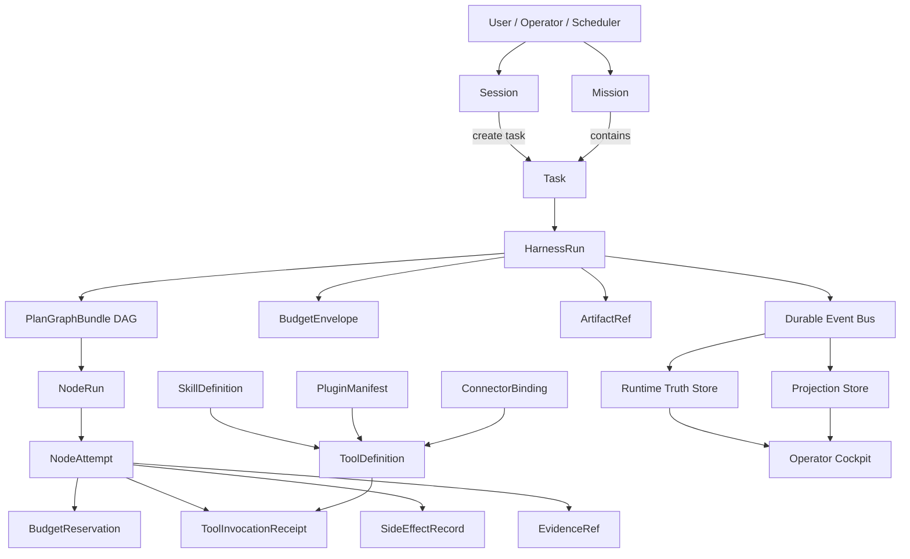
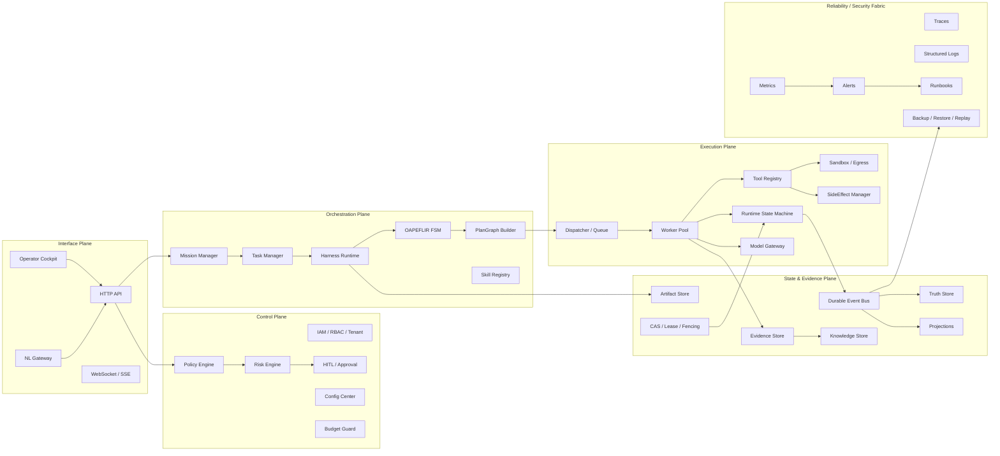
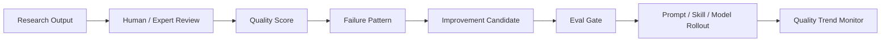

# Automatic Agent Platform — Complete Validation and Real-time Monitoring Solution

> **Version**: v1.7.3 — Repo Closure Patch / v2.0 Baseline Candidate
> **Status**: `repo_validation_baseline_implemented`
> **Applicable System**: Automatic Agent Platform
> **First Validation Business**: LLM Research Intelligence Mission
> **Core Objective**: Prove the platform具备可执行、可观测、可审计、可回放、可阻断、可签字、可复盘的准生产能力 in the Research Intelligence scenario.
> **Terminology Strategy**: De-emphasize `Step`, uniformly use `PlanGraphBundle / NodeRun / NodeAttempt` to describe execution units. `Step` only allowed in legacy compatibility, external document references, or migration instructions.
> **Roadmap Stage and Validation Phase Separation**: Roadmap Stage represents product/business advancement phase; Validation Phase represents validation phase; Runtime Ring / Release Ring represents runtime release level; the three must not be mixed.

---

## Changelog

| Version | Changes |
|---|---|
| v1.0 | Established Research Intelligence Mission validation plan main framework |
| v1.1 | Supplementary Skills / Plugins / Tool Registry / Connector Runtime |
| v1.2 | Added RTM, Evidence Bundle, CI/CD, OTel, data governance, quality scoring, stress testing, status matrix, DR, Incident, RACI |
| v1.3 | Added OAPEFLIR stage matrix, Mission/Task/Session creation strategy, Security/IAM, Operator Cockpit, Metric Definition, Example Validation Run |
| v1.4 | Added RSM/CAS/Lease/Fencing, SideEffect, Config, Model Gateway, Persistence, SLO, Tenant Scheduling, Event/Gate/Metric Registry, Freeze Checklist |
| v1.5 | Fixed event naming, plugin signature rules, RTM Gate/Metric alignment; supplemented Dispatch, Test Quality, Autonomy, Rollout, Docs Drift |
| v1.6 | Completed Gate/Metric/Event/CI/Runbook five Registry closed loops; added Artifact lifecycle, L40S condition validation, Cost attribution extension |
| **v1.7** | **Completed data governance Gate/Metric/CI/Runbook, Evidence Bundle tamper-proofing, Event Payload Schema Registry, Runbook machine metadata, Mission-specific SLO, UI permission chain, all metric closed loops** |
| **v1.7.1** | **Freeze Patch: merged Evidence Bundle Gate sub-items, completed hitl-e2e CI Job, clarified eventName segment regex, clarified aa.* span name does not enter Metric Registry Closure** |
| **v1.7.2** | **Review Patch: distinguished target state from current repo executable baseline; corrected Mission ownership rules, CI Job Registry, machine Registry artifacts and metric caliber over-statement** |
| **v1.7.3** | **Repo Closure Patch: implemented platform validation machine registry, CI job scripts, registry artifact exporter, monitoring metric map and exporter/alert/dashboard guardian tests** |

## Review Patch Conclusions

This review conclusion: This document is suitable as **Validation / Monitoring target plan**, but in v1.7.1 several "should have before freeze" design items were written as "repo already has" acceptance facts. To prevent tests, releases, and operations from executing based on non-existent commands or artifacts, this document uniformly adopts three-layer calibers:

| Layer | Meaning | Allowed Expressions |
|---|---|---|
| Current Repo Baseline | Code, scripts, config, or tests directly locatable in repo | `exists`, `executable`, `repo baseline` |
| Pre-Freeze Target | Machine contracts that must be completed or exported before freeze/sign-off | `must complete`, `target state`, `pre-freeze` |
| External Acceptance | Depends on real environment, real credentials, real on-call, or external systems | `environment acceptance`, `external wiring`, `cannot be proven by this document alone` |

### Issues Found and Revised in This Round

| Issue | Root Cause | Revision Conclusion | Repo Basis |
|---|---|---|---|
| Document top directly marked `freeze_ready_candidate` | Target Gate/Registry tables complete, but machine registry artifacts and several CI job commands not yet one-to-one implemented in repo | Repo baseline implemented, status changed to `repo_validation_baseline_implemented`; real freeze only valid after Chapter 51 environment conditions met | `package.json`, `config/validation/platform-validation-registry.json`, `scripts/validation/platform-validation-closure.mjs` |
| CI Job Registry wrote many non-existent `npm run ...` commands | Expected job names directly written as existing scripts | Chapter 33 supplemented with real package scripts and machine registry; `tests/unit/scripts/platform-validation-closure.test.ts` will prevent job/script mapping from mismatching again | `package.json`, `config/validation/platform-validation-registry.json` |
| Task without归属 automatically falls to `default_system_mission` | Caliber落后于 MissionResolver current implementation | Low/medium risk no Mission can create ad hoc Mission; high risk and side effect tasks no Mission must fail-closed | `src/platform/five-plane-interface/api/http-server/task-routes.ts`, Mission E2E |
| `aa.*` Metric Registry written as current exporter only truth | Target observation semantics mixed with Prometheus exporter / alert rules current exposed names | Chapter 48 declares `aa.*` as target validation registry; current runtime monitoring baseline uses exporter, Prometheus rules, Grafana dashboard as standard | `src/platform/shared/observability/prometheus-metrics-exporter.ts`, `deploy/prometheus/rules/automatic-agent.yml` |
| Prometheus name and unit mapping not becoming explicit freeze condition | exporter, dashboard, alert rules each evolved; document only registered target metrics | Added metric map and closure test; HTTP latency, queue, worker, DLQ, outbox, OAPEFLIR latency alerts all bound to current exporter exposed names, no longer citing stale metrics | `config/validation/platform-monitoring-metric-map.json`, `automatic-agent.yml`, `prometheus-alerts.test.ts` |
| Machine Event/Gate/Metric/Runbook Registry artifacts written as existing premise | Design tables and appendices before machine artifacts | Added machine registry, closure, and artifact exporter; TypeScript event registry is still event source of truth; export snapshot generated by `npm run validation:artifacts` | `src/platform/five-plane-state-evidence/events/event-registry.ts`, `scripts/validation/export-platform-validation-artifacts.ts` |

> This document still retains complete target design; review patch's purpose is not to delete targets, but to prevent "document closed loop" from being misread as "code, CI, environment, and sign-off all closed".

---

## Table of Contents

1. Document Objectives and Validation Boundaries
2. First Validation Business Selection
3. Core Object Relationships
4. Mission / Task / Session Creation Strategy
5. Validation Principles
6. Roadmap Stage and Validation Phase
7. System Overall Architecture Diagram
8. Real-time Monitoring System
9. Dashboard Design
10. Alert System
11. Full Coverage Validation Method
12. Test System
13. Quality Scorecard
14. Release / Graduation Gate
15. Blocking Strategy
16. Evidence Bundle
17. OAPEFLIR Stage-level Validation
18. Skills / Plugins / Tool Registry / Connector Runtime Validation
19. Security / Tenant / IAM Validation
20. Operator Cockpit / UI Validation
21. Runtime State / CAS / Lease / Fencing Validation
22. SideEffect / Reconciliation Validation
23. Config Center / Drift / Rollout Validation
24. Model Gateway Provider / Streaming Validation
25. Persistence / Repository / Migration Validation
26. Dispatch / Queue / Worker Pool Validation
27. Test Quality Governance
28. Autonomy / Runtime Mode Validation
29. Prompt / Skill / Knowledge Rollout Validation
30. Documentation / ADR / Contract Drift Validation
31. Requirement Traceability Matrix
32. Metric Summary
33. CI/CD Validation Pipeline
34. Observability Semantic Convention
35. Research Data Governance
36. Research Output Quality Rubric and Feedback Loop
37. Load / Stress / Capacity Validation
38. Lifecycle Transition Matrix
39. Backup / Restore / DR Validation
40. Incident Lifecycle / Postmortem
41. SLO / Error Budget / Burn-rate Validation
42. Tenant Quota / Fair Scheduling Validation
43. Local Model / L40S GPU Capacity Validation
44. Example Validation Run
45. RACI / Sign-off Matrix
46. Event Naming / Event Schema Registry
47. Gate Registry
48. Metric Registry
49. Runbook Registry
50. Artifact Lifecycle / Integrity Validation
51. Freeze Checklist
52. Final Acceptance Criteria
53. Appendix A: Canonical Event List
54. Appendix B: Test Checklist
55. Appendix C: Dashboard Field List
56. Appendix D: Runbook Registry
57. Appendix E: Machine-Executable Artifact List

---

# 1. Document Objectives and Validation Boundaries

## 1.1 Validation Objectives

This plan validates whether Automatic Agent Platform具备承载第一阶段业务的准生产能力. Validation is not aimed at "can run a Demo", but at these capabilities:

| Capability | Validation Question |
|---|---|
| Correctness | Whether status, budget, evidence, permissions, output conform to contract |
| Reliability | Whether can recover after worker crash, provider failure, event lag, DB restore |
| Security | Whether tenant isolation, IAM, secret, sandbox, egress are fail-closed |
| Auditability | Whether each key decision has principal, trace, auditRef, evidenceRef |
| Replayability | Whether Event → Truth → Projection can be reconstructed and diff=0 |
| Observability | Whether can judge system status in real-time through trace/metric/log/dashboard |
| Scalability | Whether Skills / Plugins / Tools / Connectors can be safely extended |
| Governability | Whether Prompt / Skill / Knowledge / Config / Policy can progressively rollout and rollback |
| Signable | Whether each validation forms signable, archivable Evidence Bundle |

## 1.2 Validation Boundaries

Phase 1 validation uses **LLM Research Intelligence Mission** as business carrier, covering platform core foundation, not covering fully open third-party Marketplace.

| Scope | Included in v1.7 |
|---|---:|
| Mission / Task / Session / Harness / PlanGraph / NodeRun | Yes |
| OAPEFLIR eight stages | Yes |
| Tool Registry / First-party Skills / First-party Plugins / Connectors | Yes |
| Model Gateway / Budget / Cost Attribution | Yes |
| EventBus / Truth / Projection / CAS / Lease / Fencing | Yes |
| HITL / Governance / Knowledge Promotion | Yes |
| Operator Cockpit / Dashboard / Alert / Runbook | Yes |
| Data Governance / Evidence Integrity / Artifact Integrity | Yes |
| Third-party Marketplace | Default off, only validate "cannot open early" Gate |
| External Business Mission | Subsequent Roadmap Stage validation |

---

# 2. First Validation Business Selection

## 2.1 Recommended First Business: LLM Research Intelligence Mission

Reasons:

1. **Low side effects**: Main outputs are reports, knowledge entries, evidence bundles; few external destructive side effects.
2. **Wide coverage**: Can cover paper ingestion, web crawling, LLM review, evidence linking, knowledge沉淀, HITL, release governance.
3. **High business value**: Can support Reasoning / Code / Function Call / Agent / Token Efficiency research沉淀.
4. **Suitable for validating Mission concept**: Research tasks are usually long-term goals, not single Agent Session.
5. **Suitable for gradual introduction of Skills / Plugins**: Paper Reader, Web Search, Evidence Extractor, Knowledge Writer, Report Generator can all serve as first-party skills.

## 2.2 Not Recommended as First Business

| Business | Reasons Not Recommended |
|---|---|
| Code Agent auto code modification | Higher side effects, requires PR sandbox, repo writeback, CI rollback |
| Engineering Ops auto operation | Easy to trigger production environment side effects, needs stronger incident governance |
| Quant Trading / Legal / YONO prediction business | High domain risk, requires extra regulatory, compliance, business model validation |
| Third-party Marketplace | Supply chain and plugin isolation complex, should promote after core platform stabilizes |

---

# 3. Core Object Relationships

## 3.1 Object Definitions

| Object | Definition | Authoritative |
|---|---|---:|
| Mission | Long-term goal, continuous workflow, business unit across multiple Tasks | Yes |
| Task | Single executable work request under Mission | Yes |
| Session | Human-machine interaction context, can produce Task, not equal to Task | Partially authoritative |
| HarnessRun | One controlled execution cycle, bound to Task/PlanGraph/Budget/Risk | Yes |
| PlanGraphBundle | DAG plan structure, replacing linear `steps[]` | Yes |
| NodeRun | Running instance of one node in PlanGraph, replacing legacy step execution | Yes |
| NodeAttempt | One attempt of NodeRun, can retry, multiple attempts | Yes |
| BudgetReservation | Budget reservation before LLM/tool/connector calls | Yes |
| SideEffectRecord | Side effect record of all external writes/releases/notifications/connector calls | Yes |
| EvidenceRef | Evidence reference bound to conclusions, decisions, outputs | Yes |
| ArtifactRef | Report, file, snapshot, evidence bundle product reference | Yes |
| SkillDefinition | Reusable platform capability definition, e.g., Paper Review, Evidence Link | Yes |
| PluginManifest | Plugin/adapter artifact metadata, signature, SBOM, sandbox declaration | Yes |
| ToolInvocationReceipt | Tool invocation audit receipt | Yes |
| ConnectorBinding | External system connector binding and permission boundaries | Yes |

## 3.2 Object Relationship Diagram



---

# 4. Mission / Task / Session Creation Strategy

## 4.1 Creation Rules

| Input Type | Created Object | Rules |
|---|---|---|
| Long-term goal, continuous tracking, cross-task goal | Mission | Must explicitly create Mission |
| Single completed work | Task | Must resolve Mission via MissionResolver before dispatch; low/medium risk can bind existing Mission or create ad hoc Mission |
| Human-machine dialogue, clarification, review | Session | Session can create Task, cannot replace Task |
| Scheduled research summary | Scheduled Task | Belongs to Research Mission |
| Temporary operator query | Session only | Does not create Task unless produces execution action |
| P0 incident repair | Task | Belongs to explicit Incident Mission; no authorized Mission means reject dispatch |
| High-risk or side-effect one-time request | Task | Must explicitly bind Mission; missionless dispatch prohibited |
| Low/medium risk unowned one-time request | Task | Allowed MissionResolver to auto-create ad hoc Mission; orphan task prohibited |

## 4.2 Prohibited Objects

| Prohibited Item | Reason |
|---|---|
| Orphan Task | Cannot do budget, evidence, archive, accountability; current intake should fail-closed on resolution failure |
| Session directly executes side effects | Bypasses Mission/Task/Harness governance |
| PlanStep[] as execution contract | Conflicts with PlanGraphBundle |
| Step as main UI term | Should display NodeRun/NodeAttempt |
| Task directly writes Truth bypassing RSM | Violates state machine and event-driven invariants |

---

# 5. Validation Principles

## 5.1 All Validations Must Be Event-Driven

All authoritative state changes must produce `PlatformFactEvent`, and Truth/Projection can be reconstructed from events.

## 5.2 All Executions Must Be Budget-First

Any LLM/tool/connector/embedding/reranker/external API call within any stage must first `reserveBudget()`, then `settleBudget()` after completion.

## 5.3 All Conclusions Must Be Evidence-Bound

Research conclusions, risk judgments, quality scores, knowledge promotions, release decisions must bind EvidenceRef.

## 5.4 All Validations Must Be Replayable

Validation results must be verifiable through Event Log, Truth Snapshot, Artifact, Evidence Bundle review.

## 5.5 All Writes Must Be Auditable

Writes must include principal, tenantId, traceId, auditRef, expectedVersion, leaseId/fencingToken.

## 5.6 Capability Extension Layer Is First-Class Validation Object

Skill, Tool, Plugin, Connector are not auxiliary capabilities, but Phase 1 core tested objects.

---

# 6. Roadmap Stage and Validation Phase

## 6.1 Roadmap Stage

| Roadmap Stage | Business Scope |
|---|---|
| Stage 1 | Research Intelligence Mission |
| Stage 2 | Supervised Code Agent Mission |
| Stage 3 | Engineering Ops Mission |
| Stage 4 | External Business Mission |
| Stage 5 | Marketplace / Third-party Ecosystem |

## 6.2 Validation Phase

| Validation Phase | Target | Pass Conditions |
|---|---|---|
| validation_phase_0 | Static / Contract / Schema | Contract, schema, types, event, metric, gate registry all pass |
| validation_phase_1 | Single Task E2E | Single Research Task from input to Evidence Bundle full链路 passes |
| validation_phase_2 | Multi-task Mission | Multi-Task Research Mission runs stably |
| validation_phase_3 | Reliability / Security / Chaos | Fault, attack, recovery, replay, DR pass |
| validation_phase_4 | Pre-production Soak | Continuous run, monitoring, alerting, SLO, cost, quality meet standard |

---

# 7. System Overall Architecture Diagram



---

# 8. Real-time Monitoring System

## 8.1 Monitoring Layers

| Layer | Monitoring Objects |
|---|---|
| Business | Mission success, Research quality, Evidence coverage |
| Runtime | HarnessRun, NodeRun, NodeAttempt, Worker, Queue |
| Governance | HITL, Policy, Risk, Autonomy, Config drift |
| Extension | Skill, Tool, Plugin, Connector, Sandbox, Egress |
| State | EventBus, Truth, Projection, CAS, Lease, Fencing |
| Provider | Model Gateway, usage, finish_reason, fallback, cost |
| Security | Tenant isolation, IAM, Secret, PII, Data governance |
| UI | Operator action latency, permission rendering, dashboard freshness |

---

# 9. Dashboard Design

Dashboard must support drilldown from Mission to:

```text
Mission → Task → HarnessRun → PlanGraphBundle → NodeRun → NodeAttempt → Tool/Model/Connector → Evidence/Artifact
```

## 9.1 Core Panels

| Panel | Content |
|---|---|
| Mission Overview | active/completed/failed missions, SLO, quality, cost |
| Runtime Execution | HarnessRun, NodeRun, queue, worker, lease, stuck runtime |
| OAPEFLIR Stage | stage progress, stage failure, stage skip, replan |
| Tool / Plugin Runtime | tool qps, receipt coverage, sandbox violation, signature failure |
| Model Gateway | provider latency, streaming completion, usage coverage, fallback |
| Evidence / Knowledge | evidence coverage, knowledge promotion, artifact integrity |
| Security / Tenant | cross-tenant denial, secret access, data governance |
| CI / Validation | gate status, test quality, mutation score, registry closure |
| Operator Cockpit | HITL queue, P0 alerts, runbook links, action latency |

---

# 10. Alert System

Alert only does runtime trigger description; formal blocking conditions take **Gate Registry** as standard.

| Severity | Response Target | Examples |
|---|---|---|
| P0 | Immediate block / fail-closed | cross-tenant read, stale fencing write, budget missing before tool |
| P1 | Degrade / pause rollout / human intervention | projection lag, provider streaming missing usage |
| P2 | Observe / schedule repair | dashboard stale, low mutation score on noncritical module |
| P3 | Statistical optimization | cost trend, quality drift warning |

---

# 11. Full Coverage Validation Method

This document's "full coverage" refers to **risk, contract, lifecycle, observation, and acceptance evidence coverage**, not claiming current repo has reached 100% code coverage. Code coverage facts, test exclusion audits, and supplementary test routes take `docs_zh/quality/00-full-coverage-test-manual.md`, coverage reports, and CI gates as standard.

## 11.1 Coverage by Five Planes

| Plane | Validation Objects |
|---|---|
| Interface | API, WS, NL Gateway, Operator Cockpit |
| Control | IAM, Policy, Risk, HITL, Budget, Config |
| Orchestration | Mission, Task, OAPEFLIR, Harness, PlanGraph |
| Execution | Dispatcher, Worker, RSM, Tool, Model, Sandbox |
| State & Evidence | EventBus, Truth, Projection, Evidence, Knowledge, Artifact |

## 11.2 Coverage by Lifecycle

All core objects must cover:

```text
created → validated → active/running → blocked/retrying → terminal → archived/replayed
```

## 11.3 Coverage by Capability Extension Layer

Must cover:

```text
SkillDefinition
SkillRegistry
ToolDefinition
ToolRegistry
ToolInvocationRequest
ToolInvocationReceipt
PluginManifest
PluginLifecycle
ConnectorBinding
ConnectorRuntime
SandboxPolicy
EgressPolicy
CapabilityProfile
```

---

# 12. Test System

| Test Type | Target |
|---|---|
| Unit | Single module behavior correctness |
| Contract | Type, schema, event, API, registry alignment |
| Integration | Multi-real-service combination, pure mock prohibited to impersonate integration |
| E2E | Research Mission full链路 |
| Replay | Event → Truth → Projection reconstruction diff=0 |
| Chaos | provider failure, worker crash, DB restore, network failure |
| Security | tenant isolation, SSRF, path traversal, secret leak, PII redaction |
| Test Quality | no-op assertion, fake concurrency, mutation score, fixture schema |
| UI E2E | operator workflow, permission rendering, HITL, dashboard freshness |
| Load / Soak | concurrency, backpressure, memory growth, long-term stability |

---

# 13. Quality Scorecard

Scorecard used for comprehensive judgment, but **any P0 hard gate failure overrides Scorecard score**.

| Dimension | Weight |
|---|---:|
| Functional correctness | 20 |
| Runtime reliability | 15 |
| State / Event / Replay consistency | 15 |
| Security / Tenant / IAM | 15 |
| Evidence / Research quality | 10 |
| Extension runtime safety | 10 |
| Observability / Runbook readiness | 10 |
| Cost / Budget attribution | 5 |

Judgment:

```text
score >= 90 and no P0/P1 open issue → pass
score >= 85 and only P2 waiver → conditional pass
any P0 hard gate failure → fail
```

---

# 14. Release / Graduation Gate

## 14.1 Roadmap Stage 1 Entering Quasi-Production

Must pass:

```text
validation_phase_0 ~ validation_phase_4
Gate Registry all P0/P1 pass
Metric / Event / Runbook / CI / Evidence Bundle registry closed loop
SLO profile for Research Intelligence Mission meets standard
```

## 14.2 Subsequent Roadmap Stage Entry Conditions

Code Agent, Engineering Ops, External Business Mission must additionally pass各自副作用, permissions, rollback, domain compliance Gates.

---

# 15. Blocking Strategy

All blocking strategies take Gate Registry as standard. Must fail-closed in following cases:

```text
cross-tenant read/write
secret access without audit
tool/model call without budget
external side effect without SideEffectRecord
state write without CAS / lease / fencing
plugin signature/provenance/SBOM/sandbox failure
data governance P0 violation
event/truth/projection replay diff
P0 alert without runbook
```

---

# 16. Evidence Bundle

## 16.1 ValidationEvidenceBundle

```ts
type ValidationEvidenceBundle = {
  validationRunId: string;
  missionId: string;
  taskIds: string[];
  validationPhase:
    | "validation_phase_0"
    | "validation_phase_1"
    | "validation_phase_2"
    | "validation_phase_3"
    | "validation_phase_4";

  roadmapStage:
    | "stage_1_research"
    | "stage_2_code"
    | "stage_3_ops"
    | "stage_4_business"
    | "stage_5_marketplace";
  runtimeRing?: string;

  sourceDatasetVersion: string;
  gitCommitSha: string;
  configVersion: string;
  contractSchemaVersion: string;

  eventRegistryVersion: string;
  gateRegistryVersion: string;
  metricRegistryVersion: string;
  ciJobRegistryVersion: string;
  runbookRegistryVersion: string;

  eventRegistryHash: string;
  gateRegistryHash: string;
  metricRegistryHash: string;
  ciJobRegistryHash: string;
  runbookRegistryHash: string;

  testReportRefs: string[];
  coverageReportRefs: string[];
  mutationReportRefs: string[];
  scorecardRef: string;
  dashboardSnapshotRefs: string[];
  eventTruthConsistencyReportRef: string;
  projectionRebuildReportRef: string;
  budgetAuditReportRef: string;
  hitlAuditReportRef: string;
  securityScanReportRef: string;
  pluginRuntimeReportRef: string;
  dataGovernanceReportRef: string;
  artifactIntegrityReportRef: string;

  bundleHash: string;
  signature: string;
  signedBy: string[];
  signedAt: string;

  decision: "pass" | "fail" | "conditional_pass";
  approvedBy: string[];
  createdAt: string;
};
```

## 16.2 Evidence Bundle Gate

Evidence Bundle integrity unifiedly managed by `GATE-EVIDENCE-BUNDLE-001` to avoid same evidence bundle integrity requirement split into multiple Gates causing Registry drift.

| Gate | Blocking Condition |
|---|---|
| GATE-EVIDENCE-BUNDLE-001 | registry snapshot/version/hash/signature missing or mismatched; evidence bundle not bound to git/config/contract/event/gate/metric/CI/runbook version; `bundleHash` verification failed; signature invalid; `signedBy/signedAt` missing |

---

# 17. OAPEFLIR Stage-level Validation

## 17.1 Stage Matrix

| Stage | Must Validate | Budget Semantics | Evidence | Gate |
|---|---|---|---|---|
| Observe | Input normalization, tenant/principal/source binding | Stage itself may have no budget; if calling parser/tool/model must reserve | source evidence | GATE-OAPEFLIR-001 |
| Assess | Risk, complexity, routing, budget feasibility | Budget estimation required; model calls must reserve | assessment evidence | GATE-OAPEFLIR-001 |
| Plan | Output PlanGraphBundle DAG, prohibited PlanStep[] | worst-path budget | plan validation report | GATE-OAPEFLIR-002 |
| Execute | NodeRun / NodeAttempt execution | each model/tool/connector must reserve | execution receipt | GATE-RUNTIME-001 |
| Feedback | Quality assessment, failure classification, replan/HITL/terminate | evaluator/model calls must reserve | quality report | GATE-OAPEFLIR-003 |
| Learn | LearningObject isolation, validation, promotion candidate | embedding/model/write calls must reserve | learning evidence | GATE-ROLLOUT-001 |
| Improve | improvement proposal, rollout proposal | cost assessment required | improvement evidence | GATE-ROLLOUT-001 |
| Release | artifact/knowledge/report release | settle + side-effect record | release evidence | GATE-SIDEEFFECT-001 |

## 17.2 Canonical Stage Event

Use unified event name, distinguish by payload:

```text
oapeflir.stage.started
oapeflir.stage.completed
oapeflir.stage.failed
oapeflir.stage.skipped
oapeflir.stage.blocked
oapeflir.stage.replanned
```

Payload must include:

```ts
type OapeflirStageEventPayload = {
  stage:
    | "observe"
    | "assess"
    | "plan"
    | "execute"
    | "feedback"
    | "learn"
    | "improve"
    | "release";
  missionId: string;
  taskId: string;
  harnessRunId: string;
  traceId: string;
  principalId: string;
  tenantId: string;
  startedAt?: string;
  completedAt?: string;
  skipReason?: string;
  failureReason?: string;
  evidenceRefs: string[];
  budgetReservationIds: string[];
  auditRef: string;
};
```

---

# 18. Skills / Plugins / Tool Registry / Connector Runtime Validation

## 18.1 First-Class Validation Objects

| Object | Description |
|---|---|
| SkillDefinition | Platform capability abstraction |
| ToolDefinition | Tool schema and execution strategy |
| PluginManifest | Plugin artifact, signature, SBOM, sandbox |
| ConnectorBinding | External system connector configuration |
| ToolInvocationReceipt | All tool call audit receipts |

## 18.2 Plugin Lifecycle

```text
registered
→ manifest_validated
→ signature_verified
→ sbom_scanned
→ sandbox_validated
→ loaded
→ active
→ suspended
→ deprecated
→ archived

Exception paths:
signature_failed → rejected
sandbox_violation → suspended / quarantined
critical_cve_detected → revoked
```

## 18.3 Plugin Signature Rules

Allowed three paths:

```text
1. signature verified
2. first-party signed build provenance verified
3. explicit temporary waiver with owner + expiry + risk acceptance
```

Restrictions:

```text
waiver cannot bypass sandbox / egress / capability / SBOM gate
waiver cannot be used for third-party marketplace plugin production activation
waiver must have owner, expiry, risk acceptance, auditRef
```

---

# 19. Security / Tenant / IAM Validation

| Area | Must Validate |
|---|---|
| Tenant Isolation | tenantId required, cross-tenant read/write deny |
| IAM / RBAC | principal capability, role, policy decision |
| Secret Access | secret read audit, rotation, redaction |
| OAuth / SSO | PKCE, token storage, session expiry |
| Sandbox | filesystem/network/process/resource |
| Egress | allowlist, DNS rebinding, SSRF |
| Encryption | AES-GCM/KMS/BYOK, key rotation |
| Audit Integrity | append-only, hash chain, tamper detection |
| Data Classification | public/internal/confidential/restricted |
| Prompt Injection | input/output guardrail |

---

# 20. Operator Cockpit / UI Validation

## 20.1 Must-Test Workflows

```text
Mission list filter
Task detail drilldown
PlanGraph DAG visualization
NodeRun receipt/error/evidence
HITL approve/reject/request_more_context/escalate
Knowledge promotion review
P0 alert → runbook → affected objects
Projection degraded UI warning
offline/reconnect replay
```

## 20.2 UI Permission Chain Matrix

| UI Action | API | Policy Action | Required Capability | Audit Event |
|---|---|---|---|---|
| approve HITL | `POST /hitl/:id/decision` | `approve_hitl` | `hitl.approve` | `hitl.decision.recorded` |
| reject HITL | `POST /hitl/:id/decision` | `reject_hitl` | `hitl.reject` | `hitl.decision.recorded` |
| request more context | `POST /hitl/:id/request-context` | `request_hitl_context` | `hitl.request_context` | `hitl.context.requested` |
| retry NodeRun | `POST /node-runs/:id/retry` | `retry_node_run` | `runtime.retry` | `node.run.retrying` |
| pause Mission | `POST /missions/:id/pause` | `pause_mission` | `mission.pause` | `mission.paused` |
| resume Mission | `POST /missions/:id/resume` | `resume_mission` | `mission.resume` | `mission.resumed` |
| suspend plugin | `POST /plugins/:id/suspend` | `suspend_plugin` | `plugin.admin` | `plugin.suspended` |
| approve rollout | `POST /rollouts/:id/approve` | `approve_rollout` | `rollout.approve` | `rollout.approved` |
| change policy | `PATCH /policies/:id` | `modify_policy` | `policy.admin` | `policy.updated` |

## 20.3 UI SLO

| Metric | Target |
|---|---:|
| `aa.ui.operator.action_latency_ms` | p95 < 800ms |
| `aa.ui.permission.render_mismatch.count` | 0 |
| `aa.ui.dashboard.staleness_ms` | p95 < 5000ms |

---

# 21. Runtime State / CAS / Lease / Fencing Validation

| Capability | Validation Requirements |
|---|---|
| RSM | All state changes must go through RuntimeTransitionCommand |
| CAS | expectedVersion mismatch must be rejected |
| Lease | Expired lease cannot write |
| Fencing | Stale fencingToken must be rejected |
| Terminal | completed/failed/cancelled cannot reverse transition |
| Recovery | Recovery worker must also carry lease + fencing |
| Concurrent terminal | Only one concurrent terminal transition can succeed |

---

# 22. SideEffect / Reconciliation Validation

| Capability | Validation Requirements |
|---|---|
| SideEffectRecord | Each external write must first register |
| Idempotency | Retry cannot resubmit |
| State machine | proposed → reserved → committing → committed / failed / unknown / compensated |
| Pre-commit revalidation | Before commit re-check policy/budget/lease/fencing |
| Reconciliation | Periodic probe external state and reconcile |
| Compensation | Failure must have compensation or HITL |
| Replay safety | replay/time-travel cannot produce real side effects |

---

# 23. Config Center / Drift / Rollout Validation

| Capability | Validation Requirements |
|---|---|
| Config Schema | strict schema |
| Config Version | Each release has configVersion |
| Impact Analyzer | High-risk config must have impact analysis before release |
| Canary Config Rollout | canary / rollback |
| Drift Detection | security/budget/egress/sandbox drift fail-closed |
| Hot Reload | Hot reload failure must not pollute running state |
| Audit | All changes have principal/auditRef |
| Lifecycle | draft → validated → canary → active → rolled_back / archived |

---

# 24. Model Gateway Provider / Streaming Validation

| Scenario | Validation Points |
|---|---|
| Non-streaming | response schema, usage, finish reason |
| Streaming | final chunk, finish_reason, usage accumulation, error propagation |
| Retry | Only retry 429/5xx/timeout, not retry 4xx |
| Circuit breaker | open/half-open/closed state accurate |
| Fallback | fallback decision event |
| Budget | reserve before each model call, settle after |
| Version Lock | Conclusion binds model/prompt/config version |
| Credential | 401/403 key disable/cooldown |

---

# 25. Persistence / Repository / Migration Validation

| Capability | Validation Requirements |
|---|---|
| SQLite / PG parity | Same repository tests both backends |
| SQL Parameterization | String concatenation of user input prohibited |
| Transaction Boundary | event + truth write in same transaction |
| Migration | up/down dry-run, backup, rollback |
| Optimistic Locking | version/CAS |
| Pagination | cursor pagination |
| Retention / Compaction | event/projection/inbox must not grow unbounded |

---

# 26. Dispatch / Queue / Worker Pool Validation

| Capability | Validation Requirements |
|---|---|
| Dispatch Ticket | Create, invalidate, replace must be atomic |
| Queue Admission | Before enqueue check tenant quota, budget, risk, priority |
| Worker Claim | claim + lease must be equivalent atomic |
| Worker Capacity | Concurrency must not exceed capacity |
| Backpressure | queue/event/worker saturation triggers flow control |
| Preemption | critical/high correctly preempts, protected task not preempted |
| Reconciliation | stale ticket, lost claim, orphan lease can be repaired |
| Ordering | Same aggregate / same NodeRun write order controlled |

---

# 27. Test Quality Governance

| Item | Requirements |
|---|---|
| No-op Assertion Scan | Prohibited `assert.ok(true)`, `x >= 0` always-true assertions |
| Catch Swallow Scan | Prohibited `catch { assert.ok(true) }` |
| Integration Reality | Integration must import real services or lightweight real implementation |
| E2E Concurrency Reality | Concurrency must use Promise.all / worker / race harness |
| Mutation Testing | Critical modules need to meet threshold |
| Fixture Validation | Test fixture must schema validate |
| Coverage Quality | Line coverage + branch + mutation + invariant coverage |

## 27.1 Mutation Score Layering

| Module | Minimum Mutation Score |
|---|---:|
| RSM / CAS / Lease / Fencing | ≥90% |
| Budget / Risk / Policy / HITL | ≥85% |
| Tool Registry / Sandbox / Egress | ≥85% |
| Dispatch / Worker claim / SideEffect | ≥85% |
| Research quality rubric | ≥75% |
| UI components | Not mandatory mutation, use interaction + visual regression |

---

# 28. Autonomy / Runtime Mode Validation

| Scenario | Requirements |
|---|---|
| High risk write | Can only be supervised / manual approval |
| P0/P1 incident | Auto degrade to suggestion / supervised |
| frozen | Restricted mode, cannot be considered higher than full_auto |
| full_auto | Cannot bypass risk / budget / HITL |
| propagation | RequestEnvelope → Task → HarnessRun → NodeRun → tool/model call |
| override | Must have policy decision + auditRef |
| recover from frozen | Must have human approval |

---

# 29. Prompt / Skill / Knowledge Rollout Validation

| Object | Validation Requirements |
|---|---|
| PromptBundle | version lock, eval gate, canary, rollback |
| SkillDefinition | schema compatibility, runtime compatibility, deprecation |
| KnowledgeObject | quarantine, validation, promotion, rollback |
| LearningObject | trust state, evidence refs, conflict handling |
| ImprovementCandidate | source evidence, guardrail, rollout level |
| ReleaseRecord | metrics, triggeredBy, auditContext, rollbackRef |

---

# 30. Documentation / ADR / Contract Drift Validation

Must validate:

```text
docs contracts vs TS schemas
ADR canonical objects vs exported types
event list vs Event Registry
metric names vs Metric Registry
gate names vs Gate Registry
deprecated terms scan: WorkflowStep / PlanStep[] / WorkflowState / ControlDirective
```

---

# 31. Requirement Traceability Matrix

> In RTM, Gate must reference Gate Registry ID; Metric must reference formal `aa.*` names registered in Metric Registry.

| Requirement ID | Requirement | Test | Metric | Gate |
|---|---|---|---|---|
| INV-STATE-001 | State changes must be event-driven | state-transition.e2e | `aa.truth.atomicity.violation.count` | GATE-STATE-001 |
| INV-RSM-001 | All state changes go through RSM | rsm-contract | `aa.rsm.bypass.count` | GATE-RSM-001 |
| INV-CAS-001 | Authoritative writes must expectedVersion | cas-concurrency | `aa.cas.conflict.rejected.count` | GATE-CAS-001 |
| INV-LEASE-001 | Writes must validate active lease | lease-expiry | `aa.lease.expired_write.rejected.count` | GATE-LEASE-001 |
| INV-FENCING-001 | Stale fencingToken reject | fencing-stale | `aa.fencing.stale_write.rejected.count` | GATE-FENCING-001 |
| INV-TERMINAL-001 | Terminal state immutable | terminal-cas | `aa.terminal.reverse_transition.count` | GATE-TERMINAL-001 |
| INV-BUDGET-001 | LLM/tool before reserve budget | budget-invariant | `aa.budget.reservation.missing.count` | GATE-BUDGET-001 |
| INV-EVIDENCE-001 | Conclusions bind evidence | evidence-link | `aa.evidence.ref.coverage_ratio` | GATE-EVIDENCE-001 |
| INV-TOOL-001 | Tool must go through Tool Registry | tool-registry | `aa.tool.direct_invocation.count` | GATE-TOOL-001 |
| INV-PLUGIN-001 | Plugin must signature/provenance/SBOM/sandbox | plugin-validate | `aa.plugin.signature.failed.count` | GATE-PLUGIN-001 |
| INV-CONNECTOR-001 | Connector egress must allowlist | connector-egress | `aa.connector.egress.denied.count` | GATE-CONNECTOR-001 |
| INV-HITL-001 | HITL decision must authorized and idempotent | hitl-e2e | `aa.hitl.double_decision.count` | GATE-HITL-001 |
| INV-OAPEFLIR-001 | Each stage boundary must emit event | oapeflir-stage | `aa.oapeflir.stage.event_missing.count` | GATE-OAPEFLIR-001 |
| INV-OAPEFLIR-002 | Plan outputs PlanGraphBundle | plan-graph | `aa.oapeflir.plan.linear_plan.count` | GATE-OAPEFLIR-002 |
| INV-OAPEFLIR-003 | Feedback fail must replan/HITL/terminate | feedback-gate | `aa.oapeflir.feedback.unresolved.count` | GATE-OAPEFLIR-003 |
| INV-TENANT-001 | All objects tenant scoped | tenant-isolation | `aa.tenant.cross_access.denied.count` | GATE-TENANT-001 |
| INV-SECURITY-001 | Secret read needs policy + audit | secret-audit | `aa.secret.access.without_audit.count` | GATE-SECURITY-001 |
| INV-SIDEEFFECT-001 | External side effects must have SideEffectRecord | sideeffect-e2e | `aa.side_effect.without_record.count` | GATE-SIDEEFFECT-001 |
| INV-CONFIG-001 | High-risk config needs impact analysis | config-validate | `aa.config.impact_analysis.missing.count` | GATE-CONFIG-001 |
| INV-CONFIG-002 | Security drift fail-closed | config-drift | `aa.config.security_drift.failopen.count` | GATE-CONFIG-002 |
| INV-MODEL-001 | model call binds budget | model-provider | `aa.model.request.without_budget.count` | GATE-MODEL-001 |
| INV-STORE-001 | SQLite/PG parity | repo-parity | `aa.repository.parity.diff.count` | GATE-STORE-001 |
| INV-DISPATCH-001 | worker claim must bind lease | dispatch-validate | `aa.worker.claim.without_lease.count` | GATE-DISPATCH-001 |
| INV-TEST-001 | Prohibited no-op test | test-quality | `aa.test.noop_assertion.count` | GATE-TEST-001 |
| INV-AUTONOMY-001 | high-risk write cannot full_auto bypass HITL | autonomy-validate | `aa.autonomy.high_risk_full_auto.count` | GATE-AUTONOMY-001 |
| INV-DOCS-001 | docs/contracts cannot reference non-canonical execution object | docs-canonical | `aa.docs.noncanonical_reference.count` | GATE-DOCS-001 |
| INV-DATA-001 | Research data must license/retention/classification | data-governance | `aa.data.source.license_missing.count` | GATE-DATA-001 |
| INV-EVIDENCE-BUNDLE-001 | Evidence Bundle must verify signature and contain registry digest | evidence-bundle | `aa.evidence_bundle.signature.invalid.count` | GATE-EVIDENCE-BUNDLE-001 |

---

# 32. Metric Summary

This chapter only provides core metric summary. **Formal definition takes Chapter 48 Metric Registry as the only source.**

Core categories:

```text
runtime / state / budget / evidence / tool / plugin / connector / model
security / tenant / data / side_effect / config / dispatch / test / autonomy
docs / artifact / gpu / ui / slo / evidence_bundle
```

---

# 33. CI/CD Validation Pipeline

## 33.1 CI Stage

| Stage | Target |
|---|---|
| CI-1 Static | lint, typecheck, schema, docs drift |
| CI-2 Contract | API/Event/Gate/Metric/Runbook registry |
| CI-3 Unit | unit + mutation |
| CI-4 Integration | real service integration |
| CI-5 E2E | Research Mission E2E |
| CI-6 Replay / DR | projection rebuild, restore drill |
| CI-7 Security | tenant/IAM/sandbox/egress/data governance |
| CI-8 Evidence | Evidence Bundle generation + signature |

## 33.2 Current Repo Executable CI / Validation Baseline

Current repo has provided main validation entry points as follows. They are the **current baseline** directly executable or integrable into CI during review; finer validation jobs can be split on this basis, but must not write尚未落地的 commands as existing scripts.

| Baseline Entry | Current Command | Current Usage |
|---|---|---|
| Type and static checks | `npm run typecheck`, `npm run lint` | Types, static rules, basic drift discovery |
| Layered tests | `npm run test:unit`, `npm run test:integration`, `npm run test:e2e`, `npm run test:invariants` | Current unit, integration, E2E, invariant validation |
| Output and performance | `npm run test:golden`, `npm run test:performance` | Golden output stability and performance regression |
| Full-layer validation | `npm run test:layers:full` | Current repo full-layer test aggregation entry |
| Coverage and mutation | `npm run coverage:gate`, `npm run test:mutation` | Coverage ratchet and mutation testing |
| Test exclusion and repo hygiene | `npm run audit:test-exclusions`, `npm run audit:repo-hygiene` | skip/exclusion, review examples, supply chain check |
| Mission operating model closure | `npm run registry:closure`, `npm run playbook:validate`, `npm run mission-outcome:validate` | Current Mission registry/playbook/outcome closed loop scripts |
| Stability evidence baseline | `npm run evidence:stable`, `npm run gate:stable`, `npm run validate:stable` | Current stable evidence / gate / validate CLI paths |

> `deploy/prometheus/`, `deploy/grafana/`, and `deploy/runbooks/` have provided runtime observation baseline; config file correctness guarded by existing deploy golden tests. Real scrape, notification delivery, and on-call drills still belong to environment acceptance.

## 33.3 Machine-readable CI Job Registry

This table describes job granularity and artifacts used for freeze/sign-off. Current repo has provided corresponding scripts in `package.json` and saved job/gate/runbook machine mappings in `config/validation/platform-validation-registry.json`; `npm run platform-registry:closure` and `tests/unit/scripts/platform-validation-closure.test.ts` will verify mapping exists.

| CI Job | Command | Artifact | Required | Blocks |
|---|---|---|---|---|
| contract-validate | `npm run contract:validate` | `contract-report.json` | PR | contract-validate |
| schema-strict | `npm run schema:strict` | `schema-report.json` | PR | schema-strict |
| unit-test | `npm run test:unit` | `unit-report.json` | PR | unit-test |
| mutation-critical | `npm run test:mutation:critical` | `mutation-report.json` | PR/main | mutation-critical |
| integration-test | `npm run test:integration` | `integration-report.json` | main | integration-test |
| research-e2e | `npm run test:e2e:research` | `research-e2e-report.json` | staging | research-e2e |
| hitl-e2e | `npm run test:e2e:hitl` | `hitl-e2e-report.json` | staging | hitl-e2e |
| projection-replay | `npm run test:replay` | `projection-diff.json` | staging | projection-replay |
| dr-restore | `npm run test:dr:restore` | `restore-report.json` | weekly/staging | dr-restore |
| tool-registry-validate | `npm run tool-registry:validate` | `tool-registry-audit.json` | PR | tool-registry-validate |
| plugin-validate | `npm run plugin:validate` | `plugin-validation.json` | PR | plugin-validate |
| connector-egress | `npm run connector:egress:test` | `connector-egress.json` | main | connector-egress |
| security-scan | `npm run security:scan` | `security-report.json` | PR | security-scan |
| security-tenant | `npm run security:tenant` | `tenant-isolation.json` | main | security-tenant |
| data-governance | `npm run data-governance:validate` | `data-governance-report.json` | PR/main | data-governance |
| budget-invariant | `npm run budget:invariant` | `budget-report.json` | PR | budget-invariant |
| rsm-contract | `npm run rsm:contract` | `rsm-report.json` | PR | rsm-contract |
| cas-concurrency | `npm run cas:concurrency` | `cas-report.json` | main | cas-concurrency |
| lease-fencing | `npm run lease:fencing` | `lease-fencing-report.json` | main | lease-fencing |
| sideeffect-e2e | `npm run sideeffect:e2e` | `sideeffect-report.json` | staging | sideeffect-e2e |
| config-validate | `npm run config:validate` | `config-report.json` | PR | config-validate |
| config-drift | `npm run config:drift` | `config-drift-report.json` | main | config-drift |
| model-provider | `npm run model:provider:test` | `model-provider-report.json` | main | model-provider |
| repo-parity | `npm run repo:parity` | `repo-parity-report.json` | main | repo-parity |
| dispatch-validate | `npm run dispatch:validate` | `dispatch-report.json` | main | dispatch-validate |
| test-quality | `npm run test:quality` | `test-quality-report.json` | PR | test-quality |
| test-reality | `npm run test:reality` | `test-reality-report.json` | main | test-reality |
| autonomy-validate | `npm run autonomy:validate` | `autonomy-report.json` | PR | autonomy-validate |
| rollout-validate | `npm run rollout:validate` | `rollout-report.json` | main | rollout-validate |
| docs-canonical | `npm run docs:canonical` | `docs-canonical-report.json` | PR | docs-canonical |
| contract-drift | `npm run contract:drift` | `contract-drift-report.json` | PR | contract-drift |
| docs-registry | `npm run docs:registry` | `docs-registry-report.json` | PR | docs-registry |
| observability-smoke | `npm run observability:smoke` | `observability-report.json` | main | observability-smoke |
| evidence-bundle | `npm run validation:bundle` | `validation-bundle.json` | staging | evidence-bundle |
| artifact-integrity | `npm run artifact:integrity` | `artifact-integrity-report.json` | staging | artifact-integrity |
| gpu-capacity | `npm run gpu:capacity` | `gpu-capacity-report.json` | conditional | gpu-capacity |

### 33.3.1 Script mapping closure

This round supplemented missing direct script mappings for validation jobs, including contract/schema, research/HITL E2E, replay/restore, tool/plugin/connector/security data governance, docs registry, observability smoke, validation bundle, and artifact integrity. Environment-related jobs still need CI runner to save real artifacts; `gpu:capacity` remains conditional validation entry.

---

# 34. Observability Semantic Convention

## 34.1 Span Names

```text
aa.mission.run
aa.task.run
aa.harness.run
aa.oapeflir.stage
aa.plangraph.validate
aa.node.run
aa.node.attempt
aa.tool.invoke
aa.model.request
aa.budget.reserve
aa.budget.settle
aa.hitl.request
aa.hitl.decision
aa.knowledge.promote
aa.event.publish
aa.projection.rebuild
aa.side_effect.commit
```

Note: The above `aa.*` are OTel span names, not metric names. Metric Registry Closure only scans `aa.*` names marked as `Metric`, `指标`, `Alert Metric`, Dashboard metric, RTM Metric, Runbook linkedMetrics; span names managed by this chapter, not entering Chapter 48 Metric Registry.

## 34.2 Required Attributes

```text
trace_id
span_id
tenant_id
mission_id
task_id
harness_run_id
plan_graph_id
node_run_id
node_attempt_id
principal_id
runtime_mode
risk_level
budget_reservation_id
tool_name
model_provider
model_name
prompt_bundle_version
evidence_ref_count
artifact_ref_count
```

## 34.3 Prohibited Items

```text
prompt / secret / PII prohibited from entering normal logs
high-cardinality fields prohibited as metric labels
large fields must enter artifact/evidence store, logs only store ref
```

---

# 35. Research Data Governance

## 35.1 Data Governance Fields

```ts
type ResearchSourceGovernance = {
  sourceId: string;
  sourceType:
    | "paper"
    | "blog"
    | "webpage"
    | "internal_report"
    | "benchmark"
    | "experiment_log";
  license?: string;
  copyrightBoundary:
    | "summary_only"
    | "short_excerpt_allowed"
    | "internal_fulltext_allowed"
    | "restricted";
  dataClass: "public" | "internal" | "confidential" | "restricted";
  retentionPolicy: string;
  contaminationTag?:
    | "benchmark"
    | "train_candidate"
    | "do_not_train"
    | "unknown";
  piiDetected: boolean;
  redactionApplied: boolean;
  tenantId: string;
  accessPolicyRef: string;
};
```

## 35.2 Data Governance Gates

All Research data sources must have:

```text
license / source attribution
copyright boundary
retention policy
contamination tag
PII scan / redaction
tenant scoped access
```

---

# 36. Research Output Quality Rubric and Feedback Loop

## 36.1 Rubric

| Dimension | Score |
|---|---:|
| Claim Faithfulness | 0-5 |
| Evidence Precision | 0-5 |
| Method Understanding | 0-5 |
| Experiment Reliability | 0-5 |
| Self-research Relevance | 0-5 |
| Actionability | 0-5 |
| Risk Awareness | 0-5 |
| Novelty Detection | 0-5 |
| Contradiction Handling | 0-5 |

## 36.2 Feedback Loop



## 36.3 Golden Set

Must maintain:

```text
golden paper set
golden claim/evidence set
expert-labeled benchmark
inter-reviewer agreement report
reviewer drift detection report
```

---

# 37. Load / Stress / Capacity Validation

| Tier | Target |
|---|---|
| Smoke Load | 10 concurrent tasks |
| Pilot Load | 50 concurrent tasks |
| Stress Load | 200 concurrent tasks |
| Soak Test | 7 days continuous run |
| Spike Test | 10x task spike within 5 minutes |
| Backpressure Test | Flow control after EventBus/WorkerPool queue buildup |

---

# 38. Lifecycle Transition Matrix

## 38.1 Mission

| From | To | Allowed | Guard |
|---|---|---:|---|
| draft | active | yes | owner + budget + policy |
| active | paused | yes | operator permission |
| paused | active | yes | resume approval |
| active | completed | yes | all required tasks terminal |
| active | failed | yes | failure evidence |
| completed | active | no | terminal immutable |

## 38.2 NodeRun

| From | To | Allowed | Guard |
|---|---|---:|---|
| queued | running | yes | worker claim + lease |
| running | completed | yes | lease + fencing + receipt |
| running | failed | yes | error + evidence |
| running | retrying | yes | retry budget |
| completed | running | no | terminal immutable |
| failed | completed | no | terminal immutable |

## 38.3 Plugin

| From | To | Allowed | Guard |
|---|---|---:|---|
| registered | manifest_validated | yes | schema strict |
| manifest_validated | signature_verified | yes | signature/provenance |
| signature_verified | sbom_scanned | yes | SBOM scan |
| sbom_scanned | sandbox_validated | yes | sandbox policy |
| sandbox_validated | loaded | yes | lifecycle hook |
| loaded | active | yes | health check |
| active | suspended | yes | operator/security |
| suspended | active | yes | revalidation |
| active | revoked | yes | critical CVE/security |
| active | archived | no | must deprecate first |

## 38.4 ArtifactRef

| From | To | Allowed | Guard |
|---|---|---:|---|
| created | verified | yes | content hash |
| verified | published | yes | access policy + audit |
| published | deprecated | yes | replacement/ref |
| deprecated | archived | yes | retention policy |
| published | recalled | yes | security/compliance incident |
| archived | published | no | immutable archive |

---

# 39. Backup / Restore / DR Validation

Must validate:

```text
Event log backup
Truth store backup
Artifact / Evidence store backup
Knowledge store backup
Config snapshot backup
Restore to staging
Projection rebuild after restore
RPO / RTO measurement
```

---

# 40. Incident Lifecycle / Postmortem

```text
detected
→ triaged
→ mitigated
→ root_caused
→ fixed
→ verified
→ closed
→ postmortem_published
```

Each P0/P1 must have:

```text
incidentId
severity
impact
affectedMissionIds
affectedTaskIds
timeline
rootCause
mitigation
permanentFix
regressionTest
owner
deadline
postmortemRef
```

---

# 41. SLO / Error Budget / Burn-rate Validation

## 41.1 Mission-specific SLO Profiles

| SLO | Research Mission | Code Agent Mission | Ops Mission |
|---|---|---:|---:|
| Evidence coverage | 100% | 100% | 100% |
| Tool receipt coverage | 100% | 100% | 100% |
| Budget attribution coverage | 100% | 100% | 100% |
| Harness completion | ≥95% | ≥90% | ≥98% |
| HITL SLA | 24h | 2h | 15min |
| Recovery RTO | 4h | 1h | 15min |
| Projection lag p95 | <5s | <5s | <2s |
| API availability | ≥99.9% | ≥99.9% | ≥99.95% |

## 41.2 Burn-rate

```text
burn_rate = actual_error_rate / allowed_error_rate
```

| Window | Alert |
|---|---|
| 1h burn_rate > 14x | P1 |
| 6h burn_rate > 6x | P1 |
| 24h burn_rate > 3x | P2 |

---

# 42. Tenant Quota / Fair Scheduling Validation

Must validate:

```text
per-tenant budget
per-tenant concurrency
per-tenant rate limit
worker pool fairness
noisy neighbor isolation
preemption
priority scheduling
protected/system task not evicted
```

---

# 43. Local Model / L40S GPU Capacity Validation

> Conditional chapter: If Roadmap Stage 1 uses local embedding/reranker/local LLM, this chapter must be enabled.

Must validate:

```text
single L40S GPU admission control
GPU memory watermark alert
embedding queue isolation
reranker queue isolation
local model OOM recovery
model unload / evict policy
local vs remote provider fallback
GPU capacity report in Evidence Bundle
```

---

# 44. Example Validation Run

Input: A Reasoning RL paper.

```text
Mission: LLM Research Intelligence Mission
Task: Paper Review Task
PlanGraph nodes:
  source_ingest
  pdf_parse
  claim_extract
  evidence_link
  research_review
  quality_score
  hitl_review
  knowledge_promotion
```

Canonical event sequence example:

```text
oapeflir.stage.started(stage=observe)
oapeflir.stage.completed(stage=observe)
oapeflir.stage.started(stage=assess)
oapeflir.stage.completed(stage=assess)
oapeflir.stage.started(stage=plan)
oapeflir.stage.completed(stage=plan)
oapeflir.stage.started(stage=execute)
node.run.started(node=source_ingest)
tool.invocation.started(tool=paper_fetch)
tool.invocation.completed(tool=paper_fetch)
node.run.completed(node=source_ingest)
node.run.started(node=claim_extract)
model.request.started(provider=...)
model.request.completed(provider=...)
node.run.completed(node=claim_extract)
oapeflir.stage.completed(stage=execute)
oapeflir.stage.started(stage=feedback)
oapeflir.stage.completed(stage=feedback)
oapeflir.stage.started(stage=learn)
oapeflir.stage.completed(stage=learn)
oapeflir.stage.started(stage=release)
artifact.published
oapeflir.stage.completed(stage=release)
validation.evidence_bundle.signed
```

Output:

```text
Trace tree
Budget ledger
ToolInvocationReceipt
Model usage receipt
Evidence Bundle
Research Quality Scorecard
Knowledge Promotion Record
Dashboard Snapshot
```

---

# 45. RACI / Sign-off Matrix

| Module | Owner | Reviewer | Sign-off |
|---|---|---|---|
| Contract / Schema | Platform Architect | Runtime Owner | Tech Lead |
| EventBus / Truth | State-Evidence Owner | QA | Platform Lead |
| Model Gateway / Budget | Model Infra Owner | FinOps | Platform Lead |
| Skills / Plugins | Extension Runtime Owner | Security | Platform Lead |
| Security / Tenant / IAM | Security Owner | Compliance | CISO/Tech Lead |
| HITL / Governance | Control Plane Owner | Compliance | Product Owner |
| Research Quality | Research Lead | Human Reviewer | Business Owner |
| UI Dashboard | Frontend Owner | Operator | Product Owner |
| CI / Test Quality | QA Owner | Platform Owner | Engineering Lead |
| Data Governance | Data Owner | Legal/Compliance | Business Owner |

---

# 46. Event Naming / Event Schema Registry

## 46.1 Naming Convention

```text
<domain>.<object>.<verb>
```

Examples:

```text
oapeflir.stage.completed
tool.invocation.completed
plugin.signature.verified
connector.egress.denied
budget.reservation.created
side_effect.committed
```

Rules:

```text
eventName must use dot-separated canonical form
each segment must match ^[a-z][a-z0-9_]*$
allow snake_case within segment, e.g., side_effect, critical_cve, rate_limited
prohibited kebab-case, camelCase, empty segment, consecutive dots, leading/trailing dots
payload fields can use camelCase or snake_case, but must be consistent within same schema
event schema must be managed by machine-readable registry
```

Therefore, `tool.schema.validation_failed`, `plugin.critical_cve.detected`, `connector.side_effect.recorded` are legal event names; `tool.schemaValidationFailed`, `plugin-critical-cve.detected`, `connector..egress.denied` are illegal.

## 46.2 Machine-readable Event Registry

Current repo event registration source of truth:

```text
src/platform/five-plane-state-evidence/events/event-registry.ts
src/platform/five-plane-state-evidence/events/event-registry-payloads.ts
src/platform/five-plane-state-evidence/events/event-types.ts
```

These source files already carry typed event metadata, payload validator, replay metadata, and compatible period legacy/canonical dual-track. `npm run validation:artifacts` will export current baseline of event/gate/metric/CI/runbook to `artifacts/validation/platform/contracts/`; Event snapshot generated from above TypeScript registry, not reverse replacing source of truth.

```text
event-registry.canonical.json
event-payload-schemas/*.schema.json
typed-event-payloads.generated.ts
event-registry.hash
```

Appendix A is only for reading list. CI takes machine registry as standard.

Each event must define:

```text
eventName
producer
consumers
payloadSchemaRef
requiredFields
compatibilityPolicy
replayBehavior
retentionPolicy
piiPolicy
```

---

# 47. Gate Registry

> Gate Registry is the only formal blocking condition source. Other chapters can only reference Gate ID.

## 47.1 Gate Severity Model

Each Gate must define:

```yaml
gateId: string
defaultSeverity: P0 | P1 | P2 | P3
escalationRules:
  - condition: string
    severity: P0 | P1 | P2 | P3
blocking: true | false
ciJob: string
runbookId: string
owner: string
```

## 47.2 Core Gate Registry

| Gate ID | Name | Default Severity | Blocking Condition | CI Job | Runbook |
|---|---|---:|---|---|
| GATE-PRIORITY-001 | P0 hard gate priority | P0 | any P0 hard gate failed | evidence-bundle | D.1 |
| GATE-STATE-001 | Event/Truth atomicity | P0 | event/truth diff > 0 | projection-replay | D.1 |
| GATE-RSM-001 | RSM transition | P0 | state write bypass RSM | rsm-contract | D.6 |
| GATE-CAS-001 | CAS write | P0 | expectedVersion bypass | cas-concurrency | D.7 |
| GATE-LEASE-001 | Lease validation | P0 | expired lease write accepted | lease-fencing | D.8 |
| GATE-FENCING-001 | Fencing validation | P0 | stale token write accepted | lease-fencing | D.9 |
| GATE-TERMINAL-001 | Terminal immutability | P0 | terminal reverse transition | rsm-contract | D.10 |
| GATE-BUDGET-001 | Budget reservation | P0 | model/tool/connector without reservation | budget-invariant | D.2 |
| GATE-EVIDENCE-001 | Evidence coverage | P0 | claim without evidence | research-e2e | D.11 |
| GATE-EVIDENCE-BUNDLE-001 | Evidence bundle integrity | P0 | missing registry hash/signature | evidence-bundle | D.12 |
| GATE-TOOL-001 | Tool registry | P0 | direct tool invocation | tool-registry-validate | D.13 |
| GATE-PLUGIN-001 | Plugin validation | P0 | signature/provenance/SBOM/sandbox fail | plugin-validate | D.5 |
| GATE-CONNECTOR-001 | Connector egress | P0 | egress bypass allowlist | connector-egress | D.14 |
| GATE-HITL-001 | HITL decision | P0 | unauthorized/double decision | hitl-e2e | D.4 |
| GATE-OAPEFLIR-001 | Stage event | P0 | stage boundary event missing | research-e2e | D.15 |
| GATE-OAPEFLIR-002 | PlanGraph | P0 | linear PlanStep[] used | research-e2e | D.16 |
| GATE-OAPEFLIR-003 | Feedback resolution | P1 | failed feedback unresolved | research-e2e | D.17 |
| GATE-TENANT-001 | Tenant isolation | P0 | cross-tenant access | security-tenant | D.18 |
| GATE-SECURITY-001 | Secret/IAM | P0 | secret access without audit | security-scan | D.19 |
| GATE-DATA-001 | Data governance | P0 | license/retention/PII/classification missing | data-governance | D.26 |
| GATE-SIDEEFFECT-001 | Side effect record | P0 | external write without SideEffectRecord | sideeffect-e2e | D.20 |
| GATE-CONFIG-001 | Config impact | P1 | high-risk config without impact analysis | config-validate | D.22 |
| GATE-CONFIG-002 | Security drift fail-closed | P0 | security drift fail-open | config-drift | D.22 |
| GATE-CONFIG-003 | Budget/egress/sandbox drift | P1 | governance drift unresolved | config-drift | D.22 |
| GATE-CONFIG-004 | Config rollback | P1 | rollout without rollback | config-validate | D.22 |
| GATE-CONFIG-005 | Hot reload safety | P1 | hot reload corrupts runtime | config-validate | D.22 |
| GATE-MODEL-001 | Model provider | P1 | missing usage/finish_reason/version lock | model-provider | D.23 |
| GATE-STORE-001 | Repository parity | P1 | SQLite/PG diff | repo-parity | D.24 |
| GATE-DISPATCH-001 | Dispatch/worker claim | P0 | claim without lease / duplicate active ticket | dispatch-validate | D.21 |
| GATE-RUNTIME-001 | Stuck runtime | P1 | stuck NodeRun over threshold | dispatch-validate | D.3 |
| GATE-TEST-001 | No-op test | P0 | no-op assertion detected | test-quality | D.27 |
| GATE-TEST-002 | Integration reality | P1 | integration uses only mocks/literals | test-reality | D.27 |
| GATE-TEST-003 | Mutation threshold | P1 | mutation score below module threshold | mutation-critical | D.27 |
| GATE-AUTONOMY-001 | Autonomy boundary | P0 | high-risk write full_auto without HITL | autonomy-validate | D.28 |
| GATE-ROLLOUT-001 | Rollout eval/rollback | P1 | release without eval/canary/rollback | rollout-validate | D.29 |
| GATE-DOCS-001 | Docs canonical | P1 | docs mention non-canonical object | docs-canonical | D.30 |
| GATE-DOCS-002 | Duplicate contract | P1 | duplicate incompatible types | contract-drift | D.30 |
| GATE-DOCS-003 | Registry drift | P1 | docs event/metric/gate not registered | docs-registry | D.30 |
| GATE-OBS-001 | Observability/runbook | P0 | P0 alert without runbook/trace/metric | observability-smoke | D.25 |
| GATE-DR-001 | Restore/replay | P0 | restore projection diff > 0 | dr-restore | D.31 |
| GATE-ARTIFACT-001 | Artifact integrity | P1 | hash mismatch / access without policy | artifact-integrity | D.32 |
| GATE-GPU-001 | Local GPU capacity | P1 | local model OOM/admission failure | gpu-capacity | D.33 |
| GATE-MARKETPLACE-OFF-001 | Marketplace disabled | P0 | third-party marketplace enabled in Stage 1 | config-validate | D.34 |

---

# 48. Metric Registry

> Metric Registry is the only formal metric source for validation target semantics. All `aa.*` target metrics appearing in main text, Runbook, Dashboard, RTM must be registered in this chapter.

Current repo runtime monitoring baseline still takes Prometheus metrics exposed by `src/platform/shared/observability/prometheus-metrics-exporter.ts`, `deploy/prometheus/rules/automatic-agent.yml`, and `deploy/grafana/dashboards/automatic-agent.json` as standard, e.g., `http_requests_total`, `queued_tasks`, `redis_connection_errors`, `event_loop_lag_ms`, `disk_used_ratio`. This chapter's `aa.*` represents validation semantic registry; runtime exporter mapping managed by `config/validation/platform-monitoring-metric-map.json`.

This round has converged HTTP latency alert query to `_ms` histogram, and queue, worker, DLQ, outbox, OAPEFLIR latency alerts to exporter current exposed names. `npm run observability:smoke` will verify **exporter exposed names, dashboard query, alert query, unit threshold** no longer drift.

Metric Closure scanning rules: only scan `aa.*` names clearly marked as `Metric`, `指标`, `Alert Metric`, `linkedMetrics`, `RTM Metric`, `Dashboard Metric` in table column names or field names. OTel span names listed in Chapter 34 also use `aa.*` prefix but are not metrics and do not require entry into this chapter.

Fields:

| Field | Description |
|---|---|
| Metric | metric name |
| Type | counter / gauge / histogram |
| Formula | calculation caliber |
| Window | aggregation window |
| Labels | allowed labels |
| Source | data source |
| Dashboard | belonging panel |
| Alert | related Alert/Gate |
| Owner | responsible person |
| Target | target |

## 48.1 Core Metrics

| Metric | Type | Formula | Window | Labels | Source | Dashboard | Alert | Owner | Target |
|---|---|---|---|---|---|---|---|---|---|
| `aa.truth.atomicity.violation.count` | counter | event/truth mismatch | real-time | tenant,aggregate | Truth/Event audit | State | GATE-STATE-001 | State Owner | 0 |
| `aa.rsm.bypass.count` | counter | state writes not via RSM | real-time | aggregate | RSM audit | Runtime | GATE-RSM-001 | Runtime Owner | 0 |
| `aa.cas.conflict.rejected.count` | counter | CAS conflicts rejected | real-time | aggregate | CAS | Runtime | GATE-CAS-001 | Runtime Owner | >=0 |
| `aa.lease.expired_write.rejected.count` | counter | expired lease writes rejected | real-time | worker,node | Lease service | Runtime | GATE-LEASE-001 | Runtime Owner | >=0 |
| `aa.fencing.stale_write.rejected.count` | counter | stale token writes rejected | real-time | worker,node | Fencing | Runtime | GATE-FENCING-001 | Runtime Owner | >=0 |
| `aa.terminal.reverse_transition.count` | counter | terminal reverse attempts | real-time | object | RSM | Runtime | GATE-TERMINAL-001 | Runtime Owner | 0 accepted |
| `aa.budget.reservation.missing.count` | counter | calls without budgetReservationId | real-time | stage,kind | Budget audit | Budget | GATE-BUDGET-001 | FinOps | 0 |
| `aa.model.request.without_budget.count` | counter | model calls without budget | real-time | provider,model | ModelGateway | Model | GATE-MODEL-001 | Model Infra | 0 |
| `aa.model.usage.missing.count` | counter | model response missing usage | real-time | provider,model | ModelGateway | Model | GATE-MODEL-001 | Model Infra | 0 |
| `aa.model.streaming.finish_reason.missing.count` | counter | streaming missing finish reason | real-time | provider,model | ModelGateway | Model | GATE-MODEL-001 | Model Infra | 0 |
| `aa.model.version_lock.missing.count` | counter | output missing model/prompt/config version | per task | provider | Model receipts | Model | GATE-MODEL-001 | Model Infra | 0 |
| `aa.evidence.ref.coverage_ratio` | gauge | claims_with_evidence / total_claims | per task | mission,domain | EvidenceStore | Evidence | GATE-EVIDENCE-001 | Research Owner | 1.0 |
| `aa.evidence_bundle.signature.invalid.count` | counter | invalid bundle signature/hash | per validation | phase | EvidenceBundle | Validation | GATE-EVIDENCE-BUNDLE-001 | QA Owner | 0 |
| `aa.tool.direct_invocation.count` | counter | tool invoked outside registry | real-time | tool | Tool audit | Tool | GATE-TOOL-001 | Extension Owner | 0 |
| `aa.tool.invocation.without_receipt.count` | counter | tool call missing receipt | real-time | tool | ToolRegistry | Tool | GATE-TOOL-001 | Extension Owner | 0 |
| `aa.plugin.signature.failed.count` | counter | signature/provenance failed | real-time | plugin | PluginRegistry | Plugin | GATE-PLUGIN-001 | Extension Owner | 0 active |
| `aa.plugin.sandbox_violation.count` | counter | sandbox violation | real-time | plugin | Sandbox | Plugin | GATE-PLUGIN-001 | Security | 0 |
| `aa.plugin.sbom.scan_failed.count` | counter | SBOM scan failed | per plugin | plugin | SBOM scanner | Plugin | GATE-PLUGIN-001 | Security | 0 active |
| `aa.connector.egress.denied.count` | counter | egress denied | real-time | connector,domain | Egress policy | Connector | GATE-CONNECTOR-001 | Security | >=0 |
| `aa.hitl.unauthorized_decision.count` | counter | unauthorized HITL decision | real-time | tenant | HITL audit | HITL | GATE-HITL-001 | Control Owner | 0 |
| `aa.hitl.double_decision.count` | counter | repeated terminal decision | real-time | request | HITL audit | HITL | GATE-HITL-001 | Control Owner | 0 |
| `aa.oapeflir.stage.event_missing.count` | counter | missing stage event | per run | stage | Stage audit | OAPEFLIR | GATE-OAPEFLIR-001 | Orchestration | 0 |
| `aa.oapeflir.plan.linear_plan.count` | counter | PlanStep[] detected | per plan | mission | Plan validator | OAPEFLIR | GATE-OAPEFLIR-002 | Orchestration | 0 |
| `aa.oapeflir.feedback.unresolved.count` | counter | feedback fail without action | per run | stage | Harness | OAPEFLIR | GATE-OAPEFLIR-003 | Orchestration | 0 |
| `aa.tenant.cross_access.denied.count` | counter | cross-tenant attempts denied | real-time | tenant | IAM | Security | GATE-TENANT-001 | Security | >=0 |
| `aa.secret.access.without_audit.count` | counter | secret read missing audit | real-time | principal | IAM | Security | GATE-SECURITY-001 | Security | 0 |
| `aa.data.source.license_missing.count` | counter | source without license metadata | per source | sourceType | Data governance | Data | GATE-DATA-001 | Data Owner | 0 |
| `aa.data.source.retention_policy_missing.count` | counter | missing retention policy | per source | sourceType | Data governance | Data | GATE-DATA-001 | Data Owner | 0 |
| `aa.data.pii.redaction_missing.count` | counter | PII detected without redaction | per source | dataClass | PII scanner | Data | GATE-DATA-001 | Security | 0 |
| `aa.data.contamination_tag_missing.count` | counter | benchmark/train tag missing | per source | sourceType | Data governance | Data | GATE-DATA-001 | Data Owner | 0 |
| `aa.data.copyright_boundary_violation.count` | counter | content exceeds allowed boundary | per output | sourceType | Data governance | Data | GATE-DATA-001 | Legal | 0 |
| `aa.data.restricted_access_bypass.count` | counter | restricted data access bypass | real-time | tenant | IAM/Data | Security | GATE-DATA-001 | Security | 0 |
| `aa.side_effect.without_record.count` | counter | external effect without record | real-time | connector | SideEffectMgr | SideEffect | GATE-SIDEEFFECT-001 | Runtime | 0 |
| `aa.side_effect.unknown.count` | gauge | unknown side effects | 5m | connector | Reconciliation | SideEffect | GATE-SIDEEFFECT-001 | Runtime | 0 |
| `aa.side_effect.reconciliation.lag_ms` | histogram | now - last reconciliation | 5m | connector | Reconciliation | SideEffect | GATE-SIDEEFFECT-001 | Runtime | p95 < 5m |
| `aa.config.impact_analysis.missing.count` | counter | high-risk config without impact | per rollout | configType | ConfigCenter | Config | GATE-CONFIG-001 | Control | 0 |
| `aa.config.security_drift.failopen.count` | counter | security drift did not fail-close | real-time | configType | Config drift | Config | GATE-CONFIG-002 | Security | 0 |
| `aa.repository.parity.diff.count` | counter | SQLite/PG behavior diff | per test | repo | Repo parity | Storage | GATE-STORE-001 | Storage | 0 |
| `aa.dispatch.ticket.duplicate.count` | counter | duplicate active ticket | real-time | queue | Dispatcher | Dispatch | GATE-DISPATCH-001 | Runtime | 0 |
| `aa.worker.claim.without_lease.count` | counter | worker claim without lease | real-time | worker | Dispatcher | Dispatch | GATE-DISPATCH-001 | Runtime | 0 |
| `aa.queue.backpressure.active` | gauge | queue/event/worker backpressure active | real-time | queue | Queue | Dispatch | GATE-DISPATCH-001 | Runtime | expected under saturation |
| `aa.node.run.stuck.count` | gauge | running NodeRun older than timeout | 1m | tenant,risk | Truth/Dispatcher | Runtime | GATE-RUNTIME-001 | Runtime | 0 |
| `aa.node.run.stuck.duration_ms` | histogram | now - startedAt for stuck NodeRun | 1m | tenant,risk | Truth | Runtime | GATE-RUNTIME-001 | Runtime | p95 within SLA |
| `aa.node.run.recovery.success_ratio` | gauge | recovered / stuck | 1h | tenant | Recovery | Runtime | GATE-RUNTIME-001 | Runtime | >=0.95 |
| `aa.test.noop_assertion.count` | counter | no-op assertions detected | per CI | file | Static scan | CI | GATE-TEST-001 | QA | 0 |
| `aa.test.catch_swallow.count` | counter | catch swallowing failures | per CI | file | Static scan | CI | GATE-TEST-001 | QA | 0 |
| `aa.test.fake_concurrency.count` | counter | fake concurrency tests | per CI | file | Test audit | CI | GATE-TEST-002 | QA | 0 |
| `aa.test.mutation.score` | gauge | mutation score | per module | module | Mutation | CI | GATE-TEST-003 | QA | threshold |
| `aa.autonomy.high_risk_full_auto.count` | counter | high-risk full_auto without HITL | real-time | domain | Autonomy | Governance | GATE-AUTONOMY-001 | Control | 0 |
| `aa.autonomy.override_without_audit.count` | counter | runtime mode override without audit | real-time | principal | Autonomy | Governance | GATE-AUTONOMY-001 | Control | 0 |
| `aa.docs.noncanonical_reference.count` | counter | docs legacy object refs | per CI | doc | Docs scan | Docs | GATE-DOCS-001 | Architect | 0 |
| `aa.docs.unregistered_metric.count` | counter | metric in docs not in registry | per CI | doc | Docs registry scan | Docs | GATE-DOCS-003 | Architect | 0 |
| `aa.docs.unregistered_gate.count` | counter | gate in docs not in registry | per CI | doc | Docs registry scan | Docs | GATE-DOCS-003 | Architect | 0 |
| `aa.observability.trace_missing.count` | counter | required trace missing | per validation | span | OTel audit | Observability | GATE-OBS-001 | SRE | 0 |
| `aa.observability.runbook_missing.count` | counter | P0 alert missing runbook | per validation | gate | Runbook registry | Observability | GATE-OBS-001 | SRE | 0 |
| `aa.projection.rebuild.diff.count` | counter | projection diff after replay | per replay | projection | Replay job | State | GATE-DR-001 | State | 0 |
| `aa.dr.restore_success.count` | counter | successful restore drills | weekly | env | DR job | DR | GATE-DR-001 | SRE | >=1/week |
| `aa.research.quality.score` | gauge | rubric weighted score | per output | mission | Review | Research | Quality gate | Research | >= target |
| `aa.cost.attribution.coverage_ratio` | gauge | attributed_cost / total_cost | per mission | provider,stage | CostTracker | Cost | GATE-BUDGET-001 | FinOps | 1.0 |
| `aa.artifact.hash_mismatch.count` | counter | artifact hash mismatch | per artifact | artifactType | ArtifactStore | Artifact | GATE-ARTIFACT-001 | State | 0 |
| `aa.artifact.recall.propagation_lag_ms` | histogram | recall propagation lag | per recall | artifactType | ArtifactStore | Artifact | GATE-ARTIFACT-001 | State | p95 < 1h |
| `aa.artifact.access_without_policy.count` | counter | artifact access without policy | real-time | tenant | IAM/Artifact | Artifact | GATE-ARTIFACT-001 | Security | 0 |
| `aa.gpu.memory.watermark_ratio` | gauge | used / total gpu memory | 1m | gpu,model | GPU monitor | GPU | GATE-GPU-001 | Infra | <0.9 |
| `aa.gpu.oom.count` | counter | GPU OOM events | real-time | model | GPU monitor | GPU | GATE-GPU-001 | Infra | 0 in validation |
| `aa.ui.operator.action_latency_ms` | histogram | user action to acknowledged response | 5m | action,role | UI telemetry | UI | UI SLO | Frontend | p95 < 800ms |
| `aa.ui.permission.render_mismatch.count` | counter | UI allowed but backend denied or inverse | per test | role,action | UI E2E | UI | UI Gate | Frontend | 0 |
| `aa.ui.dashboard.staleness_ms` | histogram | now - last projection update | 1m | dashboard | UI telemetry | UI | UI Gate | Frontend | p95 < 5000ms |

---

# 49. Runbook Registry

> Runbook Registry has been incorporated into `config/validation/platform-validation-registry.json`; current repo retains `deploy/runbooks/` production manuals and Appendix D detailed human-readable runbooks. Closure verifies each Gate referenced runbook id has appendix paragraph and machine mapping; Evidence Bundle output by `validation:bundle` registry snapshot.

Each runbook must have:

```yaml
runbookId: string
title: string
severity: P0 | P1 | P2 | P3
owner: string
linkedGates: string[]
linkedMetrics: string[]
automationAllowed: none | partial | full
requiresHumanApproval: boolean
rollbackSupported: boolean
lastReviewedAt: string
```

---

# 50. Artifact Lifecycle / Integrity Validation

Must validate:

```text
artifact content hash
artifact storage backend
artifact immutability
artifact retention
artifact recall propagation
artifact access policy
artifact export audit
```

---

# 51. Freeze Checklist

## 51.1 Registry Closure

| Registry | Must Satisfy |
|---|---|
| Gate Registry | All Gates cited in main text are registered, and can export machine snapshots |
| Metric Registry | All aa.* target metrics in main text/Runbook/Dashboard/RTM are registered, and have current exporter or collection mapping |
| Event Registry | Current source registry consistent with exported snapshot; canonical events have payload schema, legacy events have compatibility strategy |
| CI Job Registry | All CI jobs cited in Gates are registered, and can map to real scripts or CI workflow |
| Runbook Registry | Each P0 Gate bound to runbook; machine registry consistent with `deploy/runbooks/` / Appendix D without drift |
| Evidence Bundle | Contains all registry version/hash/signature; only uses `GATE-EVIDENCE-BUNDLE-001` as unified integrity Gate |

## 51.2 Final Freeze Conditions

```text
All P0 Gates pass
All P1 Gates pass or have owner+expiry+waiver
Scorecard >= 90
Research Mission SLO meets standard
Evidence Bundle signature passes
Projection rebuild diff = 0
Data Governance Gate passes
Runbook Registry closure passes
Each required job in CI Job Registry has real execution mapping
Metric Registry and Prometheus exporter/alert mapping reviewed
```

---

# 52. Final Acceptance Criteria

After v1.7 passes, can freeze as:

```text
v2.0 — Automatic Agent Platform Validation Baseline
```

Admission conditions:

1. Research Intelligence Mission full E2E passes.
2. Mission / Task / HarnessRun / PlanGraph / NodeRun / NodeAttempt full链路 traceable.
3. All state changes event-driven and replayable.
4. All LLM / tool / connector calls budget reserved first.
5. All conclusions and releases bind EvidenceRef / ArtifactRef.
6. Skills / Plugins / Tool Registry pass signature, SBOM, sandbox, egress, receipt verification.
7. Security / Tenant / IAM / Data Governance all P0 Gates pass.
8. RSM / CAS / Lease / Fencing all concurrency verification passes.
9. Dispatch / Worker / Queue / Backpressure verification passes.
10. Model Gateway streaming / usage / fallback / version lock passes.
11. Persistence / Migration / DR restore / Projection rebuild diff=0.
12. CI/CD, Gate, Metric, Event, Runbook, Evidence Bundle five Registry closed loop.
13. Operator Cockpit can complete real governance operations and pass permission chain verification.
14. Evidence Bundle signature passes and can be archived for review.

---

# 53. Appendix A: Canonical Event List

## A.1 OAPEFLIR

```text
oapeflir.stage.started
oapeflir.stage.completed
oapeflir.stage.failed
oapeflir.stage.skipped
oapeflir.stage.blocked
oapeflir.stage.replanned
```

## A.2 Runtime

```text
mission.created
mission.activated
mission.paused
mission.resumed
mission.completed
mission.failed
task.created
task.accepted
task.running
task.completed
task.failed
harness.run.created
harness.run.started
harness.run.blocked
harness.run.completed
node.run.queued
node.run.started
node.run.retrying
node.run.completed
node.run.failed
node.attempt.started
node.attempt.completed
node.attempt.failed
```

## A.3 Budget / Cost

```text
budget.reservation.created
budget.reservation.denied
budget.reservation.settled
budget.reservation.expired
cost.attribution.recorded
```

## A.4 Tool

```text
tool.registered
tool.resolved
tool.invocation.requested
tool.invocation.started
tool.invocation.completed
tool.invocation.failed
tool.schema.validation_failed
tool.policy.denied
tool.budget.denied
```

## A.5 Plugin

```text
plugin.registered
plugin.manifest.validated
plugin.signature.verified
plugin.signature.failed
plugin.sbom.scanned
plugin.sbom.scan_failed
plugin.sandbox.validated
plugin.sandbox.violation
plugin.loaded
plugin.activated
plugin.suspended
plugin.deprecated
plugin.archived
plugin.rejected
plugin.quarantined
plugin.revoked
plugin.critical_cve.detected
```

## A.6 Connector

```text
connector.bound
connector.health.changed
connector.egress.allowed
connector.egress.denied
connector.rate_limited
connector.circuit.opened
connector.side_effect.recorded
```

## A.7 Evidence / Artifact / Knowledge

```text
evidence.ref.created
evidence.bundle.created
evidence.bundle.signed
artifact.created
artifact.verified
artifact.published
artifact.deprecated
artifact.archived
artifact.recalled
knowledge.object.quarantined
knowledge.object.validated
knowledge.object.promoted
knowledge.object.rollback_requested
```

## A.8 Data Governance

```text
data.source.registered
data.source.classified
data.source.license.missing
data.pii.detected
data.pii.redacted
data.retention.applied
data.contamination.tagged
data.governance.failed
```

---

# 54. Appendix B: Test Checklist

```text
B.1 Mission / Task / Session Tests
B.2 OAPEFLIR Stage Tests
B.3 PlanGraph / DAG Tests
B.4 RSM / CAS / Lease / Fencing Tests
B.5 Budget / Cost Tests
B.6 Tool Registry Tests
B.7 Plugin Runtime Tests
B.8 Connector Runtime Tests
B.9 Sandbox / Egress Tests
B.10 Model Gateway / Streaming Tests
B.11 EventBus / Truth / Projection Tests
B.12 SideEffect / Reconciliation Tests
B.13 Config / Drift / Rollout Tests
B.14 Persistence / Migration Tests
B.15 Dispatch / Worker / Queue Tests
B.16 Test Quality Governance Tests
B.17 Autonomy / Runtime Mode Tests
B.18 Prompt / Skill / Knowledge Rollout Tests
B.19 Docs / ADR / Contract Drift Tests
B.20 Data Governance Tests
B.21 Evidence Bundle Integrity Tests
B.22 UI Operator Cockpit Tests
B.23 DR / Restore Tests
B.24 GPU Capacity Tests
```

---

# 55. Appendix C: Dashboard Field List

```text
Mission:
  active_missions
  failed_missions
  mission_slo_status
  research_quality_score

Runtime:
  harness_runs
  node_runs
  stuck_node_runs
  worker_claims
  queue_depth
  backpressure_active

OAPEFLIR:
  stage_status
  stage_failure_count
  stage_skip_count
  replan_count

Tool / Plugin / Connector:
  tool_invocation_qps
  tool_receipt_coverage
  plugin_signature_failed_count
  plugin_sandbox_violation_count
  connector_egress_denied_count

Model:
  model_usage_missing_count
  streaming_finish_reason_missing_count
  fallback_count
  cost_attribution_ratio

Security / Data:
  cross_tenant_denied_count
  secret_access_without_audit
  data_license_missing_count
  pii_redaction_missing_count

Artifact / Evidence:
  evidence_coverage_ratio
  artifact_hash_mismatch_count
  evidence_bundle_signature_status

CI / Registry:
  gate_closure_status
  metric_registry_closure_status
  event_schema_registry_status
  runbook_registry_closure_status
```

---

# 56. Appendix D: Runbook Registry

## D.1 Event / Truth Inconsistency

```yaml
runbookId: D.1
title: Event / Truth Inconsistency
severity: P0
owner: State-Evidence Owner
linkedGates: [GATE-STATE-001, GATE-PRIORITY-001]
linkedMetrics: [aa.truth.atomicity.violation.count]
automationAllowed: partial
requiresHumanApproval: true
rollbackSupported: true
lastReviewedAt: "YYYY-MM-DD"
```

## D.2 Budget Missing / Overspend

```yaml
runbookId: D.2
title: Budget Missing / Overspend
severity: P0
owner: FinOps Owner
linkedGates: [GATE-BUDGET-001]
linkedMetrics:
  [aa.budget.reservation.missing.count, aa.cost.attribution.coverage_ratio]
automationAllowed: partial
requiresHumanApproval: true
rollbackSupported: true
lastReviewedAt: "YYYY-MM-DD"
```

## D.3 Stuck NodeRun

```yaml
runbookId: D.3
title: Stuck NodeRun
severity: P1
owner: Runtime Owner
linkedGates: [GATE-RUNTIME-001]
linkedMetrics:
  [
    aa.node.run.stuck.count,
    aa.node.run.stuck.duration_ms,
    aa.node.run.recovery.success_ratio,
  ]
automationAllowed: partial
requiresHumanApproval: false
rollbackSupported: true
lastReviewedAt: "YYYY-MM-DD"
```

## D.4 HITL Timeout / Invalid Decision

```yaml
runbookId: D.4
title: HITL Timeout / Invalid Decision
severity: P0
owner: Control Plane Owner
linkedGates: [GATE-HITL-001]
linkedMetrics:
  [aa.hitl.unauthorized_decision.count, aa.hitl.double_decision.count]
automationAllowed: partial
requiresHumanApproval: true
rollbackSupported: true
lastReviewedAt: "YYYY-MM-DD"
```

## D.5 Plugin Sandbox Violation

```yaml
runbookId: D.5
title: Plugin Sandbox Violation
severity: P0
owner: Extension Runtime Owner
linkedGates: [GATE-PLUGIN-001]
linkedMetrics:
  [aa.plugin.sandbox_violation.count, aa.plugin.signature.failed.count]
automationAllowed: partial
requiresHumanApproval: true
rollbackSupported: true
lastReviewedAt: "YYYY-MM-DD"
```

## D.6 RSM Bypass

```yaml
runbookId: D.6
title: Runtime State Machine Bypass
severity: P0
owner: Runtime Owner
linkedGates: [GATE-RSM-001]
linkedMetrics: [aa.rsm.bypass.count]
automationAllowed: none
requiresHumanApproval: true
rollbackSupported: true
lastReviewedAt: "YYYY-MM-DD"
```

## D.7 CAS Conflict / Bypass

```yaml
runbookId: D.7
title: CAS Conflict / Bypass
severity: P0
owner: Runtime Owner
linkedGates: [GATE-CAS-001]
linkedMetrics: [aa.cas.conflict.rejected.count]
automationAllowed: partial
requiresHumanApproval: true
rollbackSupported: true
lastReviewedAt: "YYYY-MM-DD"
```

## D.8 Lease Expired Write

```yaml
runbookId: D.8
title: Lease Expired Write
severity: P0
owner: Runtime Owner
linkedGates: [GATE-LEASE-001]
linkedMetrics: [aa.lease.expired_write.rejected.count]
automationAllowed: partial
requiresHumanApproval: true
rollbackSupported: true
lastReviewedAt: "YYYY-MM-DD"
```

## D.9 Fencing Stale Write

```yaml
runbookId: D.9
title: Fencing Stale Write
severity: P0
owner: Runtime Owner
linkedGates: [GATE-FENCING-001]
linkedMetrics: [aa.fencing.stale_write.rejected.count]
automationAllowed: partial
requiresHumanApproval: true
rollbackSupported: true
lastReviewedAt: "YYYY-MM-DD"
```

## D.10 Terminal Reverse Transition

```yaml
runbookId: D.10
title: Terminal Reverse Transition
severity: P0
owner: Runtime Owner
linkedGates: [GATE-TERMINAL-001]
linkedMetrics: [aa.terminal.reverse_transition.count]
automationAllowed: none
requiresHumanApproval: true
rollbackSupported: true
lastReviewedAt: "YYYY-MM-DD"
```

## D.11 Evidence Coverage Failure

```yaml
runbookId: D.11
title: Evidence Coverage Failure
severity: P0
owner: Research Owner
linkedGates: [GATE-EVIDENCE-001]
linkedMetrics: [aa.evidence.ref.coverage_ratio]
automationAllowed: partial
requiresHumanApproval: true
rollbackSupported: false
lastReviewedAt: "YYYY-MM-DD"
```

## D.12 Evidence Bundle Integrity Failure

```yaml
runbookId: D.12
title: Evidence Bundle Integrity Failure
severity: P0
owner: QA Owner
linkedGates: [GATE-EVIDENCE-BUNDLE-001]
linkedMetrics: [aa.evidence_bundle.signature.invalid.count]
automationAllowed: none
requiresHumanApproval: true
rollbackSupported: false
lastReviewedAt: "YYYY-MM-DD"
```

## D.13 Tool Registry Bypass

```yaml
runbookId: D.13
title: Tool Registry Bypass
severity: P0
owner: Extension Runtime Owner
linkedGates: [GATE-TOOL-001]
linkedMetrics:
  [aa.tool.direct_invocation.count, aa.tool.invocation.without_receipt.count]
automationAllowed: partial
requiresHumanApproval: true
rollbackSupported: true
lastReviewedAt: "YYYY-MM-DD"
```

## D.14 Connector Egress Denied / Bypass

```yaml
runbookId: D.14
title: Connector Egress Policy Failure
severity: P0
owner: Security Owner
linkedGates: [GATE-CONNECTOR-001]
linkedMetrics: [aa.connector.egress.denied.count]
automationAllowed: partial
requiresHumanApproval: true
rollbackSupported: true
lastReviewedAt: "YYYY-MM-DD"
```

## D.15 OAPEFLIR Stage Event Missing

```yaml
runbookId: D.15
title: OAPEFLIR Stage Event Missing
severity: P0
owner: Orchestration Owner
linkedGates: [GATE-OAPEFLIR-001]
linkedMetrics: [aa.oapeflir.stage.event_missing.count]
automationAllowed: partial
requiresHumanApproval: true
rollbackSupported: true
lastReviewedAt: "YYYY-MM-DD"
```

## D.16 Linear Plan Detected

```yaml
runbookId: D.16
title: Linear Plan Detected
severity: P0
owner: Orchestration Owner
linkedGates: [GATE-OAPEFLIR-002]
linkedMetrics: [aa.oapeflir.plan.linear_plan.count]
automationAllowed: none
requiresHumanApproval: true
rollbackSupported: false
lastReviewedAt: "YYYY-MM-DD"
```

## D.17 Feedback Gate Unresolved

```yaml
runbookId: D.17
title: Feedback Gate Unresolved
severity: P1
owner: Orchestration Owner
linkedGates: [GATE-OAPEFLIR-003]
linkedMetrics: [aa.oapeflir.feedback.unresolved.count]
automationAllowed: partial
requiresHumanApproval: true
rollbackSupported: true
lastReviewedAt: "YYYY-MM-DD"
```

## D.18 Tenant Isolation Breach

```yaml
runbookId: D.18
title: Tenant Isolation Breach
severity: P0
owner: Security Owner
linkedGates: [GATE-TENANT-001]
linkedMetrics: [aa.tenant.cross_access.denied.count]
automationAllowed: none
requiresHumanApproval: true
rollbackSupported: true
lastReviewedAt: "YYYY-MM-DD"
```

## D.19 Secret / IAM Audit Failure

```yaml
runbookId: D.19
title: Secret / IAM Audit Failure
severity: P0
owner: Security Owner
linkedGates: [GATE-SECURITY-001]
linkedMetrics: [aa.secret.access.without_audit.count]
automationAllowed: none
requiresHumanApproval: true
rollbackSupported: true
lastReviewedAt: "YYYY-MM-DD"
```

## D.20 SideEffect Duplicate / Missing Record

```yaml
runbookId: D.20
title: SideEffect Duplicate / Missing Record
severity: P0
owner: Runtime Owner
linkedGates: [GATE-SIDEEFFECT-001]
linkedMetrics:
  [
    aa.side_effect.without_record.count,
    aa.side_effect.unknown.count,
    aa.side_effect.reconciliation.lag_ms,
  ]
automationAllowed: partial
requiresHumanApproval: true
rollbackSupported: true
lastReviewedAt: "YYYY-MM-DD"
```

## D.21 Dispatch Ticket / Worker Claim Failure

```yaml
runbookId: D.21
title: Dispatch Ticket / Worker Claim Failure
severity: P0
owner: Runtime Owner
linkedGates: [GATE-DISPATCH-001]
linkedMetrics:
  [
    aa.dispatch.ticket.duplicate.count,
    aa.worker.claim.without_lease.count,
    aa.queue.backpressure.active,
  ]
automationAllowed: partial
requiresHumanApproval: true
rollbackSupported: true
lastReviewedAt: "YYYY-MM-DD"
```

## D.22 Config Drift / Rollout Failure

```yaml
runbookId: D.22
title: Config Drift / Rollout Failure
severity: P0
owner: Control Plane Owner
linkedGates:
  [
    GATE-CONFIG-001,
    GATE-CONFIG-002,
    GATE-CONFIG-003,
    GATE-CONFIG-004,
    GATE-CONFIG-005,
  ]
linkedMetrics:
  [
    aa.config.impact_analysis.missing.count,
    aa.config.security_drift.failopen.count,
  ]
automationAllowed: partial
requiresHumanApproval: true
rollbackSupported: true
lastReviewedAt: "YYYY-MM-DD"
```

## D.23 Model Gateway Provider Failure

```yaml
runbookId: D.23
title: Model Gateway Provider Failure
severity: P1
owner: Model Infra Owner
linkedGates: [GATE-MODEL-001]
linkedMetrics:
  [
    aa.model.request.without_budget.count,
    aa.model.usage.missing.count,
    aa.model.streaming.finish_reason.missing.count,
    aa.model.version_lock.missing.count,
  ]
automationAllowed: partial
requiresHumanApproval: false
rollbackSupported: true
lastReviewedAt: "YYYY-MM-DD"
```

## D.24 Repository Parity / Migration Failure

```yaml
runbookId: D.24
title: Repository Parity / Migration Failure
severity: P1
owner: Storage Owner
linkedGates: [GATE-STORE-001]
linkedMetrics: [aa.repository.parity.diff.count]
automationAllowed: partial
requiresHumanApproval: true
rollbackSupported: true
lastReviewedAt: "YYYY-MM-DD"
```

## D.25 Observability / Runbook Missing

```yaml
runbookId: D.25
title: Observability / Runbook Missing
severity: P0
owner: SRE Owner
linkedGates: [GATE-OBS-001]
linkedMetrics:
  [aa.observability.trace_missing.count, aa.observability.runbook_missing.count]
automationAllowed: partial
requiresHumanApproval: true
rollbackSupported: false
lastReviewedAt: "YYYY-MM-DD"
```

## D.26 Data Governance / Retention / Contamination Failure

```yaml
runbookId: D.26
title: Data Governance / Retention / Contamination Failure
severity: P0
owner: Data Governance Owner
linkedGates: [GATE-DATA-001]
linkedMetrics:
  [
    aa.data.source.license_missing.count,
    aa.data.source.retention_policy_missing.count,
    aa.data.pii.redaction_missing.count,
    aa.data.contamination_tag_missing.count,
    aa.data.copyright_boundary_violation.count,
    aa.data.restricted_access_bypass.count,
  ]
automationAllowed: partial
requiresHumanApproval: true
rollbackSupported: true
lastReviewedAt: "YYYY-MM-DD"
```

## D.27 Test Quality Failure

```yaml
runbookId: D.27
title: Test Quality Failure
severity: P0
owner: QA Owner
linkedGates: [GATE-TEST-001, GATE-TEST-002, GATE-TEST-003]
linkedMetrics:
  [
    aa.test.noop_assertion.count,
    aa.test.catch_swallow.count,
    aa.test.fake_concurrency.count,
    aa.test.mutation.score,
  ]
automationAllowed: partial
requiresHumanApproval: false
rollbackSupported: false
lastReviewedAt: "YYYY-MM-DD"
```

## D.28 Autonomy Boundary Failure

```yaml
runbookId: D.28
title: Autonomy Boundary Failure
severity: P0
owner: Control Plane Owner
linkedGates: [GATE-AUTONOMY-001]
linkedMetrics:
  [
    aa.autonomy.high_risk_full_auto.count,
    aa.autonomy.override_without_audit.count,
  ]
automationAllowed: partial
requiresHumanApproval: true
rollbackSupported: true
lastReviewedAt: "YYYY-MM-DD"
```

## D.29 Rollout Gate Failure

```yaml
runbookId: D.29
title: Rollout Gate Failure
severity: P1
owner: Release Owner
linkedGates: [GATE-ROLLOUT-001]
linkedMetrics: []
automationAllowed: partial
requiresHumanApproval: true
rollbackSupported: true
lastReviewedAt: "YYYY-MM-DD"
```

## D.30 Documentation / Contract Drift

```yaml
runbookId: D.30
title: Documentation / Contract Drift
severity: P1
owner: Platform Architect
linkedGates: [GATE-DOCS-001, GATE-DOCS-002, GATE-DOCS-003]
linkedMetrics:
  [
    aa.docs.noncanonical_reference.count,
    aa.docs.unregistered_metric.count,
    aa.docs.unregistered_gate.count,
  ]
automationAllowed: partial
requiresHumanApproval: false
rollbackSupported: false
lastReviewedAt: "YYYY-MM-DD"
```

## D.31 Restore / Replay Failure

```yaml
runbookId: D.31
title: Restore / Replay Failure
severity: P0
owner: SRE Owner
linkedGates: [GATE-DR-001]
linkedMetrics: [aa.projection.rebuild.diff.count, aa.dr.restore_success.count]
automationAllowed: partial
requiresHumanApproval: true
rollbackSupported: true
lastReviewedAt: "YYYY-MM-DD"
```

## D.32 Artifact Integrity Failure

```yaml
runbookId: D.32
title: Artifact Integrity Failure
severity: P1
owner: State-Evidence Owner
linkedGates: [GATE-ARTIFACT-001]
linkedMetrics:
  [
    aa.artifact.hash_mismatch.count,
    aa.artifact.recall.propagation_lag_ms,
    aa.artifact.access_without_policy.count,
  ]
automationAllowed: partial
requiresHumanApproval: true
rollbackSupported: true
lastReviewedAt: "YYYY-MM-DD"
```

## D.33 Local GPU Capacity Failure

```yaml
runbookId: D.33
title: Local GPU Capacity Failure
severity: P1
owner: Infra Owner
linkedGates: [GATE-GPU-001]
linkedMetrics: [aa.gpu.memory.watermark_ratio, aa.gpu.oom.count]
automationAllowed: partial
requiresHumanApproval: false
rollbackSupported: true
lastReviewedAt: "YYYY-MM-DD"
```

## D.34 Marketplace Premature Enablement

```yaml
runbookId: D.34
title: Marketplace Premature Enablement
severity: P0
owner: Platform Owner
linkedGates: [GATE-MARKETPLACE-OFF-001]
linkedMetrics: []
automationAllowed: partial
requiresHumanApproval: true
rollbackSupported: true
lastReviewedAt: "YYYY-MM-DD"
```

---

# 57. Appendix E: Machine-Executable Artifact List

## E.1 Current Repo Existing Baseline

Review directly locatable implementation and config baselines include:

```text
src/platform/five-plane-state-evidence/events/event-registry.ts
src/platform/shared/observability/prometheus-metrics-exporter.ts
deploy/prometheus/rules/automatic-agent.yml
deploy/prometheus/alertmanager.yml
deploy/grafana/dashboards/automatic-agent.json
deploy/runbooks/
config/validation/mission-operating-model-registry.json
config/validation/platform-validation-registry.json
config/validation/platform-monitoring-metric-map.json
config/validation/platform-lifecycle-matrix.json
scripts/validation/mission-operating-model-closure.mjs
scripts/validation/platform-validation-closure.mjs
scripts/validation/export-platform-validation-artifacts.ts
scripts/run-layered-tests.mjs
```

## E.2 Exportable Machine Artifacts

`npm run validation:artifacts` currently can export Event/Gate/Metric/CI/Runbook snapshots to `artifacts/validation/platform/contracts/`; `npm run validation:bundle` first exports registry snapshots, then executes evidence bundle targeted validation. The following remaining schema/generated/report artifacts still generated and archived by respective owning subsystems:

```text
contracts/
  event-registry.canonical.json
  gate-registry.canonical.json
  metric-registry.canonical.json
  runbook-registry.canonical.yaml
  ci-job-registry.canonical.json
  lifecycle-matrix.canonical.json

schemas/
  event-payload-schemas/*.schema.json
  validation-evidence-bundle.schema.json
  plugin-manifest.schema.json
  tool-definition.schema.json
  data-governance.schema.json

generated/
  typed-event-payloads.generated.ts
  gate-registry.generated.ts
  metric-registry.generated.ts

reports/
  contract-report.json
  metric-registry-closure-report.json
  gate-registry-closure-report.json
  event-schema-coverage-report.json
  runbook-registry-closure-report.json
  validation-bundle.json
```