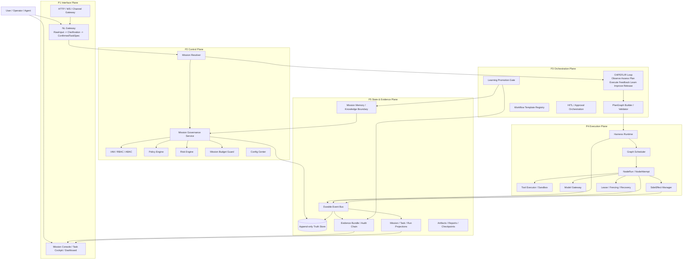
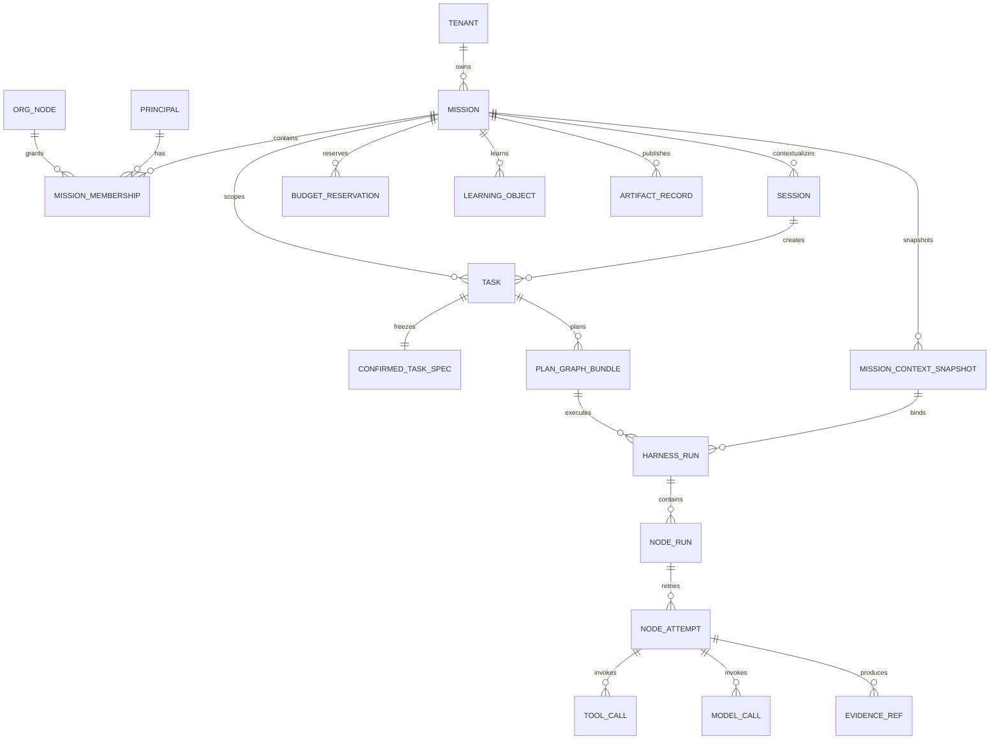
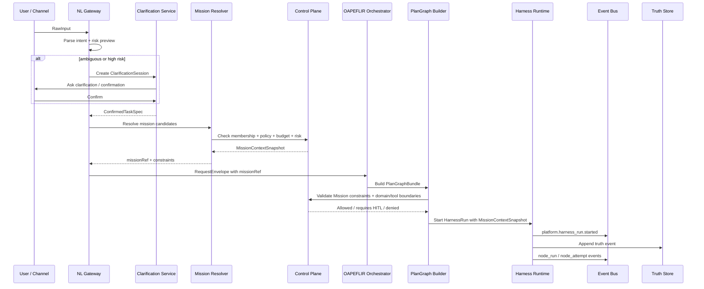
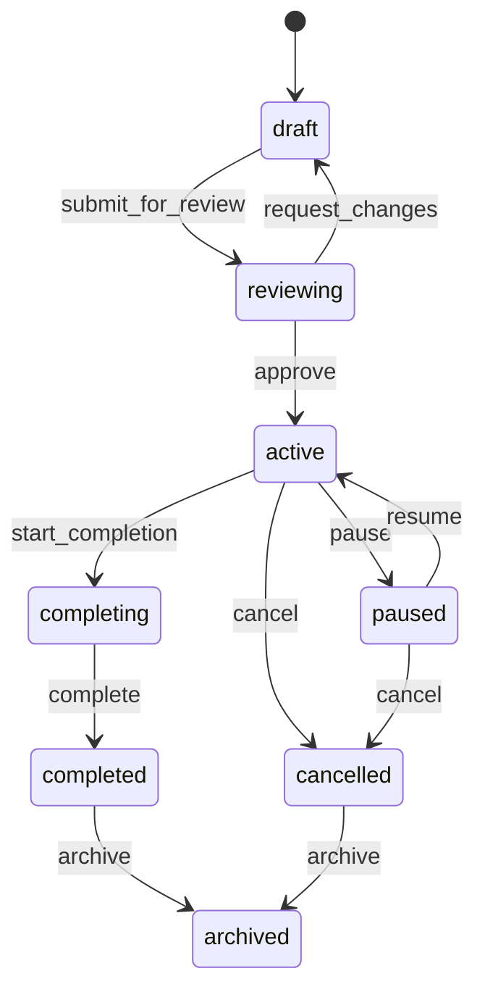
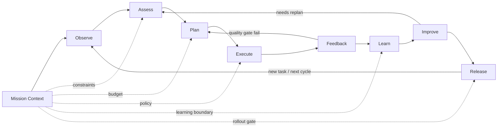
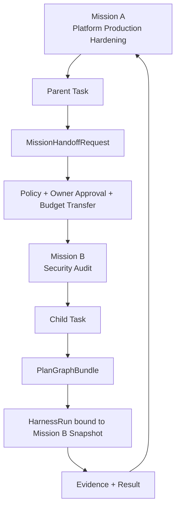
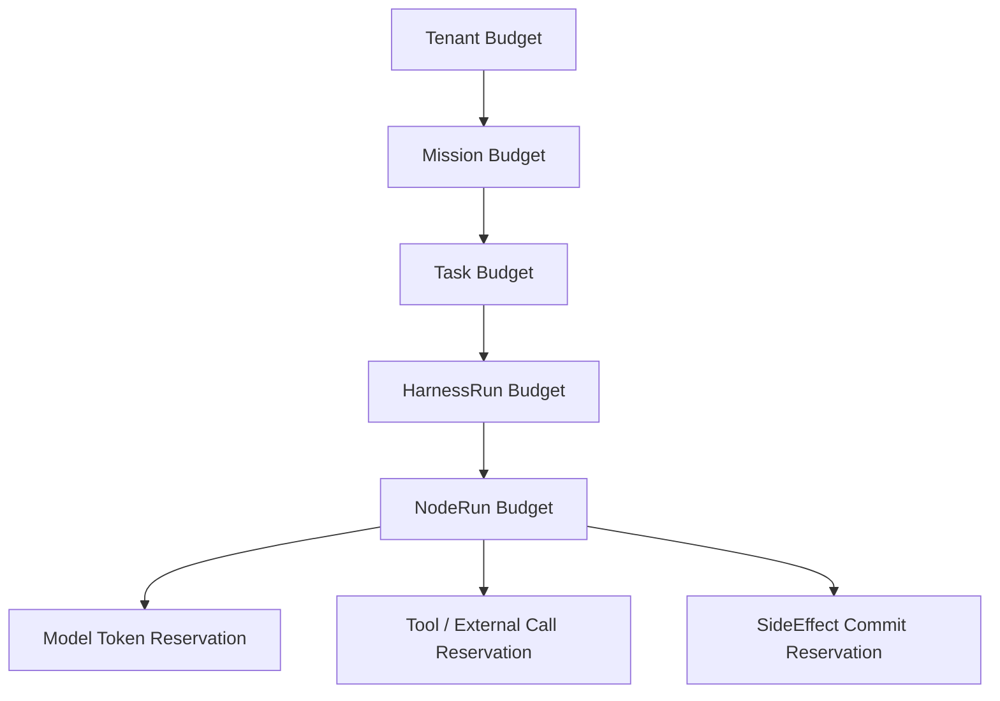
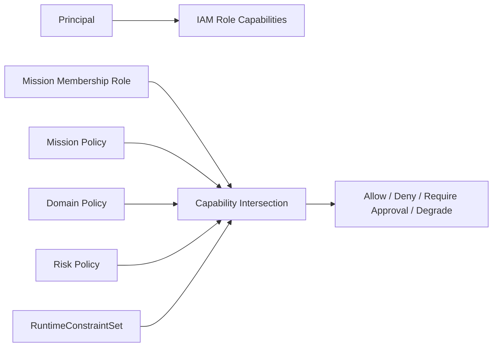
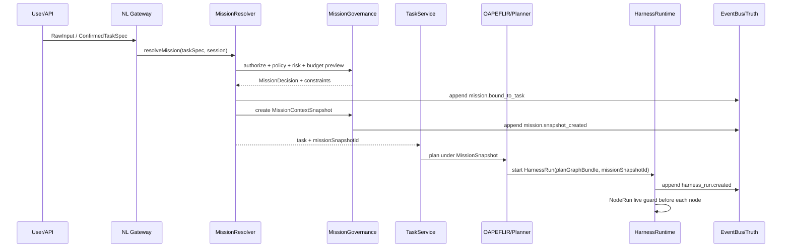

# Automatic Agent Platform — Mission Architecture Integration Implementation Contract v1.4

> **Document Version**: v1.4
> **Baseline Document**: `mission_architecture_design_review_v1_3.md`
> **Review Objective**: On the basis of v1.3 architecture implementation contract, merge Step degradation rules, complete the naming boundaries, interface constraints, testing governance, and migration requirements for Mission and Graph/Node-centric runtime, forming a complete merged version ready for implementation phase.
> **Final Conclusion**: Mission should be incorporated into the system, but must serve as a **long-term goal and governance context root object**, must not become a new execution object, must not replace PlanGraph, must not resurrect legacy WorkflowState, and must not generate a fourth set of RequestEnvelope / ExecutionPlan / StateCommand; at the same time, the Step concept must be weakened, and the system canonical runtime uniformly adopts `PlanGraphBundle / PlanNode / NodeRun / NodeAttempt`.

---

## 0. Final Review Conclusion

The correct positioning of Mission is:

```text
Mission = Agent ecosystem-level long-term goal + governance boundary + budget boundary + knowledge boundary + learning attribution boundary + audit attribution boundary
```

It is NOT:

```text
NOT an Agent Session
NOT a WorkflowState
NOT an ExecutionPlan
NOT a PlanGraphBundle
NOT a HarnessRun
NOT a NodeRun
NOT a UI Project Folder
NOT a Domain
NOT an Agent Team
```

After the system incorporates Mission, the recommended canonical hierarchy is:

```text
Tenant / Org
  └── Mission
        ├── Session              # Human-machine interaction context, can enter the same Mission multiple times
        ├── Task                 # A formal work request, must be bound to MissionContext
        ├── WorkflowTemplate     # Reusable process template, does not belong to execution state
        ├── PlanGraphBundle      # DAG execution plan for this task
        ├── HarnessRun           # This execution instance, bound to only one MissionSnapshot
        ├── NodeRun              # Single graph node execution
        ├── NodeAttempt          # Single model/tool/human attempt
        ├── EvidenceBundle       # Evidence and audit chain
        └── LearningObject       # Can optionally remain within Mission, or be promoted to Domain/Platform upon approval
```

The most critical invariants:

| Invariant | Description |
|---|---|
| INV-MISSION-001 | Every executable Task must resolve a `missionRef` before dispatch, but does not necessarily create a new Mission each time. |
| INV-MISSION-002 | A HarnessRun can only bind to one MissionContextSnapshot; cross-Mission collaboration must split child tasks or use MissionHandoff. |
| INV-MISSION-003 | Mission only stores goals, boundaries, strategies, budget, members, knowledge/learning attribution; must not store running node state. |
| INV-MISSION-004 | RuntimeMode does not do linear ordering; must be converted to RuntimeConstraintSet for constraint intersection. |
| INV-MISSION-005 | MissionSnapshot guarantees audit reproducibility; live revocation check ensures revocation/freeze/budget exhaustion takes effect in a timely manner. |
| INV-MISSION-006 | All state changes of Mission must be appended via PlatformFactEvent; direct overwrite of truth is not allowed. |
| INV-MISSION-007 | MissionId can enter log/trace/event, but should not be used as a metrics label by default, avoiding high cardinality explosion. |
| INV-MISSION-008 | Mission does not add a fourth set of core contracts; only extends existing canonical contracts. |
| INV-MISSION-009 | `Step` is not a canonical object; Mission, Task, Plan, Harness, Event, Budget, Evidence, API must not add Step-centric fields, and can only be used as natural language labels in UI/documentation display layer. |

---

## 1. Overall Architecture Diagram: Mission Integration with Five Planes

> Mission is not the sixth plane, but a governance context that runs through Control Plane, Orchestration Plane, Execution Plane, and State & Evidence Plane.



### 1.1 Architecture Diagram Interpretation

Mission runs through the chain but does not take over execution:

1. **P1 Interface** receives user input, can only provide Mission hint, cannot directly authorize Mission.
2. **P2 Control** determines whether Mission exists, is available, whether user has permissions, whether budget is available, whether risk is acceptable.
3. **P3 Orchestration** generates PlanGraphBundle under Mission constraints.
4. **P4 Execution** each NodeRun executes under MissionSnapshot + live guard.
5. **P5 State & Evidence** records fact events, evidence, projections, and audit chains for Mission/Task/Run/Node/SideEffect.

---

## 2. Object Relationship Diagram: Mission and Task / Session / Plan / Run



### 2.1 Core Relationships

| Object | Lifecycle Length | Main Responsibility | Is Execution Object | Can Cross Session | Can Cross Task |
|---|---:|---|---|---:|---:|
| Mission | Long-term | Goals, governance, budget, knowledge, learning, attribution | No | Yes | Yes |
| Session | Short/medium | Multi-turn dialogue context, clarification, preferences, temporary state | No | No | Can produce multiple Tasks |
| Task | Medium | A formal work request and acceptance goal | No | Can reference Session | No |
| WorkflowTemplate | Long-term | Reusable process template | No | Yes | Yes |
| PlanGraphBundle | Single | DAG execution plan for this Task | No | No | No |
| HarnessRun | Single | This plan execution instance | Yes | No | No |
| NodeRun | Single | Single node execution in DAG | Yes | No | No |
| NodeAttempt | Very short | Single attempt, model/tool call, error, evidence | Yes | No | No |
| Agent | Long/medium | Capability provider or execution role | No | Yes | Yes |
| Runtime | System-level | Scheduling, execution, recovery, isolation | Yes | Yes | Yes |
| Step | Non-authoritative display term | Natural language name for NodeRun in UI/documentation; must not be used as truth/contract/runtime field | No | No | No |

---

## 3. When to Create Mission, Task, Session

### 3.1 When to Create Session

Session is an interaction context, created only when a user or external channel starts a context.

Typical scenarios for creating Session:

| Scenario | Create Session? | Description |
|---|---:|---|
| User opens Web Chat / NL panel | Yes | Save multi-turn context, clarification state, user preferences |
| Slack/Telegram webhook inbound | Yes or reuse | Reuse by channel thread / conversation id |
| Backend scheduled task | No | No human-machine dialogue context, can be driven directly by Mission/Task |
| API directly submits Task | Optional | If no multi-turn context, Session may be skipped |
| Proactive Agent triggers suggestion | Optional | Create operator session when interaction with user is needed |

Session does not mean the task has officially started. Formal execution must enter Task.

### 3.2 When to Create Task

Task is a formal work request. Created only after intake, clarification, confirmation, or risk waiver.

Task creation conditions:

```text
RawInput
  -> parse intent
  -> resolve slots
  -> risk preview
  -> clarification / confirmation if required
  -> ConfirmedTaskSpec
  -> MissionResolve
  -> RequestEnvelope
  -> Task
```

Task must have:

| Field | Description |
|---|---|
| tenantId | Tenant isolation |
| principal | Initiator or agent |
| missionRef | Bound Mission or AdHocMission |
| confirmedTaskSpecId | Frozen requirement specification |
| idempotencyKey | Prevent duplicate submission |
| riskProfile | Risk preview |
| runtimeConstraints | Initial runtime constraints |
| budgetIntent | Budget requirement |
| traceId / correlationId | Observation chain |

### 3.3 When to Create Mission

Not every dialogue creates a new Mission, and not every Task creates a new Mission.

Mission creation rules:

| Trigger Condition | Create New Mission? | Example |
|---|---:|---|
| User explicitly creates long-term goal | Yes | "Establish company-level Agent platform production hardening initiative" |
| Multiple Tasks share long-term goal, budget, knowledge, approval | Yes | R&D project, continuous operations, compliance audit, investment research topic |
| Proactive / Scheduled / Autonomous work | Yes | Daily monitoring, auto-repair, continuous evaluation |
| Cross-team / cross-Agent / cross-Domain collaboration | Yes | Legal + Finance + Engineering joint process |
| Single low-risk Q&A | No, bind AdHocMission | "Explain what DAG is" |
| Single high-risk operation | Not necessarily create new, but must explicitly choose or create Mission | "Deploy production configuration" |
| API low-risk request without context | Bind system default Mission | Read-only query API |

### 3.4 Does Every Task Need to Go Through Mission

**MissionContext must be bound before execution, but it is not necessarily user-visible, and does not necessarily create a new Mission.**

Recommended three types of Mission:

| Type | Visibility | Purpose | TTL |
|---|---|---|---|
| ExplicitMission | User/team visible | Long-term goals, projects, automation ecosystem | Long-term |
| SystemMission | System visible | incident/recovery/maintenance/bootstrap | Medium to long-term |
| AdHocMission | Collapsed by default | Governance context for single low-risk task | Short-term auto-archive |

Key principles:

```text
Every executable Task must bind to one MissionContext.
Not every user interaction creates a new Mission.
Not every Mission is user-visible.
```

---

## 4. Request Flow: From User Input to Mission Binding to Execution



### 4.1 MissionResolver Two-Stage Design

To avoid the circular dependency of "needing Domain to select Mission, but Mission restricts Domain", two stages are adopted:

```text
Stage 1: PreRouteClassifier
  Input: RawInput / ConfirmedTaskSpec
  Output: domainHints / riskHints / workflowHints / candidateMissionIds

Stage 2: MissionResolver
  Obtain MissionContextSnapshot based on hints + membership + recent missions + explicit selection

Stage 3: FinalRouteValidator
  Perform final routing within domains/tools/workflows/runtimeConstraints allowed by Mission
```

### 4.2 Mission Selection Priority

```text
explicit missionId from user/API
> active session mission binding
> recent explicit mission in same workspace
> resolver recommended mission requiring user confirmation
> ad_hoc mission for low-risk task
> reject and ask user to choose/create mission
```

High-risk write operations cannot silently use recent mission; must be explicitly confirmed.

---

## 5. Mission Contract Design

### 5.1 MissionRecord

```ts
export type MissionStatus =
  | "draft"
  | "reviewing"
  | "active"
  | "paused"
  | "completing"
  | "completed"
  | "cancelled"
  | "archived";

export type MissionKind =
  | "explicit"
  | "system"
  | "ad_hoc"
  | "incident"
  | "research"
  | "operations"
  | "product"
  | "compliance";

export interface MissionRecord {
  missionId: string;
  tenantId: string;
  orgId?: string;
  workspaceId?: string;
  parentMissionId?: string;

  kind: MissionKind;
  status: MissionStatus;
  title: string;
  objective: string;
  successCriteria: MissionSuccessCriterion[];

  ownerPrincipalId: string;
  accountableTeamId?: string;
  domainRefs: string[];
  allowedWorkflowTemplateRefs: string[];
  allowedToolRefs: string[];

  runtimeConstraintPolicyRef: string;
  riskPolicyRef: string;
  budgetEnvelopeRef: string;
  knowledgeBoundaryRef?: string;
  learningPolicyRef?: string;
  approvalPolicyRefs: string[];

  dataResidency?: string;
  retentionPolicyRef?: string;
  sloPolicyRef?: string;

  createdAt: string;
  updatedAt: string;
  activatedAt?: string;
  completedAt?: string;
  archivedAt?: string;

  version: number;
  schemaVersion: string;
  auditRefs: string[];
}
```

### 5.2 MissionContextSnapshot

Snapshot is used for execution reproducibility and must not be modified in-place during execution.

```ts
export interface MissionContextSnapshot {
  snapshotId: string;
  missionId: string;
  missionVersion: number;
  tenantId: string;
  createdAt: string;

  objectiveHash: string;
  policySnapshotHash: string;
  budgetSnapshotHash: string;
  membershipSnapshotHash: string;
  knowledgeBoundaryHash?: string;

  effectiveRuntimeConstraints: RuntimeConstraintSet;
  effectiveApprovalRequirements: ApprovalRequirement[];
  effectiveBudgetEnvelope: MissionBudgetEnvelope;
  effectiveDataPolicy: DataPolicySnapshot;
  effectiveLearningPolicy: LearningPolicySnapshot;

  sourceEventId: string;
  auditRefs: string[];
}
```

### 5.3 MissionMembership

```ts
export type MissionRole =
  | "viewer"
  | "contributor"
  | "operator"
  | "approver"
  | "owner"
  | "auditor";

export interface MissionMembership {
  missionId: string;
  tenantId: string;
  principalId: string;
  role: MissionRole;
  grantedBy: string;
  expiresAt?: string;
  constraints?: RuntimeConstraintSet;
  createdAt: string;
  revokedAt?: string;
  version: number;
}
```

Permission calculation must be an intersection:

```text
EffectivePermission =
  IAMRoleCapabilities
∩ MissionMembershipCapabilities
∩ MissionPolicyCapabilities
∩ DomainPolicyCapabilities
∩ RiskPolicyCapabilities
∩ RuntimeConstraintSet
```

### 5.4 RuntimeConstraintSet

```ts
export interface RuntimeConstraintSet {
  allowRead: boolean;
  allowWrite: boolean;
  allowExternalCall: boolean;
  allowToolExecution: boolean;
  allowModelCall: boolean;
  allowRollout: boolean;
  allowSideEffectCommit: boolean;
  allowDelegation: boolean;
  allowLearningPromotion: boolean;

  requireHumanApprovalForWrite: boolean;
  requireHumanApprovalForExternalCall: boolean;
  requireHumanApprovalForRollout: boolean;
  requireHumanApprovalForLearningPromotion: boolean;

  maxAutoExecuteRisk: "none" | "low" | "medium" | "high" | "critical";
  maxDelegationDepth: number;
  maxAutonomousNodeRuns: number;
  maxExternalCallsPerRun: number;
  maxSideEffectsPerRun: number;
}
```

### 5.5 MissionBudgetEnvelope

```ts
export interface MissionBudgetEnvelope {
  missionId: string;
  currency: "USD" | "CNY";

  maxCostUsd?: number;
  maxModelTokens?: number;
  maxContextTokens?: number;
  maxOutputTokens?: number;
  maxNodeRuns?: number;
  maxHarnessRuns?: number;
  maxToolCalls?: number;
  maxExternalCalls?: number;
  maxDurationMs?: number;
  maxConcurrentRuns?: number;

  warnAtRatio: number;
  hardStopAtRatio: number;
  resetPolicy: "none" | "daily" | "weekly" | "monthly";
  approvalRequiredAboveRatio: number;

  version: number;
}
```

---

## 6. Mission Lifecycle and Execution Side Effects



### 6.1 State Semantics

| State | Can Accept New Task | Can Continue Running HarnessRun | Can Create LearningObject | Can Promote | Can Archive |
|---|---:|---:|---:|---:|---:|
| draft | No | No | No | No | No |
| reviewing | No | No | No | No | No |
| active | Yes | Yes | Yes | Policy-limited | No |
| paused | No | Drain only | Yes | No | No |
| completing | No | Drain only | Yes | Requires owner approval | No |
| completed | No | No | Read-only | Can promote with restrictions | Yes |
| cancelled | No | No | Read-only | No | Yes |
| archived | No | No | No | No | Already archived |

### 6.2 Mission State Change Side Effects

| Transition | Required Side Effects |
|---|---|
| draft → reviewing | Generate MissionReviewRequest; freeze review snapshot |
| reviewing → active | Emit `platform.mission.activated`; enable budget and member permissions |
| active → paused | Block new Tasks; mark queued tasks as blocked; running HarnessRun enters drain/cancel strategy |
| paused → active | Re-perform policy/budget/member live check; do not reuse old snapshot |
| active → completing | Prohibit new Tasks; allow existing runs to complete; lock additional budget |
| completing → completed | Generate FinalMissionReport; freeze MissionSummaryEvidenceBundle |
| active/paused → cancelled | Cancel queued tasks; running runs terminate according to recovery policy; release budget reservation |
| completed/cancelled → archived | Move to read-only archive; retain audit, evidence, learning object references |

---

## 7. Mission and OAPEFLIR / Harness Relationship



### 7.1 Mission Constraints at Each Stage

| OAPEFLIR Stage | Mission Participation Points |
|---|---|
| Observe | Use Mission knowledge boundary and session context to filter input |
| Assess | Calculate risk, budget feasibility, domain eligibility, mission fit |
| Plan | PlanGraphBuilder can only select workflows/tools/domains allowed by Mission |
| Execute | NodeRun pre live check: Mission active, budget not exhausted, permissions not revoked |
| Feedback | Feedback attributed by Mission, enters mission-level evidence |
| Learn | LearningObject stays in Mission scope by default, not auto-promoted |
| Improve | ImprovementCandidate must carry missionId and evidenceRefs |
| Release | Release/rollout must satisfy Mission rollout policy and owner/domain gate |

### 7.2 HarnessRun Binding Rules

```ts
export interface HarnessRunMissionBinding {
  harnessRunId: string;
  missionId: string;
  missionSnapshotId: string;
  bindingReason: "explicit" | "session_default" | "resolver" | "ad_hoc" | "system";
  boundAt: string;
  boundBy: string;
}
```

Not allowed:

```text
HarnessRun.missionIds: string[]
NodeRun changes Mission by itself
NodeAttempt changes Mission by itself
```

Allowed:

```text
Parent Mission creates child Task, child Task binds to another Mission.
Parent Mission and child Mission establish audit relationship through MissionHandoffRequest.
```

---

## 8. Cross-Mission Collaboration and Handoff



### 8.1 MissionHandoffRequest

```ts
export interface MissionHandoffRequest {
  handoffId: string;
  sourceMissionId: string;
  targetMissionId: string;
  sourceTaskId: string;
  requestedBy: string;
  reason: string;
  requestedCapabilities: string[];
  requestedBudgetEnvelope?: Partial<MissionBudgetEnvelope>;
  dataBoundaryRefs: string[];
  requiredApprovals: ApprovalRequirement[];
  status: "requested" | "approved" | "rejected" | "expired" | "completed";
  createdAt: string;
  expiresAt: string;
}
```

### 8.2 Prohibited Cross-Mission Implicit Behaviors

| Prohibited Behavior | Reason |
|---|---|
| One Task binds to multiple Missions simultaneously | Budget, approval, evidence attribution confusion |
| HarnessRun switches Mission during execution | Audit not reproducible |
| ToolCall crosses Mission knowledge boundary by itself | Data boundary broken |
| LearningObject auto-promotes from Mission to Platform | Knowledge pollution risk |
| Proactive Agent auto-executes without Mission | No owner, no budget, no responsibility attribution |

---

## 9. Mission and Budget / Cost / Reservation

### 9.1 Hierarchical Budget



### 9.2 Budget Execution Sequence

Before each model/tool/external call:

```text
1. live Mission status check
2. permission check
3. policy check
4. risk check
5. budget reserve
6. execute model/tool
7. settle actual cost
8. emit cost event
9. release unused reservation
```

### 9.3 BudgetReservation Key Fields

```ts
export interface BudgetReservation {
  reservationId: string;
  tenantId: string;
  missionId: string;
  taskId: string;
  harnessRunId: string;
  nodeRunId?: string;
  nodeAttemptId?: string;
  kind: "model" | "tool" | "external_call" | "side_effect" | "human_review";
  reservedCostUsd?: number;
  reservedTokens?: number;
  reservedDurationMs?: number;
  status: "reserved" | "settled" | "released" | "expired" | "cancelled";
  expectedVersion: number;
  fencingToken: string;
  expiresAt: string;
  createdAt: string;
}
```

---

## 10. Mission and IAM / Policy / Risk

### 10.1 Permission Calculation Diagram



### 10.2 Mission Role Permission Matrix

| Action | viewer | contributor | operator | approver | owner | auditor |
|---|---:|---:|---:|---:|---:|---:|
| View Mission | Yes | Yes | Yes | Yes | Yes | Yes |
| Create Low-risk Task | No | Yes | Yes | No | Yes | No |
| Start HarnessRun | No | Limited | Yes | No | Yes | No |
| Approve High-risk Operation | No | No | No | Yes | Yes | No |
| Modify Mission Policy | No | No | No | No | Yes | No |
| View Audit Chain | Limited | Limited | Limited | Yes | Yes | Yes |
| Archive Mission | No | No | No | No | Yes | No |

### 10.3 Risk Gate

| Risk Level | Mission Default Behavior |
|---|---|
| low | Can auto-execute according to RuntimeConstraintSet |
| medium | Default suggestion or semi_auto + approval |
| high | Must have HITL approval, auto side-effect commit not allowed |
| critical | Can only be proposal, auto execution not allowed; requires owner + domain owner + platform policy gate |

---

## 11. Mission and Knowledge / Memory / Learning

### 11.1 Mission Knowledge Boundary

Mission can limit knowledge retrieval scope:

```ts
export interface MissionKnowledgeBoundary {
  boundaryId: string;
  missionId: string;
  allowedKnowledgeScopes: string[];
  deniedKnowledgeScopes: string[];
  trustLevelFloor: "private_unverified" | "team_reviewed" | "official" | "authoritative";
  allowContestedKnowledge: boolean;
  dataClassCeiling: "public" | "internal" | "confidential" | "restricted";
}
```

### 11.2 LearningObject Defaults to Staying Within Mission

```text
NodeAttempt evidence
  -> FeedbackSignal
  -> LearningObject(scope=mission)
  -> quarantine / validation
  -> optional promotion to domain/platform
```

### 11.3 Learning Promotion Gate

| Promotion Path | Requirements |
|---|---|
| Mission → Mission official | Mission owner approval + evidence threshold |
| Mission → Domain | Domain owner approval + no taint + regression eval |
| Domain → Platform | Platform team approval + cross-domain eval + rollout gate |

Prohibited:

```text
Single successful NodeAttempt auto-promotes to Platform knowledge.
Mission-polluted data enters global prompt/policy/knowledge.
```

---

## 12. Mission and Event / Truth / Evidence

### 12.1 Mission Event Naming

Recommended to use canonical events:

```text
platform.mission.created
platform.mission.review_requested
platform.mission.activated
platform.mission.paused
platform.mission.resumed
platform.mission.completing
platform.mission.completed
platform.mission.cancelled
platform.mission.archived
platform.mission.member_added
platform.mission.member_revoked
platform.mission.policy_changed
platform.mission.budget_reserved
platform.mission.budget_settled
platform.mission.snapshot_created
platform.mission.handoff_requested
platform.mission.handoff_completed
```

### 12.2 EventEnvelope Required Fields

```ts
export interface PlatformFactEvent<TPayload> {
  eventId: string;
  eventType: string;
  tenantId: string;
  aggregateType: "mission" | "task" | "harness_run" | "node_run" | "side_effect";
  aggregateId: string;
  sequence: number;
  correlationId: string;
  causationId?: string;
  idempotencyKey?: string;
  schemaVersion: string;
  payloadHash: string;
  payload: TPayload;
  emittedAt: string;
  emittedBy: string;
}
```

### 12.3 Truth and Projection

| Layer | What to Store | Authoritative |
|---|---|---:|
| Truth Store | append-only Mission/Task/Run fact events | Yes |
| Projection | Mission dashboard, Task list, budget summary | No |
| Evidence Bundle | Audit evidence, references, hash chain, signatures | Yes, as evidence |
| Cache | UI query cache, temporary state | No |

---

## 13. UI Product Form

### 13.1 Mission Console

Must provide:

| Area | Content |
|---|---|
| Mission Overview | Goal, owner, status, risk, budget, water level |
| Task Board | All Task statuses under this Mission |
| Run Timeline | HarnessRun / NodeRun / NodeAttempt timeline |
| Budget Panel | cost/token/tool/external-call/duration/concurrency |
| Evidence Panel | evidence refs, audit chain, final report |
| Knowledge Panel | Mission memory, LearningObject, promotion requests |
| Approval Panel | Pending HITL / approval requests |
| Incident Panel | Blocked, degraded, panic, policy violation |
| Settings | Membership, policy, runtime constraints, data boundary |

### 13.2 Things UI Cannot Do

| Prohibited | Reason |
|---|---|
| Frontend directly determines Mission permissions | Must go through backend IAM/Policy judgment |
| Recent Mission auto-used for high-risk write operations | Privilege escalation and misuse risk |
| localStorage saves Mission token/secret | XSS leak |
| UI locally simulates execute | Bypasses P1→P2→P3→P4 chain |
| MissionId used as all frontend metrics label | High cardinality risk |

---

## 14. Observability Design

### 14.1 Trace / Log / Event

Trace and log should carry:

```text
tenantId
missionId
missionSnapshotId
taskId
harnessRunId
nodeRunId
nodeAttemptId
correlationId
causationId
riskLevel
runtimeConstraintHash
```

### 14.2 Metrics Label Restrictions

Allowed as metrics labels:

```text
mission_kind
domain
risk_level
tenant_tier
runtime_mode_preset
status
```

Default prohibited as metrics labels:

```text
missionId
taskId
harnessRunId
nodeRunId
userId
promptBundleId
```

These can only appear in exemplars, trace, logs, or sampled diagnostic events.

---

## 15. Multi-Region / Tenant / Federation Notes

### 15.1 Mission home region

```ts
export interface MissionRegionPolicy {
  missionId: string;
  homeRegion: string;
  allowedReadRegions: string[];
  allowedExecutionRegions: string[];
  dataResidency: string;
  readAfterWriteConsistency: "strong" | "bounded_staleness" | "eventual";
  failoverPolicyRef: string;
}
```

### 15.2 Multi-region Principles

| Rule | Description |
|---|---|
| Mission truth home region is unique | Prevent split-brain |
| Projection can be replicated across regions | Read-only/near-real-time display |
| Budget reservation is atomic in home region | Prevent over-spending |
| Failover must produce new fencing epoch | Prevent stale leader writes |
| MissionSnapshot needs region/epoch | Ensure audit and recovery |

### 15.3 Federation

Cross-org Mission collaboration cannot share raw data, must go through:

```text
FederatedMissionLink
+ DataSharingPolicy
+ CapabilityDelegation
+ EvidenceRedactionPolicy
+ CrossOrgAuditTrail
```

---

## 16. Migration Plan

### Phase 0: Contract Freeze First

Must complete first:

1. Confirm unique RequestEnvelope definition.
2. Confirm PlanGraphBundle is the unique execution plan contract.
3. Confirm HarnessRun / NodeRun / NodeAttempt is the unique runtime object.
4. Deprecate legacy ExecutionPlan / WorkflowState / ControlDirective as first-class contracts.

### Phase 1: Introduce Mission Tables and Events, Do Not Change Execution Path

New additions:

```text
mission_records
mission_memberships
mission_context_snapshots
mission_budget_envelopes
mission_events
mission_projections
```

All old Tasks automatically bind:

```text
system.ad_hoc.default_mission
```

### Phase 2: MissionResolver Connected to Intake

```text
ConfirmedTaskSpec -> MissionResolver -> RequestEnvelope.missionRef
```

Low-risk tasks can automatically bind AdHocMission; high-risk must be explicitly confirmed.

### Phase 3: HarnessRun Binds MissionSnapshot

HarnessRun creation must have:

```text
missionId
missionSnapshotId
effectiveRuntimeConstraints
budgetEnvelopeRef
```

### Phase 4: NodeRun Live Guard

Pre-check before each NodeRun:

```text
Mission active?
Membership still valid?
Budget still available?
Runtime constraints still allow?
Incident/Panic state?
```

### Phase 5: UI Mission Console + Observability

Launch Mission Console, Mission Task Board, Budget Panel, Evidence Panel, Learning Panel.

### Phase 6: Learning / Knowledge Promotion

Finally connect Mission-scoped learning to avoid early pollution of platform-level knowledge.

---

## 17. Regression Tests and Acceptance Criteria

### 17.1 Required New Tests

| Test | Acceptance Points |
|---|---|
| MissionResolver E2E | explicit missionId, session default, ad hoc, reject selection all correct |
| High-risk Task Mission confirmation | High-risk cannot silently bind recent mission |
| HarnessRun single mission invariant | One run cannot have multiple missions |
| Mission paused side effect | After paused, no new tasks; running runs handled per drain strategy |
| Budget reservation | NodeRun must reserve before execution, settle failure must not silently pass |
| Live revocation | After member is revoked, subsequent NodeRun is blocked |
| Snapshot reproducibility | Same snapshot replay gets same policy view |
| Cross-mission handoff | Must have approval/audit/budget transfer |
| Learning quarantine | Mission learning not auto-promoted to Domain/Platform |
| Metrics high-cardinality guard | missionId not entering default metric labels |
| Multi-region fencing | After failover, old epoch writes are rejected |
| UI no local execute | UI action must go through API / Control Plane |

### 17.2 Prohibited Test Patterns

From existing audit, must prohibit the following invalid tests:

```text
assert.ok(true) in catch
allowed === true || allowed === false
keys.length >= 0
only test mock shape, do not import production services
E2E bypasses HarnessRun / PlanGraphBundle / RSM
```

---

## 18. Outstanding Points to Fill

### 18.1 Mission and Agent Team Relationship

Agent Team is an execution collaboration structure, not a governance boundary. Mission can define which Agents/AgentTeams are allowed to participate, but AgentTeam cannot replace Mission.

```text
Mission owns governance.
AgentTeam owns collaboration topology.
PlanGraph owns execution topology.
```

### 18.2 Mission and Domain Relationship

Domain is capability/policy template; Mission is goal instance.

Example:

```text
Domain = coding / legal / ops / quant
Mission = Automatic Agent Platform Production Hardening
```

One Mission can use multiple Domains; one Domain can serve multiple Missions.

### 18.3 Mission and WorkflowTemplate Relationship

WorkflowTemplate is a reusable process; Mission can restrict which workflows are allowed, but workflow does not own Mission.

### 18.4 Mission and Release / Rollout Relationship

Mission can initiate rollout, but rollout must still go through release gate:

```text
Mission owner approval
+ Domain owner approval
+ Eval pass
+ Regression guard
+ Rollback plan
+ Budget / risk / incident check
```

### 18.5 Mission and Proactive Agent Relationship

Proactive Agent must bind Mission before acting.

```text
No Mission -> suggestion only
Mission active + low risk -> may auto propose
Mission active + allowed constraints + approval -> may execute
medium/high/critical -> never silent auto execute
```

### 18.6 Mission and Incident/Panic Relationship

Incident and Panic can create SystemMission:

```text
incident.mission.<incidentId>
panic.mission.<scopeId>
recovery.mission.<runId>
```

Used to centralize recovery actions, budget, audit, and runbook evidence.

---

## 19. Final Recommended Directory Structure

```text
src/platform/control-plane/mission/
  mission-record.ts
  mission-membership.ts
  mission-policy.ts
  mission-budget-envelope.ts
  mission-context-snapshot.ts
  mission-resolver.ts
  mission-governance-service.ts
  mission-lifecycle-service.ts
  mission-permission-service.ts
  mission-budget-service.ts
  mission-handoff-service.ts
  mission-events.ts
  mission-errors.ts

src/platform/state-evidence/events/projections/mission/
  mission-dashboard-projection.ts
  mission-task-board-projection.ts
  mission-budget-projection.ts
  mission-evidence-projection.ts

src/platform/orchestration/mission/
  mission-aware-plan-validator.ts
  mission-oapeflir-guard.ts
  mission-learning-gate.ts

src/platform/execution/mission/
  mission-runtime-guard.ts
  mission-budget-reservation-adapter.ts
  mission-live-revocation-checker.ts

ui/packages/features/mission-console/
  src/hooks/
  src/web/
  src/mobile/
```

---

## 20. Final Implementation Principles

### 20.1 Should Do

1. Treat Mission as a **goal governance root object**.
2. All executable Tasks bind MissionContext before dispatch.
3. HarnessRun fixed binds MissionSnapshot.
4. Live guard before NodeRun.
5. Budget / IAM / Risk / Policy unified as constraint intersection.
6. Learning defaults to staying in Mission scope.
7. All Mission state changes are event-driven.
8. UI only displays and submits requests, no local execution.
9. Observability carries Mission context, but metrics control high cardinality.
10. During migration, first be compatible with legacy, then gradually enforce missionRef.

### 20.2 Should NOT Do

1. Do not add `steps[] / currentStep / currentNode / toolCalls` to Mission; Mission progress can only come from Task/HarnessRun/NodeRun/NodeAttempt projections.
2. Do not let one HarnessRun bind multiple Missions simultaneously.
3. Do not use RuntimeMode enum ordering for permission judgment.
4. Do not let UI mission hint become authorization basis.
5. Do not auto-promote Mission memory to platform knowledge.
6. Do not add a fourth set of RequestEnvelope / ExecutionPlan / WorkflowState.
7. Do not let Proactive Agent auto-execute without Mission.
8. Do not put missionId into all metrics labels.

---

## 21. Final Judgment

Mission should be incorporated into the Automatic Agent Platform as a core governance object. After incorporation, the system upgrades from "single Agent Session / single Task execution platform" to "long-term goal-driven Agent ecosystem".

However, Mission implementation must strictly follow three bottom lines:

```text
1. Mission governs, PlanGraph executes.
2. Mission snapshots for reproducibility, live checks for safety.
3. Mission extends canonical contracts, never forks them.
```

This way the system can obtain:

| Capability | Improvement |
|---|---|
| Long-term goal management | Multiple Tasks, Agents, Workflows attributed to the same goal |
| Governance consistency | Unified boundary for budget, permissions, knowledge, approval, learning |
| Automation safety | High-risk tasks will not escape Mission owner and Mission policy |
| Observability | All runs, nodes, events, evidence can be aggregated by Mission |
| Learning loop | Experience within Mission can be accumulated but will not pollute platform knowledge |
| Product experience | Users see goal progress, not scattered task/run/session |

**Final recommendation: Can enter design freeze and implementation phase, but implementation order must be Contract Freeze → Mission Truth/Event → Resolver → Harness Binding → Runtime Guard → UI Console → Learning Promotion.**

---

## 40. Implementation Status and Evidence Append Record

> Last Updated: 2026-05-13. The following status only appends implementation evidence, does not delete the original contract text of this document. Mission still maintains the positioning of "long-term goal and governance context root object"; execution surface continues to use `PlanGraphBundle / PlanNode / NodeRun / NodeAttempt` as canonical runtime.

| Task | Status | Implementation Evidence | Test Evidence |
|---|---|---|---|
| T-MIS-001 Mission schemas/types | Implemented | `src/platform/contracts/mission/index.ts`; `src/platform/contracts/index.ts` export | `tests/unit/platform/contracts/mission-contracts.test.ts` |
| T-MIS-002 Mission truth tables/repository | Implemented | `src/platform/five-plane-state-evidence/truth/runtime-physical-schema.ts`; `src/platform/five-plane-state-evidence/truth/mission-repository.ts` | `tests/unit/platform/control-plane/mission-services.test.ts` |
| T-MIS-003 `platform.mission.*` event schemas | Implemented | `MissionEventTypeSchema`, `MissionEventEnvelopeSchema`, repository sequence allocator | `mission-contracts.test.ts`, `mission-services.test.ts` |
| T-MIS-004 MissionLifecycleService + CAS | Implemented | `src/platform/five-plane-control-plane/mission/index.ts` | `mission-services.test.ts` |
| T-MIS-005 MissionResolver + Governance | Implemented | `MissionResolver`, `MissionGovernanceService` | `mission-services.test.ts` |
| T-MIS-006 Mission API + ErrorEnvelope | Implemented | `src/platform/five-plane-interface/api/http-server/mission-routes.ts`; OpenAPI route list; coverage of create/list/read/patch, state transitions, members, tasks/runs/evidence/budget, dry-run resolution | `tests/integration/platform/interface/api/mission-routes.test.ts`, `tests/integration/platform/contracts/api-openapi-contract.test.ts` |
| T-MIS-007 PlanGraphBundle missionSnapshotRef | Implemented | `PlanGraphBundle` contract/schema/factory extension; `MissionRuntimeBindingService`; `POST /v1/tasks` connects Mission resolution/snapshot binding | `mission-services.test.ts`, `mission-task-binding.test.ts` |
| T-MIS-008 HarnessRun missionBinding | Implemented | `HarnessRun` contract/schema/factory extension; single-binding guard | `mission-services.test.ts` |
| T-MIS-009 NodeRun MissionLiveGuard | Implemented | `MissionLiveGuard` and `NodeRun.missionSnapshotRef` | `mission-services.test.ts` |
| T-MIS-010 canonical Mission E2E baseline | Implemented as targeted integration baseline | API create + dry-run resolution + task create mission binding + runtime binding tests | `mission-routes.test.ts`, `mission-task-binding.test.ts`, `mission-services.test.ts` |
| T-MIS-011 Mission Console data baseline | Implemented as backend baseline | Mission API exposes Overview / Members / Tasks / Runs / Budget / Evidence data seams; existing Mission Control remains dashboard surface | `mission-routes.test.ts` |
| T-MIS-012 Trace/log correlation + metrics cardinality guard | Implemented | `MissionObservabilityPolicy` allows trace attributes and strips Mission IDs from metric labels | `mission-services.test.ts` |
| T-MIS-013 Mission scoped LearningObject promotion gate | Implemented | `MissionLearningPromotionGate` keeps default learning local and requires approval/evidence for promotion | `mission-services.test.ts` |
| T-MIS-014 legacy Task/Session missionRef backfill | Implemented as in-repo baseline | `LegacyMissionBackfillService` | `mission-services.test.ts` |
| T-MIS-015 ADR/superseded marker | Written back to document status | This section serves as v1.4 implementation evidence index | Document consistency verified by this round of targeted tests and build |
| T-MIS-016 Mission handoff | Implemented as in-repo baseline | `MissionHandoffService` | `mission-services.test.ts` covers service exports and capability baseline |
| T-MIS-017 home region/fencing | Implemented as in-repo baseline | `MissionHomeRegionService` epoch guard | `mission-services.test.ts` |
| T-MIS-018 outcome analytics | Implemented as in-repo baseline | `MissionOutcomeAnalyticsService` | `mission-services.test.ts` |
| T-MIS-019 template/package integration | Implemented as in-repo baseline | `MissionTemplateIntegrationService` | `mission-services.test.ts` |

### 40.1 Residual Risk

The following are external deployment or cross-system wiring evolution items, and should not be pretended as single-repo code closure: real multi-region database replication, cross-enterprise federation trust wiring, real UI release and permission operations process. The current repo has provided testable contracts, service baseline, Mission Console backend API, API routes, and runtime binding guard. Subsequent external system integration must reuse these common interfaces.

### 40.2 This Round Verification

| Verification Item | Result |
|---|---|
| Mission-targeted contract/unit/integration/invariant tests | `node --import tsx --test tests/integration/platform/interface/api/mission-routes.test.ts tests/integration/platform/interface/api/mission-task-binding.test.ts tests/unit/platform/contracts/mission-contracts.test.ts tests/unit/platform/control-plane/mission-services.test.ts tests/invariants/mission-step-governance.test.ts tests/integration/platform/contracts/api-openapi-contract.test.ts` |
| TypeScript build test | `npm run build:test` |
| OpenAPI contract targeted tests | `node --import tsx --test tests/integration/platform/contracts/api-openapi-contract.test.ts` |


---

# Part II — v1.3 Implementation Contract Reinforcement

> This part is the new content added in v1.3 compared to v1.2. The goal is not to redefine Mission architecture, but to solidify Mission from "architectural concept" into an implementable, testable, migratable, auditable implementation contract.

## 22. v1.3 Change Summary

| Change Domain | v1.2 Status | v1.3 Reinforcement |
|---|---|---|
| Canonical Types | Object boundaries already defined | Filled in TypeScript/Zod schema, ID rules, field requiredness |
| State Machine | State semantics already given | Filled in legal transition table, guard, side effects |
| Event Contract | Event naming already listed | Filled in PlatformFactEvent envelope, payload schema, sequence rules |
| API Contract | Only design notes | Filled in REST API, headers, error codes, idempotency rules, ETag/If-Match |
| Storage | Only directory recommendations | Filled in Mission truth tables, membership, snapshot, event sequence tables |
| Runtime Binding | HarnessRun binding already clarified | Filled in strict process of Task→MissionContextSnapshot→HarnessRun→NodeRun |
| Migration | Stages already listed | Filled in data backfill, compatibility flags, acceptance gates, rollback strategies |
| Tests | Test directions already listed | Filled in contract/unit/integration/e2e/chaos/golden level test matrix |

v1.3 freeze goal:

```text
Mission's incorporation only extends canonical runtime graph, does not introduce new execution paths, does not resurrect legacy WorkflowState, does not produce a fourth set of core objects.
```

---

## 23. Naming and Coding Standards Freeze

### 23.1 TypeScript and JSON Field Naming

Internal system TypeScript/Zod/JSON API uses **lowerCamelCase**:

```ts
tenantId
missionId
traceId
idempotencyKey
createdAt
updatedAt
```

Database fields use **snake_case**:

```sql
tenant_id
mission_id
trace_id
idempotency_key
created_at
updated_at
```

Mixing snake_case and camelCase in the same runtime contract is prohibited. Cross-language exports must use mapper for explicit conversion.

### 23.2 ID Rules

| ID | Format | Example | Description |
|---|---|---|---|
| MissionId | `mis_[a-zA-Z0-9_-]{16,64}` | `mis_product_launch_2026` | Human-readable but must not contain `/`, `.`, spaces |
| MissionSnapshotId | `msnap_[a-zA-Z0-9_-]{16,80}` | `msnap_01H...` | Generated before each HarnessRun binding |
| MissionEventId | `evt_[a-zA-Z0-9_-]{16,80}` | `evt_01H...` | Globally unique |
| MembershipId | `mmbr_[a-zA-Z0-9_-]{16,80}` | `mmbr_01H...` | Principal and mission binding |
| MissionHandoffId | `mho_[a-zA-Z0-9_-]{16,80}` | `mho_01H...` | Cross-Mission handoff |

Using `Date.now()+Math.random()` to generate IDs is prohibited. ULID/UUIDv7 or platform-unified `IdGenerator` is recommended.

### 23.3 Time Rules

All contract time fields use UTC ISO-8601 strings:

```ts
2026-05-13T02:40:00.000Z
```

Before comparing times, must parse to epoch milliseconds; direct ISO string comparison is prohibited.

---

## 24. Mission Canonical Object Schema

### 24.1 MissionRecord

```ts
import { z } from "zod";

export const MissionIdSchema = z.string().regex(/^mis_[a-zA-Z0-9_-]{16,64}$/);
export const MissionSnapshotIdSchema = z.string().regex(/^msnap_[a-zA-Z0-9_-]{16,80}$/);
export const TenantIdSchema = z.string().min(1).max(128);
export const OrgIdSchema = z.string().min(1).max(128);
export const PrincipalIdSchema = z.string().min(1).max(128);

export const MissionTypeSchema = z.enum([
  "ad_hoc",
  "user_goal",
  "domain_program",
  "team_program",
  "system_incident",
  "system_recovery",
  "evaluation_campaign",
  "release_campaign"
]);

export const MissionStatusSchema = z.enum([
  "draft",
  "active",
  "paused",
  "frozen",
  "completed",
  "archived"
]);

export const MissionPrioritySchema = z.enum([
  "low",
  "normal",
  "high",
  "critical"
]);

export const MissionRecordSchema = z.object({
  missionId: MissionIdSchema,
  tenantId: TenantIdSchema,
  orgId: OrgIdSchema.optional(),
  type: MissionTypeSchema,
  status: MissionStatusSchema,
  priority: MissionPrioritySchema.default("normal"),

  title: z.string().min(1).max(256),
  description: z.string().max(8000).optional(),
  objective: z.string().min(1).max(8000),
  successCriteria: z.array(z.object({
    criterionId: z.string().min(1).max(128),
    description: z.string().min(1).max(2000),
    operator: z.enum(["eq", "neq", "gt", "gte", "lt", "lte", "contains", "not_contains", "manual_review"]),
    targetValue: z.unknown().optional(),
    weight: z.number().min(0).max(1).default(1),
    required: z.boolean().default(true)
  })).min(1),

  ownerPrincipalId: PrincipalIdSchema,
  accountablePrincipalId: PrincipalIdSchema.optional(),
  domainId: z.string().min(1).max(128).optional(),

  policyRefs: z.array(z.string().min(1).max(256)).default([]),
  riskProfileRef: z.string().min(1).max(256).optional(),
  budgetEnvelopeRef: z.string().min(1).max(256).optional(),
  knowledgeBoundaryRef: z.string().min(1).max(256).optional(),
  defaultWorkflowTemplateRefs: z.array(z.string().min(1).max(256)).default([]),

  createdAt: z.string().datetime(),
  createdBy: PrincipalIdSchema,
  updatedAt: z.string().datetime(),
  updatedBy: PrincipalIdSchema,
  version: z.number().int().nonnegative(),
  etag: z.string().min(1),

  archivedAt: z.string().datetime().optional(),
  archivedBy: PrincipalIdSchema.optional(),
  freezeReason: z.string().max(2000).optional(),
  metadata: z.record(z.string(), z.unknown()).default({})
}).strict();

export type MissionRecord = z.infer<typeof MissionRecordSchema>;
```

#### Field Constraints

| Field | Constraint |
|---|---|
| `status` | Can only be changed by Mission RSM, cannot be directly patched |
| `version` | Must +1 for every truth mutation |
| `etag` | Generated from `missionId + version + payloadHash` |
| `metadata` | Not allowed to store token, secret, PII plaintext |
| `successCriteria` | At least 1; otherwise Mission cannot be active |

### 24.2 MissionMembership

```ts
export const PrincipalTypeSchema = z.enum([
  "user",
  "agent",
  "service",
  "worker",
  "plugin",
  "system"
]);

export const MissionRoleSchema = z.enum([
  "owner",
  "admin",
  "operator",
  "contributor",
  "viewer",
  "auditor",
  "service_agent"
]);

export const MissionPermissionSchema = z.enum([
  "mission:read",
  "mission:update",
  "mission:archive",
  "mission:manage_members",
  "mission:create_task",
  "mission:dispatch_task",
  "mission:approve_high_risk",
  "mission:manage_budget",
  "mission:view_budget",
  "mission:view_evidence",
  "mission:promote_learning",
  "mission:handoff"
]);

export const MissionMembershipSchema = z.object({
  membershipId: z.string().regex(/^mmbr_[a-zA-Z0-9_-]{16,80}$/),
  missionId: MissionIdSchema,
  tenantId: TenantIdSchema,
  principal: z.object({
    principalType: PrincipalTypeSchema,
    principalId: PrincipalIdSchema
  }).strict(),
  role: MissionRoleSchema,
  permissions: z.array(MissionPermissionSchema).default([]),
  deniedPermissions: z.array(MissionPermissionSchema).default([]),
  grantedBy: PrincipalIdSchema,
  grantedAt: z.string().datetime(),
  expiresAt: z.string().datetime().optional(),
  status: z.enum(["active", "suspended", "revoked", "expired"]),
  version: z.number().int().nonnegative(),
  metadata: z.record(z.string(), z.unknown()).default({})
}).strict();
```

Permission calculation rules:

```text
effectivePermissions =
  rolePermissions(role)
  ∩ missionPolicy.allowedPermissions
  ∩ principalCurrentPermissions
  - deniedPermissions
  - missionPolicy.deniedPermissions
```

It is prohibited to directly use caller-provided `permissions` or `capabilities` as effective permissions. All permissions must be obtained from the three-way intersection of IAM, MissionMembership, PolicyDecision.

### 24.3 RuntimeConstraintSet

Mission does not directly use `RuntimeMode` enum ordering, but normalizes runtime mode, risk, policy, domain, budget all into a constraint set.

```ts
export const RuntimeConstraintSetSchema = z.object({
  allowModelCall: z.boolean(),
  allowToolCall: z.boolean(),
  allowExternalNetwork: z.boolean(),
  allowFileWrite: z.boolean(),
  allowDestructiveAction: z.boolean(),
  allowSideEffectCommit: z.boolean(),
  allowAutoExecute: z.boolean(),
  requireHITL: z.boolean(),
  requireDomainOwnerApproval: z.boolean(),
  requireBudgetReservation: z.boolean(),
  requireEvidenceRefs: z.boolean(),
  sandboxProfileRef: z.string().min(1).optional(),
  maxDelegationDepth: z.number().int().min(0).max(8),
  maxParallelNodeRuns: z.number().int().min(1).max(1024),
  deniedToolNames: z.array(z.string()).default([]),
  deniedDomains: z.array(z.string()).default([]),
  dataResidency: z.array(z.string()).default([]),
  modelTrainingOptOut: z.boolean().default(true)
}).strict();
```

Constraint merge rules:

```text
boolean allow fields: AND
boolean require fields: OR
max fields: MIN
denied fields: UNION
allowed list fields: INTERSECTION
```

### 24.4 MissionBudgetEnvelope

```ts
export const OapeflirStageSchema = z.enum([
  "observe",
  "assess",
  "plan",
  "execute",
  "feedback",
  "learn",
  "improve",
  "release"
]);

export const BudgetLimitSchema = z.object({
  maxCostUsd: z.number().nonnegative().optional(),
  maxModelTokens: z.number().int().nonnegative().optional(),
  maxContextTokens: z.number().int().nonnegative().optional(),
  maxOutputTokens: z.number().int().nonnegative().optional(),
  maxToolCalls: z.number().int().nonnegative().optional(),
  maxNodeRuns: z.number().int().nonnegative().optional(),
  maxDurationMs: z.number().int().nonnegative().optional(),
  maxWallClockMs: z.number().int().nonnegative().optional()
}).strict();

export const MissionBudgetEnvelopeSchema = z.object({
  budgetEnvelopeId: z.string().min(1).max(128),
  missionId: MissionIdSchema,
  tenantId: TenantIdSchema,
  limits: BudgetLimitSchema,
  warnAtRatio: z.number().min(0).max(1).default(0.8),
  hardStopAtRatio: z.number().min(0).max(1).default(1.0),
  stageBudgets: z.record(OapeflirStageSchema, BudgetLimitSchema.partial()).default({}),
  resetPolicy: z.enum(["none", "daily", "weekly", "monthly", "mission_lifetime"]).default("mission_lifetime"),
  currency: z.literal("USD").default("USD"),
  createdAt: z.string().datetime(),
  updatedAt: z.string().datetime(),
  version: z.number().int().nonnegative()
}).strict();
```

Budget invariants:

| Invariant | Description |
|---|---|
| INV-BUDGET-MISSION-001 | BudgetReservation must exist before LLM/tool/side-effect execution. |
| INV-BUDGET-MISSION-002 | reserve / settle / release must use CAS + transaction. |
| INV-BUDGET-MISSION-003 | Mission budget does not replace tenant/domain budget; must do hierarchical deduction. |
| INV-BUDGET-MISSION-004 | `maxCostUsd` must not be the only constraint; token/node/tool/duration must be independently configurable. |

### 24.5 MissionContextSnapshot

MissionSnapshot is the key for audit reproducibility. HarnessRun binds to a snapshot, not the live MissionRecord.

```ts
export const MissionContextSnapshotSchema = z.object({
  missionSnapshotId: MissionSnapshotIdSchema,
  missionId: MissionIdSchema,
  missionVersion: z.number().int().nonnegative(),
  tenantId: TenantIdSchema,
  orgId: OrgIdSchema.optional(),
  taskId: z.string().min(1).max(128),
  confirmedTaskSpecId: z.string().min(1).max(128),

  missionStatusAtSnapshot: MissionStatusSchema,
  objective: z.string().min(1).max(8000),
  successCriteria: MissionRecordSchema.shape.successCriteria,

  effectivePermissions: z.array(MissionPermissionSchema),
  runtimeConstraints: RuntimeConstraintSetSchema,
  budgetEnvelope: MissionBudgetEnvelopeSchema.optional(),
  policyDecisionRefs: z.array(z.string()).default([]),
  riskDecisionRef: z.string().optional(),
  knowledgeBoundaryRef: z.string().optional(),

  createdAt: z.string().datetime(),
  createdBy: PrincipalIdSchema,
  traceId: z.string().min(1),
  correlationId: z.string().min(1),
  payloadHash: z.string().regex(/^[a-f0-9]{64}$/),
  signature: z.string().optional()
}).strict();
```

Snapshot rules:

```text
1. MissionContextSnapshot generated before Task dispatch.
2. HarnessRun can only reference one MissionContextSnapshot.
3. Snapshot does not change with subsequent Mission changes.
4. NodeRun still requires live guard check before execution to verify Mission is not frozen/archived, permissions not revoked, budget not exhausted.
```

---

## 25. Mission State Machine

### 25.1 State Definitions

| State | Meaning | Can Execute Task | Can Create Task | Can Update Config | Can Learn/Promote |
|---|---|---:|---:|---:|---:|
| draft | Draft, not yet passed activation gate | No | No | Yes | No |
| active | Normal operation | Yes | Yes | Yes | Yes |
| paused | Pause new execution, can resume | No, new dispatch prohibited; running per strategy drain | Can create but cannot dispatch | Yes | No |
| frozen | Security freeze, usually triggered by incident/panic | No, must stop/drain | No | Owner/admin only for freeze-related operations | No |
| completed | Goal completed, read-only accumulation | No | No | No | Can read, cannot add |
| archived | Archived, read-only | No | No | No | No |

### 25.2 Legal Transition Table

| From | To | Trigger Command | Required Guard | Event |
|---|---|---|---|---|
| draft | active | ActivateMission | owner/admin + successCriteria + budget/policy valid | `platform.mission.activated` |
| active | paused | PauseMission | owner/admin or policy | `platform.mission.paused` |
| paused | active | ResumeMission | owner/admin + policy still valid | `platform.mission.resumed` |
| active | frozen | FreezeMission | security/panic/owner/admin | `platform.mission.frozen` |
| paused | frozen | FreezeMission | security/panic/owner/admin | `platform.mission.frozen` |
| frozen | paused | UnfreezeMission | owner/admin + incident resolved + approval | `platform.mission.unfrozen` |
| active | completed | CompleteMission | success criteria satisfied or manual approval | `platform.mission.completed` |
| paused | completed | CompleteMission | manual approval | `platform.mission.completed` |
| completed | archived | ArchiveMission | retention guard | `platform.mission.archived` |
| paused | archived | ArchiveMission | no active runs + retention guard | `platform.mission.archived` |
| frozen | archived | ArchiveMission | incident closure + no active runs | `platform.mission.archived` |

Prohibited transitions:

```text
completed -> active
archived -> any
frozen -> active
active -> archived when active HarnessRun exists
```

### 25.3 State Transition Commands

```ts
export const MissionTransitionCommandSchema = z.object({
  commandId: z.string().min(1),
  missionId: MissionIdSchema,
  tenantId: TenantIdSchema,
  expectedVersion: z.number().int().nonnegative(),
  fromStatus: MissionStatusSchema,
  toStatus: MissionStatusSchema,
  principal: z.object({
    principalType: PrincipalTypeSchema,
    principalId: PrincipalIdSchema
  }),
  reasonCode: z.string().min(1).max(128),
  reason: z.string().max(2000).optional(),
  approvalRefs: z.array(z.string()).default([]),
  auditRef: z.string().min(1),
  traceId: z.string().min(1),
  idempotencyKey: z.string().min(1),
  createdAt: z.string().datetime()
}).strict();
```

Mission state transitions must:

```text
CAS(expectedVersion)
+ append PlatformFactEvent
+ update truth table
+ emit projection event
+ write audit evidence
```

Direct `UPDATE missions SET status = ...` is prohibited.

---

## 26. Mission Event Contract

### 26.1 PlatformFactEvent Envelope

```ts
export const PlatformFactEventEnvelopeSchema = z.object({
  eventId: z.string().regex(/^evt_[a-zA-Z0-9_-]{16,80}$/),
  eventType: z.string().min(1).max(160),
  schemaVersion: z.string().regex(/^v\d+$/),
  tenantId: TenantIdSchema,
  aggregateType: z.enum(["mission", "task", "harness_run", "node_run", "side_effect", "budget", "membership"]),
  aggregateId: z.string().min(1).max(160),
  sequence: z.number().int().positive(),
  payload: z.record(z.string(), z.unknown()),
  payloadHash: z.string().regex(/^[a-f0-9]{64}$/),
  idempotencyKey: z.string().min(1),
  causationId: z.string().min(1).optional(),
  correlationId: z.string().min(1),
  traceId: z.string().min(1),
  source: z.object({
    plane: z.enum(["interface", "control", "orchestration", "execution", "state_evidence"]),
    service: z.string().min(1),
    version: z.string().min(1)
  }).strict(),
  occurredAt: z.string().datetime(),
  producedBy: z.object({
    principalType: PrincipalTypeSchema,
    principalId: PrincipalIdSchema
  }).strict()
}).strict();
```

### 26.2 Mission Event List

| Event Type | Tier | Aggregate | Payload Schema | Description |
|---|---:|---|---|---|
| `platform.mission.created` | 1 | mission | MissionCreatedPayload | Mission created |
| `platform.mission.updated` | 1 | mission | MissionUpdatedPayload | Non-status field update |
| `platform.mission.activated` | 1 | mission | MissionStatusChangedPayload | draft→active |
| `platform.mission.paused` | 1 | mission | MissionStatusChangedPayload | active→paused |
| `platform.mission.resumed` | 1 | mission | MissionStatusChangedPayload | paused→active |
| `platform.mission.frozen` | 1 | mission | MissionStatusChangedPayload | active/paused→frozen |
| `platform.mission.unfrozen` | 1 | mission | MissionStatusChangedPayload | frozen→paused |
| `platform.mission.completed` | 1 | mission | MissionStatusChangedPayload | active/paused→completed |
| `platform.mission.archived` | 1 | mission | MissionStatusChangedPayload | completed/paused/frozen→archived |
| `platform.mission.member_added` | 1 | membership | MissionMemberChangedPayload | Member joined |
| `platform.mission.member_removed` | 1 | membership | MissionMemberChangedPayload | Member removed |
| `platform.mission.member_role_changed` | 1 | membership | MissionMemberChangedPayload | Role changed |
| `platform.mission.bound_to_task` | 1 | task | MissionTaskBoundPayload | Task bound Mission |
| `platform.mission.snapshot_created` | 1 | mission | MissionSnapshotCreatedPayload | Snapshot generated |
| `platform.mission.budget_reserved` | 1 | budget | MissionBudgetReservedPayload | Budget reserved |
| `platform.mission.budget_settled` | 1 | budget | MissionBudgetSettledPayload | Budget settled |
| `platform.mission.budget_released` | 1 | budget | MissionBudgetReleasedPayload | Budget released |
| `platform.mission.budget_exhausted` | 1 | budget | MissionBudgetExhaustedPayload | Budget exhausted |
| `platform.mission.handoff_requested` | 2 | mission | MissionHandoffRequestedPayload | Cross-Mission handoff |
| `platform.mission.handoff_accepted` | 2 | mission | MissionHandoffDecisionPayload | Handoff accepted |
| `platform.mission.handoff_rejected` | 2 | mission | MissionHandoffDecisionPayload | Handoff rejected |
| `platform.mission.learning_attached` | 2 | mission | MissionLearningAttachedPayload | Learning object retained |
| `platform.mission.learning_promoted` | 2 | mission | MissionLearningPromotedPayload | Learning promoted |

### 26.3 MissionStatusChangedPayload

```ts
export const MissionStatusChangedPayloadSchema = z.object({
  missionId: MissionIdSchema,
  tenantId: TenantIdSchema,
  previousStatus: MissionStatusSchema,
  nextStatus: MissionStatusSchema,
  previousVersion: z.number().int().nonnegative(),
  nextVersion: z.number().int().positive(),
  reasonCode: z.string().min(1).max(128),
  reason: z.string().max(2000).optional(),
  approvalRefs: z.array(z.string()).default([]),
  auditRef: z.string().min(1)
}).strict();
```

### 26.4 Sequence Rules

```text
sequence scope = tenantId + aggregateType + aggregateId
sequence starts at 1
sequence increments by 1 in the same transaction as truth update
missing sequence = startup consistency P0
duplicate sequence = startup consistency P0
out-of-order projection input = buffer or replay, never silently apply
```

---

## 27. API Contract

### 27.1 Common Headers

All write requests must carry:

```http
X-Request-Id: req_xxx
X-Trace-Id: trace_xxx
X-Correlation-Id: corr_xxx
X-Idempotency-Key: idem_xxx
Accept-Version: v1
Content-Type: application/json
Authorization: Bearer <token>
```

PATCH/status transitions must additionally carry:

```http
If-Match: <etag>
```

Responses must return:

```http
X-Request-Id: req_xxx
X-Trace-Id: trace_xxx
X-Correlation-Id: corr_xxx
X-Contract-Version: v1
```

### 27.2 Mission API

| Method | Path | Description | Permission | Idempotent |
|---|---|---|---|---|
| POST | `/api/v1/missions` | Create Mission | `mission:update` or tenant create permission | Required |
| GET | `/api/v1/missions/{missionId}` | Read Mission | `mission:read` | Not required |
| PATCH | `/api/v1/missions/{missionId}` | Update non-status fields | `mission:update` | Required + If-Match |
| POST | `/api/v1/missions/{missionId}:activate` | Activate | owner/admin | Required + If-Match |
| POST | `/api/v1/missions/{missionId}:pause` | Pause | owner/admin | Required + If-Match |
| POST | `/api/v1/missions/{missionId}:resume` | Resume | owner/admin | Required + If-Match |
| POST | `/api/v1/missions/{missionId}:freeze` | Freeze | owner/admin/security/panic | Required + If-Match |
| POST | `/api/v1/missions/{missionId}:unfreeze` | Unfreeze to paused | owner/admin + approval | Required + If-Match |
| POST | `/api/v1/missions/{missionId}:complete` | Complete | owner/admin | Required + If-Match |
| POST | `/api/v1/missions/{missionId}:archive` | Archive | owner/admin | Required + If-Match |
| GET | `/api/v1/missions/{missionId}/tasks` | Tasks under Mission | `mission:read` | Not required |
| GET | `/api/v1/missions/{missionId}/runs` | HarnessRuns under Mission | `mission:read` | Not required |
| GET | `/api/v1/missions/{missionId}/evidence` | Evidence | `mission:view_evidence` | Not required |
| GET | `/api/v1/missions/{missionId}/budget` | Budget | `mission:view_budget` | Not required |
| POST | `/api/v1/missions/{missionId}/members` | Add member | `mission:manage_members` | Required |
| DELETE | `/api/v1/missions/{missionId}/members/{membershipId}` | Remove member | `mission:manage_members` | Required |

### 27.3 Mission Resolution API

```http
POST /api/v1/mission-resolutions:dry-run
```

Request:

```json
{
  "tenantId": "tenant_001",
  "sessionId": "sess_001",
  "confirmedTaskSpecId": "cts_001",
  "missionHint": "mis_product_launch_2026",
  "createIfMissing": false
}
```

Response:

```json
{
  "resolution": "matched_existing",
  "missionId": "mis_product_launch_2026",
  "confidence": 0.93,
  "requiresUserChoice": false,
  "candidateMissionIds": [],
  "effectiveConstraintsPreview": {
    "allowAutoExecute": false,
    "requireHITL": true,
    "allowExternalNetwork": true,
    "allowSideEffectCommit": false,
    "maxDelegationDepth": 3,
    "maxParallelNodeRuns": 8,
    "requireBudgetReservation": true,
    "requireEvidenceRefs": true,
    "allowModelCall": true,
    "allowToolCall": true,
    "allowFileWrite": false,
    "allowDestructiveAction": false,
    "requireDomainOwnerApproval": true,
    "deniedToolNames": [],
    "deniedDomains": [],
    "dataResidency": ["us"],
    "modelTrainingOptOut": true
  }
}
```

### 27.4 How Task Creation Binds Mission

```http
POST /api/v1/tasks
```

Request must contain one of the following:

```json
{
  "missionRef": {
    "mode": "use_existing",
    "missionId": "mis_product_launch_2026"
  }
}
```

Or:

```json
{
  "missionRef": {
    "mode": "auto_resolve",
    "allowAdHoc": true,
    "createFormalMissionWhen": "multi_task_or_high_risk"
  }
}
```

High-risk, write operations, cross-system side effects, long-term goals, multi-Agent collaboration tasks are prohibited from dispatching without Mission.

### 27.5 ErrorEnvelope

```ts
export const MissionErrorCodeSchema = z.enum([
  "MISSION_NOT_FOUND",
  "MISSION_REQUIRED",
  "MISSION_INACTIVE",
  "MISSION_FROZEN",
  "MISSION_ARCHIVED",
  "MISSION_PERMISSION_DENIED",
  "MISSION_BUDGET_EXHAUSTED",
  "MISSION_POLICY_DENIED",
  "MISSION_RISK_REQUIRES_APPROVAL",
  "MISSION_SNAPSHOT_REQUIRED",
  "MISSION_VERSION_CONFLICT",
  "MISSION_INVALID_TRANSITION",
  "MISSION_IDEMPOTENCY_CONFLICT"
]);
```

Error response:

```json
{
  "error": {
    "code": "MISSION_FROZEN",
    "message": "Mission is frozen and cannot dispatch new work.",
    "details": {
      "missionId": "mis_product_launch_2026",
      "currentStatus": "frozen"
    },
    "requestId": "req_001",
    "traceId": "trace_001",
    "correlationId": "corr_001"
  }
}
```

---

## 28. Storage Contract

### 28.1 mission_records

```sql
CREATE TABLE mission_records (
  mission_id TEXT PRIMARY KEY,
  tenant_id TEXT NOT NULL,
  org_id TEXT,
  type TEXT NOT NULL,
  status TEXT NOT NULL,
  priority TEXT NOT NULL,
  title TEXT NOT NULL,
  description TEXT,
  objective TEXT NOT NULL,
  success_criteria_json TEXT NOT NULL,
  owner_principal_id TEXT NOT NULL,
  accountable_principal_id TEXT,
  domain_id TEXT,
  policy_refs_json TEXT NOT NULL,
  risk_profile_ref TEXT,
  budget_envelope_ref TEXT,
  knowledge_boundary_ref TEXT,
  default_workflow_template_refs_json TEXT NOT NULL,
  metadata_json TEXT NOT NULL,
  freeze_reason TEXT,
  created_at TEXT NOT NULL,
  created_by TEXT NOT NULL,
  updated_at TEXT NOT NULL,
  updated_by TEXT NOT NULL,
  archived_at TEXT,
  archived_by TEXT,
  version INTEGER NOT NULL,
  etag TEXT NOT NULL,
  CHECK (version >= 0)
);

CREATE INDEX idx_mission_records_tenant_status
  ON mission_records(tenant_id, status);

CREATE INDEX idx_mission_records_owner
  ON mission_records(tenant_id, owner_principal_id);
```

### 28.2 mission_memberships

```sql
CREATE TABLE mission_memberships (
  membership_id TEXT PRIMARY KEY,
  mission_id TEXT NOT NULL,
  tenant_id TEXT NOT NULL,
  principal_type TEXT NOT NULL,
  principal_id TEXT NOT NULL,
  role TEXT NOT NULL,
  permissions_json TEXT NOT NULL,
  denied_permissions_json TEXT NOT NULL,
  status TEXT NOT NULL,
  granted_by TEXT NOT NULL,
  granted_at TEXT NOT NULL,
  expires_at TEXT,
  metadata_json TEXT NOT NULL,
  version INTEGER NOT NULL,
  UNIQUE (mission_id, principal_type, principal_id),
  FOREIGN KEY (mission_id) REFERENCES mission_records(mission_id)
);

CREATE INDEX idx_mission_memberships_principal
  ON mission_memberships(tenant_id, principal_type, principal_id, status);
```

### 28.3 mission_context_snapshots

```sql
CREATE TABLE mission_context_snapshots (
  mission_snapshot_id TEXT PRIMARY KEY,
  mission_id TEXT NOT NULL,
  mission_version INTEGER NOT NULL,
  tenant_id TEXT NOT NULL,
  org_id TEXT,
  task_id TEXT NOT NULL,
  confirmed_task_spec_id TEXT NOT NULL,
  snapshot_json TEXT NOT NULL,
  payload_hash TEXT NOT NULL,
  signature TEXT,
  trace_id TEXT NOT NULL,
  correlation_id TEXT NOT NULL,
  created_at TEXT NOT NULL,
  created_by TEXT NOT NULL,
  FOREIGN KEY (mission_id) REFERENCES mission_records(mission_id)
);

CREATE INDEX idx_mission_snapshots_task
  ON mission_context_snapshots(tenant_id, task_id);
```

### 28.4 mission_event_sequences

```sql
CREATE TABLE mission_event_sequences (
  tenant_id TEXT NOT NULL,
  aggregate_type TEXT NOT NULL,
  aggregate_id TEXT NOT NULL,
  next_sequence INTEGER NOT NULL,
  PRIMARY KEY (tenant_id, aggregate_type, aggregate_id)
);
```

### 28.5 Transaction Boundaries

Mission truth update and event append must be in the same transaction:

```text
BEGIN
  read mission by id FOR UPDATE / sqlite immediate transaction
  validate expectedVersion
  apply state mutation
  increment version
  allocate aggregate sequence
  append PlatformFactEvent
  update projection outbox
COMMIT
```

Prohibited:

```text
update mission table first, then publish event asynchronously
publish event first, then update mission table asynchronously
```

---

## 29. Runtime Binding Flow

### 29.1 Mandatory Chain from Task to HarnessRun



### 29.2 NodeRun Live Guard

Before each NodeRun execution, must check:

```text
Mission status not frozen/archived/completed
Mission membership still valid
Principal still has effective permission
Runtime constraints still allow requested action
Budget reservation still valid
Knowledge boundary still valid
Panic directive not active for scope
```

Failure handling:

| Failure Reason | NodeRun Behavior | Mission Behavior |
|---|---|---|
| Mission frozen | block + emit blocker | Unchanged |
| Mission archived/completed | safe terminate | Unchanged |
| Permission revoked | await HITL or fail closed | Unchanged |
| Budget exhausted | safe terminate | emit budget_exhausted |
| Policy denied | block | Can trigger incident |
| Panic active | abort/drain | Mission can become frozen |

### 29.3 MissionResolver Priority

```text
1. explicit missionRef from API/user selection
2. active session boundMissionId
3. taskSpec domain/project affinity
4. open mission candidate search by objective similarity
5. ad_hoc mission creation only for low-risk single-task work
6. formal mission creation for long-lived/high-risk/multi-agent/multi-task work
7. fail closed when mission required but cannot resolve
```

---

## 30. Contract and Existing Object Integration Points

### 30.1 RequestEnvelope Extension

Do not create a new fourth set of RequestEnvelope. Only add to canonical RequestEnvelope:

```ts
missionRef?: {
  missionId: string;
  missionSnapshotId?: string;
  resolutionMode: "explicit" | "session_bound" | "auto_resolved" | "ad_hoc_created";
};
```

### 30.2 ConfirmedTaskSpec Extension

```ts
missionIntent?: {
  preferredMissionId?: string;
  allowAdHocMission: boolean;
  requiresFormalMission: boolean;
  reason: string;
};
```

### 30.3 PlanGraphBundle Extension

```ts
missionContextSnapshotRef: {
  missionId: string;
  missionSnapshotId: string;
  missionVersion: number;
};
```

PlanGraphBundle is still the unique plan object. Mission cannot add `steps[] / currentStep / stepOutputs`, and cannot re-wrap PlanNode/NodeRun as MissionStep.

### 30.4 HarnessRun Extension

```ts
missionBinding: {
  missionId: string;
  missionSnapshotId: string;
  missionVersion: number;
  bindingMode: "required" | "ad_hoc" | "system";
};
```

### 30.5 NodeRun Extension

```ts
missionRuntimeGuard: {
  checkedAt: string;
  decision: "allowed" | "blocked" | "requires_hitl" | "terminated";
  reasonCode?: string;
  policyDecisionRefs: string[];
  budgetReservationId?: string;
};
```

---

## 31. UI Mission Console Implementation Specification

### 31.1 Page Structure

```text
Mission Console
  ├── Overview
  │     ├── Objective
  │     ├── Success Criteria
  │     ├── Current Status
  │     ├── Risk / Policy / Budget Summary
  │     └── Recent Timeline
  ├── Tasks
  │     ├── Task list
  │     ├── Status / Owner / Risk / Budget
  │     └── Create Task under Mission
  ├── Runs
  │     ├── HarnessRun list
  │     ├── PlanGraph view
  │     └── NodeRun / NodeAttempt drilldown
  ├── Budget
  │     ├── Reservations
  │     ├── Settlements
  │     ├── Watermark alerts
  │     └── Cost attribution
  ├── Evidence
  │     ├── Evidence bundles
  │     ├── Audit timeline
  │     └── Export package
  ├── Knowledge & Learning
  │     ├── Mission memory
  │     ├── Learning objects
  │     ├── Promotion candidates
  │     └── Trust level
  ├── Members & Permissions
  │     ├── Memberships
  │     ├── Role assignments
  │     └── Expiry / revocation
  └── Settings
        ├── Policy refs
        ├── Workflow templates
        ├── Data residency
        └── Archive / freeze / complete actions
```

### 31.2 UI Prohibitions

| Prohibited Item | Reason |
|---|---|
| UI locally generates effective permissions | Permissions must come from server-side MissionGovernance |
| UI locally executes task/run | Violates P1→P2→P3→P4 control chain |
| UI treats mission hint as authorization | Hint is only a candidate, not a decision |
| UI stores token in localStorage | XSS readable |
| UI has no confirmation for freeze/complete/archive | High-risk operations require secondary confirmation and audit |
| UI uses missionId as high-cardinality metrics label | Cardinality explosion |

---

## 32. Migration Plan v1.3

### Phase 0 — Contract Freeze Gate

Goal: Freeze Mission types, events, API; no parallel definitions allowed.

Must complete:

```text
- Delete/deprecate duplicate RequestEnvelope / ExecutionPlan / StateCommand active exports
- canonical types/index.ts re-export Mission schemas
- golden tests lock MissionRecord/MissionSnapshot/EventEnvelope shape
```

Acceptance:

```bash
npm run test:contracts -- mission
npm run test:golden -- mission
```

### Phase 1 — Storage + Event Foundation

Goal: Create Mission truth tables and event projections; do not connect to execution path.

Must complete:

```text
- mission_records
- mission_memberships
- mission_context_snapshots
- mission_event_sequences
- mission projections
- platform.mission.* event schema registry
```

Acceptance:

```text
create/update/status transition can write truth + event in same transaction
replay event can rebuild Mission projection
sequence missing/duplicate: startup checker P0 fail-closed
```

### Phase 2 — MissionResolver Connected to Intake

Goal: Enforce Mission resolution before Task creation, but allow compatibility flag.

Feature flags:

```json
{
  "mission.enabled": true,
  "mission.requireForHighRisk": true,
  "mission.allowAdHocForLowRisk": true,
  "mission.requireForAllDispatch": false
}
```

Acceptance:

```text
high-risk task without missionRef -> 409 MISSION_REQUIRED
low-risk task without missionRef -> auto ad_hoc mission
explicit missionRef without permission -> 403 MISSION_PERMISSION_DENIED
```

### Phase 3 — HarnessRun Binds MissionSnapshot

Goal: All new HarnessRun must have missionSnapshotId.

Acceptance:

```text
HarnessRuntime.start(planGraphBundle) without missionSnapshotId directly rejected
MissionSnapshot payloadHash can be recomputed
Task / PlanGraph / HarnessRun three-way traceId/correlationId consistent
```

### Phase 4 — NodeRun Live Guard

Goal: Enforce live Mission status check before each NodeRun execution.

Acceptance:

```text
Mission active -> node allowed
Mission frozen before node -> node blocked
Membership revoked before node -> node blocked or HITL
Budget exhausted before model call -> no provider call issued
```

### Phase 5 — Full Enforcement

Goal: All dispatch must bind Mission.

Feature flags:

```json
{
  "mission.requireForAllDispatch": true,
  "mission.legacyTaskWithoutMission": "reject"
}
```

Acceptance:

```text
legacy task direct dispatch path all fail
/api/v1/tasks creation all produce mission.bound_to_task event
HarnessRun without missionSnapshot cannot enter running
```

### Phase 6 — UI Console + Observability

Goal: Mission Console goes live, dashboard can aggregate by Mission.

Acceptance:

```text
Mission overview data comes from projection, not directly scanning truth
Budget/evidence/runs/tasks all support cursor pagination
Trace/log can search missionId, but metrics do not use missionId as default label
```

### Phase 7 — Learning Promotion

Goal: LearningObject defaults to mission scoped, promoted to domain/platform upon approval.

Acceptance:

```text
LearningObject without evidenceRefs -> quarantine
mission scoped learning does not enter platform knowledge search
promotion requires trust gate + approval + rollout evidence
```

---

## 33. Test Matrix

### 33.1 Contract Tests

| Test | Must Cover |
|---|---|
| MissionRecord strict schema | Extra field rejection, required field missing rejection |
| MissionStatus transition | Illegal transition rejection |
| MissionSnapshot hash | payloadHash can be recomputed |
| EventEnvelope sequence | sequence monotonically increasing |
| ErrorEnvelope | traceId/correlationId required |

### 33.2 Unit Tests

| Module | Use Cases |
|---|---|
| MissionResolver | explicit/session/auto/ad_hoc/fail-closed |
| MissionGovernance | Permission intersection, policy deny, risk approval |
| MissionBudgetService | reserve/settle/release CAS and concurrent over-spending protection |
| MissionLifecycleService | version conflict, If-Match, idempotency replay |
| RuntimeConstraintSet | AND/OR/MIN/UNION/INTERSECTION merge rules |

### 33.3 Integration Tests

| Chain | Use Cases |
|---|---|
| Create Mission | API → service → truth → event → projection |
| Bind Task | Task create → mission resolution → snapshot |
| Dispatch | PlanGraphBundle → HarnessRun with missionSnapshot |
| Live Guard | freeze/revoke/budget-exhausted blocks NodeRun |
| Replay | mission events replay then projection exactly consistent |

### 33.4 E2E Tests

| Scenario | Acceptance |
|---|---|
| Low-risk one-shot | Auto-create ad_hoc Mission and complete Task |
| High-risk write action | Without Mission rejects; with Mission but without approval enters HITL |
| Mission freeze mid-run | Subsequent NodeRun blocked, existing side-effect enters reconciliation |
| Membership revoked mid-run | Next node rejects execution |
| Budget exhausted | provider/tool call not issued, run safe terminate |
| Mission complete | Subsequent new task dispatch rejects |

### 33.5 Chaos / Concurrency Tests

| Scenario | Acceptance |
|---|---|
| Concurrent activate/pause | Only one CAS succeeds |
| Concurrent budget reserve | Does not exceed hard cap |
| crash between truth/event | Not allowed; same-transaction verification |
| projection rebuild | shadow rebuild + compare + cutover |
| event duplicate delivery | projection idempotent |

### 33.6 Prohibited Test Writing

```text
assert.ok(true) in catch
assert.ok(x === true || x === false)
directly operate legacy WorkflowState to prove canonical path correct
only mock service do not import production code yet name it integration
test illegal shape but production code does not schema parse
```

---

## 34. Implementation Task Breakdown

### 34.1 P0 Implementation Tasks

| Task | Owner Module | Description | Current Conclusion |
|---|---|---|---|
| T-MIS-001 | contracts | Add Mission Zod schemas and type exports | Implemented |
| T-MIS-002 | state-evidence | mission_records/memberships/snapshots/event_sequences migration | Implemented |
| T-MIS-003 | events | Register platform.mission.* event schemas | Implemented |
| T-MIS-004 | control-plane | MissionLifecycleService + CAS transition | Implemented |
| T-MIS-005 | control-plane | MissionResolver + MissionGovernanceService | Implemented |
| T-MIS-006 | interface | /api/v1/missions API + ErrorEnvelope | Implemented, includes Mission Console backend sub-resource APIs |
| T-MIS-007 | orchestration | PlanGraphBundle missionSnapshotRef required | Implemented as compatible contract extension, binding guard, and Task create Mission snapshot binding |
| T-MIS-008 | execution | HarnessRun missionBinding required | Implemented as compatible contract extension and single-binding guard |
| T-MIS-009 | execution | NodeRun MissionLiveGuard | Implemented as testable guard service |
| T-MIS-010 | tests | canonical Mission E2E coverage | Implemented as targeted integration/contract baseline |

### 34.2 P1 Implementation Tasks

| Task | Owner Module | Description | Current Conclusion |
|---|---|---|---|
| T-MIS-011 | ui | Mission Console Overview/Tasks/Runs/Budget/Evidence | In-repo backend data surface implemented; real independent frontend release belongs to external integration evolution |
| T-MIS-012 | observability | Mission trace/log correlation + metrics cardinality guard | Implemented as policy/service baseline |
| T-MIS-013 | learning | Mission scoped LearningObject promotion gate | Implemented as promotion gate baseline |
| T-MIS-014 | migration | legacy Task/Session missionRef backfill | Implemented as backfill service baseline |
| T-MIS-015 | docs | ADR update and superseded markers | Written back to document status and evidence |

### 34.3 P2 Implementation Tasks

| Task | Owner Module | Description | Current Conclusion |
|---|---|---|---|
| T-MIS-016 | federation | Mission handoff across org/tenant | In-repo handoff request service baseline implemented; real cross-enterprise trust wiring is external evolution |
| T-MIS-017 | multi-region | Mission home region + read replica routing | In-repo home-region/fencing baseline implemented; real multi-region replication is deployment evolution |
| T-MIS-018 | analytics | Mission outcome analytics | In-repo outcome analytics service baseline implemented |
| T-MIS-019 | marketplace | Mission template/package integration | In-repo template/package integration baseline implemented |

---

## 35. Backward Compatibility and Deprecation

### 35.1 Legacy Object Handling

| Legacy Object | Handling |
|---|---|
| WorkflowState | Only as projection/compat view, cannot be used as execution truth |
| TaskRecord | Can be retained, but must add missionRef projection field |
| ExecutionPlan | Deprecated alias, prohibited for new call sites |
| ControlDirective | Deprecated alias, migrate to OperationalDirective/DecisionDirective |
| StateCommand | Deprecated alias, migrate to RuntimeTransitionCommand |

### 35.2 Compatibility Flags

```json
{
  "mission.enabled": true,
  "mission.requireForAllDispatch": false,
  "mission.allowLegacyReadProjection": true,
  "mission.rejectLegacyWritePath": false,
  "mission.createAdHocForLegacyTask": true
}
```

Final production state:

```json
{
  "mission.enabled": true,
  "mission.requireForAllDispatch": true,
  "mission.allowLegacyReadProjection": true,
  "mission.rejectLegacyWritePath": true,
  "mission.createAdHocForLegacyTask": false
}
```

---

## 36. Risk Review After v1.3

| Risk | v1.3 Mitigation |
|---|---|
| Mission becomes another Workflow | Clearly prohibit `steps[] / currentStep / currentNode / toolCalls`; Mission only stores goals, boundaries, budget, strategy, members, evidence, and projections |
| Mission and Session redundancy | Session only handles interaction context; Mission handles long-term governance goals |
| Mission and Domain redundancy | Domain is capability/policy classification; Mission is specific goal instance |
| Mission and Project Folder confusion | Folder is UI organization; Mission is governance truth |
| Mission permission bypass | effectivePermissions can only be calculated by server-side intersection |
| MissionSnapshot stale causing revocation not taking effect | Snapshot ensures reproducibility; NodeRun live guard ensures safety |
| Event and truth inconsistency | Same transaction append truth + event |
| Metrics cardinality explosion | missionId not used as default label |
| Low-risk task cost too high | ad_hoc Mission auto-created, imperceptible to user |

---

## 37. v1.4 Final Freeze Conclusion

Mission can officially enter implementation phase, but must be rolled out in the following order:

```text
1. Contract + Schema Freeze
2. Storage + Event Foundation
3. MissionResolver connected to Task Intake
4. HarnessRun mandatory MissionSnapshot binding
5. NodeRun Live Guard
6. API/UI/Observability full connection
7. Learning Promotion and Federation expansion
```

Final architectural principles remain unchanged:

```text
Mission governs.
PlanGraph plans.
HarnessRun executes.
NodeRun attempts.
Event/Truth proves.
Projection/UI observes.
```

This design can upgrade the system from "single Agent Task execution platform" to "long-term goal-driven, governable, auditable, recoverable, learnable Agent ecosystem", while not breaking the existing five-plane architecture and canonical runtime object model.

## 38. v1.4 Change Summary

Core changes compared to v1.3:

| Change Item | Content |
|---|---|
| Step degradation | Demoted Step from potentially misused execution concept to UI/documentation display term |
| Graph/Node unification | Clarified `PlanGraphBundle / PlanNode / NodeRun / NodeAttempt` as the unique canonical execution chain |
| Mission boundary reinforcement | Mission prohibited from storing `steps[] / currentStep / stepOutputs / toolCalls / nodeRuntimeState` |
| API constraints | API responses prohibited from adding Step-centric shapes; uniformly return graph/node/run/attempt refs |
| Event constraints | Prohibited from adding `step.started / step.completed` events; use `node_run.* / node_attempt.*` instead |
| Budget constraints | Prohibited `max_steps / stepCost`; use `maxNodeRuns / maxNodeAttempts / nodeBudget / attemptCost` instead |
| Testing governance | Contract/E2E/Golden add Step-centric field scanning and canonical runtime path coverage |
| Migration path | Clarified legacy `PlanStep / WorkflowStep / HarnessStep` can only be used for migration adapter, not as new implementation dependency |

## 39. v1.4 Merged Supplement: Step Degradation and Graph/Node-centric Unification Rules

> **Scope**: Automatic Agent Platform / Mission Architecture Integration Plan
> **Update Objective**: Degrade `Step` from platform-level canonical object to UI/documentation display term, avoid after Mission introduction reactivating legacy `WorkflowState / PlanStep / HarnessStep` system.
> **Core Conclusion**: After Mission introduction, system must further migrate from Step-centric to Graph/Node-centric. `Step` can only be used as user-readable display term or legacy migration terminology; all canonical contracts, runtime state, events, budget, evidence, API must use `PlanGraphBundle / PlanNode / NodeRun / NodeAttempt`.

---

### 1. Why Step Must Be Weakened

In the past, the system simultaneously appeared `WorkflowStep`, `PlanStep`, `HarnessStep`, `stepId`, `currentStep`, `max_steps` and other concepts, leading to three structural problems:

1. **Execution model degrades to linear flow**
   `steps[]` inherently implies sequential execution, difficult to express DAG, parallel branches, conditional jumps, retries, compensation, and replan.

2. **Evidence chain cannot be precisely bound**
   Step granularity is too coarse; cannot distinguish between multiple attempts of one Node, failure retries, partial side effects, HITL modifications, and final receipts.

3. **Mission / Task / Workflow / Harness boundaries easily confused**
   If Mission also stores steps, the system will return to legacy WorkflowState mode, breaking the principle that PlanGraphBundle is the unique execution plan contract.

Therefore, `Step` is no longer a platform-level authoritative object; can only be used as a non-authoritative display term.

---

### 2. Canonical Hierarchy

The execution hierarchy in the system is unified as:

```text
Mission
  └── Task
        └── PlanGraphBundle
              └── PlanNode
                    └── NodeRun
                          └── NodeAttempt
                                └── NodeAttemptReceipt / EvidenceRef / SideEffectRecord
```

| Object | Canonical | Role | Allowed to Contain Step |
|---|---:|---|---:|
| Mission | Yes | Long-cycle goals, task composition, strategy context, cross-task governance | No |
| Task | Yes | Single executable request after user confirmation | No |
| PlanGraphBundle | Yes | Unique plan contract, carries DAG, budget, risk, constraints, version lock | No |
| PlanNode | Yes | Planned node in DAG, does not represent actual execution attempt | No |
| HarnessRun | Yes | One controlled execution run, bound to Task and PlanGraphBundle | No |
| NodeRun | Yes | Single PlanNode execution instance | No |
| NodeAttempt | Yes | Single execution attempt, carries retry, tool call, latency, cost, error | No |
| Step | No | Only a natural language display term in UI/documentation | Only usable in display layer |

---

### 3. Allowed Positions for Step

| Scenario | Allowed | Constraint |
|---|---:|---|
| UI copy | Cautiously allowed | Can display "step", but underlying must map to `PlanNode / NodeRun / NodeAttempt` |
| User help docs | Allowed | Can only be used as natural language explanation; cannot define interface fields |
| Legacy migration | Temporarily allowed | Only for old `WorkflowState / PlanStep / HarnessStep` migration |
| Test fixtures | Temporarily allowed | Only for legacy tests; cannot enter canonical E2E |
| Ops report display | Cautiously allowed | Display field can be called step, but data source must be NodeRun aggregation |

---

### 4. Prohibited Positions for Step

| Position | Prohibited Items | Alternative |
|---|---|---|
| Contract | `steps[]`, `currentStep`, `stepId` | `PlanGraphBundle.nodes/edges`, `nodeId` |
| Runtime | Using Step as execution scheduling unit | `NodeRun` |
| Retry | `stepRetry` | `NodeAttempt` |
| Budget | `max_steps`, `stepCost` | `maxNodeRuns`, `maxNodeAttempts`, `nodeBudget` |
| Evidence | `stepEvidence`, `stepOutput` | `evidenceRefs`, `NodeAttemptReceipt` |
| Event | `step_started`, `step.completed` | `node_run.started`, `node_attempt.completed` |
| API | Step-centric response shape | Graph/Node-centric response shape |
| State Machine | `StepStatus` | `NodeRunStatus / NodeAttemptStatus` |
| Mission | `mission.steps`, `mission.currentStep` | `mission.taskRefs`, `mission.progressSummary` |
| Task | `task.steps` | `task.planGraphBundleRef` |

---

### 5. Recommended Terminology Replacement Table

| Legacy Term | Canonical Term |
|---|---|
| Step | Node / NodeRun; display layer can translate as "step" |
| PlanStep | PlanNode |
| WorkflowStep | PlanNode / NodeRun |
| HarnessStep | NodeRun / NodeAttempt |
| CurrentStep | currentNodeRunId / activeNodeRunRefs |
| StepOutput | NodeAttemptReceipt / EvidenceRef |
| StepRetry | NodeAttempt |
| max_steps | maxNodeRuns / maxNodeAttempts |
| stepId | nodeId / nodeRunId / nodeAttemptId |
| stepStatus | nodeRunStatus / nodeAttemptStatus |
| stepEvidence | evidenceRefs |
| stepCost | nodeRunCost / attemptCost |
| stepTimeout | nodeRunTimeoutMs / attemptTimeoutMs |

---

### 6. Boundary Rules After Mission Introduction

Mission is an Agent ecosystem-level object, not an Agent Session, nor a large Workflow.

#### 6.1 Mission Allowed to Store

- `missionId`
- `tenantId / orgId / ownerRef`
- `objective`
- `missionType`
- `status`
- `taskRefs`
- `policyRefs`
- `budgetEnvelope`
- `riskProfile`
- `progressSummary`
- `evidenceBundleRefs`
- `versionLockRefs`
- `auditRefs`

#### 6.2 Mission Prohibited from Storing

- `steps[]`
- `currentStep`
- `stepOutputs`
- `toolCalls`
- `nodeRuntimeState`
- `workerLease`
- `sideEffectState`
- `checkpointPayload`

#### 6.3 Mission Progress Source

Mission progress can only come from lower-layer fact aggregation:

```text
Mission progress = aggregate(
  Task status,
  HarnessRun status,
  NodeRun status,
  Evidence refs,
  Budget usage,
  Risk state
)
```

Mission does not directly drive tool calls, does not directly hold worker lease, does not directly write side effects.

---

### 7. API Design Rules

External API should avoid returning Step-centric structures.

#### 7.1 Wrong Example

```json
{
  "missionId": "mis_123",
  "currentStep": "collect_data",
  "steps": [
    { "stepId": "s1", "status": "running" }
  ]
}
```

#### 7.2 Recommended Example

```json
{
  "missionId": "mis_123",
  "activeTaskRefs": ["task_001"],
  "activeNodeRunRefs": ["nr_001"],
  "progressSummary": {
    "totalNodeRuns": 12,
    "completedNodeRuns": 8,
    "blockedNodeRuns": 1,
    "activeNodeRuns": 3
  }
}
```

UI can display `NodeRun` as "Step", but API field names must remain canonical.

---

### 8. Event Naming Rules

#### 8.1 Prohibited from Adding

```text
step.started
step.completed
workflow.step.failed
mission.step.updated
```

#### 8.2 Recommended to Use

```text
platform.plan_graph.created
platform.harness_run.started
platform.node_run.started
platform.node_attempt.started
platform.node_attempt.completed
platform.node_run.completed
platform.harness_run.completed
platform.mission.progress_projected
```

Mission events must be facts or projections; must not carry alternative states of underlying execution details.

---

### 9. Testing Governance Rules

| Test Type | Requirement |
|---|---|
| Contract tests | Prohibited from appearing `steps[]` as canonical field |
| E2E tests | Must cover `Task → PlanGraphBundle → HarnessRun → NodeRun → NodeAttempt` |
| Golden tests | Response snapshots must not include `currentStep / stepId / steps` |
| Migration tests | Can appear Step, but must mark legacy |
| UI tests | Can assert display copy "step", but data source must be NodeRun fixture |

Recommended to add static scanning rules:

```text
Prohibited from adding stepId / currentStep / steps[] in src/platform/contracts/**
Prohibited from adding StepStatus / WorkflowStep in src/platform/execution/**
Prohibited from outputting PlanStep[] as plan contract in src/platform/orchestration/**
Prohibited from exposing Step-centric response in src/platform/interface/api/**
```

---

### 10. Migration Path

#### Phase 1: Freeze Step New Addition

- Prohibited from adding `Step` as contract/runtime/event field.
- Mark old `PlanStep / WorkflowStep / HarnessStep` as deprecated.
- Add Step-centric field scanning in lint or contract test.

#### Phase 2: Legacy Adapter to Node

- `PlanStep` migrates to `PlanNode`.
- `HarnessStep` splits into `NodeRun + NodeAttempt`.
- `WorkflowState.currentStep` becomes projection field; no longer truth.

#### Phase 3: API Output Switch

- API returns `planGraphBundleRef / activeNodeRunRefs / evidenceRefs`.
- UI uses adapter to aggregate and display NodeRun as "step".
- Old `steps[]` response enters compatibility endpoint.

#### Phase 4: Delete Legacy Step Truth

- Delete or isolate legacy `WorkflowState / PlanStep / HarnessStep` write paths.
- All E2E changed to canonical runtime path.
- Step retained only in UI labels, user docs, and legacy migration adapter.

---

### 11. Acceptance Criteria

After completing Step degradation, the following conditions should be met:

- `PlanGraphBundle` is the unique plan contract.
- `NodeRun / NodeAttempt` is the unique execution granularity.
- `Step` no longer appears in canonical contracts, runtime state, budget, events, evidence, API responses.
- Mission does not contain `steps[] / currentStep / stepOutputs`.
- UI can display "step", but must be obtained from `NodeRun` aggregation.
- All new E2E no longer goes through `WorkflowState / PlanStep / HarnessStep` legacy path.
- All budget limits use `maxNodeRuns / maxNodeAttempts / maxToolCalls / maxDurationMs / maxModelTokens`.
- All evidence, audit, side effects are bound to `nodeRunId / nodeAttemptId / evidenceRefs`.

---

### 12. Final Consistency Constraints with Mission Plan

After Mission introduction, new execution hierarchy inflation must not form.

Correct relationship:

```text
Mission = Long-term goal and task composition governance layer
Task = Single executable request after user confirmation
Session = Interaction context and continuous dialogue context
PlanGraphBundle = Unique plan graph
HarnessRun = One controlled run
NodeRun = Graph node execution instance
NodeAttempt = Single execution attempt
Runtime = Execution environment and scheduling system
Agent = Capability subject, not state container
Workflow = Reusable process template or UI projection, not truth
Step = Non-authoritative display term
```

Therefore, Mission should not introduce `MissionStep`, Task should not store `TaskStep`, Workflow should not become execution truth again. The authoritative chain for system operation must remain:

```text
ConfirmedTaskSpec
  → RequestEnvelope
  → PlanGraphBundle
  → HarnessRun
  → NodeRun
  → NodeAttempt
  → Evidence / Event / SideEffect / Budget Settlement
  → Mission Projection
```