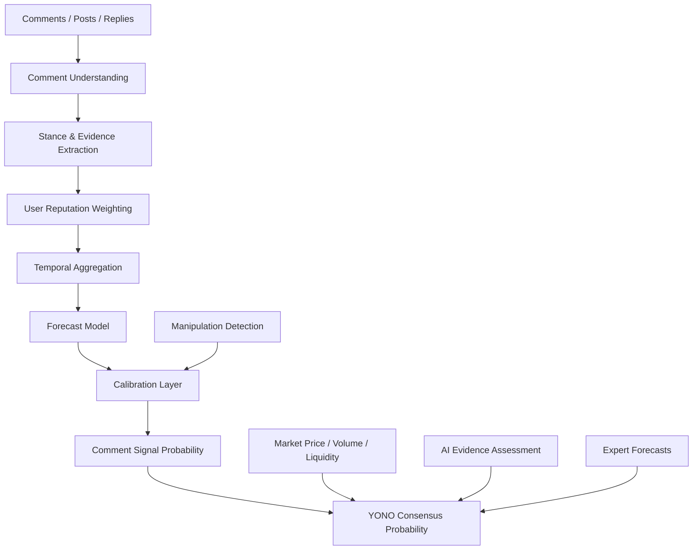
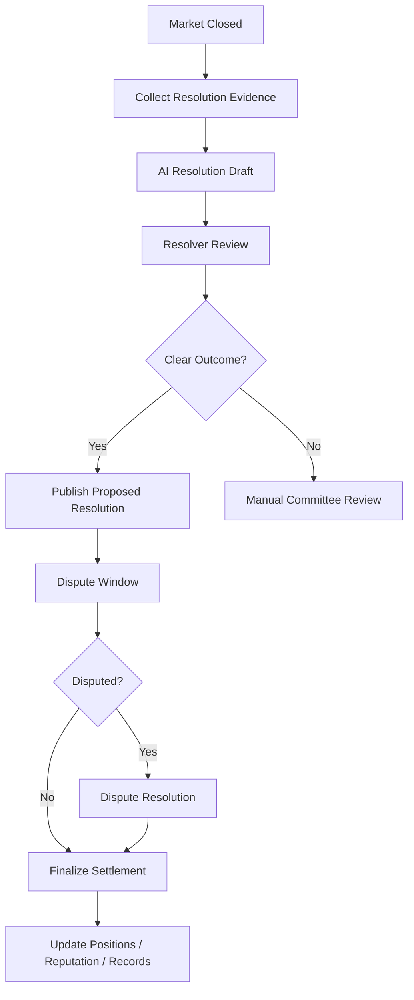
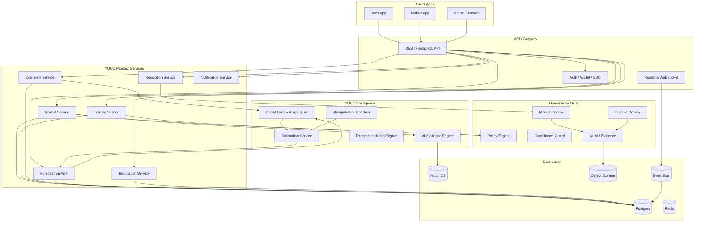

# YONO Business Detailed Design Document

> **Document Version**: v1.0
> **Scope**: YONO Web3 Social Prediction Market Business Design, Product Design, Model Design, System Architecture Design, Operations Governance Design
> **Positioning**: Social prediction and probability consensus platform for Web3, AI, technology, macro and event-driven markets
> **Core Principles**: Predictions quantifiable, evidence traceable, comments modelable, markets tradable, risks governable, results reviewable

---

# 0. One-Line Definition

**YONO is a social prediction market platform centered on "event probability" as a core asset.**

It is neither a pure information flow community nor a pure betting product, but unifies:

- User comments
- Social signals
- Expert judgment
- Market trading prices
- AI evidence analysis
- Historical prediction performance
- Crowd consensus changes

into interpretable, tradable, calibratable probability judgments.

The ultimate goal is to answer:

> What is the probability of a certain future event occurring?
> Why did this probability change?
> Which people, which evidence, which comments drove this change?
> Has the market price already reflected this information?
> Is the current consensus being manipulated, overheated, or underestimated?

---

# 1. Business Positioning

## 1.1 YONO is Not an Ordinary Prediction Market

Traditional prediction market core is:

> Users buy YES / NO, market price represents event probability.

YONO's core is:

> Market price is only one source of probability. Community comments, user reputation, evidence quality, AI analysis and trading behavior together form YONO Consensus Probability.

That is, YONO not only cares about "what is the current YES price", but also answers:

- Why does the market think YES is 60%?
- Does the comment section support this price?
- Have high-reputation users discovered new signals early?
- Is the current price distorted by wash trading, sentiment, or low liquidity?
- Is the AI evidence model consistent with market price?
- Is there a probability mismatch worth betting on?

---

## 1.2 Business Vision

YONO's long-term vision is to become:

> Probability consensus network for future events.

It can cover:

| Domain | Examples |
|---|---|
| Web3 | Whether a project will issue token, whether airdrop will happen, whether protocol will launch, whether TVL will reach certain threshold |
| AI | Whether a certain model will be released, whether a benchmark will be broken, whether a company will open-source a model |
| Tech | Product launch dates, company acquisitions, regulatory events |
| Financial Macro | Interest rates, ETFs, stock price ranges, policy changes |
| Sports Entertainment | Game results, awards, box office |
| Social Issues | Public event results, voting, policy progress |

Phase 1 recommendation focuses on Web3, because Web3 users naturally accept market-oriented expression, prediction, trading, wallet identity, on-chain reputation and event speculation.

---

# 2. Core Users

## 2.1 User Types

| User Type | Main诉求 | Value YONO Provides |
|---|---|---|
| Regular prediction users | Want to judge event probability, participate in discussion, bet | Market, comments, AI analysis, probability explanation |
| High-reputation predictors | Want to build reputation, output views, earn returns | Reputation, Forecast Track Record, revenue sharing |
| Web3 project researchers | Want to discover early signals | Comment signals, on-chain signals, market mismatches |
| KOL / Analysts | Want to spread views and verify accuracy | Quantifiable prediction records, community influence |
| Liquidity providers | Want to earn trading fees, make markets | Market热度, risk scores, liquidity incentives |
| Project teams | Want to understand community expectations | Community signals, dispute monitoring, narrative changes |
| Institutions / Research teams | Want to do event-driven research | API, data dashboards, historical samples, probability sequences |

---

## 2.2 Core User Paths

### Path A: Regular User Participates in Prediction

1. Browse trending markets
2. Check YES / NO current price
3. Read AI evidence summary
4. Read community comments and high-reputation user views
5. Buy YES or NO
6. Follow probability changes
7. After event settlement, receive gains or losses
8. User prediction performance enters reputation system

### Path B: Research-Type User Finds Opportunities

1. Enter market discovery page
2. Sort by "market price vs community signal deviation"
3. Find low-liquidity but high-evidence-signal markets
4. Read evidence-backed comments
5. Check AI Probability vs Comment Probability
6. Judge if mispricing exists
7. Bet or publish analysis
8. Subsequent review of accuracy

### Path C: KOL Builds Influence

1. Post view with probability on a market
2. Comment is structured as stance/evidence/signal
3. View is included in Community Signal
4. If result is correct, increase calibration/reputation
5. High-reputation comments get higher ranking and weight
6. Can form "Predictor Homepage" and "Historical Hit Rate"

---

# 3. Core Business Objects

## 3.1 Market

Market is YONO's core trading and discussion object.

```ts
type YonoMarket = {
  marketId: string
  title: string
  description: string
  category: "web3" | "ai" | "macro" | "sports" | "tech" | "social" | "custom"

  outcomeType: "binary" | "multi_choice" | "scalar"
  outcomes: YonoOutcome[]

  openAt: string
  closeAt: string
  resolutionDeadline: string

  status:
    | "draft"
    | "pending_review"
    | "open"
    | "paused"
    | "closed"
    | "resolving"
    | "resolved"
    | "disputed"
    | "cancelled"

  creatorId: string
  resolverPolicyId: string
  oraclePolicyId?: string

  liquidity: {
    totalLiquidityUsd: number
    volume24hUsd: number
    volumeTotalUsd: number
  }

  probability: {
    marketProbability: number
    yonoConsensusProbability?: number
    aiEvidenceProbability?: number
    commentSignalProbability?: number
    expertProbability?: number
    updatedAt: string
  }

  risk: {
    manipulationRisk: "low" | "medium" | "high" | "critical"
    resolutionRisk: "low" | "medium" | "high"
    ambiguityRisk: "low" | "medium" | "high"
    regulatoryRisk: "low" | "medium" | "high"
  }

  tags: string[]
  createdAt: string
  updatedAt: string
}
```

---

## 3.2 Outcome

```ts
type YonoOutcome = {
  outcomeId: string
  marketId: string
  label: string
  type: "yes" | "no" | "choice" | "range"
  currentPrice: number
  impliedProbability: number
  liquidityUsd: number
}
```

---

## 3.3 Comment

Comment is the key data asset that distinguishes YONO from ordinary prediction markets.

```ts
type YonoComment = {
  commentId: string
  marketId: string
  userId: string
  parentCommentId?: string

  text: string
  createdAt: string
  editedAt?: string
  deletedAt?: string

  engagement: {
    likes: number
    replies: number
    shares: number
    reports: number
  }

  source: "market_comment" | "post" | "reply" | "external_import"
  visibility: "public" | "limited" | "hidden"

  moderationStatus:
    | "visible"
    | "flagged"
    | "hidden"
    | "removed"
    | "under_review"
}
```

---

## 3.4 Forecast

Users can explicitly submit probability predictions, not just buy/sell YES/NO.

```ts
type UserForecast = {
  forecastId: string
  marketId: string
  userId: string

  probability: number
  outcomeId: string
  rationale?: string

  forecastType:
    | "explicit_probability"
    | "trade_implied"
    | "comment_inferred"

  createdAt: string
  updatedAt?: string

  settlement?: {
    finalOutcomeId: string
    brierScore: number
    logLoss: number
    isCorrectDirection: boolean
  }
}
```

---

## 3.5 User Reputation

```ts
type YonoUserReputation = {
  userId: string

  globalScore: number
  categoryScores: Record<string, number>

  calibration: {
    brierScoreAvg: number
    logLossAvg: number
    expectedCalibrationError: number
  }

  forecasting: {
    totalForecasts: number
    resolvedForecasts: number
    correctDirectionRate: number
    earlySignalScore: number
    marketOutperformanceScore: number
  }

  trust: {
    antiSpamScore: number
    manipulationRisk: number
    accountAgeScore: number
    identityStrength: number
  }

  updatedAt: string
}
```

---

# 4. Product Module Design

## 4.1 Home / Discovery

Homepage goal is not simply displaying trending markets, but helping users discover events that are "worth predicting".

### Core Modules

| Module | Description |
|---|---|
| Trending Markets | Currently most discussed and traded markets |
| Probability Movers | Markets with largest probability changes |
| Community Signal Divergence | Markets with largest deviation between community signal and market price |
| High Reputation Picks | Markets concentratedly favored by high-reputation predictors |
| Evidence Emerging | Markets where new evidence is rapidly appearing |
| Manipulation Warning | Suspected wash trading or abnormal trading markets |
| Closing Soon | Markets about to close |
| Newly Created | Newly created markets |

### Recommended Ranking Signals

```text
market_score =
  liquidity_score * 0.20
+ volume_growth_score * 0.15
+ comment_growth_score * 0.15
+ high_reputation_activity_score * 0.20
+ probability_movement_score * 0.10
+ evidence_novelty_score * 0.10
+ user_personal_relevance_score * 0.10
```

---

## 4.2 Market Detail Page

Market detail page is the core of the product.

### Information Must Display

1. Market title and settlement rules
2. YES / NO current price
3. YONO Consensus Probability
4. Market Probability
5. Comment Signal Probability
6. AI Evidence Probability
7. High-reputation user tendencies
8. Comment section
9. Evidence timeline
10. Trading entry
11. Risk warnings
12. Settlement and dispute rules

### Recommended Layout

```text
┌──────────────────────────────────────────────┐
│ Market Title                                  │
│ Resolution Criteria                           │
├──────────────────────────────────────────────┤
│ YES Price | NO Price | Volume | Liquidity     │
├──────────────────────────────────────────────┤
│ YONO Consensus Probability                    │
│ - Market: 52%                                 │
│ - Comment Signal: 61%                         │
│ - AI Evidence: 58%                            │
│ - Expert: 64%                                 │
├──────────────────────────────────────────────┤
│ Probability Chart / Timeline                  │
├──────────────────────┬───────────────────────┤
│ Evidence Timeline    │ Community Signal       │
│ AI Summary           │ High-rep Comments      │
├──────────────────────┴───────────────────────┤
│ Comments / Forecasts / Trade Panel            │
└──────────────────────────────────────────────┘
```

---

## 4.3 Comment Section

Comment section is not an ordinary comment stream, but a prediction signal system.

### Comment Sorting Modes

| Mode | Description |
|---|---|
| Top Evidence | Highest evidence quality |
| High Reputation | High-reputation users first |
| Newest | Latest comments |
| Bullish | Support YES |
| Bearish | Support NO |
| Controversial | High divergence |
| Signal Moving | Largest impact on probability change |

### Each Comment Display

```text
User A · Reputation 82 · Web3 Skill 91
Stance: YES · Evidence Quality: High · Manipulation Risk: Low

"Official GitHub merged token-claim module yesterday, I think token issuance probability before June is at least 70%."

Extracted Claim:
- GitHub merged token-claim module

Impact:
- Increased Comment Signal +2.3%
```

---

## 4.4 Create Market

Market creation must be structured to avoid ambiguity.

### Creation Form Fields

| Field | Description |
|---|---|
| title | Market question |
| description | Background description |
| category | Category |
| outcome type | binary/multi/scalar |
| resolution criteria | Clear settlement standards |
| close time | Stop trading time |
| resolution source | Settlement source |
| initial liquidity | Initial liquidity |
| tags | Tags |
| risk disclosure | Risk description |

### Market Creation Review

YONO must avoid ambiguous, non-settlable, illegal or manipulative markets.

Review items:

- Is there clear settlement criteria
- Is there a clear time window
- Can it be verified by public evidence
- Does it involve sensitive personal information
- Is there illegal finance, gambling or restricted content risk
- Can it be easily manipulated by project party
- Is it duplicate with existing markets
- Is there ambiguity or multiple interpretations

---

## 4.5 Predictor Homepage

Every user can form their own prediction profile.

### Display Content

| Module | Description |
|---|---|
| Reputation Score | Overall reputation |
| Category Skill | Domain-specific ability |
| Calibration Curve | Probability calibration curve |
| Historical Forecasts | Historical predictions |
| Early Signal Record | Whether often ahead of market |
| ROI / PnL | Trading returns |
| Community Impact | Comment impact on market signal |
| Manipulation Risk | Anti-manipulation score |

---

# 5. Core Probability System

## 5.1 Market Probability

Market Probability comes from trading prices.

```text
Market Probability ≈ YES Price
```

But needs adjustment:

- Low liquidity causes price instability
- Large traders can manipulate
- Excessive bid-ask spread distorts price
- Potential insider information near settlement
- AMM curve may bring price deviation

Therefore Market Probability cannot directly equal true probability, but is an input signal.

---

## 5.2 Comment Signal Probability

Comment Signal Probability comes from comment models.

It is not "bullish comments / total comments", but weighted social signal.

Core inputs:

- Comment stance
- Comment strength
- Evidence quality
- User reputation
- User domain ability
- Comment novelty
- Comment time decay
- Anti-manipulation weight
- Comment independence

---

## 5.3 AI Evidence Probability

AI Evidence Probability comes from AI analysis of public evidence.

Inputs include:

- Market description
- Settlement rules
- Official announcements
- News
- On-chain data
- GitHub / Discord / X / Snapshot
- Historical similar cases
- Claims extracted from comments

Output:

```ts
type AiEvidenceAssessment = {
  marketId: string
  probability: number
  confidence: "low" | "medium" | "high"
  keyEvidence: string[]
  counterEvidence: string[]
  uncertainty: string[]
  citations: EvidenceRef[]
  updatedAt: string
}
```

---

## 5.4 Expert Probability

Expert Probability comes from high-reputation users or certified analysts.

Cannot simply average, should weight by historical performance.

```text
expert_probability =
  Σ(expert_probability_i × expert_weight_i) / Σ(expert_weight_i)
```

---

## 5.5 YONO Consensus Probability

Final probability is a fused probability.

MVP version:

```text
YONO Consensus Probability =
  Market Probability * 0.40
+ AI Evidence Probability * 0.25
+ Comment Signal Probability * 0.20
+ Expert Probability * 0.10
+ Liquidity/Freshness Adjustment * 0.05
```

Different scenarios have different weights:

| Market Type | Market | Comment | AI Evidence | Expert |
|---|---:|---:|---:|---:|
| High liquidity market | high | low | medium | medium |
| Low liquidity Web3 market | medium | high | high | medium |
| Strong evidence market | medium | medium | high | medium |
| KOL-driven market | medium | high | medium | high |
| Easily manipulated market | reduce weight | reduce weight | increase weight | increase weight |

Production version should use model learning for dynamic weights, not fixed weights.

---

# 6. Social Forecasting Engine

## 6.1 Definition

**Social Forecasting Engine** is YONO's core differentiating capability.

It is responsible for turning comments, users, interactions, social graphs and market states into probability predictions.

### Core Tasks

1. Understand comments
2. Judge stance
3. Extract evidence
4. Judge evidence quality
5. Judge user credibility
6. Aggregate group views
7. Identify manipulation
8. Output probability
9. Calibrate probability
10. Explain probability changes

---

## 6.2 Model Architecture



---

## 6.3 Comment Understanding

Input:

```ts
type CommentInput = {
  commentId: string
  userId: string
  marketId: string
  text: string
  createdAt: string
  parentCommentId?: string
  likes: number
  replies: number
}
```

Output:

```ts
type CommentSignal = {
  commentId: string
  marketId: string
  userId: string

  stance: "YES" | "NO" | "NEUTRAL" | "UNCLEAR"
  stanceStrength: number
  confidence: number

  sentiment: "positive" | "negative" | "neutral"
  evidenceQuality: number
  noveltyScore: number
  manipulationRisk: number

  entities: string[]
  claims: string[]
  extractedEvidence: string[]

  createdAt: string
}
```

---

## 6.4 User Reputation Weighting

User weight recommendation:

```text
user_weight =
  reputation_score * 0.30
+ category_skill * 0.25
+ calibration_score * 0.20
+ early_signal_score * 0.15
+ anti_manipulation_score * 0.10
```

### Metric Explanations

| Metric | Description |
|---|---|
| reputation_score | User's overall reputation |
| category_skill | User's ability in current domain |
| calibration_score | Whether user's probability predictions are calibrated |
| early_signal_score | Whether often discovers changes ahead of market |
| anti_manipulation_score | Whether unlike wash trading, bot accounts or manipulation accounts |

---

## 6.5 Temporal Aggregation

Aggregate by multiple time windows:

- 1h
- 6h
- 24h
- 7d
- all

Comment signal:

```text
comment_signal =
Σ(user_weight_i
  × stance_score_i
  × evidence_quality_i
  × confidence_i
  × novelty_score_i
  × time_decay_i
  × anti_spam_weight_i)
```

stance_score:

| stance | score |
|---|---:|
| YES | +1 |
| NO | -1 |
| NEUTRAL | 0 |
| UNCLEAR | 0 |

---

## 6.6 Manipulation Detection

Comment predictions are naturally vulnerable to manipulation, so anti-manipulation model must be built in.

### Detection Signals

| Signal | Risk |
|---|---|
| Short time large number of new accounts commenting in same direction | Bot army |
| Highly similar comment text | Template spamming |
| Low-reputation accounts centrally liking | Fake popularity |
| KOL posting after correlated wallet positions | Potential manipulation |
| Price rising then comments suddenly uniformly bullish | Chasing sentiment |
| Inducing comments near settlement | Settlement manipulation |
| Multiple accounts same device/IP behavior | Sybil attack |
| Comments strongly correlated with trading addresses | Coordinated manipulation |

### Output

```ts
type ManipulationAssessment = {
  marketId: string
  riskLevel: "low" | "medium" | "high" | "critical"
  reasons: string[]
  affectedSignals: string[]
  recommendedAction:
    | "none"
    | "downweight_comments"
    | "hide_suspicious_comments"
    | "pause_market"
    | "manual_review"
}
```

---

# 7. Trading System Design

## 7.1 Trading Mode Selection

YONO can be implemented in phases.

### MVP

Recommended to use centralized order/points/simulated trading or internal ledger, not immediately on-chain.

Advantages:

- Fast product validation
- Reduce compliance and on-chain complexity
- Easy risk control
- Easy to fix settlement issues

### Phase 2

Introduce real funds or on-chain settlement.

Optional modes:

| Mode | Advantages | Risks |
|---|---|---|
| Centralized ledger | Fast, low cost | Trust platform |
| AMM | Continuous liquidity | Price curve design complex |
| Order Book | Good price discovery | Needs liquidity |
| On-chain contracts | Transparent verifiable | Compliance, Gas, attack surface |
| Hybrid mode | Balance experience and transparency | Architecture complex |

Recommended roadmap:

```text
Phase 1: off-chain points / paper trading
Phase 2: custodial internal ledger
Phase 3: hybrid settlement
Phase 4: selected on-chain markets
```

---

## 7.2 Order Object

```ts
type YonoOrder = {
  orderId: string
  marketId: string
  outcomeId: string
  userId: string

  side: "buy" | "sell"
  orderType: "market" | "limit"
  quantity: number
  limitPrice?: number

  status:
    | "pending"
    | "accepted"
    | "partially_filled"
    | "filled"
    | "cancelled"
    | "rejected"
    | "expired"

  createdAt: string
  updatedAt: string
}
```

---

## 7.3 Position

```ts
type YonoPosition = {
  positionId: string
  marketId: string
  outcomeId: string
  userId: string

  quantity: number
  averagePrice: number
  currentPrice: number
  unrealizedPnl: number
  realizedPnl: number

  updatedAt: string
}
```

---

## 7.4 Trade

```ts
type YonoTrade = {
  tradeId: string
  marketId: string
  outcomeId: string

  buyerUserId: string
  sellerUserId?: string

  price: number
  quantity: number
  feeUsd: number

  createdAt: string
}
```

---

# 8. Settlement System Design

## 8.1 Settlement Principles

Each market must clearly define at creation:

- Settlement time
- Settlement source
- Settlement criteria
- Exception handling
- Dispute window
- Cancellation conditions

Markets that cannot be clearly settled should not go online.

---

## 8.2 Resolution Policy

```ts
type ResolutionPolicy = {
  policyId: string
  marketId: string

  sourceType:
    | "official_announcement"
    | "onchain_event"
    | "api_data"
    | "manual_committee"
    | "hybrid"

  sourceRefs: string[]

  criteria: string
  evidenceRequired: string[]

  disputeWindowHours: number

  fallbackAction:
    | "manual_review"
    | "cancel_market"
    | "extend_resolution"
    | "use_committee_vote"
}
```

---

## 8.3 Settlement Process



---

## 8.4 Dispute System

```ts
type MarketDispute = {
  disputeId: string
  marketId: string
  raisedBy: string

  reason:
    | "ambiguous_criteria"
    | "wrong_evidence"
    | "oracle_error"
    | "manipulation"
    | "other"

  evidenceRefs: string[]
  status:
    | "submitted"
    | "under_review"
    | "accepted"
    | "rejected"
    | "resolved"

  createdAt: string
  resolvedAt?: string
}
```

---

# 9. Risk Control and Governance

## 9.1 Market Risk Types

| Risk | Description | Handling |
|---|---|---|
| Ambiguity Risk | Market question unclear | Reject or require revision at creation stage |
| Resolution Risk | Cannot objectively settle | Force human review |
| Manipulation Risk | Comment/trading abnormal | Reduce weight, freeze, human review |
| Insider Risk | Event party can control result | Mark high risk |
| Regulatory Risk | Involves regulatory sensitivity | Prohibit or restrict |
| Liquidity Risk | Price easily manipulated | Display risk, limit position |
| Oracle Risk | Data source unreliable | Multi-source verification |
| User Harm Risk | May induce high-risk behavior | Limit, warn, cool-off period |

---

## 9.2 Market Review Rules

Market creation enters review queue:

```text
Market Draft
→ Automated Screening
→ Risk Classification
→ Human Review if needed
→ Open / Rejected / Needs Revision
```

Automated review checks:

- Contains illegal content
- Involves personal privacy
- Has clear time boundary
- Has clear outcome
- Has objective evidence source
- Duplicates existing market
- Can be manipulated by single party
- Belongs to restricted financial market

---

## 9.3 User Risk Control

| Risk Control Item | Description |
|---|---|
| KYC / identity tier | Tiered authentication |
| deposit limit | Deposit limit |
| position limit | Position limit |
| market creation limit | Create market limit |
| suspicious behavior | Abnormal behavior detection |
| collusion detection | Coordinated behavior detection |
| rate limit | Comment, trading, creation rate limit |
| account reputation | Reputation affects permissions |

---

## 9.4 Trading Risk Control

- Max position per market
- Max loss per user
- Large order slippage warning for low-liquidity markets
- Suspend on abnormal price fluctuations
- High-frequency trading limits
- Self-trade detection
- KOL posting and trading correlation detection
- Market creator trading restrictions
- Event-related party trading restrictions

---

# 10. Content Governance

## 10.1 Comment Governance

Comment section must be governed:

- spam
- harassment
- misinformation
- market manipulation
- illegal promotion
- personal data leakage
- coordinated campaigns

### Comment State Machine

```text
visible
→ flagged
→ under_review
→ hidden
→ removed
```

---

## 10.2 AI-Assisted Governance

AI can be used for:

- Detecting violating comments
- Extracting claims
- Identifying sarcasm/inducement
- Judging evidence quality
- Detecting duplicate templates
- Identifying market manipulation narratives
- Generating review suggestions

But for high-risk content, human review should be final.

---

# 11. Data and Model Training

## 11.1 Data Sources

| Data | Usage |
|---|---|
| Historical markets | Train outcome prediction |
| Comments | Train stance/evidence |
| User prediction records | Train reputation |
| Trading behavior | Train market signal |
| Settlement results | Labels |
| Dispute records | Risk model |
| Report records | Content governance |
| On-chain data | Web3 evidence |
| External news/announcements | AI evidence |

---

## 11.2 Sample Construction

Snapshot by market time:

```text
T-30d
T-14d
T-7d
T-3d
T-24h
T-4h
T-1h
```

Each snapshot forms training sample:

```ts
type ForecastTrainingSample = {
  marketId: string
  snapshotTime: string

  commentFeatures: Record<string, number>
  userReputationFeatures: Record<string, number>
  socialGraphFeatures: Record<string, number>
  marketFeatures: Record<string, number>
  evidenceFeatures: Record<string, number>

  finalOutcome: 0 | 1
}
```

---

## 11.3 MVP Model

Phase 1 recommendation:

```text
LLM / small model comment structuring
+ LightGBM / XGBoost probability prediction
+ Isotonic Regression probability calibration
+ Rule-based anti-manipulation detection
```

Advantages:

- Interpretable
- Fast training
- Low data requirements
- Easy to debug
- Easy to launch

---

## 11.4 Production Model

Mature version:

```text
Comment Encoder
+ User Reputation Model
+ Social Graph Model
+ Temporal Model
+ Forecast Head
+ Calibration Head
+ Manipulation Detection Head
```

### Sub-models

| Model | Role |
|---|---|
| Comment Understanding Model | Comment understanding |
| Stance Extraction Model | YES/NO/Neutral |
| Evidence Quality Model | Judge evidence quality |
| Reputation Model | User credibility |
| Graph Model | User relationships/manipulation groups |
| Temporal Model | Time series trends |
| Forecast Model | Output probability |
| Calibration Model | Probability calibration |
| Manipulation Model | Anti-manipulation |

---

## 11.5 Evaluation Metrics

| Metric | Description |
|---|---|
| Brier Score | Probability prediction quality |
| Log Loss | High confidence error penalty |
| ECE | Probability calibration error |
| AUC | Distinguish YES/NO |
| CLV | Whether better than market price |
| Market Outperformance | Whether exceeds baseline market price |
| Early Signal Score | Whether ahead in discovering trends |
| Manipulation Robustness | Anti-manipulation capability |
| Category Performance | Domain-specific performance |
| Resolver Accuracy | Settlement accuracy |
| Dispute Rate | Market dispute rate |

---

# 12. System Architecture

## 12.1 Overall Architecture



---

## 12.2 Relationship with Automatic Agent Platform

YONO can serve as a business domain of Automatic Agent Platform, but not recommended to deeply couple with core runtime at initial stage.

Recommended approach:

```text
YONO Product Domain
→ Use platform's IAM / Policy / Event / Evidence / Observability
→ Use Agent Runtime for AI Evidence, Social Forecast, Resolution Assist
→ Trading, markets, comments, settlement remain as business domain services
```

### Correspondence

| YONO Module | Automatic Agent Platform Reusable Capabilities |
|---|---|
| Market Review | Policy Engine / HITL |
| AI Evidence | Model Gateway / Harness |
| Social Forecast | Domain Agent / Evaluation |
| Resolution Assist | Evidence Chain / HITL |
| Comment Moderation | Guardrails / Risk Control |
| Manipulation Detection | Ops / Drift / Alerting |
| Audit | State-Evidence / Event Bus |
| Notifications | Channel Gateway |
| Admin Review | Dashboard / Approval |

---

## 12.3 Recommended Directory Structure

```text
src/domains/yono/
  market/
    market-service.ts
    market-model.ts
    market-review-service.ts

  trading/
    order-service.ts
    position-service.ts
    trade-service.ts
    ledger-service.ts

  comments/
    comment-service.ts
    comment-signal-service.ts
    moderation-service.ts

  forecasting/
    social-forecasting-engine.ts
    forecast-feature-service.ts
    probability-calibration-service.ts
    consensus-probability-service.ts

  reputation/
    user-reputation-service.ts
    calibration-score-service.ts
    early-signal-score-service.ts

  resolution/
    resolution-policy-service.ts
    resolution-assist-agent.ts
    dispute-service.ts
    settlement-service.ts

  risk/
    manipulation-detection-service.ts
    market-risk-service.ts
    trading-risk-service.ts

  api/
    yono-market-routes.ts
    yono-trading-routes.ts
    yono-comment-routes.ts
    yono-forecast-routes.ts

  schemas/
    market.schema.ts
    comment.schema.ts
    forecast.schema.ts
    trade.schema.ts
    resolution.schema.ts

  events/
    yono-events.ts
    yono-event-handlers.ts
```

---

# 13. Agent Design

## 13.1 What Agents Should YONO Have

| Agent | Responsibilities |
|---|---|
| Market Review Agent | Review whether market can go online |
| Social Forecast Agent | Generate probability from comments and user behavior |
| Evidence Research Agent | Collect and summarize external evidence |
| Manipulation Detection Agent | Detect wash trading, coordinated manipulation |
| Resolution Assist Agent | Help settle markets |
| Dispute Review Agent | Assist dispute handling |
| Reputation Audit Agent | Analyze user reputation and abnormal behavior |
| Notification Agent | Generate user reminders |
| Recommendation Agent | Recommend markets and comments |

---

## 13.2 Social Forecast Agent

Input:

```ts
type SocialForecastInput = {
  marketId: string
  snapshotTime: string
  timeWindow: "1h" | "6h" | "24h" | "7d" | "all"
}
```

Output:

```ts
type SocialForecastOutput = {
  marketId: string

  commentSignalProbability: number
  weightedYesSignal: number
  weightedNoSignal: number

  highReputationYesRatio: number
  highReputationNoRatio: number
  evidenceBackedCommentRatio: number

  manipulationRisk: "low" | "medium" | "high" | "critical"
  trend: "bullish" | "bearish" | "mixed" | "neutral"

  confidence: "low" | "medium" | "high"
  explanation: string
  evidenceRefs: string[]
}
```

---

## 13.3 Market Review Agent

Checks:

- Whether market is settlable
- Whether outcome is clear
- Whether there is clear deadline
- Whether compliance risk exists
- Whether manipulation is possible
- Whether duplicate
- Whether human approval is needed

Output:

```ts
type MarketReviewResult = {
  marketId: string
  decision: "approve" | "reject" | "needs_revision" | "manual_review"
  riskLevel: "low" | "medium" | "high" | "critical"
  issues: string[]
  requiredChanges: string[]
}
```

---

## 13.4 Resolution Assist Agent

Input:

- Market rules
- Evidence sources
- Comment disputes
- External data
- oracle data

Output:

```ts
type ResolutionDraft = {
  marketId: string
  proposedOutcomeId: string
  confidence: number
  evidenceRefs: string[]
  reasoningSummary: string
  ambiguityFlags: string[]
  requiresHumanReview: boolean
}
```

---

# 14. Event System

YONO should be an event-driven system.

## 14.1 Core Events

```ts
type YonoEventType =
  | "yono.market.created"
  | "yono.market.review_requested"
  | "yono.market.approved"
  | "yono.market.opened"
  | "yono.market.paused"
  | "yono.market.closed"
  | "yono.market.resolution_proposed"
  | "yono.market.resolved"
  | "yono.market.disputed"
  | "yono.comment.created"
  | "yono.comment.signal_extracted"
  | "yono.forecast.submitted"
  | "yono.order.created"
  | "yono.trade.executed"
  | "yono.position.updated"
  | "yono.reputation.updated"
  | "yono.manipulation.detected"
  | "yono.consensus_probability.updated"
```

---

## 14.2 Event Envelope

```ts
type YonoEventEnvelope<T> = {
  eventId: string
  eventType: YonoEventType
  schemaVersion: string

  tenantId: string
  marketId?: string
  userId?: string

  correlationId: string
  causationId?: string
  idempotencyKey?: string

  payload: T
  payloadHash: string

  createdAt: string
}
```

---

# 15. API Design

## 15.1 Market API

```http
POST /api/v1/yono/markets
GET  /api/v1/yono/markets
GET  /api/v1/yono/markets/:marketId
POST /api/v1/yono/markets/:marketId/review
POST /api/v1/yono/markets/:marketId/open
POST /api/v1/yono/markets/:marketId/pause
POST /api/v1/yono/markets/:marketId/close
POST /api/v1/yono/markets/:marketId/resolve
```

---

## 15.2 Comment API

```http
POST /api/v1/yono/markets/:marketId/comments
GET  /api/v1/yono/markets/:marketId/comments
POST /api/v1/yono/comments/:commentId/react
POST /api/v1/yono/comments/:commentId/report
GET  /api/v1/yono/comments/:commentId/signals
```

---

## 15.3 Forecast API

```http
POST /api/v1/yono/markets/:marketId/forecasts
GET  /api/v1/yono/markets/:marketId/forecasts
GET  /api/v1/yono/markets/:marketId/consensus
GET  /api/v1/yono/users/:userId/forecast-record
```

---

## 15.4 Trading API

```http
POST /api/v1/yono/orders
GET  /api/v1/yono/orders
POST /api/v1/yono/orders/:orderId/cancel
GET  /api/v1/yono/positions
GET  /api/v1/yono/trades
```

---

## 15.5 Resolution API

```http
POST /api/v1/yono/markets/:marketId/resolution-draft
POST /api/v1/yono/markets/:marketId/disputes
GET  /api/v1/yono/markets/:marketId/disputes
POST /api/v1/yono/disputes/:disputeId/decision
```

---

# 16. Database Table Design

## 16.1 markets

```sql
CREATE TABLE yono_markets (
  market_id TEXT PRIMARY KEY,
  tenant_id TEXT NOT NULL,
  title TEXT NOT NULL,
  description TEXT NOT NULL,
  category TEXT NOT NULL,
  outcome_type TEXT NOT NULL,
  status TEXT NOT NULL,
  creator_id TEXT NOT NULL,
  close_at TIMESTAMPTZ NOT NULL,
  resolution_deadline TIMESTAMPTZ NOT NULL,
  resolver_policy_id TEXT NOT NULL,
  market_probability NUMERIC,
  yono_consensus_probability NUMERIC,
  comment_signal_probability NUMERIC,
  ai_evidence_probability NUMERIC,
  expert_probability NUMERIC,
  risk_json JSONB NOT NULL,
  tags_json JSONB NOT NULL,
  created_at TIMESTAMPTZ NOT NULL,
  updated_at TIMESTAMPTZ NOT NULL
);
```

---

## 16.2 comments

```sql
CREATE TABLE yono_comments (
  comment_id TEXT PRIMARY KEY,
  tenant_id TEXT NOT NULL,
  market_id TEXT NOT NULL,
  user_id TEXT NOT NULL,
  parent_comment_id TEXT,
  text TEXT NOT NULL,
  moderation_status TEXT NOT NULL,
  engagement_json JSONB NOT NULL,
  created_at TIMESTAMPTZ NOT NULL,
  edited_at TIMESTAMPTZ,
  deleted_at TIMESTAMPTZ
);
```

---

## 16.3 comment_signals

```sql
CREATE TABLE yono_comment_signals (
  signal_id TEXT PRIMARY KEY,
  comment_id TEXT NOT NULL,
  market_id TEXT NOT NULL,
  user_id TEXT NOT NULL,
  stance TEXT NOT NULL,
  stance_strength NUMERIC NOT NULL,
  confidence NUMERIC NOT NULL,
  sentiment TEXT NOT NULL,
  evidence_quality NUMERIC NOT NULL,
  novelty_score NUMERIC NOT NULL,
  manipulation_risk NUMERIC NOT NULL,
  claims_json JSONB NOT NULL,
  evidence_json JSONB NOT NULL,
  created_at TIMESTAMPTZ NOT NULL
);
```

---

## 16.4 forecasts

```sql
CREATE TABLE yono_forecasts (
  forecast_id TEXT PRIMARY KEY,
  tenant_id TEXT NOT NULL,
  market_id TEXT NOT NULL,
  outcome_id TEXT NOT NULL,
  user_id TEXT NOT NULL,
  probability NUMERIC NOT NULL,
  forecast_type TEXT NOT NULL,
  rationale TEXT,
  created_at TIMESTAMPTZ NOT NULL,
  updated_at TIMESTAMPTZ
);
```

---

## 16.5 orders

```sql
CREATE TABLE yono_orders (
  order_id TEXT PRIMARY KEY,
  tenant_id TEXT NOT NULL,
  market_id TEXT NOT NULL,
  outcome_id TEXT NOT NULL,
  user_id TEXT NOT NULL,
  side TEXT NOT NULL,
  order_type TEXT NOT NULL,
  quantity NUMERIC NOT NULL,
  limit_price NUMERIC,
  status TEXT NOT NULL,
  created_at TIMESTAMPTZ NOT NULL,
  updated_at TIMESTAMPTZ NOT NULL
);
```

---

## 16.6 trades

```sql
CREATE TABLE yono_trades (
  trade_id TEXT PRIMARY KEY,
  tenant_id TEXT NOT NULL,
  market_id TEXT NOT NULL,
  outcome_id TEXT NOT NULL,
  buyer_user_id TEXT NOT NULL,
  seller_user_id TEXT,
  price NUMERIC NOT NULL,
  quantity NUMERIC NOT NULL,
  fee_usd NUMERIC NOT NULL,
  created_at TIMESTAMPTZ NOT NULL
);
```

---

## 16.7 reputation

```sql
CREATE TABLE yono_user_reputation (
  user_id TEXT PRIMARY KEY,
  global_score NUMERIC NOT NULL,
  category_scores_json JSONB NOT NULL,
  calibration_json JSONB NOT NULL,
  forecasting_json JSONB NOT NULL,
  trust_json JSONB NOT NULL,
  updated_at TIMESTAMPTZ NOT NULL
);
```

---

# 17. Operations Design

## 17.1 Cold Start Strategy

YONO's biggest difficulty in cold start is:

- Not enough markets
- Not enough comments
- Not enough liquidity
- Not enough historical reputation

Recommended phased approach:

### Phase 1: Select High-Quality Markets

Officially create high-quality markets:

- Web3 token issuance
- Airdrops
- Project roadmap
- AI model releases
- Crypto regulatory events

### Phase 2: Invite High-Quality Predictors

Invite:

- Web3 researchers
- KOLs
- Community active users
- Data analysts
- Alpha group members

### Phase 3: Points Prediction

First don't use real money, use:

- points
- reputation
- leaderboard
- badges
- rewards

### Phase 4: Introduce Trading Incentives

- LP incentives
- Prediction contests
- High-quality comment rewards
- Correct early prediction rewards

---

## 17.2 Growth Mechanisms

| Mechanism | Description |
|---|---|
| Shareable Market Card | Share market probability card |
| Prediction Badge | User prediction badge |
| Leaderboard | Prediction leaderboard |
| Streak | Consecutive accurate predictions |
| Market Creator Reward | Quality market creation rewards |
| Evidence Reward | High-quality evidence comment rewards |
| Referral | Invitation rewards |
| KOL Page | KOL prediction homepage |

---

## 17.3 Recommendation Mechanism

Recommendation dimensions:

- User's followed domains
- User's historical predictions
- Market popularity
- Price changes
- Comment signal changes
- High-reputation user participation
- Near settlement
- Dispute level
- Potential mispricing

---

# 18. Business Model

## 18.1 Revenue Sources

| Revenue | Description |
|---|---|
| Trading Fee | Transaction fees |
| Market Creation Fee | Market creation fees |
| Liquidity Fee Share | Liquidity fee sharing |
| Premium Analytics | Premium analytics subscription |
| API Access | Data API charges |
| KOL Tools | KOL professional tools |
| Enterprise Dashboard | Enterprise/project intelligence dashboard |
| Sponsored Market | Compliant sponsored market |
| Data Products | Historical prediction dataset |

---

## 18.2 Most Priority Commercialization Path

Recommended priority:

1. Premium analytics subscription
2. Transaction fees
3. API data services
4. Enterprise intelligence dashboard
5. Market creation services
6. Liquidity services

Reasons:

- Prediction markets themselves have compliance complexity
- Data and analytics products are easier to commercialize first
- Community signal model can become independent selling point
- Web3 project parties are willing to pay for market sentiment and community predictions

---

# 19. Compliance Risk

One of YONO's biggest risks is compliance.

## 19.1 Must Focus On Issues

- Does it constitute gambling
- Does it constitute financial derivatives
- Does it involve securities
- Does it allow real money trading
- Does it support US/China/EU users
- Does it need KYC
- Does it need geographic restrictions
- Does it involve minors
- Does it involve politics/elections/sports betting
- Does it involve insider information

## 19.2 Recommended Strategy

Phase 1 recommendation:

- No real money trading
- Use points or reputation
- No withdrawal
- No high-risk financial products
- No politically sensitive markets
- Market creation goes through review
- Strengthen disclaimers
- Geographic restrictions reserved
- Settlement dispute mechanism improved

---

# 20. MVP Scope

## 20.1 MVP Must-Haves

| Module | Required |
|---|---|
| Market creation | Must |
| Market review | Must |
| Market detail page | Must |
| Comment system | Must |
| Comment structuring | Must |
| User explicit prediction | Must |
| Basic reputation | Must |
| YONO Consensus Probability | Must |
| AI Evidence Summary | Recommended must |
| Settlement system | Must |
| Dispute system | Simplified version must |
| Points trading | Recommended must |
| Real money trading | Not recommended for MVP |
| Anti-manipulation detection | Simplified version must |
| Admin backend | Must |

---

## 20.2 MVP Not Included

- No complex on-chain contracts
- No real money withdrawal
- No cross-chain trading
- No high-frequency trading
- No complex AMM
- No fully automatic settlement
- No fully open market creation
- No high-risk financial market types

---

## 20.3 MVP Milestones

### M1: Basic Market and Comments

- Market CRUD
- Comment CRUD
- User prediction
- Market detail page
- Backend review

### M2: Comment Signal Model

- stance extraction
- evidence quality
- comment signal probability
- high reputation weighting

### M3: Settlement and Reputation

- market resolution
- dispute workflow
- user reputation update
- calibration score

### M4: Points Trading

- order/position/trade
- paper trading
- leaderboard

### M5: AI Evidence and Manipulation Detection

- evidence assistant
- manipulation risk
- probability fusion

---

# 21. Key Metrics

## 21.1 Product Metrics

| Metric | Description |
|---|---|
| DAU / WAU | Active users |
| Market Views | Market views |
| Comment Rate | Comment rate |
| Forecast Rate | Prediction rate |
| Trade Conversion | Browse to trade conversion |
| Retention | Retention |
| Share Rate | Share rate |
| Creator Rate | Proportion of market-creating users |

---

## 21.2 Prediction Quality Metrics

| Metric | Description |
|---|---|
| Brier Score | Probability quality |
| Log Loss | High confidence errors |
| Calibration Error | Calibration |
| Market Outperformance | Whether better than market price |
| Early Signal Score | Early signal capability |
| Evidence Hit Rate | Evidence hit rate |
| Comment Signal Lift | Comment signal contribution |

---

## 21.3 Market Health Metrics

| Metric | Description |
|---|---|
| Liquidity | Liquidity |
| Volume | Trading volume |
| Spread | Bid-ask spread |
| Dispute Rate | Dispute rate |
| Manipulation Risk | Manipulation risk |
| Resolution Delay | Settlement delay |
| User Concentration | User concentration |
| Market Creator Quality | Market creation quality |

---

# 22. Risk Checklist

| Risk | Severity | Description | Mitigation |
|---|---|---|---|
| Compliance risk | P0 | Real money prediction market may trigger regulation | Use points in MVP, restrict regions, legal review |
| Market ambiguity | P0 | Cannot settle leading to trust loss | Creation review, settlement rule templates |
| Comment manipulation | P0 | Wash trading affects probability | Anti-manipulation model, reduce weight |
| Low-liquidity manipulation | P0 | Few trades affect price | Liquidity warnings, position limits |
| Settlement dispute | P1 | Users don't recognize results | Dispute window, evidence chain |
| Model overconfidence | P1 | Wrong probability misleads users | Probability calibration, confidence display |
| KOL manipulation | P1 | KOL带走单 | Trading disclosure, anomaly detection |
| Data pollution | P1 | Comment training set polluted | Data isolation, manipulation labels |
| Cold start | P1 | No markets no users | Official selected markets, invitation system |
| Reputation cheating | P2 | Alt accounts刷 reputation | Identity/behavior/graph detection |

---

# 23. Recommended Development Priority

## 23.1 First Priority

1. Market Service
2. Comment Service
3. Forecast Service
4. Resolution Service
5. Admin Review Console
6. Social Forecasting Engine MVP
7. User Reputation MVP
8. Event/Audit infrastructure

## 23.2 Second Priority

1. Paper Trading
2. Position/Order/Trade
3. Leaderboard
4. AI Evidence Engine
5. Manipulation Detection
6. Notification
7. Recommendation

## 23.3 Third Priority

1. API data products
2. Enterprise Dashboard
3. On-chain settlement
4. Real money trading
5. Advanced social graph model
6. Multi-domain expansion

---

# 24. Relationship with Mission Architecture

If YONO connects to Automatic Agent Platform, recommended:

- One Market Review can be one Task
- One Resolution Review can be one Task
- One Social Forecasting run can be one HarnessRun
- One long-term market operation goal can be one Mission
- A market itself is not a Mission
- A user session is not a Mission
- A trade is not a Mission
- A comment processing is not a Mission

### Example Mission

```ts
type MissionExample = {
  missionId: "mission_yono_web3_launch_q3"
  title: "Launch YONO Web3 Prediction Market MVP"
  objectives: [
    "Launch 100 high-quality Web3 markets",
    "Reach 10k registered users",
    "Achieve Brier score below baseline market-only model",
    "Keep dispute rate below 5%"
  ]
  scope: {
    domain: "yono"
    category: "web3"
  }
}
```

Mission is responsible for long-term goals, budget, governance and review, not involved in real-time execution of each comment, each trade.

---

# 25. Final Recommendations

YONO's most worth strengthening is not "prediction market trading" itself, but:

1. **Social signal prediction capability**
2. **User reputation and calibration capability**
3. **AI evidence interpretation capability**
4. **Market price and community consensus deviation discovery**
5. **Anti-manipulation and settlement governance capability**

If only doing trading, YONO will become an ordinary prediction market.

If integrating comments, reputation, evidence, probability calibration and market price together, YONO will form real differentiation:

> A tradable social consensus probability engine.

Recommended Phase 1 positioning:

**Web3 Social Prediction Intelligence Platform**

Not directly positioned as real money prediction exchange.

This way can first build network effects with content, prediction, reputation, analytics and points market, then gradually enter more complex trading and settlement systems.

---

# 26. v1.0 Frozen Conclusions

YONO v1.0 recommended to freeze according to following principles:

1. **Prediction intelligence first, real money trading later.**
2. **First Web3 vertical domain, then cross-domain expansion.**
3. **First points/reputation market, then on-chain settlement.**
4. **First comment signal model, then complex social graph model.**
5. **First human review settlement, then semi-automatic settlement.**
6. **All markets must have clear settlement rules.**
7. **All probability outputs must be explainable, calibratable, reviewable.**
8. **Comments cannot be equal-weight voting, must be weighted by user reputation, evidence quality and manipulation risk.**
9. **YONO Consensus Probability should fuse market price, AI evidence, comment signal and expert prediction.**
10. **YONO should connect as a business domain of Automatic Agent Platform, not invade core runtime.**

Final product form:

> **YONO = Prediction Market + Social Forecasting Engine + Reputation Network + AI Evidence Layer + Governance/Resolution System**