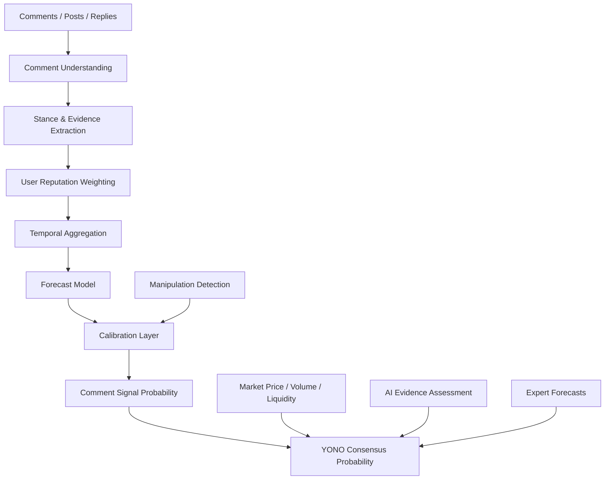
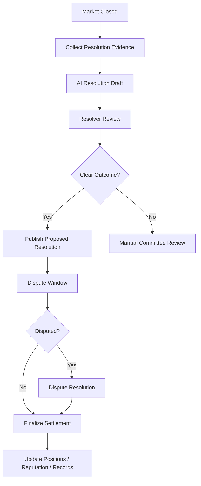
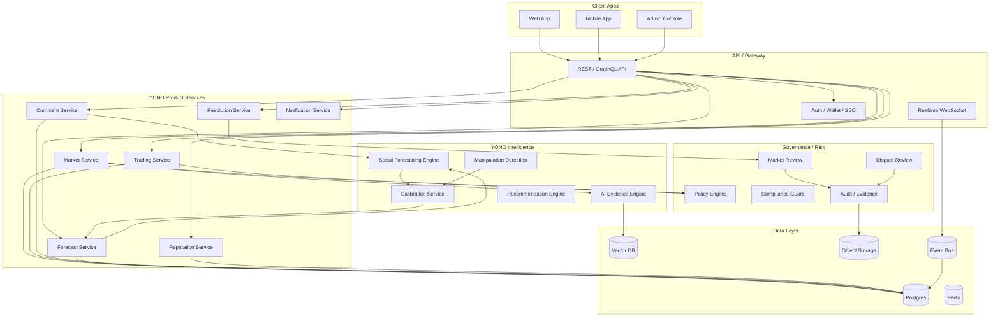

# YONO Business Detailed Design Document

> **Document Version**: v1.0
> **Applicable Scope**: YONO Web3 social prediction market business design, product design, model design, system architecture design, operations governance design
> **Positioning**: A social prediction and probability consensus platform oriented toward Web3, AI, technology, macro and event-driven markets
> **Core Principles**: Predictable and quantifiable, evidence traceable, comments modelable, markets tradable, risk governable, results reviewable

---

# 0. One-Sentence Definition

**YONO is a social prediction market platform with "event probability" as its core asset.**

It is not a simple information-flow community, nor a simple prediction product, but unifies:

- User comments
- Social signals
- Expert judgments
- Market trading prices
- AI evidence analysis
- Historical forecast performance
- Group consensus changes

Into explainable, tradable, and calibratable probability judgments.

The ultimate goal is to answer:

> What is the probability of a future event occurring?
> Why does this probability change?
> Which people, which evidence, which comments drove this change?
> Has the market price already reflected this information?
> Is the current consensus being manipulated, overheated, or underestimated?

---

# 1. Business Positioning

## 1.1 YONO Is Not an Ordinary Prediction Market

The core of traditional prediction markets is:

> Users buy YES / NO, market price represents event probability.

The core of YONO is:

> Market price is only one of the sources of probability. Community comments, user reputation, evidence quality, AI analysis and trading behavior together form the YONO Consensus Probability.

In other words, YONO not only cares about "what is the current YES price", but also answers:

- Why does the market think YES is 60%?
- Does the comment section support this price?
- Do high-reputation users discover new signals early?
- Is the current price distorted by wash trading, sentiment, or low liquidity?
- Is the AI evidence model consistent with the market price?
- Is there a probability mismatch worth betting on?

---

## 1.2 Business Vision

YONO's long-term vision is to become:

> A probability consensus network for future events.

It can cover:

| Domain | Example |
|---|---|
| Web3 | Whether a project issues a token, whether an airdrop occurs, whether a protocol launches, whether TVL reaches a certain threshold |
| AI | Whether a certain model is released, whether a benchmark is broken through, whether a certain company open-sources a model |
| Technology | Product release time, company mergers and acquisitions, regulatory events |
| Finance Macro | Interest rates, ETFs, stock price ranges, policy changes |
| Sports Entertainment | Match results, awards, box office |
| Social Topics | Public event results, voting, policy progress |

The first phase is recommended to focus on Web3, because Web3 users naturally accept market expression, prediction, trading, wallet identity, on-chain reputation and event speculation.

---

# 2. Core Users

## 2.1 User Types

| User Type | Main Need | Value Provided by YONO |
|---|---|---|
| Ordinary prediction user | Want to judge event probability, participate in discussion, bet | Market, comments, AI analysis, probability explanation |
| High-reputation predictor | Want to build reputation, output views, earn income | Reputation, Forecast Track Record, revenue sharing |
| Web3 project researcher | Want to discover early signals | Comment signals, on-chain signals, market mismatch |
| KOL / Analyst | Want to spread views and verify accuracy | Quantifiable prediction records, community influence |
| Liquidity provider | Want to earn trading fees, make markets | Market heat, risk scoring, liquidity incentives |
| Project party | Want to understand community expectations | Community signals, dispute monitoring, narrative changes |
| Institution / Research team | Want to do event-driven research | API, data panel, historical samples, probability series |

---

## 2.2 Core User Paths

### Path A: Ordinary User Participates in Prediction

1. Browse trending markets
2. View current YES / NO prices
3. Read AI evidence summary
4. Read community comments and high-reputation user views
5. Buy YES or NO
6. Follow probability changes
7. Earn or lose after event settlement
8. User prediction performance enters reputation system

### Path B: Research-Oriented User Looks for Opportunities

1. Enter market discovery page
2. Sort by "market price vs community signal divergence"
3. Find markets with low liquidity but high evidence signals
4. Read evidence-backed comments
5. View AI Probability and Comment Probability
6. Judge whether there is mispricing
7. Bet or publish analysis
8. Subsequent review of accuracy

### Path C: KOL Builds Influence

1. Express probability views on a market
2. Comments are structured into stance/evidence/signal
3. Views are incorporated into Community Signal
4. If result is correct, increase calibration/reputation
5. High-reputation comments get higher ranking and weight
6. Can form "Predictor Home Page" and "Historical Hit Rate"

---

# 3. Core Business Objects

## 3.1 Market

Market is the core trading and discussion object of YONO.

```ts
type YonoMarket = {
  marketId: string
  title: string
  description: string
  category: "web3" | "ai" | "macro" | "sports" | "tech" | "social" | "custom"

  outcomeType: "binary" | "multi_choice" | "scalar"
  outcomes: YonoOutcome[]

  openAt: string
  closeAt: string
  resolutionDeadline: string

  status:
    | "draft"
    | "pending_review"
    | "open"
    | "paused"
    | "closed"
    | "resolving"
    | "resolved"
    | "disputed"
    | "cancelled"

  creatorId: string
  resolverPolicyId: string
  oraclePolicyId?: string

  liquidity: {
    totalLiquidityUsd: number
    volume24hUsd: number
    volumeTotalUsd: number
  }

  probability: {
    marketProbability: number
    yonoConsensusProbability?: number
    aiEvidenceProbability?: number
    commentSignalProbability?: number
    expertProbability?: number
    updatedAt: string
  }

  risk: {
    manipulationRisk: "low" | "medium" | "high" | "critical"
    resolutionRisk: "low" | "medium" | "high"
    ambiguityRisk: "low" | "medium" | "high"
    regulatoryRisk: "low" | "medium" | "high"
  }

  tags: string[]
  createdAt: string
  updatedAt: string
}
```

---

## 3.2 Outcome

```ts
type YonoOutcome = {
  outcomeId: string
  marketId: string
  label: string
  type: "yes" | "no" | "choice" | "range"
  currentPrice: number
  impliedProbability: number
  liquidityUsd: number
}
```

---

## 3.3 Comment

Comment is the key data asset that distinguishes YONO from ordinary prediction markets.

```ts
type YonoComment = {
  commentId: string
  marketId: string
  userId: string
  parentCommentId?: string

  text: string
  createdAt: string
  editedAt?: string
  deletedAt?: string

  engagement: {
    likes: number
    replies: number
    shares: number
    reports: number
  }

  source: "market_comment" | "post" | "reply" | "external_import"
  visibility: "public" | "limited" | "hidden"

  moderationStatus:
    | "visible"
    | "flagged"
    | "hidden"
    | "removed"
    | "under_review"
}
```

---

## 3.4 Forecast

Users can explicitly submit probability predictions, not just buy/sell YES/NO.

```ts
type UserForecast = {
  forecastId: string
  marketId: string
  userId: string

  probability: number
  outcomeId: string
  rationale?: string

  forecastType:
    | "explicit_probability"
    | "trade_implied"
    | "comment_inferred"

  createdAt: string
  updatedAt?: string

  settlement?: {
    finalOutcomeId: string
    brierScore: number
    logLoss: number
    isCorrectDirection: boolean
  }
}
```

---

## 3.5 User Reputation

```ts
type YonoUserReputation = {
  userId: string

  globalScore: number
  categoryScores: Record<string, number>

  calibration: {
    brierScoreAvg: number
    logLossAvg: number
    expectedCalibrationError: number
  }

  forecasting: {
    totalForecasts: number
    resolvedForecasts: number
    correctDirectionRate: number
    earlySignalScore: number
    marketOutperformanceScore: number
  }

  trust: {
    antiSpamScore: number
    manipulationRisk: number
    accountAgeScore: number
    identityStrength: number
  }

  updatedAt: string
}
```

---

# 4. Product Module Design

## 4.1 Home / Discovery

The home page goal is not to simply display popular markets, but to help users discover events "worth predicting".

### Core Modules

| Module | Description |
|---|---|
| Trending Markets | Currently most discussed and traded markets |
| Probability Movers | Markets with largest probability changes |
| Community Signal Divergence | Markets with largest divergence between community signals and market prices |
| High Reputation Picks | Markets highly regarded by high-reputation predictors |
| Evidence Emerging | Markets with rapidly emerging new evidence |
| Manipulation Warning | Markets suspected of wash trading or abnormal trading |
| Closing Soon | Markets about to close |
| Newly Created | Newly created markets |

### Recommended Ranking Signal

```text
market_score =
  liquidity_score * 0.20
+ volume_growth_score * 0.15
+ comment_growth_score * 0.15
+ high_reputation_activity_score * 0.20
+ probability_movement_score * 0.10
+ evidence_novelty_score * 0.10
+ user_personal_relevance_score * 0.10
```

---

## 4.2 Market Detail Page

The market detail page is the product core.

### Information That Must Be Displayed

1. Market title and settlement rules
2. YES / NO current prices
3. YONO Consensus Probability
4. Market Probability
5. Comment Signal Probability
6. AI Evidence Probability
7. High-reputation user tendency
8. Comment section
9. Evidence timeline
10. Trading entry
11. Risk warning
12. Settlement and dispute rules

### Recommended Layout

```text
┌──────────────────────────────────────────────┐
│ Market Title                                  │
│ Resolution Criteria                           │
├──────────────────────────────────────────────┤
│ YES Price | NO Price | Volume | Liquidity     │
├──────────────────────────────────────────────┤
│ YONO Consensus Probability                    │
│ - Market: 52%                                 │
│ - Comment Signal: 61%                         │
│ - AI Evidence: 58%                            │
│ - Expert: 64%                                 │
├──────────────────────────────────────────────┤
│ Probability Chart / Timeline                  │
├──────────────────────┬───────────────────────┤
│ Evidence Timeline    │ Community Signal       │
│ AI Summary           │ High-rep Comments      │
├──────────────────────┴───────────────────────┤
│ Comments / Forecasts / Trade Panel            │
└──────────────────────────────────────────────┘
```

---

## 4.3 Comment Section

The comment section is not an ordinary comment flow, but a prediction signal system.

### Comment Ranking Modes

| Mode | Description |
|---|---|
| Top Evidence | Highest evidence quality |
| High Reputation | High-reputation users first |
| Newest | Newest comments |
| Bullish | Support YES |
| Bearish | Support NO |
| Controversial | High divergence |
| Signal Moving | Greatest impact on probability changes |

### Display for Each Comment

```text
User A · Reputation 82 · Web3 Skill 91
Stance: YES · Evidence Quality: High · Manipulation Risk: Low

"Official GitHub merged the token-claim module yesterday, I think the probability of issuing a token before June is at least 70%."

Extracted Claim:
- GitHub merged token-claim module

Impact:
- Increased Comment Signal +2.3%
```

---

## 4.4 Create Market

Market creation must be structured to avoid ambiguity.

### Create Form Fields

| Field | Description |
|---|---|
| title | Market question |
| description | Background description |
| category | Category |
| outcome type | binary/multi/scalar |
| resolution criteria | Clear settlement criteria |
| close time | Stop trading time |
| resolution source | Settlement source |
| initial liquidity | Initial liquidity |
| tags | Tags |
| risk disclosure | Risk description |

### Market Creation Review

YONO must avoid ambiguous, unsettleable, illegal or manipulative markets.

Review items:

- Whether there are clear settlement criteria
- Whether there is a clear time window
- Whether it can be verified by public evidence
- Whether it involves sensitive personal information
- Whether there is illegal finance, gambling or restricted content risk
- Whether it can be easily manipulated by the project party
- Whether it duplicates existing markets
- Whether there is ambiguity or multiple interpretations

---

## 4.5 Predictor Home Page

Each user can form their own prediction profile.

### Display Content

| Module | Description |
|---|---|
| Reputation Score | Comprehensive reputation |
| Category Skill | Ability by field |
| Calibration Curve | Probability calibration curve |
| Historical Forecasts | Historical predictions |
| Early Signal Record | Whether often earlier than market |
| ROI / PnL | Trading returns |
| Community Impact | Impact of comments on market signals |
| Manipulation Risk | Anti-manipulation score |

---

# 5. Core Probability System

## 5.1 Market Probability

Market Probability comes from trading price.

```text
Market Probability ≈ YES Price
```

But it needs adjustment:

- Price is unstable when liquidity is low
- Large holders can manipulate
- Price is distorted when bid-ask spread is too large
- There may be insider information close to settlement
- AMM curves may bring price deviation

Therefore Market Probability cannot directly equal the true probability, but is an input signal.

---

## 5.2 Comment Signal Probability

Comment Signal Probability comes from the comment model.

It is not "number of bullish comments / total number of comments", but a weighted social signal.

Core inputs:

- Comment stance
- Comment strength
- Evidence quality
- User reputation
- User domain capability
- Comment novelty
- Comment time decay
- Anti-manipulation weight
- Comment independence

---

## 5.3 AI Evidence Probability

AI Evidence Probability comes from AI analysis of public evidence.

Inputs include:

- Market description
- Settlement rules
- Official announcements
- News
- On-chain data
- GitHub / Discord / X / Snapshot
- Historical similar cases
- Claims extracted from comments

Output:

```ts
type AiEvidenceAssessment = {
  marketId: string
  probability: number
  confidence: "low" | "medium" | "high"
  keyEvidence: string[]
  counterEvidence: string[]
  uncertainty: string[]
  citations: EvidenceRef[]
  updatedAt: string
}
```

---

## 5.4 Expert Probability

Expert Probability comes from high-reputation users or certified analysts.

Cannot simply average, but should weight according to historical performance.

```text
expert_probability =
  Σ(expert_probability_i × expert_weight_i) / Σ(expert_weight_i)
```

---

## 5.5 YONO Consensus Probability

The final probability is the fused probability.

MVP version:

```text
YONO Consensus Probability =
  Market Probability * 0.40
+ AI Evidence Probability * 0.25
+ Comment Signal Probability * 0.20
+ Expert Probability * 0.10
+ Liquidity/Freshness Adjustment * 0.05
```

Different scenarios have different weights:

| Market Type | Market | Comment | AI Evidence | Expert |
|---|---:|---:|---:|---:|
| High liquidity market | high | low | medium | medium |
| Low liquidity Web3 market | medium | high | high | medium |
| Strong evidence market | medium | medium | high | medium |
| KOL-driven market | medium | high | medium | high |
| Easily manipulable market | downweight | downweight | upweight | upweight |

Production version should use model learning dynamic weights, not fixed weights.

---

# 6. Social Forecasting Engine

## 6.1 Definition

**Social Forecasting Engine** is YONO's core differentiated capability.

It is responsible for converting comments, users, interactions, social graphs and market states into probability predictions.

### Core Tasks

1. Understand comments
2. Judge stance
3. Extract evidence
4. Judge evidence quality
5. Judge user credibility
6. Aggregate group views
7. Identify manipulation
8. Output probability
9. Calibrate probability
10. Explain probability changes

---

## 6.2 Model Architecture



---

## 6.3 Comment Understanding

Input:

```ts
type CommentInput = {
  commentId: string
  userId: string
  marketId: string
  text: string
  createdAt: string
  parentCommentId?: string
  likes: number
  replies: number
}
```

Output:

```ts
type CommentSignal = {
  commentId: string
  marketId: string
  userId: string

  stance: "YES" | "NO" | "NEUTRAL" | "UNCLEAR"
  stanceStrength: number
  confidence: number

  sentiment: "positive" | "negative" | "neutral"
  evidenceQuality: number
  noveltyScore: number
  manipulationRisk: number

  entities: string[]
  claims: string[]
  extractedEvidence: string[]

  createdAt: string
}
```

---

## 6.4 User Reputation Weighting

User weight recommendation:

```text
user_weight =
  reputation_score * 0.30
+ category_skill * 0.25
+ calibration_score * 0.20
+ early_signal_score * 0.15
+ anti_manipulation_score * 0.10
```

### Metric Explanation

| Metric | Description |
|---|---|
| reputation_score | User's overall reputation |
| category_skill | User's capability in the current domain |
| calibration_score | Whether user's probability prediction is calibrated |
| early_signal_score | Whether often discovers changes before the market |
| anti_manipulation_score | Whether not like a wash trading, bot, or manipulative account |

---

## 6.5 Temporal Aggregation

Aggregate by multiple time windows:

- 1h
- 6h
- 24h
- 7d
- all

Comment signal:

```text
comment_signal =
Σ(user_weight_i
  × stance_score_i
  × evidence_quality_i
  × confidence_i
  × novelty_score_i
  × time_decay_i
  × anti-spam_weight_i)
```

stance_score:

| stance | score |
|---|---:|
| YES | +1 |
| NO | -1 |
| NEUTRAL | 0 |
| UNCLEAR | 0 |

---

## 6.6 Manipulation Detection

Comment prediction is naturally susceptible to manipulation, so an anti-manipulation model must be built in.

### Detection Signals

| Signal | Risk |
|---|---|
| Large number of new accounts with same-direction comments in a short time | bot |
| Highly similar comment text | template spam |
| Low-reputation accounts concentrated likes | fake popularity |
| KOL's post associated with wallet position building | potential manipulation |
| Comments suddenly unanimously bullish after price rise | chasing sentiment |
| Inducing comments appear close to settlement | settlement manipulation |
| Multiple accounts with same device/IP behavior | sybil attack |
| Strong correlation between comments and trading addresses | coordinated manipulation |

### Output

```ts
type ManipulationAssessment = {
  marketId: string
  riskLevel: "low" | "medium" | "high" | "critical"
  reasons: string[]
  affectedSignals: string[]
  recommendedAction:
    | "none"
    | "downweight_comments"
    | "hide_suspicious_comments"
    | "pause_market"
    | "manual_review"
}
```

---

# 7. Trading System Design

## 7.1 Trading Mode Selection

YONO can be implemented in stages.

### MVP

Recommend using centralized order/points/simulated trading or internal ledger, not going on-chain immediately.

Advantages:

- Quickly validate product
- Reduce compliance and on-chain complexity
- Easy for risk control
- Easy to fix settlement issues

### Second Stage

Introduce real funds or on-chain settlement.

Optional modes:

| Mode | Advantages | Risks |
|---|---|---|
| Centralized ledger | fast, low cost | trust the platform |
| AMM | continuous liquidity | complex price curve design |
| Order Book | good price discovery | needs liquidity |
| On-chain contract | transparent and verifiable | compliance, gas, attack surface |
| Hybrid mode | both experience and transparency | complex architecture |

Recommended path:

```text
Phase 1: off-chain points / paper trading
Phase 2: custodial internal ledger
Phase 3: hybrid settlement
Phase 4: selected on-chain markets
```

---

## 7.2 Order Object

```ts
type YonoOrder = {
  orderId: string
  marketId: string
  outcomeId: string
  userId: string

  side: "buy" | "sell"
  orderType: "market" | "limit"
  quantity: number
  limitPrice?: number

  status:
    | "pending"
    | "accepted"
    | "partially_filled"
    | "filled"
    | "cancelled"
    | "rejected"
    | "expired"

  createdAt: string
  updatedAt: string
}
```

---

## 7.3 Position

```ts
type YonoPosition = {
  positionId: string
  marketId: string
  outcomeId: string
  userId: string

  quantity: number
  averagePrice: number
  currentPrice: number
  unrealizedPnl: number
  realizedPnl: number

  updatedAt: string
}
```

---

## 7.4 Trade

```ts
type YonoTrade = {
  tradeId: string
  marketId: string
  outcomeId: string

  buyerUserId: string
  sellerUserId?: string

  price: number
  quantity: number
  feeUsd: number

  createdAt: string
}
```

---

# 8. Settlement System Design

## 8.1 Settlement Principles

Each market must clearly define at creation time:

- Settlement time
- Settlement source
- Settlement criteria
- Exception handling
- Dispute window
- Cancellation conditions

If clear settlement is not possible, the market should not go live.

---

## 8.2 Resolution Policy

```ts
type ResolutionPolicy = {
  policyId: string
  marketId: string

  sourceType:
    | "official_announcement"
    | "onchain_event"
    | "api_data"
    | "manual_committee"
    | "hybrid"

  sourceRefs: string[]

  criteria: string
  evidenceRequired: string[]

  disputeWindowHours: number

  fallbackAction:
    | "manual_review"
    | "cancel_market"
    | "extend_resolution"
    | "use_committee_vote"
}
```

---

## 8.3 Settlement Process



---

## 8.4 Dispute System

```ts
type MarketDispute = {
  disputeId: string
  marketId: string
  raisedBy: string

  reason:
    | "ambiguous_criteria"
    | "wrong_evidence"
    | "oracle_error"
    | "manipulation"
    | "other"

  evidenceRefs: string[]
  status:
    | "submitted"
    | "under_review"
    | "accepted"
    | "rejected"
    | "resolved"

  createdAt: string
  resolvedAt?: string
}
```

---

# 9. Risk Control and Governance

## 9.1 Market Risk Types

| Risk | Description | Handling |
|---|---|---|
| Ambiguity Risk | Market question is not clear | Reject at creation stage or require modification |
| Resolution Risk | Cannot be objectively settled | Mandatory manual review |
| Manipulation Risk | Abnormal comments/trading | Downweight, freeze, manual review |
| Insider Risk | Event party can control outcome | Mark high risk |
| Regulatory Risk | Involves regulatory sensitivity | Prohibit or restrict |
| Liquidity Risk | Price easily manipulated | Show risk, limit position |
| Oracle Risk | Data source unreliable | Multi-source verification |
| User Harm Risk | May induce high-risk behavior | Limit, warn, cool-off period |

---

## 9.2 Market Review Rules

Market creation enters review queue:

```text
Market Draft
→ Automated Screening
→ Risk Classification
→ Human Review if needed
→ Open / Rejected / Needs Revision
```

Automated review checks:

- Whether contains illegal content
- Whether involves personal privacy
- Whether has clear time boundary
- Whether has clear outcome
- Whether has objective evidence source
- Whether duplicates existing market
- Whether may be unilaterally manipulated
- Whether belongs to restricted financial market

---

## 9.3 User Risk Control

| Risk Control Item | Description |
|---|---|
| KYC / identity tier | Tiered authentication |
| deposit limit | Deposit limit |
| position limit | Position limit |
| market creation limit | Market creation limit |
| suspicious behavior | Abnormal behavior detection |
| collusion detection | Coordinated behavior detection |
| rate limit | Comment, trade, create rate limit |
| account reputation | Reputation affects permission |

---

## 9.4 Trading Risk Control

- Maximum position per market
- Maximum loss per user
- Slippage warning for large orders in low liquidity market
- Pause for abnormal price fluctuations
- High-frequency wash trading limit
- Self-trade detection
- KOL post and trade correlation detection
- Market creator trade restriction
- Event-related party trade restriction

---

# 10. Content Governance

## 10.1 Comment Governance

The comment section must be governed:

- spam
- harassment
- misinformation
- market manipulation
- illegal promotion
- personal data leakage
- coordinated campaigns

### Comment State Machine

```text
visible
→ flagged
→ under_review
→ hidden
→ removed
```

---

## 10.2 AI-Assisted Governance

AI can be used for:

- Detecting violating comments
- Extracting claims
- Identifying irony/inducement
- Judging evidence quality
- Detecting duplicate templates
- Identifying market manipulation narratives
- Generating review suggestions

But final high-risk content should have manual review.

---

# 11. Data and Model Training

## 11.1 Data Sources

| Data | Purpose |
|---|---|
| Historical markets | Train outcome prediction |
| Comments | Train stance/evidence |
| User prediction records | Train reputation |
| Trading behavior | Train market signal |
| Settlement results | Labels |
| Dispute records | Risk model |
| Report records | Content governance |
| On-chain data | Web3 evidence |
| External news/announcements | AI evidence |

---

## 11.2 Sample Construction

Take snapshots by market time:

```text
T-30d
T-14d
T-7d
T-3d
T-24h
T-4h
T-1h
```

Each snapshot forms a training sample:

```ts
type ForecastTrainingSample = {
  marketId: string
  snapshotTime: string

  commentFeatures: Record<string, number>
  userReputationFeatures: Record<string, number>
  socialGraphFeatures: Record<string, number>
  marketFeatures: Record<string, number>
  evidenceFeatures: Record<string, number>

  finalOutcome: 0 | 1
}
```

---

## 11.3 MVP Model

First version recommendation:

```text
LLM / small model comment structuring
+ LightGBM / XGBoost probability prediction
+ Isotonic Regression probability calibration
+ Rule-based anti-manipulation detection
```

Advantages:

- Explainable
- Fast training
- Low data requirements
- Easy to debug
- Easy to deploy

---

## 11.4 Production Model

Mature version:

```text
Comment Encoder
+ User Reputation Model
+ Social Graph Model
+ Temporal Model
+ Forecast Head
+ Calibration Head
+ Manipulation Detection Head
```

### Sub-models

| Model | Function |
|---|---|
| Comment Understanding Model | Comment understanding |
| Stance Extraction Model | YES/NO/Neutral |
| Evidence Quality Model | Judge evidence quality |
| Reputation Model | User credibility |
| Graph Model | User relationships/collusion groups |
| Temporal Model | Time series trends |
| Forecast Model | Output probability |
| Calibration Model | Probability calibration |
| Manipulation Model | Anti-manipulation |

---

## 11.5 Evaluation Metrics

| Metric | Description |
|---|---|
| Brier Score | Probability prediction quality |
| Log Loss | High-confidence error penalty |
| ECE | Probability calibration error |
| AUC | Distinguish YES/NO |
| CLV | Whether better than market price |
| Market Outperformance | Whether exceeds benchmark market price |
| Early Signal Score | Whether trend discovered early |
| Manipulation Robustness | Anti-manipulation capability |
| Category Performance | Performance by field |
| Resolver Accuracy | Settlement accuracy |
| Dispute Rate | Market dispute rate |

---

# 12. System Architecture

## 12.1 Overall Architecture



---

## 12.2 Relationship with Automatic Agent Platform

YONO can serve as a business domain of the Automatic Agent Platform, but it is not recommended to deeply couple the core runtime from the beginning.

It is recommended to adopt:

```text
YONO Product Domain
→ Use the platform's IAM / Policy / Event / Evidence / Observability
→ Use Agent Runtime for AI Evidence, Social Forecast, Resolution Assist
→ Trading, market, comments, settlement remain as business domain services
```

### Correspondence

| YONO Module | Reusable Capabilities of Automatic Agent Platform |
|---|---|
| Market Review | Policy Engine / HITL |
| AI Evidence | Model Gateway / Harness |
| Social Forecast | Domain Agent / Evaluation |
| Resolution Assist | Evidence Chain / HITL |
| Comment Moderation | Guardrails / Risk Control |
| Manipulation Detection | Ops / Drift / Alerting |
| Audit | State-Evidence / Event Bus |
| Notifications | Channel Gateway |
| Admin Review | Dashboard / Approval |

---

## 12.3 Recommended Directory

```text
src/domains/yono/
  market/
    market-service.ts
    market-model.ts
    market-review-service.ts

  trading/
    order-service.ts
    position-service.ts
    trade-service.ts
    ledger-service.ts

  comments/
    comment-service.ts
    comment-signal-service.ts
    moderation-service.ts

  forecasting/
    social-forecasting-engine.ts
    forecast-feature-service.ts
    probability-calibration-service.ts
    consensus-probability-service.ts

  reputation/
    user-reputation-service.ts
    calibration-score-service.ts
    early-signal-score-service.ts

  resolution/
    resolution-policy-service.ts
    resolution-assist-agent.ts
    dispute-service.ts
    settlement-service.ts

  risk/
    manipulation-detection-service.ts
    market-risk-service.ts
    trading-risk-service.ts

  api/
    yono-market-routes.ts
    yono-trading-routes.ts
    yono-comment-routes.ts
    yono-forecast-routes.ts

  schemas/
    market.schema.ts
    comment.schema.ts
    forecast.schema.ts
    trade.schema.ts
    resolution.schema.ts

  events/
    yono-events.ts
    yono-event-handlers.ts
```

---

# 13. Agent Design

## 13.1 What Agents Should YONO Have

| Agent | Responsibility |
|---|---|
| Market Review Agent | Review whether market can go live |
| Social Forecast Agent | Generate probability from comments and user behavior |
| Evidence Research Agent | Collect and summarize external evidence |
| Manipulation Detection Agent | Detect wash trading, coordinated manipulation |
| Resolution Assist Agent | Help settle market |
| Dispute Review Agent | Assist dispute processing |
| Reputation Audit Agent | Analyze user reputation and abnormal behavior |
| Notification Agent | Generate user reminders |
| Recommendation Agent | Recommend markets and comments |

---

## 13.2 Social Forecast Agent

Input:

```ts
type SocialForecastInput = {
  marketId: string
  snapshotTime: string
  timeWindow: "1h" | "6h" | "24h" | "7d" | "all"
}
```

Output:

```ts
type SocialForecastOutput = {
  marketId: string

  commentSignalProbability: number
  weightedYesSignal: number
  weightedNoSignal: number

  highReputationYesRatio: number
  highReputationNoRatio: number
  evidenceBackedCommentRatio: number

  manipulationRisk: "low" | "medium" | "high" | "critical"
  trend: "bullish" | "bearish" | "mixed" | "neutral"

  confidence: "low" | "medium" | "high"
  explanation: string
  evidenceRefs: string[]
}
```

---

## 13.3 Market Review Agent

Check:

- Whether market can be settled
- Whether outcome is clear
- Whether has clear deadline
- Whether has compliance risk
- Whether may induce manipulation
- Whether duplicates
- Whether requires manual review

Output:

```ts
type MarketReviewResult = {
  marketId: string
  decision: "approve" | "reject" | "needs_revision" | "manual_review"
  riskLevel: "low" | "medium" | "high" | "critical"
  issues: string[]
  requiredChanges: string[]
}
```

---

## 13.4 Resolution Assist Agent

Input:

- Market rules
- Evidence source
- Comment disputes
- External data
- oracle data

Output:

```ts
type ResolutionDraft = {
  marketId: string
  proposedOutcomeId: string
  confidence: number
  evidenceRefs: string[]
  reasoningSummary: string
  ambiguityFlags: string[]
  requiresHumanReview: boolean
}
```

---

# 14. Event System

YONO should be an event-driven system.

## 14.1 Core Events

```ts
type YonoEventType =
  | "yono.market.created"
  | "yono.market.review_requested"
  | "yono.market.approved"
  | "yono.market.opened"
  | "yono.market.paused"
  | "yono.market.closed"
  | "yono.market.resolution_proposed"
  | "yono.market.resolved"
  | "yono.market.disputed"
  | "yono.comment.created"
  | "yono.comment.signal_extracted"
  | "yono.forecast.submitted"
  | "yono.order.created"
  | "yono.trade.executed"
  | "yono.position.updated"
  | "yono.reputation.updated"
  | "yono.manipulation.detected"
  | "yono.consensus_probability.updated"
```

---

## 14.2 Event Envelope

```ts
type YonoEventEnvelope<T> = {
  eventId: string
  eventType: YonoEventType
  schemaVersion: string

  tenantId: string
  marketId?: string
  userId?: string

  correlationId: string
  causationId?: string
  idempotencyKey?: string

  payload: T
  payloadHash: string

  createdAt: string
}
```

---

# 15. API Design

## 15.1 Market API

```http
POST /api/v1/yono/markets
GET  /api/v1/yono/markets
GET  /api/v1/yono/markets/:marketId
POST /api/v1/yono/markets/:marketId/review
POST /api/v1/yono/markets/:marketId/open
POST /api/v1/yono/markets/:marketId/pause
POST /api/v1/yono/markets/:marketId/close
POST /api/v1/yono/markets/:marketId/resolve
```

---

## 15.2 Comment API

```http
POST /api/v1/yono/markets/:marketId/comments
GET  /api/v1/yono/markets/:marketId/comments
POST /api/v1/yono/comments/:commentId/react
POST /api/v1/yono/comments/:commentId/report
GET  /api/v1/yono/comments/:commentId/signals
```

---

## 15.3 Forecast API

```http
POST /api/v1/yono/markets/:marketId/forecasts
GET  /api/v1/yono/markets/:marketId/forecasts
GET  /api/v1/yono/markets/:marketId/consensus
GET  /api/v1/yono/users/:userId/forecast-record
```

---

## 15.4 Trading API

```http
POST /api/v1/yono/orders
GET  /api/v1/yono/orders
POST /api/v1/yono/orders/:orderId/cancel
GET  /api/v1/yono/positions
GET  /api/v1/yono/trades
```

---

## 15.5 Resolution API

```http
POST /api/v1/yono/markets/:marketId/resolution-draft
POST /api/v1/yono/markets/:marketId/disputes
GET  /api/v1/yono/markets/:marketId/disputes
POST /api/v1/yono/disputes/:disputeId/decision
```

---

# 16. Database Table Design

## 16.1 markets

```sql
CREATE TABLE yono_markets (
  market_id TEXT PRIMARY KEY,
  tenant_id TEXT NOT NULL,
  title TEXT NOT NULL,
  description TEXT NOT NULL,
  category TEXT NOT NULL,
  outcome_type TEXT NOT NULL,
  status TEXT NOT NULL,
  creator_id TEXT NOT NULL,
  close_at TIMESTAMPTZ NOT NULL,
  resolution_deadline TIMESTAMPTZ NOT NULL,
  resolver_policy_id TEXT NOT NULL,
  market_probability NUMERIC,
  yono_consensus_probability NUMERIC,
  comment_signal_probability NUMERIC,
  ai_evidence_probability NUMERIC,
  expert_probability NUMERIC,
  risk_json JSONB NOT NULL,
  tags_json JSONB NOT NULL,
  created_at TIMESTAMPTZ NOT NULL,
  updated_at TIMESTAMPTZ NOT NULL
);
```

---

## 16.2 comments

```sql
CREATE TABLE yono_comments (
  comment_id TEXT PRIMARY KEY,
  tenant_id TEXT NOT NULL,
  market_id TEXT NOT NULL,
  user_id TEXT NOT NULL,
  parent_comment_id TEXT,
  text TEXT NOT NULL,
  moderation_status TEXT NOT NULL,
  engagement_json JSONB NOT NULL,
  created_at TIMESTAMPTZ NOT NULL,
  edited_at TIMESTAMPTZ,
  deleted_at TIMESTAMPTZ
);
```

---

## 16.3 comment_signals

```sql
CREATE TABLE yono_comment_signals (
  signal_id TEXT PRIMARY KEY,
  comment_id TEXT NOT NULL,
  market_id TEXT NOT NULL,
  user_id TEXT NOT NULL,
  stance TEXT NOT NULL,
  stance_strength NUMERIC NOT NULL,
  confidence NUMERIC NOT NULL,
  sentiment TEXT NOT NULL,
  evidence_quality NUMERIC NOT NULL,
  novelty_score NUMERIC NOT NULL,
  manipulation_risk NUMERIC NOT NULL,
  claims_json JSONB NOT NULL,
  evidence_json JSONB NOT NULL,
  created_at TIMESTAMPTZ NOT NULL
);
```

---

## 16.4 forecasts

```sql
CREATE TABLE yono_forecasts (
  forecast_id TEXT PRIMARY KEY,
  tenant_id TEXT NOT NULL,
  market_id TEXT NOT NULL,
  outcome_id TEXT NOT NULL,
  user_id TEXT NOT NULL,
  probability NUMERIC NOT NULL,
  forecast_type TEXT NOT NULL,
  rationale TEXT,
  created_at TIMESTAMPTZ NOT NULL,
  updated_at TIMESTAMPTZ
);
```

---

## 16.5 orders

```sql
CREATE TABLE yono_orders (
  order_id TEXT PRIMARY KEY,
  tenant_id TEXT NOT NULL,
  market_id TEXT NOT NULL,
  outcome_id TEXT NOT NULL,
  user_id TEXT NOT NULL,
  side TEXT NOT NULL,
  order_type TEXT NOT NULL,
  quantity NUMERIC NOT NULL,
  limit_price NUMERIC,
  status TEXT NOT NULL,
  created_at TIMESTAMPTZ NOT NULL,
  updated_at TIMESTAMPTZ NOT NULL
);
```

---

## 16.6 trades

```sql
CREATE TABLE yono_trades (
  trade_id TEXT PRIMARY KEY,
  tenant_id TEXT NOT NULL,
  market_id TEXT NOT NULL,
  outcome_id TEXT NOT NULL,
  buyer_user_id TEXT NOT NULL,
  seller_user_id TEXT,
  price NUMERIC NOT NULL,
  quantity NUMERIC NOT NULL,
  fee_usd NUMERIC NOT NULL,
  created_at TIMESTAMPTZ NOT NULL
);
```

---

## 16.7 reputation

```sql
CREATE TABLE yono_user_reputation (
  user_id TEXT PRIMARY KEY,
  global_score NUMERIC NOT NULL,
  category_scores_json JSONB NOT NULL,
  calibration_json JSONB NOT NULL,
  forecasting_json JSONB NOT NULL,
  trust_json JSONB NOT NULL,
  updated_at TIMESTAMPTZ NOT NULL
);
```

---

# 17. Operations Design

## 17.1 Cold Start Strategy

YONO's biggest cold start difficulty is:

- Not enough markets
- Not enough comments
- Not enough liquidity
- Not enough historical reputation

Recommend staging:

### Stage 1: Curated Markets

Officially create high-quality markets:

- Web3 token issuance
- Airdrops
- Project roadmap
- AI model releases
- Crypto regulatory events

### Stage 2: Invite High-Quality Predictors

Invite:

- Web3 researchers
- KOLs
- Community active users
- Data analysts
- Alpha group members

### Stage 3: Points-Based Prediction

Don't use real money first, use:

- points
- reputation
- leaderboard
- badges
- rewards

### Stage 4: Introduce Trading Incentives

- LP incentives
- Prediction competitions
- High-quality comment rewards
- Correct early prediction rewards

---

## 17.2 Growth Mechanisms

| Mechanism | Description |
|---|---|
| Shareable Market Card | Share market probability card |
| Prediction Badge | User prediction badge |
| Leaderboard | Prediction leaderboard |
| Streak | Consecutive accurate predictions |
| Market Creator Reward | Quality market creation reward |
| Evidence Reward | High-quality evidence comment reward |
| Referral | Invitation reward |
| KOL Page | KOL prediction home page |

---

## 17.3 Recommendation Mechanism

Recommendation dimensions:

- User followed domain
- User historical predictions
- Market popularity
- Price changes
- Comment signal changes
- High-reputation user participation
- Approaching settlement
- Degree of dispute
- Potential mispricing

---

# 18. Business Model

## 18.1 Revenue Sources

| Revenue | Description |
|---|---|
| Trading Fee | Trading fee |
| Market Creation Fee | Market creation fee |
| Liquidity Fee Share | Liquidity fee share |
| Premium Analytics | Premium analytics subscription |
| API Access | Data API charge |
| KOL Tools | KOL professional tools |
| Enterprise Dashboard | Enterprise/project party intelligence panel |
| Sponsored Market | Compliant sponsored market |
| Data Products | Historical prediction dataset |

---

## 18.2 Highest Priority Commercialization Path

Recommended priority:

1. Premium analytics subscription
2. Trading fees
3. API data service
4. Enterprise intelligence panel
5. Market creation service
6. Liquidity service

Reasons:

- Prediction markets themselves have compliance complexity
- Data and analytics products are easier to commercialize first
- Community signal models can become independent selling points
- Web3 project parties are willing to pay for market sentiment and community predictions

---

# 19. Compliance Risk

One of YONO's biggest risks is compliance.

## 19.1 Issues That Must Be Paid Attention To

- Whether constitutes gambling
- Whether constitutes financial derivatives
- Whether involves securities
- Whether real money trading is allowed
- Whether US/China/EU users are supported
- Whether KYC is required
- Whether geographical restrictions are required
- Whether involves minors
- Whether involves politics/elections/sports betting
- Whether involves insider information

## 19.2 Recommended Strategy

First phase recommendation:

- No real money trading
- Use points or reputation
- No withdrawal
- No high-risk financial products
- No politically sensitive markets
- Market creation goes through review
- Strengthen disclaimer
- Geographical restriction reserved
- Settlement dispute mechanism improved

---

# 20. MVP Scope

## 20.1 MVP Must Have

| Module | Whether Required |
|---|---|
| Market creation | required |
| Market review | required |
| Market detail page | required |
| Comment system | required |
| Comment structuring | required |
| User explicit prediction | required |
| Basic reputation | required |
| YONO Consensus Probability | required |
| AI Evidence Summary | recommended required |
| Settlement system | required |
| Dispute system | simplified version required |
| Points trading | recommended required |
| Real money trading | not recommended for MVP |
| Anti-manipulation detection | simplified version required |
| Admin console | required |

---

## 20.2 MVP Does Not Do

- No complex on-chain contracts
- No real money withdrawal
- No cross-chain trading
- No high-frequency trading
- No complex AMM
- No fully automatic settlement
- No fully open market creation
- No high-risk financial markets

---

## 20.3 MVP Milestones

### M1: Basic Market and Comments

- Market CRUD
- Comment CRUD
- User prediction
- Market detail page
- Backend review

### M2: Comment Signal Model

- stance extraction
- evidence quality
- comment signal probability
- high reputation weighting

### M3: Settlement and Reputation

- market resolution
- dispute workflow
- user reputation update
- calibration score

### M4: Points Trading

- order/position/trade
- paper trading
- leaderboard

### M5: AI Evidence and Manipulation Detection

- evidence assistant
- manipulation risk
- probability fusion

---

# 21. Key Metrics

## 21.1 Product Metrics

| Metric | Description |
|---|---|
| DAU / WAU | Active users |
| Market Views | Market views |
| Comment Rate | Comment rate |
| Forecast Rate | Prediction rate |
| Trade Conversion | View to trade conversion |
| Retention | Retention |
| Share Rate | Share rate |
| Creator Rate | Proportion of users creating markets |

---

## 21.2 Forecast Quality Metrics

| Metric | Description |
|---|---|
| Brier Score | Probability quality |
| Log Loss | High-confidence error |
| Calibration Error | Calibration |
| Market Outperformance | Whether better than market price |
| Early Signal Score | Early signal capability |
| Evidence Hit Rate | Evidence hit rate |
| Comment Signal Lift | Comment signal contribution |

---

## 21.3 Market Health Metrics

| Metric | Description |
|---|---|
| Liquidity | Liquidity |
| Volume | Volume |
| Spread | Bid-ask spread |
| Dispute Rate | Dispute rate |
| Manipulation Risk | Manipulation risk |
| Resolution Delay | Settlement delay |
| User Concentration | User concentration |
| Market Creator Quality | Market creator quality |

---

# 22. Risk List

| Risk | Severity | Description | Mitigation |
|---|---|---|---|
| Compliance Risk | P0 | Real money prediction markets may trigger regulation | MVP uses points, limit regions, legal review |
| Market Ambiguity | P0 | Cannot settle leads to loss of trust | Create review, settlement rules template |
| Comment Manipulation | P0 | Wash trading affects probability | Anti-manipulation model, downweight |
| Low Liquidity Manipulation | P0 | Few trades affect price | Liquidity warning, position limit |
| Settlement Dispute | P1 | User does not recognize result | Dispute window, evidence chain |
| Model Over-Confidence | P1 | Wrong probability misleads user | Probability calibration, confidence display |
| KOL Manipulation | P1 | KOL leads position | Trade disclosure, anomaly detection |
| Data Pollution | P1 | Comment training set polluted | Data isolation, manipulation label |
| Cold Start | P1 | No market no user | Official curated market, invitation system |
| Reputation Cheating | P2 | Small accounts brush reputation | Identity/behavior/graph detection |

---

# 23. Recommended Development Priority

## 23.1 First Priority

1. Market Service
2. Comment Service
3. Forecast Service
4. Resolution Service
5. Admin Review Console
6. Social Forecasting Engine MVP
7. User Reputation MVP
8. Event/Audit Infrastructure

## 23.2 Second Priority

1. Paper Trading
2. Position/Order/Trade
3. Leaderboard
4. AI Evidence Engine
5. Manipulation Detection
6. Notification
7. Recommendation

## 23.3 Third Priority

1. API data product
2. Enterprise Dashboard
3. On-chain settlement
4. Real money trading
5. Advanced social graph model
6. Multi-domain expansion

---

# 24. Relationship with Mission Architecture

If YONO is integrated into the Automatic Agent Platform, it is recommended that:

- A Market Review can be a Task
- A Resolution Review can be a Task
- A Social Forecasting run can be a HarnessRun
- A long-term market operation goal can be a Mission
- A market itself is not a Mission
- A user session is not a Mission
- A trade is not a Mission
- A comment processing is not a Mission

### Example Mission

```ts
type MissionExample = {
  missionId: "mission_yono_web3_launch_q3"
  title: "Launch YONO Web3 Prediction Market MVP"
  objectives: [
    "Launch 100 high-quality Web3 markets",
    "Reach 10k registered users",
    "Achieve Brier score below baseline market-only model",
    "Keep dispute rate below 5%"
  ]
  scope: {
    domain: "yono"
    category: "web3"
  }
}
```

Mission is responsible for long-term goals, budget, governance and review, does not participate in real-time execution of every comment, every trade.

---

# 25. Final Recommendation

What YONO is most worth strengthening is not the "prediction market trading" itself, but:

1. **Social signal prediction capability**
2. **User reputation and calibration capability**
3. **AI evidence explanation capability**
4. **Discovery of deviations between market price and community consensus**
5. **Anti-manipulation and settlement governance capability**

If only trading is done, YONO will become an ordinary prediction market.

If comments, reputation, evidence, probability calibration and market price are integrated, YONO will form a truly differentiated:

> A tradable social consensus probability engine.

Recommend positioning the first version as:

**Web3 Social Prediction Intelligence Platform**

Rather than directly positioning as a real money prediction exchange.

This way, you can first use content, prediction, reputation, analysis and points markets to build network effects, and then gradually enter more complex trading and settlement systems.

---

# 26. v1.0 Freeze Conclusion

YONO v1.0 is recommended to freeze according to the following principles:

1. **Prediction intelligence first, real money trading later.**
2. **Web3 vertical domain first, cross-domain expansion later.**
3. **Points/reputation market first, on-chain settlement later.**
4. **Comment signal model first, complex social graph model later.**
5. **Manual review settlement first, semi-automatic settlement later.**
6. **All markets must have clear settlement rules.**
7. **All probability outputs must be explainable, calibratable, and reviewable.**
8. **Comments cannot be equally weighted votes, must be weighted by user reputation, evidence quality and manipulation risk.**
9. **YONO Consensus Probability should fuse market price, AI evidence, comment signal and expert prediction.**
10. **YONO should be integrated as a business domain of the Automatic Agent Platform, not invade the core runtime.**

Final product form:

> **YONO = Prediction Market + Social Forecasting Engine + Reputation Network + AI Evidence Layer + Governance/Resolution System**
