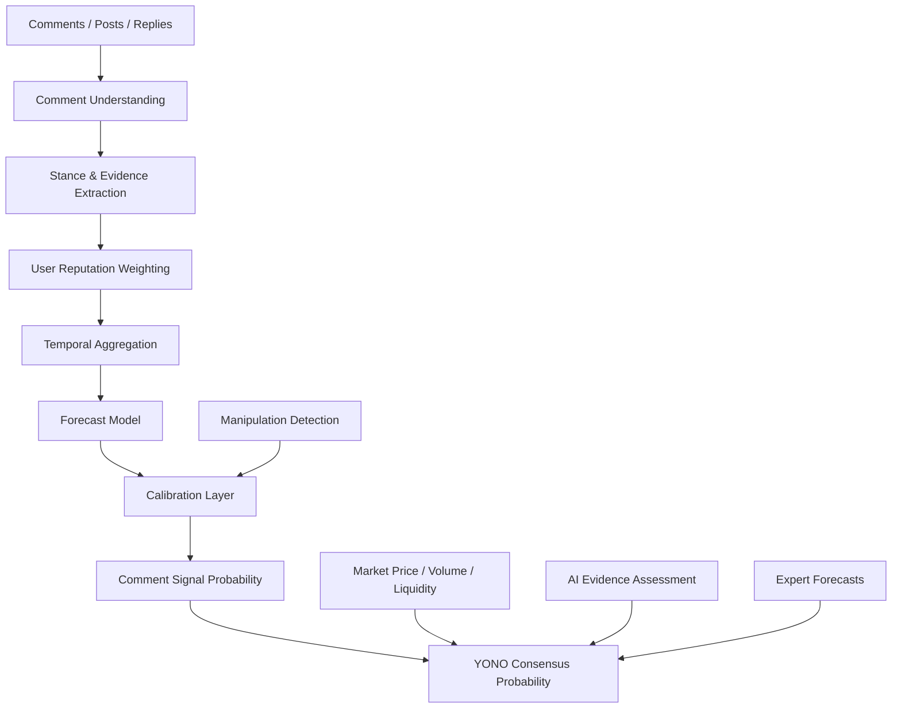
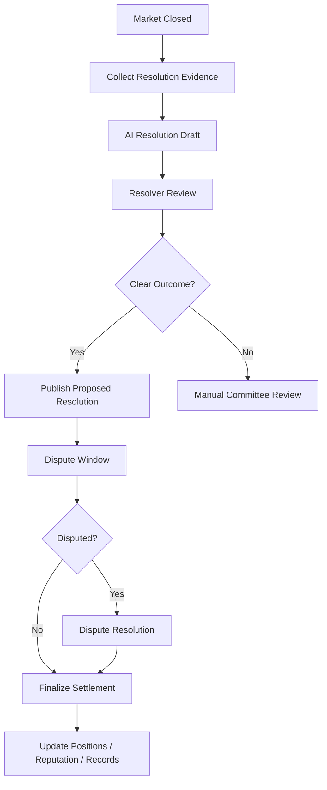
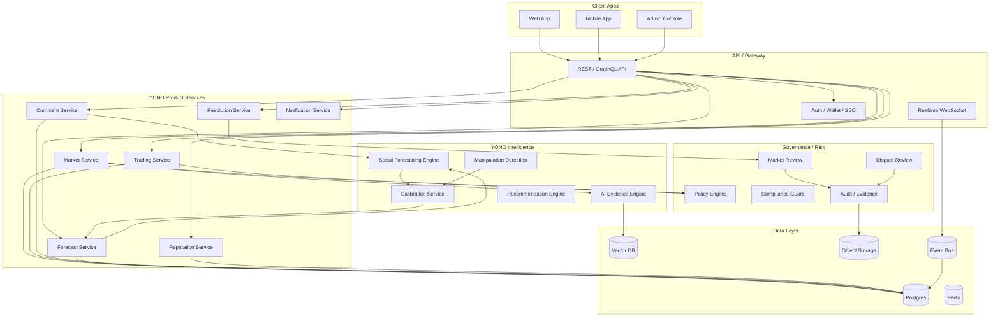

# YONO 业务详细设计文档

> **文档版本**：v1.0  
> **适用范围**：YONO Web3 社交预测市场业务设计、产品设计、模型设计、系统Architecture设计、运营治理设计  
> **定位**：面向 Web3、AI、科技、宏观vs事件型市场的社交预测vs概率共识平台  
> **核心principle**：预测可量化、证据可追溯、评论可建模、市场可交易、风险可治理、结果可复盘  

---

# 0. 一句话defines

**YONO is一个以“事件概率”为核心资产的社交预测市场平台。**

它不is单纯的信息流社区，也不is单纯的竞猜产品，而is把：

- user评论
- 社交信号
- 专家判断
- 市场交易价格
- AI 证据分析
- 历史预测table现
- 群体共识变化

统一转化为可解释、可交易、可校准的概率判断。

最终目标is回答：

> 某个未来事件发生的概率is多少？  
> 这个概率为什么变化？  
> 哪些人、哪些证据、哪些评论推动了这个变化？  
> 市场价格isno已via反映这些信息？  
> 当前共识isno被操纵、过热或低估？

---

# 1. 业务定位

## 1.1 YONO 不is普通预测市场

传统预测市场的核心is：

> user买 YES / NO，市场价格代table事件概率。

YONO 的核心is：

> 市场价格只is概率来源之一。社区评论、user信誉、证据质量、AI 分析和交易lines为共同形成 YONO Consensus Probability。

也就is说，YONO 不只关心“当前 YES 价格is多少”，还要回答：

- 为什么市场认为 YES is 60%？
- 评论区isnosupported这个价格？
- 高信誉userisno提前发现新信号？
- 当前价格isno被刷量、情绪或低流动性扭曲？
- AI 证据模型isnovs市场价格一致？
- isno存在值得下注的概率错配？

---

## 1.2 业务愿景

YONO 的长期愿景is成为：

> 面向未来事件的概率共识network。

它可以覆盖：

| 领域 | 示例 |
|---|---|
| Web3 | 项目isno发币、空投isno发生、协议isno上线、TVL isno达到某threshold |
| AI | 某模型isno发布、某 benchmark isno突破、某公司isno开源模型 |
| 科技 | 产品发布time、公司并购、监管事件 |
| 金融宏观 | 利率、ETF、股价区间、政策变化 |
| 体育娱乐 | 比赛结果、奖项、票房 |
| 社会议题 | 公开事件结果、投票、政策进展 |

第一阶段Recommendation聚焦 Web3，因为 Web3 user天然accepts市场化table达、预测、交易、钱包身份、链上声誉和事件投机。

---

# 2. 核心user

## 2.1 userclass型

| userclass型 | 主要诉求 | YONO 提供的价值 |
|---|---|---|
| 普通预测user | 想判断事件概率、参vs讨论、下注 | 市场、评论、AI 分析、概率解释 |
| 高信誉预测者 | 想建立声誉、输出观点、获得收益 | Reputation、Forecast Track Record、收益分成 |
| Web3 项目研究者 | 想发现早期信号 | 评论信号、链上信号、市场错配 |
| KOL / 分析师 | 想传播观点并验证准确率 | 可量化预测record、社区Impact力 |
| 流动性提供者 | 想赚交易费、做市场 | 市场热度、风险评分、流动性激励 |
| 项目方 | 想了解社区预期 | 社区信号、争议监控、叙事变化 |
| 机构/研究团队 | 想做事件驱动研究 | API、data面板、历史样本、概率序列 |

---

## 2.2 核心user路径

### 路径 A：普通user参vs预测

1. 浏览热门市场
2. 查看 YES / NO 当前价格
3. 阅读 AI 证据摘要
4. 阅读社区评论和高信誉user观点
5. 买入 YES 或 NO
6. 关注概率变化
7. 事件结算后获得收益或损失
8. user预测table现进入 reputation 系统

### 路径 B：研究型user寻找机会

1. 进入市场发现页
2. 按“市场价格 vs 社区信号偏差”排序
3. 找到低流动性但高证据信号市场
4. 阅读 evidence-backed comments
5. 查看 AI Probability vs Comment Probability
6. 判断isno存在 mispricing
7. 下注或发布分析
8. 后续复盘准确率

### 路径 C：KOL 建立Impact力

1. 对某市场发table带概率观点
2. 评论被结构化为 stance/evidence/signal
3. 观点被纳入 Community Signal
4. 如果结果正确，增加 calibration/reputation
5. 高信誉评论获得更高排序和权重
6. 可形成“预测者主页”和“历史命中率”

---

# 3. 核心业务对象

## 3.1 Market

Market is YONO 的核心交易vs讨论对象。

```ts
type YonoMarket = {
  marketId: string
  title: string
  description: string
  category: "web3" | "ai" | "macro" | "sports" | "tech" | "social" | "custom"

  outcomeType: "binary" | "multi_choice" | "scalar"
  outcomes: YonoOutcome[]

  openAt: string
  closeAt: string
  resolutionDeadline: string

  status:
    | "draft"
    | "pending_review"
    | "open"
    | "paused"
    | "closed"
    | "resolving"
    | "resolved"
    | "disputed"
    | "cancelled"

  creatorId: string
  resolverPolicyId: string
  oraclePolicyId?: string

  liquidity: {
    totalLiquidityUsd: number
    volume24hUsd: number
    volumeTotalUsd: number
  }

  probability: {
    marketProbability: number
    yonoConsensusProbability?: number
    aiEvidenceProbability?: number
    commentSignalProbability?: number
    expertProbability?: number
    updatedAt: string
  }

  risk: {
    manipulationRisk: "low" | "medium" | "high" | "critical"
    resolutionRisk: "low" | "medium" | "high"
    ambiguityRisk: "low" | "medium" | "high"
    regulatoryRisk: "low" | "medium" | "high"
  }

  tags: string[]
  createdAt: string
  updatedAt: string
}
```

---

## 3.2 Outcome

```ts
type YonoOutcome = {
  outcomeId: string
  marketId: string
  label: string
  type: "yes" | "no" | "choice" | "range"
  currentPrice: number
  impliedProbability: number
  liquidityUsd: number
}
```

---

## 3.3 Comment

Comment is YONO 区别于普通预测市场的关键data资产。

```ts
type YonoComment = {
  commentId: string
  marketId: string
  userId: string
  parentCommentId?: string

  text: string
  createdAt: string
  editedAt?: string
  deletedAt?: string

  engagement: {
    likes: number
    replies: number
    shares: number
    reports: number
  }

  source: "market_comment" | "post" | "reply" | "external_import"
  visibility: "public" | "limited" | "hidden"

  moderationStatus:
    | "visible"
    | "flagged"
    | "hidden"
    | "removed"
    | "under_review"
}
```

---

## 3.4 Forecast

user可以显式提交概率预测，而不只is买卖 YES/NO。

```ts
type UserForecast = {
  forecastId: string
  marketId: string
  userId: string

  probability: number
  outcomeId: string
  rationale?: string

  forecastType:
    | "explicit_probability"
    | "trade_implied"
    | "comment_inferred"

  createdAt: string
  updatedAt?: string

  settlement?: {
    finalOutcomeId: string
    brierScore: number
    logLoss: number
    isCorrectDirection: boolean
  }
}
```

---

## 3.5 User Reputation

```ts
type YonoUserReputation = {
  userId: string

  globalScore: number
  categoryScores: Record<string, number>

  calibration: {
    brierScoreAvg: number
    logLossAvg: number
    expectedCalibrationError: number
  }

  forecasting: {
    totalForecasts: number
    resolvedForecasts: number
    correctDirectionRate: number
    earlySignalScore: number
    marketOutperformanceScore: number
  }

  trust: {
    antiSpamScore: number
    manipulationRisk: number
    accountAgeScore: number
    identityStrength: number
  }

  updatedAt: string
}
```

---

# 4. 产品模块设计

## 4.1 首页 / Discovery

首页目标不is简单展示热门市场，而is帮助user发现“值得预测”的事件。

### 核心模块

| 模块 | Description |
|---|---|
| Trending Markets | 当前讨论和交易最热市场 |
| Probability Movers | 概率变化最大的市场 |
| Community Signal Divergence | 社区信号vs市场价格偏差最大的市场 |
| High Reputation Picks | 高信誉预测者集中看好的市场 |
| Evidence Emerging | 新证据快速出现的市场 |
| Manipulation Warning | 疑似刷量或异常交易市场 |
| Closing Soon | 即将截止的市场 |
| Newly Created | 新创建市场 |

### 推荐排序信号

```text
market_score =
  liquidity_score * 0.20
+ volume_growth_score * 0.15
+ comment_growth_score * 0.15
+ high_reputation_activity_score * 0.20
+ probability_movement_score * 0.10
+ evidence_novelty_score * 0.10
+ user_personal_relevance_score * 0.10
```

---

## 4.2 市场详情页

市场详情页is产品核心。

### 必须展示的信息

1. 市场标题和结算规则
2. YES / NO 当前价格
3. YONO Consensus Probability
4. Market Probability
5. Comment Signal Probability
6. AI Evidence Probability
7. 高信誉user倾向
8. 评论区
9. 证据time线
10. 交易入口
11. 风险提示
12. 结算vs争议规则

### 推荐布局

```text
┌──────────────────────────────────────────────┐
│ Market Title                                  │
│ Resolution Criteria                           │
├──────────────────────────────────────────────┤
│ YES Price | NO Price | Volume | Liquidity     │
├──────────────────────────────────────────────┤
│ YONO Consensus Probability                    │
│ - Market: 52%                                 │
│ - Comment Signal: 61%                         │
│ - AI Evidence: 58%                            │
│ - Expert: 64%                                 │
├──────────────────────────────────────────────┤
│ Probability Chart / Timeline                  │
├──────────────────────┬───────────────────────┤
│ Evidence Timeline    │ Community Signal       │
│ AI Summary           │ High-rep Comments      │
├──────────────────────┴───────────────────────┤
│ Comments / Forecasts / Trade Panel            │
└──────────────────────────────────────────────┘
```

---

## 4.3 评论区

评论区不is普通评论流，而is预测信号系统。

### 评论排序模式

| 模式 | Description |
|---|---|
| Top Evidence | 证据质量最高 |
| High Reputation | 高信誉user优先 |
| Newest | 最新评论 |
| Bullish | supported YES |
| Bearish | supported NO |
| Controversial | 分歧大 |
| Signal Moving | 对概率变化Impact最大 |

### 每条评论展示

```text
User A · Reputation 82 · Web3 Skill 91
Stance: YES · Evidence Quality: High · Manipulation Risk: Low

“官方 GitHub 昨天 merged 了 token-claim module，我认为 6 月前发币概率至少 70%。”

Extracted Claim:
- GitHub merged token-claim module

Impact:
- Increased Comment Signal +2.3%
```

---

## 4.4 创建市场

市场创建必须结构化，避免歧义。

### 创建table单字段

| 字段 | Description |
|---|---|
| title | 市场Issue |
| description | BackgroundDescription |
| category | 分class |
| outcome type | binary/multi/scalar |
| resolution criteria | 明确结算标准 |
| close time | 停止交易time |
| resolution source | 结算来源 |
| initial liquidity | 初始流动性 |
| tags | 标签 |
| risk disclosure | 风险Description |

### 市场创建审核

YONO 必须避免模糊、不可结算、违法或操纵性市场。

审核项：

- isno有明确结算标准
- isno有明确time窗口
- isno可由公开证据验证
- isno涉及敏感个人信息
- isno存在违法金融、赌博或受限内容风险
- isno可被项目方轻易操纵
- isnovs已有市场repeats
- isno存在歧义或多重解释

---

## 4.5 预测者主页

每个user都可以形成自己的预测档案。

### 展示内容

| 模块 | Description |
|---|---|
| Reputation Score | 综合声誉 |
| Category Skill | 分领域能力 |
| Calibration Curve | 概率校准曲线 |
| Historical Forecasts | 历史预测 |
| Early Signal Record | isnovia常早于市场 |
| ROI / PnL | 交易收益 |
| Community Impact | 评论对市场信号Impact |
| Manipulation Risk | 反操纵评分 |

---

# 5. 核心概率体系

## 5.1 Market Probability

Market Probability 来自交易价格。

```text
Market Probability ≈ YES Price
```

但需要调整：

- 流动性低时价格不稳定
- 大户可操纵
- 买卖价差过大时价格失真
- 临近结算时可能存在内幕信息
- AMM 曲线可能带来价格偏差

因此 Market Probability 不能directly等于真实概率，而is一个输入信号。

---

## 5.2 Comment Signal Probability

Comment Signal Probability 来自评论模型。

它不is“看多评论count / 总评论count”，而is加权后的社会信号。

核心输入：

- 评论立场
- 评论强度
- 证据质量
- user信誉
- user领域能力
- 评论新颖度
- 评论time衰减
- 反操纵权重
- 评论独立性

---

## 5.3 AI Evidence Probability

AI Evidence Probability 来自 AI 对公开证据的分析。

输入includes：

- 市场Description
- 结算规则
- 官方公告
- 新闻
- 链上data
- GitHub / Discord / X / Snapshot
- 历史class似案例
- 评论中抽取的 claims

输出：

```ts
type AiEvidenceAssessment = {
  marketId: string
  probability: number
  confidence: "low" | "medium" | "high"
  keyEvidence: string[]
  counterEvidence: string[]
  uncertainty: string[]
  citations: EvidenceRef[]
  updatedAt: string
}
```

---

## 5.4 Expert Probability

Expert Probability 来自高信誉user或authentication分析师。

不能简单平均，而应按历史table现加权。

```text
expert_probability =
  Σ(expert_probability_i × expert_weight_i) / Σ(expert_weight_i)
```

---

## 5.5 YONO Consensus Probability

最终概率is融合概率。

MVP 版本：

```text
YONO Consensus Probability =
  Market Probability * 0.40
+ AI Evidence Probability * 0.25
+ Comment Signal Probability * 0.20
+ Expert Probability * 0.10
+ Liquidity/Freshness Adjustment * 0.05
```

不同场景权重不同：

| 市场class型 | Market | Comment | AI Evidence | Expert |
|---|---:|---:|---:|---:|
| 高流动性市场 | 高 | 低 | 中 | 中 |
| 低流动性 Web3 市场 | 中 | 高 | 高 | 中 |
| 强证据市场 | 中 | 中 | 高 | 中 |
| KOL 驱动市场 | 中 | 高 | 中 | 高 |
| 容易操纵市场 | 降权 | 降权 | 升权 | 升权 |

生产版本应uses模型学习dynamically权重，而不is固定权重。

---

# 6. Social Forecasting Engine

## 6.1 defines

**Social Forecasting Engine** is YONO 的核心差异化能力。

它负责把评论、user、互动、社交图谱和市场Status转成概率预测。

### 核心任务

1. 理解评论
2. 判断立场
3. 提取证据
4. 判断证据质量
5. 判断user可信度
6. 聚合群体观点
7. 识别操纵
8. 输出概率
9. 校准概率
10. 解释概率变化

---

## 6.2 模型Architecture



---

## 6.3 Comment Understanding

输入：

```ts
type CommentInput = {
  commentId: string
  userId: string
  marketId: string
  text: string
  createdAt: string
  parentCommentId?: string
  likes: number
  replies: number
}
```

输出：

```ts
type CommentSignal = {
  commentId: string
  marketId: string
  userId: string

  stance: "YES" | "NO" | "NEUTRAL" | "UNCLEAR"
  stanceStrength: number
  confidence: number

  sentiment: "positive" | "negative" | "neutral"
  evidenceQuality: number
  noveltyScore: number
  manipulationRisk: number

  entities: string[]
  claims: string[]
  extractedEvidence: string[]

  createdAt: string
}
```

---

## 6.4 User Reputation Weighting

user权重Recommendation：

```text
user_weight =
  reputation_score * 0.30
+ category_skill * 0.25
+ calibration_score * 0.20
+ early_signal_score * 0.15
+ anti_manipulation_score * 0.10
```

### 指标解释

| 指标 | Description |
|---|---|
| reputation_score | user整体声誉 |
| category_skill | user在当前领域的能力 |
| calibration_score | user概率预测isno校准 |
| early_signal_score | isnovia常早于市场发现变化 |
| anti_manipulation_score | isno不像刷量、水军或操纵账号 |

---

## 6.5 Temporal Aggregation

按多个time窗口聚合：

- 1h
- 6h
- 24h
- 7d
- all

评论信号：

```text
comment_signal =
Σ(user_weight_i
  × stance_score_i
  × evidence_quality_i
  × confidence_i
  × novelty_score_i
  × time_decay_i
  × anti_spam_weight_i)
```

stance_score：

| stance | score |
|---|---:|
| YES | +1 |
| NO | -1 |
| NEUTRAL | 0 |
| UNCLEAR | 0 |

---

## 6.6 Manipulation Detection

评论预测天然容易被刷，因此必须内置反操纵模型。

### 检测信号

| 信号 | 风险 |
|---|---|
| 短time大量新账号同向评论 | 水军 |
| 评论文本高度相似 | 模板刷屏 |
| 低信誉账号集中点赞 | 虚假热度 |
| KOL 发帖前关联钱包建仓 | 潜在操纵 |
| 价格上涨后评论突然一致看多 | 追涨情绪 |
| 临近结算出现诱导性评论 | 结算操纵 |
| 多账号同设备/同 IP lines为 | 女巫攻击 |
| 评论vs交易address强相关 | 协同操纵 |

### 输出

```ts
type ManipulationAssessment = {
  marketId: string
  riskLevel: "low" | "medium" | "high" | "critical"
  reasons: string[]
  affectedSignals: string[]
  recommendedAction:
    | "none"
    | "downweight_comments"
    | "hide_suspicious_comments"
    | "pause_market"
    | "manual_review"
}
```

---

# 7. 交易系统设计

## 7.1 交易模式选择

YONO 可以分阶段实现。

### MVP

Recommendationuses中心化订单/积分/模拟交易或内部 ledger，不立即上链。

优点：

- 快速验证产品
- 降低合规和链上复杂度
- 易于风控
- 易于修复结算Issue

### 第二阶段

references入真实资金或链上结算。

optional模式：

| 模式 | 优点 | 风险 |
|---|---|---|
| 中心化 ledger | 快速、低成本 | 信任平台 |
| AMM | 流动性连续 | 价格曲线设计复杂 |
| Order Book | 价格发现好 | 需要流动性 |
| 链上合约 | 透明可验证 | 合规、Gas、攻击面 |
| 混合模式 | 兼顾体验和透明 | Architecture复杂 |

Recommendation路线：

```text
Phase 1: off-chain points / paper trading
Phase 2: custodial internal ledger
Phase 3: hybrid settlement
Phase 4: selected on-chain markets
```

---

## 7.2 订单对象

```ts
type YonoOrder = {
  orderId: string
  marketId: string
  outcomeId: string
  userId: string

  side: "buy" | "sell"
  orderType: "market" | "limit"
  quantity: number
  limitPrice?: number

  status:
    | "pending"
    | "accepted"
    | "partially_filled"
    | "filled"
    | "cancelled"
    | "rejected"
    | "expired"

  createdAt: string
  updatedAt: string
}
```

---

## 7.3 Position

```ts
type YonoPosition = {
  positionId: string
  marketId: string
  outcomeId: string
  userId: string

  quantity: number
  averagePrice: number
  currentPrice: number
  unrealizedPnl: number
  realizedPnl: number

  updatedAt: string
}
```

---

## 7.4 Trade

```ts
type YonoTrade = {
  tradeId: string
  marketId: string
  outcomeId: string

  buyerUserId: string
  sellerUserId?: string

  price: number
  quantity: number
  feeUsd: number

  createdAt: string
}
```

---

# 8. 结算系统设计

## 8.1 结算principle

每个市场必须在创建时defines清楚：

- 结算time
- 结算来源
- 结算标准
- 异常handle
- 争议窗口
- 取消条件

如果no法清晰结算，不应上线市场。

---

## 8.2 Resolution Policy

```ts
type ResolutionPolicy = {
  policyId: string
  marketId: string

  sourceType:
    | "official_announcement"
    | "onchain_event"
    | "api_data"
    | "manual_committee"
    | "hybrid"

  sourceRefs: string[]

  criteria: string
  evidenceRequired: string[]

  disputeWindowHours: number

  fallbackAction:
    | "manual_review"
    | "cancel_market"
    | "extend_resolution"
    | "use_committee_vote"
}
```

---

## 8.3 结算流程



---

## 8.4 争议系统

```ts
type MarketDispute = {
  disputeId: string
  marketId: string
  raisedBy: string

  reason:
    | "ambiguous_criteria"
    | "wrong_evidence"
    | "oracle_error"
    | "manipulation"
    | "other"

  evidenceRefs: string[]
  status:
    | "submitted"
    | "under_review"
    | "accepted"
    | "rejected"
    | "resolved"

  createdAt: string
  resolvedAt?: string
}
```

---

# 9. 风控vs治理

## 9.1 市场风险class型

| 风险 | Description | handle |
|---|---|---|
| Ambiguity Risk | 市场Issue不清晰 | 创建阶段拒绝或要求修改 |
| Resolution Risk | no法客观结算 | mandatory人工审核 |
| Manipulation Risk | 评论/交易异常 | 降权、冻结、人工复核 |
| Insider Risk | 事件方可控制结果 | 标记高风险 |
| Regulatory Risk | 涉及监管敏感 | 禁止或限制 |
| Liquidity Risk | 价格易被操纵 | 显示风险、限制仓位 |
| Oracle Risk | data源不可靠 | 多源校验 |
| User Harm Risk | 可能诱导高风险lines为 | 限额、提示、冷静期 |

---

## 9.2 市场审核规则

市场创建进入审核队列：

```text
Market Draft
→ Automated Screening
→ Risk Classification
→ Human Review if needed
→ Open / Rejected / Needs Revision
```

自动审核检查：

- isnocontains非法内容
- isno涉及个人隐私
- isno有清晰time边界
- isno有明确 outcome
- isno有客观证据来源
- isnovs已有市场repeats
- isno可能被单方操纵
- isnobelongs to受限金融市场

---

## 9.3 user风控

| 风控项 | Description |
|---|---|
| KYC / identity tier | 分层authentication |
| deposit limit | 入金限制 |
| position limit | 仓位限制 |
| market creation limit | 创建市场限制 |
| suspicious behavior | 异常lines为检测 |
| collusion detection | 协同lines为检测 |
| rate limit | 评论、交易、创建限速 |
| account reputation | 声誉Impactpermission |

---

## 9.4 交易风控

- 单市场最大仓位
- 单user最大亏损
- 低流动性市场大单滑点提示
- 异常价格波动暂停
- 高频刷单限制
- 自成交检测
- KOL 发帖vs交易关联检测
- 市场创建者交易限制
- 事件相关方交易限制

---

# 10. 内容治理

## 10.1 评论治理

评论区必须治理：

- spam
- harassment
- misinformation
- market manipulation
- illegal promotion
- personal data leakage
- coordinated campaigns

### 评论Status机

```text
visible
→ flagged
→ under_review
→ hidden
→ removed
```

---

## 10.2 AI 辅助治理

AI 可used for：

- 检测违规评论
- 提取 claims
- 识别反讽/诱导
- 判断证据质量
- 检测repeats模板
- 识别市场操纵叙事
- 生成审核Recommendation

但最终对高风险内容应有人工复核。

---

# 11. datavs模型训练

## 11.1 data来源

| data | 用途 |
|---|---|
| 历史市场 | 训练 outcome prediction |
| 评论 | 训练 stance/evidence |
| user预测record | 训练 reputation |
| 交易lines为 | 训练 market signal |
| 结算结果 | 标签 |
| 争议record | 风险模型 |
| 举报record | 内容治理 |
| 链上data | Web3 证据 |
| 外部新闻/公告 | AI evidence |

---

## 11.2 样本构造

按市场time切快照：

```text
T-30d
T-14d
T-7d
T-3d
T-24h
T-4h
T-1h
```

每个快照形成训练样本：

```ts
type ForecastTrainingSample = {
  marketId: string
  snapshotTime: string

  commentFeatures: Record<string, number>
  userReputationFeatures: Record<string, number>
  socialGraphFeatures: Record<string, number>
  marketFeatures: Record<string, number>
  evidenceFeatures: Record<string, number>

  finalOutcome: 0 | 1
}
```

---

## 11.3 MVP 模型

第一版推荐：

```text
LLM / 小模型评论结构化
+ LightGBM / XGBoost 概率预测
+ Isotonic Regression 概率校准
+ 规则型反操纵检测
```

优点：

- 可解释
- 训练快
- data要求低
- 便于调试
- 便于上线

---

## 11.4 生产模型

成熟版本：

```text
Comment Encoder
+ User Reputation Model
+ Social Graph Model
+ Temporal Model
+ Forecast Head
+ Calibration Head
+ Manipulation Detection Head
```

### 子模型

| 模型 | 作用 |
|---|---|
| Comment Understanding Model | 评论理解 |
| Stance Extraction Model | YES/NO/Neutral |
| Evidence Quality Model | 判断证据质量 |
| Reputation Model | user可信度 |
| Graph Model | user关系/操纵团伙 |
| Temporal Model | time序列趋势 |
| Forecast Model | 输出概率 |
| Calibration Model | 概率校准 |
| Manipulation Model | 反操纵 |

---

## 11.5 评价指标

| 指标 | Description |
|---|---|
| Brier Score | 概率预测质量 |
| Log Loss | 高置信错误惩罚 |
| ECE | 概率校准误差 |
| AUC | 区分 YES/NO |
| CLV | isno优于市场价格 |
| Market Outperformance | isnoexceeds过基准市场价格 |
| Early Signal Score | isno提前发现趋势 |
| Manipulation Robustness | 抗操纵能力 |
| Category Performance | 分领域table现 |
| Resolver Accuracy | 结算准确性 |
| Dispute Rate | 市场争议率 |

---

# 12. 系统Architecture

## 12.1 总体Architecture



---

## 12.2 vs Automatic Agent Platform 的关系

YONO 可以作为 Automatic Agent Platform 的一个业务域，但不Recommendation一开始深度耦合核心 runtime。

Recommendation采用：

```text
YONO Product Domain
→ uses平台的 IAM / Policy / Event / Evidence / Observability
→ uses Agent Runtime 做 AI Evidence、Social Forecast、Resolution Assist
→ 交易、市场、评论、结算保留为业务域服务
```

### 对应关系

| YONO 模块 | Automatic Agent Platform 可复用能力 |
|---|---|
| Market Review | Policy Engine / HITL |
| AI Evidence | Model Gateway / Harness |
| Social Forecast | Domain Agent / Evaluation |
| Resolution Assist | Evidence Chain / HITL |
| Comment Moderation | Guardrails / Risk Control |
| Manipulation Detection | Ops / Drift / Alerting |
| Audit | State-Evidence / Event Bus |
| Notifications | Channel Gateway |
| Admin Review | Dashboard / Approval |

---

## 12.3 推荐目录

```text
src/domains/yono/
  market/
    market-service.ts
    market-model.ts
    market-review-service.ts

  trading/
    order-service.ts
    position-service.ts
    trade-service.ts
    ledger-service.ts

  comments/
    comment-service.ts
    comment-signal-service.ts
    moderation-service.ts

  forecasting/
    social-forecasting-engine.ts
    forecast-feature-service.ts
    probability-calibration-service.ts
    consensus-probability-service.ts

  reputation/
    user-reputation-service.ts
    calibration-score-service.ts
    early-signal-score-service.ts

  resolution/
    resolution-policy-service.ts
    resolution-assist-agent.ts
    dispute-service.ts
    settlement-service.ts

  risk/
    manipulation-detection-service.ts
    market-risk-service.ts
    trading-risk-service.ts

  api/
    yono-market-routes.ts
    yono-trading-routes.ts
    yono-comment-routes.ts
    yono-forecast-routes.ts

  schemas/
    market.schema.ts
    comment.schema.ts
    forecast.schema.ts
    trade.schema.ts
    resolution.schema.ts

  events/
    yono-events.ts
    yono-event-handlers.ts
```

---

# 13. Agent 设计

## 13.1 YONO 应该有哪些 Agent

| Agent | 职责 |
|---|---|
| Market Review Agent | 审核市场isno可上线 |
| Social Forecast Agent | 从评论和userlines为生成概率 |
| Evidence Research Agent | 搜集和总结外部证据 |
| Manipulation Detection Agent | 检测刷量、协同操纵 |
| Resolution Assist Agent | 帮助结算市场 |
| Dispute Review Agent | 辅助争议handle |
| Reputation Audit Agent | 分析user信誉和异常lines为 |
| Notification Agent | 生成user提醒 |
| Recommendation Agent | 推荐市场和评论 |

---

## 13.2 Social Forecast Agent

输入：

```ts
type SocialForecastInput = {
  marketId: string
  snapshotTime: string
  timeWindow: "1h" | "6h" | "24h" | "7d" | "all"
}
```

输出：

```ts
type SocialForecastOutput = {
  marketId: string

  commentSignalProbability: number
  weightedYesSignal: number
  weightedNoSignal: number

  highReputationYesRatio: number
  highReputationNoRatio: number
  evidenceBackedCommentRatio: number

  manipulationRisk: "low" | "medium" | "high" | "critical"
  trend: "bullish" | "bearish" | "mixed" | "neutral"

  confidence: "low" | "medium" | "high"
  explanation: string
  evidenceRefs: string[]
}
```

---

## 13.3 Market Review Agent

检查：

- 市场isno可结算
- outcome isno清晰
- isno有明确截止time
- isno存在合规风险
- isno可能诱导操纵
- isnorepeats
- isno需要人工审批

输出：

```ts
type MarketReviewResult = {
  marketId: string
  decision: "approve" | "reject" | "needs_revision" | "manual_review"
  riskLevel: "low" | "medium" | "high" | "critical"
  issues: string[]
  requiredChanges: string[]
}
```

---

## 13.4 Resolution Assist Agent

输入：

- 市场规则
- 证据来源
- 评论争议
- 外部data
- oracle data

输出：

```ts
type ResolutionDraft = {
  marketId: string
  proposedOutcomeId: string
  confidence: number
  evidenceRefs: string[]
  reasoningSummary: string
  ambiguityFlags: string[]
  requiresHumanReview: boolean
}
```

---

# 14. 事件体系

YONO 应is事件驱动系统。

## 14.1 核心事件

```ts
type YonoEventType =
  | "yono.market.created"
  | "yono.market.review_requested"
  | "yono.market.approved"
  | "yono.market.opened"
  | "yono.market.paused"
  | "yono.market.closed"
  | "yono.market.resolution_proposed"
  | "yono.market.resolved"
  | "yono.market.disputed"
  | "yono.comment.created"
  | "yono.comment.signal_extracted"
  | "yono.forecast.submitted"
  | "yono.order.created"
  | "yono.trade.executed"
  | "yono.position.updated"
  | "yono.reputation.updated"
  | "yono.manipulation.detected"
  | "yono.consensus_probability.updated"
```

---

## 14.2 Event Envelope

```ts
type YonoEventEnvelope<T> = {
  eventId: string
  eventType: YonoEventType
  schemaVersion: string

  tenantId: string
  marketId?: string
  userId?: string

  correlationId: string
  causationId?: string
  idempotencyKey?: string

  payload: T
  payloadHash: string

  createdAt: string
}
```

---

# 15. API 设计

## 15.1 Market API

```http
POST /api/v1/yono/markets
GET  /api/v1/yono/markets
GET  /api/v1/yono/markets/:marketId
POST /api/v1/yono/markets/:marketId/review
POST /api/v1/yono/markets/:marketId/open
POST /api/v1/yono/markets/:marketId/pause
POST /api/v1/yono/markets/:marketId/close
POST /api/v1/yono/markets/:marketId/resolve
```

---

## 15.2 Comment API

```http
POST /api/v1/yono/markets/:marketId/comments
GET  /api/v1/yono/markets/:marketId/comments
POST /api/v1/yono/comments/:commentId/react
POST /api/v1/yono/comments/:commentId/report
GET  /api/v1/yono/comments/:commentId/signals
```

---

## 15.3 Forecast API

```http
POST /api/v1/yono/markets/:marketId/forecasts
GET  /api/v1/yono/markets/:marketId/forecasts
GET  /api/v1/yono/markets/:marketId/consensus
GET  /api/v1/yono/users/:userId/forecast-record
```

---

## 15.4 Trading API

```http
POST /api/v1/yono/orders
GET  /api/v1/yono/orders
POST /api/v1/yono/orders/:orderId/cancel
GET  /api/v1/yono/positions
GET  /api/v1/yono/trades
```

---

## 15.5 Resolution API

```http
POST /api/v1/yono/markets/:marketId/resolution-draft
POST /api/v1/yono/markets/:marketId/disputes
GET  /api/v1/yono/markets/:marketId/disputes
POST /api/v1/yono/disputes/:disputeId/decision
```

---

# 16. data库table设计

## 16.1 markets

```sql
CREATE TABLE yono_markets (
  market_id TEXT PRIMARY KEY,
  tenant_id TEXT NOT NULL,
  title TEXT NOT NULL,
  description TEXT NOT NULL,
  category TEXT NOT NULL,
  outcome_type TEXT NOT NULL,
  status TEXT NOT NULL,
  creator_id TEXT NOT NULL,
  close_at TIMESTAMPTZ NOT NULL,
  resolution_deadline TIMESTAMPTZ NOT NULL,
  resolver_policy_id TEXT NOT NULL,
  market_probability NUMERIC,
  yono_consensus_probability NUMERIC,
  comment_signal_probability NUMERIC,
  ai_evidence_probability NUMERIC,
  expert_probability NUMERIC,
  risk_json JSONB NOT NULL,
  tags_json JSONB NOT NULL,
  created_at TIMESTAMPTZ NOT NULL,
  updated_at TIMESTAMPTZ NOT NULL
);
```

---

## 16.2 comments

```sql
CREATE TABLE yono_comments (
  comment_id TEXT PRIMARY KEY,
  tenant_id TEXT NOT NULL,
  market_id TEXT NOT NULL,
  user_id TEXT NOT NULL,
  parent_comment_id TEXT,
  text TEXT NOT NULL,
  moderation_status TEXT NOT NULL,
  engagement_json JSONB NOT NULL,
  created_at TIMESTAMPTZ NOT NULL,
  edited_at TIMESTAMPTZ,
  deleted_at TIMESTAMPTZ
);
```

---

## 16.3 comment_signals

```sql
CREATE TABLE yono_comment_signals (
  signal_id TEXT PRIMARY KEY,
  comment_id TEXT NOT NULL,
  market_id TEXT NOT NULL,
  user_id TEXT NOT NULL,
  stance TEXT NOT NULL,
  stance_strength NUMERIC NOT NULL,
  confidence NUMERIC NOT NULL,
  sentiment TEXT NOT NULL,
  evidence_quality NUMERIC NOT NULL,
  novelty_score NUMERIC NOT NULL,
  manipulation_risk NUMERIC NOT NULL,
  claims_json JSONB NOT NULL,
  evidence_json JSONB NOT NULL,
  created_at TIMESTAMPTZ NOT NULL
);
```

---

## 16.4 forecasts

```sql
CREATE TABLE yono_forecasts (
  forecast_id TEXT PRIMARY KEY,
  tenant_id TEXT NOT NULL,
  market_id TEXT NOT NULL,
  outcome_id TEXT NOT NULL,
  user_id TEXT NOT NULL,
  probability NUMERIC NOT NULL,
  forecast_type TEXT NOT NULL,
  rationale TEXT,
  created_at TIMESTAMPTZ NOT NULL,
  updated_at TIMESTAMPTZ
);
```

---

## 16.5 orders

```sql
CREATE TABLE yono_orders (
  order_id TEXT PRIMARY KEY,
  tenant_id TEXT NOT NULL,
  market_id TEXT NOT NULL,
  outcome_id TEXT NOT NULL,
  user_id TEXT NOT NULL,
  side TEXT NOT NULL,
  order_type TEXT NOT NULL,
  quantity NUMERIC NOT NULL,
  limit_price NUMERIC,
  status TEXT NOT NULL,
  created_at TIMESTAMPTZ NOT NULL,
  updated_at TIMESTAMPTZ NOT NULL
);
```

---

## 16.6 trades

```sql
CREATE TABLE yono_trades (
  trade_id TEXT PRIMARY KEY,
  tenant_id TEXT NOT NULL,
  market_id TEXT NOT NULL,
  outcome_id TEXT NOT NULL,
  buyer_user_id TEXT NOT NULL,
  seller_user_id TEXT,
  price NUMERIC NOT NULL,
  quantity NUMERIC NOT NULL,
  fee_usd NUMERIC NOT NULL,
  created_at TIMESTAMPTZ NOT NULL
);
```

---

## 16.7 reputation

```sql
CREATE TABLE yono_user_reputation (
  user_id TEXT PRIMARY KEY,
  global_score NUMERIC NOT NULL,
  category_scores_json JSONB NOT NULL,
  calibration_json JSONB NOT NULL,
  forecasting_json JSONB NOT NULL,
  trust_json JSONB NOT NULL,
  updated_at TIMESTAMPTZ NOT NULL
);
```

---

# 17. 运营设计

## 17.1 冷启动策略

YONO 冷启动最大的难点is：

- 没有足够市场
- 没有足够评论
- 没有足够流动性
- 没有足够历史信誉

Recommendation分阶段：

### 阶段 1：精选市场

由官方创建高质量市场：

- Web3 发币
- 空投
- 项目路线图
- AI 模型发布
- encryption监管事件

### 阶段 2：邀请高质量预测者

邀请：

- Web3 研究员
- KOL
- 社区活跃user
- data分析师
- Alpha 群成员

### 阶段 3：积分预测

先不用真钱，uses：

- points
- reputation
- leaderboard
- badges
- rewards

### 阶段 4：references入交易激励

- LP 激励
- 预测大赛
- 高质量评论奖励
- 正确早期预测奖励

---

## 17.2 增长机制

| 机制 | Description |
|---|---|
| Shareable Market Card | 分享市场概率卡片 |
| Prediction Badge | user预测徽章 |
| Leaderboard | 预测排lines榜 |
| Streak | 连续准确预测 |
| Market Creator Reward | 优质市场创建奖励 |
| Evidence Reward | 高质量证据评论奖励 |
| Referral | 邀请奖励 |
| KOL Page | KOL 预测主页 |

---

## 17.3 推荐机制

推荐维度：

- user关注领域
- user历史预测
- 市场热度
- 价格变化
- 评论信号变化
- 高信誉user参vs
- 临近结算
- 争议程度
- 潜在 mispricing

---

# 18. 商业模式

## 18.1 收入来源

| 收入 | Description |
|---|---|
| Trading Fee | 交易手续费 |
| Market Creation Fee | 创建市场费用 |
| Liquidity Fee Share | 流动性费用分成 |
| Premium Analytics | 高级分析订阅 |
| API Access | data API 收费 |
| KOL Tools | KOL 专业工具 |
| Enterprise Dashboard | 企业/项目方情报面板 |
| Sponsored Market | 合规赞助市场 |
| Data Products | 历史预测data集 |

---

## 18.2 最优先商业化路径

Recommendation优先级：

1. 高级分析订阅
2. 交易手续费
3. API data服务
4. 企业情报面板
5. 市场创建服务
6. 流动性服务

原因：

- 预测市场本身存在合规复杂度
- data和分析产品更容易先商业化
- 社区信号模型可以成为独立卖点
- Web3 项目方愿意为市场情绪和社区预测付费

---

# 19. 合规风险

YONO 最大风险之一is合规。

## 19.1 必须关注的Issue

- isno构成赌博
- isno构成金融衍生品
- isno涉及证券
- isno允许真实资金交易
- isnosupported美国/中国/欧盟user
- isno需要 KYC
- isno需要地域限制
- isno涉及未成年人
- isno涉及政治/选举/体育博彩
- isno涉及内幕信息

## 19.2 推荐策略

第一阶段Recommendation：

- 不做真钱交易
- uses积分或声誉
- 不supported提现
- 不做高风险金融产品
- 不做政治敏感市场
- 市场创建走审核
- 加强免责声明
- 地域限制预留
- 结算争议机制完善

---

# 20. MVP 范围

## 20.1 MVP 必须有

| 模块 | isno必须 |
|---|---|
| 市场创建 | 必须 |
| 市场审核 | 必须 |
| 市场详情页 | 必须 |
| 评论系统 | 必须 |
| 评论结构化 | 必须 |
| user显式预测 | 必须 |
| 基础 reputation | 必须 |
| YONO Consensus Probability | 必须 |
| AI Evidence Summary | Recommendation必须 |
| 结算系统 | 必须 |
| 争议系统 | 简化版必须 |
| 积分交易 | Recommendation必须 |
| 真实资金交易 | 不Recommendation MVP |
| 反操纵检测 | 简化版必须 |
| manage后台 | 必须 |

---

## 20.2 MVP 不做

- 不做复杂链上合约
- 不做真实资金提现
- 不做跨链交易
- 不做高频交易
- 不做复杂 AMM
- 不做全自动结算
- 不做完全开放市场创建
- 不做高风险金融class市场

---

## 20.3 MVP 里程碑

### M1：基础市场vs评论

- Market CRUD
- Comment CRUD
- user预测
- 市场详情页
- 后台审核

### M2：评论信号模型

- stance extraction
- evidence quality
- comment signal probability
- high reputation weighting

### M3：结算vs reputation

- market resolution
- dispute workflow
- user reputation update
- calibration score

### M4：积分交易

- order/position/trade
- paper trading
- leaderboard

### M5：AI Evidence vs操纵检测

- evidence assistant
- manipulation risk
- probability fusion

---

# 21. 关键指标

## 21.1 产品指标

| 指标 | Description |
|---|---|
| DAU / WAU | 活跃user |
| Market Views | 市场浏览 |
| Comment Rate | 评论率 |
| Forecast Rate | 预测率 |
| Trade Conversion | 浏览到交易转化 |
| Retention | 留存 |
| Share Rate | 分享率 |
| Creator Rate | 创建市场user比例 |

---

## 21.2 预测质量指标

| 指标 | Description |
|---|---|
| Brier Score | 概率质量 |
| Log Loss | 高置信错误 |
| Calibration Error | 校准 |
| Market Outperformance | isno优于市场价格 |
| Early Signal Score | 早期信号能力 |
| Evidence Hit Rate | 证据命中 |
| Comment Signal Lift | 评论信号贡献 |

---

## 21.3 市场健康指标

| 指标 | Description |
|---|---|
| Liquidity | 流动性 |
| Volume | 交易量 |
| Spread | 买卖价差 |
| Dispute Rate | 争议率 |
| Manipulation Risk | 操纵风险 |
| Resolution Delay | 结算delay |
| User Concentration | user集中度 |
| Market Creator Quality | 市场创建质量 |

---

# 22. 风险清单

| 风险 | 严重度 | Description | 缓解 |
|---|---|---|---|
| 合规风险 | P0 | 真实资金预测市场可能触发监管 | MVP 用积分，限制地区，法律审查 |
| 市场歧义 | P0 | no法结算导致信任损失 | 创建审核，结算规则模板 |
| 评论操纵 | P0 | 刷量Impact概率 | 反操纵模型，降权 |
| 低流动性操纵 | P0 | 少数交易Impact价格 | 流动性提示，限仓 |
| 结算争议 | P1 | user不认可结果 | 争议窗口，证据链 |
| 模型过度自信 | P1 | 错误概率误导user | 概率校准，置信度展示 |
| KOL 操纵 | P1 | KOL 带单 | 交易披露，异常检测 |
| data污染 | P1 | 评论训练集被污染 | data隔离，操纵标签 |
| 冷启动 | P1 | no市场nouser | 官方精选市场，邀请制 |
| 声誉作弊 | P2 | 小号刷 reputation | 身份/lines为/图谱检测 |

---

# 23. 推荐开发优先级

## 23.1 第一优先级

1. Market Service
2. Comment Service
3. Forecast Service
4. Resolution Service
5. Admin Review Console
6. Social Forecasting Engine MVP
7. User Reputation MVP
8. Event/Audit 基础设施

## 23.2 第二优先级

1. Paper Trading
2. Position/Order/Trade
3. Leaderboard
4. AI Evidence Engine
5. Manipulation Detection
6. Notification
7. Recommendation

## 23.3 第三优先级

1. API data产品
2. Enterprise Dashboard
3. 链上结算
4. 真实资金交易
5. 高级社交图谱模型
6. 多领域扩展

---

# 24. vs Mission Architecture的关系

如果 YONO 接入 Automatic Agent Platform，Recommendation：

- 一个 Market Review 可以is一个 Task
- 一个 Resolution Review 可以is一个 Task
- 一个 Social Forecasting run 可以is一个 HarnessRun
- 一个长期市场运营目标可以is一个 Mission
- 一个市场本身不is Mission
- 一个user会话不is Mission
- 一个交易不is Mission
- 一个评论handle不is Mission

### 示例 Mission

```ts
type MissionExample = {
  missionId: "mission_yono_web3_launch_q3"
  title: "Launch YONO Web3 Prediction Market MVP"
  objectives: [
    "Launch 100 high-quality Web3 markets",
    "Reach 10k registered users",
    "Achieve Brier score below baseline market-only model",
    "Keep dispute rate below 5%"
  ]
  scope: {
    domain: "yono"
    category: "web3"
  }
}
```

Mission 负责长期目标、budget、治理vs复盘，不参vs每条评论、每笔交易的实时执lines。

---

# 25. 最终Recommendation

YONO 最值得强化的不is“预测市场交易”本身，而is：

1. **社交信号预测能力**
2. **user信誉vs校准能力**
3. **AI 证据解释能力**
4. **市场价格vs社区共识的偏差发现**
5. **反操纵和结算治理能力**

如果只做交易，YONO 会变成普通预测市场。

如果把评论、声誉、证据、概率校准和市场价格融合起来，YONO 才会形成真正差异化：

> 一个可交易的社会共识概率references擎。

推荐第一版定位为：

**Web3 Social Prediction Intelligence Platform**

而不isdirectly定位为真钱预测交易所。

这样可以先用内容、预测、声誉、分析和积分市场建立network效应，再逐步进入更复杂的交易和结算体系。

---

# 26. v1.0 冻结Conclusion

YONO v1.0 Recommendation按以下principle冻结：

1. **先预测智能，后真钱交易。**
2. **先 Web3 垂直领域，后跨领域扩展。**
3. **先积分/声誉市场，后链上结算。**
4. **先评论信号模型，后复杂社交图模型。**
5. **先人工审核结算，后半自动结算。**
6. **所有市场必须有明确结算规则。**
7. **所有概率输出必须可解释、可校准、可复盘。**
8. **评论不能等权投票，必须按user信誉、证据质量和操纵风险加权。**
9. **YONO Consensus Probability 应融合市场价格、AI 证据、评论信号和专家预测。**
10. **YONO 应作为 Automatic Agent Platform 的业务域接入，而不is侵入核心 runtime。**

最终产品形态：

> **YONO = Prediction Market + Social Forecasting Engine + Reputation Network + AI Evidence Layer + Governance/Resolution System**

