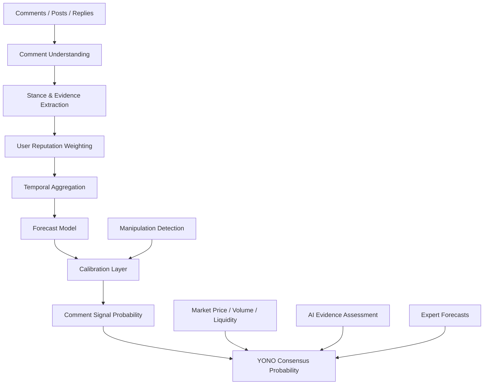
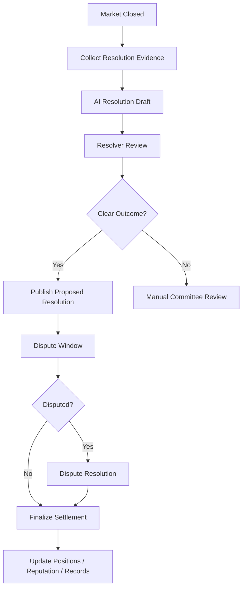
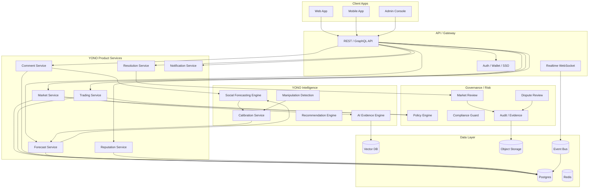

# YONO Business Detailed Design Document

> **Document version**: v1.0
> **Scope**: YONO Web3 social prediction market business design, product design, model design, system architecture design, operations and governance design
> **Positioning**: A social prediction and probability consensus platform for Web3, AI, technology, macro, and event-driven markets
> **Core principles**: Quantifiable prediction, traceable evidence, modelable commentary, tradable markets, governable risk, reviewable outcomes
> **Review and revision**: 2026-06-02, tightened against the current repository state into a "current minimum baseline + target contract / roadmap" dual-track document

---

# 0.0 Review and Revision Reading Rules

1. This document contains both the current repository's minimum runnable baseline and the YONO target architecture; unless explicitly marked as "current main baseline", default to reading it as a target contract and do not treat it as a factual statement of "the repository already implements this completely".
2. The current main baseline is determined by `src/domains/yono/index.ts`, `src/domains/yono/yono-model.ts`, and `src/platform/five-plane-interface/api/http-server/yono-routes.ts`.
3. `Recommended directory`, `Agent list`, `database tables`, `business model`, `compliance strategy`, and `metrics system` are by default design goals or roadmap items and do not represent that the corresponding services, persistence, reporting, or governance closed loops already exist in the repository.
4. If the current implementation differs from the target contract, the documentation wording should be corrected first and the target state should not be disguised as the current state; only when the repository has a minimum implementation should the item be listed under "current main baseline".

## 0.0.1 Current Main Baseline

The YONO minimum baseline already present in the current repository is as follows:

| Capability | Current Main Baseline |
|---|---|
| Data storage | `YonoRepository` stores market/comment/signal/forecast/order/trade/position/dispute/event based on an in-memory `Map` |
| Markets | Supports minimum lifecycle of create/list/get, `review/open/pause/close/resolve` |
| Comments | Supports creating comments, automatically extracting the minimum comment signal, and listing comments |
| Forecasting | Supports explicit probability forecasts `explicit_probability` |
| Consensus probability | Supports heuristic fusion based on market/comment/forecast |
| Review / Resolution | Supports minimum `MarketReviewAgent` and `ResolutionAssistAgent` |
| Trading | Supports minimum order create/cancel; real matching, position maintenance, and settlement ledger are not implemented |
| Disputes | Supports minimum baseline of dispute submit / list / decide |
| API | Exposes a minimum set of REST routes, but not the complete product API surface listed in the later chapters of this document |
| Platform integration | Domain definition, workflow, tool bundle, and minimum plugin binding are registered; a complete mission/task seed, admin console, and metrics/reporting closed loop have not yet formed |

## 0.0.2 Target Contract Boundary

- Object fields, formulas, models, and governance items in sections 3-11 are described according to the target contract; the current main baseline typically implements only a minimum subset of them.
- The system directory, event envelope, API surface, and database tables in sections 12-16 are recommended architecture, not a current repository inventory.
- Sections 17-25 are by default a roadmap, operations design, commercialization, and compliance recommendations, and should not be read as "already implemented and effective at runtime".

# 0. One-Sentence Definition

**YONO is a social prediction market platform with "event probability" as its core asset.**

It is neither a pure information feed community nor a pure guessing product, but a system that unifies:

- User comments
- Social signals
- Expert judgments
- Market trading prices
- AI evidence analysis
- Historical prediction performance
- Group consensus changes

into explainable, tradable, and calibratable probability judgments.

The end goal is to answer:

> What is the probability that a future event will occur?
> Why does this probability change?
> Which people, which evidence, and which comments drive this change?
> Has the market price already reflected this information?
> Is the current consensus manipulated, overheated, or underestimated?

---

# 1. Business Positioning

## 1.1 YONO Is Not an Ordinary Prediction Market

The core of a traditional prediction market is:

> Users buy YES / NO, and the market price represents the event probability.

The core of YONO is:

> Market price is only one source of probability. Community comments, user reputation, evidence quality, AI analysis, and trading behavior together form the YONO Consensus Probability.

In other words, YONO is not only concerned with "what is the current YES price", but also answers:

- Why does the market think YES is 60%?
- Does the comment section support this price?
- Did high-reputation users spot new signals early?
- Is the current price distorted by wash trading, sentiment, or low liquidity?
- Is the AI evidence model consistent with the market price?
- Is there a probability mismatch worth betting on?

---

## 1.2 Business Vision

YONO's long-term vision is to become:

> A probability consensus network for future events.

It can cover:

| Domain | Examples |
|---|---|
| Web3 | Whether a project launches a token, whether an airdrop happens, whether a protocol goes live, whether TVL reaches a certain threshold |
| AI | Whether a certain model is released, whether a benchmark is broken, whether a company open-sources a model |
| Technology | Product release dates, M&A, regulatory events |
| Financial macro | Interest rates, ETFs, stock price ranges, policy changes |
| Sports and entertainment | Match results, awards, box office |
| Social issues | Public event outcomes, votes, policy progress |

The first phase suggests focusing on Web3, because Web3 users naturally accept market expression, prediction, trading, wallet identity, on-chain reputation, and event speculation.

---

# 2. Core Users

## 2.1 User Types

| User Type | Main Need | Value Provided by YONO |
|---|---|---|
| Ordinary prediction user | Wants to judge event probability, discuss, and bet | Market, comments, AI analysis, probability explanation |
| High-reputation predictor | Wants to build reputation, output views, and earn income | Reputation, forecast track record, revenue share |
| Web3 project researcher | Wants to discover early signals | Comment signals, on-chain signals, market mispricing |
| KOL / analyst | Wants to spread views and verify accuracy | Quantifiable prediction records, community influence |
| Liquidity provider | Wants to earn trading fees and make markets | Market heat, risk score, liquidity incentives |
| Project party | Wants to understand community expectations | Community signals, dispute monitoring, narrative change |
| Institution / research team | Wants to do event-driven research | API, data panel, historical samples, probability series |

---

## 2.2 Core User Paths

### Path A: Ordinary User Participates in Prediction

1. Browse trending markets
2. View the current YES / NO prices
3. Read the AI evidence summary
4. Read community comments and high-reputation user views
5. Buy YES or NO
6. Watch the probability change
7. Earn or lose after event settlement
8. User prediction performance enters the reputation system

### Path B: Research-Oriented User Looks for Opportunities

1. Enter the market discovery page
2. Sort by "market price vs community signal deviation"
3. Find low-liquidity but high-evidence-signal markets
4. Read evidence-backed comments
5. View AI Probability and Comment Probability
6. Judge whether mispricing exists
7. Place a bet or publish an analysis
8. Review accuracy afterwards

### Path C: KOL Builds Influence

1. Post a probabilistic view on a market
2. The comment is structured into stance/evidence/signal
3. The view is incorporated into Community Signal
4. If the result is correct, calibration/reputation increases
5. High-reputation comments get higher ranking and weight
6. Can form a "predictor home page" and "historical hit rate"

---

# 3. Core Business Objects

> Review revision notes (2026-06-02)
> This chapter shows the superset of the object target contract. The current main baseline implements only the minimum schema and minimum population logic: some optional fields remain in the schema, but the create/update path may not write them; advanced objects such as `YonoUserReputation`, forecast settlement, and structured comment signal extension fields are still target design.

## 3.1 Market

Market is the core trading and discussion object of YONO.

```ts
type YonoMarket = {
  marketId: string
  title: string
  description: string
  category: "web3" | "ai" | "macro" | "sports" | "tech" | "social" | "custom"

  outcomeType: "binary" | "multi_choice" | "scalar"
  outcomes: YonoOutcome[]

  openAt: string
  closeAt: string
  resolutionDeadline: string

  status:
    | "draft"
    | "pending_review"
    | "open"
    | "paused"
    | "closed"
    | "resolving"
    | "resolved"
    | "disputed"
    | "cancelled"

  creatorId: string
  resolverPolicyId: string
  oraclePolicyId?: string

  liquidity: {
    totalLiquidityUsd: number
    volume24hUsd: number
    volumeTotalUsd: number
  }

  probability: {
    marketProbability: number
    yonoConsensusProbability?: number
    aiEvidenceProbability?: number
    commentSignalProbability?: number
    expertProbability?: number
    updatedAt: string
  }

  risk: {
    manipulationRisk: "low" | "medium" | "high" | "critical"
    resolutionRisk: "low" | "medium" | "high"
    ambiguityRisk: "low" | "medium" | "high"
    regulatoryRisk: "low" | "medium" | "high"
  }

  tags: string[]
  createdAt: string
  updatedAt: string
}
```

---

## 3.2 Outcome

```ts
type YonoOutcome = {
  outcomeId: string
  marketId: string
  label: string
  type: "yes" | "no" | "choice" | "range"
  currentPrice: number
  impliedProbability: number
  liquidityUsd: number
}
```

---

## 3.3 Comment

Comment is the key data asset that distinguishes YONO from ordinary prediction markets.

```ts
type YonoComment = {
  commentId: string
  marketId: string
  userId: string
  parentCommentId?: string

  text: string
  createdAt: string
  editedAt?: string
  deletedAt?: string

  engagement: {
    likes: number
    replies: number
    shares: number
    reports: number
  }

  source: "market_comment" | "post" | "reply" | "external_import"
  visibility: "public" | "limited" | "hidden"

  moderationStatus:
    | "visible"
    | "flagged"
    | "hidden"
    | "removed"
    | "under_review"
}
```

---

## 3.4 Forecast

Users can explicitly submit probability forecasts, not just buy/sell YES/NO.

```ts
type UserForecast = {
  forecastId: string
  marketId: string
  userId: string

  probability: number
  outcomeId: string
  rationale?: string

  forecastType:
    | "explicit_probability"
    | "trade_implied"
    | "comment_inferred"

  createdAt: string
  updatedAt?: string

  settlement?: {
    finalOutcomeId: string
    brierScore: number
    logLoss: number
    isCorrectDirection: boolean
  }
}
```

---

## 3.5 User Reputation

```ts
type YonoUserReputation = {
  userId: string

  globalScore: number
  categoryScores: Record<string, number>

  calibration: {
    brierScoreAvg: number
    logLossAvg: number
    expectedCalibrationError: number
  }

  forecasting: {
    totalForecasts: number
    resolvedForecasts: number
    correctDirectionRate: number
    earlySignalScore: number
    marketOutperformanceScore: number
  }

  trust: {
    antiSpamScore: number
    manipulationRisk: number
    accountAgeScore: number
    identityStrength: number
  }

  updatedAt: string
}
```

---

# 4. Product Module Design

## 4.1 Home / Discovery

The home page goal is not to simply show trending markets, but to help users discover events "worth predicting".

### Core Modules

| Module | Description |
|---|---|
| Trending Markets | The most actively discussed and traded markets right now |
| Probability Movers | The markets with the largest probability changes |
| Community Signal Divergence | Markets with the largest deviation between community signal and market price |
| High Reputation Picks | Markets where high-reputation predictors are concentrated |
| Evidence Emerging | Markets where new evidence is rapidly emerging |
| Manipulation Warning | Markets suspected of wash trading or abnormal trading |
| Closing Soon | Markets about to close |
| Newly Created | Newly created markets |

### Recommended Ranking Signals

```text
market_score =
  liquidity_score * 0.20
+ volume_growth_score * 0.15
+ comment_growth_score * 0.15
+ high_reputation_activity_score * 0.20
+ probability_movement_score * 0.10
+ evidence_novelty_score * 0.10
+ user_personal_relevance_score * 0.10
```

---

## 4.2 Market Detail Page

The market detail page is the core of the product.

### Information That Must Be Displayed

1. Market title and resolution rules
2. YES / NO current price
3. YONO Consensus Probability
4. Market Probability
5. Comment Signal Probability
6. AI Evidence Probability
7. High-reputation user tendency
8. Comment section
9. Evidence timeline
10. Trading entry
11. Risk warning
12. Resolution and dispute rules

### Recommended Layout

```text
+----------------------------------------------+
| Market Title                                  |
| Resolution Criteria                           |
+----------------------------------------------+
| YES Price | NO Price | Volume | Liquidity     |
+----------------------------------------------+
| YONO Consensus Probability                    |
| - Market: 52%                                 |
| - Comment Signal: 61%                         |
| - AI Evidence: 58%                            |
| - Expert: 64%                                 |
+----------------------------------------------+
| Probability Chart / Timeline                  |
+----------------------+-----------------------+
| Evidence Timeline    | Community Signal       |
| AI Summary           | High-rep Comments      |
+----------------------+-----------------------+
| Comments / Forecasts / Trade Panel            |
+----------------------------------------------+
```

---

## 4.3 Comment Section

The comment section is not an ordinary comment feed, but a prediction signal system.

### Comment Sort Modes

| Mode | Description |
|---|---|
| Top Evidence | Highest evidence quality |
| High Reputation | High-reputation users first |
| Newest | Latest comments |
| Bullish | Supporting YES |
| Bearish | Supporting NO |
| Controversial | High disagreement |
| Signal Moving | Greatest impact on probability change |

### Display Per Comment

```text
User A - Reputation 82 - Web3 Skill 91
Stance: YES - Evidence Quality: High - Manipulation Risk: Low

"The official GitHub merged the token-claim module yesterday, I think the probability of launching a token before June is at least 70%."

Extracted Claim:
- GitHub merged token-claim module

Impact:
- Increased Comment Signal +2.3%
```

---

## 4.4 Create Market

Market creation must be structured to avoid ambiguity.

### Create Form Fields

| Field | Description |
|---|---|
| title | Market question |
| description | Background description |
| category | Category |
| outcome type | binary/multi/scalar |
| resolution criteria | Clear resolution criteria |
| close time | Trading stop time |
| resolution source | Resolution source |
| initial liquidity | Initial liquidity |
| tags | Tags |
| risk disclosure | Risk description |

### Market Creation Review

YONO must avoid ambiguous, unresolvable, illegal, or manipulative markets.

Review items:

- Whether there is a clear resolution criterion
- Whether there is a clear time window
- Whether it can be verified by public evidence
- Whether it involves sensitive personal information
- Whether it carries illegal financial, gambling, or restricted content risk
- Whether it can be easily manipulated by the project party
- Whether it duplicates an existing market
- Whether it has ambiguity or multiple interpretations

---

## 4.5 Predictor Home Page

Every user can form their own prediction profile.

### Display Content

| Module | Description |
|---|---|
| Reputation Score | Overall reputation |
| Category Skill | Capability by domain |
| Calibration Curve | Probability calibration curve |
| Historical Forecasts | Historical predictions |
| Early Signal Record | Whether often ahead of the market |
| ROI / PnL | Trading returns |
| Community Impact | How much the comments affect market signal |
| Manipulation Risk | Anti-manipulation score |

---

# 5. Core Probability System

## 5.1 Market Probability

Market Probability comes from the trading price.

```text
Market Probability ≈ YES Price
```

But adjustments are needed:

- The price is unstable when liquidity is low
- Large holders can manipulate
- Prices are distorted when the bid-ask spread is too wide
- Insider information may exist near settlement
- AMM curves can introduce price bias

Therefore Market Probability cannot directly equal the true probability, but is an input signal.

---

## 5.2 Comment Signal Probability

Comment Signal Probability comes from the comment model.

It is not "number of bullish comments / total number of comments", but a weighted social signal.

Core inputs:

- Comment stance
- Comment strength
- Evidence quality
- User reputation
- User domain capability
- Comment novelty
- Comment time decay
- Anti-manipulation weight
- Comment independence

---

## 5.3 AI Evidence Probability

AI Evidence Probability comes from the AI's analysis of public evidence.

Inputs include:

- Market description
- Resolution rules
- Official announcements
- News
- On-chain data
- GitHub / Discord / X / Snapshot
- Historical similar cases
- Claims extracted from comments

Output:

```ts
type AiEvidenceAssessment = {
  marketId: string
  probability: number
  confidence: "low" | "medium" | "high"
  keyEvidence: string[]
  counterEvidence: string[]
  uncertainty: string[]
  citations: EvidenceRef[]
  updatedAt: string
}
```

---

## 5.4 Expert Probability

Expert Probability comes from high-reputation users or certified analysts.

It cannot be a simple average, but should be weighted by historical performance.

```text
expert_probability =
  Σ(expert_probability_i × expert_weight_i) / Σ(expert_weight_i)
```

---

## 5.5 YONO Consensus Probability

The final probability is the fused probability.

MVP version:

```text
YONO Consensus Probability =
  Market Probability * 0.40
+ AI Evidence Probability * 0.25
+ Comment Signal Probability * 0.20
+ Expert Probability * 0.10
+ Liquidity/Freshness Adjustment * 0.05
```

Different scenarios have different weights:

| Market Type | Market | Comment | AI Evidence | Expert |
|---|---:|---:|---:|---:|
| High-liquidity market | High | Low | Medium | Medium |
| Low-liquidity Web3 market | Medium | High | High | Medium |
| Strong-evidence market | Medium | Medium | High | Medium |
| KOL-driven market | Medium | High | Medium | High |
| Easily manipulated market | Down-weighted | Down-weighted | Up-weighted | Up-weighted |

The production version should use models to learn dynamic weights, not fixed weights.

---

# 6. Social Forecasting Engine

## 6.1 Definition

The **Social Forecasting Engine** is YONO's core differentiating capability.

It is responsible for converting comments, users, interactions, social graphs, and market state into probability forecasts.

### Core Tasks

1. Understand comments
2. Judge stance
3. Extract evidence
4. Judge evidence quality
5. Judge user credibility
6. Aggregate group views
7. Identify manipulation
8. Output probability
9. Calibrate probability
10. Explain probability change

---

## 6.2 Model Architecture


```mermaid
flowchart TD
  A[Comments / Posts / Replies] --> B[Comment Understanding]
  B --> C[Stance & Evidence Extraction]
  C --> D[User Reputation Weighting]
  D --> E[Temporal Aggregation]
  E --> F[Forecast Model]
  F --> G[Calibration Layer]
  G --> H[Comment Signal Probability]
  H --> I[YONO Consensus Probability]

  J[Market Price / Volume / Liquidity] --> I
  K[AI Evidence Assessment] --> I
  L[Expert Forecasts] --> I
  M[Manipulation Detection] --> G
```

---

## 6.3 Comment Understanding

Input:

```ts
type CommentInput = {
  commentId: string
  userId: string
  marketId: string
  text: string
  createdAt: string
  parentCommentId?: string
  likes: number
  replies: number
}
```

Output:

```ts
type CommentSignal = {
  commentId: string
  marketId: string
  userId: string

  stance: "YES" | "NO" | "NEUTRAL" | "UNCLEAR"
  stanceStrength: number
  confidence: number

  sentiment: "positive" | "negative" | "neutral"
  evidenceQuality: number
  noveltyScore: number
  manipulationRisk: number

  entities: string[]
  claims: string[]
  extractedEvidence: string[]

  createdAt: string
}
```

---

## 6.4 User Reputation Weighting

Recommended user weight:

```text
user_weight =
  reputation_score * 0.30
+ category_skill * 0.25
+ calibration_score * 0.20
+ early_signal_score * 0.15
+ anti_manipulation_score * 0.10
```

### Indicator Explanations

| Indicator | Description |
|---|---|
| reputation_score | User's overall reputation |
| category_skill | User's capability in the current domain |
| calibration_score | Whether the user's probability predictions are calibrated |
| early_signal_score | Whether they often spot changes ahead of the market |
| anti_manipulation_score | Whether they don't look like wash trading, bot, or manipulation accounts |

---

## 6.5 Temporal Aggregation

Aggregate over multiple time windows:

- 1h
- 6h
- 24h
- 7d
- all

Comment signal:

```text
comment_signal =
Σ(user_weight_i
  × stance_score_i
  × evidence_quality_i
  × confidence_i
  × novelty_score_i
  × time_decay_i
  × anti_spam_weight_i)
```

stance_score:

| stance | score |
|---|---:|
| YES | +1 |
| NO | -1 |
| NEUTRAL | 0 |
| UNCLEAR | 0 |

---

## 6.6 Manipulation Detection

Comment prediction is naturally susceptible to manipulation, so an anti-manipulation model must be built in.

### Detection Signals

| Signal | Risk |
|---|---|
| Many new accounts commenting in the same direction in a short time | Bot accounts |
| Highly similar comment text | Template spam |
| Concentrated likes from low-reputation accounts | Fake heat |
| KOL's associated wallet opens a position before posting | Potential manipulation |
| Comments suddenly turn unanimously bullish after the price rises | Trend-chasing sentiment |
| Inducing comments appear near settlement | Settlement manipulation |
| Multiple accounts from the same device / same IP | Sybil attack |
| Strong correlation between comment accounts and trade addresses | Coordinated manipulation |

### Output

```ts
type ManipulationAssessment = {
  marketId: string
  riskLevel: "low" | "medium" | "high" | "critical"
  reasons: string[]
  affectedSignals: string[]
  recommendedAction:
    | "none"
    | "downweight_comments"
    | "hide_suspicious_comments"
    | "pause_market"
    | "manual_review"
}
```

---

# 7. Trading System Design

## 7.1 Trading Mode Choice

YONO can be implemented in phases.

### MVP

Recommend using a centralized order / points / simulated trading or internal ledger, and not going on-chain immediately.

Advantages:

- Quickly validate the product
- Reduce compliance and on-chain complexity
- Easy to control risk
- Easy to fix settlement issues

### Second Phase

Introduce real funds or on-chain settlement.

Optional modes:

| Mode | Advantages | Risks |
|---|---|---|
| Centralized ledger | Fast, low cost | Trust the platform |
| AMM | Continuous liquidity | Price curve design is complex |
| Order Book | Good price discovery | Needs liquidity |
| On-chain contract | Transparent and verifiable | Compliance, Gas, attack surface |
| Hybrid mode | Balances experience and transparency | Architecture is complex |

Recommended roadmap:

```text
Phase 1: off-chain points / paper trading
Phase 2: custodial internal ledger
Phase 3: hybrid settlement
Phase 4: selected on-chain markets
```

---

## 7.2 Order Object

```ts
type YonoOrder = {
  orderId: string
  marketId: string
  outcomeId: string
  userId: string

  side: "buy" | "sell"
  orderType: "market" | "limit"
  quantity: number
  limitPrice?: number

  status:
    | "pending"
    | "accepted"
    | "partially_filled"
    | "filled"
    | "cancelled"
    | "rejected"
    | "expired"

  createdAt: string
  updatedAt: string
}
```

---

## 7.3 Position

```ts
type YonoPosition = {
  positionId: string
  marketId: string
  outcomeId: string
  userId: string

  quantity: number
  averagePrice: number
  currentPrice: number
  unrealizedPnl: number
  realizedPnl: number

  updatedAt: string
}
```

---

## 7.4 Trade

```ts
type YonoTrade = {
  tradeId: string
  marketId: string
  outcomeId: string

  buyerUserId: string
  sellerUserId?: string

  price: number
  quantity: number
  feeUsd: number

  createdAt: string
}
```

---

# 8. Resolution System Design

## 8.1 Resolution Principles

Every market must define at creation time:

- Resolution time
- Resolution source
- Resolution criteria
- Exception handling
- Dispute window
- Cancellation conditions

If it cannot be clearly resolved, the market should not go live.

---

## 8.2 Resolution Policy

```ts
type ResolutionPolicy = {
  policyId: string
  marketId: string

  sourceType:
    | "official_announcement"
    | "onchain_event"
    | "api_data"
    | "manual_committee"
    | "hybrid"

  sourceRefs: string[]

  criteria: string
  evidenceRequired: string[]

  disputeWindowHours: number

  fallbackAction:
    | "manual_review"
    | "cancel_market"
    | "extend_resolution"
    | "use_committee_vote"
}
```

---

## 8.3 Resolution Flow


```mermaid
flowchart TD
  A[Market Closed] --> B[Collect Resolution Evidence]
  B --> C[AI Resolution Draft]
  C --> D[Resolver Review]
  D --> E{Clear Outcome?}
  E -- Yes --> F[Publish Proposed Resolution]
  E -- No --> G[Manual Committee Review]
  F --> H[Dispute Window]
  H --> I{Disputed?}
  I -- No --> J[Finalize Settlement]
  I -- Yes --> K[Dispute Resolution]
  K --> J
  J --> L[Update Positions / Reputation / Records]
```

---

## 8.4 Dispute System

```ts
type MarketDispute = {
  disputeId: string
  marketId: string
  raisedBy: string

  reason:
    | "ambiguous_criteria"
    | "wrong_evidence"
    | "oracle_error"
    | "manipulation"
    | "other"

  evidenceRefs: string[]
  status:
    | "submitted"
    | "under_review"
    | "accepted"
    | "rejected"
    | "resolved"

  createdAt: string
  resolvedAt?: string
}
```

---

# 9. Risk Control and Governance

## 9.1 Market Risk Types

| Risk | Description | Handling |
|---|---|---|
| Ambiguity Risk | Market question is not clear | Reject or require revision at the creation stage |
| Resolution Risk | Cannot be resolved objectively | Force manual review |
| Manipulation Risk | Abnormal comment / trading | Down-weight, freeze, manual review |
| Insider Risk | The event party can control the outcome | Mark as high risk |
| Regulatory Risk | Involves regulatory sensitivity | Prohibit or restrict |
| Liquidity Risk | Price can be easily manipulated | Show risk, limit position |
| Oracle Risk | Data source is unreliable | Multi-source verification |
| User Harm Risk | May induce high-risk behavior | Limit, warn, cool-down |

---

## 9.2 Market Review Rules

Market creation enters the review queue:

```text
Market Draft
→ Automated Screening
→ Risk Classification
→ Human Review if needed
→ Open / Rejected / Needs Revision
```

Automated review checks:

- Whether it contains illegal content
- Whether it involves personal privacy
- Whether there are clear time boundaries
- Whether there is a clear outcome
- Whether there is an objective evidence source
- Whether it duplicates an existing market
- Whether it can be manipulated by a single party
- Whether it belongs to a restricted financial market

---

## 9.3 User Risk Control

| Risk Control Item | Description |
|---|---|
| KYC / identity tier | Tiered authentication |
| deposit limit | Deposit limit |
| position limit | Position limit |
| market creation limit | Limit on market creation |
| suspicious behavior | Abnormal behavior detection |
| collusion detection | Collusion detection |
| rate limit | Comment, trade, create rate limiting |
| account reputation | Reputation affects permissions |

---

## 9.4 Trading Risk Control

- Maximum position per market
- Maximum loss per user
- Slippage warning for large orders in low-liquidity markets
- Pause on abnormal price volatility
- High-frequency wash trading limit
- Self-trade detection
- Detection of correlation between KOL posting and trading
- Trading restrictions on market creators
- Trading restrictions on event-related parties

---

# 10. Content Governance

## 10.1 Comment Governance

The comment section must be governed against:

- spam
- harassment
- misinformation
- market manipulation
- illegal promotion
- personal data leakage
- coordinated campaigns

### Comment State Machine

```text
visible
→ flagged
→ under_review
→ hidden
→ removed
```

---

## 10.2 AI-Assisted Governance

AI can be used to:

- Detect violating comments
- Extract claims
- Identify irony / inducement
- Judge evidence quality
- Detect repeated templates
- Identify market manipulation narratives
- Generate review suggestions

But the final high-risk content should have manual review.

---

# 11. Data and Model Training

## 11.1 Data Sources

| Data | Purpose |
|---|---|
| Historical markets | Train outcome prediction |
| Comments | Train stance / evidence |
| User forecast records | Train reputation |
| Trading behavior | Train market signal |
| Resolution results | Labels |
| Dispute records | Risk model |
| Report records | Content governance |
| On-chain data | Web3 evidence |
| External news / announcements | AI evidence |

---

## 11.2 Sample Construction

Cut snapshots by market time:

```text
T-30d
T-14d
T-7d
T-3d
T-24h
T-4h
T-1h
```

Each snapshot forms a training sample:

```ts
type ForecastTrainingSample = {
  marketId: string
  snapshotTime: string

  commentFeatures: Record<string, number>
  userReputationFeatures: Record<string, number>
  socialGraphFeatures: Record<string, number>
  marketFeatures: Record<string, number>
  evidenceFeatures: Record<string, number>

  finalOutcome: 0 | 1
}
```

---

## 11.3 MVP Model

First version recommendation:

```text
LLM / small model for comment structuring
+ LightGBM / XGBoost for probability prediction
+ Isotonic Regression for probability calibration
+ Rule-based anti-manipulation detection
```

Advantages:

- Explainable
- Fast to train
- Low data requirements
- Easy to debug
- Easy to launch

---

## 11.4 Production Model

Mature version:

```text
Comment Encoder
+ User Reputation Model
+ Social Graph Model
+ Temporal Model
+ Forecast Head
+ Calibration Head
+ Manipulation Detection Head
```

### Sub-models

| Model | Function |
|---|---|
| Comment Understanding Model | Comment understanding |
| Stance Extraction Model | YES / NO / Neutral |
| Evidence Quality Model | Judge evidence quality |
| Reputation Model | User credibility |
| Graph Model | User relationships / manipulation gangs |
| Temporal Model | Time series trends |
| Forecast Model | Output probability |
| Calibration Model | Probability calibration |
| Manipulation Model | Anti-manipulation |

---

## 11.5 Evaluation Metrics

| Metric | Description |
|---|---|
| Brier Score | Probability forecast quality |
| Log Loss | High-confidence error penalty |
| ECE | Probability calibration error |
| AUC | Distinguish YES / NO |
| CLV | Whether it beats the market price |
| Market Outperformance | Whether it beats the baseline market price |
| Early Signal Score | Whether it discovers trends early |
| Manipulation Robustness | Anti-manipulation ability |
| Category Performance | Performance by domain |
| Resolver Accuracy | Resolution accuracy |
| Dispute Rate | Market dispute rate |

---

# 12. System Architecture

## 12.1 Overall Architecture


```mermaid
flowchart TD
  subgraph Client["Client Apps"]
    Web[Web App]
    Mobile[Mobile App]
    Admin[Admin Console]
  end

  subgraph Gateway["API / Gateway"]
    API[REST / GraphQL API]
    WS[Realtime WebSocket]
    Auth[Auth / Wallet / SSO]
  end

  subgraph Product["YONO Product Services"]
    Market[Market Service]
    Trade[Trading Service]
    Comment[Comment Service]
    Forecast[Forecast Service]
    Resolution[Resolution Service]
    Reputation[Reputation Service]
    Notification[Notification Service]
  end

  subgraph Intelligence["YONO Intelligence"]
    SFE[Social Forecasting Engine]
    AI[AI Evidence Engine]
    Manip[Manipulation Detection]
    Calib[Calibration Service]
    Reco[Recommendation Engine]
  end

  subgraph Governance["Governance / Risk"]
    Policy[Policy Engine]
    Review[Market Review]
    Dispute[Dispute Review]
    Compliance[Compliance Guard]
    Audit[Audit / Evidence]
  end

  subgraph Data["Data Layer"]
    DB[(Postgres)]
    Redis[(Redis)]
    Vector[(Vector DB)]
    Object[(Object Storage)]
    Event[(Event Bus)]
  end

  Web --> API
  Mobile --> API
  Admin --> API
  API --> Auth
  API --> Market
  API --> Trade
  API --> Comment
  API --> Forecast
  API --> Resolution
  API --> Reputation
  API --> Notification
  WS --> Event

  Comment --> SFE
  Forecast --> SFE
  Market --> AI
  SFE --> Calib
  Manip --> Calib
  Calib --> Forecast

  Market --> Policy
  Trade --> Policy
  Resolution --> Review
  Review --> Audit
  Dispute --> Audit

  Market --> DB
  Trade --> DB
  Comment --> DB
  Forecast --> DB
  Reputation --> DB
  Event --> DB
  AI --> Vector
  Audit --> Object
```

---

## 12.2 Relationship with Automatic Agent Platform

YONO can be a business domain of the Automatic Agent Platform, but it is not recommended to be tightly coupled with the core runtime from the start.

It is recommended to adopt:

```text
YONO Product Domain
→ Use the platform's IAM / Policy / Event / Evidence / Observability
→ Use the Agent Runtime for AI Evidence, Social Forecast, Resolution Assist
→ Trading, market, comment, and resolution stay as business domain services
```

### Mapping

| YONO Module | Reusable Capability of Automatic Agent Platform |
|---|---|
| Market Review | Policy Engine / HITL |
| AI Evidence | Model Gateway / Harness |
| Social Forecast | Domain Agent / Evaluation |
| Resolution Assist | Evidence Chain / HITL |
| Comment Moderation | Guardrails / Risk Control |
| Manipulation Detection | Ops / Drift / Alerting |
| Audit | State-Evidence / Event Bus |
| Notifications | Channel Gateway |
| Admin Review | Dashboard / Approval |

---

## 12.3 Recommended Directory

> Review revision notes (2026-06-02)
> This is the target split directory, not a fact of the current repository directory. The current YONO implementation in the repository is still concentrated in `src/domains/yono/index.ts` and `src/domains/yono/yono-model.ts`, centered on a minimum runnable baseline.

```text
src/domains/yono/
  market/
    market-service.ts
    market-model.ts
    market-review-service.ts

  trading/
    order-service.ts
    position-service.ts
    trade-service.ts
    ledger-service.ts

  comments/
    comment-service.ts
    comment-signal-service.ts
    moderation-service.ts

  forecasting/
    social-forecasting-engine.ts
    forecast-feature-service.ts
    probability-calibration-service.ts
    consensus-probability-service.ts

  reputation/
    user-reputation-service.ts
    calibration-score-service.ts
    early-signal-score-service.ts

  resolution/
    resolution-policy-service.ts
    resolution-assist-agent.ts
    dispute-service.ts
    settlement-service.ts

  risk/
    manipulation-detection-service.ts
    market-risk-service.ts
    trading-risk-service.ts

  api/
    yono-market-routes.ts
    yono-trading-routes.ts
    yono-comment-routes.ts
    yono-forecast-routes.ts

  schemas/
    market.schema.ts
    comment.schema.ts
    forecast.schema.ts
    trade.schema.ts
    resolution.schema.ts

  events/
    yono-events.ts
    yono-event-handlers.ts
```

---

# 13. Agent Design

## 13.1 What Agents YONO Should Have

> Review revision notes (2026-06-02)
> This table is the target agent family list. The current main baseline only implements three minimum capabilities: `Market Review Agent`, `Social Forecast Agent`, and `Resolution Assist Agent`; the rest are still future extensions.

| Agent | Responsibility |
|---|---|
| Market Review Agent | Review whether the market can go live |
| Social Forecast Agent | Generate probability from comments and user behavior |
| Evidence Research Agent | Collect and summarize external evidence |
| Manipulation Detection Agent | Detect wash trading and coordinated manipulation |
| Resolution Assist Agent | Help resolve markets |
| Dispute Review Agent | Assist dispute handling |
| Reputation Audit Agent | Analyze user reputation and abnormal behavior |
| Notification Agent | Generate user notifications |
| Recommendation Agent | Recommend markets and comments |

---

## 13.2 Social Forecast Agent

Input:

```ts
type SocialForecastInput = {
  marketId: string
  snapshotTime: string
  timeWindow: "1h" | "6h" | "24h" | "7d" | "all"
}
```

Output:

```ts
type SocialForecastOutput = {
  marketId: string

  commentSignalProbability: number
  weightedYesSignal: number
  weightedNoSignal: number

  highReputationYesRatio: number
  highReputationNoRatio: number
  evidenceBackedCommentRatio: number

  manipulationRisk: "low" | "medium" | "high" | "critical"
  trend: "bullish" | "bearish" | "mixed" | "neutral"

  confidence: "low" | "medium" | "high"
  explanation: string
  evidenceRefs: string[]
}
```

---

## 13.3 Market Review Agent

Checks:

- Whether the market can be resolved
- Whether the outcome is clear
- Whether there is a clear deadline
- Whether there is compliance risk
- Whether it may induce manipulation
- Whether it duplicates existing markets
- Whether manual approval is needed

Output:

```ts
type MarketReviewResult = {
  marketId: string
  decision: "approve" | "reject" | "needs_revision" | "manual_review"
  riskLevel: "low" | "medium" | "high" | "critical"
  issues: string[]
  requiredChanges: string[]
}
```

---

## 13.4 Resolution Assist Agent

Input:

- Market rules
- Evidence sources
- Comment disputes
- External data
- oracle data

Output:

```ts
type ResolutionDraft = {
  marketId: string
  proposedOutcomeId: string
  confidence: number
  evidenceRefs: string[]
  reasoningSummary: string
  ambiguityFlags: string[]
  requiresHumanReview: boolean
}
```

---

# 14. Event System

> Review revision notes (2026-06-02)
> This chapter describes the target event-driven contract. The current main baseline's `YonoEventEnvelope` contains only five fields `eventId / eventType / aggregateId / occurredAt / payload`, and has not yet been extended to the complete envelope metadata listed later in this chapter.

YONO should be an event-driven system.

## 14.1 Core Events

```ts
type YonoEventType =
  | "yono.market.created"
  | "yono.market.review_requested"
  | "yono.market.approved"
  | "yono.market.opened"
  | "yono.market.paused"
  | "yono.market.closed"
  | "yono.market.resolution_proposed"
  | "yono.market.resolved"
  | "yono.market.disputed"
  | "yono.comment.created"
  | "yono.comment.signal_extracted"
  | "yono.forecast.submitted"
  | "yono.order.created"
  | "yono.trade.executed"
  | "yono.position.updated"
  | "yono.reputation.updated"
  | "yono.manipulation.detected"
  | "yono.consensus_probability.updated"
```

---

## 14.2 Event Envelope

```ts
type YonoEventEnvelope<T> = {
  eventId: string
  eventType: YonoEventType
  schemaVersion: string

  tenantId: string
  marketId?: string
  userId?: string

  correlationId: string
  causationId?: string
  idempotencyKey?: string

  payload: T
  payloadHash: string

  createdAt: string
}
```

---

# 15. API Design

> Review revision notes (2026-06-02)
> This chapter lists the target product API surface. The current main baseline only exposes minimum market, comment, forecast, consensus, order, dispute, and resolution-draft endpoints, and does not yet cover comment reaction/report, forecast record, dispute decision external routes, the complete trading admin, or moderation APIs.

## 15.1 Market API

```http
POST /api/v1/yono/markets
GET  /api/v1/yono/markets
GET  /api/v1/yono/markets/:marketId
POST /api/v1/yono/markets/:marketId/review
POST /api/v1/yono/markets/:marketId/open
POST /api/v1/yono/markets/:marketId/pause
POST /api/v1/yono/markets/:marketId/close
POST /api/v1/yono/markets/:marketId/resolve
```

---

## 15.2 Comment API

```http
POST /api/v1/yono/markets/:marketId/comments
GET  /api/v1/yono/markets/:marketId/comments
POST /api/v1/yono/comments/:commentId/react
POST /api/v1/yono/comments/:commentId/report
GET  /api/v1/yono/comments/:commentId/signals
```

---

## 15.3 Forecast API

```http
POST /api/v1/yono/markets/:marketId/forecasts
GET  /api/v1/yono/markets/:marketId/forecasts
GET  /api/v1/yono/markets/:marketId/consensus
GET  /api/v1/yono/users/:userId/forecast-record
```

---

## 15.4 Trading API

```http
POST /api/v1/yono/orders
GET  /api/v1/yono/orders
POST /api/v1/yono/orders/:orderId/cancel
GET  /api/v1/yono/positions
GET  /api/v1/yono/trades
```

---

## 15.5 Resolution API

```http
POST /api/v1/yono/markets/:marketId/resolution-draft
POST /api/v1/yono/markets/:marketId/disputes
GET  /api/v1/yono/markets/:marketId/disputes
POST /api/v1/yono/disputes/:disputeId/decision
```

---

# 16. Database Table Design

> Review revision notes (2026-06-02)
> This chapter is the recommended persistence model. The current main baseline still uses an in-memory repository, and these PostgreSQL table definitions should not be understood as migrations or SQL schema already committed in the repository.

## 16.1 markets

```sql
CREATE TABLE yono_markets (
  market_id TEXT PRIMARY KEY,
  tenant_id TEXT NOT NULL,
  title TEXT NOT NULL,
  description TEXT NOT NULL,
  category TEXT NOT NULL,
  outcome_type TEXT NOT NULL,
  status TEXT NOT NULL,
  creator_id TEXT NOT NULL,
  close_at TIMESTAMPTZ NOT NULL,
  resolution_deadline TIMESTAMPTZ NOT NULL,
  resolver_policy_id TEXT NOT NULL,
  market_probability NUMERIC,
  yono_consensus_probability NUMERIC,
  comment_signal_probability NUMERIC,
  ai_evidence_probability NUMERIC,
  expert_probability NUMERIC,
  risk_json JSONB NOT NULL,
  tags_json JSONB NOT NULL,
  created_at TIMESTAMPTZ NOT NULL,
  updated_at TIMESTAMPTZ NOT NULL
);
```

---

## 16.2 comments

```sql
CREATE TABLE yono_comments (
  comment_id TEXT PRIMARY KEY,
  tenant_id TEXT NOT NULL,
  market_id TEXT NOT NULL,
  user_id TEXT NOT NULL,
  parent_comment_id TEXT,
  text TEXT NOT NULL,
  moderation_status TEXT NOT NULL,
  engagement_json JSONB NOT NULL,
  created_at TIMESTAMPTZ NOT NULL,
  edited_at TIMESTAMPTZ,
  deleted_at TIMESTAMPTZ
);
```

---

## 16.3 comment_signals

```sql
CREATE TABLE yono_comment_signals (
  signal_id TEXT PRIMARY KEY,
  comment_id TEXT NOT NULL,
  market_id TEXT NOT NULL,
  user_id TEXT NOT NULL,
  stance TEXT NOT NULL,
  stance_strength NUMERIC NOT NULL,
  confidence NUMERIC NOT NULL,
  sentiment TEXT NOT NULL,
  evidence_quality NUMERIC NOT NULL,
  novelty_score NUMERIC NOT NULL,
  manipulation_risk NUMERIC NOT NULL,
  claims_json JSONB NOT NULL,
  evidence_json JSONB NOT NULL,
  created_at TIMESTAMPTZ NOT NULL
);
```

---

## 16.4 forecasts

```sql
CREATE TABLE yono_forecasts (
  forecast_id TEXT PRIMARY KEY,
  tenant_id TEXT NOT NULL,
  market_id TEXT NOT NULL,
  outcome_id TEXT NOT NULL,
  user_id TEXT NOT NULL,
  probability NUMERIC NOT NULL,
  forecast_type TEXT NOT NULL,
  rationale TEXT,
  created_at TIMESTAMPTZ NOT NULL,
  updated_at TIMESTAMPTZ
);
```

---

## 16.5 orders

```sql
CREATE TABLE yono_orders (
  order_id TEXT PRIMARY KEY,
  tenant_id TEXT NOT NULL,
  market_id TEXT NOT NULL,
  outcome_id TEXT NOT NULL,
  user_id TEXT NOT NULL,
  side TEXT NOT NULL,
  order_type TEXT NOT NULL,
  quantity NUMERIC NOT NULL,
  limit_price NUMERIC,
  status TEXT NOT NULL,
  created_at TIMESTAMPTZ NOT NULL,
  updated_at TIMESTAMPTZ NOT NULL
);
```

---

## 16.6 trades

```sql
CREATE TABLE yono_trades (
  trade_id TEXT PRIMARY KEY,
  tenant_id TEXT NOT NULL,
  market_id TEXT NOT NULL,
  outcome_id TEXT NOT NULL,
  buyer_user_id TEXT NOT NULL,
  seller_user_id TEXT,
  price NUMERIC NOT NULL,
  quantity NUMERIC NOT NULL,
  fee_usd NUMERIC NOT NULL,
  created_at TIMESTAMPTZ NOT NULL
);
```

---

## 16.7 reputation

```sql
CREATE TABLE yono_user_reputation (
  user_id TEXT PRIMARY KEY,
  global_score NUMERIC NOT NULL,
  category_scores_json JSONB NOT NULL,
  calibration_json JSONB NOT NULL,
  forecasting_json JSONB NOT NULL,
  trust_json JSONB NOT NULL,
  updated_at TIMESTAMPTZ NOT NULL
);
```

---

# 17. Operations Design

> Review revision notes (2026-06-02)
> This chapter is by default an operations roadmap and growth design; leaderboards, badges, rewards, shareable cards, KOL pages, and other capabilities are not yet implemented in the current main baseline.

## 17.1 Cold-Start Strategy

The biggest challenge for YONO's cold start is:

- Not enough markets
- Not enough comments
- Not enough liquidity
- Not enough historical reputation

It is recommended to proceed in phases:

### Phase 1: Curated Markets

The official party creates high-quality markets:

- Web3 token launches
- Airdrops
- Project roadmaps
- AI model releases
- Crypto regulatory events

### Phase 2: Invite High-Quality Predictors

Invite:

- Web3 researchers
- KOLs
- Active community users
- Data analysts
- Alpha group members

### Phase 3: Points-Based Prediction

First, do not use real money; use:

- points
- reputation
- leaderboard
- badges
- rewards

### Phase 4: Introduce Trading Incentives

- LP incentives
- Prediction contests
- High-quality comment rewards
- Early-correct-prediction rewards

---

## 17.2 Growth Mechanisms

| Mechanism | Description |
|---|---|
| Shareable Market Card | Shareable market probability card |
| Prediction Badge | User prediction badge |
| Leaderboard | Prediction ranking |
| Streak | Consecutive accurate predictions |
| Market Creator Reward | High-quality market creation reward |
| Evidence Reward | Reward for high-quality evidence comments |
| Referral | Invitation reward |
| KOL Page | KOL prediction home page |

---

## 17.3 Recommendation Mechanism

Recommendation dimensions:

- User-followed domains
- User historical predictions
- Market heat
- Price change
- Comment signal change
- High-reputation user participation
- Closing soon
- Degree of dispute
- Potential mispricing

---

# 18. Business Model

> Review revision notes (2026-06-02)
> This chapter belongs to commercialization planning and does not represent that trading fees, analytics subscriptions, API billing, or sponsored markets already exist in the current repository.

## 18.1 Revenue Sources

| Revenue | Description |
|---|---|
| Trading Fee | Trading fee |
| Market Creation Fee | Market creation fee |
| Liquidity Fee Share | Liquidity fee share |
| Premium Analytics | Premium analytics subscription |
| API Access | Data API paid access |
| KOL Tools | KOL professional tools |
| Enterprise Dashboard | Enterprise / project intelligence panel |
| Sponsored Market | Compliant sponsored market |
| Data Products | Historical prediction dataset |

---

## 18.2 Top-Priority Commercialization Path

Suggested priority:

1. Premium analytics subscription
2. Trading fees
3. API data service
4. Enterprise intelligence panel
5. Market creation service
6. Liquidity service

Reasons:

- Prediction markets themselves have compliance complexity
- Data and analytics products are easier to commercialize first
- The community signal model can become an independent selling point
- Web3 project parties are willing to pay for market sentiment and community predictions

---

# 19. Compliance Risks

> Review revision notes (2026-06-02)
> This chapter is a compliance design recommendation. The current main baseline only expresses a conservative direction through the `points_only` trading mode and the minimum review/risk fields; geographic restrictions, real-money/withdrawal toggles, KYC tiers, and policy enforcement have not yet formed runtime enforcement.

One of the biggest risks for YONO is compliance.

## 19.1 Issues That Must Be Addressed

- Whether it constitutes gambling
- Whether it constitutes a financial derivative
- Whether it involves securities
- Whether real-money trading is allowed
- Whether US / China / EU users are supported
- Whether KYC is required
- Whether geographic restrictions are needed
- Whether minors are involved
- Whether politics / elections / sports betting are involved
- Whether inside information is involved

## 19.2 Recommended Strategy

The first phase recommends:

- No real-money trading
- Use points or reputation
- No withdrawals
- No high-risk financial products
- No politically sensitive markets
- Market creation goes through review
- Strengthen disclaimers
- Reserve geographic restrictions
- Refine the settlement dispute mechanism

---

# 20. MVP Scope

> Review revision notes (2026-06-02)
> This chapter is the target MVP roadmap, not a "fully available now" feature list. The current main baseline covers only a minimum runnable subset, and the admin console, metrics collection, automatic down-weighting/alerting, and the full reputation/settlement/update pipeline are still not a closed loop.

## 20.1 What the MVP Must Have

| Module | Required |
|---|---|
| Market creation | Required |
| Market review | Required |
| Market detail page | Required |
| Comment system | Required |
| Comment structuring | Required |
| User explicit forecast | Required |
| Basic reputation | Required |
| YONO Consensus Probability | Required |
| AI Evidence Summary | Recommended required |
| Resolution system | Required |
| Dispute system | Simplified version required |
| Points trading | Recommended required |
| Real-money trading | Not recommended for MVP |
| Anti-manipulation detection | Simplified version required |
| Admin console | Required |

---

## 20.2 What the MVP Does Not Do

- No complex on-chain contracts
- No real-money withdrawals
- No cross-chain trading
- No high-frequency trading
- No complex AMM
- No fully automated resolution
- No fully open market creation
- No high-risk financial-type markets

---

## 20.3 MVP Milestones

### M1: Basic Markets and Comments

- Market CRUD
- Comment CRUD
- User forecast
- Market detail page
- Backend review

### M2: Comment Signal Model

- stance extraction
- evidence quality
- comment signal probability
- high reputation weighting

### M3: Resolution and Reputation

- market resolution
- dispute workflow
- user reputation update
- calibration score

### M4: Points Trading

- order/position/trade
- paper trading
- leaderboard

### M5: AI Evidence and Manipulation Detection

- evidence assistant
- manipulation risk
- probability fusion

---

# 21. Key Metrics

> Review revision notes (2026-06-02)
> This chapter is the recommended metrics system. The current main baseline has not yet built-in DAU/WAU, Brier/LogLoss/ECE, Spread/Resolution Delay product and quality metrics collection reporting.

## 21.1 Product Metrics

| Metric | Description |
|---|---|
| DAU / WAU | Active users |
| Market Views | Market views |
| Comment Rate | Comment rate |
| Forecast Rate | Forecast rate |
| Trade Conversion | View-to-trade conversion |
| Retention | Retention |
| Share Rate | Share rate |
| Creator Rate | Proportion of users who create markets |

---

## 21.2 Forecast Quality Metrics

| Metric | Description |
|---|---|
| Brier Score | Probability quality |
| Log Loss | High-confidence error |
| Calibration Error | Calibration |
| Market Outperformance | Whether it beats the market price |
| Early Signal Score | Early signal capability |
| Evidence Hit Rate | Evidence hit rate |
| Comment Signal Lift | Comment signal contribution |

---

## 21.3 Market Health Metrics

| Metric | Description |
|---|---|
| Liquidity | Liquidity |
| Volume | Volume |
| Spread | Bid-ask spread |
| Dispute Rate | Dispute rate |
| Manipulation Risk | Manipulation risk |
| Resolution Delay | Resolution delay |
| User Concentration | User concentration |
| Market Creator Quality | Market creator quality |

---

# 22. Risk Register

> Review revision notes (2026-06-02)
> This chapter is the risk register and recommended mitigations, and does not represent that position limits, legal review, dispute windows, manipulation labels, cool-downs, and other policies have been enforced at runtime.

| Risk | Severity | Description | Mitigation |
|---|---|---|---|
| Compliance risk | P0 | Real-money prediction markets may trigger regulation | Use points in MVP, restrict regions, legal review |
| Market ambiguity | P0 | Unresolvable markets cause trust loss | Creation review, resolution rule templates |
| Comment manipulation | P0 | Wash trading affects probability | Anti-manipulation model, down-weighting |
| Low-liquidity manipulation | P0 | Few trades affect price | Liquidity warnings, position limits |
| Resolution dispute | P1 | Users do not accept the result | Dispute window, evidence chain |
| Model overconfidence | P1 | Wrong probability misleads users | Probability calibration, confidence display |
| KOL manipulation | P1 | KOL leads trades | Trade disclosure, anomaly detection |
| Data pollution | P1 | Comment training set is contaminated | Data isolation, manipulation labels |
| Cold start | P1 | No markets or users | Official curated markets, invitation-based |
| Reputation cheating | P2 | Burner accounts inflate reputation | Identity / behavior / graph detection |

---

# 23. Recommended Development Priority

## 23.1 First Priority

1. Market Service
2. Comment Service
3. Forecast Service
4. Resolution Service
5. Admin Review Console
6. Social Forecasting Engine MVP
7. User Reputation MVP
8. Event / Audit infrastructure

## 23.2 Second Priority

1. Paper Trading
2. Position / Order / Trade
3. Leaderboard
4. AI Evidence Engine
5. Manipulation Detection
6. Notification
7. Recommendation

## 23.3 Third Priority

1. API data product
2. Enterprise Dashboard
3. On-chain settlement
4. Real-money trading
5. Advanced social graph model
6. Multi-domain expansion

---

# 24. Relationship with Mission Architecture

> Review revision notes (2026-06-02)
> The current main baseline has already registered YONO as a domain definition and provided workflow/tool bundle/plugin binding; however, the mission examples, domain seeds, and long-term metric goals in this document are still conceptual mappings and have not yet formed a dedicated YONO blueprint or seed configuration on the mission orchestration side.

If YONO connects to the Automatic Agent Platform, it is recommended that:

- A Market Review can be a Task
- A Resolution Review can be a Task
- A Social Forecasting run can be a HarnessRun
- A long-term market operations goal can be a Mission
- A market itself is not a Mission
- A user session is not a Mission
- A trade is not a Mission
- A comment processing is not a Mission

### Example Mission

```ts
type MissionExample = {
  missionId: "mission_yono_web3_launch_q3"
  title: "Launch YONO Web3 Prediction Market MVP"
  objectives: [
    "Launch 100 high-quality Web3 markets",
    "Reach 10k registered users",
    "Achieve Brier score below baseline market-only model",
    "Keep dispute rate below 5%"
  ]
  scope: {
    domain: "yono"
    category: "web3"
  }
}
```

The Mission is responsible for long-term goals, budget, governance, and review, and does not participate in the real-time execution of every comment or trade.

---

# 25. Final Recommendations

What YONO should most strengthen is not "prediction market trading" itself, but:

1. **Social signal prediction capability**
2. **User reputation and calibration capability**
3. **AI evidence explanation capability**
4. **Discovery of deviation between market price and community consensus**
5. **Anti-manipulation and resolution governance capability**

If it only does trading, YONO will become an ordinary prediction market.

If it fuses comments, reputation, evidence, probability calibration, and market price, YONO will form a real differentiation:

> A tradable social consensus probability engine.

The first version is recommended to be positioned as:

**Web3 Social Prediction Intelligence Platform**

rather than directly as a real-money prediction exchange.

This way, network effects can first be built with content, prediction, reputation, analytics, and points markets, and then gradually move into more complex trading and settlement systems.

---

# 26. v1.0 Frozen Conclusion

YONO v1.0 is recommended to be frozen with the following principles:

1. **Prediction intelligence first, real-money trading later.**
2. **Web3 vertical domain first, cross-domain expansion later.**
3. **Points/reputation markets first, on-chain settlement later.**
4. **Comment signal model first, complex social graph model later.**
5. **Manual review resolution first, semi-automated resolution later.**
6. **All markets must have clear resolution rules.**
7. **All probability outputs must be explainable, calibratable, and reviewable.**
8. **Comments cannot be equally weighted votes; they must be weighted by user reputation, evidence quality, and manipulation risk.**
9. **YONO Consensus Probability should fuse market price, AI evidence, comment signal, and expert forecasts.**
10. **YONO should be integrated as a business domain of the Automatic Agent Platform, rather than intruding into the core runtime.**

The final product form:

> **YONO = Prediction Market + Social Forecasting Engine + Reputation Network + AI Evidence Layer + Governance / Resolution System**
