# Contracts

---

## OAPEFLIR 关联

本 contract 参与 OAPEFLIR 八阶段循环中的以下阶段：

- **Observe**：信号采集与聚合
- **Assess**：执行前评估与风险判断
- **Plan**：任务分解与 DAG 构建
- **Execute**：步骤执行与容错
- **Feedback**：信号收集与预处理
- **Learn**：模式检测与知识提取
- **Improve**：改进候选评估与 rollout
- **Release**：受控发布与回滚

---

> `contracts/` 是正式规范层。
> 这里定义 authoritative 的数据结构、消息协议、目录边界、状态机和行为约束，不负责维护当前完成度。

## 1. 使用方式

如果你要：

- 写代码
- 改 schema
- 改任务状态机或事件协议
- 改存储、审批、预算或安全边界
- 新增 division / tool / provider / gateway 能力

先看本文件，再进入对应 contract。

## 2. 合同分组总览

| 范围 | 主题 | 主要文档 |
| --- | --- | --- |
| 核心执行 | task、workflow、executable unit、result envelope、lifecycle、state matrix、transition service、runtime execution、workflow static analysis、compensation、context、error model、startup recovery drill | `task_and_workflow_contract.md`、`executable_unit_contract.md`、`result_envelope_contract.md`、`lifecycle_and_termination_contract.md`、`runtime_state_machine_contract.md`、`state_transition_matrix_contract.md`、`transition_service_contract.md`、`runtime_execution_contract.md`、`workflow_static_analysis_and_compensation_contract.md`、`context_propagation_contract.md`、`app_error_contract.md`、`error_code_registry.md`、`startup_consistency_and_recovery_drill_contract.md` |
| 组织与角色 | agent、division、supervisor | `agent_contract.md`、`division_definition_contract.md`、`supervisor_contract.md` |
| 事件与渠道 | event bus、typed event bus、event reliability、event registry、gateway、streaming、message parts | `event_bus_contract.md`、`typed_event_bus_contract.md`、`event_reliability_matrix_contract.md`、`event_registry_and_ops_threshold_contract.md`、`gateway_message_contract.md`、`gateway_streaming_contract.md`、`message_parts_contract.md` |
| tool / provider | tool、skill、plugin、provider execution、tool metadata、idempotency、edit replacement、output sanitization、workflow IO precheck、context overflow、data classification | `tool_skill_plugin_contract.md`、`tool_and_provider_execution_contract.md`、`tool_metadata_and_recovery_contract.md`、`idempotency_and_recovery_matrix_contract.md`、`edit_replacement_chain_contract.md`、`tool_output_sanitization_contract.md`、`workflow_io_compatibility_precheck_contract.md`、`context_compaction_and_overflow_contract.md`、`data_classification_and_prompt_handling_contract.md` |
| 数据与存储 | storage、runtime repository、file lock、distributed locking、production PG/queue、artifact、artifact unified model、observability、trace/RCA、debug/inspect/health/backpressure、diagnostics、testing reset、VCR/fixture、quality matrix、chaos、audit lineage | `storage_schema_contract.md`、`runtime_repository_and_migration_contract.md`、`file_lock_contract.md`、`distributed_locking_contract.md`、`production_storage_and_queue_contract.md`、`artifact_store_contract.md`、`artifact_unified_model_contract.md`、`observability_contract.md`、`trace_and_root_cause_observability_contract.md`、`debug_inspect_health_backpressure_contract.md`、`diagnostics_snapshot_and_repro_bundle_contract.md`、`testing_singleton_reset_contract.md`、`vcr_and_fixture_testing_contract.md`、`quality_engineering_and_chaos_testing_contract.md`、`audit_lineage_and_retention_contract.md` |
| 治理与安全 | approval、sandbox、auth、budget、policy engine、secret management、prompt/model/policy governance、supply chain、rollout/rollback、human takeover、HITL explainability、control vs intelligence | `approval_and_hitl_contract.md`、`sandbox_and_auth_contract.md`、`cost_and_budget_contract.md`、`policy_engine_contract.md`、`enterprise_secret_management_contract.md`、`prompt_model_policy_governance_contract.md`、`supply_chain_and_dependency_security_contract.md`、`slo_alerting_and_runbook_contract.md`、`release_rollout_and_rollback_contract.md`、`admin_console_and_human_takeover_contract.md`、`hitl_experience_and_explainability_contract.md`、`control_vs_intelligence_boundary_contract.md` |
| 平台表面 | API、目录结构、架构治理、版本治理、config layering、environment governance、environment readiness、platform promote criteria、UI console/cockpit、tenant、billing、license、observe（legacy perception file）、memory quality、naming boundary、token budget | `api_surface_contract.md`、`project_structure_contract.md`、`architecture_governance_and_versioning_contract.md`、`configuration_layers_and_defaults_contract.md`、`environment_and_configuration_governance_contract.md`、`environment_readiness_registry_contract.md`、`platform_promote_criteria_contract.md`、`ui_console_and_cockpit_contract.md`、`billing_and_tenant_contract.md`、`license_and_capability_boundary_contract.md`、`perception_contract.md`、`memory_decay_and_quality_contract.md`、`naming_and_engineering_boundary_contract.md`、`token_budget_allocation_contract.md` |
| 长期平台层 | execution plane、HA coordinator、data plane、tenant/org、tenant isolation、governance、observe/assess intelligence（legacy perception-intelligence file）、ecosystem、metering、enterprise ops、remote coordination、disaster recovery | `execution_plane_contract.md`、`ha_coordinator_and_leader_election_contract.md`、`data_plane_contract.md`、`tenant_and_organization_contract.md`、`tenant_isolation_and_shared_worker_safety_contract.md`、`governance_control_plane_contract.md`、`perception_intelligence_plane_contract.md`、`ecosystem_extension_plane_contract.md`、`monetization_metering_plane_contract.md`、`enterprise_operations_plane_contract.md`、`remote_coordination_and_disaster_recovery_contract.md` |
| v2.7 扩展层 | domain、interaction、org-governance、scale-ecosystem、ops-maturity | `domain_descriptor_and_onboarding_contract.md`、`nl_entry_and_goal_decomposition_contract.md`、`proactive_agent_and_autonomy_contract.md`、`dashboard_and_operator_experience_contract.md`、`org_hierarchy_and_dynamic_approval_contract.md`、`sso_scim_and_identity_sync_contract.md`、`knowledge_boundary_and_federated_search_contract.md`、`delegated_governance_contract.md`、`cross_region_routing_and_data_residency_contract.md`、`quota_preemption_and_fair_scheduling_contract.md`、`sla_tier_contract.md`、`marketplace_catalog_and_revenue_contract.md`、`feedback_improvement_pipeline_contract.md`、`connector_framework_contract.md`、`explainability_and_stage_rationale_contract.md`、`platform_panic_and_resume_contract.md`、`agent_definition_lifecycle_contract.md`、`edge_runtime_and_sync_contract.md`、`behavior_drift_detection_contract.md`、`cost_attribution_and_optimization_contract.md`、`workflow_debugger_contract.md`、`compliance_report_generation_contract.md`、`capacity_planning_contract.md`、`multimodal_gateway_contract.md`、`platform_ops_agent_contract.md` |

## 3. 按主题找 contract

### 3.1 核心系统与执行主链

优先阅读：

1. [task_and_workflow_contract.md](./task_and_workflow_contract.md)
2. [executable_unit_contract.md](./executable_unit_contract.md)
3. [result_envelope_contract.md](./result_envelope_contract.md)
4. [lifecycle_and_termination_contract.md](./lifecycle_and_termination_contract.md)
5. [runtime_state_machine_contract.md](./runtime_state_machine_contract.md)
6. [state_transition_matrix_contract.md](./state_transition_matrix_contract.md)
7. [transition_service_contract.md](./transition_service_contract.md)
8. [runtime_execution_contract.md](./runtime_execution_contract.md)
9. [workflow_static_analysis_and_compensation_contract.md](./workflow_static_analysis_and_compensation_contract.md)
10. [task_lease_and_fencing_contract.md](./task_lease_and_fencing_contract.md)
11. [context_propagation_contract.md](./context_propagation_contract.md)
12. [app_error_contract.md](./app_error_contract.md)
13. [error_code_registry.md](./error_code_registry.md)
14. [startup_consistency_and_recovery_drill_contract.md](./startup_consistency_and_recovery_drill_contract.md)
15. [control_vs_intelligence_boundary_contract.md](./control_vs_intelligence_boundary_contract.md)
16. [agent_contract.md](./agent_contract.md)
17. [division_definition_contract.md](./division_definition_contract.md)

### 3.2 事件、网关与流式输出

优先阅读：

1. [event_bus_contract.md](./event_bus_contract.md)
2. [typed_event_bus_contract.md](./typed_event_bus_contract.md)
3. [event_reliability_matrix_contract.md](./event_reliability_matrix_contract.md)
4. [event_registry_and_ops_threshold_contract.md](./event_registry_and_ops_threshold_contract.md)
5. [gateway_message_contract.md](./gateway_message_contract.md)
6. [gateway_streaming_contract.md](./gateway_streaming_contract.md)
7. [message_parts_contract.md](./message_parts_contract.md)
8. [supervisor_contract.md](./supervisor_contract.md)

### 3.3 存储、artifact 与观测

优先阅读：

1. [storage_schema_contract.md](./storage_schema_contract.md)
2. [runtime_repository_and_migration_contract.md](./runtime_repository_and_migration_contract.md)
3. [file_lock_contract.md](./file_lock_contract.md)
4. [distributed_locking_contract.md](./distributed_locking_contract.md)
5. [production_storage_and_queue_contract.md](./production_storage_and_queue_contract.md)
6. [artifact_store_contract.md](./artifact_store_contract.md)
7. [artifact_unified_model_contract.md](./artifact_unified_model_contract.md)
8. [observability_contract.md](./observability_contract.md)
9. [trace_and_root_cause_observability_contract.md](./trace_and_root_cause_observability_contract.md)
10. [debug_inspect_health_backpressure_contract.md](./debug_inspect_health_backpressure_contract.md)
11. [diagnostics_snapshot_and_repro_bundle_contract.md](./diagnostics_snapshot_and_repro_bundle_contract.md)
12. [audit_lineage_and_retention_contract.md](./audit_lineage_and_retention_contract.md)
13. [testing_singleton_reset_contract.md](./testing_singleton_reset_contract.md)
14. [vcr_and_fixture_testing_contract.md](./vcr_and_fixture_testing_contract.md)
15. [quality_engineering_and_chaos_testing_contract.md](./quality_engineering_and_chaos_testing_contract.md)

### 3.4 安全、审批、预算

优先阅读：

1. [approval_and_hitl_contract.md](./approval_and_hitl_contract.md)
2. [sandbox_and_auth_contract.md](./sandbox_and_auth_contract.md)
3. [cost_and_budget_contract.md](./cost_and_budget_contract.md)
4. [policy_engine_contract.md](./policy_engine_contract.md)
5. [enterprise_secret_management_contract.md](./enterprise_secret_management_contract.md)
6. [prompt_model_policy_governance_contract.md](./prompt_model_policy_governance_contract.md)
7. [supply_chain_and_dependency_security_contract.md](./supply_chain_and_dependency_security_contract.md)
8. [slo_alerting_and_runbook_contract.md](./slo_alerting_and_runbook_contract.md)
9. [release_rollout_and_rollback_contract.md](./release_rollout_and_rollback_contract.md)
10. [admin_console_and_human_takeover_contract.md](./admin_console_and_human_takeover_contract.md)
11. [hitl_experience_and_explainability_contract.md](./hitl_experience_and_explainability_contract.md)

### 3.5 Tool、Skill、Plugin、Provider

优先阅读：

1. [tool_skill_plugin_contract.md](./tool_skill_plugin_contract.md)
2. [tool_and_provider_execution_contract.md](./tool_and_provider_execution_contract.md)
3. [tool_metadata_and_recovery_contract.md](./tool_metadata_and_recovery_contract.md)
4. [idempotency_and_recovery_matrix_contract.md](./idempotency_and_recovery_matrix_contract.md)
5. [edit_replacement_chain_contract.md](./edit_replacement_chain_contract.md)
6. [tool_output_sanitization_contract.md](./tool_output_sanitization_contract.md)
7. [workflow_io_compatibility_precheck_contract.md](./workflow_io_compatibility_precheck_contract.md)
8. [context_compaction_and_overflow_contract.md](./context_compaction_and_overflow_contract.md)
9. [data_classification_and_prompt_handling_contract.md](./data_classification_and_prompt_handling_contract.md)
10. [api_surface_contract.md](./api_surface_contract.md)

补充说明：

- `question`、`todo_write`、渐进式 `tool_result` 摘要、network egress audit、Unicode 隐写清洗、tool recommend / deferred loading、skill 条件激活等研究回填项，已经并入本组 contract，不再单独拆一份平行规范。
- skill 作者入口见 [guides/skill-authoring.md](../guides/skill-authoring.md)。

### 3.6 平台结构与未来扩展

优先阅读：

1. [project_structure_contract.md](./project_structure_contract.md)
2. [architecture_governance_and_versioning_contract.md](./architecture_governance_and_versioning_contract.md)
3. [configuration_layers_and_defaults_contract.md](./configuration_layers_and_defaults_contract.md)
4. [environment_and_configuration_governance_contract.md](./environment_and_configuration_governance_contract.md)
5. [environment_readiness_registry_contract.md](./environment_readiness_registry_contract.md)
6. [platform_promote_criteria_contract.md](./platform_promote_criteria_contract.md)
7. [ui_console_and_cockpit_contract.md](./ui_console_and_cockpit_contract.md)
8. [billing_and_tenant_contract.md](./billing_and_tenant_contract.md)
9. [license_and_capability_boundary_contract.md](./license_and_capability_boundary_contract.md)
10. [perception_contract.md](./perception_contract.md)（Observe 兼容文件）
11. [memory_decay_and_quality_contract.md](./memory_decay_and_quality_contract.md)
12. [naming_and_engineering_boundary_contract.md](./naming_and_engineering_boundary_contract.md)
13. [token_budget_allocation_contract.md](./token_budget_allocation_contract.md)

补充说明：

- 动态配置约束覆盖、记忆检索与经验复用、session dual storage 等研究回填项，已经分别并入 `environment_and_configuration_governance`、`memory_decay_and_quality`、`storage_schema`。

### 3.7 长期平台演进

优先阅读：

1. [execution_plane_contract.md](./execution_plane_contract.md)
2. [ha_coordinator_and_leader_election_contract.md](./ha_coordinator_and_leader_election_contract.md)
3. [data_plane_contract.md](./data_plane_contract.md)
4. [tenant_and_organization_contract.md](./tenant_and_organization_contract.md)
5. [tenant_isolation_and_shared_worker_safety_contract.md](./tenant_isolation_and_shared_worker_safety_contract.md)
6. [governance_control_plane_contract.md](./governance_control_plane_contract.md)
7. [perception_intelligence_plane_contract.md](./perception_intelligence_plane_contract.md)（Observe/Assess 兼容文件）
8. [ecosystem_extension_plane_contract.md](./ecosystem_extension_plane_contract.md)
9. [monetization_metering_plane_contract.md](./monetization_metering_plane_contract.md)
10. [enterprise_operations_plane_contract.md](./enterprise_operations_plane_contract.md)
11. [remote_coordination_and_disaster_recovery_contract.md](./remote_coordination_and_disaster_recovery_contract.md)

### 3.8 v2.7 扩展能力

优先阅读：

1. [domain_descriptor_and_onboarding_contract.md](./domain_descriptor_and_onboarding_contract.md)
2. [nl_entry_and_goal_decomposition_contract.md](./nl_entry_and_goal_decomposition_contract.md)
3. [proactive_agent_and_autonomy_contract.md](./proactive_agent_and_autonomy_contract.md)
4. [dashboard_and_operator_experience_contract.md](./dashboard_and_operator_experience_contract.md)
5. [org_hierarchy_and_dynamic_approval_contract.md](./org_hierarchy_and_dynamic_approval_contract.md)
6. [sso_scim_and_identity_sync_contract.md](./sso_scim_and_identity_sync_contract.md)
7. [knowledge_boundary_and_federated_search_contract.md](./knowledge_boundary_and_federated_search_contract.md)
8. [delegated_governance_contract.md](./delegated_governance_contract.md)
9. [cross_region_routing_and_data_residency_contract.md](./cross_region_routing_and_data_residency_contract.md)
10. [quota_preemption_and_fair_scheduling_contract.md](./quota_preemption_and_fair_scheduling_contract.md)
11. [sla_tier_contract.md](./sla_tier_contract.md)
12. [marketplace_catalog_and_revenue_contract.md](./marketplace_catalog_and_revenue_contract.md)
13. [feedback_improvement_pipeline_contract.md](./feedback_improvement_pipeline_contract.md)
14. [connector_framework_contract.md](./connector_framework_contract.md)
15. [explainability_and_stage_rationale_contract.md](./explainability_and_stage_rationale_contract.md)
16. [platform_panic_and_resume_contract.md](./platform_panic_and_resume_contract.md)
17. [agent_definition_lifecycle_contract.md](./agent_definition_lifecycle_contract.md)
18. [edge_runtime_and_sync_contract.md](./edge_runtime_and_sync_contract.md)
19. [behavior_drift_detection_contract.md](./behavior_drift_detection_contract.md)
20. [cost_attribution_and_optimization_contract.md](./cost_attribution_and_optimization_contract.md)
21. [workflow_debugger_contract.md](./workflow_debugger_contract.md)
22. [compliance_report_generation_contract.md](./compliance_report_generation_contract.md)
23. [capacity_planning_contract.md](./capacity_planning_contract.md)
24. [multimodal_gateway_contract.md](./multimodal_gateway_contract.md)
25. [platform_ops_agent_contract.md](./platform_ops_agent_contract.md)

## 4. 按任务找入口

| 任务 | 推荐入口 |
| --- | --- |
| 写任务执行主链 | `task_and_workflow`、`executable_unit`、`result_envelope`、`lifecycle_and_termination`、`runtime_state_machine`、`state_transition_matrix`、`transition_service`、`runtime_execution`、`workflow_static_analysis_and_compensation`、`context_propagation`、`app_error`、`agent` |
| 写事件系统或恢复链 | `event_bus`、`typed_event_bus`、`event_reliability_matrix`、`event_registry_and_ops_threshold`、`runtime_execution`、`task_lease_and_fencing`、`storage_schema` |
| 写 CLI / Web / Telegram 流式输出 | `gateway_message`、`gateway_streaming` |
| 写 SQLite 表与仓储层 | `storage_schema`、`runtime_repository_and_migration`、`file_lock`、`distributed_locking`、`production_storage_and_queue`、`artifact_store`、`artifact_unified_model`、`trace_and_root_cause_observability`、`debug_inspect_health_backpressure`、`diagnostics_snapshot_and_repro_bundle`、`audit_lineage_and_retention`、`testing_singleton_reset`、`vcr_and_fixture_testing`、`quality_engineering_and_chaos_testing` |
| 写审批、风险控制、预算守卫 | `approval_and_hitl`、`sandbox_and_auth`、`cost_and_budget`、`policy_engine`、`enterprise_secret_management`、`prompt_model_policy_governance`、`supply_chain_and_dependency_security`、`slo_alerting_and_runbook`、`release_rollout_and_rollback`、`admin_console_and_human_takeover`、`hitl_experience_and_explainability`、`control_vs_intelligence_boundary` |
| 写 provider / tool 执行器 | `tool_and_provider_execution`、`tool_skill_plugin`、`tool_metadata_and_recovery`、`idempotency_and_recovery_matrix`、`edit_replacement_chain`、`tool_output_sanitization`、`workflow_io_compatibility_precheck`、`context_compaction_and_overflow`、`data_classification_and_prompt_handling` |
| 规划项目目录、API 与 Console / Cockpit 边界 | `project_structure`、`architecture_governance_and_versioning`、`api_surface`、`ui_console_and_cockpit` |
| 设计配置与环境治理 | `configuration_layers_and_defaults`、`environment_and_configuration_governance` |
| 设计 future tenant / billing / observe | `billing_and_tenant`、`license_and_capability_boundary`、`perception`、`memory_decay_and_quality`、`tenant_and_organization`、`monetization_metering` |
| 设计长期平台演进层 | `execution_plane`、`ha_coordinator_and_leader_election`、`data_plane`、`tenant_isolation_and_shared_worker_safety`、`governance_control_plane`、`enterprise_operations_plane`、`remote_coordination_and_disaster_recovery` |

## 5. 与其他文档的关系

- 主干文档 `01` ~ `07` 定义系统目标、结构和边界。
- `contracts/` 把这些边界下钻到字段、状态、协议和失败语义。
- `adr/` 解释为什么采用当前 contract 所在方案。
- `guides/` 解释如何按 contract 扩展和落地。
- `reviews/` 只记录 contract 是否已被实现或仍存在差距。

## 6. 维护规则

- contract 只定义规范，不记录 loop 级待办和完成度百分比。
- 若实现与 contract 不一致，应把差距记到 `reviews/`，不要在 contract 中混入临时状态说明。
- 任何字段、状态枚举、事件类型、协议语义一旦进入实现，必须在这里保持 authoritative。
- 如果 contract 的变化代表架构取舍变化，除了修改 contract，还应补 ADR。

## 7. 不该放到这里的内容

以下内容不应继续写进 `contracts/`：

- 当前已完成多少功能
- 当前测试通过率
- 当前阶段剩余多少任务
- 当前 loop 的修复顺序
- 当前架构 review 结论

这些内容统一写到：

- [reviews/readiness_review.md](../reviews/readiness_review.md)
# API Surface Contract

## 1. 范围

本 contract 定义平台对外 HTTP API 的最小资源模型和接口边界。

## 2. 资源对象

- `TaskResource`
- `SessionResource`
- `ApprovalResource`
- `DivisionResource`
- `HealthResource`
- `FeedbackResource`
- `StrategyVersionResource`
- `RolloutResource`
- `KnowledgeNamespaceResource`
- `PluginRegistryResource`
- `ArtifactPublishResource`

## 3. 最小 endpoint 集合

- `POST /tasks`
- `GET /tasks/:taskId`
- `GET /tasks/:taskId/events`
- `GET /tasks/:taskId/inspect`
- `GET /tasks/:taskId/oapeflir-timeline`
- `POST /tasks/:taskId/cancel`
- `GET /sessions/:sessionId/messages`
- `GET /executions/:executionId/inspect`
- `GET /approvals/:approvalId/inspect`
- `POST /approvals/:approvalId/decision`
- `GET /rollouts/:rolloutId/inspect`
- `POST /rollouts/:rolloutId/advance`
- `POST /rollouts/:rolloutId/rollback`
- `GET /feedback/:taskId`
- `GET /divisions`
- `GET /knowledge/namespaces`
- `GET /knowledge/query`
- `GET /knowledge/graph`
- `GET /knowledge/semantic/inspect`
- `GET /knowledge/:namespace/inspect`
- `GET /domains`
- `GET /domains/:domainId`
- `GET /domains/:domainId/plugins`
- `GET /plugins`
- `GET /artifacts/publishes`
- `POST /artifacts/bundles/preview`
- `POST /artifacts/bundles/publish`
- `GET /healthz`
- `GET /health` (compat alias)

若平台后续暴露独立执行控制面，可额外提供：

- `POST /command/exec`
- `POST /command/exec/:processId/write`
- `POST /command/exec/:processId/resize`
- `POST /command/exec/:processId/terminate`

## 4. 行为约束

- API 返回结构必须与 contract 命名对齐。
- 写接口必须返回稳定 ID 与时间戳。
- 高风险动作应要求审批或明确权限。
- OpenAPI 应由 schema 生成，不维护手写漂移版本。
- health / inspect 的状态语义与字段命名以 `debug_inspect_health_backpressure_contract.md` 为准。
- CLI、Web Console、TUI、管理工具若消费同一服务面，应优先共享同一 versioned API / SDK surface，而不是各自维护隐式私有协议。
- rollout / feedback / timeline 类接口若当前部署未启用相应能力，应返回显式 `not_enabled` 或受控 `404` 语义，不得伪装成成功空对象。
- knowledge / domain / plugin / artifact plane 接口若当前部署未启用相应能力，应返回显式 `not_enabled`，而不是静默空列表。

## 5. 补充规则

### 5.1 鉴权

- `POST /tasks`、`POST /approvals/:approvalId/decision`、取消类接口默认要求已认证主体。
- `GET /healthz` 可允许受限匿名访问；`GET /health` 仅兼容别名。
- `inspect` 类接口默认要求管理员、任务所有者或具备显式调试权限的主体。

### 5.2 分页与过滤

- 列表接口统一使用 `limit`、`cursor`、`sort`。
- 过滤字段使用显式白名单，不接受任意字段透传。
- 默认排序应稳定，避免分页漂移。
- knowledge query 至少应支持 `q`、`namespace?`、`domainId?`、`limit?`；当 semantic backend 启用时，调用方不需要理解底层是 `local_hash` 还是 `pgvector`。
- `GET /knowledge/semantic/inspect` 应返回当前 semantic backend、readiness 与后端细节；显式启用 `pgvector` 但后端不可用时，runtime 启动应 fail-close。

### 5.3 版本演进

- 外部 API 默认使用 `/v1` 前缀或等价版本策略。
- 破坏性字段变更必须走新版本或新增字段兼容期。
- OpenAPI 生成物是派生品，事实源仍在 contract 与 schema。

### 5.4 SDK 与嵌入式消费面

- typed client、server bootstrap helper、admin SDK 都应从同一 schema / OpenAPI 派生。
- 平台允许存在 CLI / TUI / Web 等不同客户端，但它们不应通过复制接口定义来分叉事实源。
- 若某客户端需要 transport 或 header 重写等适配逻辑，应视为客户端兼容层，而不是 API contract 本身。
- 若 SDK 依赖特定 runtime / CLI 二进制，应显式声明版本关系或 pinning 规则，而不是隐式假设“用户本地正好兼容”。

### 5.5 独立执行控制面

- standalone `command/exec` 若存在，应被视为受控控制面能力，而不是普通 task 执行的捷径。
- 它必须显式声明 `sandboxPolicy`、`timeout`、`output cap`、`pty/streaming` 等执行控制项。
- command/exec 产生的进程控制状态不得反向篡改 task / workflow 主状态。

### 5.6 Plugin Registry Inventory

- `GET /plugins` 与 `GET /domains/:domainId/plugins` 至少应返回 `manifest`、`lifecycle_state`、`failure_count`、`cooldown_until?`、`runtime_process_id?`。
- 若 plugin 运行在独立 sandbox runtime，还应暴露 `runtime_sandbox_root?` 供 diagnostics / operator 审计。
# App Error Contract

## 1. 范围

本 contract 定义平台统一错误模型。

它要求所有传播到 runtime、gateway、审批、恢复、观测层的错误，都必须先收敛到 `AppError`。

## 2. `AppError` 最小字段

| 字段 | 类型 | 说明 |
| --- | --- | --- |
| `code` | `string` | 稳定错误码 |
| `category` | `validation \| policy \| auth \| budget \| provider \| tool \| sandbox \| storage \| workflow \| runtime \| tenant \| monetization \| external \| internal` | 错误分类 |
| `retryable` | `boolean` | 是否允许自动重试 |
| `user_message` | `string` | 面向用户的安全提示 |
| `internal_details` | `json?` | 面向内部排障的细节 |
| `source` | `gateway \| runtime \| workflow \| provider \| tool \| storage \| policy` | 主要来源 |
| `trace_id` | `string?` | 链路追踪 |
| `task_id?` | `string` | 关联任务 |
| `execution_id?` | `string` | 关联执行 |
| `caused_by?` | `string` | 上游错误码或异常引用 |
| `occurred_at` | `timestamp` | 发生时间 |

## 3. 统一规则

- 所有错误必须拥有稳定 `code`，不得只抛自由文本。
- 所有错误必须显式标记 `retryable`。
- `user_message` 与 `internal_details` 必须分离。
- provider / tool 原生错误必须先适配为 `AppError` 再进入上层。

## 4. 分类语义

| 分类 | 含义 | 默认重试建议 |
| --- | --- | --- |
| `validation` | 输入、schema、配置非法 | 否 |
| `policy` | 策略、审批、敏感动作拒绝 | 否 |
| `auth` | 身份或权限不足 | 否 |
| `budget` | 预算、配额、成本超限 | 否 |
| `provider` | LLM provider 失败 | 视错误码而定 |
| `tool` | 工具执行失败 | 视工具和幂等性而定 |
| `sandbox` | 路径、网络、隔离拒绝 | 通常否 |
| `storage` | 数据库、文件、索引失败 | 视错误码而定 |
| `workflow` | 编排、依赖、步骤不一致 | 通常否 |
| `runtime` | 运行时、沙箱、超时、恢复失败 | 视错误码而定 |
| `tenant` | 租户归属、隔离、组织边界错误 | 通常否 |
| `monetization` | entitlement、quota、ledger、billing 错误 | 视错误码而定 |
| `external` | 外部系统波动 | 视错误码而定 |
| `internal` | 未分类内部错误 | 默认否 |

## 5. 与重试与恢复的关系

- `retryable=true` 只表示允许进入重试策略，不等于一定重试。
- 重试仍需结合 `RetryPolicy`、预算剩余、工具幂等性和运行模式。
- 不可重试错误进入 dead-letter 或人工升级时，必须保留 `AppError.code`。

## 6. 标准派生类型

- `ValidationError`
- `PolicyDeniedError`
- `AuthError`
- `BudgetExceededError`
- `ProviderError`
- `ToolExecutionError`
- `SandboxError`
- `StorageError`
- `WorkflowStateError`
- `RuntimeTimeoutError`
- `TenantBoundaryError`
- `MonetizationError`
- `InternalAppError`

## 7. 关联文档

- `error_code_registry.md`
- `runtime_execution_contract.md`
- `approval_and_hitl_contract.md`
- `tool_and_provider_execution_contract.md`

## 8. 收口结论

错误模型的核心不是“多定义几个异常类”，而是确保系统任何一层的失败都能被统一分类、统一呈现、统一恢复。
# Architecture Governance And Versioning Contract

## 1. 范围

本 contract 定义成熟工业平台所需的架构决策流程、模块边界治理和版本兼容策略。

相关文档：

- `project_structure_contract.md`
- `api_surface_contract.md`
- `control_vs_intelligence_boundary_contract.md`
- `workflow_static_analysis_and_compensation_contract.md`

## 2. 目标

- 让新增架构取舍进入正式 ADR 流程，而不是停留在聊天或代码注释里。
- 收紧领域层、编排层、运行时层、基础设施层之间的调用边界。
- 为 workflow DSL、role contract、tool schema、event schema、memory schema 建立统一版本治理。

## 3. ADR 治理要求

以下变化必须新增 ADR，或更新现有 ADR：

- 新增 authoritative store、queue、broker 或 cache。
- 新增跨边界安全模型、执行模型或租户隔离模型。
- 变更模型选择策略、fallback 策略或控制/智能边界。
- 变更 workflow DSL、event schema、tool schema 的兼容策略。
- 引入新的生产级依赖、插件分发机制或跨区域容灾方案。

每份 ADR 至少包含：

- context
- decision
- alternatives considered
- trade-offs
- adoption trigger
- rollback / exit criteria
- migration impact

补充要求：

- 若某项设计显式参考外部系统或外部框架，应记录“借鉴点”和“不直接采用的点”。
- 若决定不采用某个看似合理的外部方案，应保留最小拒绝理由，避免同一方案反复被重新提案。
- 对长期稳定边界，允许引入 architecture smell inventory 或 guard script，持续发现 facade 污染、越层依赖和 runtime service locator 膨胀。
- 对长期高频变更的核心模块，应持续审查模块膨胀风险；若中心模块长期吸纳无关职责，应优先拆分边界，而不是继续向“万能 core”堆积逻辑。

## 4. 模块边界

推荐层次：

| 层 | 负责内容 | 禁止直接依赖 |
| --- | --- | --- |
| `domain` | task、workflow、decision、result、policy objects | infra 细节、SDK 客户端 |
| `orchestration` | planner、orchestrator、transition service、recovery manager | 底层 DB driver、具体 web framework |
| `runtime` | execution、lease、worker、queue、sandbox、gateway | 产品叙事对象、UI 组件 |
| `infrastructure` | PostgreSQL、Redis、object store、provider adapter、observability adapter | 业务编排规则 |

边界规则：

- 跨层能力必须通过 interface / port 暴露。
- 不允许“上层直接偷调下层实现细节”。
- 领域对象不得持有基础设施 client。
- prompt、workflow、policy 文件不得替代强制系统代码边界。
- public facade 不得反向 re-export 私有实现，避免把偶然路径冻结成事实上的公共契约。
- 类型层 / contract 层不应直接绑定实现 shim；若必须 lazy/load，应通过明确 runtime boundary 承接。

## 5. 版本治理对象

必须显式版本化的对象：

- `workflow_dsl_version`
- `role_contract_version`
- `tool_schema_version`
- `event_schema_version`
- `message_parts_version`
- `memory_schema_version`
- `policy_bundle_version`
- `prompt_bundle_version`

## 6. 兼容性策略

| 对象 | 默认兼容策略 |
| --- | --- |
| workflow DSL | minor 向后兼容，major 允许 breaking change |
| role contract | minor 新增可选字段，major 改必填或语义 |
| tool schema | 生产内必须兼容两个相邻 minor |
| event schema | producer 与 consumer 至少兼容当前版和前一版 |
| memory schema | 升级时必须提供 migration 或 lazy upgrade 规则 |

## 7. 版本升级流程

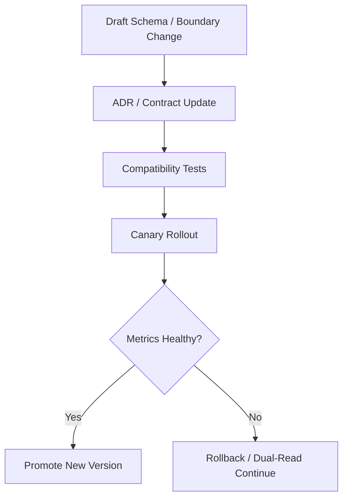

## 7.1 协议与恢复提示

对外协议或控制面握手至少应明确：

- protocol version negotiation
- role / scope boundary
- device / client identity shape
- structured recovery hint on auth or compatibility failure

规则：

- 协议变化属于 contract 变化，不应只靠实现细节悄悄漂移。
- 兼容失败时应尽量返回结构化恢复建议，而不是只暴露裸错误字符串。
- 对外方法、payload、notification 命名应遵循统一约定，例如 `*Params / *Response / *Notification` 或等价风格，不应在同一协议层混用多种命名体系。
- experimental / unstable surface 必须显式标记，并定义升格或删除路径，避免临时字段长期滞留为隐式正式接口。

## 8. 收口结论

成熟工业平台不能只靠“当前实现能跑”维持稳定。

正式的架构治理必须同时覆盖：

- 决策记录
- 层级边界
- schema 版本
- 兼容窗口
- 升级与回滚条件
# Audit Lineage And Retention Contract

## 1. 范围

本 contract 定义工业级审计、证据链、数据保留与删除策略。

相关文档：

- `data_classification_and_prompt_handling_contract.md`
- `storage_schema_contract.md`
- `tenant_and_organization_contract.md`

## 2. 目标

- 让关键行为可追溯到人、系统、版本和策略。
- 让企业可导出证据链。
- 让 retention / deletion 不是一句口号，而是带对象、时限和例外规则。

## 3. 证据链对象

- `model_version_evidence`
- `prompt_version_evidence`
- `policy_decision_evidence`
- `approval_evidence`
- `data_lineage_evidence`
- `release_bundle_evidence`
- `strategy_version_evidence`
- `rollout_evidence`
- `feedback_lineage_evidence`
- `knowledge_provenance_evidence`
- `memory_promotion_evidence`

## 4. 审计主体

统一 actor model：

- `user`
- `agent`
- `system`
- `scheduler`
- `admin`
- `webhook`
- `recovery`

说明：`recovery` 表示由恢复链（recovery coordinator、stale lease 回收、reconciliation 扫描等）自动触发的变更。与 `system` 的区别在于：`system` 是正常运行时的系统行为，`recovery` 是异常恢复路径的系统行为，两者在审计和告警层面应可区分。

## 5. 最小审计字段

- `audit_id`
- `actor_type`
- `actor_id`
- `tenant_id?`
- `workspace_id?`
- `task_id?`
- `execution_id?`
- `action`
- `resource_ref`
- `decision_ref?`
- `version_ref?`
- `created_at`

## 6. 数据保留分层

| 数据类型 | 最小要求 |
| --- | --- |
| task / execution 核心记录 | 长于业务追责窗口 |
| audit log | 长于安全审计窗口 |
| artifact | 按业务与合规策略保留 |
| PII 派生数据 | 需支持删除 SLA |
| backup | 必须有删除与法务保全例外规则 |

### 6.1 事件保留策略（`ObservabilityRetentionPolicy`）

按事件 tier 分级设置保留天数：

| tier | 默认保留 | 说明 |
| --- | --- | --- |
| `tier_1` | `null`（永不自动删除） | 关键事实事件，需长期可追溯 |
| `tier_2` | `14` 天 | at-least-once 事件，过期后可清理 |
| `tier_3` | `3` 天 | best-effort 事件，短周期清理 |

事件可删除条件：

- 所属 tier 的保留期已到
- **且**关联任务已达终态（`done / failed / cancelled`）或任务为空

### 6.2 消息保留策略

- 默认保留：`30` 天
- `preservedMessageTypes` 白名单内的消息类型永不自动删除（如 `compaction_summary`、`approval_decision`）
- 消息可删除条件：
  - 创建时间超过保留期
  - 消息类型不在 preserved 白名单内
  - **且**关联 session 和 task 均已达终态

### 6.3 保护规则

- 活跃 session（非终态）的所有消息都受保护，即使关联 task 已终态。
- `CompactionRecord` 永不自动删除（压缩记录是上下文重建的关键 lineage）。
- 保留策略支持 `dry_run` 和 `enforced` 两种模式：`dry_run` 只生成报告不执行删除。

## 7. 删除与例外

- PII 删除请求必须有 SLA。
- legal hold 生效时，相关对象可暂停删除，但必须有审计痕迹。
- backup 删除与主库删除必须区分说明。
- 保留策略执行结果必须生成 `ObservabilityRetentionReport`，包含每个 tier 和消息类型的清理统计。

## 8. Lineage 关系


## 9. 导出要求

生产系统应支持导出：

- 指定任务审计包
- 指定租户审计包
- 指定时间窗安全事件
- prompt/model/policy 版本对应关系
- feedback -> learning -> improvement -> rollout 的完整 lineage

## 10. 收口结论

工业级系统不只要“能记日志”，还要能证明：

- 谁做的
- 用了什么版本
- 为什么被允许
- 数据从哪里来，流向哪里去
# Billing And Tenant Contract

## 1. 范围

本 contract 定义计量、配额、账单、套餐边界和未来多租户隔离的最小对象模型。

## 2. 关键对象

- `UsageMeter`
- `QuotaPolicy`
- `BillingAccount`
- `PlanDefinition`
- `TenantBoundary`

## 3. UsageMeter 最小字段

- `usage_id`
- `subject_id`
- `task_id?`
- `metric_type`
- `quantity`
- `captured_at`

## 4. BillingAccount 最小字段

- `account_id`
- `owner_id`
- `plan_id`
- `status`
- `balance_snapshot?`
- `created_at`

## 5. TenantBoundary 最小字段

- `tenant_id`
- `storage_scope`
- `artifact_scope`
- `identity_scope`
- `policy_scope`

## 6. 行为约束

- 计量、配额和账单必须可追溯到任务或主体。
- Pro 与 Enterprise 的隔离策略不能只靠 UI 区分。
- 多租户设计进入实现前，必须先明确租户级存储边界和权限边界。
- 退款、冲正、欠费冻结和能力降级必须以独立账务事实表达，不得直接重写历史 usage。

## 7. 补充规则

### 7.1 支付提供者接口

支付提供者最少应支持：

- `create_subscription`
- `update_plan`
- `capture_invoice`
- `mark_payment_failed`
- `cancel_subscription`

### 7.2 发票与退款

- 发票、退款和冲正必须可追溯到 `billing_account` 与时间窗。
- 退款不得静默改写 usage ledger，应以独立 adjustment 记录表达。

### 7.3 Enterprise 账户模型

- `organization_account` 是 Enterprise 计费与策略归属主体。
- workspace / project 的资源消耗最终归集到 organization 级账务边界。
# Configuration Layers And Defaults Contract

## 1. 范围

本 contract 定义配置分层、覆盖优先级、prompt / config / policy / flag 解耦规则，以及默认值注册中心。

相关文档：

- `project_structure_contract.md`
- `policy_engine_contract.md`
- `division_definition_contract.md`
- `adr/006-llm-provider-strategy.md`

## 2. 配置五层

- `system config`
- `domain config`
- `division config`
- `role config`
- `runtime override`

优先级链：

`runtime override > role config > division config > domain config > system config > default registry`

## 3. 四类职责分离

- prompt：行为倾向与表达
- config：结构与组织关系
- policy：强约束
- feature flag：启停控制

规则：

- 运行时强约束不得只写进 prompt。
- feature flag 不替代权限与策略。
- config 不能用来偷偷覆盖 policy 决策。

## 3A. 配置治理 Bundle

配置治理层通过 `ConfigBundle` 统一加载和校验所有配置层。当前阶段必须包含以下 6 个层：

| 层名 | 文件路径 | 职责 |
| --- | --- | --- |
| `bootstrap` | `config/bootstrap/default.json` | 应用标识、phase 阶段声明、特性开关 |
| `gateways` | `config/gateways/default.json` | API 网关与渠道适配配置 |
| `domains` | `config/domains/default.json` | domain/tool bundle/plugin/namespace 默认配置 |
| `knowledge` | `config/knowledge/default.json` | knowledge namespace、trust、freshness 配置 |
| `memory` | `config/memory/default.json` | memory layer、promotion、decay 配置 |
| `kvcache` | `config/kvcache/default.json` | fixed prefix / domain block / variable suffix 预算策略 |
| `providers` | `config/providers/default.json` | LLM provider 连接与 profile 选择 |
| `runtime` | `config/runtime/default.json` | 运行时参数：timeout、并发、agent rounds、tool calls |
| `security` | `config/security/default.json` | 沙箱模式、审批模式、远程 worker 注册策略 |
| `workflows` | `config/workflows/default.json` | 工作流定义与默认步骤模板 |

### 3A.1 配置版本

- 系统通过对 bundle 做确定性 JSON 序列化后取 SHA256 前 16 位生成 `configVersion`。
- `configVersion` 用于篡改检测：若运行时 bundle 重新计算的版本与已记录版本不一致，doctor 应报告 `config.version_tampered`。

### 3A.2 验证规则

| 层 | 验证项 | 规则 |
| --- | --- | --- |
| 所有层 | 存在性 | 缺失任一必须层时报 `config.missing_layer:{layerName}` |
| `runtime` | `defaultTaskTimeoutMs` | 必须为正数 |
| `runtime` | `defaultStepTimeoutMs` | 必须为正数 |
| `runtime` | `maxConcurrentTasks` | 必须为正整数 |
| `security` | `sandboxMode` | 必须为 `read_only \| workspace_write \| danger_full_access` 之一 |
| `security` | `remoteWorkerRegistration.challengeTtlMs` | 必须为正数 |
| `security` | `remoteWorkerRegistration.allowedCapabilities` | 必须为非空字符串数组 |
| `providers` | provider / profile 引用 | 必须在 model metadata registry 中存在匹配项 |
| `domains` | domain/tool bundle/plugin refs | 必须与注册表一致 |
| `knowledge` | namespace / trust tier | 必须满足枚举与边界约束 |
| `kvcache` | budget partition | fixed/domain/variable 三段预算之和必须可解释 |
| 生产环境 | `allowDestructiveActions` | 不得为 `true`（fail-closed） |

### 3A.3 JSONC 支持

配置文件支持 `//` 行注释、`/* */` 块注释和尾逗号。解析时先剥离注释再做 JSON parse。

### 3A.4 Sandbox 路径约束

配置文件加载路径必须位于 config 根目录内，禁止通过 `../` 等路径遍历读取 config 目录外的文件。

## 4. 默认值注册中心

至少统一管理：

- timeout 默认值
- retry 默认值
- queue limit 默认值
- cost guard 默认值
- heartbeat 默认值

## 5. Provider / Model 元数据注册表

涉及模型选择、预算、上下文限制、modalities、provider 认证方式的元数据，不得散落在调用点硬编码。

最少应有统一 registry 管理：

- `provider_id`
- `model_id`
- `capability_labels`
- `context_limit`
- `max_output_limit`
- `pricing`
- `modalities`
- `auth_methods`
- `status` (`active | degraded | disabled | deprecated`)
- `metadata_source` (`bundled_snapshot | local_override | remote_refresh`)
- `tier` (`reasoning | coding | balanced | fast`)
- `kv_cache_support` (`none | prefix_only | segmented`)

### 5.1 Model Tier 语义

| tier | 适用场景 |
| --- | --- |
| `reasoning` | 需要深度推理的复杂任务 |
| `coding` | 代码生成与编辑任务 |
| `balanced` | 通用任务，能力与成本平衡 |
| `fast` | 低延迟响应优先的轻量任务 |

### 5.2 Metadata Source 优先级

- 系统内置 `bundled_snapshot`（带快照日期，如 `2026-04-05.bundled`）作为离线基线。
- 本地 `config/providers/models.json` 存在时覆��内置快照（`local_override`）。
- 远端刷新为未来扩展预留（`remote_refresh`）。
- 本地文件不存在时静默回退到内置快照，不报错。

规则：

- registry 可支持本地快照、离线使用、远端刷新，但 authoritative 字段形状必须稳定。
- 运行时不得通过字符串 contains 判断替代正式 capability metadata，除非属于短期兼容层。
- UI、CLI、server、policy、budget 和 provider routing 应优先消费统一 registry，而不是各自维护模型清单。

## 6. 收口结论

配置体系最大的风险不是“配置项太多”，而是默认值、提示词、YAML 和策略互相抢权；这份 contract 就是把它们的层级写死。
# Cost And Budget Contract

## 1. 范围

本 contract 定义成本估算、实时成本记录、预算阈值和熔断规则。

## 2. 关键对象

- `CostEstimate`
- `CostEvent`
- `BudgetPolicy`
- `CostKillSwitch`

## 3. BudgetPolicy 最小字段

| 字段 | 类型 | 说明 |
| --- | --- | --- |
| `max_task_cost_usd` | `number` | 单任务上限 |
| `max_daily_cost_usd` | `number` | 每日上限 |
| `max_monthly_cost_usd` | `number` | 每月上限 |
| `warn_at_ratio` | `number` | 预警阈值 |
| `mode` | `supervised \| auto \| full-auto` | 运行模式 |

## 4. CostEvent 最小字段

- `task_id`
- `session_id?`
- `agent_id?`
- `stage?`
- `provider`
- `model`
- `input_tokens`
- `output_tokens`
- `cost_usd`
- `created_at`

## 5. 行为约束

- 成本记录应尽量靠近真实调用点。
- 预算判断不能只看单次调用，应看累计值。
- 触发阈值后必须有明确动作：告警、审批、暂停或熔断。

## 6. 关联范围

成本至少覆盖：

- 总部层调用。
- 事业部执行。
- 自愈重试。
- 压缩与后台任务。
- Observe / Assess / Plan / Feedback / Learn / Improve / Release 各阶段调用。

## 7. 补充规则

### 7.1 估算模板

- `passthrough`: 最低上下文、最低治理开销
- `fast`: 快速模型 + 轻量工具链
- `standard`: 默认推理与标准治理链
- `full`: 深推理 + 扩展上下文 + 完整治理链

规则：

- 每个模板都必须绑定默认模型档位、token ceiling 和预算倍率。

### 7.2 成本事件结构

`CostEvent` 扩展字段至少包括：

- `cost_event_id`
- `provider_request_id?`
- `budget_scope`
- `pricing_version`

### 7.3 BYOK 区分

- BYOK 场景下应区分“平台治理成本”和“用户自带模型调用成本”。
- 平台代付与 BYOK 不得混在同一账单口径里。

### 7.4 隐式成本归属

以下系统内部操作会产生模型调用成本，必须纳入成本追踪，不得作为"免费"后台行为：

| 操作 | 归属规则 | CostEvent 标注 |
| --- | --- | --- |
| 上下文压缩（compaction stage 2 summarize） | 归属到触发压缩的 session 和 task | `budget_scope: compaction`、关联 `session_id` 和 `task_id` |
| skill 缓存未命中后的模型调用 | 归属到触发 skill 执行的 task 和 execution | `budget_scope: skill_execution`、关联 `execution_id` |
| 自愈 / 恢复重试 | 归属到原始 task（非新建恢复任务） | `budget_scope: recovery_retry`、关联原始 `task_id` |
| guardian / reviewer subagent 推理 | 归属到触发审批的 task | `budget_scope: approval_review`、关联 `approval_id` |

规则：

- 隐式成本必须参与预算阈值判断，不得绕过 `BudgetPolicy` 的累计检查。
- skill 缓存命中时不产生模型调用成本，但缓存存储和查找的计算成本不计入 token 预算。
- compaction 成本若使单任务超过 `max_task_cost_usd`，应触发与普通模型调用相同的阈值动作（告警、审批或熔断），不得静默放行。
- CostEvent 的 `budget_scope` 字段必须区分上述场景，使成本报告可按来源维度聚合。

补充说明：

- token 预算细粒度分配以下钻文档 `token_budget_allocation_contract.md` 为准。

### 7.5 Per-Stage Budget Allocation

`StageBudgetPolicy` 至少应支持：

- `stage`
- `budget_limit_usd`
- `warn_ratio`
- `hard_stop`

规则：

- Observe / Assess / Plan / Execute / Feedback / Learn / Improve / Release 的成本归属必须可分层统计。
- Knowledge 检索、Learn 生成、Improve 评估、Release 试跑等隐式模型成本不得全部混进单一 execute 成本桶。
- stage 成本超阈值时，必须触发与普通模型调用一致的告警、审批或熔断语义。
# Data Classification And Prompt Handling Contract

## 1. 范围

本 contract 定义数据分级，以及不同等级数据是否允许进入 prompt、日志、memory、跨 worker 传输。

相关文档：

- `sandbox_and_auth_contract.md`
- `tool_output_sanitization_contract.md`
- `tenant_and_organization_contract.md`

## 2. 数据分级

- `public`
- `internal`
- `confidential`
- `restricted`

## 3. 控制维度

每个等级至少要约束：

- 是否允许进入 prompt
- 是否允许写日志
- 是否允许跨 worker 传输
- 是否允许进入 memory
- 是否允许进入 Knowledge Plane
- 是否允许进入高层 memory（L5/L6）
- 是否允许进入 feedback / learning 对象
- 是否允许进入 artifact
- 是否允许进入 debug / inspect

## 4. 最小映射规则

| 等级 | prompt | logs | memory | artifact | cross-worker |
| --- | --- | --- | --- | --- | --- |
| `public` | 允许 | 允许 | 允许 | 允许 | 允许 |
| `internal` | 允许 | 允许脱敏后 | 允许 | 允许 | 受控允许 |
| `confidential` | 受控允许 | 默认脱敏 | 受控允许 | 受控允许 | 默认拒绝或最小化 |
| `restricted` | 默认拒绝 | 默认拒绝 | 默认拒绝 | 仅受控保留 | 默认拒绝 |

## 5. 规则

- `restricted` 默认不得直接进入 prompt。
- 高风险工具输出应先做结构化提取或摘要，再决定是否入模。
- 数据等级变化必须可审计。
- `restricted` 默认不得进入 memory、debug dump 或跨 worker 传输。
- 若需要例外放行，必须由 Policy Engine 给出可审计决策。
- `restricted` 默认不得进入 Knowledge Plane 或 L5/L6 memory promotion。
- `confidential` / `restricted` 数据若进入 `LearningObject` 或 `FeedbackSignal`，必须先脱敏并保留 classification provenance。

## 6. 收口结论

不是所有文本都应该直接给模型；数据分级和入模策略控制，是长期安全与企业化的关键前置边界。
# Data Plane Contract

## 1. 范围

本 contract 定义最终平台的数据平面分层，包括事务数据、artifact/object、analytics、knowledge、memory/archive 和 replay 数据。

它是 `storage_schema_contract.md` 的上位扩展，用于回答“不同数据应该存在哪里、由谁负责、如何流动、保留多久、谁是事实源”。

## 2. 目标

- 明确 authoritative transaction store。
- 明确 object / artifact 的命名空间、生命周期和引用语义。
- 明确 analytics、memory、archive、replay 的分层职责。
- 明确不同数据平面之间的同步和回写边界。

## 3. 非目标

- 本 contract 不规定具体数据库或对象存储产品选型。
- 本 contract 不替代 Phase 1a 的事务表字段定义。
- 本 contract 不要求所有数据平面在同一阶段一次性上线。

## 4. 数据平面分层

- `TransactionalStore`
- `ArtifactObjectStore`
- `AnalyticsStore`
- `KnowledgePlane`
- `MemoryArchiveStore`
- `ReplayDatasetStore`

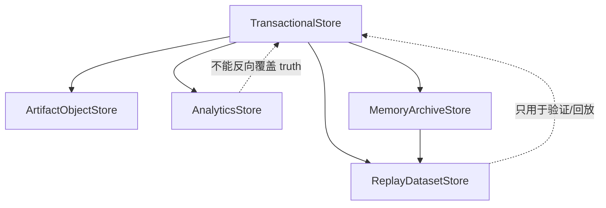

## 5. 分层职责

`TransactionalStore`
: 保存任务、execution、approval、event、billing ledger ref 等事务事实。它是运行时 authoritative truth 的第一来源。

`ArtifactObjectStore`
: 保存大体积文件、报告、附件、模型输出、证据包、二进制工件。事务层只保留 ref，不直接存 BLOB。

`AnalyticsStore`
: 保存聚合指标、成本分析、转化、留存、usage 聚合、经营看板数据。它消费事实层，但不反向充当事实源。

`KnowledgePlane`
: 保存知识条目、检索索引、trust/freshness 元数据和 namespace 边界。它不是在线事务真相源。

`MemoryArchiveStore`
: 保存长期记忆、压缩摘要、演化归档、handover bundle 和 memory promotion 材料。必须保留 provenance。

`ReplayDatasetStore`
: 保存回放、评测、对比、regression 与 golden dataset。用于验证和学习，不作为在线事务源。

## 6. 数据拥有权原则

- 任务、execution、approval、event 的 authoritative owner 是 `TransactionalStore`。
- artifact 内容本体的 authoritative owner 是 `ArtifactObjectStore`。
- 指标与趋势分析的 authoritative owner 是 `AnalyticsStore`。
- 知识条目与 namespace 元数据的 authoritative owner 是 `KnowledgePlane`。
- 记忆与归档材料的 authoritative owner 是 `MemoryArchiveStore`。
- 评测和回放样本的 authoritative owner 是 `ReplayDatasetStore`。

规则：

- 任一 plane 读取其他 plane 数据时，应通过 ref、snapshot 或 pipeline，而不是私自复制语义。
- analytics 与 replay 不得反向覆盖 transaction truth。

## 7. 关键对象

- `DataNamespace`
- `ArtifactRef`
- `ArchiveBundle`
- `AnalyticsFact`
- `ReplayDataset`
- `DataMovementJob`
- `KnowledgeRef`
- `MemoryRef`

## 8. `DataNamespace` 最小字段

| 字段 | 类型 | 说明 |
| --- | --- | --- |
| `namespace_id` | `string` | 命名空间 ID |
| `plane` | `transactional \| artifact \| analytics \| knowledge \| memory_archive \| replay` | 所属平面 |
| `tenant_scope` | `string?` | 所属 tenant / org 边界 |
| `retention_policy` | `string` | 保留策略 |
| `encryption_policy` | `string` | 加密策略 |
| `residency_policy?` | `string` | 数据驻留要求 |

## 9. `ArtifactRef` 最小字段

- `artifact_id`
- `namespace_id`
- `object_key`
- `content_type`
- `size_bytes`
- `checksum`
- `created_at`
- `source_execution_id?`

规则：

- transaction 层只能保存 `ArtifactRef`，不能回灌 artifact 本体。
- artifact ref 必须稳定、可校验、可追溯。

## 10. `AnalyticsFact` 最小字段

- `fact_id`
- `metric_name`
- `dimension_json`
- `value`
- `window_start`
- `window_end`
- `source_ref`
- `captured_at`

规则：

- analytics fact 必须可以追溯到 transaction truth 或明确的 snapshot。
- 同一指标不得混用实时事实和人工估算而不做区分。

## 11. `ArchiveBundle` 与 `ReplayDataset`

`ArchiveBundle` 最小字段：

- `bundle_id`
- `bundle_type`
- `source_refs`
- `summary_ref`
- `created_at`

`ReplayDataset` 最小字段：

- `dataset_id`
- `dataset_type`
- `sample_refs`
- `truth_refs`
- `version`
- `created_at`

## 12. 数据流动规则

允许的主路径：

- transaction -> artifact ref
- transaction -> analytics
- transaction -> knowledge
- transaction -> memory/archive
- transaction + archive -> replay

限制：

- analytics -> transaction：仅允许通过显式决策回写，不允许直接覆写事实。
- knowledge -> transaction：仅允许通过受控检索、人工确认或显式治理回写。
- replay -> transaction：禁止直接成为在线真相源。
- archive -> transaction：只能通过人工确认或显式恢复流程回写。

### 12.1 数据流动流程图

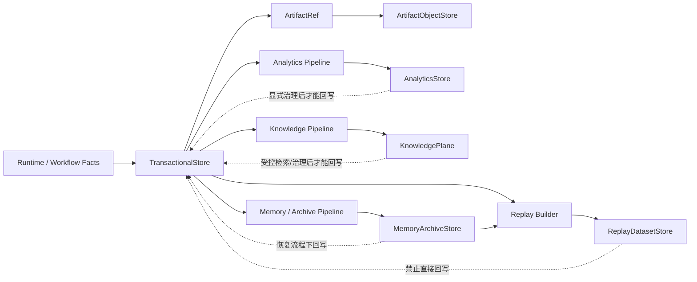

## 12.2 平面归属图

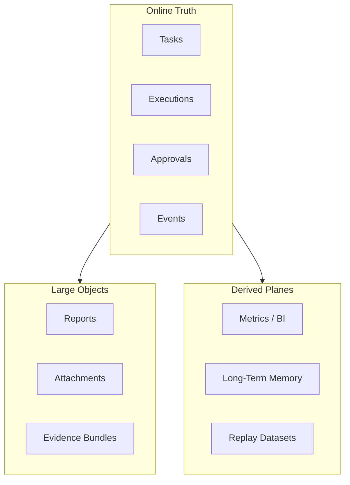

## 13. Retention 与 Lifecycle

- transaction 记录按运行与审计要求保留。
- artifact 按类型、租户和合规要求保留。
- analytics 可做 rollup、downsample、ttl。
- knowledge 应支持 namespace、trust tier、freshness 衰减与过期策略。
- memory/archive 应支持 compaction，但 compaction 不得破坏 provenance。
- replay 数据集应支持版本化与过期策略。

## 14. Tenant / Security 约束

- 所有平面都必须具备 tenant-aware namespace。
- artifact/object 与 analytics 不能绕过 tenant scope 直接共享。
- archive 与 replay 数据集在跨 tenant 共享前必须有显式授权。
- residency / encryption 要在 namespace 层而不是 UI 层表达。

## 15. Data Movement Job

`DataMovementJob` 最小字段：

- `job_id`
- `source_plane`
- `target_plane`
- `input_refs`
- `status`
- `started_at`
- `finished_at?`

用途：

- archive compaction
- analytics ETL
- knowledge indexing / reindex
- replay dataset build
- artifact lifecycle move

## 16. 与现有文档的关系

- `storage_schema_contract.md` 是 Phase 1a 事务基线。
- `artifact_store_contract.md` 是 object / artifact 的最小边界。
- `monetization_metering_plane_contract.md` 会消费 analytics / transaction 数据。
- 本 contract 负责最终平台的数据平面分层演进模型。

## 17. 分阶段引入

- Phase 2: memory / archive 分层。
- Phase 3: analytics / PMF 数据层。
- Phase 4: enterprise 数据治理、跨平面迁移与 residency 控制。

## 18. 收口结论

Data plane 的关键不是“再加几个库”，而是为每种数据明确 owner、retention、security 和回写边界。

后续任何存储扩展，都应先判断它属于哪个 plane，再决定落地位置与事实源优先级。
# Debug Inspect Health Backpressure Contract

## 1. 范围

本 contract 定义运行时的调试入口、inspect 查询、健康检查和背压策略。

相关文档：

- `observability_contract.md`
- `api_surface_contract.md`
- `event_registry_and_ops_threshold_contract.md`
- `startup_consistency_and_recovery_drill_contract.md`
- `execution_plane_contract.md`

## 2. 目标

这份文档回答 4 个问题：

- 出问题时，开发者和运维能看什么。
- 外部系统如何判断服务是否健康。
- 如何一键检查单个 task / workflow / execution 的完整轨迹。
- 系统过载时如何拒绝、排队或降级，而不是继续把问题放大。

## 3. 关键对象

### 3.1 `HealthStatusReport`

| 字段 | 类型 | 说明 |
| --- | --- | --- |
| `status` | `ok \| degraded \| overloaded \| unhealthy` | 总体健康状态 |
| `uptime_seconds` | `number` | 运行时长 |
| `db_writable` | `boolean` | DB 是否可写 |
| `provider_health` | `healthy \| degraded \| failed` | provider 聚合健康 |
| `active_executions` | `number` | 活跃 execution 数 |
| `queued_tasks` | `number` | 排队任务数 |
| `oapeflir_loop_health` | `healthy \| drifting \| stalled \| failed?` | 闭环聚合健康 |
| `knowledge_plane_health` | `healthy \| degraded \| not_enabled?` | Knowledge Plane 健康或未启用 |
| `active_rollouts` | `number` | 当前活跃 rollout 数 |
| `event_loop_lag_ms` | `number?` | 事件循环延迟 |
| `memory_rss_mb` | `number?` | RSS 内存 |
| `tier1_ack_backlog` | `number` | Tier 1 未确认积压 |

### 3.2 `TaskInspectView`

- `task`
- `workflow_state?`
- `executions[]`
- `approvals[]`
- `sessions[]`
- `recent_events[]`
- `artifacts[]`
- `recovery_summary?`
- `current_stage?`
- `loop_iteration?`
- `oapeflir_timeline?`
- `feedback_signals[]?`
- `learning_objects[]?`
- `improvement_candidates[]?`
- `rollout_records[]?`

### 3.3 `DebugDump`

- `trace_id`
- `recent_logs`
- `state_snapshots`
- `event_tail`
- `warnings`
- `warning_summary`

### 3.4 `BackpressurePolicy`

- `max_queued_tasks`
- `max_active_executions`
- `provider_concurrency_limit`
- `memory_high_watermark_mb`
- `event_loop_lag_threshold_ms`
- `degradation_mode`

### 3.5 `QueueGovernanceMetrics`

- `queue_id`
- `fairness_index?`
- `min_share?`
- `max_share?`
- `oldest_wait_seconds`
- `backlog_size`
- `backlog_growth_rate?`
- `starvation_detected`

## 4. 健康检查

### 4.1 端点

统一健康端点为：

- `GET /healthz`

兼容规则：

- `GET /health` 可作为兼容 alias
- authoritative contract 以 `/healthz` 为准

### 4.2 状态语义

| status | 含义 | 默认 HTTP |
| --- | --- | --- |
| `ok` | 服务健康，可正常接流量 | `200` |
| `degraded` | 部分能力退化，但仍可服务 | `200` |
| `overloaded` | 进入背压/降级状态 | `429` 或 `503` |
| `unhealthy` | 核心依赖失效，不应继续接流量 | `503` |

### 4.3 最小检查项

Phase 1a 必做：

- 进程存活
- DB 可写
- 活跃 execution 数
- 排队任务数

Phase 1b 增强：

- provider 最近 5 分钟成功率
- event loop lag
- RSS / 内存压力
- Tier 1 ack backlog

## 5. Inspect 查询

### 5.1 最小接口

- `GET /tasks/:taskId/inspect`
- `GET /executions/:executionId/inspect`
- `GET /approvals/:approvalId/inspect`
- `GET /rollouts/:rolloutId/inspect`
- `GET /knowledge/:namespace/inspect`
- `GET /tasks/:taskId/oapeflir-timeline`

### 5.2 查询要求

- `task inspect` 应可还原 task 的主状态、workflow、execution、审批、会话和事件尾部
- `task inspect` 应能展示当前 `stage`、`loop_iteration`、最近 feedback / learn / improve / release 引用
- inspect 输出必须优先读 authoritative store，而不是只依赖内存状态
- inspect 查询不得改变业务状态
- 若存在恢复或接管历史，inspect 应展示最近一次恢复决定、触发原因和当前活跃 execution 所有权
- `oapeflir-timeline` 应能按时间顺序返回每轮 stage 状态、关键 evidence ref、审批 gate 和 rollout 动作
- rollout inspect 必须可还原 rollout level、status、metrics、approval、rollback lineage
- knowledge inspect 属于扩展入口；未启用 Knowledge Plane 时应返回明确的 `not_enabled`，而不是 404 伪装资源不存在

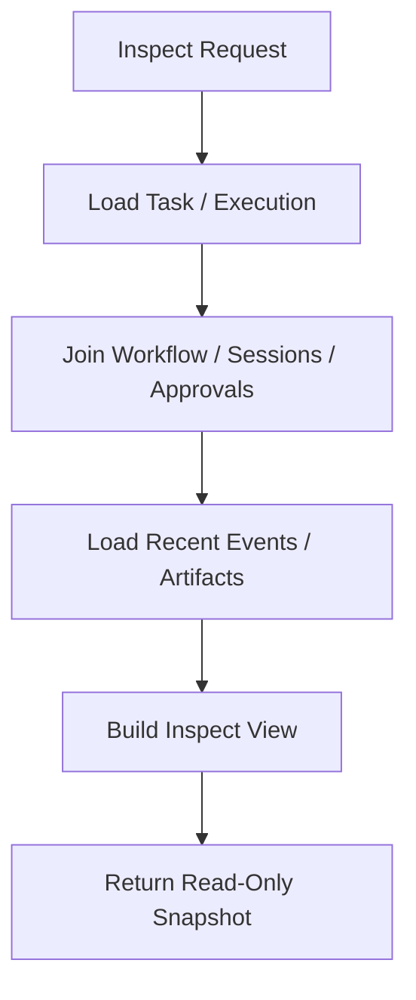

## 6. Debug 能力

最小调试能力：

- recent structured logs
- recent event tail
- state snapshots
- warning / error summary

规则：

- debug 默认不得暴露敏感内容
- 高敏感 payload 需脱敏或按权限受控展示
- debug dump 只用于问题定位，不得作为新的事实源
- `warnings` 保留兼容字符串数组输出，但应按 task 维度去重展示
- `warning_summary` 应聚合同类告警、统计被抑制的重复次数，并给出最小 escalation 路径

## 7. 背压策略

### 7.1 触发条件

至少考虑：

- `queued_tasks > max_queued_tasks`
- `active_executions > max_active_executions`
- provider 并发超限
- `memory_rss_mb > memory_high_watermark_mb`
- `event_loop_lag_ms > event_loop_lag_threshold_ms`
- Tier 1 ack backlog 持续超阈值
- queue fairness 持续恶化
- starvation entry 超过等待阈值

### 7.2 动作

| 场景 | 动作 |
| --- | --- |
| 队列积压 | 新任务排队或拒绝 |
| provider 过载 | 限流 / 延迟 / 降级模型 |
| 内存压力 | 限制新 execution，优先保活当前任务 |
| event loop lag | 标记 `degraded` 或 `overloaded` |
| Tier 1 积压 | 暂停非关键流量，优先恢复关键事件 |
| queue unfairness / starvation | 调整优先级、提升饥饿任务、限制热点租户或 worker |

### 7.3 降级模式

`degradation_mode` 枚举及决策优先级（从高到低）：

| 模式 | 触发条件 | 含义 |
| --- | --- | --- |
| `none` | `status == ok` | 无降级 |
| `read_only_operations_only` | DB 不可写 | 只允许只读操作 |
| `pause_non_critical` | Tier 1 ack backlog 超过 `overloaded` 阈值 | 暂停非关键流量，优先恢复关键事件 |
| `queue_only` | 队列压力（starvation / backlog / stale busy worker）或严重性能压力（memory > 110% 高水位 或 event loop lag > 150% 阈值） | 新非高优任务只排队不直接执行 |
| `fast_only` | provider 不健康或一般性能压力（memory > 高水位 或 event loop lag > 阈值） | 降级模型、限流或延迟 |

决策逻辑：

```
if status == ok:           → none
if !db_writable:           → read_only_operations_only
if tier1_ack_overloaded:   → pause_non_critical
if queue_pressure || severe_performance_pressure: → queue_only
if provider_degraded || performance_pressure:     → fast_only
else:                      → queue_only (保守默认)
```

### 7.3.1 降级模式与准入控制的联动

`AdmissionController` 根据当前 `degradation_mode` 做准入裁决：

| 降级模式 | 准入策略 |
| --- | --- |
| `read_only_operations_only` | 拒绝所有新任务（`admission.reject_read_only_mode`） |
| `pause_non_critical` | 仅允许高优任务（`high` / `urgent`），普通和低优任务被拒绝（`admission.reject_non_critical_paused`） |
| `queue_only` | 高优任务直接执行，普通和低优任务降级为排队（`admission.queue_backpressure`） |
| `fast_only` / `none` | 进入常规准入检查（预算、backlog、容量） |

额外准入保护：

- 预算超限时直接拒绝（`admission.reject_budget_exceeded`）
- `starvation_detected` 时拒绝低优任务（`admission.reject_starvation_protection`）
- Tier 1 ack backlog 达到硬上限时拒绝（`admission.reject_tier1_backlog`）
- 活跃 execution / 排队任务达到上限时拒绝或排队

规则：

- 背压不应 silently discard Tier 1 事实事件
- 降级模式必须可观测、可审计
- 准入拒绝必须返回结构化的 `reasonCode`，不得只返回泛化错误

### 7.4 Queue Governance

队列治理至少应回答：

- 是否出现长期 unfair scheduling
- 是否有 entry 长期饥饿
- backlog 是否在持续非正常增长

推荐阈值：

- `fairness_index < 0.8`
- `oldest_wait_seconds > starvation_threshold`
- `backlog_growth_rate` 持续超出增长窗口

## 8. 与 execution plane 的边界

- Phase 1a / 1b 的背压主要针对单机 runtime
- queue / worker registry / lease 级背压属于后续 execution plane
- 当前 contract 只冻结单机阶段的最小保护策略

## 9. Phase 边界

Phase 1a 做：

- `/healthz` 基线
- `task / execution / approval inspect` 基本查询
- 最小 backpressure thresholds
- 能按 `taskId` 追踪最后一次 tool call、失败原因和恢复历史
- `oapeflir-timeline` 至少能返回 phase1-4 闭环阶段、feedback、learning、improvement、release 的最小时间线

Phase 1b 做：

- debug dump / tail
- provider success rate
- event loop lag / memory pressure 指标
- 更细的 degradation mode

当前不做：

- 企业级监控告警平台
- 跨机队列调度背压
- Web UI 完整运维面板

## 10. 收口结论

没有 inspect、health 和 backpressure 的系统，问题一旦发生就只能靠猜；这份 contract 的作用，就是把“怎么看、何时算异常、过载时怎么缩”先定成正式边界。
# Distributed Locking Contract

## 1. 范围

本 contract 定义平台在工业级部署下的锁语义，包括本地锁、数据库锁、租约锁和审批互斥锁。

它解决的问题是：哪些锁只在单进程内有效，哪些锁必须跨 worker 保证，哪些操作只能依赖 lease 而不是通用锁。

相关文档：

- `file_lock_contract.md`
- `task_lease_and_fencing_contract.md`
- `production_storage_and_queue_contract.md`

## 2. 锁分类

| 锁类型 | authoritative backend | 主要用途 |
| --- | --- | --- |
| `local_mutex` | process memory | 单进程缓存刷新、单例初始化保护 |
| `file_lock` | authoritative store | 文件读写互斥 |
| `execution_lease` | authoritative store | execution 执行权 |
| `approval_lock` | authoritative store | 审批对象串行更新 |
| `advisory_lock` | PostgreSQL | 短事务内互斥、repair / migration / compaction 串行 |

## 3. 关键原则

- 不得把本地锁误当成分布式锁。
- execution ownership 优先使用 lease + fencing，不用普通 mutex 替代。
- 写锁必须有 TTL、续约、回收和 owner 识别。
- 锁的失败必须可观测、可告警、可恢复。

## 4. 推荐方案

- 短事务互斥：PostgreSQL advisory lock
- 长生命周期执行权：lease + fencing token
- 文件互斥：authoritative file lock repository
- Redis 锁不是当前首选事实源；若未来采用 Redlock，必须额外 ADR 说明风险边界

## 5. 锁状态机

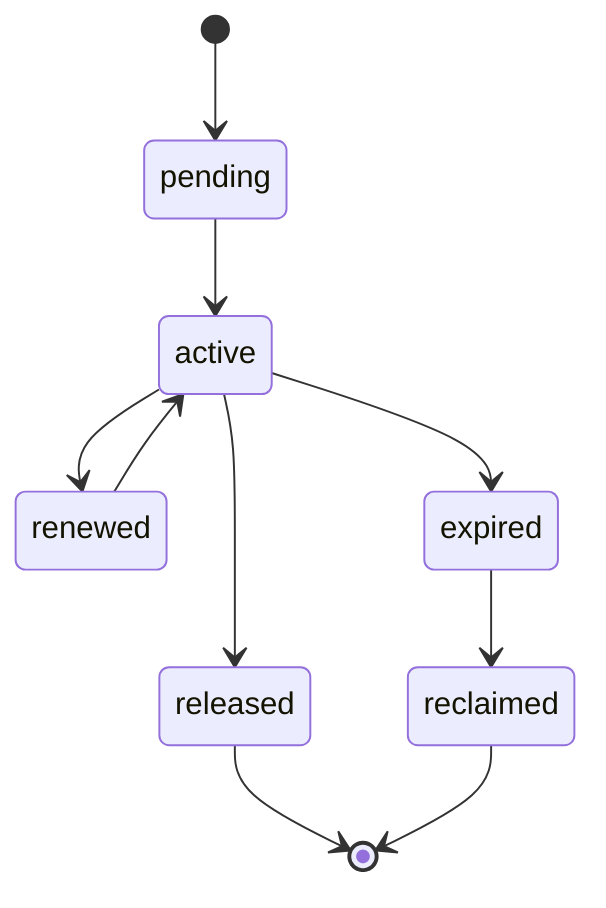

## 6. 必备字段

- `lock_id`
- `lock_type`
- `resource_key`
- `owner_kind`
- `owner_id`
- `expires_at`
- `fencing_token?`
- `created_at`
- `updated_at`

## 7. 规则

- 任何分布式写锁都必须支持过期判定。
- 锁获取失败必须返回明确 `reason_code`，不能只返回 `false`。
- 锁释放必须校验 owner，避免误释放他人锁。
- 锁回收动作必须产生日志和审计事件。

## 8. 适用边界

不应使用分布式锁的场景：

- 仅本地内存对象的无副作用去重
- 可重复执行、已具幂等语义的只读任务

必须使用 authoritative 分布式锁或 lease 的场景：

- 文件写入
- execution 主写入链
- 审批最终裁决
- migration / repair / reindex 等系统级维护动作

## 9. 故障处理

- 锁过期后，原 owner 不得继续写入。
- 如果网络分区造成 owner 自认为仍持锁，authoritative backend 仍以当前最新 token 为准。
- 锁表异常膨胀或过期锁堆积应触发运维告警。

## 10. 收口结论

工业级锁设计的重点不是“哪里都加锁”，而是先区分：

- 本地互斥
- 分布式资源锁
- execution lease

只有边界明确，系统才能既安全又不被锁设计拖垮。
# Division Definition Contract

## 1. 范围

本 contract 定义事业部的声明式配置结构，以及角色、workflow、触发器和重试策略的最小要求。

## 2. Division 最小字段

| 字段 | 类型 | 说明 |
| --- | --- | --- |
| `id` | `string` | 事业部唯一标识 |
| `version` | `string \| number` | division 定义版本 |
| `name` | `string` | 展示名称 |
| `description` | `string` | 事业部说明 |
| `priority` | `number?` | 路由优先级，值越大优先级越高 |
| `triggers` | `string[]` | 路由触发规则 |
| `domain` | `string?` | division 绑定的 domain |
| `tool_bundle_ref` | `string?` | 绑定的 domain tool bundle |
| `plugin_refs` | `string[]?` | 允许加载的 plugin 引用 |
| `knowledge_namespace` | `string?` | 该 division 的知识命名空间 |
| `roles` | `RoleRef[]` | 角色定义列表 |
| `default_workflow` | `string` | 默认 workflow ID |
| `orchestration_workflow` | `string?` | 多步编排 workflow ID |

## 3. Trigger 规则

- trigger 用于 VP 运营的首轮规则匹配。
- 应优先表达高频用户语言。
- 不应过宽，避免多个事业部大面积重叠命中。

## 4. RoleRef 最小字段

- `id`
- `name`
- `prompt`
- `model`
- `tools`
- `domain_id?`
- `max_instances?`

## 5. Workflow 规则

- `division.yaml` 通过 `default_workflow` / `orchestration_workflow` 引用该事业部下声明的 workflow。
- workflow 定义可以内联于加载器支持的最小定义中，也可以位于 `workflows/` 目录并由 loader 统一装载。
- 步骤间通过 output key 传递数据；若存在返工或回退，应显式表达，不依赖隐式约定。
- division 若声明 `domain`，workflow 中的 tool / plugin 引用必须与该 domain 匹配。

## 6. 与 HR Agent 的边界

- HR Agent 可在现有事业部内建议新增角色。
- HR Agent 的 workflow patch 默认不是自动生效配置。
- 新事业部必须人工创建。

## 7. 补充规则

### 7.1 `AGENT.md` 加载

- division 级 `AGENT.md` 仅补充该 division 的行为说明，不覆盖平台硬规则。
- 加载顺序应为：platform base -> division -> role。

### 7.2 Trigger 冲突裁决

- 先看显式优先级，再看更具体匹配，再看人工默认路由。
- 冲突裁决结果必须可解释、可审计。

### 7.3 版本与迁移

- `division.yaml` 必须携带版本。
- 破坏性 workflow / role 变更必须提供 migration note。
- 运行中的任务继续绑定启动时解析出的 division 版本。

### 7.4 Domain Registry 集成

- 每个 division 最多绑定一个 authoritative `domain`。
- `tool_bundle_ref`、`plugin_refs`、`knowledge_namespace` 应与 Domain Registry / Plugin Registry 的注册状态一致。
- 未声明 `domain` 的 division 允许使用通用工具集，但不得伪装成 domain-specialized division。
# Ecosystem Extension Plane Contract

## 1. 范围

本 contract 定义扩展生态平面，包括 capability registry、Domain Registry、plugin SPI、domain tool bundle、review pipeline、marketplace、兼容性与撤销机制。

它扩展 [tool_skill_plugin_contract.md](./tool_skill_plugin_contract.md)，用于回答“外部扩展如何被安全接入、注册、发布、升级、禁用和回滚”。

## 2. 目标

- 让 tool / skill / plugin / MCP 扩展进入统一生态治理模型。
- 明确 capability 声明、审核、版本兼容、撤销和 domain 绑定路径。
- 避免第三方扩展打穿平台安全边界。
- 为 `M2-EXT-01` 的 `Knowledge Plane / Artifact Plane / Plugin SPI / Domain Registry` 留出明确合同边界。

## 3. Canonical 组件

- `CapabilityRegistry`
- `DomainRegistry`
- `DomainToolBundleRegistry`
- `PluginSpiRegistry`
- `ExtensionReviewPipeline`
- `MarketplaceCatalog`
- `CompatibilityResolver`
- `RevocationService`

## 4. Canonical 对象

- `CapabilityDefinition`
- `DomainCapabilityRegistryEntry`
- `ExtensionPackage`
- `PluginManifest`
- `PluginSpiRegistration`
- `ReviewDecision`
- `CompatibilityMatrix`
- `RevocationRecord`

## 5. Domain Capability Registry

### 5.1 `CapabilityDefinition` 最小字段

- `capability_id`
- `provider_type`
- `declared_permissions`
- `risk_level`
- `version`
- `owner_ref`

### 5.2 `DomainCapabilityRegistryEntry` 最小字段

- `domain_id`
- `bundle_id`
- `capability_ids`
- `tool_names`
- `skill_ids`
- `plugin_ids`
- `knowledge_namespaces?`
- `default_activation_policy`
- `trust_tier`

规则：

- 所有扩展都必须先声明 capability，再进入执行链。
- domain bundle 绑定是 capability 暴露给具体 domain 的权威入口。
- runtime 不得加载未通过 compatibility、permission 和 trust gate 的扩展包。

## 6. Plugin SPI 集成

extension plane 统一承认四类 SPI：

- `DomainRetrieverPlugin`
- `DomainValidatorPlugin`
- `DomainPlannerPlugin`
- `DomainPresenterPlugin`

`PluginSpiRegistration` 至少记录：

- `plugin_id`
- `spi_type`
- `domain_id?`
- `capability_ids`
- `lifecycle_state`
- `runtime_isolation`
- `cooldown_until?`
- `runtime_process_id?`
- `runtime_sandbox_root?`
- `last_invocation_started_at?`
- `last_invocation_completed_at?`
- `sdk_surface`
- `registered_at`

规则：

- lifecycle 至少覆盖 `registered -> loaded -> active -> inactive -> unloaded`。
- 当前 authoritative runtime isolation 允许 `shared_process`、`serialized_in_process`、`forked_process`、`sandboxed_process` 与 `containerized_process`。
- `forked_process` 表示独立子进程隔离基线；`sandboxed_process` 表示独立子进程 + 专属 sandbox root + 最小 env 白名单 + Node permission model 的更强隔离模式。
- `containerized_process` 表示 launcher-based 的外部隔离 runtime 接口，可由 `docker` / `podman` / `bwrap` 或等价独立沙箱 launcher 承载；宿主与 child 之间通过 stdio JSON protocol 通信。
- `sandboxed_process` 与 `containerized_process` 都不应被直接表述为已完成的 OCI orchestrator、VM 或 microVM fleet 编排；当前仓库提供的是可审计的 isolated runtime host 与 launcher 接口，而真实 live infra 仍需目标环境验证。
- isolated failure 可把 plugin 置为 `degraded` 或 `disabled`，并可附带 cooldown 窗口；cooldown 状态必须可被 inventory、diagnostics 或 API 查询。
- 若启用 `forked_process`、`sandboxed_process` 或 `containerized_process`，runtime process id 应可被 inventory、diagnostics 或 API 查询，且宿主进程必须能在 unload / shutdown 时回收子进程。
- 若启用 `sandboxed_process` 或 `containerized_process`，runtime sandbox root 也应可被 inventory、diagnostics 或 API 查询，以便 operator 做隔离根目录审计。
- plugin invocation 至少应发布 `plugin:invocation_started` 与 `plugin:invocation_completed` typed audit 事件，供审计和反馈投影消费。
- SPI 注册结果必须能被 inventory、diagnostics 和审计系统查询。
- plugin 只能通过 public SDK surface 与 core 交互，不得 reach-in 私有实现。

## 7. Review 与发布流水线

review workflow 至少包含：

1. 提交
2. 静态校验
3. 权限审查
4. 兼容性检查
5. 人工审核
6. 发布
7. 撤销或回滚

`ReviewDecision` 最小字段：

- `decision_id`
- `extension_id`
- `status`
- `reason_codes`
- `reviewed_permissions`
- `compatibility_result`
- `signed_off_by`
- `decided_at`

补充规则：

- marketplace 发布必须经过 review decision。
- 已发布扩展必须支持 revoke / disable / rollback。
- extension package 应支持签名或等价完整性校验。

## 8. Compatibility Matrix

semantic version 兼容性至少分三层：

- `api_contract`
- `permission_surface`
- `runtime_capability`

`CompatibilityMatrix` 至少覆盖：

- `plugin_api_range`
- `built_with_platform_version`
- `min_runtime_version`
- `supported_domain_ids`
- `breaking_changes`

规则：

- `enabled` 不代表兼容；compatibility gate 未通过时必须 fail-close。
- domain bundle 升级若引入更高权限或 trust tier 变化，必须重新 review。

## 9. 撤销与回滚

`RevocationRecord` 至少包含：

- `revocation_id`
- `target_type`
- `target_id`
- `reason`
- `scope`
- `rollback_target?`
- `created_at`

撤销触发场景至少包括：

- 权限面超出声明
- 签名失效或来源不可信
- compatibility regression
- sandbox / policy escape
- domain bundle 误绑定

## 10. 与现有文档的关系

- [tool_skill_plugin_contract.md](./tool_skill_plugin_contract.md) 定义内部注册、authoring 和 SPI 基线。
- `sandbox_and_auth_contract.md` 提供扩展执行的安全边界。
- `api_surface_contract.md`、`admin_console_and_human_takeover_contract.md` 负责 extension plane 的管理入口。

## 11. 分阶段边界

### 当前 phase1-4 authoritative 范围

- capability 声明必须存在
- manifest / compatibility / permission / trust 的 contract 边界必须明确
- domain bundle、plugin SPI、marketplace 可以作为设计边界存在，但当前不应被表述为 fully operational production plane

### `M2` target-state 范围

- Domain Registry 作为统一注册后端
- per-domain tool bundle 完整控制面
- plugin SPI 大规模集成
- marketplace 发布、审核、撤销和回滚自动化

因此本 contract 主要承担 target-state extension plane 的治理定义；当前 readiness 只能把它视为边界文档，而不是已完成交付证明。
# Edit Replacement Chain Contract

## 1. 范围

本 contract 定义 `edit / patch / replace` 类工具在定位旧内容并应用替换时的多级匹配链。

相关文档：

- `tool_and_provider_execution_contract.md`
- `file_lock_contract.md`
- `tool_output_sanitization_contract.md`
- `idempotency_and_recovery_matrix_contract.md`

## 2. 目标

多级匹配链要同时解决两类问题：

- LLM 生成的 `old_string` 与真实文件存在轻微空白、缩进、换行偏差。
- 为了提高成功率，不能直接把模糊替换放大成静默误改风险。

## 3. 核心原则

- 匹配链必须按固定顺序尝试，首次成功即停。
- 越模糊的匹配等级，安全约束必须越严格。
- 任一非精确替换都必须留下 warning 和审计记录。
- 无法唯一定位时必须失败，而不是“猜一个差不多的地方”。

## 4. `EditReplacementAttempt`

| 字段 | 类型 | 说明 |
| --- | --- | --- |
| `attempt_level` | `exact \| whitespace_normalized \| indentation_normalized \| fuzzy \| context_anchored` | 匹配等级 |
| `matched` | `boolean` | 是否成功定位 |
| `candidate_count` | `number` | 候选数量 |
| `similarity_score` | `number?` | 模糊匹配得分 |
| `warning_codes` | `string[]` | 风险提示 |
| `applied_range` | `string?` | 变更位置 |

## 5. 多级匹配链

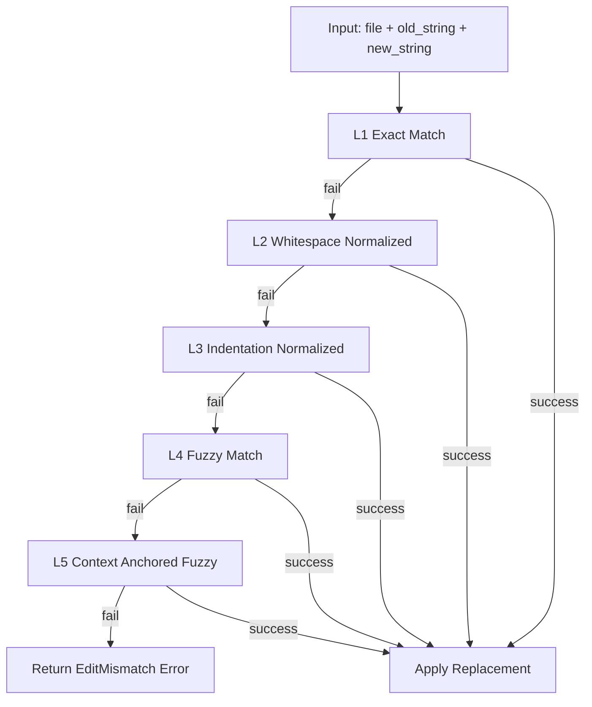

### 5.1 Level 1 `exact`

- 精确字符串匹配
- 不做任何归一化
- 若唯一命中则直接应用

### 5.2 Level 2 `whitespace_normalized`

- 归一化连续空白
- 去除尾随空白差异
- 不改变语义字符顺序

### 5.3 Level 3 `indentation_normalized`

- 剥离公共缩进后再匹配
- 适用于代码块整体缩进变化
- 应保留替换后目标文件的当前缩进风格

### 5.4 Level 4 `fuzzy`

- 仅在前 3 级全部失败后尝试
- 需要 `similarity_score >= 0.85`
- 必须只有唯一候选
- 成功时必须记录 warning：`fuzzy_edit_applied`

### 5.5 Level 5 `context_anchored`

- 用前后锚点先缩小候选区域，再做模糊匹配
- 仅允许在唯一锚点窗口中生效
- 成功时必须记录更强 warning：`anchored_fuzzy_edit_applied`

## 6. 当前明确不做

Phase 1a / 1b 不做：

- AST 感知替换
- tree-sitter 级结构化节点定位
- 跨文件语义重写

这些能力若要引入，应进入 Phase 2 并单独补 ADR 或 contract。

## 7. 安全约束

- 同一请求若出现多个候选，必须失败并返回冲突信息。
- 任何 fuzzy 成功结果都应返回 warning，供上层 message 或日志提示人工复核。
- 不允许在 binary / 非文本文件上启用多级匹配链。
- 应用替换前必须先持有 `write` 锁。

## 8. 错误语义

建议稳定错误码：

- `tool.edit_target_not_found`
- `tool.edit_multiple_candidates`
- `tool.edit_similarity_too_low`
- `tool.execution_failed`

规则：

- 找不到目标与“找到多个目标”必须分开报错。
- similarity 不达阈值应显式失败，不得偷偷降级应用。

## 9. 幂等与恢复

- 若替换后文件内容已等于期望结果，可视为幂等成功。
- 恢复重试前应先重新读取目标文件，而不是直接复用旧候选范围。
- fuzzy / anchored 级别的重试不得在文件已变化后继续沿用旧得分。

## 10. Phase 边界

Phase 1a 做：

- `exact`
- `whitespace_normalized`
- `indentation_normalized`

Phase 1b 才做：

- `fuzzy`
- `context_anchored`

## 11. 收口结论

Edit 成功率的提升不能靠“更敢改”，而要靠一条收紧顺序、明示风险、失败可解释的匹配链。
# Enterprise Operations Plane Contract

## 1. 范围

本 contract 定义最终平台的企业运维平面，包括环境注册、升级、回滚、SLA、支持和事件响应。

它用于回答“平台如何在企业环境中被交付、升级、审计和值守”。

## 2. 目标

- 让环境、版本、升级和运维动作进入正式 control plane。
- 让 enterprise 能力具备可审计、可恢复和可支持的交付模式。
- 把运维从 checklist 提升为平台层。

## 3. 关键组件

- `EnvironmentRegistry`
- `UpgradeOrchestrator`
- `RollbackController`
- `IncidentConsole`
- `SlaGovernanceService`

## 4. 关键对象

- `EnvironmentRecord`
- `ReleaseBundle`
- `UpgradePlan`
- `RollbackReceipt`
- `IncidentRecord`

## 5. EnvironmentRecord 最小字段

- `environment_id`
- `tenant_id?`
- `deployment_mode`
- `region`
- `version`
- `health_status`
- `managed_by`

## 6. 行为约束

- 所有升级和回滚都必须生成 receipt。
- enterprise 环境必须有明确 topology、版本和 owner 信息。
- support / incident 入口必须能关联 task、execution、release 和 policy 证据。
- SLA 判断不得依赖人工口径，必须有统一健康和事件定义。
- environment registry、release bundle、upgrade plan 与 rollback receipt 必须可相互追溯，不能只保留最后状态。
- private cloud / on-prem 环境若缺少某些托管能力，必须显式声明降级矩阵，而不是隐式少功能。

## 7. 与现有文档的关系

- `doc/operations/operations-checklist.md` 和阶段文档定义当前基线。
- 本 contract 定义最终 enterprise ops 作为平台层的目标形态。
- `tenant_and_organization_contract.md` 提供环境归属边界。

## 8. 分阶段引入

- Phase 4: environment registry、upgrade control、SLA governance。

## 9. 补充规则

- support routing 至少区分：产品问题、平台事故、安全事件、账务问题。
- on-call policy 至少包含：主值班、备值班、升级路径、交接要求。
- private cloud / on-prem 部署必须明确哪些能力可用、哪些依赖云服务降级。
- 任何升级失败进入回滚时，必须能给出环境级影响范围和 tenant 级影响清单。
# Enterprise Secret Management Contract

## 1. 范围

本 contract 定义工业级 secret 生命周期、托管方案和使用审计。

相关文档：

- `sandbox_and_auth_contract.md`
- `policy_engine_contract.md`
- `tenant_and_organization_contract.md`

## 2. 目标

- secret 不以明文长期落在应用配置或 worker 文件系统。
- secret 读取、轮换、作用域和使用记录可审计。
- worker 默认拿不到超出自身执行范围的秘密。

## 3. Secret 分类

- `provider_api_key`
- `tenant_credential`
- `oauth_client_secret`
- `signing_key`
- `db_connection_secret`
- `break_glass_secret`

## 4. 推荐托管边界

| 场景 | 推荐方案 |
| --- | --- |
| 本地开发 | `.env` 仅限开发 |
| 共享测试/预发 | Secret Manager / Vault |
| 生产 | Vault / KMS / Cloud Secret Manager |

## 5. 关键规则

- secret 必须有 `scope`，至少区分 system / tenant / workspace / worker。
- secret 必须有 rotation policy。
- worker 只应拿到短时、最小作用域凭证。
- secret value 不得出现在日志、event payload、artifact 或 memory。
- secret value 不得进入 prompt、tool 输出回显、debug dump 或 crash snapshot。

## 6. 使用流程

1. 调用方声明所需 secret capability。
2. Policy Engine 校验请求主体是否有权访问。
3. Secret provider 返回临时凭证或受控明文。
4. 使用行为写入 audit trail。
5. 到期或任务结束后回收。

补充规则：

- secret provider 不应把长期明文直接下发给不可信 worker；优先使用短时凭证或受控代理访问。
- provider credential pool / model provider runtime 在消费 `secret_ref` 时，应优先使用 provider-issued short-lived lease；请求或流式会话结束后必须回收对应 lease。
- 紧急模式获取 secret 必须留下 break-glass 审计与事后复盘记录。
- release pipeline、deployment matrix、CI/CD workflow 默认只允许传播 `secret_ref` 与等价 masked metadata，不允许把 registry / deploy secret 明文写入 bundle、artifact、CLI stdout 或 workflow 文件。

## 7. 审计字段

- `secret_ref`
- `scope`
- `requested_by`
- `granted_to`
- `granted_at`
- `expires_at`
- `usage_purpose`

当前基线实现补充：

- authoritative metadata 存储于 `secret_registry`
- 使用审计 append-only 存储于 `secret_usage_audits`
- 轮换事件 append-only 存储于 `secret_rotation_events`
- 短时凭证签发状态 authoritative 存储于 `secret_leases`，记录 `issued_at / expires_at / revoked_at / revoked_by / revocation_reason_code`
- 当前本地 provider seam 允许 `environment / vault / kms / secret_manager` 走统一解析接口；其中 `vault / kms / secret_manager` 现支持 provider-specific JSON/file-backed external adapter，并可通过 `issued_lease` 描述 provider-issued short-lived credential；在真实 provider 接入前仍可由 env-backed adapter 托底
- `deployment-execution` CLI 现已通过统一 secret management seam 解析 registry / deploy secret，而不是直接旁路读取环境变量
- provider credential pool / `MiniMaxChatService` 现已支持保留 managed `secret_ref`，在运行时通过 `SecretManagementService.issueSecretLease(...)` 签发并在请求完成后回收 lease，而不是在启动时长期保留明文 API key

## 8. 轮换要求

- 支持计划性轮换和紧急轮换。
- 轮换失败应触发告警。
- break-glass secret 必须双人知晓或双审批触发。

## 9. 禁止项

- 把生产密钥硬编码进 prompt、yaml、fixture
- worker 持久化长期密钥副本
- 在 CLI 输出或 debug snapshot 中直接暴露 secret
- 在 release bundle、deployment report 或 workflow artifact 中写入明文 registry/deploy secret

## 10. 收口结论

工业级 secret 管理的核心不是“有地方存 key”，而是：

- 最小作用域
- 临时凭证
- 轮换
- 审计
# Environment And Configuration Governance Contract

## 1. 范围

本 contract 定义环境分层、配置中心治理、发布前门禁和配置变更控制。

相关文档：

- `configuration_layers_and_defaults_contract.md`
- `environment_readiness_registry_contract.md`
- `release_rollout_and_rollback_contract.md`
- `prompt_model_policy_governance_contract.md`
- `enterprise_secret_management_contract.md`

## 2. 目标

- 明确 dev、test、staging、pre-prod、prod 的能力边界。
- 让配置具备版本、审批、diff、回滚和广播能力。
- 让发布门禁在环境维度可执行，而不是人工凭经验判断。
- 让外部环境 readiness 成为可查询 registry，而不是口头状态。

## 3. 环境分层

| 环境 | 主要用途 | 允许能力 |
| --- | --- | --- |
| `dev` | 本地开发 | mock provider、调试开关、宽松 lint |
| `test` | 自动化测试 | fixture / VCR、故障注入 |
| `staging` | 集成验证 | 近生产配置、灰度校验 |
| `pre-prod` | 发布前演练 | 生产模型清单、迁移和回滚验证 |
| `prod` | 正式服务 | 最小权限、正式审计、严格审批 |

## 4. 配置中心对象

- `ConfigBundle`
- `ConfigVersion`
- `ConfigApproval`
- `ConfigDiff`
- `ConfigRollbackTicket`
- `ConfigBroadcastEvent`

## 5. 配置治理规则

- 每次配置变更必须生成版本号。
- 生产配置变更必须有审批记录。
- 配置变更必须可 diff、可回滚。
- 热更新后必须广播给受影响组件。
- feature flag、policy、prompt bundle 的生效范围必须可见。
- runtime image / sandbox image / bundled extension tree 也应进入版本与变更治理，不应游离于配置治理之外。
- config schema 应优先由 authoritative types / protocol schema 生成，而不是长期手写维护。
- 对配置读写、校验、警告和 schema 生成，最好共用同一事实源，避免“文档写法”和“运行时解析”分叉。
- secret 读取接口默认只返回 masked value 或等价脱敏视图，不得把原文 secret 暴露给普通配置查询面。
- custom provider profile、模型清单、权限清单这类高风险配置对象，应优先有正式 API/registry，而不是散落在命令行或私有 YAML 里。
- provider/model 的默认上下文上限、request params、canonical limits 等元数据应通过 registry 统一治理，而不是在多个入口各自推断。
- 若支持同 provider 多 credential 轮换，应把 pool strategy、cooldown TTL、reset hints、manual pinning 和 disabled 状态纳入正式 config / registry，而不是散落在 provider adapter 内部状态里。
- 每个 layer 至少应支持 `default.json + <environment>.json` 的确定性 overlay 合成，避免“有环境名但无环境差异”。
- 多环境部署必须有 machine-readable deployment matrix，至少汇总 config version、readiness、deployment binding、promotion prerequisite 和 target release bundle。
- release / deployment config 至少应声明 `config_bundle_ref`、`registry_credential_ref`、`deployment_credential_ref` 三类引用，运行时和 CLI 只传播 ref，不传播 secret 原文。

## 6. 发布前门禁

至少自动检查：

- migration compatibility
- config schema validity
- workflow lint pass
- prompt lint pass
- eval threshold pass
- risk flag state healthy
- environment readiness registry pass
- runtime image provenance / digest pinning pass

## 6.1 运行镜像治理

工业级环境至少应支持：

- 多阶段构建，避免把 build toolchain 直接带入 runtime image
- 基础镜像 digest pinning 或等价可复现约束
- 按 capability 选择 runtime variant，例如最小 runtime、browser runtime、sandbox runtime
- 可选重依赖能力按需安装，而不是默认把所有依赖打进同一镜像

## 7. 优先级链

配置覆盖顺序：

1. secret / secure override
2. environment bundle
3. system config
4. division config
5. role config
6. runtime override

## 7A. 动态配置约束覆盖

- 配置覆盖不能是无限制的“最后写入生效”，必须显式声明可覆盖范围。
- 至少区分：`global`、`environment`、`tenant/workspace`、`rollout/cohort`、`break-glass` 五类约束层。
- 高风险对象如 provider profile、prompt bundle、policy rule、feature flag，不允许被低信任来源静默覆盖。
- 所有 override 必须产生日志与审计证据，并可在 readiness / doctor 视图中查询。
- unknown override source、非法约束组合或冲突链必须 fail-close。

## 7.1 SDK / Runtime 兼容治理

- 嵌入式 SDK 若依赖特定 CLI / app-server runtime，应显式 pin 或声明兼容窗口。
- protocol version、runtime version、schema artifact version 应可同时查询。
- 不得让 SDK、CLI、server 三者各自静默漂移后再在运行时偶然失败。

## 7.2 多环境部署矩阵

- `dev -> test -> staging -> pre-prod -> prod` 必须有明确 promotion 顺序。
- `staging / pre-prod / prod` 默认要求 environment readiness 与 deployment binding 同时满足，缺任一项都应 fail-close。
- `staging / pre-prod / prod` 默认还要求 secret/config injection plan 完整，缺 `config_bundle_ref`、`registry_credential_ref` 或 `deployment_credential_ref` 任一项都应 fail-close。
- 目标环境发布前，应显式校验前序环境 promotion prerequisite，而不是直接跳级部署。

## 8. 收口结论

工业级配置治理不是“能热重载就行”。

它必须具备：

- 环境隔离
- 版本控制
- 审批和 diff
- 回滚
- 生效广播
- readiness registry
# Environment Readiness Registry Contract

## 1. 范围

本 contract 定义外部环境与关键运行依赖的 readiness registry。

它回答的问题是：在进入 staging、pre-prod 或 prod 之前，系统如何统一记录 provider、gateway、sandbox、worker fleet、artifact store 等外部依赖是否已就绪。

相关文档：

- `environment_and_configuration_governance_contract.md`
- `enterprise_secret_management_contract.md`
- `release_rollout_and_rollback_contract.md`
- `slo_alerting_and_runbook_contract.md`

## 2. 目标

- 把 readiness 从“靠人记忆”变成统一 registry。
- 为 release gate、go-live gate 和 incident 诊断提供 authoritative readiness 事实。
- 将 credential、secondary gates、owner、last verified time 统一建模。

## 3. 关键对象

- `EnvironmentReadinessRecord`
- `EnvironmentReadinessGateSet`
- `EnvironmentReadinessSummary`

## 4. `EnvironmentReadinessRecord` 最小字段

| 字段 | 类型 | 说明 |
| --- | --- | --- |
| `readiness_id` | `string` | readiness 记录 ID |
| `environment` | `dev | test | staging | pre-prod | prod` | 所属环境 |
| `component_type` | `provider | gateway | sandbox | worker_fleet | artifact_store | notification_channel | external_service` | 组件类型 |
| `component_id` | `string` | 组件标识 |
| `credential_ready` | `boolean` | 凭据是否就绪 |
| `secondary_gates_json` | `json` | 二级门禁，如 webhook、moderation、quota、attestation |
| `owner` | `string` | 维护 owner |
| `last_verified_at` | `timestamp` | 最近一次验证时间 |
| `is_active` | `boolean` | 是否当前生效 |
| `notes?` | `string` | 补充说明 |

## 5. Gate 语义

最小 gate 模型：

- `credential_ready`
- `network_ready?`
- `webhook_ready?`
- `moderation_ready?`
- `quota_ready?`
- `attestation_ready?`
- `artifact_namespace_ready?`

规则：

- `credential_ready = false` 时，所有依赖该组件的正式操作默认 fail-closed。
- 二级 gate 未通过时，应阻断对应能力，而不是只打 warning。
- `last_verified_at` 过旧时，系统可将 readiness 降为 `stale` 并触发复核。

## 6. `EnvironmentReadinessSummary`

最小字段：

- `environment`
- `component_type`
- `total`
- `ready`
- `not_ready`
- `stale`
- `all_ready`

## 7. 与 release gate 的关系

- staging / pre-prod / prod 的 go-live gate 应引用 readiness registry，而不是人工口头确认。
- release gate 必须能回答：
  - 哪些外部依赖未 ready
  - 由谁负责
  - 最近一次验证是什么时候

## 8. 当前边界

当前优先覆盖：

- provider
- gateway
- sandbox
- artifact store
- worker fleet

当前不做：

- 面向每个第三方业务平台的细粒度 readiness 子表爆炸
- 把业务域特化 readiness 模型直接复制进当前系统

## 9. 收口结论

环境 readiness 不应只存在于 release 口头检查中。

它应当成为可查询、可审计、可被 release gate 消费的一等注册表。
# Error Code Registry

## 1. 范围

本文件定义当前阶段允许使用的稳定错误码注册表。

规则：

- 新错误码进入实现前，必须先登记到这里。
- 错误码一旦进入实现，不得随意改名。

## 2. 命名规则

统一格式：

- `<category>.<reason>`

示例：

- `validation.invalid_input`
- `provider.rate_limited`
- `runtime.timeout_exceeded`

## 3. 基线错误码

| code | category | retryable | 说明 |
| --- | --- | --- | --- |
| `validation.invalid_input` | `validation` | `false` | 输入不合法或缺字段 |
| `validation.schema_mismatch` | `validation` | `false` | workflow 输入输出不兼容 |
| `validation.tool_metadata_missing` | `validation` | `false` | 工具缺少关键执行元数据 |
| `validation.tool_metadata_invalid` | `validation` | `false` | 工具执行元数据不合法 |
| `policy.approval_required` | `policy` | `false` | 必须人工审批 |
| `policy.action_denied` | `policy` | `false` | 策略显式拒绝 |
| `auth.permission_denied` | `auth` | `false` | 权限不足 |
| `auth.session_expired` | `auth` | `false` | 会话过期 |
| `budget.budget_exceeded` | `budget` | `false` | 预算超限 |
| `budget.quota_exceeded` | `budget` | `false` | 配额超限 |
| `provider.rate_limited` | `provider` | `true` | provider 429 或等价限流 |
| `provider.temporary_unavailable` | `provider` | `true` | provider 暂时不可用 |
| `provider.invalid_credentials` | `provider` | `false` | provider 401/403 或凭据错误 |
| `provider.capability_unsupported` | `provider` | `false` | provider 或模型不支持请求能力 |
| `provider.compaction_unavailable` | `provider` | `true` | compaction / summarize provider 临时不可用 |
| `tool.execution_failed` | `tool` | `false` | 工具执行失败且不可自动重试 |
| `tool.temporary_io_error` | `tool` | `true` | 工具遇到临时 IO 问题 |
| `tool.edit_target_not_found` | `tool` | `false` | edit / patch 未找到目标 |
| `tool.edit_multiple_candidates` | `tool` | `false` | edit / patch 命中多个候选 |
| `tool.edit_similarity_too_low` | `tool` | `false` | edit / patch 模糊匹配相似度不足 |
| `tool.file_lock_conflict` | `tool` | `true` | 文件锁冲突，可等待后重试 |
| `tool.file_lock_timeout` | `tool` | `true` | 文件锁等待超时 |
| `tool.output_sanitization_failed` | `tool` | `false` | 工具输出净化失败 |
| `tool.recovery_strategy_unknown` | `tool` | `false` | 工具声明了未知恢复策略 |
| `sandbox.path_denied` | `sandbox` | `false` | 访问路径超出白名单 |
| `sandbox.network_denied` | `sandbox` | `false` | 网络访问被策略拒绝 |
| `sandbox.exec_denied` | `sandbox` | `false` | 进程执行被沙箱或策略拒绝 |
| `sandbox.isolation_broken` | `sandbox` | `false` | 隔离约束无法保证 |
| `storage.write_failed` | `storage` | `true` | 写存储失败 |
| `storage.integrity_violation` | `storage` | `false` | 外键或完整性错误 |
| `workflow.dependency_unavailable` | `workflow` | `true` | 上游依赖暂不可用 |
| `workflow.invalid_transition` | `workflow` | `false` | 非法状态跳转 |
| `runtime.timeout_exceeded` | `runtime` | `false` | 执行超时 |
| `runtime.recovery_required` | `runtime` | `true` | 需要恢复流程 |
| `runtime.stale_lock_detected` | `runtime` | `true` | 检测到过期锁或陈旧运行 |
| `runtime.context_overflow` | `runtime` | `true` | 上下文超限需裁剪或压缩 |
| `tenant.not_found` | `tenant` | `false` | 找不到租户或工作区归属 |
| `tenant.boundary_violation` | `tenant` | `false` | 访问跨租户边界 |
| `tenant.workspace_mismatch` | `tenant` | `false` | workspace 与 tenant / org 归属不一致 |
| `monetization.entitlement_denied` | `monetization` | `false` | entitlement 显式拒绝 |
| `monetization.quota_counter_stale` | `monetization` | `true` | quota counter 延迟或不一致 |
| `monetization.ledger_write_failed` | `monetization` | `true` | ledger 写入失败 |
| `monetization.billing_state_invalid` | `monetization` | `false` | 账单或套餐状态非法 |
| `external.service_unavailable` | `external` | `true` | 外部系统暂不可用 |
| `internal.unexpected_error` | `internal` | `false` | 未分类内部错误 |

## 4. 特殊映射规则

- provider 的 `401/403` 映射到 `provider.invalid_credentials`
- provider 的 `429` 映射到 `provider.rate_limited`
- provider 的 `5xx` 映射到 `provider.temporary_unavailable`
- 非法状态推进映射到 `workflow.invalid_transition`
- 文件锁获取冲突映射到 `tool.file_lock_conflict`
- 文件锁等待超时映射到 `tool.file_lock_timeout`

## 5. 补充规则

- provider 子码至少细分：`provider.context_window_exceeded`、`provider.model_not_available`、`provider.output_truncated`、`provider.capability_unsupported`。
- enterprise 专项错误码至少预留：`enterprise.environment_unhealthy`、`enterprise.release_guard_failed`、`enterprise.audit_export_denied`。
# Executable Unit Contract

## 1. 范围

本 contract 定义平台内统一的“可执行单元”抽象，用于收敛 Task、WorkflowStep、Skill Step、Tool Call、DecisionRequest、SubTask 等异构执行对象。

相关文档：

- `task_and_workflow_contract.md`
- `runtime_execution_contract.md`
- `transition_service_contract.md`
- `tool_metadata_and_recovery_contract.md`

## 2. 目标

统一执行单元的目的是让以下能力复用同一抽象：

- 调度
- 超时
- 重试
- 恢复
- 审计
- 计费
- 可视化

## 3. `ExecutableUnit`

| 字段 | 类型 | 说明 |
| --- | --- | --- |
| `unit_id` | `string` | 单元 ID |
| `unit_kind` | `task \| workflow_step \| skill_step \| tool_call \| decision_request \| subtask \| observe_step \| assess_step \| feedback_step \| learn_step \| improve_step \| release_step \| knowledge_retrieval \| memory_promotion` | 单元类型 |
| `parent_unit_id` | `string?` | 父执行单元 |
| `root_task_id` | `string` | 根任务 ID |
| `stage` | `observe \| assess \| plan \| execute \| feedback \| learn \| improve \| release?` | 所属闭环阶段 |
| `ref_id` | `string?` | 关联 typed ref |
| `input_ref` | `string \| json` | 输入引用或输入体 |
| `output_ref` | `string?` | 输出引用 |
| `status` | `string` | 生命周期状态 |
| `retry_policy_ref` | `string?` | 重试策略 |
| `timeout_ms` | `number?` | 超时 |
| `dependency_refs` | `string[]?` | 依赖单元 |
| `side_effect_level` | `none \| local \| external \| financial \| org_mutation` | 副作用等级 |
| `cost_scope_ref` | `string?` | 成本归属 |
| `created_at` | `timestamp` | 创建时间 |

## 4. 约束

- 统一执行单元是抽象层，不替代具体领域对象。
- `Task` 仍然是用户主对象，`ExecutableUnit` 是跨对象复用的执行视图。
- 执行调度、超时、恢复和审计优先消费统一执行单元，而不是为每个对象重复定义一套接口。

## 5. 当前阶段映射

| 领域对象 | 映射方式 |
| --- | --- |
| `Task` | 顶层用户可见执行单元 |
| `WorkflowStep` | workflow 内部执行单元 |
| `ToolCall` | 最细粒度原子执行单元 |
| `DecisionRequest` | 阻塞型执行单元 |
| `SubTask` | 子树型执行单元 |
| `Observe / Assess / Feedback / Learn / Improve / Release` | 闭环阶段执行单元 |

## 6. Phase 边界

Phase 1a / 1b 做：

- 文档与运行概念层统一抽象
- 用于调度、超时、恢复和可视化设计

当前不做：

- 单独新建一套独立存储表强行替代现有 task / execution / step 表

## 7. 收口结论

统一执行单元不是为了再造一层概念，而是为了减少“同一类调度逻辑在五六种对象上重复实现”的未来成本。
# File Lock Contract

## 1. 范围

本 contract 定义文件锁的读写语义、租约规则、崩溃回收和与 tool / sandbox 的边界。

相关文档：

- `tool_and_provider_execution_contract.md`
- `sandbox_and_auth_contract.md`
- `storage_schema_contract.md`
- `runtime_repository_and_migration_contract.md`
- `error_code_registry.md`

## 2. 目标

Phase 1a / 1b 至少要做到：

- 同一文件不会被两个写操作同时修改。
- 读写冲突可检测、可等待、可超时。
- 崩溃后遗留锁能被启动巡检和恢复链清理。

## 3. 关键对象

### 3.1 `FileLockRequest`

| 字段 | 类型 | 说明 |
| --- | --- | --- |
| `lock_scope` | `file` | 当前阶段固定为文件级 |
| `target_path` | `string` | 绝对规范化路径 |
| `mode` | `read \| write` | 锁模式 |
| `task_id` | `string` | 任务 ID |
| `execution_id` | `string` | execution ID |
| `agent_id` | `string` | agent ID |
| `ttl_seconds` | `number` | 租约 TTL |
| `wait_timeout_ms` | `number` | 等待冲突释放时间 |
| `reentrant_token` | `string?` | 同 execution 重入标识 |

### 3.2 `FileLockRecord`

- `lock_id`
- `target_path`
- `normalized_path`
- `mode`
- `holder_task_id`
- `holder_execution_id`
- `holder_agent_id`
- `acquired_at`
- `expires_at`
- `last_renewed_at`

## 4. 兼容矩阵

| 已有锁 | 新请求 | 结果 |
| --- | --- | --- |
| `read` | `read` | 允许共享 |
| `read` | `write` | 阻塞等待或失败 |
| `write` | `read` | 阻塞等待或失败 |
| `write` | `write` | 排他冲突 |

补充规则：

- 同一 `execution_id + normalized_path + mode` 的重入请求可复用已有锁。
- 同一 execution 已持有 `write` 锁时，再请求同文件 `read` 锁应直接复用，不再降级。
- 不允许“两个不同 execution 但同 task”绕过排他规则。

## 5. 租约与续约

- Phase 1a 默认 TTL 建议为 `60s`。
- 活跃 execution 必须通过 heartbeat 或显式 `renewLock(...)` 续约。
- 锁过期后不代表自动安全可写；恢复链应先确认 holder execution 已 stale 或终止。

## 6. 服务入口

最小接口：

- `acquireLock(request)`
- `renewLock(lockId, now)`
- `releaseLock(lockId)`
- `releaseAllByExecution(executionId)`
- `listLocksByExecution(executionId)`
- `listExpiredLocks(now)`
- `reapExpiredLocks(now)`

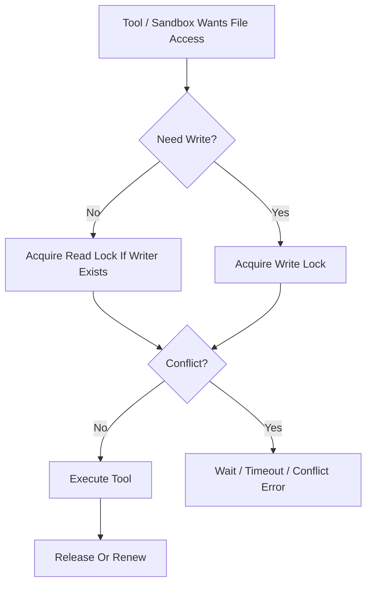

## 7. 与工具、沙箱的边界

- `read_file / grep / list` 这类只读工具默认可按需获取 `read` 锁。
- `write_file / edit / patch` 这类写工具必须先持有 `write` 锁。
- `bash` 这类不可静态精确推断写集的工具，不得伪装成精细文件锁安全；应由更粗的 ExecPolicy 和审批策略守卫。
- FileLock 不替代 sandbox 路径白名单，它只解决同路径并发冲突。

## 8. 存储与恢复边界

- authoritative 锁状态必须持久化，不得只存在内存 Map。
- 启动巡检应清理 `expires_at < now` 且 holder execution 已失活的锁。
- 若 execution 终止但锁仍存在，应由恢复链或清理器释放。

## 9. 错误语义

建议稳定错误码：

- `tool.file_lock_conflict`
- `tool.file_lock_timeout`
- `runtime.stale_lock_detected`

规则：

- 等待超时应返回冲突类错误，而不是笼统 `tool.execution_failed`。
- 发现锁记录损坏或 holder 不一致时，应上报恢复错误并进入巡检处理。

## 10. Phase 边界

Phase 1a 明确做：

- 文件级锁
- SQLite 持久化
- TTL + heartbeat 续约
- 启动回收与 execution 终止回收

当前不做：

- 目录级锁
- 分布式锁服务
- Git worktree 级隔离替代

## 11. 收口结论

文件锁的目标不是“让所有 IO 都自动安全”，而是把最危险的并发写冲突压到一个清楚、可审计、可恢复的最小边界里。
# Gateway Message Contract

## 1. 范围

本 contract 定义 CLI、Web、Telegram 等渠道与平台之间交换的统一消息结构。

## 2. 关键对象

- `GatewayMessage`
- `GatewayReply`
- `DecisionRequest`
- `DecisionResponse`
- `ProgressEvent`

## 3. GatewayMessage 最小字段

| 字段 | 类型 | 说明 |
| --- | --- | --- |
| `channel` | `string` | 渠道标识 |
| `external_user_id` | `string` | 渠道用户标识 |
| `external_session_id` | `string?` | 渠道会话标识 |
| `message_id` | `string` | 外部消息 ID |
| `content` | `string` | 文本内容 |
| `attachments` | `Attachment[]?` | 附件 |
| `created_at` | `timestamp` | 接收时间 |

## 4. GatewayReply 最小字段

- `channel`
- `target_user_id`
- `target_session_id?`
- `content`
- `artifacts?`
- `buttons?`

## 5. 决策交互

DecisionRequest 至少需要：

- `decision_id`
- `task_id`
- `reason`
- `options`
- `deadline?`

DecisionResponse 至少需要：

- `decision_id`
- `selected_option`
- `comment?`
- `responded_at`

## 6. 行为约束

- 网关层只做适配，不改平台语义。
- 渠道差异应通过 formatter / adapter 解决。
- 决策请求必须可追踪回具体任务和升级原因。

## 7. 补充规则

- 附件统一模型至少包含：`artifact_id`、`display_name`、`mime_type`、`size_bytes`、`download_ref`。
- 渠道能力矩阵至少覆盖：`text`、`buttons`、`attachments`、`stream`、`notifications`。
- 富文本与按钮若不被渠道支持，必须退化为纯文本 + 编号选项。
- gateway 可以维护 `ChannelDirectory` 或等价 target registry，用于把平台可枚举目标与历史会话来源统一成只读目标目录。
- 发送前若接受人类可读目标名，应先解析成 canonical target id；只允许精确匹配或唯一前缀匹配，歧义时必须 fail-close。
- 新平台接入不应只改 adapter 文件；至少应同步更新 platform enum、adapter factory、auth map、session source、tool delivery、cron delivery 与 target directory 入口。

### 7.1 与 MessageParts 的衔接

`GatewayMessage` 是渠道侧入站消息，进入平台后必须投影为 `message_parts_contract.md` 定义的结构化 `MessagePart` 序列：

| GatewayMessage 字段 | 投影目标 MessagePart 类型 | 说明 |
| --- | --- | --- |
| `content`（纯文本） | `text` | 用户消息主体 |
| `attachments` | `artifact_ref` | 每个附件生成独立 artifact，MessagePart 持有引用 |
| DecisionResponse（审批回传） | `decision_prompt` | 审批结果作为结构化 part，不混入纯文本 |

`GatewayReply` 是平台出站消息，由内部 `MessagePart` 序列反向投影生成：

| MessagePart 类型 | 投影目标 GatewayReply 字段 | 说明 |
| --- | --- | --- |
| `text` | `content` | 拼接为渠道展示文本 |
| `artifact_ref` | `artifacts` | 转换为渠道附件 |
| `decision_prompt` | `buttons` | 转换为渠道按钮或编号选项 |
| `tool_use` / `tool_result` / `reasoning` 等运行证据 | 默认不投影到渠道 | 仅在 debug 模式或用户显式请求时降级为文本展示 |

规则：

- 投影过程不得丢失结构化语义；`GatewayMessage.content` 进入平台后必须作为 `text` part 存储，不得只保留原始字符串。
- 渠道不支持的 part 类型必须有明确的降级策略（隐藏或转为纯文本），不得静默丢弃。
- 投影关系由 gateway adapter 层负责，不得散落在 runtime 或 workflow 层。

补充说明：

- 渠道能力矩阵与命名边界以下钻文档 `naming_and_engineering_boundary_contract.md` 为准。
# Gateway Streaming Contract

## 1. 范围

本 contract 定义 CLI、Web、Telegram 等渠道的流式输出、事件分发、帧格式与进度更新规范。

## 2. 关键对象

- `StreamChannel`
- `StreamEvent`
- `ProgressChunk`
- `FinalChunk`
- `ErrorChunk`

## 3. StreamEvent 最小字段

- `stream_id`
- `task_id`
- `channel`
- `event_type`
- `sequence`
- `payload`
- `created_at`

## 4. event_type 枚举

- `status_changed`
- `progress`
- `message_delta`
- `artifact_ready`
- `approval_requested`
- `completed`
- `failed`

## 5. SSE 帧格式

Phase 1a 统一使用：

- `id`: `<stream_id>:<sequence>`
- `event`: `event_type`
- `data`: JSON，至少包含 `stream_id`、`task_id`、`sequence`、`payload`

规则：

- SSE 客户端按 `id` 支持断点续传或最小恢复。
- `completed` 和 `failed` 为终态帧。
- `sequence` 必须单调递增且不回退。

推荐运行规则：

- reconnect 应使用指数退避，避免断连时放大流量抖动。
- `401 / 403 / 404` 这类永久拒绝默认不得无限重试。
- 应维护 liveness timeout；长时间只收不到 keepalive / frame 时，应主动断开并进入恢复。
- 对“会话暂时未找到 / compaction 暂停发流 / generation 切换”这类可恢复场景，应设置有限重试预算，而不是无限重试或立即判死。
- 若支持 `Last-Event-ID` 或等价续流机制，应定义 replay buffer 窗口；客户端落后过多且所需事件已被驱逐时，服务端必须返回明确错误，而不是静默丢帧后继续。

## 6. WebSocket 兼容策略

- WebSocket payload 与 SSE `data` 保持同一 JSON 结构。
- WebSocket 可以多路复用多个 `stream_id`，但每个 `stream_id` 仍独立递增。
- 若客户端不支持增量消费，允许服务端聚合后发送 `progress` / `completed` 帧。

## 7. Telegram 与非流式回退策略

- Telegram 默认不要求真正逐 token 流式输出。
- Phase 1a 允许用阶段性 `progress` 消息 + 最终结果消息替代完整流。
- 若出现 `approval_requested`，必须优先保证交互可达，而不是继续输出增量文本。

## 8. 行为约束

- 同一 `stream_id` 内 `sequence` 必须单调递增。
- `completed` 和 `failed` 为终态 chunk。
- 流式输出只能表达展示语义，不得绕过任务状态事实源。
- 渠道断连后必须可基于 `stream_id` 进行恢复、重放或阶段性回退。
- session / channel 状态只能表达交互进度，不得替代 task、workflow 或 execution 的 authoritative 状态。
- transport 重建后，应沿用 `last_sequence` 或等价 high-water mark 继续续流，而不是从 0 全量重放。

## 9. 补充规则

- 多窗口订阅同一 `stream_id` 时，以 `stream_id + sequence` 去重，重复帧允许安全忽略。
- CLI TTY 与 Web SSE 的背压都应优先丢弃可重建的中间 `progress`，不得丢弃终态帧。
- keepalive / comment 帧可以只用于 liveness，不应进入业务事件主链。
- transport 层状态至少区分 `connected / reconnecting / failed`；观察者订阅与拥有执行权的订阅不得混淆。
- 如支持只读观察者模式，可增加 `viewer_only` 或等价交互态，但该状态只能表达权限受限观察，不得被误用为业务失败。
- 若客户端存在显示层 commit tick / catch-up 机制，应只依据 backlog 深度、最老消息年龄等队列状态工作，不得因上游来源不同而重排或改变业务语义。
- replay/live 双通道衔接时，应先建立 live 订阅再快照 replay buffer，并以 `replay_max_sequence` 或等价高水位去重，避免在 replay 与 live 之间出现丢缝或重复推进。
- 对交互型 session/channel，建议限制同一交互上下文的并发活跃请求数；若存在 active request guard，其语义只能约束交互提交，不得替代 task/execution 所有权控制。
# HA Coordinator And Leader Election Contract

## 1. 范围

本 contract 定义工业级多 coordinator 部署下的主备、选主和故障接管边界。

相关文档：

- `execution_plane_contract.md`
- `task_lease_and_fencing_contract.md`
- `enterprise_operations_plane_contract.md`

## 2. 目标

- 避免 coordinator 成为单点。
- 保证同一时刻只有一个 active leader 负责关键控制动作。
- 让 leader 切换后不破坏 lease、dispatch 和 recovery 真相。

## 3. 关键对象

- `CoordinatorNode`
- `LeaderLease`
- `LeadershipEpoch`
- `FailoverDecision`

## 4. 规则

- leader 身份必须由 authoritative backend 产生，不依赖本地内存。
- 任何 leader 切换都必须提升 `leadership_epoch`。
- follower 不得执行需要 leader authority 的动作，例如全局 repair、queue reconciliation、全局 freeze。
- 旧 leader 在失去 epoch 后不得继续写控制面结果。

## 5. 选主要求

- 选主机制至少支持：获取、续约、过期、抢占后拒绝旧写入。
- leader lease 应短于值班恢复窗口，但不能短到造成频繁抖动。

## 6. 收口结论

HA coordinator 的本质不是“多开几个节点”，而是把控制权、epoch 和 stale leader 防护定义清楚。
# HITL Experience And Explainability Contract

## 1. 范围

本 contract 定义审批体验、人工接管体验和关键决策可解释性边界。

相关文档：

- `approval_and_hitl_contract.md`
- `admin_console_and_human_takeover_contract.md`
- `policy_engine_contract.md`
- `control_vs_intelligence_boundary_contract.md`

## 2. 目标

- 降低审批噪声，提升人工协作效率。
- 让人工接管不只是“暂停后等回复”，而是正式操作面。
- 让企业用户能理解关键路由、风险和降级决策。

## 3. 审批体验

审批系统至少支持：

- 同类审批合并
- 批量审批
- 风险分层展示
- 默认推荐解释
- 审批策略缓存

Decision 呈现最小结构：

- 发生了什么
- 为什么需要你决定
- 有哪些选项
- 推荐哪个
- 不回复会怎样

输入收集建议：

- 选项问题应支持单选结构，而不是把所有交互都退化为自由文本。
- 备注 / notes 应作为附属字段，而不是覆盖选项本身。
- 若用户未提供回答，应显式记录为 `skipped` 或等价语义，而不是静默缺失。
- 在交互式 UI 中，应把选项选择、备注输入、提交 / 取消焦点状态分开治理，减少误触。

## 4. 人工接管动作

- 手动改上下文
- 手动替换步骤输出
- 手动重试指定 step
- 手动指定 worker
- 手动降级运行模式
- 结束任务并归档原因
- 标记任务不可恢复

## 5. 可解释性对象

- `DecisionExplanation`
- `RoutingExplanation`
- `RiskExplanation`
- `FallbackExplanation`
- `TakeoverJustification`

## 6. 可解释性要求

系统至少能解释：

- 为什么选择这个 division
- 为什么升级 HITL
- 为什么拒绝某命令
- 为什么判定重试
- 为什么切换模型 / worker / provider
- 为什么批准、拒绝或要求双审批
- 为什么某个 feedback signal 被采纳或忽略
- 为什么某个 improvement candidate 被接受或拒绝
- 为什么 rollout 被推进、暂停或回滚

权限 / 策略解释最少应包含：

- `reason_summary`
- `matched_rule_or_policy`
- `reason_source`
- `remediation_hint?`

说明：

- `reason_source` 至少区分 `policy bundle / project settings / local settings / runtime guard / manual override`。
- 当解释来自规则遮蔽、未知命令保守拒绝或 hook 强制升级时，应明确告诉用户“是什么规则导致了当前结果”以及“应该去哪里修正”。

## 7. 审批与接管边界

- explainability 不应改变 authoritative policy 结果，它只解释结果。
- 人工接管动作必须写审计，不得成为“绕过策略”的无痕后门。
- 高风险接管动作应再次经过 Policy Engine 或 break-glass 流程。
- 只读观察或 viewer 模式可以展示解释，但不得获得接管、批准或强制执行权。

## 8. 收口结论

工业级人机协作不能只提供一个审批按钮。

它必须同时提供：

- 降噪后的审批体验
- 正式的人类接管入口
- 可审计、可读懂的关键决策解释
# Idempotency And Recovery Matrix Contract

## 1. 范围

本 contract 定义工具调用与 workflow step 的幂等性矩阵，以及崩溃恢复时的处理策略。

## 2. 核心原则

- 任何自动重试都必须先经过幂等性判断。
- 任何恢复跳过都必须有已执行证据。
- 非幂等步骤默认不得自动重放。

## 3. 工具级矩阵

| 工具类别 | 默认幂等性 | 已执行检查 | 崩溃恢复策略 |
| --- | --- | --- | --- |
| 只读查询 | 是 | 输入相同 + 无副作用 | 可直接重试 |
| 文件读取 | 是 | 路径存在且未写入 | 可直接重试 |
| 文件写入（覆盖型） | 视实现而定 | 内容 checksum / 写入标记 | 校验后跳过或重写 |
| 文件追加 | 否 | 追加标记 / 事务日志 | 默认人工确认或显式幂等键 |
| 外部 API 查询 | 通常是 | request fingerprint | 可有限重试 |
| 外部 API 写入 | 否 | 外部资源 id / idempotency key | 默认不得自动重试 |
| LLM 推理 | 是 | response cache 或 execution lineage | 可重试，但成本需重算 |
| artifact 写入 | 视策略而定 | artifact checksum / path | 已存在且校验通过可跳过 |

## 4. Workflow Step 级矩阵

| Step 类型 | 幂等性 | 恢复时策略 |
| --- | --- | --- |
| 纯推理 / 规划 | 高 | 可重跑 |
| schema 校验 | 高 | 可重跑 |
| 只读工具步骤 | 高 | 可重跑 |
| Observe / Assess | 高 | 可重跑 |
| Feedback / Learn | 中 | 允许基于 evidence 重建，但不得重复消费已终态对象 |
| 文件生成步骤 | 中 | 校验 artifact 后跳过或重跑 |
| Improve candidate evaluation | 低 | 默认阻断自动恢复，需 guardrail / lineage 校验 |
| Release rollout transition | 低 | 默认阻断自动恢复，优先人工确认或受控 rollback |
| 外部副作用步骤 | 低 | 默认阻断自动恢复 |
| 审批等待步骤 | 高 | 重建等待态 |
| 流式展示步骤 | 中 | 可回放阶段性结果，不重建全部 chunk |

## 5. Tool 元数据要求

每个工具最终至少应声明：

- `read_only`
- `idempotent`
- `side_effect_scope`
- `requires_confirmation`
- `recovery_strategy`

更细的字段、消费方和版本化规则以下钻文档 `tool_metadata_and_recovery_contract.md` 为准。

`recovery_strategy` 建议枚举：

- `retry_safe`
- `retry_with_check`
- `skip_if_verified`
- `manual_resume_required`

## 6. Phase 1a 最小要求

Phase 1a 不追求完整自动判断，但至少要做到：

- 区分只读与有副作用工具
- 区分可安全自动重试与不可自动重试步骤
- 对有副作用步骤保留已执行证据或明确阻断恢复

## 7. 关联文档

- `runtime_execution_contract.md`
- `tool_and_provider_execution_contract.md`
- `task_and_workflow_contract.md`
- `tool_metadata_and_recovery_contract.md`

## 8. 收口结论

恢复能力的核心不是“能不能再跑一次”，而是知道哪些步骤可以安全再跑，哪些步骤必须先确认“是不是已经做过了”。
# License And Capability Boundary Contract

## 1. 范围

本 contract 定义社区版、专业版、企业版等未来产品形态下的能力边界工程化方式。

相关文档：

- `billing_and_tenant_contract.md`
- `monetization_metering_plane_contract.md`
- `tenant_and_organization_contract.md`
- `feature` flags in `environment_and_configuration_governance_contract.md`

## 2. 目标

- 提前把功能、配额、并发、审计、多租户能力做成可控开关。
- 避免商业化后再硬切代码路径。
- 让 entitlement 判断进入正式 policy / metering 闭环。

## 3. 能力边界

未来至少可按以下维度开关：

- feature gate
- quota gate
- concurrency gate
- audit gate
- multitenancy gate
- remote worker gate
- enterprise security gate

## 4. 核心对象

- `LicenseTier`
- `CapabilityBundle`
- `EntitlementDecision`
- `QuotaProfile`
- `CommercialFeatureFlag`

## 5. 规则

- 所有商业化能力都应通过 capability check，而不是散落在 UI 或路由里。
- capability check 结果必须可审计。
- 试用、降级、欠费、冻结都必须有明确系统行为。
- 产品分层不得破坏同一套 contract 真相。
- capability check 不得只在前端或网关层生效；runtime、API、admin console 也必须复用同一判断结果。
- 欠费、冻结、降级不应静默放宽现有隔离与审计边界。

## 6. 典型层级

| 层级 | 典型能力 |
| --- | --- |
| `community` | 单租户、本地能力、基础工具 |
| `professional` | 更多并发、更多配额、基础审计 |
| `enterprise` | 多租户、SSO、审计导出、私有模型、私网部署 |

## 7. 收口结论

商业化能力边界必须尽早工程化。

否则后续会出现：

- 代码分叉
- 权限漂移
- 配额规则散落
- 企业能力难以安全上线
# Memory Decay And Quality Contract

## 1. 范围

本 contract 定义记忆系统的层级模型、token 预算、晋升、衰减、撤销、freshness 与权限联动规则。

相关文档：

- `perception_contract.md`（Observe 兼容文件）
- `perception_intelligence_plane_contract.md`（Observe/Assess 兼容文件）
- `context_compaction_and_overflow_contract.md`
- `data_classification_and_prompt_handling_contract.md`
- `tenant_and_organization_contract.md`

## 2. 目标

- 让记忆系统不仅会存，还会按层级治理、过期、降权、撤销和隔离。
- 让记忆质量可评估，而不是只看命中率。
- 防止跨租户、跨项目、跨角色的记忆污染。

## 3. 六层记忆模型

记忆 canonical 分为 `L1-L6` 六层：

| 层级 | 作用域 | 典型内容 | 预算特征 |
| --- | --- | --- | --- |
| `L1` | turn / transient | 当前轮临时上下文、工具返回摘要 | 最小且高频替换 |
| `L2` | task | 当前任务工作记忆、短期计划线索 | 小预算、可快速过期 |
| `L3` | session | 会话级稳定事实、局部偏好 | 中小预算 |
| `L4` | project | 项目约定、仓库结构、长期工作模式 | 中预算 |
| `L5` | org / curated | 经审核的组织经验、最佳实践 | 受治理、较高保留优先级 |
| `L6` | evolution | 被 learn/improve/promote 吸收的长期知识 | 无固定容量上限，但必须可审计 |

规则：

- `L1-L4` 允许较积极衰减和裁剪。
- `L5-L6` 进入门槛更高，必须经过分类、trust 和 promotion 规则。
- `L6` 没有固定容量上限，但不能免除 freshness、revocation 和 lineage 约束。

## 4. Token Budget 与注入边界

每层至少声明：

- `token_budget`
- `eviction_threshold`
- `retrieval_priority`
- `promotion_eligibility`

约束：

- 记忆不能按“最近”直接无脑入模，必须先经过相关性检索。
- `L5-L6` 默认不直接全量注入，只能通过检索与 explainability 结果按需注入。
- compaction 时应优先保留与当前 task / workflow / feedback / learning 直接相关的记忆。

## 5. Freshness 与衰减

### 5.1 Freshness 状态

每条记忆至少有以下 freshness 状态之一：

- `fresh`
- `aging`
- `stale`
- `revoked`
- `archived`

### 5.2 衰减策略

至少支持：

- TTL 或时间窗过期
- 置信度下降
- 冲突记忆合并
- 错误记忆撤销
- 外部来源隔离
- freshness 降级

规则：

- `stale` 不等于立即删除；可降权保留 lineage。
- `revoked` 记忆不得再进入模型上下文。
- 外部来源记忆若 trust tier 下降，至少应同步降低检索优先级。

## 6. 晋升规则

### 6.1 Canonical Promotion Path

默认晋升路径：

`L1 -> L2 -> L3 -> L4 -> L5 -> L6`

约束：

- 不允许绕过 `L5` 直接把未治理内容写入 `L6`。
- `L5-L6` 晋升必须保留来源 `ArtifactRef / EvidenceRef / MemoryRef / KnowledgeRef`。
- `FeedbackSignal / LearningObject / ImprovementCandidate` 可以作为晋升依据，但不能替代治理检查。

### 6.2 晋升前检查

进入 `L5-L6` 前至少检查：

- tenant / workspace / role scope
- data classification
- source trust level
- freshness
- conflict / duplication
- 是否已有上游 evidence

## 7. 核心对象

- `MemoryEntry`
- `MemoryLayerPolicy`
- `MemoryPromotionRecord`
- `MemoryDecayProfile`
- `MemoryQualityReport`
- `MemoryRevocation`
- `MemoryScopeBoundary`
- `MemoryRetrievalRecord`
- `ExperienceRecord`

建议最小字段：

```ts
interface MemoryEntry {
  memory_ref: MemoryRef;
  layer: "L1" | "L2" | "L3" | "L4" | "L5" | "L6";
  scope: "task" | "session" | "project" | "org";
  freshness_state: "fresh" | "aging" | "stale" | "revoked" | "archived";
  token_budget?: number;
  source_refs?: Array<ArtifactRef | EvidenceRef | KnowledgeRef | MemoryRef>;
}
```

## 8. 检索与经验复用

- 长期记忆和经验缓存不应直接按“最近”注入模型，必须先经过相关性检索。
- 当前阶段允许使用 `FTS5 / keyword recall`，后续可补 `embedding / rerank`。
- `MemoryRetrievalRecord` 至少记录：query、matched entries、reason、injected / not_injected、quality outcome、target layer。
- `ExperienceRecord` 至少支持：perfect match cache、similar experience retrieval、few-shot injection provenance。

## 9. 质量指标

必须可记录和分析：

- `hit_rate`
- `post_hit_usefulness`
- `false_citation_rate`
- `staleness_rate`
- `contamination_rate`
- `promotion_success_rate`
- `memory_injection_accept_rate`

## 10. 权限联动

记忆访问必须同时受以下边界约束：

- tenant
- workspace / project
- role
- data classification
- source trust level

补充规则：

- `restricted` 数据默认不得进入 `L5-L6`。
- 含 confidential 信息的学习对象或高层记忆必须先脱敏再进入治理链。
- provider 只能提供记忆内容与检索结果，不能绕过权限边界。

## 11. Memory Provider 生命周期接口

若系统支持可插拔 memory backend，则 provider seam 至少定义：

- `initialize`
- `system_prompt_block`
- `prefetch`
- `queue_prefetch`
- `sync_turn`
- `shutdown`

规则：

- `prefetch` 应优先服务下一轮注入，推荐与 `queue_prefetch` 形成异步 recall 闭环。
- built-in memory 与 external memory backend 的 authoritative / additive 关系必须清楚并可审计。
- provider hook 若失败，应默认降级为“不注入额外记忆”，不得破坏主任务执行。

## 12. 收口结论

工业级记忆系统不能默认“存进去就一直可信”。

它必须具备：

- 六层记忆与 token 预算治理
- freshness tracking 与衰减
- 层间晋升与撤销
- 质量评估
- 作用域隔离
- 入模前权限检查
# Message Parts Contract

## 1. 范围

本 contract 定义消息内容的分段模型，用于统一用户消息、assistant 输出、tool use、tool result 和摘要片段。

相关文档：

- `gateway_message_contract.md`
- `gateway_streaming_contract.md`
- `context_compaction_and_overflow_contract.md`

## 2. 目标

- 把消息从“大文本 blob”升级成结构化 parts。
- 为增量持久化、精细裁剪和回放提供统一基础。
- 避免 `text / tool_result / summary / artifact refs` 混在一个字段里。

## 3. Part 类型

- `text`
- `reasoning`
- `tool_use`
- `tool_result`
- `summary`
- `artifact_ref`
- `question_prompt`
- `todo_update`
- `decision_prompt`
- `agent_ref`
- `subtask_ref`
- `retry_record`
- `step_boundary`
- `compaction_marker`
- `hook_event`
- `command_execution`
- `mcp_call`

## 4. `MessagePart` 最小字段

| 字段 | 类型 | 说明 |
| --- | --- | --- |
| `part_id` | `string` | part ID |
| `message_id` | `string` | 所属消息 |
| `part_type` | `string` | 上述 part 类型 |
| `sequence` | `integer` | 同一消息内顺序 |
| `content_json` | `json` | part 载荷 |
| `lineage_json?` | `json` | 来源、压缩、重试或恢复链信息 |
| `created_at` | `timestamp` | 创建时间 |

## 5. 行为约束

- `sequence` 在同一消息内必须单调递增。
- `tool_result` 不得伪装为纯文本。
- 大体积输出应优先沉淀为 `artifact_ref` 或 `summary`。
- 旧 `tool_result` 在 compaction 后，原始详情应优先沉淀为 `artifact_ref`，并补一条 `summary` part 供模型继续消费。
- context compaction 应优先裁剪 `tool_result` parts，而不是用户输入或最终结论。
- `reasoning` part 与 `text` part 必须显式区分，避免把内部推理和面向用户文本混成一个展示层字段。
- `retry_record`、`step_boundary`、`compaction_marker` 这类运行证据 part 必须可安全重放，且不得作为普通对话文本再次送入模型。
- `agent_ref` / `subtask_ref` 应表达派发事实、来源和目标，不得只靠自由文本记录。
- `hook_event`、`command_execution`、`mcp_call` 这类运行项若进入历史面，应作为独立结构化 part，而不是混入 assistant 普通文本。

## 6. 推荐载荷约束

- `reasoning`: 仅保存可对外保留的推理摘要，不保存未经治理的隐私或敏感内部链路。
- `tool_result`: 大内容默认外置到 artifact，仅保留摘要、引用和必要元数据。
- `retry_record`: 至少包含 `attempt`、`error_code`、`retry_delay_ms`、`source`.
- `step_boundary`: 至少包含 `step_id`、`boundary_kind` (`started | completed | failed | skipped`)。
- `compaction_marker`: 至少包含 `compaction_id`、`covered_message_ids`、`auto`、`overflow_triggered`.
- `hook_event`: 至少包含 `hook_name`、`phase`、`result_kind`.
- `command_execution`: 至少包含 `command_ref`、`status`、`cwd`、`duration_ms?`.
- `mcp_call`: 至少包含 `server_name`、`tool_name`、`status`、`duration_ms?`.
- `question_prompt`: 至少包含 `question_id`、`mode` (`single | multi | text`)、`options?`、`recommended_option_id?`、`timeout_policy?`.
- `todo_update`: 至少包含 `todo_id`、`status` (`pending | in_progress | completed | cancelled`) 和 `source`.

## 7. 收口结论

Message parts 是消息层的基础抽象，后续 stream replay、partial persistence 和 context compaction 都应建立在这个模型上。
# Monetization Metering Plane Contract

## 1. 范围

本 contract 定义最终平台的商业化计量平面，包括 usage metering、quota enforcement、entitlement evaluation、billing ledger 和 plan catalog。

它扩展 `billing_and_tenant_contract.md` 与 `cost_and_budget_contract.md`，用于回答“平台如何把使用量、权限、配额和账单连成闭环”。

## 2. 目标

- 把计量和配额从静态字段提升为正式平台能力。
- 让 runtime、API、workspace 权限都能消费 entitlement 决策。
- 为 Pro 与 Enterprise 的收费模型建立统一账务基础。
- 让 usage、quota、billing 与 tenant / organization 模型可对接。

## 3. 非目标

- 本 contract 不规定支付渠道或税务产品选型。
- 本 contract 不定义市场价格策略本身。
- 本 contract 不替代单次 execution 的预算守卫定义。

## 4. 核心组件

- `UsageIngestionPipeline`
- `EntitlementEvaluator`
- `QuotaEnforcementHook`
- `BillingLedger`
- `PlanCatalog`
- `InvoiceBoundaryAdapter`

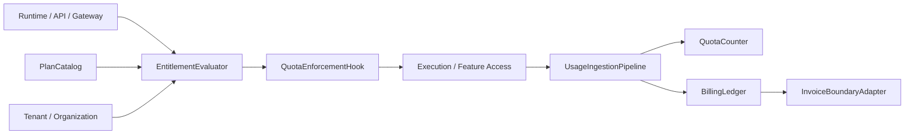

## 5. 核心对象

- `UsageEvent`
- `EntitlementDecision`
- `QuotaCounter`
- `LedgerEntry`
- `PlanEntitlement`
- `BillingPeriod`

## 6. `UsageEvent` 最小字段

| 字段 | 类型 | 说明 |
| --- | --- | --- |
| `usage_id` | `string` | 使用事件 ID |
| `subject_id` | `string` | 产生使用量的主体 |
| `workspace_id?` | `string` | 关联 workspace |
| `tenant_id?` | `string` | 关联 tenant |
| `task_id?` | `string` | 关联任务 |
| `execution_id?` | `string` | 关联 execution |
| `metric_type` | `string` | 指标类型 |
| `quantity` | `number` | 数量 |
| `source` | `runtime \| api \| gateway \| admin` | 来源 |
| `captured_at` | `timestamp` | 采集时间 |

## 7. `PlanEntitlement` 最小字段

- `plan_id`
- `feature_key`
- `limit_type` (`hard | soft | burst`)
- `limit_value`
- `reset_policy`
- `applies_to`

示例：

- 月 token 上限
- 并发 execution 上限
- 可用 workspace 数
- 可启用 Observe source 数

## 8. `EntitlementDecision` 最小字段

- `decision_id`
- `subject_ref`
- `feature_key`
- `allowed`
- `decision_type` (`allow | deny | degrade | warn`)
- `reason?`
- `resolved_at`

规则：

- entitlement 判断必须能在 runtime 执行前做出。
- `degrade` 用于能力降级，而不是完全拒绝。
- `warn` 只能用于不影响安全和账务正确性的软阈值场景。

## 9. `QuotaCounter` 与 `LedgerEntry`

`QuotaCounter` 最小字段：

- `counter_id`
- `subject_ref`
- `metric_type`
- `window_start`
- `window_end`
- `used_quantity`
- `limit_quantity`
- `updated_at`

`LedgerEntry` 最小字段：

- `entry_id`
- `account_ref`
- `period_id`
- `entry_type`
- `amount`
- `currency`
- `source_refs`
- `recorded_at`

规则：

- quota counter 服务实时限制。
- billing ledger 服务账务与审计。
- ledger 不得依赖临时内存累计结果。
- usage event、quota counter、ledger entry 之间必须可对账，不能只依赖最终聚合结果。

## 10. 计量粒度

Phase 3 起至少支持：

- token / model usage
- execution time
- tool call count
- artifact storage bytes
- active workspace count
- premium feature activation count

## 11. 典型判断路径

1. 用户或系统发起动作。
2. runtime / API 先请求 `EntitlementEvaluator`。
3. evaluator 读取 plan entitlement、quota counter、tenant/org 归属。
4. 返回 `allow / deny / degrade / warn`。
5. 动作执行后由 `UsageIngestionPipeline` 回写 usage event。
6. 周期性或准实时聚合进入 quota 与 ledger。

### 11.1 商业化闭环流程图

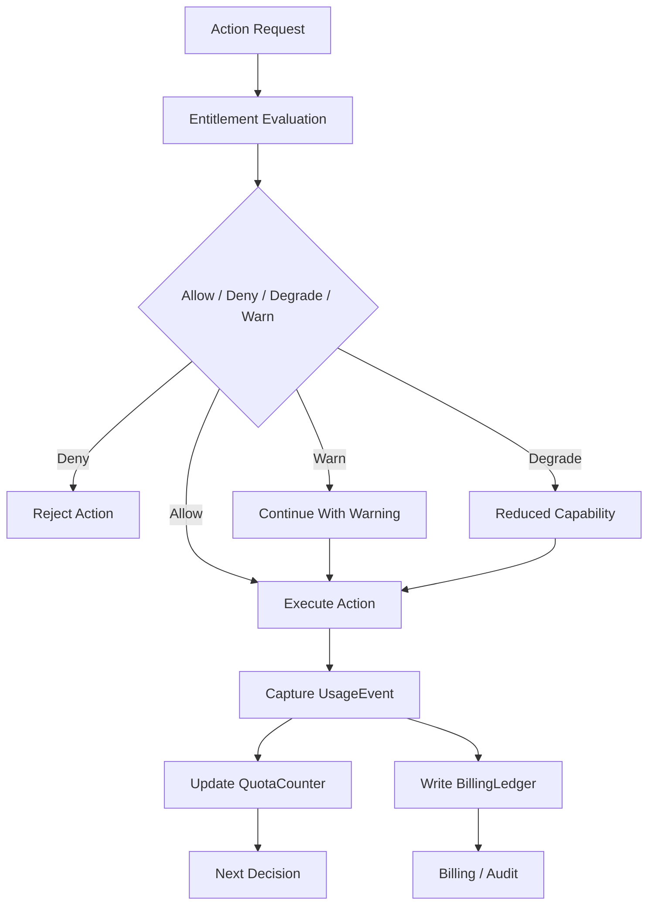

### 11.2 计量对象关系图

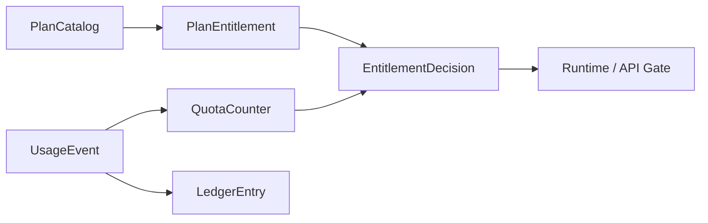

## 12. Quota Enforcement 规则

- quota 超限时必须有统一 `deny / degrade / warn` 语义。
- 高成本或高风险能力优先采用 hard deny。
- 体验类能力可采用 degrade，例如降低并发或延迟执行。
- quota 判断结果应可追溯到 plan entitlement 和当前 counter。
- entitlement 决策不得只依赖过期缓存；若 authoritative counter 不可用，应优先 fail-closed 或保守 degrade。

## 13. Tenant / Organization 关系

- workspace 级套餐可映射到 org / tenant 级账务主体。
- enterprise 结算应支持 organization 级汇总。
- usage event 必须可归集到 workspace、tenant 或 organization。

## 14. 与现有文档的关系

- `billing_and_tenant_contract.md` 是主体模型基线。
- `cost_and_budget_contract.md` 是单次执行预算基线。
- `tenant_and_organization_contract.md` 定义归属边界。
- 本 contract 定义产品收费、配额和账务的完整平台层。

## 15. Failure Mode

需要重点防范：

- 动作执行成功但 usage 未回写。
- ledger 延迟导致账务不一致。
- quota counter 落后导致透支执行。
- organization 汇总时 tenant 归属错误。

处理原则：

- 高成本动作宁可保守 deny，也不应无计量执行。
- usage pipeline 与 ledger pipeline 必须有补偿路径。
- entitlement 决策优先使用 authoritative counter，而不是缓存猜测值。
- 若动作已执行但 usage 未回写，系统必须能通过对账任务补账，而不是默默丢失计量。

## 16. 分阶段引入

- Phase 3: Pro usage metering + entitlement + quota enforcement。
- Phase 4: enterprise ledger、组织结算、审计与发票边界。

## 17. 收口结论

Monetization plane 的核心不是“事后计费”，而是让 runtime、权限、配额和账务在执行前后形成闭环。

后续任何收费能力，只要不能接入 usage、entitlement 和 ledger 三条链，就不应被视为正式商业化能力。
# Perception Intelligence Plane Contract

> 兼容说明：文件名保留以维持历史引用稳定；当前目标态语义对齐 `ObserveHub + AssessHub` 双阶段，而不是单一 perception 平面。

## 1. 范围

本 contract 定义 Observe / Assess 目标态平面，包括 source ingestion、dedupe、context build、assessment 和受控建议输出。

它扩展 `perception_contract.md`，用于回答“系统如何持续收集信号、形成 `TaskSituation`，并在 Assess 阶段给出结构化评估建议”。

## 2. 目标

- 把 Observe 与 Assess 从松散辅助能力提升为独立阶段平面。
- 保证信号流与主任务链解耦，但可通过授权接入执行链。
- 让成本、授权、重复信息和评估质量成为一等能力。

## 3. 关键组件

- `SourceIngestionPipeline`
- `SignalNormalizer`
- `DeduplicationService`
- `TaskSituationBuilder`
- `SystemSituationBuilder`
- `ObservationAggregator`
- `AssessmentEngine`
- `ExecutionOutcomeEvaluator`

## 4. 关键对象

- `ObserveSource`
- `ObserveSignal`
- `SignalCluster`
- `TaskSituation`
- `SystemSituation`
- `UnifiedObservation`
- `UnifiedAssessment`
- `ExecutionAssessment`

## 5. UnifiedAssessment 最小字段

- `assessment_id`
- `task_id`
- `loop_iteration`
- `task_situation_ref`
- `failure_modes`
- `success_criteria`
- `recommended_path`
- `generated_at`

## 5.1 ExecutionAssessment 最小字段（后执行评估）

`ExecutionAssessment` 是 Execute 阶段完成后的四维评估：

- `execution_id`
- `correctness_score`：feedback.signals 中 failure category 比例（0-1）
- `completeness_score`：steps completed / total steps（0-1）
- `efficiency_score`：实际 tokens / 预期 budget 比值（0-1）
- `safety_score`：tool permission denial / sandbox violation signals（0-1）
- `overall_score`：加权平均 (correctness:0.3, completeness:0.3, efficiency:0.2, safety:0.2)
- `verdict`：`pass (≥0.7) | marginal (0.5-0.7) | fail (<0.5)`
- `generated_at`

Verdict 为 `fail` 时自动触发 Replan。

## 6. 行为约束

- Observe / Assess 默认只产生信号、情境和建议，不直接修改主任务链。
- 主动触发任务前必须通过授权、预算和治理校验。
- 重复内容必须经过 dedupe / cluster 处理。
- assessment 产物必须可追溯到 signal ref / task situation ref。

## 7. 与现有文档的关系

- `perception_contract.md` 保留 Observe 最小对象模型。
- 本 contract 定义 Observe + Assess 作为独立平面的完整形态。
- `governance_control_plane_contract.md` 应约束 action proposal / assessment recommendation 的授权路径。

## 8. 分阶段引入

- Phase 3: source ingestion + task situation + assessment MVP。
- Phase 4: enterprise source、团队共享和多租户 Observe/Assess 边界。

## 9. 补充规则

- ranking 至少综合：相关度、重要度、时效性、来源可信度、去重后覆盖度。
- source trust 评分至少分为：`low | medium | high | verified`。
- assessment freshness 应按 source 类型定义 SLA，如高频源短窗口、低频源长窗口。
# Production Storage And Queue Contract

## 1. 范围

本 contract 定义从当前事务存储基线演进到工业级 PostgreSQL + Redis/BullMQ 队列的正式路线。

它回答的问题是：平台进入生产后，哪些数据必须放进 authoritative relational store，哪些职责进入 queue/broker，哪些设计从现在起就必须按 PG 语义约束。

相关文档：

- `storage_schema_contract.md`
- `runtime_repository_and_migration_contract.md`
- `execution_plane_contract.md`
- `event_bus_contract.md`

## 2. 目标

- 把事务真相、队列派发和缓存职责分清。
- 避免实现过度绑定 SQLite 特性。
- 提前冻结 PG 语义优先的 repository / migration 规则。
- 为 Redis/BullMQ 作为 execution queue 提供清晰边界。

## 3. 生产数据分层

| 层 | 主要后端 | 负责内容 |
| --- | --- | --- |
| `transaction store` | PostgreSQL | task、workflow、execution、approval、lease、audit、quota authoritative truth |
| `queue / dispatch` | Redis + BullMQ | execution ticket、delayed queue、retry queue、dead-letter routing |
| `artifact store` | object storage / file store | 大文件、报表、附件、导出包 |
| `knowledge / rollout store` | PostgreSQL + pgvector | knowledge namespace 元数据、semantic vector index、rollout record、strategy lineage |
| `analytics / replay` | PG 副表或后续分析存储 | usage、cost、evaluation、ops aggregation |

## 4. 关键不变量

- authoritative task / execution state 不得只存在于 queue。
- queue 消息丢失后，必须能从 transaction store 重建。
- dispatch queue 负责“投递与重试”，不负责“最终真相状态”。
- PG schema 设计优先于 SQLite 便捷特性。
- rollout / strategy / knowledge namespace 元数据不得只保留在缓存或 artifact 中。
- knowledge semantic embedding 若启用外部向量检索，authoritative vector index 必须可由 PG/pgvector 重建，不得只存在于进程内缓存。

## 5. 生产推荐拓扑

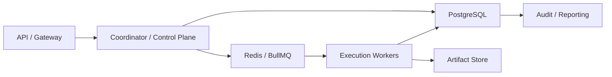

## 6. PostgreSQL 语义要求

- 所有 repository 设计必须兼容行级锁、事务、唯一约束、外键和 JSONB。
- 不得把 SQLite 特有实现方式写成 contract 真相。
- migration 必须从一开始就支持在 PG 上验证。
- 任何“只在 SQLite 下能成立”的 shortcut 都必须登记为技术债。
- knowledge semantic infra 的 target 后端是 `pgvector`；schema 应包含 `knowledge_semantic_vectors` 或等价表，用 `knowledge_ref` 作为稳定键，并保留 `chunk_id`、`document_id`、`namespace`、`embedding_id`、`embedding_model`、`embedding vector(32)`、`updated_at`。
- pgvector extension 缺失时 migration 可以 fail-soft 并保留 notice，但显式选择 `AA_KNOWLEDGE_VECTOR_BACKEND=pgvector` 的 runtime 必须 fail-close。
- semantic query 应通过 `embedding <=> query_vector` 或等价 cosine distance 语义排序，不能把 keyword score 伪装成向量相似度。
- 仓库内必须提供可执行的 pgvector readiness / roundtrip 检查入口；当前以 `knowledge-semantic-readiness` CLI 对 `AA_STORAGE_DRIVER=postgres` + `AA_KNOWLEDGE_VECTOR_BACKEND=pgvector` 执行 extension/table/ivfflat/roundtrip 校验，并在失败时 fail-close。

## 7. Queue 语义要求

- dispatch 至少一次投递。
- queue 消费成功不等于业务成功，必须等待 authoritative writeback。
- delay、retry、dead-letter 由 queue 管理，但 decision source 仍来自 control plane。
- 重复投递必须依赖 idempotency key + fencing token 防护。

## 8. 双跑与迁移建议

工业级推进顺序：

1. repository 先按 PG 语义实现接口。
2. migration 在 SQLite 和 PG 两侧都进行兼容校验。
3. queue 先在单实例模式验证，再上 Redis/BullMQ。
4. 生产前完成 PG + queue 演练，不把切换拖到 Phase 4 以后。

Knowledge semantic infra 迁移路线：

1. `Current`：本地 hash embedding + archive scan / in-memory vector store 可用于开发和无 PG 环境。
2. `Transition`：`SemanticVectorStore` 抽象同时支持 `local_hash` 与 `pgvector`；API 查询路径使用 async retrieval，可等待向量索引写入。
3. `Target`：生产启用 PostgreSQL + pgvector，`knowledge_semantic_vectors` 由 ingestion pipeline 写入，semantic query 走 pgvector distance 排序；snapshot restore 后也必须能回填 semantic vector index。仓库内 readiness CLI 与 roundtrip 校验已完成，但真实 PG 环境仍必须完成 live validation 证据。

## 9. 一致性模型

| 对象 | 一致性 |
| --- | --- |
| task / execution / lease | 强一致 |
| approval decision | 强一致 |
| queue delivery | 至少一次 |
| UI progress | 最终一致 |
| analytics aggregation | 延迟一致 |

## 10. 失败与回退

- Redis/BullMQ 不可用时，系统应进入 admission control 或降级，不得默默丢任务。
- PG 不可写时，不得继续接受需要 authoritative state 的任务。
- 当 `AA_STORAGE_DRIVER=postgres` 时，startup preflight / doctor 必须先对 DSN、SSL、pool sizing、dual-run 开关与 shadow SQLite 路径完成 fail-close 校验，未通过不得启用 postgres driver。
- queue 与 DB 写入不一致时，应优先相信 DB 真相并触发 repair job。

## 11. Phase 边界

当前：

- 文档和 repository 先按 PG/queue 语义设计
- 允许实现仍从单机基线起步

进入生产前必须完成：

- PG migration compatibility test
- queue replay / duplicate delivery drill
- DB/queue 断连故障演练
- rollout / strategy lineage consistency drill

## 12. 收口结论

工业级生产不能把 PostgreSQL 和 queue 只当“未来替换件”。

从文档和 contract 起，就必须按“事务真相在 PG、调度投递在 queue、重复投递由幂等与 fencing 兜底”的结构设计。
# Project Structure Contract

## 1. 范围

本 contract 定义进入 Phase 1a-4 实现时的顶层目录、源码分层、配置分层和事业部目录约定。

## 2. 顶层目录

Phase 1a 允许并推荐存在以下顶层目录：

- `doc/`: 文档体系与规范
- `src/`: 平台源码
- `config/`: 运行时与平台级配置
- `divisions/`: 事业部定义与角色素材
- `tests/`: 测试代码与 fixture
- `scripts/`: 开发、迁移、运维辅助脚本
- `data/`: 本地开发期 SQLite、artifact、临时持久化目录

禁止事项：

- 不在 `src/` 下混入 `.venv`、`node_modules`、缓存和运行产物。
- 不把平台级 YAML/JSON 配置散落到 `src/` 内。
- 不把事业部 prompt 直接写死在 runtime 代码中。

## 3. `src/` authoritative 结构

Phase 1a 的推荐结构：

```text
src/
  core/
    api/
    artifacts/
    config/
    divisions/
    events/
    memory/
    observability/
    providers/
    runtime/
    security/
    storage/
    tools/
    workflow/
    types/
    approvals/
    agent-loop/
    assessment/
    feedback/
    improvement/
    learning/
    planning/
    cost/
    queue/
  gateway/
    stream/
    targets/
  cli/
```

规则：

- `core/` 只放平台核心域模型和运行逻辑。
- `gateway/` 负责渠道适配，不拥有任务编排语义。
- API、tools、providers、division loader 在当前实现中统一收敛在 `src/core/` 下，而不是拆成 `src/server/` / `src/tools/` / `src/providers/` 顶层目录。
- `src/core/divisions/` 只负责加载定义，不承载事业部业务内容本身。

可预留但非 Phase 1a 必做目录：

```text
src/
  core/
    memory/
  supervisor/
  plugins/
  domains/
```

说明：

- `memory/`、`supervisor/`、`plugins/`、`domains/` 可以为后续阶段预留目录，但不应被误判为 Phase 1a 当前必做交付物。
- 当前 Observe 语义优先收敛在 `src/core/observability/`、`src/core/agent-loop/` 与 `src/core/assessment/`，而不是新增顶层 `perception/` 目录。
- 若未来需要把 `api` / `tools` / `providers` 从 `src/core/` 进一步拆到顶层目录，必须先更新本 contract，再做迁移。

## 4. `config/` authoritative 结构

```text
config/
  bootstrap/
  runtime/
  security/
  providers/
  gateways/
  workflows/
```

含义：

- `bootstrap/`: 平台启动时必须加载的基础配置。
- `runtime/`: 并发、超时、重试、队列等运行参数。
- `security/`: 权限、审批阈值、危险操作策略。
- `providers/`: LLM provider、模型路由、降级策略。
- `gateways/`: CLI/Web/Telegram 等渠道配置。
- `workflows/`: HQ 级共享 workflow 模板。

补充说明：

- 配置四层优先级、prompt / config / policy / flag 解耦、默认值注册中心以下钻文档 `configuration_layers_and_defaults_contract.md` 为准。

## 5. `divisions/` authoritative 结构

```text
divisions/
  <division-id>/
    division.yaml
    roles/
      <role-id>.prompt.md
    workflows/
      *.yaml
    schemas/
      *.json
```

规则：

- 每个事业部必须有唯一 `division.yaml` 作为入口。
- `roles/` 只保存角色提示与角色说明，不保存运行时状态。
- `workflows/` 只保存声明式流程定义。
- `schemas/` 保存该事业部输入输出、artifact 或表单的结构约束。

## 6. `data/` 结构约束

Phase 1a 本地开发可采用：

```text
data/
  sqlite/
  artifacts/
  logs/
```

规则：

- SQLite 文件、artifact 和日志物理隔离。
- `data/` 仅用于本地或单机开发环境，不作为长期生产设计事实源。

## 7. 所有权与变更约束

- 目录结构变更应先改本 contract，再改 `01` ~ `07`、`operations/` 与对应实现。
- 若需要引入 `apps/` 多进程结构，应新增 ADR，并更新本 contract。
- Phase 1a 不引入过早的微服务拆分。

## 8. 补充规则

- `server/api` 目录按资源命名，如 `tasks/`、`approvals/`、`health/`，避免按 HTTP 动词拆分。
- `tests/` 最少分为 `unit/`、`integration/`、`e2e/` 三层，fixture 与 replay 资源单独放在共享目录。
- 生产环境不依赖本地 `data/`，应替换为数据库、对象存储和集中日志/审计后端。
# Remote Coordination And Disaster Recovery Contract

## 1. 范围

本 contract 定义 Bridge / Worker 远程协调场景下的文件一致性、远程执行观测和异地容灾边界。

相关文档：

- `execution_plane_contract.md`
- `ha_coordinator_and_leader_election_contract.md`
- `tenant_isolation_and_shared_worker_safety_contract.md`
- `production_storage_and_queue_contract.md`

## 2. 目标

- 让远程 worker 不只是“能连上”，而是具备一致性和可恢复性。
- 让跨区域协调、worker 失联和同步断裂有正式恢复路径。
- 为未来 coordinator 集群和区域级故障切换建立事实源。

## 3. 远程文件一致性

至少定义：

- 冲突检测
- 增量校验
- hash 对账
- 会话断线后的同步恢复
- 大文件同步限速
- 同步失败后的阻断执行规则

## 4. 远程执行观测

每个远程 worker 至少上报：

- saturation
- active lease count
- mean startup latency
- sandbox success rate
- repo cache hit rate

还应至少支持：

- bridge credential refresh 成功率
- stream resume 成功率
- last acknowledged stream offset
- reconnect 后 session consistency check 结果

远程会话状态至少区分：

- `connecting`
- `connected`
- `reconnecting`
- `degraded`
- `failed`
- `viewer_only`

## 5. 容灾能力

成熟工业平台应逐步支持：

- 区域级故障切换
- worker 跨区域重分配
- metadata store 主从切换
- queue / lease repair

## 6. 关键不变量

- 远程 worker 失联后，旧租约不得继续写回 authoritative state。
- 文件同步状态必须可验证，不得仅依赖“上次看起来成功”。
- 区域级切换后，control plane 必须能判断哪些 execution 需要重建、哪些只需重连。
- 同步 hash 不一致、repo version 不一致或 lease 归属不一致时，默认不得继续执行。
- bridge 凭证刷新后，新的 epoch / session generation 必须覆盖旧 transport 的写权限。
- 远程流恢复应从已确认 offset 继续，而不是默认全量重放。
- `viewer_only` 会话可以消费日志和状态，但不得发送中断、批准、派发或写回 authoritative state。
- transient reconnect 与 permanent disconnect 必须在事件和 UI 层显式区分，避免把短时抖动误判为最终失败。

## 7. 拓扑示意

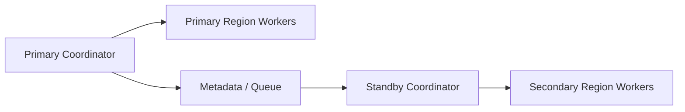

## 8. 收口结论

远程协调进入工业级后，重点不再是“能不能派发”，而是：

- 文件和状态是否一致
- worker 失联后是否可安全回收
- 区域故障后是否可控切换
- 不一致时是否能及时阻断、重建并给出明确恢复路径

补充说明：

- 当前只借鉴远程桥接中的 token refresh、401 恢复、offset 续流等通用模式。
- 不把外部系统的专有 session / bridge 协议直接写成本系统事实源。
# Runtime Repository And Migration Contract

## 1. Scope

This contract defines Phase 1a runtime persistence layer authoritative rules for "code interface layer" and "database migration layer".

It answers two questions:

- Which repository should read and write runtime-related data.
- What rules should schema changes, initial table creation, and subsequent migration comply with.

Related documents:

- `runtime_execution_contract.md` defines runtime run execution semantics.
- `storage_schema_contract.md` defines final table structure, indexes, foreign keys, and transaction boundaries.
- `runtime_state_machine_contract.md` defines whether state transitions are legal.

## 2. Goals

Phase 1a repository layer should satisfy:

- Can reliably create and update `executions` main record.
- Can persist `execution_prechecks`, `dead_letters`, `heartbeat_snapshots`.
- Can rebuild "which runs are executing, which runs are blocked, which runs are dead-letter" after crash recovery.
- Can let migration initialize SQLite in idempotent, auditable, replayable way.

## 3. Repository Boundaries

Phase 1a minimum requires the following repositories:

- `ExecutionRepository`
- `ExecutionPrecheckRepository`
- `DeadLetterRepository`
- `HeartbeatSnapshotRepository`
- `SessionRepository`
- `EventAckRepository`
- `FileLockRepository`
- `RuntimeRecoveryRepository`

Rules:

- Repository is responsible for authoritative persistence, does not undertake business orchestration.
- Workflow orchestration layer must not directly scatter-write SQL to multiple runtime tables bypassing repository.
- Repository return value must be sufficient to support runtime recovery, not just return boolean.

## 4. `ExecutionRepository` Contract

Minimum method set:

- `createExecution(input)`
- `getExecutionById(executionId)`
- `listExecutionsByTask(taskId)`
- `markExecutionStarted(executionId, startedAt)`
- `markExecutionBlocked(executionId, reasonCode, updatedAt)`
- `createRetryExecution(input)`
- `markExecutionSucceeded(executionId, finishedAt)`
- `markExecutionFailed(executionId, errorCode, errorMessage, finishedAt)`
- `markExecutionCancelled(executionId, reasonCode, finishedAt)`
- `attachExecutionError(executionId, errorCode, errorMessage, updatedAt)`

Behavioral constraints:

- `createExecution` must write initial attempt, trace, guardrail parsing result.
- Retry should not be implemented through original execution entering independent `retrying` state, but should create new attempt execution and retain lineage.
- Terminal state methods must not overwrite existing terminal state, unless it is explicitly recovery-generated new execution.
- State progression must align with `runtime_state_machine_contract.md`.

## 5. `ExecutionPrecheckRepository` Contract

Minimum method set:

- `savePrecheckResult(input)`
- `getPrecheckByExecutionId(executionId)`
- `replacePrecheckResult(input)` only available when repository explicitly uses upsert strategy

Rules:

- Phase 1a defaults to keeping only one authoritative precheck result per execution.
- Precheck result must be queryable before execution enters `executing / blocked / failed`.
- Not allowed to only log precheck, with no record in database.

## 6. `DeadLetterRepository` Contract

Minimum method set:

- `moveExecutionToDeadLetter(input)`
- `getDeadLetterByExecutionId(executionId)`
- `listDeadLettersByTask(taskId)`

Rules:

- Same execution can only enter dead-letter once.
- Dead-letter record must retain final error reason, retry count, and timestamp.
- Dead-letter is not a substitute for task main state machine; repository must not implicitly rewrite task terminal state.

## 7. `HeartbeatSnapshotRepository` Contract

Minimum method set:

- `appendHeartbeatSnapshot(input)`
- `getLatestHeartbeat(executionId)`
- `listRecentHeartbeats(executionId, limit)`
- `pruneHeartbeatSnapshots(beforeTimestamp)`

Rules:

- High-frequency heartbeat defaults to writing snapshot, does not guarantee every heartbeat is permanently retained.
- `getLatestHeartbeat` should serve supervisor's liveness judgment.
- `pruneHeartbeatSnapshots` is a maintenance action, must not delete latest snapshot still used for recovery judgment.

## 8. `RuntimeRecoveryRepository` Contract

Minimum method set:

- `listRecoverableExecutingRuns(now)`
- `listBlockedRunsAwaitingApproval()`
- `listStaleRuns(staleBefore)`
- `buildRuntimeRecoveryView(taskId)`

Return result at minimum should contain:

- `execution_id`
- `task_id`
- `status`
- `attempt`
- `trace_id`
- `last_heartbeat_at?`
- `latest_precheck?`
- `latest_error_code?`

Rules:

- This repository can compose reading multiple tables, but exposes unified recovery view to upper layer.
- Its output must be sufficient for runtime to decide "resume / retry / manual takeover / dead-letter".

## 9. `SessionRepository` and `EventAckRepository` Contract

`SessionRepository` minimum method set:

- `createSession(input)`
- `getSessionById(sessionId)`
- `markSessionStreaming(sessionId, updatedAt)`
- `markSessionAwaitingUser(sessionId, updatedAt)`
- `markSessionCompleted(sessionId, updatedAt)`
- `markSessionFailed(sessionId, updatedAt)`
- `markSessionCancelled(sessionId, updatedAt)`

Rules:

- Session status can only express channel interaction progress, must not override task / workflow / execution truth state.
- Session terminal state closure must be consistent with or explainable from task terminal state.

`EventAckRepository` minimum method set:

- `registerConsumerAck(eventId, consumerId)`
- `markEventAcked(eventId, consumerId, ackedAt)`
- `markEventAckFailed(eventId, consumerId, errorCode, attemptedAt)`
- `listPendingAcksByConsumer(consumerId, limit)`

Rules:

- `event_id + consumer_id` must be unique.
- Ack status update must not overwrite other consumer's confirmation result.
- Tier 1 event recovery scan should rely on ack records, not rely on single event-level boolean judgment.

`FileLockRepository` minimum method set:

- `acquireLock(input)`
- `renewLock(lockId, expiresAt)`
- `releaseLock(lockId)`
- `releaseAllByExecution(executionId)`
- `listExpiredLocks(now)`
- `listLocksByPath(normalizedPath)`

Rules:

- Reentrant lock of `normalized_path + holder_execution_id + mode` should be identifiable.
- Write lock mutex constraint must be guaranteed by authoritative persistence layer, not just by in-memory judgment.
- Expired lock cleanup and holder execution stale judgment must be composable in query.

## 10. Transaction Boundaries

The following actions should be completed in the same transaction as much as possible:

- Creating execution + initial status write.
- Saving precheck result + execution state progression.
- Execution entering `blocked` + approval request write.
- Execution entering terminal state + last error message write.
- Execution dead-letter + dead-letter record write.
- Event write + initial consumer ack registration.
- File lock expiration recovery + holder execution stale judgment result write recovery event.

Rules:

- If cannot achieve single transaction, must ensure recovery path can identify "half-completed write" and compensate.
- Repository must not split multi-table critical updates into completely unrelated fire-and-forget operations.

## 11. Migration Directory and Naming Rules

Phase 1a recommends:

- Directory: `src/core/storage/migrations/`
- Filename: `0001_initial_runtime_schema.sql`, `0002_add_runtime_indexes.sql`

Rules:

- Migration number must be monotonically increasing, not allowed to reorder historical numbers.
- Migration already executed in shared environment must not be directly rewritten, only subsequent migration can be added.
- Initial schema and subsequent incremental migration must be distinguishable.

## 12. Migration Content Rules

Each migration must:

- Be idempotent or at least be able to clearly determine whether executed.
- Try to do only one type of change: create table, add index, add column, backfill data.
- Avoid doing structural change and complex data repair in the same migration.

Phase 1a special rules:

- `0001` should be able to independently initialize runtime-related core tables.
- Create table migration must explicitly enable and rely on `PRAGMA foreign_keys = ON` running strategy.
- If SQLite does not support lossless change, explicitly handle through "new table + data migration + replacement" strategy.

## 13. Migration Ledger

System should maintain migration ledger, minimum fields:

- `version`
- `name`
- `applied_at`
- `checksum?`

Rules:

- Runtime start should be able to determine whether current database schema is lagging.
- If missing critical migration is found, default fail-closed, should not run quietly with incomplete schema.

## 14. Rollback and Compatibility Rules

- Phase 1a prioritizes forward fix, does not take "automatic down migration" as default capability.
- Destructive schema change must first add compatibility layer, then do data migration.
- Repository interface change if affecting field semantics, must update contract first, then change implementation.

## 15. Testing and Verification Requirements

At minimum should cover the following verification:

- Migration initializes successfully from empty database.
- Migration repeated execution does not destroy schema.
- Repository can correctly persist execution lifecycle.
- Precheck / dead-letter / heartbeat query interface can support supervisor and recovery process.
- Session state progression does not conflict with task / workflow truth state.
- Event ack query can identify "a consumer has not acknowledged" rather than just identify "event not consumed".
- File lock query can identify shared read lock, exclusive write lock, reentrant lock, and expired lock.
- Under crash recovery scenario, `RuntimeRecoveryRepository` can identify stale / blocked / recoverable run.

## 16. Supplementary Rules

- After PG migration, repositories at minimum split into transaction repositories and queue/lease support repositories.
- Migration checksum must be stably recalculable; if introducing signature, signature only enhances release credibility, does not replace checksum.
- Phase 1b multi-worker scenario should add `LeaseRepository`, and maintain explainable transaction boundary with `ExecutionRepository`.
# Supply Chain And Dependency Security Contract

## 1. 范围

本 contract 定义依赖、插件、skill、MCP 和第三方分发单元的供应链安全基线。

相关文档：

- `tool_skill_plugin_contract.md`
- `ecosystem_extension_plane_contract.md`
- `enterprise_secret_management_contract.md`
- `sandbox_and_auth_contract.md`

## 2. 目标

- 降低第三方依赖、插件和外部执行单元带来的供应链风险。
- 让安装、更新、签名、扫描、隔离等级有统一规则。
- 为工业级审计和准入提供可追溯证据。

## 3. 最小要求

- 依赖锁定
- 包来源校验
- 签名或完整性校验
- SBOM 生成
- 漏洞扫描
- 第三方插件隔离等级

## 4. 分发单元分类

| 类型 | 最低要求 |
| --- | --- |
| `first_party tool` | locked dependency + review evidence |
| `skill bundle` | source provenance + permission declaration |
| `plugin bundle` | signature / digest + capability declaration |
| `MCP server` | trust level + isolation level + domain allowlist |

## 5. 隔离等级

- `trusted_first_party`
- `reviewed_partner`
- `untrusted_third_party`

规则：

- `untrusted_third_party` 不得默认获得 destructive 权限。
- MCP 不得伪装成本地 trusted tool。
- 插件权限不得绕过 ToolRegistry 和 Policy Engine。

## 6. 安全检查流程

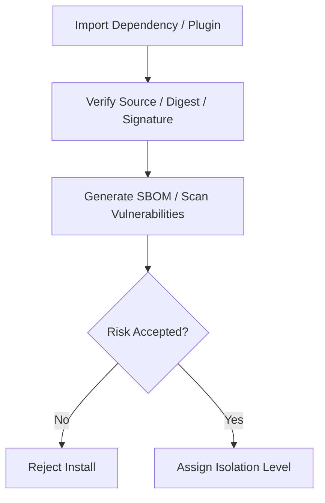

## 7. 审计要求

必须记录：

- install source
- version / digest
- approver
- granted capability scope
- scan result summary
- disable / revoke action

## 8. 收口结论

工业级扩展生态不能只问“能不能装上去”。

它必须同时回答：

- 来源是否可信
- 权限是否最小
- 更新是否可追踪
- 出问题时能否快速禁用和追责
# Task Lease And Fencing Contract

## 1. 范围

本 contract 定义工业级执行平面里的任务租约、续约、回收和 fencing token 规则。

它回答的问题是：当 execution 被派发到 worker 后，系统如何保证只有当前合法持有者能继续写结果，避免双写、脏写和 stale worker 回写。

相关文档：

- `runtime_execution_contract.md`
- `execution_plane_contract.md`
- `storage_schema_contract.md`
- `distributed_locking_contract.md`

## 2. 目标

- 为每个 active execution 建立 authoritative lease。
- 用 `visibility timeout` 和 `lease renew` 控制执行权生命周期。
- 用 `fencing token` 拒绝旧 worker 的回写。
- 让恢复、接管、重试和死信进入统一链路。

## 3. 非目标

- 本 contract 不规定具体队列产品。
- 本 contract 不替代任务主状态机。
- Phase 1a 不要求完整分布式部署，但 contract 从一开始按多 worker 语义定义。

## 4. 关键对象

- `LeaseGrant`
- `LeaseRenewal`
- `LeaseReclaimDecision`
- `FencingToken`
- `StaleWriteRejection`
- `QueueDispatchRecord`
- `LeaseAuditRecord`
- `LeaseReconciliationRecord`

## 5. `LeaseGrant` 最小字段

| 字段 | 类型 | 说明 |
| --- | --- | --- |
| `lease_id` | `string` | 租约 ID |
| `execution_id` | `string` | 目标 execution |
| `worker_id` | `string` | 当前持有者 |
| `attempt` | `integer` | execution attempt |
| `fencing_token` | `integer` | 单调递增执行权版本 |
| `leased_at` | `timestamp` | 获取时间 |
| `expires_at` | `timestamp` | 当前到期时间 |
| `status` | `active \| expired \| released \| reclaimed \| handed_over` | 租约状态（`handed_over` 见 §8A lease handover，对齐 `execution_plane_contract.md` §9） |

规则：

- 同一 `execution_id` 在任一时刻只能有一个 `active` lease。
- 每次重新派发、接管或回收后重新授予 lease 时，`fencing_token` 必须递增。
- 任何副作用写入都必须带上当前 `fencing_token`。

## 6. 生命周期

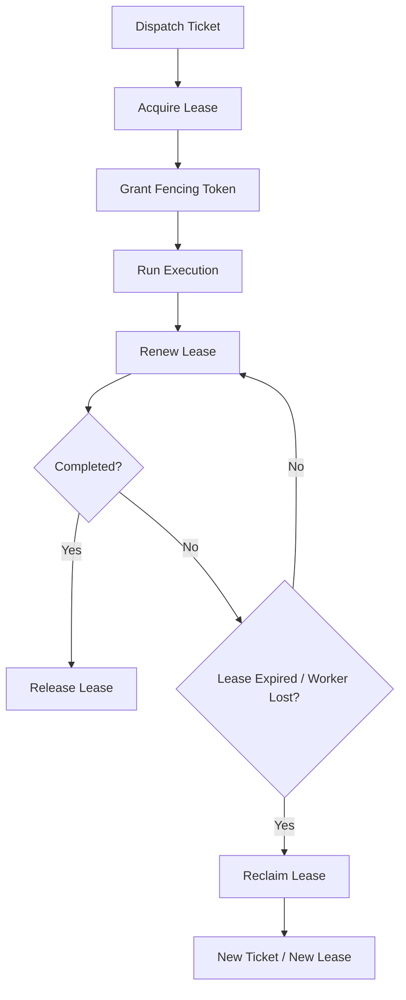

## 7. 续约与回收

- worker 必须在 `expires_at` 前完成续约。
- 连续续约失败达到阈值后，lease 进入 `expired`，原 worker 失去执行权。
- 回收动作必须记录 `reason_code`，如：
  - `heartbeat_missing`
  - `worker_disconnected`
  - `worker_unhealthy`
  - `operator_takeover`
  - `budget_forced_stop`

## 8. Fencing Token 规则

- `fencing_token` 是 execution 写权限版本号，不是展示字段。
- storage 层更新 execution、artifact、step output、tool result 时必须比较 token。
- 小于当前 authoritative token 的写入必须被拒绝，并记录 `stale_write_rejected` 审计事件。
- worker 本地缓存的旧 lease 即使尚未感知过期，也不得被系统接受。

## 8A. Lease Handover

### 8A.1 语义

Handover 是指在不中断 execution 的前提下，由当前 worker 主动将 lease 转移给新 worker 的受控操作。与 lease 过期后的被动回收不同，handover 是协作式的、可追踪的。

### 8A.2 `HandoverExecutionLeaseInput`

| 字段 | 类型 | 说明 |
| --- | --- | --- |
| `leaseId` | `string` | 当前 active lease |
| `workerId` | `string` | 原 worker（必须是当前持有者） |
| `newWorkerId` | `string` | 目标 worker |
| `ttlMs` | `number` | 新 lease 的存活时间 |
| `reasonCode?` | `string` | handover 原因（如 `worker_draining`、`load_rebalance`、`upgrade_migration`） |

### 8A.3 `ExecutionLeaseHandoverDecision`

| 字段 | 类型 | 说明 |
| --- | --- | --- |
| `outcome` | `handed_over \| blocked` | 结果 |
| `reasonCode` | `string?` | 如果被阻塞，原因码 |
| `previousLease` | `ExecutionLeaseRecord?` | 原 lease（已标记 `released`） |
| `lease` | `ExecutionLeaseRecord?` | 新 lease（新 fencing token） |

### 8A.4 规则

- handover 必须在单个事务内完成：释放旧 lease → 创建新 lease → 递增 fencing token → 更新 execution owner 和 worker snapshot。
- 只有 `active` 状态的 lease 才能 handover。
- 旧 lease 的 `workerId` 必须匹配请求中的 `workerId`。
- handover 完成后必须写入 `lease_audit`（event_type: `handover`），记录 source worker、target worker 和 lineage。
- handover 失败不应导致 execution 变为无主状态。

### 8A.5 典型场景

| 场景 | 触发方 | reasonCode |
| --- | --- | --- |
| worker 进入 draining | worker 自身 | `worker_draining` |
| 负载再平衡 | control plane | `load_rebalance` |
| 滚动升级 | 运维 | `upgrade_migration` |
| 运维主动切换 | operator | `operator_handover` |

## 9. 与恢复链的关系

- lease 过期不等于任务失败。
- lease 过期后，系统应进入恢复判断：
  - `resume_same_worker`
  - `retry_new_ticket`
  - `manual_takeover`
  - `move_dead_letter`

## 10. 队列绑定与审计

`QueueDispatchRecord` 最小字段：

- `dispatch_id`
- `execution_id`
- `queue_name`
- `enqueued_at`
- `dequeued_at?`
- `worker_id?`
- `lease_id?`
- `status` (`queued | dequeued | leased | completed | abandoned`)

`LeaseAuditRecord` 最小字段：

- `audit_id`
- `execution_id`
- `lease_id`
- `worker_id`
- `event_type` (`lease_granted | lease_renewed | lease_expired | lease_reclaimed | stale_write_rejected | lease_released`)
- `reason_code?`
- `recorded_at`

规则：

- dispatch、lease 和最终写权限拒绝必须能串成一条审计链。
- queue 状态用于回答“任务是否已经被派发、是否已被取走、是否已获得 lease”。
- stale write rejection 必须写入 lease 审计，而不能只落到临时日志里。

## 11. Reconciliation

`LeaseReconciliationRecord` 最小字段：

- `reconciliation_id`
- `execution_id`
- `lease_id`
- `issue_type` (`stale_lease | duplicate_owner | replay_recovery_needed | orphan_queue_claim`)
- `detected_at`
- `resolution_action` (`extend | release | reclaim | handover | block_for_manual`)
- `resolved_at?`

### 11.1 Dispatch Reconciliation 扫描

Reconciliation 服务扫描所有 `pending` 或 `claimed` 状态的 execution ticket，检测以下异常：

| issue_type | 检测条件 | 修复动作 |
| --- | --- | --- |
| `execution_terminal` | ticket 关联的 execution 已达终态（`succeeded / failed / cancelled / superseded`） | 作废 ticket（不生成替代 ticket） |
| `missing_active_lease` | ticket 已被 claim 但无 active lease | 作废旧 ticket + 创建替代 ticket（requeue） |
| `lease_ticket_mismatch` | lease 的 leaseId 或 workerId 与 ticket 不匹配 | 作废旧 ticket + 创建替代 ticket |
| `lease_expired_unreclaimed` | lease 已过 `expires_at` 但未被回收 | 作废旧 ticket + 创建替代 ticket |

### 11.2 Requeue 语义

替代 ticket 继承原 ticket 的以下属性：

- `execution_id`、`priority`、`queue_name`
- `dispatch_target`、`required_isolation_level`、`required_capabilities`
- `dispatch_after`

替代 ticket 重置：`status = pending`、新的 `ticket_id`、新的 `created_at`。

### 11.3 Reconciliation 事件

| 事件 | 含义 |
| --- | --- |
| `dispatch:ticket_reconciled` | ticket 因 issue 被作废 |
| `dispatch:ticket_requeued` | 新替代 ticket 被创建 |

两者在同一事务内原子发出，事件 payload 必须包含 `issueType` 和 `reasonCode`。

### 11.4 规则

- 系统必须周期性扫描 stale lease、duplicate owner 和 orphan queue claim。
- reconciliation 是 authoritative repair 行为，不得只依赖人工日志排查。
- duplicate owner 决议后，必须显式记录 winner，并对 loser 写入 stale/fenced 结果。
- terminal execution 的 ticket 只作废不 requeue，避免为已完成的执行创建无效 ticket。

## 12. 一致性要求

工业级最低一致性要求：

- execution 当前 lease：强一致
- fencing token 比较：强一致
- heartbeat 展示：最终一致
- worker UI 状态：最终一致

## 13. Phase 边界

Phase 1a / 1b：

- 允许单实例 control plane
- 允许 lease authoritative store 暂落在 SQLite/PG 抽象之下
- 必须先把 token 语义和 stale write rejection 定死

Phase 2+：

- 扩展到多 worker、多 queue、多租户隔离

## 14. 收口结论

Lease 解决“谁现在可以执行”，fencing token 解决“谁现在可以写结果”。

工业级系统必须同时具备这两层，才能避免重复执行和旧结果覆盖新结果。
# Tenant And Organization Contract

## 1. 范围

本 contract 定义最终平台的用户、workspace、organization、tenant 与 enterprise 私有化边界。

它扩展 `billing_and_tenant_contract.md`，用于回答“谁属于谁、哪些数据与权限需要隔离、哪些资源在什么层被拥有”。

## 2. 目标

- 明确 `user / workspace / organization / tenant` 的层级关系。
- 明确存储、身份、策略、artifact 和审计的 tenant-aware 边界。
- 为 enterprise 私有化、组织级运营和账务归集打基础。

## 3. 非目标

- 本 contract 不直接定义 payment provider 或发票流程。
- 本 contract 不替代 auth provider 的技术实现细节。
- 本 contract 不要求 Phase 1a 就实现完整 enterprise 组织树。

## 4. 层级模型

`UserAccount -> Workspace -> Organization -> Tenant`

解释：

- `UserAccount` 是身份主体。
- `Workspace` 是默认的产品使用边界和协作边界。
- `Organization` 是多 workspace 的经营与治理归属。
- `Tenant` 是最终存储、策略、部署和审计的隔离边界。

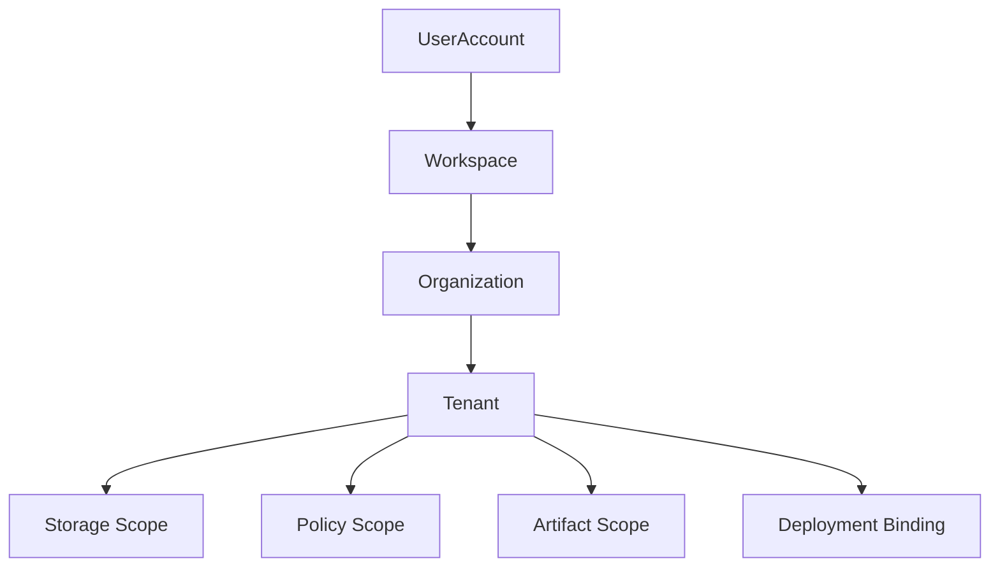

## 5. 分阶段落地策略

- Phase 3 可先启用 `UserAccount + Workspace`。
- Phase 4 再补 `Organization + Tenant` 的正式治理模型。
- Enterprise 私有化必须以 `Tenant` 为最终隔离单位。

## 6. 关键对象

- `UserAccount`
- `Workspace`
- `WorkspaceMembership`
- `Organization`
- `OrganizationMembership`
- `Tenant`
- `TenantIsolationMode`
- `DeploymentBinding`

## 7. `Workspace` 最小字段

| 字段 | 类型 | 说明 |
| --- | --- | --- |
| `workspace_id` | `string` | workspace ID |
| `owner_id` | `string` | workspace owner |
| `display_name` | `string` | 展示名 |
| `plan_id` | `string` | 当前套餐 |
| `default_policy_set` | `string` | 默认治理集 |
| `organization_id?` | `string` | 所属组织 |
| `created_at` | `timestamp` | 创建时间 |

## 8. `Organization` 最小字段

- `organization_id`
- `display_name`
- `billing_account_id`
- `default_tenant_id`
- `created_at`

## 9. `Tenant` 最小字段

- `tenant_id`
- `organization_id`
- `storage_scope`
- `identity_scope`
- `policy_scope`
- `artifact_scope`
- `deployment_mode`
- `created_at`

## 10. `TenantIsolationMode`

建议枚举：

- `shared_logical`
- `shared_hard_scoped`
- `dedicated_runtime`
- `dedicated_environment`

说明：

- `shared_logical`: 适合早期 Pro / 小团队。
- `shared_hard_scoped`: 共享基础设施但在数据与权限层硬隔离。
- `dedicated_runtime`: 运行资源独立。
- `dedicated_environment`: 私有化或企业专属环境。

## 11. Membership 规则

`WorkspaceMembership` 至少包括：

- `workspace_id`
- `user_id`
- `role`
- `joined_at`

`OrganizationMembership` 至少包括：

- `organization_id`
- `user_id`
- `role`
- `joined_at`

规则：

- 用户可属于多个 workspace。
- workspace 可属于一个 organization。
- organization 负责集中治理、账务和 tenant 分配。

## 12. 隔离边界

必须显式按 tenant 隔离的域包括：

- transaction data
- artifact/object
- identity/session
- policy / governance
- audit / observability
- billing / entitlement

规则：

- Pro 与 Enterprise 的差异不能只靠 UI 或配置约定表达。
- 跨 tenant 的引用、搜索和 artifact 访问必须默认拒绝。
- tenant scope 必须能贯穿 execution、artifact、analytics 和审计链。
- tenant scope 必须能贯穿 cache key、debug dump、inspect API 和人工接管动作。
- tenant / organization 迁移不得静默改写历史归属；必须保留映射变更审计与可追溯 lineage。

### 12.1 隔离边界图

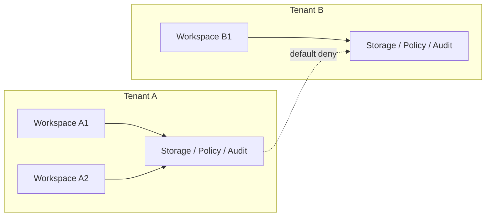

### 12.2 组织与部署绑定图

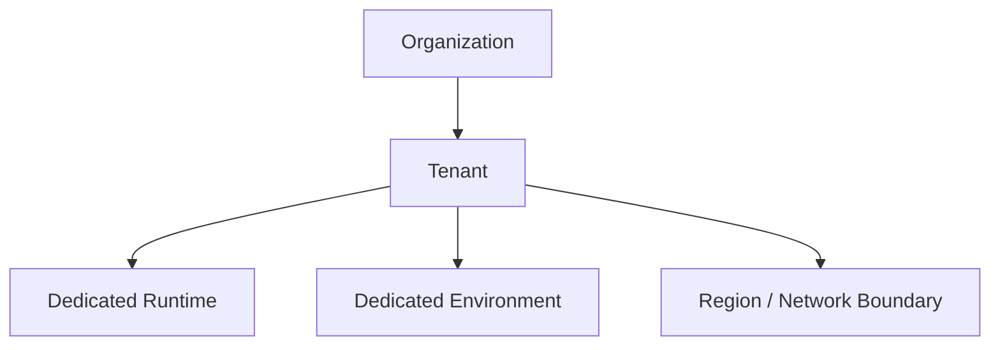

## 13. Deployment 绑定

`DeploymentBinding` 最小字段：

- `binding_id`
- `tenant_id`
- `environment_id`
- `deployment_mode`
- `region`
- `network_boundary`
- `created_at`

用途：

- 说明某 tenant 对应哪套运行环境。
- 支撑 enterprise 私有化、region 限制和合规要求。

## 14. Cross-Tenant 规则

默认规则：

- 跨 tenant 数据访问默认拒绝。
- 跨 tenant 搜索默认拒绝。
- 跨 tenant artifact 分享必须走显式授权或脱敏导出。
- 跨 tenant replay / analytics 聚合必须是治理允许的特例。
- 任何跨 tenant 特例都必须显式记录 policy、审批或治理依据，默认不得依赖代码内置豁免。

## 15. 与计量和治理的关系

- `monetization_metering_plane_contract.md` 负责 usage / entitlement / ledger。
- tenant / organization contract 负责这些账务对象的归属边界。
- `governance_control_plane_contract.md` 负责跨 tenant 管理动作的治理入口。

## 16. Failure Mode

需要重点防范：

- identity scope 正确，但 artifact scope 泄漏。
- workspace 迁移 organization 后遗留旧 tenant 引用。
- enterprise 私有化环境与 tenant 映射不一致。
- 跨 tenant analytics 聚合反向暴露敏感信息。

处理原则：

- 隔离错误优先 fail-closed。
- tenant boundary 相关变更必须带审计与迁移计划。
- 若 tenant / deployment binding 不一致，应优先阻断执行，而不是继续在错误隔离面上运行。

## 17. 分阶段引入

- Phase 3: workspace / Pro 边界与基础成员关系。
- Phase 4: organization / tenant / private deployment / enterprise isolation。

## 18. 收口结论

Tenant and organization plane 的核心不是“多一个 tenant_id 字段”，而是把产品层协作、平台层隔离、企业层部署绑定到同一套层级模型中。

后续所有 enterprise、billing、policy 和 deployment 设计，都应先回到这份 contract 的层级定义上。
# Tenant Isolation And Shared Worker Safety Contract

## 1. 范围

本 contract 定义多租户环境下，shared worker、shared cache 和 shared queue 的安全边界。

相关文档：

- `tenant_and_organization_contract.md`
- `enterprise_secret_management_contract.md`
- `data_classification_and_prompt_handling_contract.md`

## 2. 目标

- 防止跨租户数据污染。
- 防止共享 worker 复用过程中残留上下文泄露。
- 明确 shared infrastructure 与 tenant boundary 的交界处。

## 3. 关键隔离面

- identity
- storage
- artifacts
- cache
- execution workspace
- secret scope

## 4. 规则

- shared worker 每次执行前必须重建或清洗 tenant-scoped runtime context。
- cache key 必须显式带 tenant / workspace 边界。
- artifact download、debug snapshot、inspect API 都必须带 tenant-aware authz。
- worker 不得把上一个 tenant 的 secret、prompt context、artifact ref 带入下一次任务。
- worker 租约、临时目录、sandbox、repo cache 和 memory snapshot 都必须带 tenant / workspace 作用域标记。
- 任何 tenant scope 缺失、冲突或不可判定的执行，都应 fail-closed。

## 5. 共享与专用边界

- 允许共享：worker binary、基础镜像、模型连接池、公共只读 schema
- 不允许共享：tenant secret、tenant runtime context、tenant file workspace、tenant-scoped memory

补充规则：

- shared queue 可以共享，但队列消息必须显式携带 tenant / workspace 归属。
- shared cache 命中不得跨 tenant 复用，即使 payload 看起来相同。
- shared worker 回收或切换 tenant 前，必须完成上下文擦除与 secret 回收。

## 6. 收口结论

多租户安全不是给表加 `tenant_id` 就结束，shared worker 的执行态隔离同样必须被正式建模。
# Testing Singleton Reset Contract

## 1. 范围

本 contract 定义测试环境下全局单例、缓存、注册表和长生命周期运行对象的 reset 规则。

相关文档：

- `project_structure_contract.md`
- `context_propagation_contract.md`
- `runtime_repository_and_migration_contract.md`

## 2. 目标

测试 reset 体系至少要保证：

- 单元测试、集成测试之间不会互相污染全局状态。
- 每个测试运行前都能回到可预测的最小干净环境。
- reset 能力是正式 API，而不是零散私有 hack。

## 3. 必须支持 reset 的对象

Phase 1a 最少包括：

- runtime registry / active execution map
- SQLite 连接与内存缓存
- provider client cache / health cache
- tool registry / plugin registry
- event bus listeners / in-memory queues
- config cache / feature flags
- cost tracker / quota counters
- AsyncLocalStorage test harness

## 4. 命名与暴露规则

建议命名：

- `_resetRuntimeForTesting()`
- `_resetStorageForTesting()`
- `_resetProviderForTesting()`
- `_resetEventBusForTesting()`
- `_resetToolRegistryForTesting()`
- `_resetConfigForTesting()`

规则：

- reset API 必须显式带 `ForTesting` 后缀。
- 默认仅允许在 `NODE_ENV=test` 下调用。
- reset 行为必须幂等，多次调用结果一致。

## 5. `TestResetReport`

| 字段 | 类型 | 说明 |
| --- | --- | --- |
| `component` | `string` | 被 reset 的组件 |
| `reset_applied` | `boolean` | 是否成功 |
| `cleared_items` | `number?` | 清理数量 |
| `warnings` | `string[]` | 异常告警 |

## 6. 全局测试入口

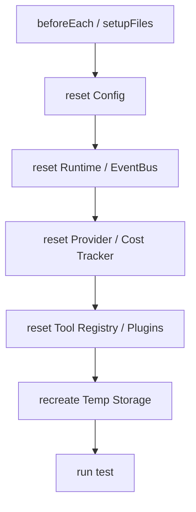

规则：

- 测试 setup 应统一调用总入口，而不是每个测试文件各自拼凑 reset 顺序。
- reset 失败应直接让测试失败，而不是静默忽略。

## 7. 临时资源规则

- 临时 SQLite 数据库每个 test file 或 test case 应可隔离创建。
- 临时 artifact 目录应在 teardown 清理。
- 临时 network mock / fake gateway state 也应纳入 reset 流程。

## 8. 与实现代码的边界

- reset 只服务测试，不得成为生产恢复机制的替代。
- 生产代码中的 shutdown / cleanup 与测试 reset 可共享底层逻辑，但对外入口应分开。

## 9. Phase 边界

Phase 1a 做：

- 关键单例 reset API
- 测试 setup 统一调用
- `NODE_ENV=test` 守卫

Phase 1b 做：

- 更多 integration / e2e 共享 harness
- gateway / orchestration 测试的额外 reset 入口

## 10. 收口结论

没有统一 reset 体系的测试，很快就会从“回归保护”退化成“偶尔通过的随机脚本”；这份 contract 就是把测试隔离边界正式冻结下来。
# Tool Output Sanitization Contract

## 1. 范围

本 contract 定义所有外部工具输出在进入消息、日志、事件、artifact 索引前必须经过的统一净化管线。

相关文档：

- `tool_and_provider_execution_contract.md`
- `gateway_streaming_contract.md`
- `observability_contract.md`
- `policy_engine_contract.md`

## 2. 目标

统一净化管线至少要解决：

- ANSI / 控制字符污染输出
- 超长输出拖垮上下文窗口
- 凭据、token、cookie 等敏感信息泄漏
- prompt injection 片段未标记直接流入上游总结

## 3. `SanitizedToolOutput`

| 字段 | 类型 | 说明 |
| --- | --- | --- |
| `raw_ref` | `string?` | 原始输出引用 |
| `sanitized_text` | `string` | 净化后的文本主体 |
| `truncated` | `boolean` | 是否截断 |
| `redaction_count` | `number` | 脱敏次数 |
| `control_chars_removed` | `number` | 清理控制字符数 |
| `ansi_removed` | `boolean` | 是否去除 ANSI |
| `injection_risk` | `none \| low \| medium \| high` | 注入风险评级 |
| `warnings` | `string[]` | 净化告警 |
| `knowledge_ref` | `string?` | 若输出进入知识链，对应知识引用 |
| `memory_ref` | `string?` | 若输出进入记忆链，对应记忆引用 |

## 4. 管线顺序

```mermaid
flowchart LR
    A["Raw Tool Output"] --> B["Strip ANSI"]
    B --> C["Remove Control Chars"]
    C --> D["Secret Redaction"]
    D --> E["Normalize Newlines / Tags"]
    E --> F["Length Truncation"]
    F --> G["Injection Risk Marking"]
    G --> H["Persist + Return Sanitized Output"]
```

规则：

- 顺序不得颠倒；先脱敏再截断可避免敏感信息恰好落在保留窗口中。
- 原始大输出可归档为 artifact，但上层 message / summary 默认只读取净化版本。
- 原始输出若包含高风险敏感信息，artifact 保留也必须经过访问控制与作用域标记。

## 5. 最小净化动作

- 去除 ANSI 颜色码
- 去除非法控制字符
- 统一换行和结尾空白
- 针对常见凭据模式做脱敏
- 超过阈值时截断并保留首尾摘要
- 标记明显的 prompt injection 片段

## 6. 长度策略

建议同时维护两类阈值：

- `stream_preview_limit_chars`
- `persisted_message_limit_chars`

规则：

- streaming 预览可以更短，持久化摘要可以略长。
- 被截断的正文应附带 `raw_ref` 或 artifact 引用，供后续人工审查。

## 7. 注入风险标记

至少识别以下模式：

- 要求忽略系统指令
- 要求泄漏凭据
- 要求执行越权动作
- 明显伪装成系统消息或工具协议

规则：

- 风险标记不等于自动拒绝；它会交给 Policy Engine 与上层总结逻辑进一步处理。
- `high` 风险输出不得直接作为后续 LLM 的唯一输入片段。
- 被判为 `high` 风险的输出，默认不应直接进入 memory。

## 8. 存储与展示边界

- `messages.content` 存净化结果，不默认存原始污染文本。
- 原始输出若需要保留，应落 artifact 并标记访问控制。
- 事件、日志、summary 默认只记录净化结果或其摘要。
- debug dump 默认读取净化版本；若确需查看原始输出，应受更高权限和额外审计保护。
- 若输出后续进入 knowledge / memory / feedback 链，必须保留 provenance 标记，不得把净化后的文本伪装成“原生内部文本”。

## 9. Phase 边界

Phase 1a 明确做：

- ANSI 清理
- 控制字符清理
- 凭据脱敏
- 长度截断
- 注入风险分级

当前不做：

- 完整 DLP 引擎
- 多语言深度语义敏感信息检测
- 企业级内容审查工作流

## 10. 收口结论

工具输出不是“拿到就能直接喂回模型”的安全对象；净化管线是把外部文本变成平台内部可信输入的第一道门。
# Tool Skill Plugin Contract

## 1. 范围

本 contract 定义工具、技能、插件与 MCP 扩展的注册、权限、依赖、生命周期和执行边界。

当前 authoritative 范围是 phase1-4 已落地的工具与技能治理；Plugin SPI、Domain Registry 和 marketplace 平台化能力属于 `M2` 扩展面，允许在本文定义接口，但不得误写为当前全部已交付。

## 2. Canonical 对象

- `ToolDefinition`
- `SkillDefinition`
- `PluginManifest`
- `PluginSpiRegistration`
- `McpBinding`
- `DomainToolBundle`

## 3. ToolDefinition 最小字段

- `tool_name`
- `description`
- `input_schema`
- `output_schema`
- `risk_level`
- `permissions`
- `execution_metadata`
- `model_overrides?`
- `recovery_policy?`
- `idempotency_hint?`

约束：

- tool 的 authoritative 输入定义优先来自结构化 schema，再统一派生模型侧 / API 侧 schema。
- tool 的恢复、安全和路径语义以下钻文档 `tool_metadata_and_recovery_contract.md` 为准。
- 原生 wire-format tool call 永远优先；兼容 fallback 只能限制在已注册工具白名单内，并带显式审计标记。

## 4. SkillDefinition 最小字段

- `skill_id`
- `description`
- `applicable_roles`
- `required_tools`
- `steps`
- `version`
- `model_profile_name?`
- `activation_conditions?`
- `activation_paths?`
- `cacheable?`
- `cache_ttl_seconds?`

约束：

- skill 只能编排已授权工具，不能隐式扩权。
- 若 step 声明 `model_overrides`，override 目标工具也必须已在允许集合内。
- 未满足 `activation_conditions` / `activation_paths` 的 skill 可以保留在 registry 中，但默认不进入模型可见面。

## 5. Plugin Manifest 与 SPI 类型

### 5.1 `PluginManifest` 最小字段

- `plugin_id`
- `name`
- `version`
- `owner`
- `capabilities`
- `spi_types`
- `trust_level`
- `settings_schema?`
- `auth_requirements?`
- `plugin_api_range?`
- `built_with_platform_version?`
- `min_runtime_version?`
- `lifecycle_state?`
- `public_sdk_surface`

规则：

- 所有 plugin / extension 必须以 manifest 作为 authoritative 注册输入。
- extension / plugin 生产代码只能通过公共 SDK surface 与 core 交互，不得直接导入 core 私有模块或其他 extension 私有实现。
- 若 plugin 需要新的 runtime seam，应优先新增明确 public SDK subpath 或 facade，而不是暴露私有实现文件。

### 5.2 Plugin SPI 四类 canonical 接口

`§K` 要求当前文档体系统一到四类 SPI：

- `DomainRetrieverPlugin`
- `DomainValidatorPlugin`
- `DomainPlannerPlugin`
- `DomainPresenterPlugin`

最小接口语义：

```ts
interface PluginLifecycleContext {
  pluginId: string;
  domainId?: string;
  capabilityIds: string[];
}

interface DomainRetrieverPlugin {
  onLoad?(ctx: PluginLifecycleContext): Promise<void> | void;
  onActivate?(ctx: PluginLifecycleContext): Promise<void> | void;
  retrieve(input: unknown): Promise<unknown>;
  onDeactivate?(ctx: PluginLifecycleContext): Promise<void> | void;
  onUnload?(ctx: PluginLifecycleContext): Promise<void> | void;
}

interface DomainValidatorPlugin {
  onLoad?(ctx: PluginLifecycleContext): Promise<void> | void;
  onActivate?(ctx: PluginLifecycleContext): Promise<void> | void;
  validate(input: unknown): Promise<unknown>;
  onDeactivate?(ctx: PluginLifecycleContext): Promise<void> | void;
  onUnload?(ctx: PluginLifecycleContext): Promise<void> | void;
}

interface DomainPlannerPlugin {
  onLoad?(ctx: PluginLifecycleContext): Promise<void> | void;
  onActivate?(ctx: PluginLifecycleContext): Promise<void> | void;
  plan(input: unknown): Promise<unknown>;
  onDeactivate?(ctx: PluginLifecycleContext): Promise<void> | void;
  onUnload?(ctx: PluginLifecycleContext): Promise<void> | void;
}

interface DomainPresenterPlugin {
  onLoad?(ctx: PluginLifecycleContext): Promise<void> | void;
  onActivate?(ctx: PluginLifecycleContext): Promise<void> | void;
  present(input: unknown): Promise<unknown>;
  onDeactivate?(ctx: PluginLifecycleContext): Promise<void> | void;
  onUnload?(ctx: PluginLifecycleContext): Promise<void> | void;
}
```

约束：

- `onLoad / onActivate / onDeactivate / onUnload` 为 plugin lifecycle 的 canonical hook。
- hook 失败不得提升权限；默认降级为禁用该 SPI 实例或阻断加载。
- SPI 只能消费 manifest 声明过的 capability 与 setting，不得运行时偷偷扩权。

## 6. Lifecycle 与状态机

plugin lifecycle 至少覆盖：

`discovered -> installed -> enabled -> disabled -> reloaded -> removed`

SPI runtime lifecycle 至少覆盖：

`registered -> loaded -> active -> inactive -> unloaded`

补充规则：

- `enabled` 不等于 `active`；只有通过 compatibility、permission 和 trust gate 后才允许进入 active。
- `reloaded` 必须保留前后版本、配置摘要和错误原因，方便审计与回滚。
- trust warning、permission retry、plugin settings 只能作为体验层安全阀，不能替代 runtime policy、sandbox 和 capability boundary。

## 7. Domain Tool Bundle

当 tool / skill / plugin 规模增大后，系统应以 domain bundle 组织能力，而不是默认全量塞入 prompt。

`DomainToolBundle` 最小字段：

- `domain_id`
- `bundle_id`
- `tool_names`
- `skill_ids`
- `plugin_ids`
- `default_activation_policy`
- `knowledge_namespaces?`

规则：

- capability 的拥有权应尽量明确归属到 plugin / extension / domain bundle。
- 自定义能力不应通过 core 私有 reach-in 临时拼接。
- domain bundle 是推荐、检索、延迟加载和 explainability 的最小治理单元。

## 8. Skill 执行语义

### 8.1 步骤失败模式

`SkillStepDefinition.onFailure` 定义步骤失败后的处理策略：

| 模式 | 含义 |
| --- | --- |
| `fail` | 立即终止整个 skill 执行（默认） |
| `continue` | 跳过失败步骤，继续执行后续步骤 |
| `retry` | 按 `maxAttempts` 重试，超过次数后降级为 `fail` |

规则：

- `retry` 不带退避，立即重试。
- 重试调度必须发出 `skill:retry_scheduled` 事件。
- 每次重试计入独立的 `skill:step_started` / `skill:step_failed` 事件。

### 8.2 Model Override 匹配

skill 步骤可声明 `modelOverrides`：

- `profileNames`
- `tiers`
- `requiredCapabilities`

匹配规则：

- 所有非空条件之间为 AND。
- 同一条件内多值为 OR。

### 8.3 Skill 缓存

缓存 key 派生：

```text
SHA256(skillId + version + parameters + workingDirectory + gitHead + sourceHash)
```

缓存资格条件：

- skill 声明 `cacheable: true`
- 且 `gitHead` 或 `sourceHash` 至少有一个非空

缓存生命周期：

| 阶段 | 说明 |
| --- | --- |
| `disabled` | 缓存未启用 |
| `ineligible` | 不满足资格条件 |
| `miss` | 资格通过但无匹配缓存 |
| `hit` | 命中缓存，跳过执行并回放结果 |
| `stored` | 执行成功后存入缓存 |

规则：

- 仅在 skill 全部步骤成功时存储。
- 命中缓存时插入 `StepOutput` 并标记 `cacheHit: true`。
- 达到 `cacheMaxEntries` 时按 LRU 淘汰。
- 缓存元数据必须记录 `gitHead`、`sourceHash`、`cacheKey` 和时间戳。

## 9. Skill Creator / Authoring

### 9.1 骨架最小结构

每个通过 creator 生成的 skill 至少应包含：

- `<skill_root>/<skill_slug>/SKILL.md`

可选附加结构：

- `<skill_root>/<skill_slug>/scripts/`
- `<skill_root>/<skill_slug>/references/`
- `<skill_root>/<skill_slug>/assets/`
- `<skill_root>/<skill_slug>/agents/openai.yaml`

### 9.2 命名与内容约束

- `skill_slug` 必须使用 lowercase kebab-case。
- `skill_id` 应与 `skill_slug` 保持一致，除非显式说明兼容原因。
- `SKILL.md` 至少包含：`name`、`description`、`when to use`、`inputs`、`workflow`、`safety notes`。
- `SKILL.md` 不得声明超出 `required_tools` / `required_permissions` 的隐式能力。

### 9.3 Creator 安全边界

- creator 必须做 `realpath` 归一化和 allowed-root 校验。
- 默认拒绝通过 symlink 写出指定根目录。
- 不得覆盖已存在的非空目录，除非显式声明 `overwrite_allowed`。
- 不得写入 secrets、token、私有 endpoint 或环境专属凭证。

### 9.4 Creator 返回对象

- `skill_id`
- `skill_slug`
- `skill_root`
- `skill_path`
- `created_files`
- `created_directories`
- `registered`
- `warnings`

## 10. 注册、审核与校验

注册表最少记录：

- `id`
- `version`
- `permissions`
- `risk_level`
- `owner`
- `compatibility`
- `enabled`

bundled / 内置扩展清单在发布前至少执行：

- manifest 字段 lint
- transport 与字段匹配校验
- 关键执行字段缺失拦截
- inventory baseline / contract suite 校验

例如：

- `streamable_http` 类型必须提供 `uri`
- `stdio` 类型必须提供 `cmd`

校验输出至少包含：

- 条目序号
- 名称
- ID
- 建议修正字段

## 11. Phase Boundary

### 当前 phase1-4 authoritative 范围

- tool registry、skill registry、权限与风险边界
- skill activation / cache / authoring contract
- MCP / plugin / local tool 在呈现层可统一，但底层信任等级必须显式区分

### `M2` target-state 范围

- Plugin SPI 大规模生产使用
- Domain Registry 作为统一后端
- 外部 marketplace 发布与撤销体系
- per-domain tool bundle 的完整平台化控制面

这些内容可以在 contract 中提前定义，但当前只允许表述为目标态扩展，不得作为当前已完成 readiness 结论。
# UI Console And Cockpit Contract

## 1. 范围

本 contract 定义 Automatic Agent 的 Web Console、Task Cockpit、Workflow Cockpit、Approval Center、Stability Panel 和 Admin Takeover Console 的最小界面边界。

它回答的问题是：

- UI 首先服务什么对象
- 首页先展示什么
- 任务、审批、稳定性和接管页面至少要具备什么能力
- 页面数据 truth source 如何分层，避免每页各自拼事实源

相关文档：

- `admin_console_and_human_takeover_contract.md`
- `debug_inspect_health_backpressure_contract.md`
- `gateway_message_contract.md`
- `gateway_streaming_contract.md`
- `hitl_experience_and_explainability_contract.md`
- `api_surface_contract.md`

## 2. UI 总体原则

前端不是聊天窗口集合，而是：

- 任务工作台
- 审批与治理工作台
- 稳定性与运维工作台
- 管理员接管工作台

最小原则：

1. 人类优先通过 `task / approval / inspect / takeover` 进入系统，不应直接对任意 agent 自由下指令。
2. 首页必须先回答“系统是否健康、当前在做什么、卡在哪里”。
3. 关键页面必须能下钻到 evidence、timeline、inspect，而不是只显示 summary。
4. 高风险动作必须展示风险等级、策略来源、审批链和接管入口。
5. UI 展示状态不得反向定义 task、workflow 或 execution 的 authoritative 事实。

## 3. Console 信息架构

推荐最小信息架构：

- `Mission Control`
  - `Dashboard`
  - `Task Cockpit`
  - `Workflow Cockpit`
  - `Approval Center`
  - `Stability`
  - `Alerts`
- `Operations`
  - `Dispatch`
  - `Inspect`
  - `Health`
  - `Incidents`
- `Governance`
  - `Policy`
  - `Audit`
  - `Security`
  - `Runtime Decisions`
- `Admin`
  - `Takeover`
  - `Workers`
  - `Queues`
  - `Feature Flags`
  - `Capability / Entitlement`

规则：

- 当前阶段不要求一次性铺满所有页面。
- 但导航分组应从一开始按能力域组织，而不是页面墙式平铺。

## 4. 首页排序规则

Console 首页应按以下优先级组织：

1. 顶部先展示：
   - `system status`
   - `current focus`
   - `active alerts`
2. 第一屏展示：
   - 当前活跃 task / workflow
   - runtime / queue / approval 是否健康
   - 当前 backlog 派发到了哪
3. 第二屏展示：
   - blocked reason
   - stale / recovery / retry 摘要
   - 近期高风险 decision / approval
4. 原始日志、长 trace、原始事件尾部只能作为下钻视图，不得占据首页主视觉。

## 5. 核心页面

### 5.1 `TaskCockpit`

最小字段：

- `task_id`
- `task_status`
- `current_step`
- `current_execution`
- `blocked_reason?`
- `latest_tool_call?`
- `latest_decision?`
- `artifact_refs`

最小动作：

- 打开 inspect
- 查看 timeline
- 查看 artifacts
- 取消任务
- 进入人工接管

### 5.2 `WorkflowCockpit`

最小字段：

- `workflow_id`
- `workflow_status`
- `steps`
- `current_step_index`
- `dependency_state`
- `approval_nodes`
- `evidence_refs`

最小动作：

- 查看 step output
- 查看 dependency / blocked state
- 打开 recovery history
- 查看 compensation / replay 证据

### 5.3 `ApprovalCenter`

最小字段：

- `approval_id`
- `task_id`
- `risk_level`
- `reason_summary`
- `options`
- `recommended_option?`
- `deadline?`
- `policy_source`

最小动作：

- approve
- reject
- request_more_context
- open_explanation

### 5.4 `StabilityPanel`

最小字段：

- `active_tasks`
- `queued_tasks`
- `stale_executions`
- `recovered_executions`
- `failed_recoveries`
- `approval_backlog`
- `event_backlog`
- `worker_health`

最小动作：

- drill into stuck task
- inspect backlog
- open recovery evidence
- trigger incident workflow

### 5.5 `AdminTakeoverConsole`

最小字段：

- `task scope`
- `tenant / workspace scope`
- `execution owner`
- `lease / worker state`
- `recent events`
- `current model / prompt / policy version`
- `current capability / entitlement limit`

最小动作：

- `retry_step`
- `skip_step`
- `override_step_output`
- `switch_worker`
- `manual_cancel`
- `mark_unrecoverable`

## 6. 页面数据 truth source 分层

### 6.1 `shared_snapshot`

适用于：

- 顶部系统状态条
- Dashboard 首页摘要
- 稳定性总览头部

最小内容：

- overall health
- queue depth
- active executions
- approval backlog
- alert summary

### 6.2 `shared_query`

适用于：

- Dashboard
- Stability
- Approval Center
- Admin Console 概览

规则：

- 跨域聚合页面应优先复用共享 query，而不是每页各自拉散 API。

### 6.3 `page_local_api`

适用于：

- task inspect
- workflow inspect
- approval inspect
- worker details
- artifact details

规则：

- domain-specific drill-down 可以有独立 API。
- 但页面不得私自拼 authoritative 状态，应优先使用 inspect / resource API。

## 7. Task-Flow Cockpit Drill-Down

Task / Workflow cockpit 至少支持 5 级下钻：

| 级别 | 展示内容 |
| --- | --- |
| `L1` | task list + status |
| `L2` | task details + workflow state |
| `L3` | step outputs + tool calls |
| `L4` | approval / decision / evidence chain |
| `L5` | trace / replay / recovery timeline |

规则：

- `completed` 不得只显示 summary，必须能进入 evidence。
- `blocked` 不得只显示“等待中”，必须显示 blocked reason 和 source。
- `failed` 不得只显示错误文本，必须能进入 error code、last step 和 recovery history。

## 8. UI 与 gateway / streaming 的关系

- Web UI 流式展示应遵守 `gateway_streaming_contract.md`。
- 显示层若需要做 chunk commit、catch-up 或 backlog drain，应按队列压力和消息年龄自适应，而不是按上游来源硬编码特殊逻辑。
- 显示层 catch-up 不得打乱消息顺序，也不应通过单帧暴力 flush 破坏可读性。
- 非流式控制台视图可以读聚合状态，但不得替代 stream 事实。
- UI 侧状态命名必须和 `debug_inspect_health_backpressure_contract.md` 与 `api_surface_contract.md` 保持一致。

## 9. 当前明确不做

当前不直接采用：

- 重型 Canvas / A2UI package rendering 平台
- 大规模业务域工作台铺设
- 业务页面墙
- 在前端直接维护 capability / policy 真相

原因：

- 当前阶段的核心目标是先把 Stable Core 跑稳。
- 过早引入重型 UI 包运行时，会放大前后端边界复杂度。
- Automatic Agent 当前更需要 task、workflow、stability、takeover 四类工作台，而不是业务域页面扩张。

## 10. 收口结论

Automatic Agent 的 UI 不应首先长成“另一个聊天应用”。

更合理的基线是：

- 一个能看健康状态的 Console
- 一个能下钻 evidence 的 Task / Workflow Cockpit
- 一个能处理审批与解释的 Approval Center
- 一个能接管和止损的 Admin Console
# VCR And Fixture Testing Contract

## 1. 范围

本 contract 定义 provider、LLM、流式输出和外部 API 在测试中的 record / replay 与 fixture 规则。

相关文档：

- `testing_singleton_reset_contract.md`
- `tool_and_provider_execution_contract.md`
- `gateway_streaming_contract.md`
- `cost_and_budget_contract.md`

## 2. 目标

VCR / fixture 测试体系至少要做到：

- CI 不依赖真实 provider 才能跑主测试集。
- 回归测试结果稳定、可重放。
- 真实请求录制与离线回放边界清楚。

## 3. 测试模式

### 3.1 `fixture_only`

- 只使用静态 fixture
- 默认 CI 主模式

### 3.2 `vcr_replay`

- 根据请求指纹回放既有录制结果
- 若缺少录制则失败

### 3.3 `vcr_record`

- 本地开发时允许真实调用 provider
- 将请求/响应录制为 fixture

## 4. `RecordedInteraction`

| 字段 | 类型 | 说明 |
| --- | --- | --- |
| `interaction_id` | `string` | 录制 ID |
| `provider` | `string` | provider 标识 |
| `model` | `string` | 模型名 |
| `request_fingerprint` | `string` | 规范化请求指纹 |
| `request_summary` | `json` | 脱敏后的请求摘要 |
| `response_payload` | `json` | 响应体 |
| `stream_chunks` | `json[]?` | 流式块 |
| `usage_snapshot` | `json?` | token / cost 信息 |
| `recorded_at` | `timestamp` | 录制时间 |

## 5. 请求指纹规则

请求指纹至少应包含：

- provider
- model
- system / user prompt 规范化文本
- tool 列表签名
- 关键参数（temperature、reasoning level 等）

规则：

- 不得把易波动但无语义价值的字段直接纳入指纹。
- 指纹生成前必须完成凭据脱敏。

## 6. Fixture 目录规则

建议目录：

- `tests/__fixtures__/llm/`
- `tests/__fixtures__/vcr/`
- `tests/__fixtures__/gateway/`

规则：

- fixture 应按场景命名，而不是只按时间戳命名。
- 同类 fixture 应能看出对应任务、角色或失败场景。

## 7. 流式响应规则

- 流式响应可录制为 chunk 列表
- replay 时必须保持顺序、结束信号和 finish reason 一致
- 不要求逐 token 完全一致，但必须满足上层协议断言

## 8. 安全与脱敏

- 录制前必须去除 API key、cookie、token、Authorization header
- 原始敏感请求不得直接进入仓库 fixture
- 若无法安全脱敏，应禁止录制并要求手工 mock

## 9. 失败语义

- `vcr_replay` 模式缺少匹配 fixture 时，测试必须失败
- fixture schema 不合法时，测试必须失败
- 回放结果与当前协议不兼容时，应提示重新录制或升级 fixture 版本

## 10. 与真实测试分层

建议分层：

- unit / integration：默认 `fixture_only`
- e2e：优先 `vcr_replay`
- nightly / manual eval：可允许真实 provider

## 11. 成本与治理

- 录制真实 provider 的成本必须可追踪
- `vcr_record` 不应在 CI 默认开启
- 重新录制必须有明确触发条件，例如模型升级、协议变更、核心 prompt 变化

## 12. Phase 边界

Phase 1a 做：

- `fixture_only`
- 非流式 provider replay
- 缺 fixture 即 fail

Phase 1b 做：

- `vcr_replay`
- 流式 chunk replay
- 更完整的请求指纹与录制治理

当前不做：

- 大规模 fixture 自动更新服务
- 跨 provider 差异归一自动修复
- 企业级数据集评估平台

## 13. 收口结论

VCR / fixture 的核心不是“把一次调用存下来”，而是把外部不稳定依赖变成一套可控、可回放、可审计的测试输入。
