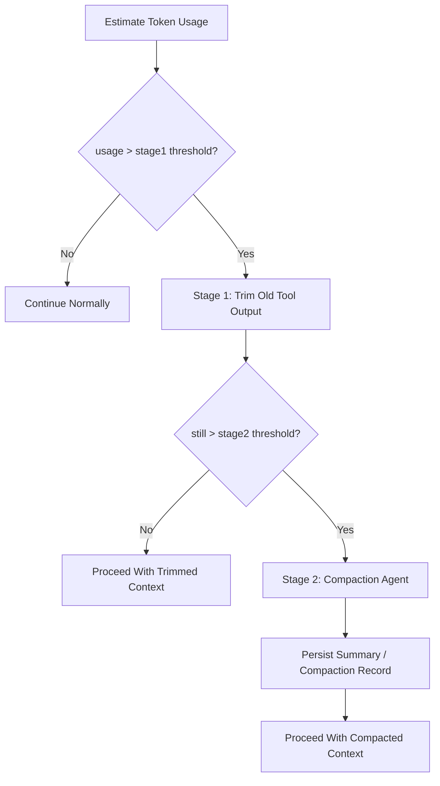

# Context Compaction And Overflow Contract

> **OAPEFLIR 相关**：本 contract 定义 OAPEFLIR 8 阶段的上下文管理策略，对应 ADR-016 和 ADR-060 Plan Hub。
> **更新日期**：2026-04-17

## 1. 范围

本 contract 定义 LLM 上下文接近 token 上限时的两阶段溢出处理策略。

相关文档：

- `context_propagation_contract.md`
- `tool_output_sanitization_contract.md`
- `runtime_execution_contract.md`
- `cost_and_budget_contract.md`
- [ADR-060 Plan Hub](../adr/060-explicit-planning-hub.md)

## 2. 目标

两阶段策略要同时做到：

- 尽量减少不必要的 compaction 模型调用成本。
- 在超长任务里优先保留用户意图和最近执行事实。
- 不让上下文压缩破坏主任务成功率与恢复能力。

## 3. 核心原则

- 先裁剪，再压缩；不允许一上来就调用 compaction agent。
- 优先裁掉高体积、低信息密度的旧 tool output。
- 用户消息、系统规则、最近执行事实优先保留。
- compaction 结果必须可追溯、可替换、可恢复。

## 4. 两阶段策略

## 5. 阈值模型

Phase 1a / 1b 建议至少维护：

- `stage1_trigger_ratio`
- `stage2_trigger_ratio`
- `recent_tool_result_window`
- `compaction_max_frequency_per_session`

推荐基线：

- `stage1_trigger_ratio = 0.70`
- `stage2_trigger_ratio = 0.85`
- `recent_tool_result_window = 3`
- `reserved_output_budget_tokens = min(20000, provider_max_output_tokens)`

这些阈值可调，但必须来自统一配置，不得在调用处散写。
规则：

- overflow 判断不应只看“当前用了多少”，还应扣除模型输出保留区，避免输入刚好打满后没有空间生成有效回复。
- 若 provider 明确给出最大输出 token 能力，优先按 provider 能力估算保留预算；否则退回平台默认保留区。
- 若启用 KV cache 固定前缀，固定前缀预算与 variable suffix 预算必须分开核算；固定前缀不参与普通 overflow 裁剪。

## 6. Stage 1 快速裁剪

目标：

- 零额外 LLM 成本
- 快速回收上下文空间

规则：

- 按消息时间从旧到新扫描
- 优先处理 `tool_result` / 大块外部输出
- 保留最近 `N` 轮 tool result 完整内容
- 更早的 tool result 可替换为稳定占位摘要，例如“工具结果已裁剪”
- 用户消息、system prompt、approval 决策、最近 assistant 规划默认不裁
- 可声明 `protected_parts` 或等价名单，不得在 Stage 1 被直接裁掉。当前受保护消息类型：
  - `user_request`：用户请求消息
  - `assistant_plan`：assistant 规划消息
  - `approval_decision`：审批决策消息
  - `compaction_summary`：已有的压缩摘要
  - 最新一条用户入站消息（无论 `messageType`）
- 若上下文中已注入结构化 `FeedbackSignal` / `LearningObject` 摘要，它们应作为 protected parts 处理，避免在 Learn / Improve 闭环中丢失关键证据链。

补充说明：

- 在进入真正 summarization 前，可增加 `microcompact` 一类本地轻量收缩步骤，例如去掉重复前缀、裁剪冗余块或压缩低价值展示性消息。
- `microcompact` 属于 Stage 1 范围，不应引入额外模型调用。

## 7. Stage 2 Compaction Agent

仅在 Stage 1 后仍然超阈值时触发。

输出至少包括：

- `summary_text`
- `covered_message_range`
- `source_message_ids`
- `compaction_reason`
- `created_at`

规则：

- compaction 结果必须持久化，而不是只存在内存。
- 被摘要覆盖的原消息仍需可追溯到原始记录或 artifact。
- 同一 session 连续 compaction 频率应受限（默认 `compaction_max_frequency_per_session = 2`），避免 compaction 递归吞噬上下文。
- compaction 完成后应执行 post-compaction cleanup，例如清理临时缓存、重置基线和记录新的 compact boundary。
- overflow 触发的 compaction 与人工触发的 compaction 必须可区分，方便后续调优。

## 8. 保留优先级（OAPEFLIR 8 阶段适用）

从高到低建议如下：

1. system / policy / runtime guardrail
2. 最新用户请求
3. 最近审批与关键状态事件
4. 最近 assistant 计划与结果摘要
5. 最近 `N` 轮完整 tool result
6. 更老的 tool result 与冗长输出
7. 可重建的展示性片段、旧 retry 记录和历史冗余进度消息

### 8.1 OAPEFLIR 阶段特定保留规则

| OAPEFLIR 阶段 | 保护内容 | 理由 |
|--------------|---------|------|
| Observe | 最新观察信号 | Assess 依赖 |
| Assess | UnifiedAssessment 结果 | Plan 依赖 |
| Plan | PlanGraphBundle + graphVersion | Execute 依赖（R3-SINGLE 约束） |
| Execute | DualChannelStepOutput | Feedback 依赖 |
| Feedback | FeedbackSignal[] | Learn 证据链（R4-EVIDENCE） |
| Learn | LearningObject + evidence | Improve 依赖 |
| Improve | ImprovementCandidate | Release 依赖 |
| Release | ReleaseRecord | 审计追溯 |

## 9. `CompactionRecord`

| 字段 | 类型 | 说明 |
| --- | --- | --- |
| `compaction_id` | `string` | 压缩记录 ID |
| `session_id` | `string` | 所属会话 |
| `task_id` | `string` | 所属任务 |
| `harness_run_id?` | `string` | 关联 HarnessRun（canonical） |
| `node_run_id?` | `string` | 关联 NodeRun（canonical） |
| `stage` | `trim \| summarize` | 所处阶段 |
| `source_message_ids` | `string[]` | 被覆盖消息 |
| `summary_ref` | `string?` | 摘要引用 |
| `token_reduction_estimate` | `number` | 预计回收 token |
| `created_at` | `timestamp` | 生成时间 |

## 10. 失败语义

- Stage 1 是本地裁剪，不应因单条 tool result 解析失败而整体崩溃。
- Stage 2 compaction 调用失败时，系统必须回退到 Stage 1 结果，保留 Stage 1 裁剪后的上下文，并将 stage 标记回 `trim`、设置 `errorCode: "runtime.compaction_budget_exhausted"`，而不是静默丢失上下文。
- compaction 失败若阻断主流程，应返回可识别错误码，而不是泛化成 provider 普通错误。

建议错误码：

- `runtime.context_overflow`
- `provider.compaction_unavailable`
- `validation.compaction_record_invalid`
- `runtime.compaction_budget_exhausted`

## 11. 观测与成本要求

至少记录：

- 当前 token 占用比例
- 是否进入 Stage 1
- 是否进入 Stage 2
- compaction 次数
- 预计节省 token
- compaction 额外成本

规则：

- compaction 是成本敏感动作，必须进入成本与观测体系。
- 若某类任务高频触发 Stage 2，应反馈到 prompt / tool output / workflow 设计，而不只靠继续压缩。

## 12. 恢复与一致性

- 恢复后重新组装上下文时，必须能识别哪些消息已被裁剪、哪些被 compaction 摘要替代。
- 不允许因为压缩而丢失审批结果、终态原因或最近关键计划。
- compaction 不得改变任务主状态、事件事实和审计记录。
- 若 compaction 由恢复、transport 重建或会话重入触发，必须保留 compaction lineage，避免重复摘要同一段消息。
- 若 overflow 由 provider 切换或 auth profile 变更触发，必须重新计算 usable budget，而不是沿用旧模型的上下文阈值。
- 若启用固定前缀 KV cache，恢复后必须先恢复 prefix/domain block 边界，再恢复 variable suffix；不允许把 prefix 片段重复压进 summary。

## 12A. KV Cache Fixed Prefix 联动

当启用固定前缀缓存时，system prompt 至少拆分为：

1. `fixed_prefix`
2. `domain_block`
3. `variable_suffix`

规则：

- `fixed_prefix` 为跨 agent 共享块，默认不参与 Stage 1/2 compaction。
- `domain_block` 可在 domain 不变时复用缓存 key，但仍应计入静态 prefix 空间。
- `variable_suffix` 才是普通 overflow 管理的主要对象。
- compaction 记录若覆盖 `variable_suffix`，必须保留当时使用的 `fixed_prefix_cache_key` 或等价 hash，方便后续复用与诊断。

## 13. Phase 边界

Phase 1a 做：

- token 占用估算
- Stage 1 快速裁剪

Phase 1b 做：

- Stage 2 compaction agent
- compaction 记录持久化

当前不做：

- 多层语义记忆自动回灌
- 跨 session 智能摘要融合
- 基于 embedding 的上下文自动重排

## 14. 收口结论

上下文溢出的正确应对方式不是“更早更频繁地总结”，而是先用最低成本的裁剪回收空间，再把真正需要保留的长期语义交给 compaction。
