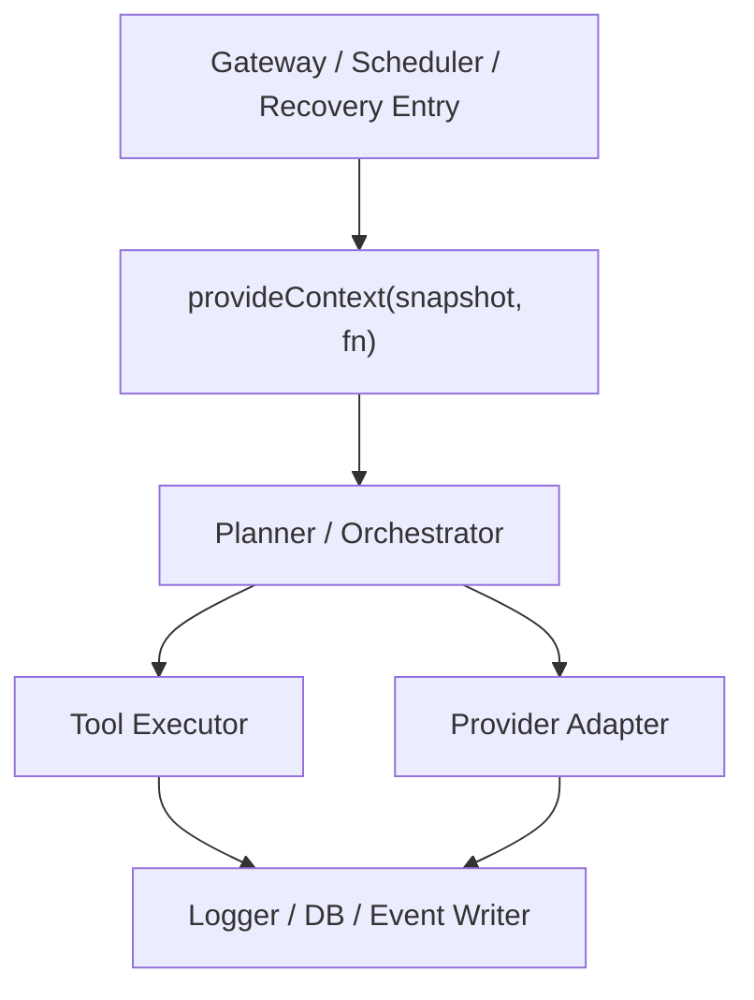

# Context Propagation Contract

> **OAPEFLIR 相关**：本 contract 定义 OAPEFLIR 8 阶段的上下文传播，对应 ADR-016。
> **更新日期**：2026-04-17

## 1. 范围

本 contract 定义基于 `AsyncLocalStorage` 的运行时上下文传播规则，避免 `taskId / sessionId / agentId / traceId / workdir` 在深层调用链中层层透传。

相关文档：

- `runtime_execution_contract.md`
- `app_error_contract.md`
- `observability_contract.md`
- `tool_and_provider_execution_contract.md`
- [ADR-016 OAPEFLIR 八阶段模型](../adr/016-oapeflir-loop-model.md)

## 2. 目标

Phase 1a 的上下文传播至少要保证：

- 日志、DB、工具执行能自动拿到当前 task / execution / trace。
- 取消、超时和恢复链能读取同一份上下文快照。
- 显式参数只保留工具特有配置，不继续承载全局运行身份。

## 3. `RuntimeContextSnapshot`

| 字段 | 类型 | 说明 |
| --- | --- | --- |
| `trace_id` | `string` | 链路追踪主键 |
| `span_id` | `string?` | 当前 span（对齐 `trace_and_root_cause_observability_contract.md` §3） |
| `parent_span_id` | `string?` | 父 span |
| `task_id` | `string` | 当前任务 |
| `execution_id` | `string?` | 当前 execution |
| `workflow_id` | `string?` | 当前 workflow |
| `session_id` | `string?` | 当前会话 |
| `agent_id` | `string?` | 当前 agent |
| `division_id` | `string?` | 当前事业部 |
| `oapeflir_stage` | `string?` | 当前闭环阶段 |
| `loop_iteration` | `integer?` | 当前闭环轮次 |
| `knowledge_namespace` | `string?` | 当前 knowledge namespace |
| `memory_layer` | `string?` | 当前 memory layer |
| `domain_id` | `string?` | 当前 domain |
| `ref_id` | `string?` | 当前 typed ref |
| `workdir` | `string?` | 当前工作目录 |
| `request_id` | `string?` | 当前外部请求 |
| `approval_id` | `string?` | 当前审批上下文 |
| `abort_signal_ref` | `string?` | 取消信号引用 |
| `budget_scope_id` | `string?` | 预算聚合范围 |

说明：`span_id` 和 `parent_span_id` 用于在 trace 树中定位当前执行位置。每进入一个新 agent step、tool call 或 LLM call 时，应通过 `withContextPatch` 更新 `span_id` 并将旧 `span_id` 推入 `parent_span_id`。Phase 1a 可不实现完整 span 树，但字段位应保留以避免后续破坏性变更。

## 4. 传播入口

必须由以下入口之一显式 `provideContext(...)`：

- gateway 收到用户请求
- scheduler / runtime 创建 execution
- 恢复链重新接管 stale run
- approval resume 恢复执行

## 5. API 约束

最小运行接口建议为：

- `provideContext(snapshot, fn)`
- `getContext()`
- `getContextOrNull()`
- `withContextPatch(partial, fn)`
- `assertContext(requiredKeys)`

规则：

- `getContext()` 在无上下文时必须显式抛错，不得返回伪默认值。
- `withContextPatch` 只能覆盖局部字段，不得静默丢失已有标识。
- 后台 detached 任务必须显式复制或重建上下文，不能依赖隐式继承。

## 6. 与显式参数的边界

保留显式参数的内容：

- `timeout_ms`
- `tool arguments`
- `provider model`
- `sandbox options`
- `output destination`

不应再由显式参数层层透传的内容：

- `task_id`
- `session_id`
- `agent_id`
- `trace_id`
- `division_id`
- `oapeflir_stage`
- `loop_iteration`
- `knowledge_namespace`
- `memory_layer`
- `domain_id`
- `ref_id`

## 7. 取消与恢复语义

- 同一上下文快照应关联一个可查询的取消信号引用。
- 恢复新 execution 时，必须创建新的 `execution_id`，但可复用同一 `task_id / trace_id` lineage。
- 旧 execution 的 ALS 上下文不得在恢复后继续复用。

## 8. 观测与审计要求

所有结构化日志、事件和 DB 写入至少要能从上下文中拿到：

- `trace_id`
- `task_id`
- `execution_id?`
- `agent_id?`

规则：

- 若当前操作缺少这些关键字段，应尽早失败，而不是写出无法关联的记录。
- 审计日志中的 `actor` 与 runtime 上下文字段不得互相冲突。

## 9. Phase 边界

Phase 1a 明确做：

- 单进程 `AsyncLocalStorage`
- runtime、tool、provider、logging、DB 的统一读取入口

当前不做：

- 跨进程自动上下文传播
- OpenTelemetry 全链路自动注入
- 远程 worker 的 context federation

## 10. 测试要求

至少覆盖：

- 嵌套 async 调用下上下文不丢失
- 并发任务之间上下文不串线
- detached 任务若未显式提供上下文会直接失败
- 恢复 execution 后 `execution_id` 已刷新但 `task_id / trace_id` 保持 lineage 连续

## 11. 收口结论

上下文传播的重点不是少传几个参数，而是把“当前到底是谁在执行什么”变成运行时任何一层都能可靠读取的事实。

## v4.3 Architecture Remediation

以下条目修复 `platform-architecture-implementation-consistency-audit.md` 中记录的 contract 偏差。本文档历史段落如与本节冲突，以本节、`docs_zh/architecture/00-platform-architecture.md`、ADR-109 至 ADR-113、以及 `src/platform/contracts/executable-contracts/` 为准。

- T-18: RuntimeContextSnapshot 携带 task_id/execution_id/workflow_id，缺少v4.3规范标识：harnessRunId/nodeRunId/planGraphId/graphVersion/attemptId。修复：该语义收敛到 v4.3 canonical contract；旧字段、旧状态、旧 DTO 或旧术语仅允许作为 legacy/deprecated/projection/migration input，不得作为新实现入口。

强制规则：状态迁移必须通过 `RuntimeStateMachine.transition(command)`；执行计划必须使用 `PlanGraphBundle`；执行结果必须使用 `NodeAttemptReceipt`；truth event 只能使用 `platform.*`；OAPEFLIR 只能作为 `oapeflir.view.*` / rationale 投影；预算必须使用 `BudgetLedger` / `BudgetReservation` / `BudgetSettlement`。
