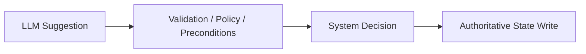
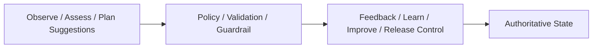

# Control Vs Intelligence Boundary Contract

## 1. 范围

本 contract 定义智能层与控制层之间的硬边界。

核心原则：`LLM 负责建议，系统代码负责裁决。`

相关文档：

- `policy_engine_contract.md`
- `runtime_execution_contract.md`
- `approval_and_hitl_contract.md`

## 2. 目标

- 防止模型输出直接越权控制系统。
- 把高风险决策收回到 deterministic system code。
- 明确哪些字段可以由 LLM 提议，哪些字段必须由系统生成或覆盖。

## 3. LLM 可以做的事

- 提议 division / role / plan
- 生成中间内容
- 给出风险说明
- 生成候选操作
- 生成用户可读解释
- 生成 `FeedbackSignal` / `LearningObject` / `ImprovementCandidate` 草案
- 生成 knowledge 摘要与 assess 建议

## 4. LLM 不可以直接做的事

- 直接放行 destructive action
- 直接决定 `timeout_behavior`
- 直接绕过 precondition
- 直接写最终 authoritative 状态
- 直接提升自身权限
- 直接签发 approval 通过结果
- 直接把 `LearningObject` 标记为 `validated/promoted`
- 直接把 `ImprovementCandidate` 推进到 `accepted/deployed/rolled_back`
- 直接修改 `StrategyVersion` 状态
- 直接推进 `RolloutRecord` 的 stage / status
- 直接修改 trust tier、L5/L6 memory promotion 或 feedback 处置结果

## 5. 边界图

## 5A. OAPEFLIR 边界图

## 6. 系统必须覆盖的字段

以下字段若出现在模型输出中，也只可视为建议，不得直接信任：

- `timeout_behavior`
- `approval_required`
- `risk_level`
- `final_status`
- `destructive_allowed`
- `budget_override`
- `policy_decision`
- `sandbox_mode`
- `allowed_paths`
- `allowed_tools`
- `promotion_status`
- `release_status`
- `guardrail_reason_codes`

## 7. 工程要求

- agent 输出 schema 要区分 `suggested_*` 和 authoritative 字段。
- repository / transition service 只接受经过系统层验证后的结构。
- audit 中应能看出“模型建议”和“系统最终裁决”的差异。
- UI / inspect / explainability 视图应能同时展示建议值、最终值和覆盖原因。
- OAPEFLIR 闭环中，`Observe/Assess/Plan` 可由模型辅助，但 `Learn.validate`、`Improve.guardrail`、`Release.transition` 必须由 deterministic code 执行。

## 8. 收口结论

工业级系统如果让模型既提议又裁决，就很难做到可审计、可预测、可托底。

因此这条边界必须是 architecture-level hard rule，而不是编码时的默契。
