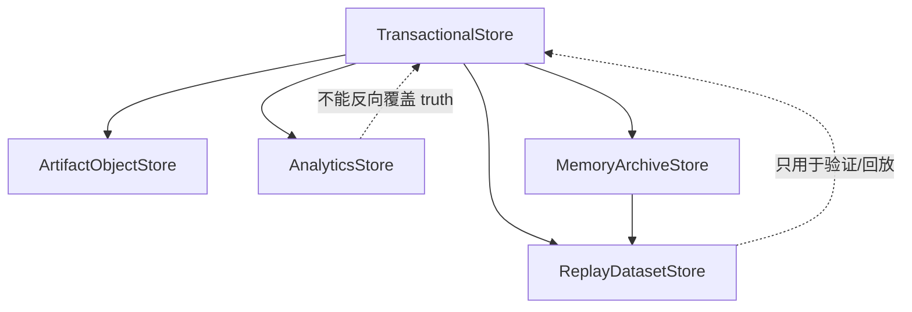
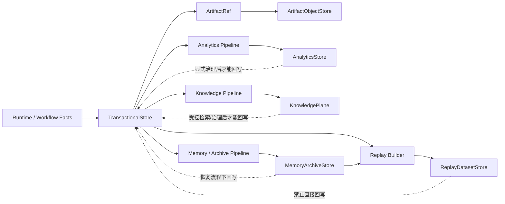
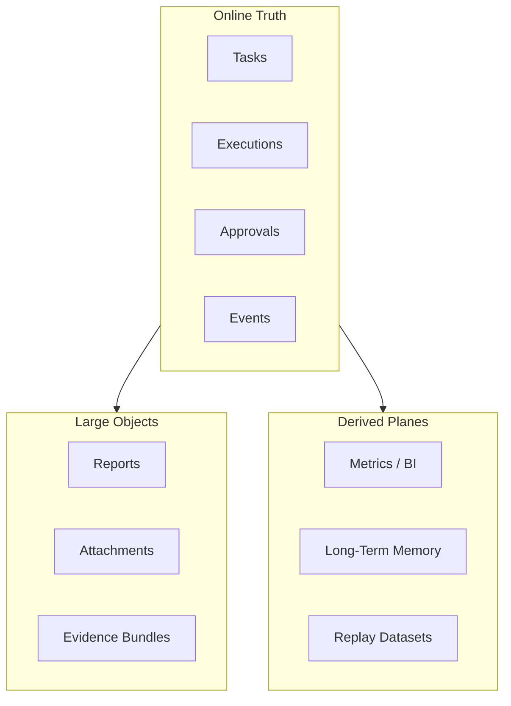

# Data Plane Contract

---

## OAPEFLIR 关联

本 contract 参与 OAPEFLIR 八阶段循环中的以下阶段：

- **Observe**：信号采集与聚合
- **Assess**：执行前评估与风险判断
- **Plan**：任务分解与 DAG 构建
- **Execute**：步骤执行与容错
- **Feedback**：信号收集与预处理
- **Learn**：模式检测与知识提取
- **Improve**：改进候选评估与 rollout
- **Release**：受控发布与回滚

---

## 1. 范围

本 contract 定义最终平台的数据平面分层，包括事务数据、artifact/object、analytics、knowledge、memory/archive 和 replay 数据。

它是 `storage_schema_contract.md` 的上位扩展，用于回答“不同数据应该存在哪里、由谁负责、如何流动、保留多久、谁是事实源”。

## 2. 目标

- 明确 authoritative transaction store。
- 明确 object / artifact 的命名空间、生命周期和引用语义。
- 明确 analytics、memory、archive、replay 的分层职责。
- 明确不同数据平面之间的同步和回写边界。

## 3. 非目标

- 本 contract 不规定具体数据库或对象存储产品选型。
- 本 contract 不替代 Phase 1a 的事务表字段定义。
- 本 contract 不要求所有数据平面在同一阶段一次性上线。

## 4. 数据平面分层

- `TransactionalStore`
- `ArtifactObjectStore`
- `AnalyticsStore`
- `KnowledgePlane`
- `MemoryArchiveStore`
- `ReplayDatasetStore`

## 5. 分层职责

`TransactionalStore`
: 保存任务、execution、approval、event、billing ledger ref 等事务事实。它是运行时 authoritative truth 的第一来源。

`ArtifactObjectStore`
: 保存大体积文件、报告、附件、模型输出、证据包、二进制工件。事务层只保留 ref，不直接存 BLOB。

`AnalyticsStore`
: 保存聚合指标、成本分析、转化、留存、usage 聚合、经营看板数据。它消费事实层，但不反向充当事实源。

`KnowledgePlane`
: 保存知识条目、检索索引、trust/freshness 元数据和 namespace 边界。它不是在线事务真相源。

`MemoryArchiveStore`
: 保存长期记忆、压缩摘要、演化归档、handover bundle 和 memory promotion 材料。必须保留 provenance。

`ReplayDatasetStore`
: 保存回放、评测、对比、regression 与 golden dataset。用于验证和学习，不作为在线事务源。

## 6. 数据拥有权原则

- 任务、execution、approval、event 的 authoritative owner 是 `TransactionalStore`。
- artifact 内容本体的 authoritative owner 是 `ArtifactObjectStore`。
- 指标与趋势分析的 authoritative owner 是 `AnalyticsStore`。
- 知识条目与 namespace 元数据的 authoritative owner 是 `KnowledgePlane`。
- 记忆与归档材料的 authoritative owner 是 `MemoryArchiveStore`。
- 评测和回放样本的 authoritative owner 是 `ReplayDatasetStore`。

规则：

- 任一 plane 读取其他 plane 数据时，应通过 ref、snapshot 或 pipeline，而不是私自复制语义。
- analytics 与 replay 不得反向覆盖 transaction truth。

## 7. 关键对象

- `DataNamespace`
- `ArtifactRef`
- `ArchiveBundle`
- `AnalyticsFact`
- `ReplayDataset`
- `DataMovementJob`
- `KnowledgeRef`
- `MemoryRef`

## 8. `DataNamespace` 最小字段

| 字段 | 类型 | 说明 |
| --- | --- | --- |
| `namespace_id` | `string` | 命名空间 ID |
| `plane` | `transactional \| artifact \| analytics \| knowledge \| memory_archive \| replay` | 所属平面 |
| `tenant_scope` | `string?` | 所属 tenant / org 边界 |
| `retention_policy` | `string` | 保留策略 |
| `encryption_policy` | `string` | 加密策略 |
| `residency_policy?` | `string` | 数据驻留要求 |

## 9. `ArtifactRef` 最小字段

- `artifact_id`
- `namespace_id`
- `object_key`
- `content_type`
- `size_bytes`
- `checksum`
- `created_at`
- `source_harness_run_id?`
- `source_node_run_id?`

规则：

- transaction 层只能保存 `ArtifactRef`，不能回灌 artifact 本体。
- artifact ref 必须稳定、可校验、可追溯。
- `source_harness_run_id` / `source_node_run_id` 为 canonical 关联键，`source_execution_id` 为 legacy 查询键，仅做兼容投影。`

## 10. `AnalyticsFact` 最小字段

- `fact_id`
- `metric_name`
- `dimension_json`
- `value`
- `window_start`
- `window_end`
- `source_ref`
- `captured_at`

规则：

- analytics fact 必须可以追溯到 transaction truth 或明确的 snapshot。
- 同一指标不得混用实时事实和人工估算而不做区分。

## 11. `ArchiveBundle` 与 `ReplayDataset`

`ArchiveBundle` 最小字段：

- `bundle_id`
- `bundle_type`
- `source_refs`
- `summary_ref`
- `created_at`

`ReplayDataset` 最小字段：

- `dataset_id`
- `dataset_type`
- `sample_refs`
- `truth_refs`
- `version`
- `created_at`

## 12. 数据流动规则

允许的主路径：

- transaction -> artifact ref
- transaction -> analytics
- transaction -> knowledge
- transaction -> memory/archive
- transaction + archive -> replay

限制：

- analytics -> transaction：仅允许通过显式决策回写，不允许直接覆写事实。
- knowledge -> transaction：仅允许通过受控检索、人工确认或显式治理回写。
- replay -> transaction：禁止直接成为在线真相源。
- archive -> transaction：只能通过人工确认或显式恢复流程回写。

### 12.1 数据流动流程图

## 12.2 平面归属图

## 13. Retention 与 Lifecycle

- transaction 记录按运行与审计要求保留。
- artifact 按类型、租户和合规要求保留。
- analytics 可做 rollup、downsample、ttl。
- knowledge 应支持 namespace、trust tier、freshness 衰减与过期策略。
- memory/archive 应支持 compaction，但 compaction 不得破坏 provenance。
- replay 数据集应支持版本化与过期策略。

## 14. Tenant / Security 约束

- 所有平面都必须具备 tenant-aware namespace。
- artifact/object 与 analytics 不能绕过 tenant scope 直接共享。
- archive 与 replay 数据集在跨 tenant 共享前必须有显式授权。
- residency / encryption 要在 namespace 层而不是 UI 层表达。

## 15. Data Movement Job

`DataMovementJob` 最小字段：

- `job_id`
- `source_plane`
- `target_plane`
- `input_refs`
- `status`
- `started_at`
- `finished_at?`

用途：

- archive compaction
- analytics ETL
- knowledge indexing / reindex
- replay dataset build
- artifact lifecycle move

## 16. 与现有文档的关系

- `storage_schema_contract.md` 是 Phase 1a 事务基线。
- `artifact_store_contract.md` 是 object / artifact 的最小边界。
- `monetization_metering_plane_contract.md` 会消费 analytics / transaction 数据。
- 本 contract 负责最终平台的数据平面分层演进模型。

## 17. 分阶段引入

- Phase 2: memory / archive 分层。
- Phase 3: analytics / PMF 数据层。
- Phase 4: enterprise 数据治理、跨平面迁移与 residency 控制。

## 18. 收口结论

Data plane 的关键不是“再加几个库”，而是为每种数据明确 owner、retention、security 和回写边界。

后续任何存储扩展，都应先判断它属于哪个 plane，再决定落地位置与事实源优先级。
