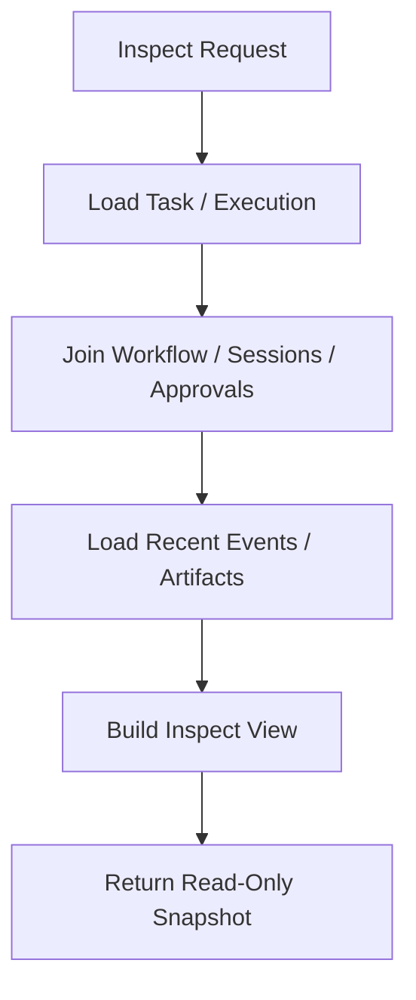

# Debug Inspect Health Backpressure Contract

---

## OAPEFLIR 关联

本 contract 参与 OAPEFLIR 八阶段循环中的以下阶段：

- **Observe**：信号采集与聚合
- **Assess**：执行前评估与风险判断
- **Plan**：任务分解与 DAG 构建
- **Execute**：步骤执行与容错
- **Feedback**：信号收集与预处理
- **Learn**：模式检测与知识提取
- **Improve**：改进候选评估与 rollout
- **Release**：受控发布与回滚

---

## 1. 范围

本 contract 定义运行时的调试入口、inspect 查询、健康检查和背压策略。

相关文档：

- `observability_contract.md`
- `api_surface_contract.md`
- `event_registry_and_ops_threshold_contract.md`
- `startup_consistency_and_recovery_drill_contract.md`
- `execution_plane_contract.md`

## 2. 目标

这份文档回答 4 个问题：

- 出问题时，开发者和运维能看什么。
- 外部系统如何判断服务是否健康。
- 如何一键检查单个 task / workflow / execution 的完整轨迹。
- 系统过载时如何拒绝、排队或降级，而不是继续把问题放大。

## 3. 关键对象

### 3.1 `HealthStatusReport`

| 字段 | 类型 | 说明 |
| --- | --- | --- |
| `status` | `ok \| degraded \| overloaded \| unhealthy` | 总体健康状态 |
| `uptime_seconds` | `number` | 运行时长 |
| `db_writable` | `boolean` | DB 是否可写 |
| `provider_health` | `healthy \| degraded \| failed` | provider 聚合健康 |
| `active_executions` | `number` | 活跃 execution 数 |
| `queued_tasks` | `number` | 排队任务数 |
| `oapeflir_loop_health` | `healthy \| drifting \| stalled \| failed?` | 闭环聚合健康 |
| `knowledge_plane_health` | `healthy \| degraded \| not_enabled?` | Knowledge Plane 健康或未启用 |
| `active_rollouts` | `number` | 当前活跃 rollout 数 |
| `event_loop_lag_ms` | `number?` | 事件循环延迟 |
| `memory_rss_mb` | `number?` | RSS 内存 |
| `tier1_ack_backlog` | `number` | Tier 1 未确认积压 |

### 3.2 `TaskInspectView`

- `task`
- `workflow_state?`
- `executions[]`
- `approvals[]`
- `sessions[]`
- `recent_events[]`
- `artifacts[]`
- `recovery_summary?`
- `current_stage?`
- `loop_iteration?`
- `oapeflir_timeline?`
- `feedback_signals[]?`
- `learning_objects[]?`
- `improvement_candidates[]?`
- `rollout_records[]?`

### 3.3 `DebugDump`

- `trace_id`
- `recent_logs`
- `state_snapshots`
- `event_tail`
- `warnings`
- `warning_summary`

### 3.4 `BackpressurePolicy`

- `max_queued_tasks`
- `max_active_executions`
- `provider_concurrency_limit`
- `memory_high_watermark_mb`
- `event_loop_lag_threshold_ms`
- `degradation_mode`

### 3.5 `QueueGovernanceMetrics`

- `queue_id`
- `fairness_index?`
- `min_share?`
- `max_share?`
- `oldest_wait_seconds`
- `backlog_size`
- `backlog_growth_rate?`
- `starvation_detected`

## 4. 健康检查

### 4.1 端点

统一健康端点为：

- `GET /healthz`

兼容规则：

- `GET /health` 可作为兼容 alias
- authoritative contract 以 `/healthz` 为准

### 4.2 状态语义

| status | 含义 | 默认 HTTP |
| --- | --- | --- |
| `ok` | 服务健康，可正常接流量 | `200` |
| `degraded` | 部分能力退化，但仍可服务 | `200` |
| `overloaded` | 进入背压/降级状态 | `429` 或 `503` |
| `unhealthy` | 核心依赖失效，不应继续接流量 | `503` |

### 4.3 最小检查项

Phase 1a 必做：

- 进程存活
- DB 可写
- 活跃 execution 数
- 排队任务数

Phase 1b 增强：

- provider 最近 5 分钟成功率
- event loop lag
- RSS / 内存压力
- Tier 1 ack backlog

## 5. Inspect 查询

### 5.1 最小接口

- `GET /tasks/:taskId/inspect`
- `GET /executions/:executionId/inspect`
- `GET /approvals/:approvalId/inspect`
- `GET /rollouts/:rolloutId/inspect`
- `GET /knowledge/:namespace/inspect`
- `GET /tasks/:taskId/oapeflir-timeline`

### 5.2 查询要求

- `task inspect` 应可还原 task 的主状态、workflow、execution、审批、会话和事件尾部
- `task inspect` 应能展示当前 `stage`、`loop_iteration`、最近 feedback / learn / improve / release 引用
- inspect 输出必须优先读 authoritative store，而不是只依赖内存状态
- inspect 查询不得改变业务状态
- 若存在恢复或接管历史，inspect 应展示最近一次恢复决定、触发原因和当前活跃 execution 所有权
- `oapeflir-timeline` 应能按时间顺序返回每轮 stage 状态、关键 evidence ref、审批 gate 和 rollout 动作
- rollout inspect 必须可还原 rollout level、status、metrics、approval、rollback lineage
- knowledge inspect 属于扩展入口；未启用 Knowledge Plane 时应返回明确的 `not_enabled`，而不是 404 伪装资源不存在



## 6. Debug 能力

最小调试能力：

- recent structured logs
- recent event tail
- state snapshots
- warning / error summary

规则：

- debug 默认不得暴露敏感内容
- 高敏感 payload 需脱敏或按权限受控展示
- debug dump 只用于问题定位，不得作为新的事实源
- `warnings` 保留兼容字符串数组输出，但应按 task 维度去重展示
- `warning_summary` 应聚合同类告警、统计被抑制的重复次数，并给出最小 escalation 路径

## 7. 背压策略

### 7.1 触发条件

至少考虑：

- `queued_tasks > max_queued_tasks`
- `active_executions > max_active_executions`
- provider 并发超限
- `memory_rss_mb > memory_high_watermark_mb`
- `event_loop_lag_ms > event_loop_lag_threshold_ms`
- Tier 1 ack backlog 持续超阈值
- queue fairness 持续恶化
- starvation entry 超过等待阈值

### 7.2 动作

| 场景 | 动作 |
| --- | --- |
| 队列积压 | 新任务排队或拒绝 |
| provider 过载 | 限流 / 延迟 / 降级模型 |
| 内存压力 | 限制新 execution，优先保活当前任务 |
| event loop lag | 标记 `degraded` 或 `overloaded` |
| Tier 1 积压 | 暂停非关键流量，优先恢复关键事件 |
| queue unfairness / starvation | 调整优先级、提升饥饿任务、限制热点租户或 worker |

### 7.3 降级模式

`degradation_mode` 枚举及决策优先级（从高到低）：

| 模式 | 触发条件 | 含义 |
| --- | --- | --- |
| `none` | `status == ok` | 无降级 |
| `read_only_operations_only` | DB 不可写 | 只允许只读操作 |
| `pause_non_critical` | Tier 1 ack backlog 超过 `overloaded` 阈值 | 暂停非关键流量，优先恢复关键事件 |
| `queue_only` | 队列压力（starvation / backlog / stale busy worker）或严重性能压力（memory > 110% 高水位 或 event loop lag > 150% 阈值） | 新非高优任务只排队不直接执行 |
| `fast_only` | provider 不健康或一般性能压力（memory > 高水位 或 event loop lag > 阈值） | 降级模型、限流或延迟 |

决策逻辑：

```
if status == ok:           → none
if !db_writable:           → read_only_operations_only
if tier1_ack_overloaded:   → pause_non_critical
if queue_pressure || severe_performance_pressure: → queue_only
if provider_degraded || performance_pressure:     → fast_only
else:                      → queue_only (保守默认)
```

### 7.3.1 降级模式与准入控制的联动

`AdmissionController` 根据当前 `degradation_mode` 做准入裁决：

| 降级模式 | 准入策略 |
| --- | --- |
| `read_only_operations_only` | 拒绝所有新任务（`admission.reject_read_only_mode`） |
| `pause_non_critical` | 仅允许高优任务（`high` / `urgent`），普通和低优任务被拒绝（`admission.reject_non_critical_paused`） |
| `queue_only` | 高优任务直接执行，普通和低优任务降级为排队（`admission.queue_backpressure`） |
| `fast_only` / `none` | 进入常规准入检查（预算、backlog、容量） |

额外准入保护：

- 预算超限时直接拒绝（`admission.reject_budget_exceeded`）
- `starvation_detected` 时拒绝低优任务（`admission.reject_starvation_protection`）
- Tier 1 ack backlog 达到硬上限时拒绝（`admission.reject_tier1_backlog`）
- 活跃 execution / 排队任务达到上限时拒绝或排队

规则：

- 背压不应 silently discard Tier 1 事实事件
- 降级模式必须可观测、可审计
- 准入拒绝必须返回结构化的 `reasonCode`，不得只返回泛化错误

### 7.4 Queue Governance

队列治理至少应回答：

- 是否出现长期 unfair scheduling
- 是否有 entry 长期饥饿
- backlog 是否在持续非正常增长

推荐阈值：

- `fairness_index < 0.8`
- `oldest_wait_seconds > starvation_threshold`
- `backlog_growth_rate` 持续超出增长窗口

## 8. 与 execution plane 的边界

- Phase 1a / 1b 的背压主要针对单机 runtime
- queue / worker registry / lease 级背压属于后续 execution plane
- 当前 contract 只冻结单机阶段的最小保护策略

## 9. Phase 边界

Phase 1a 做：

- `/healthz` 基线
- `task / execution / approval inspect` 基本查询
- 最小 backpressure thresholds
- 能按 `taskId` 追踪最后一次 tool call、失败原因和恢复历史
- `oapeflir-timeline` 至少能返回 phase1-4 闭环阶段、feedback、learning、improvement、release 的最小时间线

Phase 1b 做：

- debug dump / tail
- provider success rate
- event loop lag / memory pressure 指标
- 更细的 degradation mode

当前不做：

- 企业级监控告警平台
- 跨机队列调度背压
- Web UI 完整运维面板

## 10. 收口结论

没有 inspect、health 和 backpressure 的系统，问题一旦发生就只能靠猜；这份 contract 的作用，就是把“怎么看、何时算异常、过载时怎么缩”先定成正式边界。
