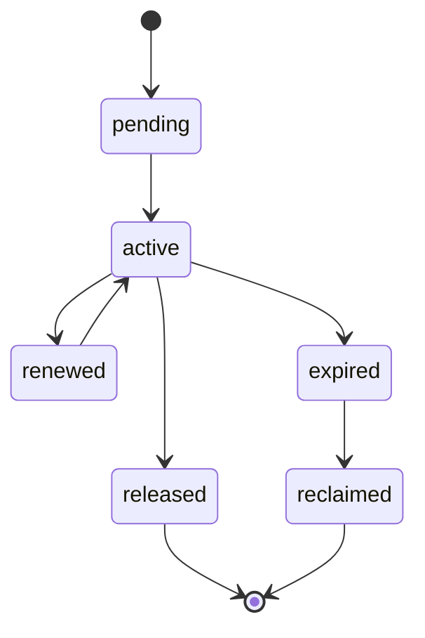

# Distributed Locking Contract

---

## OAPEFLIR 关联

本 contract 参与 OAPEFLIR 八阶段循环中的以下阶段：

- **Observe**：信号采集与聚合
- **Assess**：执行前评估与风险判断
- **Plan**：任务分解与 DAG 构建
- **Execute**：步骤执行与容错
- **Feedback**：信号收集与预处理
- **Learn**：模式检测与知识提取
- **Improve**：改进候选评估与 rollout
- **Release**：受控发布与回滚

---

## 1. 范围

本 contract 定义平台在工业级部署下的锁语义，包括本地锁、数据库锁、租约锁和审批互斥锁。

它解决的问题是：哪些锁只在单进程内有效，哪些锁必须跨 worker 保证，哪些操作只能依赖 lease 而不是通用锁。

相关文档：

- `file_lock_contract.md`
- `task_lease_and_fencing_contract.md`
- `production_storage_and_queue_contract.md`

## 2. 锁分类

| 锁类型 | authoritative backend | 主要用途 |
| --- | --- | --- |
| `local_mutex` | process memory | 单进程缓存刷新、单例初始化保护 |
| `file_lock` | authoritative store | 文件读写互斥 |
| `execution_lease` | authoritative store | execution 执行权 |
| `approval_lock` | authoritative store | 审批对象串行更新 |
| `advisory_lock` | PostgreSQL | 短事务内互斥、repair / migration / compaction 串行 |

## 3. 关键原则

- 不得把本地锁误当成分布式锁。
- execution ownership 优先使用 lease + fencing，不用普通 mutex 替代。
- 写锁必须有 TTL、续约、回收和 owner 识别。
- 锁的失败必须可观测、可告警、可恢复。
- 会影响 truth 的锁状态推进必须从属于统一状态写入口，不能在各调用方内部散写。

## 4. 推荐方案

- 短事务互斥：PostgreSQL advisory lock
- 长生命周期执行权：lease + fencing token
- 文件互斥：authoritative file lock repository
- Redis 锁不是当前首选事实源；若未来采用 Redlock，必须额外 ADR 说明风险边界

## 5. 锁状态机

说明：

- 上述状态机只描述 `LockRecord` / `LeaseRecord` 的资源生命周期，不是独立于运行时状态机之外的第二套 truth mutation 入口。
- 任何与 `execution_lease`、`approval_lock` 或系统维护锁相关的 truth 变更，都必须通过统一 command 入口落库并追加事实事件。

### 5.1 LockTransitionCommand

`LockTransitionCommand` 最少字段：

- `lock_id`
- `lock_type`
- `resource_key`
- `from_status`
- `to_status`
- `owner_id`
- `reason_code`
- `trace_id`
- `occurred_at`
- `fencing_token?`

规则：

- `execution_lease` 的获取、续约、过期、回收必须与 `RuntimeStateMachine.transition(command)` 协同工作；租约状态不得绕过统一状态写入口直接修改。
- 对 `execution_lease` 而言，锁状态推进必须与 `NodeRun` / `NodeAttempt` 的 lease / fencing 校验保持同一 truth 边界。
- `approval_lock`、`file_lock`、`advisory_lock` 若影响审计或系统维护 truth，也必须通过 append-only 事件和审计链记录。

## 6. 必备字段

- `lock_id`
- `lock_type`
- `resource_key`
- `owner_kind`
- `owner_id`
- `expires_at`
- `fencing_token?`
- `created_at`
- `updated_at`

## 7. 规则

- 任何分布式写锁都必须支持过期判定。
- 锁获取失败必须返回明确 `reason_code`，不能只返回 `false`。
- 锁释放必须校验 owner，避免误释放他人锁。
- 锁回收动作必须产生日志和审计事件。
- `execution_lease` 的状态推进不得成为 RuntimeStateMachine 旁路；若需要驱动 `NodeRun` 恢复、失败或接管，必须由统一状态机命令完成。

## 8. 适用边界

不应使用分布式锁的场景：

- 仅本地内存对象的无副作用去重
- 可重复执行、已具幂等语义的只读任务

必须使用 authoritative 分布式锁或 lease 的场景：

- 文件写入
- execution 主写入链
- 审批最终裁决
- migration / repair / reindex 等系统级维护动作

## 9. 故障处理

- 锁过期后，原 owner 不得继续写入。
- 如果网络分区造成 owner 自认为仍持锁，authoritative backend 仍以当前最新 token 为准。
- 锁表异常膨胀或过期锁堆积应触发运维告警。

## 10. 收口结论

工业级锁设计的重点不是“哪里都加锁”，而是先区分：

- 本地互斥
- 分布式资源锁
- execution lease

只有边界明确，系统才能既安全又不被锁设计拖垮。

## v4.3 Architecture Remediation

以下条目修复 `platform-architecture-implementation-consistency-audit.md` 中记录的 contract 偏差。本文档历史段落如与本节冲突，以本节、`docs_zh/architecture/00-platform-architecture.md`、ADR-109 至 ADR-113、以及 `src/platform/contracts/executable-contracts/` 为准。

- T-31: 本文原先把锁状态机写成一套独立自洽的生命周期，却没有说明它如何从属于统一状态写入口，根因是早期锁合同把 lease/lock 当成基础设施细节，忽略了它们一旦影响执行权就进入 runtime truth 边界。修复：正文现补入 `LockTransitionCommand`，并明确 `execution_lease` 的状态推进必须与 `RuntimeStateMachine.transition(command)` 协同，不能成为旁路状态机。

强制规则：状态迁移必须通过 `RuntimeStateMachine.transition(command)`；执行计划必须使用 `PlanGraphBundle`；执行结果必须使用 `NodeAttemptReceipt`；truth event 只能使用 `platform.*`；OAPEFLIR 只能作为 `oapeflir.view.*` / rationale 投影；预算必须使用 `BudgetLedger` / `BudgetReservation` / `BudgetSettlement`。
