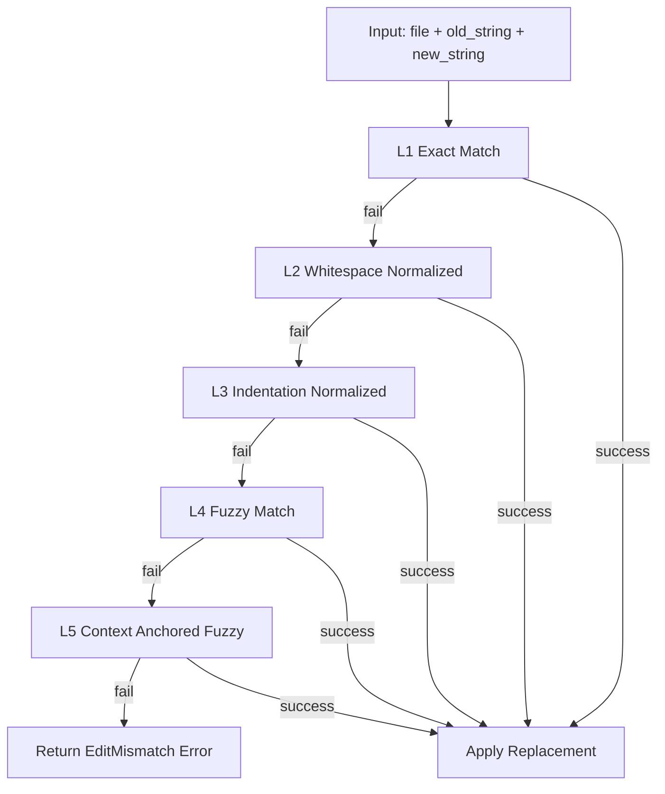

# Edit Replacement Chain Contract

---

## OAPEFLIR 关联

本 contract 参与 OAPEFLIR 八阶段循环中的以下阶段：

- **Observe**：信号采集与聚合
- **Assess**：执行前评估与风险判断
- **Plan**：任务分解与 DAG 构建
- **Execute**：步骤执行与容错
- **Feedback**：信号收集与预处理
- **Learn**：模式检测与知识提取
- **Improve**：改进候选评估与 rollout
- **Release**：受控发布与回滚

---

## 1. 范围

本 contract 定义 `edit / patch / replace` 类工具在定位旧内容并应用替换时的多级匹配链。

相关文档：

- `tool_and_provider_execution_contract.md`
- `file_lock_contract.md`
- `tool_output_sanitization_contract.md`
- `idempotency_and_recovery_matrix_contract.md`

## 2. 目标

多级匹配链要同时解决两类问题：

- LLM 生成的 `old_string` 与真实文件存在轻微空白、缩进、换行偏差。
- 为了提高成功率，不能直接把模糊替换放大成静默误改风险。

## 3. 核心原则

- 匹配链必须按固定顺序尝试，首次成功即停。
- 越模糊的匹配等级，安全约束必须越严格。
- 任一非精确替换都必须留下 warning 和审计记录。
- 无法唯一定位时必须失败，而不是“猜一个差不多的地方”。

## 4. `EditReplacementAttempt`

| 字段 | 类型 | 说明 |
| --- | --- | --- |
| `attempt_level` | `exact \| whitespace_normalized \| indentation_normalized \| fuzzy \| context_anchored` | 匹配等级 |
| `matched` | `boolean` | 是否成功定位 |
| `candidate_count` | `number` | 候选数量 |
| `similarity_score` | `number?` | 模糊匹配得分 |
| `warning_codes` | `string[]` | 风险提示 |
| `applied_range` | `string?` | 变更位置 |

## 5. 多级匹配链

### 5.1 Level 1 `exact`

- 精确字符串匹配
- 不做任何归一化
- 若唯一命中则直接应用

### 5.2 Level 2 `whitespace_normalized`

- 归一化连续空白
- 去除尾随空白差异
- 不改变语义字符顺序

### 5.3 Level 3 `indentation_normalized`

- 剥离公共缩进后再匹配
- 适用于代码块整体缩进变化
- 应保留替换后目标文件的当前缩进风格

### 5.4 Level 4 `fuzzy`

- 仅在前 3 级全部失败后尝试
- 需要 `similarity_score >= 0.85`
- 必须只有唯一候选
- 成功时必须记录 warning：`fuzzy_edit_applied`

### 5.5 Level 5 `context_anchored`

- 用前后锚点先缩小候选区域，再做模糊匹配
- 仅允许在唯一锚点窗口中生效
- 成功时必须记录更强 warning：`anchored_fuzzy_edit_applied`

## 6. 当前明确不做

Phase 1a / 1b 不做：

- AST 感知替换
- tree-sitter 级结构化节点定位
- 跨文件语义重写

这些能力若要引入，应进入 Phase 2 并单独补 ADR 或 contract。

## 7. 安全约束

- 同一请求若出现多个候选，必须失败并返回冲突信息。
- 任何 fuzzy 成功结果都应返回 warning，供上层 message 或日志提示人工复核。
- 不允许在 binary / 非文本文件上启用多级匹配链。
- 应用替换前必须先持有 `write` 锁。

## 8. 错误语义

建议稳定错误码：

- `tool.edit_target_not_found`
- `tool.edit_multiple_candidates`
- `tool.edit_similarity_too_low`
- `tool.execution_failed`

规则：

- 找不到目标与“找到多个目标”必须分开报错。
- similarity 不达阈值应显式失败，不得偷偷降级应用。

## 9. 幂等与恢复

- 若替换后文件内容已等于期望结果，可视为幂等成功。
- 恢复重试前应先重新读取目标文件，而不是直接复用旧候选范围。
- fuzzy / anchored 级别的重试不得在文件已变化后继续沿用旧得分。

## 10. Phase 边界

Phase 1a 做：

- `exact`
- `whitespace_normalized`
- `indentation_normalized`

Phase 1b 才做：

- `fuzzy`
- `context_anchored`

## 11. 收口结论

Edit 成功率的提升不能靠“更敢改”，而要靠一条收紧顺序、明示风险、失败可解释的匹配链。
