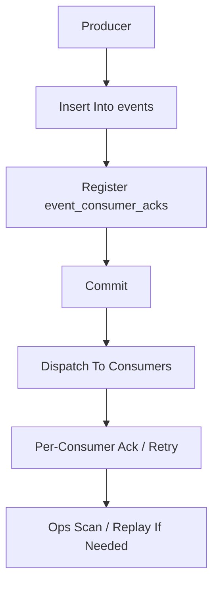

# Event Registry And Ops Threshold Contract

> **v4.3 兼容说明**：本文件保留为历史事件注册表与运维阈值说明。v4.3 事件分层以 [ADR-111](../adr/111-platform-fact-vs-oapeflir-view-events.md) 和 [event-envelope-contract.md](./event-envelope-contract.md) 为准；`platform.*` 是 truth fact，`oapeflir.view.*` / `oapeflir.rationale.*` 只作为 projection。

> **OAPEFLIR 相关**：本 contract 定义 OAPEFLIR 8 阶段的事件注册表，对应 ADR-016/ADR-079/ADR-080。
> **更新日期**：2026-04-17

## 1. 范围

本 contract 在 `event_reliability_matrix_contract.md` 之上，继续冻结当前阶段的事件注册表、消费者关系和运维阈值。

相关文档：

- `event_bus_contract.md`
- `event_reliability_matrix_contract.md`
- `storage_schema_contract.md`
- `startup_consistency_and_recovery_drill_contract.md`
- [ADR-079 Feedback Hub](../adr/079-feedback-hub-signals.md)
- [ADR-080 Learn Hub](../adr/080-learn-hub-pattern-detection.md)

## 2. 目标

这份文档回答 3 个问题：

- 当前有哪些稳定事件类型。
- 每类事件由谁生产、谁消费、是否需要 ack。
- 什么时候积压或丢失会变成运维告警。

## 3. 注册原则

- 进入实现的事件必须先登记到这里。
- Tier 1 事件必须声明 producer、consumer、ack 策略和重放要求。
- Tier 2 / 3 即使不强制 ack，也要明确使用场景，避免事件语义漂移。
- 每条注册事件自动携带 `payloadSchemaRef`（默认 `event://{domain}/{action}/v1`）和 `compatibilityPolicy`（默认 `backward_compatible_additive`），供 typed event bus 层做编译期校验。
- `producer` 字段表示稳定的生产者服务标识，不等同于 truth event namespace；`platform.*` / `oapeflir.view.*` 由 `event_type` 决定。
- 历史 `task:*` / `workflow:*` / `dispatch:*` / `worker:*` 事件允许保留兼容 producer id，避免旧投影器、回放工具和审计证据链断裂；truth fact 是否 canonical 以 `event_type` namespace 为准。

## 4. Ring 1 / Ring 2 事件注册表

> 本表只冻结高频与运维关键事件的基线语义；完整 canonical registry 以 `src/platform/five-plane-state-evidence/events/event-registry.ts` 为准，并由 `event-types.ts` / typed event bus 做编译期校验。新增低频或细分 `platform.*` 子事件时，可先落源码注册表，再按本 contract 的分层/producer/consumer 规则补文档，不再要求此表逐条镜像全部 140+ 事件。

| event_type | tier | producer | primary_consumers | ack_required | replay_required |
| --- | --- | --- | --- | --- | --- |
| `platform.harness_run.created` | `tier1` | harness runtime | truth projector, audit projection | 是 | 是 |
| `platform.harness_run.status_changed` | `tier1` | harness runtime | truth projector, audit projection | 是 | 是 |
| `platform.harness_run.completed` | `tier1` | harness runtime | truth projector, audit projection | 是 | 是 |
| `platform.node_run.created` | `tier1` | harness runtime | truth projector, audit projection | 是 | 是 |
| `platform.node_run.completed` | `tier1` | harness runtime | truth projector, audit projection | 是 | 是 |
| `platform.harness_run.failed` | `tier1` | harness runtime | truth projector, audit projection | 是 | 是 |
| `approval.requested` | `tier1` | transition service / policy engine | gateway, approval inbox | 是 | 是 |
| `approval.resolved` | `tier1` | approval service | runtime, gateway | 是 | 是 |
| `execution:status_changed` | `tier1` | runtime | supervisor, recovery scan, observability | 是 | 是 |
| `cost:limit_reached` | `tier1` | budget guard / policy engine | runtime, gateway, observability | 是 | 是 |
| `secret:rotation_scheduled_initial` | `tier2` | secret rotation scheduler | observability, audit projection | 否 | 建议 |
| `secret:rotation_scheduled` | `tier2` | secret rotation scheduler | observability, audit projection | 否 | 建议 |
| `secret:rotation_initial_check_error` | `tier2` | secret rotation scheduler | observability, operator alerts | 否 | 建议 |
| `secret:rotation_scheduler_error` | `tier2` | secret rotation scheduler | observability, operator alerts | 否 | 建议 |
| `secret:rotation_scheduler_overlap` | `tier2` | secret rotation scheduler | observability, operator alerts | 否 | 建议 |
| `oapeflir.view.run_lifecycle` | `tier2` | oapeflir loop service | oapeflir projection, inspect projection | 否 | 建议 |
| `feedback.signal_received` | `tier2` | feedback hub / gateway / explainability pipeline | learn hub, observability, inspect projection | 否 | 建议 |
| `learn.object_created` | `tier2` | learn hub | observability, inspect projection | 否 | 建议 |
| `learn.object_promoted` | `tier2` | learn hub | improvement pipeline, observability, inspect projection | 否 | 建议 |
| `improve.candidate_proposed` | `tier2` | improve hub | observability, inspect projection | 否 | 建议 |
| `improve.candidate_accepted` | `tier1` | improve hub / guardrail evaluator | release hub, observability, audit lineage | 是 | 是 |
| `release.rollout_started` | `tier1` | release hub | observability, audit lineage, inspect projection | 是 | 是 |
| `release.rollout_completed` | `tier1` | release hub | observability, audit lineage, inspect projection | 是 | 是 |
| `release.rollback_triggered` | `tier1` | release hub / supervisor | observability, audit lineage, inspect projection | 是 | 是 |
| `stream.chunk_emitted` | `tier3` | gateway streaming bridge | UI / channel client | 否 | 否 |
| `dispatch:ticket_created` | `tier2` | execution dispatch service | inspect_projection | 否 | 建议 |
| `dispatch:ticket_claimed` | `tier2` | execution dispatch service | inspect_projection | 否 | 建议 |
| `dispatch:decision_recorded` | `tier2` | execution dispatch service | inspect_projection | 否 | 建议 |
| `dispatch:execution_preempted` | `tier2` | execution priority preemption service | inspect_projection | 否 | 否 |
| `dispatch:ticket_reconciled` | `tier2` | execution dispatch reconciliation service | inspect_projection | 否 | 否 |
| `dispatch:ticket_requeued` | `tier2` | execution dispatch reconciliation service | inspect_projection | 否 | 否 |
| `dispatch:ticket_rebuilt` | `tier2` | execution DB queue disconnect repair service | inspect_projection | 否 | 否 |
| `worker:claim_accepted` | `tier2` | execution worker handshake service | inspect_projection | 否 | 建议 |
| `worker:claim_rejected` | `tier2` | execution worker handshake service | inspect_projection | 否 | 否 |
| `worker:heartbeat_recorded` | `tier2` | execution worker handshake service | inspect_projection | 否 | 否 |
| `worker:writeback_recorded` | `tier2` | execution worker writeback service | inspect_projection | 否 | 建议 |
| `worker:writeback_rejected` | `tier2` | execution worker writeback service | inspect_projection | 否 | 否 |
| `worker:lease_released_after_writeback` | `tier2` | execution worker writeback service | inspect_projection | 否 | 否 |
| `takeover:session_opened` | `tier2` | human takeover service | inspect_projection | 否 | 建议 |
| `takeover:action_applied` | `tier2` | human takeover service | inspect_projection | 否 | 建议 |
| `takeover:acknowledged` | `tier2` | human takeover service | inspect_projection | 否 | 建议 |
| `takeover:completed` | `tier2` | human takeover service | inspect_projection | 否 | 建议 |
| `takeover:timeout` | `tier2` | human takeover service | inspect_projection | 否 | 建议 |
| `takeover:escalated` | `tier2` | human takeover service | inspect_projection | 否 | 建议 |
| `takeover:cancelled` | `tier2` | human takeover service | inspect_projection | 否 | 建议 |
| `takeover:request_enqueued` | `tier2` | human takeover service | inspect_projection | 否 | 建议 |
| `takeover:request_processed` | `tier2` | human takeover service | inspect_projection | 否 | 建议 |
| `takeover:ack_expired` | `tier2` | human takeover service | inspect_projection | 否 | 建议 |
| `recovery:repair_applied` | `tier2` | runtime repair service | inspect_projection | 否 | 建议 |
| `recovery:decision_recorded` | `tier2` | runtime recovery decision service | inspect_projection | 否 | 建议 |
| `recovery:dead_lettered` | `tier2` | runtime recovery decision service | inspect_projection | 否 | 建议 |
| `recovery:cancelled` | `tier2` | runtime recovery decision service | inspect_projection | 否 | 否 |
| `skill:execution_started` | `tier2` | skill execution service | inspect_projection | 否 | 否 |
| `skill:cache_miss` | `tier2` | skill execution service | inspect_projection | 否 | 否 |
| `skill:cache_hit` | `tier2` | skill execution service | inspect_projection | 否 | 否 |
| `skill:cache_stored` | `tier2` | skill execution service | inspect_projection | 否 | 否 |
| `skill:step_started` | `tier2` | skill execution service | inspect_projection | 否 | 否 |
| `skill:retry_scheduled` | `tier2` | skill execution service | inspect_projection | 否 | 否 |
| `skill:step_succeeded` | `tier2` | skill execution service | inspect_projection | 否 | 否 |
| `skill:step_failed` | `tier2` | skill execution service | inspect_projection | 否 | 否 |
| `skill:execution_completed` | `tier2` | skill execution service | inspect_projection | 否 | 否 |

## 5. 消费者规范

### 5.1 Tier 1 消费者

Tier 1 的标准消费者至少包括：

- `runtime_recovery_scanner`
- `gateway_projection`
- `observability_sink`

规则：

- 同一 Tier 1 事件可由多个消费者独立确认。
- 某个消费者失败不得覆盖其他消费者的确认结果。
- 新增 Tier 1 消费者时，必须同步评估启动巡检和 ack 阈值。
- `gateway_projection`、`runtime_recovery_scanner`、`observability_sink` 的 `consumer_id` 必须保持稳定，不得因进程重启漂移。

### 5.2 Tier 2 消费者

当前 Tier 2 事件的主要消费者为 `inspect_projection`，用于维护 inspect / diagnostics / timeline 的结构化投影。

按领域分组：

- **OAPEFLIR 事件**（`oapeflir.*`、`feedback.*`、`learn.*`、`improve.*`、`release.*`、`loop.*`）：由各 hub 生产，投射到闭环时间线、反馈链和 rollout 诊断视图。
- **dispatch 事件**（`dispatch:*`）：由 `execution_dispatch_service` 或 `execution_dispatch_reconciliation_service` 生产，投射到 dispatch decision trace 与 ticket 状态。
- **worker 事件**（`worker:*`）：由 `execution_worker_handshake_service` 和 `execution_worker_writeback_service` 生产，投射到 worker lease 状态与 fencing audit。
- **takeover 事件**（`takeover:*`）：由 `human_takeover_service` 生产，投射到人工接管审计链。
- **recovery 事件**（`recovery:*`）：由 `runtime_repair_service` 和 `runtime_recovery_decision_service` 生产，投射到恢复决策与死信审计链。
- **skill 事件**（`skill:*`）：由 `skill_execution_service` 生产，投射到 skill 执行可观测链。覆盖 skill 完整生命周期：启动、缓存命中/未命中/存储、步骤开始/成功/失败、重试调度、执行完成。

规则：

- Tier 2 可不做持久化 ack，但若承担关键投影功能，应在实现里显式声明降级策略。

### 5.3 Tier 3 消费者

- 不做持久化 ack
- 不得伪装成可恢复事实源

## 6. 运维阈值

### 6.1 积压告警

| 指标 | 阈值 | 动作 |
| --- | --- | --- |
| Tier 1 未 ack 事件数 | `> 0` 且持续 `5m` | 告警 |
| 单消费者 Tier 1 积压 | `>= 20` | 告警并触发恢复扫描 |
| Tier 2 积压 | `>= 100` 且持续 `10m` | 可选告警 |
| Tier 3 丢失 | 不单独告警 | 仅监控趋势 |

### 6.2 时延阈值

| 指标 | 建议阈值 | 动作 |
| --- | --- | --- |
| Tier 1 从写入到首次分发延迟 | `> 5s` | 告警 |
| Tier 1 从写入到全部 ack 延迟 | `> 30s` | 告警 |
| Tier 2 从写入到分发延迟 | `> 30s` | 可选告警 |

### 6.3 恢复阈值

| 场景 | 阈值 | 动作 |
| --- | --- | --- |
| Tier 1 ack 连续失败 | `>= 3` 次 | 标记 `degraded` 并进入恢复 |
| 同一事件重放次数 | `>= 5` 次 | 人工介入 |
| 单消费者长期失活 | `> 10m` | 暂停注册或降级投影 |

## 7. 写入与分发顺序

规则：

- Tier 1 必须完整走这条链。
- Tier 2 可跳过 `event_consumer_acks`，但若未来承担关键投影，应升级为 Tier 1。
- Tier 3 不得伪装成可恢复事实源。

## 8. 启动巡检联动

启动巡检最少检查：

- 是否存在超过阈值未 ack 的 Tier 1 事件
- 是否存在 `event_type` 已生产但未登记到注册表
- 是否存在消费者状态与注册表不一致的事件

## 9. Phase 边界

Phase 1a 做：

- Tier 1 / 2 / 3 基线注册表
- Tier 1 per-consumer ack
- 基本积压阈值

Phase 1b 做：

- 更多 gateway / orchestration 事件类型
- 更细的消费者分组和投影告警

当前不做：

- 外部消息队列分区策略
- 跨区域事件复制
- 企业级事件保留策略

## 10. 收口结论

事件系统是否可靠，不只取决于“事件会不会发出去”，而取决于有没有一张稳定注册表说明谁该收到、多久该收到、没收到时系统会怎么反应。
