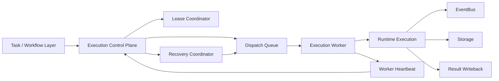
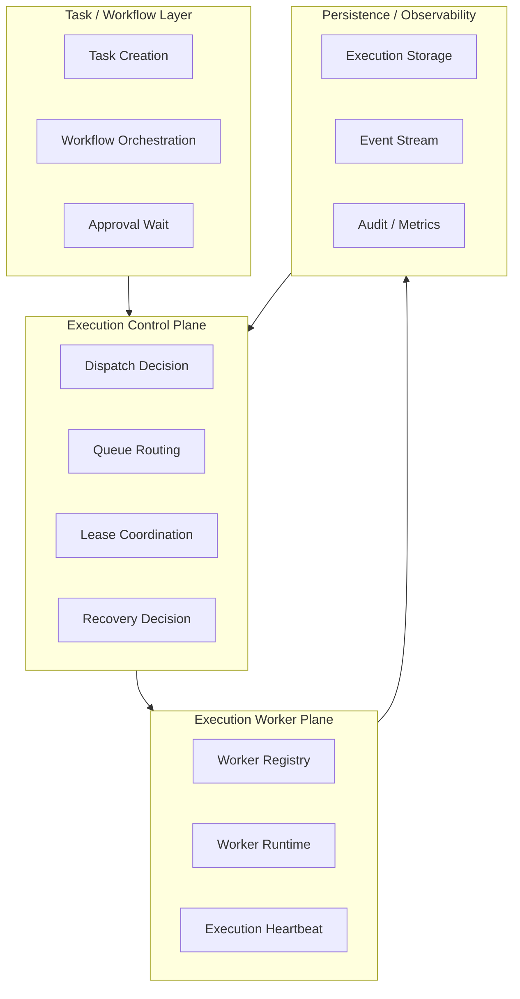
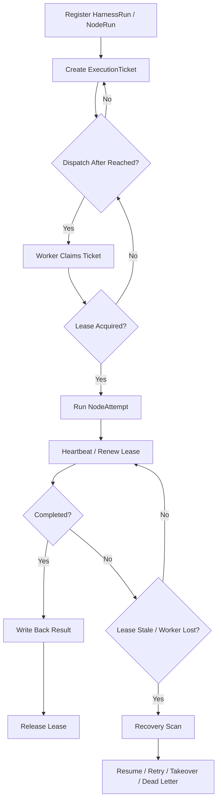

# Execution Plane Contract

> **v4.3 兼容说明**：本文件保留为历史 execution plane 说明。v4.3 P3 -> P4 执行交接以 [plan-graph-patch-contract.md](./plan-graph-patch-contract.md) 为准，P4 状态推进以 [ADR-110](../adr/110-runtime-state-machine-authority.md) 为准；线性 execution / workflow 语义只能作为 legacy projection。

> **OAPEFLIR 相关**：本 contract 定义 OAPEFLIR Execute Hub 的执行平面，对应 ADR-016 Execute 阶段和 ADR-079 Feedback Hub。
> **更新日期**：2026-04-17

## 1. 范围

本 contract 定义平台从单机 runtime 演进到多执行平面的目标架构，包括调度、派发、租约、worker 存活、接管、恢复和执行权治理。

它是 `runtime_execution_contract.md` 的上位扩展，用于回答”当 execution 不再只在单进程里跑时，平台如何保持可控、可恢复、可审计”。

## 2. 目标

- 把 `control plane` 与 `execution plane` 正式分层。
- 让 execution 可以跨 worker 调度、恢复和接管。
- 保证 stale run、failover、handover 和 takeover 有统一语义。
- 保证多 worker 环境下仍然只有一个 authoritative 执行权持有者。

## 3. 非目标

- Phase 1a 不要求上完整分布式队列集群。
- 本 contract 不规定具体队列后端产品选型。
- 本 contract 不替代单次 run 的状态机与执行语义定义。

## 4. 架构分层

`Task / Workflow Layer`
: 负责任务生成、workflow 编排、审批等待与结果写回。

`Execution Control Plane`
: 负责 dispatch、lease、route、capacity awareness、recovery decision。

`Execution Worker Plane`
: 负责真正消费 execution ticket、执行 run、上报 heartbeat 和结果。

`Recovery And Governance Hooks`
: 负责 stale detection、takeover proposal、kill / freeze / retry 决策联动。

`Plan / Feedback Boundary（OAPEFLIR）`
: P3 只允许下发 `PlanGraphBundle` / `GraphPatch`；execution plane 执行后先写回 `NodeAttemptReceipt`，`FeedbackSignal` 与用户摘要只能作为基于回执的派生 view（对应 ADR-079）。

## 5. 关键组件

- `ExecutionControlPlane`
- `DispatchQueue`
- `LeaseCoordinator`
- `ExecutionWorker`
- `RecoveryCoordinator`
- `WorkerRegistry`
- `WorkerHeartbeat`
- `TakeoverManager`
- `PlanGraphBundle`（P3 -> P4 唯一执行计划合约）
- `NodeAttemptReceipt`（P4 -> 其他平面的唯一执行回执）
- `FeedbackSignal`（基于 `NodeAttemptReceipt` 派生的认知/学习输入）

## 6. Target Architecture

补充说明：

- `ExecutionControlPlane` 负责决定“谁该执行”。
- `ExecutionWorker` 负责执行“已经被授权执行的 run”。
- `LeaseCoordinator` 负责保证同一 execution 同时只被一个 worker 持有。
- `RecoveryCoordinator` 负责扫描陈旧 execution 并决定恢复、重试、接管或死信。

## 6.1 执行平面分层图

## 7. 关键对象

- `ExecutionTicket`
- `DispatchDecision`
- `LeaseRecord`
- `WorkerSnapshot`
- `RecoveryDecision`
- `TakeoverProposal`
- `WorkerCapabilitySet`

## 8. `ExecutionTicket` 最小字段

| 字段 | 类型 | 说明 |
| --- | --- | --- |
| `ticket_id` | `string` | 派发票据 ID |
| `harness_run_id` | `string` | 目标 HarnessRun |
| `node_run_id` | `string` | 目标 NodeRun |
| `attempt_id` | `string` | 当前 NodeAttempt |
| `task_id` | `string?` | 兼容查询入口；非 truth 主键 |
| `plan_graph_bundle_id` | `string` | 关联执行图 bundle |
| `graph_version` | `number` | 对应 graph 版本 |
| `stage_view_ref` | `string?` | 关联 OAPEFLIR 阶段 view；仅用于解释/展示，不驱动执行 |
| `priority` | `low \| normal \| high \| urgent` | 调度优先级 |
| `queue_name` | `string` | 目标队列 |
| `required_capabilities` | `string[]` | worker 必需能力 |
| `dispatch_target` | `any \| local_only \| prefer_remote \| require_remote` | 调度目标策略 |
| `required_isolation_level` | `standard \| hardened \| strict` | 最低隔离等级要求 |
| `required_repo_version?` | `string` | 要求 worker 代码版本匹配 |
| `dispatch_after` | `timestamp?` | 最早派发时间 |
| `attempt_no` | `integer` | 该票据关联的尝试次数 |
| `created_at` | `timestamp` | 创建时间 |

### 8.1 Dispatch Target 语义

| 策略 | 含义 |
| --- | --- |
| `any` | 对 worker 部署位置无偏好，本地和远程均可 |
| `local_only` | 只允许本地 worker 执行，远程 worker 被排除 |
| `prefer_remote` | 优先远程 worker；若无可用远程 worker，降级到本地 |
| `require_remote` | 必须远程 worker；无可用远程 worker 时 fail-closed（不降级） |

规则：

- `require_remote` 且远程 worker 部分可用时，dispatch 应返回 `remote.partial_available` 并拒绝派发，而不是降级到本地。
- dispatch target 由 ticket 创建者（orchestrator / operator）决定，不得由 worker 自行修改。

### 8.2 Isolation Level 语义

Worker 隔离等级有序排列：`standard (0) < hardened (1) < strict (2)`。

| 等级 | 含义 |
| --- | --- |
| `standard` | 标准沙箱 |
| `hardened` | 加固沙箱（额外网络/文件系统限制） |
| `strict` | 严格隔离（最小权限） |

规则：

- 高风险 execution 可声明 `required_isolation_level`，worker 的实际隔离等级必须 >= 要求等级才允许接受。
- 隔离等级不满足时，dispatch 应在 decision trace 中记录拒绝原因。

### 8.3 Repo Version Consistency

- execution ticket 可声明 `required_repo_version`。
- worker heartbeat 上报 `repoVersion`。
- 若版本不匹配，dispatch 默认 fail-closed 并记录拒绝。

### 8.4 一般规则

- 一个 `node_run_id` 在同一 `attempt_id` 下应只对应一个 active ticket。
- ticket 失效后不得再次被 worker 消费。
- execute plane 接到的 authoritative 输入必须来自 `PlanGraphBundle`，而不是 `PlanDTO` 或非结构化 prompt 拼接。

## 8A. OAPEFLIR Plan → Execute → Feedback 边界

### 8A.1 Plan Hub → Execute（对应 ADR-060）

`PlanGraphBundle` 进入 execution plane 时最少应提供：

- `planGraphBundleId`
- `harnessRunId`
- `graphVersion`
- `graph.graphId`
- `graph.nodes[]`
- `graph.edges[]`
- `schedulerPolicy`
- `budget`
- `riskProfile`

**P3 -> P4 约束**：
- Execute 层只能接收 `PlanGraphBundle` / `GraphPatch`，不允许旁路 raw task 或线性 `PlanDTO` 直接执行。
- graph 版本链必须保持稳定 lineage，不得被新 worker 静默改写。
- 已生成 `NodeAttemptReceipt` 的节点语义不得通过新 worker 原地重写。

### 8A.2 Execute → Feedback Hub（对应 ADR-079）

execution plane 完成单次 attempt 后，truth 输出必须先落 `NodeAttemptReceipt`：

- `receiptId`
- `nodeAttemptId`
- `nodeRunId`
- `status`
- `outputRef?`
- `sideEffectRefs[]`
- `budgetSettlementRefs[]`
- `evidenceRefs[]`

在此基础上，其他平面或读模型可以派生：

- `FeedbackSignal[]`
- `artifact_refs[]`
- `policy_decision_ref?`
- `release_evidence_ref?`
- `DualChannelStepOutput`（用户展示投影）

**规则**：

- `NodeAttemptReceipt` 是 Execute → 其他平面的正式 truth 输出，不得只通过日志侧带。
- `FeedbackSignal` 必须显式关联 `receiptId`、`planGraphBundleId` 与 `graphVersion`，作为派生认知输入，而不是替代回执。
- 若某次 attempt 没有产生 feedback，也应显式记录 `feedback_count=0` 或等价 evidence，避免后续 Learn / Improve 误判链路缺失。
- `DualChannelStepOutput` 只允许作为用户展示投影，不得成为 recovery、budget settlement 或 side-effect confirmation 的唯一依据。

## 9. `LeaseRecord` 最小字段

| 字段 | 类型 | 说明 |
| --- | --- | --- |
| `lease_id` | `string` | 租约 ID |
| `harness_run_id` | `string` | 所属 HarnessRun |
| `node_run_id` | `string` | 目标 NodeRun |
| `attempt_id` | `string?` | 关联 NodeAttempt |
| `worker_id` | `string` | 当前持有者 |
| `acquired_at` | `timestamp` | 获取时间 |
| `expires_at` | `timestamp` | 到期时间 |
| `last_heartbeat_at` | `timestamp?` | 最近续约时间 |
| `status` | `active \| expired \| released \| reclaimed \| handed_over` | 租约状态（对齐 `task_lease_and_fencing_contract.md` §5） |

规则：

- 同一时刻同一 `node_run_id` 只能有一个 `active` lease。
- worker 不得在未获得 active lease 时执行副作用步骤。
- lease 过期后，原 worker 视为失去执行权，即使本地进程仍活着。

## 10. `WorkerSnapshot` 最小字段

- `worker_id`
- `status` (`idle | busy | draining | degraded | unavailable | quarantined | offline`)
- `capabilities`
- `running_executions`
- `last_heartbeat_at`
- `max_concurrency`
- `queue_affinity?`
- `isolation_level` (`standard | hardened | strict`)
- `saturation`（负载饱和度）
- `repo_version?`
- `remote_session_status?`（`connecting | connected | reconnecting | degraded | failed | viewer_only`）
- `last_acknowledged_stream_offset?`
- `resume_ready?`
- `credential_expiry_at?`
- `consistency_check_status?`（`passed | failed | pending`）
- `runtime_instance_id?`
- `restart_generation?`（重启代数）
- `parent_runtime_instance_id?`

### 10.1 Worker 状态语义

| status | 含义 | 可接受新 dispatch |
| --- | --- | --- |
| `idle` | 空闲，无正在执行的任务 | 是 |
| `busy` | 正在执行任务，未达饱和 | 是（受 max_concurrency 约束） |
| `draining` | 维护中，可完成手头任务，不接新任务 | 否 |
| `degraded` | 能力部分退化（如 provider 超时、内存压力） | 视情况 |
| `unavailable` | 当前不可服务（如网络分区、依赖失效） | 否 |
| `quarantined` | 因异常被隔离（如连续失败、安全事件） | 否 |
| `offline` | 心跳超时或主动下线 | 否 |

### 10.2 Worker 调度投影

调度层将 7 种 worker 状态投影为简化调度视图：

| 调度状态 | 对应 worker status |
| --- | --- |
| `healthy` | `idle`、`busy`（以及其他未显式映射的状态） |
| `degraded` | `degraded` |
| `draining` | `draining` |
| `quarantined` | `quarantined` |
| `offline` | `offline` |
| `unavailable` | `unavailable` |

规则：

- 调度层只消费投影后的调度状态，不直接读取 worker 内部状态。
- `healthy` 是唯一允许接受新 dispatch 的调度状态（受容量和能力约束）。

## 11. `RecoveryDecision` 最小字段

- `decision_id`
- `harness_run_id`
- `node_run_id`
- `attempt_id?`
- `reason`
- `action` (`resume_same_worker | retry_new_ticket | escalate_takeover | move_dead_letter | cancel`)
- `decided_at`
- `decided_by`

规则：

- Recovery decision 必须可审计。
- recovery 决策不得绕过 approval、budget 和 policy 边界。

## 12. 执行生命周期

多执行平面的标准生命周期：

1. `HarnessRun` / `NodeRun` 由 control plane 注册。
2. control plane 生成 `ExecutionTicket`。
3. ticket 进入目标 `DispatchQueue`。
4. worker 申请 lease 并消费 ticket。
5. worker 获得 lease 后进入实际执行。
6. worker 周期性发送 heartbeat / lease renew。
7. attempt 结束后写回 `NodeAttemptReceipt` 并释放 lease。
8. 若 lease 过期、worker 消失或 attempt 卡死，则进入 recovery scan。

### 12.1 生命周期流程图

## 13. Dispatch 规则

- queue 选择至少考虑：优先级、能力、隔离级别、队列拥塞度，以及 `graphVersion` / `required_repo_version` 兼容性。
- `required_capabilities` 不满足的 worker 不得领取 ticket。
- 高风险 execution 可要求进入特定 queue 或特定 worker class。
- `dispatch_after` 未到前不得消费 ticket。

## 14. Lease 与 Heartbeat 规则

- lease 默认短 TTL，依靠 heartbeat 续期。
- heartbeat 丢失不直接等于执行失败，而是触发 recovery candidate。
- stale 判定应结合 `lease.expires_at` 与 worker heartbeat。
- worker 心跳和 node attempt 心跳是不同层级：
  - worker heartbeat 用于说明 worker 存活与容量。
  - node attempt heartbeat 用于说明某个 `NodeAttempt` 的进度和存活。

## 15. Handover / Takeover 规则

`handover`
: 系统内受控转移执行权，例如原 worker 即将下线。

`takeover`
: 由于异常、人工接管或治理需要，强制把 `NodeRun` / `NodeAttempt` 交给新执行主体或人工流程。

规则：

- handover 必须记录旧 lease、新 lease 和 lineage。
- takeover 必须生成 `TakeoverProposal` 或治理决策记录。
- takeover 不得静默发生，必须可追溯到原因和触发者。

## 16. Failure Mode

主要失败模式：

- worker 崩溃但 lease 未及时过期。
- worker 网络隔离导致假存活。
- ticket 已消费但结果未写回。
- lease 已过期但旧 worker 继续执行。

处理规则：

- authoritative 结果以 control plane + storage 为准，不以 worker 本地内存为准。
- 旧 worker 在 lease 失效后继续回写时，应被识别为过期写入并拒绝或降级处理。
- recovery scan 至少能识别 `running but stale`、`ticket lost`、`duplicate claimant` 三类异常，并能回链到对应 `NodeAttemptReceipt` 缺口。

## 17. 与存储和治理的关系

- `runtime_repository_and_migration_contract.md` 未来应为 lease / queue / worker registry 补 repository。
- `governance_control_plane_contract.md` 约束 freeze / kill / takeover 的治理路径。
- `storage_schema_contract.md` 继续负责 `HarnessRun / NodeRun / NodeAttempt / NodeAttemptReceipt` 的 authoritative 基线，execution plane 只是在其上增加调度层。

## 18. 实施顺序

- Phase 1b: 最小 queue + stale detection + worker registry。
- Phase 2a: lease / failover / handover。
- Phase 2b: capacity-aware scheduling + recovery policy。
- Phase 4: enterprise 多环境 execution fleet。

## 19. 收口结论

Execution plane 的核心不是“把运行挪到多进程”，而是把 execution 权、恢复权和调度权正式建模。

当前平台已有单机 runtime 基线；补齐本 contract 后，后续实现应以“control plane 与 worker plane 分层”作为唯一演进方向。

## v4.3 Architecture Remediation

以下条目修复 `platform-architecture-implementation-consistency-audit.md` 中记录的 contract 偏差。本文档历史段落如与本节冲突，以本节、`docs_zh/architecture/00-platform-architecture.md`、ADR-109 至 ADR-113、以及 `src/platform/contracts/executable-contracts/` 为准。

- T-14: 本文原先把 `PlanDTO + steps[] + dag` 和 `DualChannelStepOutput / FeedbackSignal` 直接写成执行平面主输入输出，根因是旧 execution plane 文档沿用了 ADR-060/079 的线性 plan 与反馈桥接草案，没有随着 `PlanGraphBundle` / `NodeAttemptReceipt` 成为 canonical truth 一起重写对象模型。修复：正文现把 P3 -> P4 输入收敛到 `PlanGraphBundle`，P4 truth 输出收敛到 `NodeAttemptReceipt`，其余对象只允许作为派生 view。
- T-75: 本文原先在 Execute -> Feedback 边界里继续使用 `nodeAttemptReceiptId`，根因是 execution plane contract 在 v4.3 重命名后没有把 API 级字段形状同步收口。修复：正文现统一使用 `receiptId` 作为回执主键。

强制规则：状态迁移必须通过 `RuntimeStateMachine.transition(command)`；执行计划必须使用 `PlanGraphBundle`；执行结果必须使用 `NodeAttemptReceipt`；truth event 只能使用 `platform.*`；OAPEFLIR 只能作为 `oapeflir.view.*` / rationale 投影；预算必须使用 `BudgetLedger` / `BudgetReservation` / `BudgetSettlement`。
