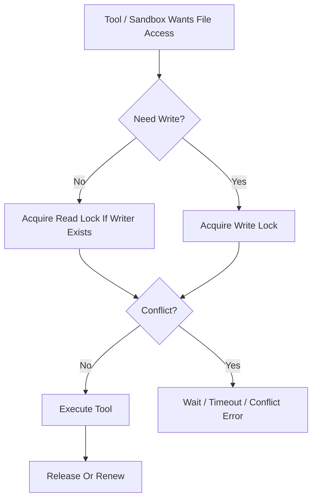

# File Lock Contract

---

## OAPEFLIR 关联

本 contract 参与 OAPEFLIR 八阶段循环中的以下阶段：

- **Observe**：信号采集与聚合
- **Assess**：执行前评估与风险判断
- **Plan**：任务分解与 DAG 构建
- **Execute**：步骤执行与容错
- **Feedback**：信号收集与预处理
- **Learn**：模式检测与知识提取
- **Improve**：改进候选评估与 rollout
- **Release**：受控发布与回滚

---

## 1. 范围

本 contract 定义文件锁的读写语义、租约规则、崩溃回收和与 tool / sandbox 的边界。

相关文档：

- `tool_and_provider_execution_contract.md`
- `sandbox_and_auth_contract.md`
- `storage_schema_contract.md`
- `runtime_repository_and_migration_contract.md`
- `error_code_registry.md`

## 2. 目标

Phase 1a / 1b 至少要做到：

- 同一文件不会被两个写操作同时修改。
- 读写冲突可检测、可等待、可超时。
- 崩溃后遗留锁能被启动巡检和恢复链清理。

## 3. 关键对象

### 3.1 `FileLockRequest`

| 字段 | 类型 | 说明 |
| --- | --- | --- |
| `lock_scope` | `file` | 当前阶段固定为文件级 |
| `target_path` | `string` | 绝对规范化路径 |
| `mode` | `read \| write` | 锁模式 |
| `task_id` | `string?` | legacy 任务投影 ID |
| `harness_run_id` | `string` | HarnessRun ID |
| `node_run_id` | `string` | NodeRun ID |
| `agent_id` | `string` | agent ID |
| `ttl_seconds` | `number` | 租约 TTL |
| `wait_timeout_ms` | `number` | 等待冲突释放时间 |
| `reentrant_token` | `string?` | 同 node run 重入标识 |

### 3.2 `FileLockRecord`

- `lock_id`
- `target_path`
- `normalized_path`
- `mode`
- `holder_task_id?`
- `holder_harness_run_id`
- `holder_node_run_id`
- `holder_agent_id`
- `acquired_at`
- `expires_at`
- `last_renewed_at`

## 4. 兼容矩阵

| 已有锁 | 新请求 | 结果 |
| --- | --- | --- |
| `read` | `read` | 允许共享 |
| `read` | `write` | 阻塞等待或失败 |
| `write` | `read` | 阻塞等待或失败 |
| `write` | `write` | 排他冲突 |

补充规则：

- 同一 `node_run_id + normalized_path + mode` 的重入请求可复用已有锁。
- 同一 node run 已持有 `write` 锁时，再请求同文件 `read` 锁应直接复用，不再降级。
- 不允许“两个不同 node run 但同 task”绕过排他规则。

## 5. 租约与续约

- Phase 1a 默认 TTL 建议为 `60s`。
- 活跃 node run 必须通过 heartbeat 或显式 `renewLock(...)` 续约。
- 锁过期后不代表自动安全可写；恢复链应先确认 holder node run 已 stale 或终止。

## 6. 服务入口

最小接口：

- `acquireLock(request)`
- `renewLock(lockId, now)`
- `releaseLock(lockId)`
- `releaseAllByHarnessRun(harnessRunId)`
- `listLocksByHarnessRun(harnessRunId)`
- `listExpiredLocks(now)`
- `reapExpiredLocks(now)`

## 7. 与工具、沙箱的边界

- `read_file / grep / list` 这类只读工具默认可按需获取 `read` 锁。
- `write_file / edit / patch` 这类写工具必须先持有 `write` 锁。
- `bash` 这类不可静态精确推断写集的工具，不得伪装成精细文件锁安全；应由更粗的 ExecPolicy 和审批策略守卫。
- FileLock 不替代 sandbox 路径白名单，它只解决同路径并发冲突。

## 8. 存储与恢复边界

- authoritative 锁状态必须持久化，不得只存在内存 Map。
- 启动巡检应清理 `expires_at < now` 且 holder execution 已失活的锁。
- 若 execution 终止但锁仍存在，应由恢复链或清理器释放。

## 9. 错误语义

建议稳定错误码：

- `tool.file_lock_conflict`
- `tool.file_lock_timeout`
- `runtime.stale_lock_detected`

规则：

- 等待超时应返回冲突类错误，而不是笼统 `tool.execution_failed`。
- 发现锁记录损坏或 holder 不一致时，应上报恢复错误并进入巡检处理。

## 10. Phase 边界

Phase 1a 明确做：

- 文件级锁
- SQLite 持久化
- TTL + heartbeat 续约
- 启动回收与 execution 终止回收

当前不做：

- 目录级锁
- 分布式锁服务
- Git worktree 级隔离替代

## 11. 收口结论

文件锁的目标不是“让所有 IO 都自动安全”，而是把最危险的并发写冲突压到一个清楚、可审计、可恢复的最小边界里。
