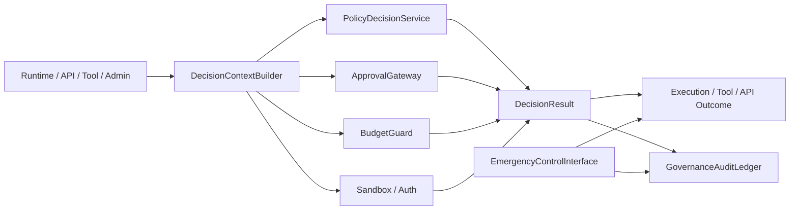
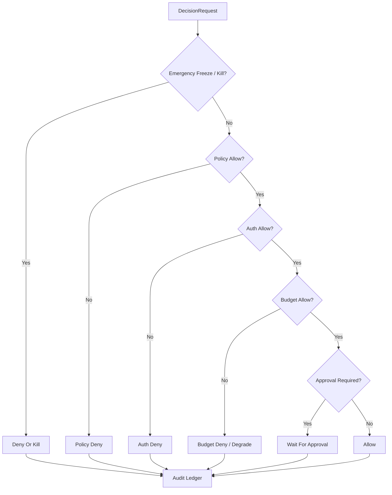

# Governance Control Plane Contract

## 1. 范围

本 contract 定义最终平台的统一治理平面，包括 policy evaluation、approval、budget、sandbox、kill switch、freeze 和 audit 入口。

它用于回答“高风险动作由谁决定、在哪一层决定、如何审计、如何阻断和如何恢复”。

## 2. 目标

- 把分散的治理判断收拢到统一 `control plane`。
- 让 runtime、tool、approval、budget 和 auth 有一致的决策入口。
- 让 deny、freeze、kill、takeover 成为正式平台能力。
- 让治理决策可追溯、可解释、可回放。

## 3. 非目标

- 本 contract 不规定具体 policy engine 产品。
- 本 contract 不替代审批对象、sandbox 规则或预算字段本身。
- 本 contract 不让治理层直接篡改业务结果。

## 4. 架构角色

- `PolicyDecisionService`
- `ApprovalGateway`
- `BudgetGuard`
- `ExecutionFreezeSwitch`
- `GovernanceAuditLedger`
- `DecisionContextBuilder`
- `EmergencyControlInterface`

## 5. 适用动作域

统一治理平面至少覆盖以下动作：

- runtime execution start
- tool call
- network access
- filesystem write
- external side-effect action
- observe / assess action proposal promote
- billing / quota sensitive action
- enterprise admin action

## 6. 关键对象

- `DecisionRequest`
- `DecisionResult`
- `DenyReason`
- `FreezeOrder`
- `KillOrder`
- `AuditEntry`
- `ApprovalRequirement`

## 7. `DecisionRequest` 与 `PolicyDecisionRequest` 的关系

> 本 contract 的 `DecisionRequest` 是对治理平面入口的概念描述。实现层的 authoritative 请求对象为 `policy_engine_contract.md` 中定义的 `PolicyDecisionRequest`。两者字段映射如下：

| 本 contract 概念字段 | PolicyDecisionRequest 实现字段 | 说明 |
| --- | --- | --- |
| `request_id` | `decision_id` | 唯一请求标识 |
| `subject_id` | `subject_id` + `subject_type` | Policy Engine 额外区分主体类型 |
| `task_id` | `task_id` | 关联任务 |
| `execution_id` | `execution_id` | 关联 execution |
| `action_type` | `action` | Policy Engine 定义枚举值 |
| `risk_level` | `risk_category` | Policy Engine 使用更细粒度的风险分类名 |
| `context_json` | `metadata_json` + `resource_ref` + `estimated_cost_usd` + `mode` | Policy Engine 将上下文拆分为结构化字段 |
| `submitted_at` | （由 Policy Engine 内部记录） | — |

规则：

- 实现时以 `PolicyDecisionRequest` 为 authoritative schema，本 contract 不另行定义第二套请求对象。
- 若治理平面需要 freeze / kill 等紧急控制，可通过 `FreezeOrder` / `KillOrder` 独立入口触发，不必强行经过 `PolicyDecisionRequest`。
- `DecisionResult`（下文）同样以 `PolicyDecisionResult` 为实现参考，但治理平面扩展了 `decision_source` 维度以区分来源。

## 8. `DecisionResult` 最小字段

- `request_id`
- `allowed`
- `decision_source` (`policy | approval | budget | auth | emergency_override`)
- `deny_reason?`
- `requires_approval`
- `applied_controls?`
- `resolved_at`

规则：

- `allowed=false` 时必须有明确 deny reason。
- `requires_approval=true` 不等于 deny，而是进入等待态。
- decision result 必须能解释来源，不允许出现“被拒绝但无来源”。

## 9. 决策优先级

建议优先级从高到低：

1. `emergency_override / freeze / kill`
2. `policy deny`
3. `auth deny`
4. `budget deny`
5. `approval required`
6. `allow`

解释：

- 紧急冻结优先于普通业务允许。
- 显式 deny 优先于 approval required。
- approval 只解决需要人工许可的问题，不覆盖 auth / policy 的硬性禁止。

### 9.1 决策流程图

## 10. Freeze / Kill 语义

`FreezeOrder`
: 暂停一个 domain 的新执行或新副作用，但不一定杀死已经执行中的动作。

`KillOrder`
: 强制中断指定 execution、worker、queue 或 tenant 的运行。

最小字段：

- `order_id`
- `domain_type`
- `domain_ref`
- `reason`
- `issued_by`
- `issued_at`
- `expires_at?`

规则：

- freeze 与 kill 都必须写入审计账本。
- kill 不得静默发生，必须能追溯到触发者、范围和原因。
- 被 freeze 的 domain 在恢复前默认 fail-closed。

## 11. Approval 联动

- approval gateway 负责生成 approval requirement，不负责最终 policy 解释。
- 高风险动作必须先经 governance control plane 判断是否进入审批。
- 审批通过后仍需再次经过最小决策重评估，不能直接跳过治理层执行。

## 12. Budget 联动

- budget guard 作为 decision source 之一参与统一判断。
- 预算不足应返回明确 deny 或 degrade 语义。
- 预算放行不等于策略放行，两者必须分别有决策来源。

## 13. Sandbox / Auth 联动

- sandbox 决策负责约束“能做什么”。
- auth 决策负责约束“谁有资格做”。
- governance 层负责把两者放进同一决策管道，而不是让调用方分别手写判断。

## 14. Audit Ledger

`AuditEntry` 最小字段：

- `audit_id`
- `request_id`
- `decision_source`
- `decision_summary`
- `actor_ref`
- `created_at`
- `trace_id?`

规则：

- deny / freeze / kill / approval required 均必须写审计记录。
- audit ledger 是治理事实源的一部分，不应只存在日志中。

## 15. Failure Mode

治理平面需明确处理以下失败模式：

- policy engine 不可用
- approval backend 不可用
- budget service 超时
- auth provider 波动
- emergency kill 与普通 allow 冲突

处理原则：

- 高风险动作默认 fail-closed。

## 15A. OAPEFLIR Governance Gates

对 OAPEFLIR Phase 1-4，治理平面至少要覆盖以下 gate：

- `plan_gate`
- `feedback_disposition_gate`
- `improvement_acceptance_gate`
- `rollout_transition_gate`

规则：

- `Observe / Assess / Plan` 可提交建议，但不得越过治理 gate 直接接受改进或推进 rollout。
- `rollout_transition_gate` 在当前 authoritative 范围内只允许推进到 `off / suggest / shadow`。
- `canary_promote / full_release / rollback automation` 属于后续扩展 gate，不得伪装成 phase1-4 已落地能力。
- 低风险只读动作可按配置降级。
- emergency control 始终优先。

## 16. 与现有文档的关系

- `approval_and_hitl_contract.md` 定义审批对象。
- `sandbox_and_auth_contract.md` 定义安全与认证边界。
- `cost_and_budget_contract.md` 定义预算与成本约束。
- `execution_plane_contract.md` 定义 freeze / kill / takeover 对 execution plane 的作用面。
- 本 contract 定义这些能力如何汇合成统一治理平面。

## 17. 分阶段引入

- Phase 2: 最小统一决策入口 + deny taxonomy。
- Phase 3: observe-compatible product slice / monetization 动作纳入治理。
- Phase 4: enterprise policy / compliance / audit 套件。

## 18. 收口结论

治理平面的核心不是“增加更多规则”，而是把审批、预算、权限、策略、紧急控制统一到一个可解释的决策入口。

后续任何高风险动作，只要不能接入该平面，就不应被视为平台级能力。
