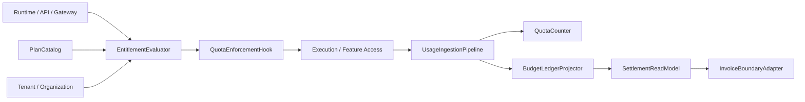
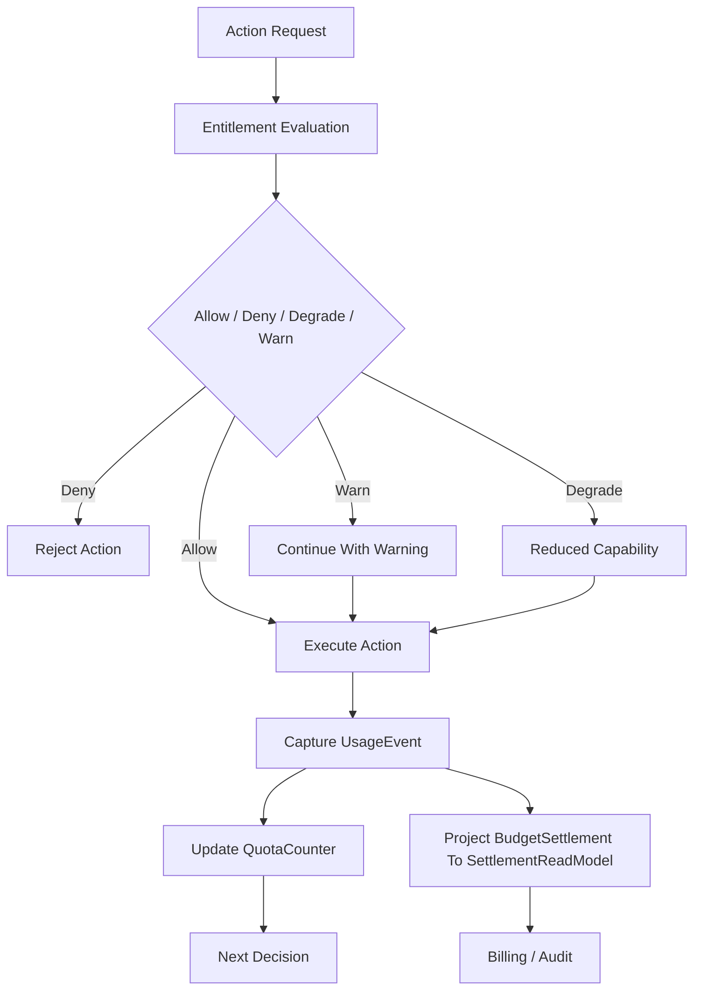
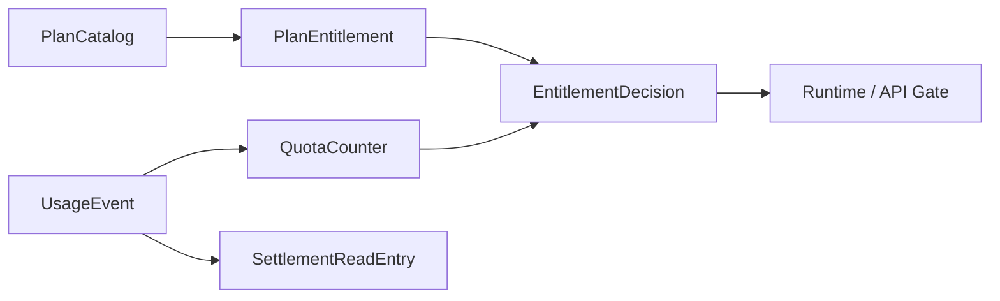

# Monetization Metering Plane Contract

---

## OAPEFLIR 关联

本 contract 参与 OAPEFLIR 八阶段循环中的以下阶段：

- **Observe**：信号采集与聚合
- **Assess**：执行前评估与风险判断
- **Plan**：任务分解与 DAG 构建
- **Execute**：步骤执行与容错
- **Feedback**：信号收集与预处理
- **Learn**：模式检测与知识提取
- **Improve**：改进候选评估与 release
- **Release**：受控发布与回滚

---

## 1. 范围

本 contract 定义最终平台的商业化计量平面，包括 usage metering、quota enforcement、entitlement evaluation、budget truth、settlement read model 和 plan catalog。

它扩展 `billing_and_tenant_contract.md` 与 `cost_and_budget_contract.md`，用于回答“平台如何把使用量、权限、配额和账单连成闭环”。

## 2. 目标

- 把计量和配额从静态字段提升为正式平台能力。
- 让 runtime、API、workspace 权限都能消费 entitlement 决策。
- 为 Pro 与 Enterprise 的收费模型建立统一预算与结算基础。
- 让 usage、quota、billing 与 tenant / organization 模型可对接。

## 3. 非目标

- 本 contract 不规定支付渠道或税务产品选型。
- 本 contract 不定义市场价格策略本身。
- 本 contract 不替代单次 execution 的预算守卫定义。

## 4. 核心组件

- `UsageIngestionPipeline`
- `EntitlementEvaluator`
- `QuotaEnforcementHook`
- `BudgetLedgerProjector`
- `SettlementReadModel`
- `PlanCatalog`
- `InvoiceBoundaryAdapter`

## 5. 核心对象

- `UsageEvent`
- `EntitlementDecision`
- `QuotaCounter`
- `SettlementReadEntry`
- `PlanEntitlement`
- `BillingPeriod`

说明：

- `BudgetLedger / BudgetReservation / BudgetSettlement` 是 runtime truth，冻结定义见 `budget-ledger-contract.md`。
- `SettlementReadModel / SettlementReadEntry` 是面向发票、对账和商业报表的派生读模型，不得反向充当预算 truth。

## 6. `UsageEvent` 最小字段

| 字段 | 类型 | 说明 |
| --- | --- | --- |
| `usage_id` | `string` | 使用事件 ID |
| `subject_id` | `string` | 产生使用量的主体 |
| `workspace_id?` | `string` | 关联 workspace |
| `tenant_id?` | `string` | 关联 tenant |
| `harness_run_id?` | `string` | 关联运行主链 truth |
| `node_run_id?` | `string` | 关联节点运行 truth |
| `task_id?` | `string` | 关联任务投影 |
| `execution_id?` | `string` | legacy 执行投影或迁移输入 |
| `metric_type` | `string` | 指标类型 |
| `quantity` | `number` | 数量 |
| `source` | `runtime \| api \| gateway \| admin \| tool \| model \| side_effect` | 来源 |
| `cost_source` | `provider_invoice \| internal_compute \| human_review \| storage \| egress` | 成本归因来源 |
| `captured_at` | `timestamp` | 采集时间 |

规则：

- `harness_run_id / node_run_id` 是 v4.3 runtime truth 对齐字段；`task_id / execution_id` 只允许作为投影、legacy 查询键或迁移输入保留。
- `source` 表示使用量来自哪类入口或执行源；`cost_source` 表示成本最终由哪类结算依据驱动，二者不可混用。

## 7. `PlanEntitlement` 最小字段

- `plan_id`
- `feature_key`
- `limit_type` (`hard | soft | burst`)
- `limit_value`
- `reset_policy`
- `applies_to`

示例：

- 月 token 上限
- 并发 execution 上限
- 可用 workspace 数
- 可启用 Observe source 数

## 8. `EntitlementDecision` 最小字段

- `decision_id`
- `subject_ref`
- `feature_key`
- `allowed`
- `decision_type` (`allow | deny | degrade | warn`)
- `reason?`
- `resolved_at`

规则：

- entitlement 判断必须能在 runtime 执行前做出。
- `degrade` 用于能力降级，而不是完全拒绝。
- `warn` 只能用于不影响安全和账务正确性的软阈值场景。

## 9. `QuotaCounter`、`BudgetLedger` 与 `SettlementReadEntry`

`QuotaCounter` 最小字段：

- `counter_id`
- `subject_ref`
- `metric_type`
- `window_start`
- `window_end`
- `used_quantity`
- `limit_quantity`
- `updated_at`

`BudgetLedger` / `BudgetReservation` / `BudgetSettlement`：

- truth contract 直接复用 `budget-ledger-contract.md`
- 本文不再重复定义另一套与其平行的 ledger truth DTO

`SettlementReadEntry` 最小字段：

- `entry_id`
- `account_ref`
- `period_id`
- `entry_type`
- `amount`
- `currency`
- `source_refs`
- `recorded_at`

规则：

- quota counter 服务实时限制。
- `BudgetLedger` 负责执行前预算 truth 与结算事实，不得依赖临时内存累计结果。
- `SettlementReadEntry` 服务账务展示、发票边界和对账报表。
- usage event、quota counter、budget settlement、settlement read entry 之间必须可对账，不能只依赖最终聚合结果。

## 10. 计量粒度

Phase 3 起至少支持：

- token / model usage
- execution time
- tool call count
- artifact storage bytes
- active workspace count
- premium feature activation count

## 11. 典型判断路径

1. 用户或系统发起动作。
2. runtime / API 先请求 `EntitlementEvaluator`。
3. evaluator 读取 plan entitlement、quota counter、tenant/org 归属。
4. 返回 `allow / deny / degrade / warn`。
5. 动作执行后由 `UsageIngestionPipeline` 回写 usage event。
6. 周期性或准实时聚合进入 quota、budget settlement 与 settlement read model。

### 11.1 商业化闭环流程图

### 11.2 计量对象关系图

## 12. Quota Enforcement 规则

- quota 超限时必须有统一 `deny / degrade / warn` 语义。
- 高成本或高风险能力优先采用 hard deny。
- 体验类能力可采用 degrade，例如降低并发或延迟执行。
- quota 判断结果应可追溯到 plan entitlement 和当前 counter。
- entitlement 决策不得只依赖过期缓存；若 authoritative counter 不可用，应优先 fail-closed 或保守 degrade。
- commercial metering 不得绕过 `BudgetLedger / BudgetReservation / BudgetSettlement` truth 直接写 invoice ledger 字段。

## 13. Tenant / Organization 关系

- workspace 级套餐可映射到 org / tenant 级账务主体。
- enterprise 结算应支持 organization 级汇总。
- usage event 必须可归集到 workspace、tenant 或 organization。

## 14. 与现有文档的关系

- `billing_and_tenant_contract.md` 是主体模型基线。
- `cost_and_budget_contract.md` 是单次执行预算基线。
- `budget-ledger-contract.md` 冻结 `BudgetLedger / BudgetReservation / BudgetSettlement` 作为 runtime truth。
- `tenant_and_organization_contract.md` 定义归属边界。
- 本 contract 定义产品收费、配额、预算 truth 派生结算读模型的完整平台层。

## 15. Failure Mode

需要重点防范：

- 动作执行成功但 usage 未回写。
- settlement read model 延迟或回放失败导致账务展示不一致。
- quota counter 落后导致透支执行。
- organization 汇总时 tenant 归属错误。

处理原则：

- 高成本动作宁可保守 deny，也不应无计量执行。
- usage pipeline、budget settlement projector 与 settlement read model pipeline 必须有补偿路径。
- entitlement 决策优先使用 authoritative counter，而不是缓存猜测值。
- 若动作已执行但 usage 未回写，系统必须能通过对账任务补账，而不是默默丢失计量。

## 16. 分阶段引入

- Phase 3: Pro usage metering + entitlement + quota enforcement。
- Phase 4: enterprise ledger、组织结算、审计与发票边界。

## 17. 收口结论

Monetization plane 的核心不是“事后计费”，而是让 runtime、权限、配额、预算 truth 与结算读模型在执行前后形成闭环。

后续任何收费能力，只要不能接入 usage、entitlement 和 `BudgetLedger / BudgetReservation / BudgetSettlement` 三条链，就不应被视为正式商业化能力。

## v4.3 Architecture Remediation

以下条目修复 `platform-architecture-implementation-consistency-audit.md` 中记录的 contract 偏差。本文档历史段落如与本节冲突，以本节、`docs_zh/architecture/00-platform-architecture.md`、ADR-109 至 ADR-113、以及 `src/platform/contracts/executable-contracts/` 为准。

- T-35: 本文原先把 `BillingLedger / LedgerEntry` 写成商业化计量平面的核心对象，根因是旧版文案把发票/报表读模型和执行前预算 truth 混成同一层，未在 v4.3 引入 `BudgetLedger / BudgetReservation / BudgetSettlement` 后同步重构。修复：正文现明确预算 truth 复用 `budget-ledger-contract.md`，`SettlementReadModel / SettlementReadEntry` 只保留为派生账务读模型。
- T-55: 本文原先的 `UsageEvent.source` 仍停留在 `runtime / api / gateway / admin` 四类入口枚举，根因是该段落沿用了早期 API 入口视角，没有随着工具执行、模型调用和副作用结算接入统一成本归因模型一起扩展。修复：正文现补齐 `tool / model / side_effect` 来源，并新增独立 `cost_source` 枚举承接 `provider_invoice / internal_compute / human_review / storage / egress`。

强制规则：状态迁移必须通过 `RuntimeStateMachine.transition(command)`；执行计划必须使用 `PlanGraphBundle`；执行结果必须使用 `NodeAttemptReceipt`；truth event 只能使用 `platform.*`；OAPEFLIR 只能作为 `oapeflir.view.*` / rationale 投影；预算必须使用 `BudgetLedger` / `BudgetReservation` / `BudgetSettlement`。
