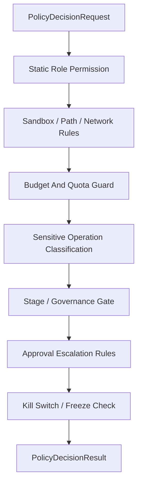

# Policy Engine Contract

## 1. 范围

本 contract 定义统一 Policy Engine 入口，用来汇总角色静态权限、执行策略、审批升级、预算守卫、敏感操作分类和 kill switch。

相关文档：

- `approval_and_hitl_contract.md`
- `sandbox_and_auth_contract.md`
- `cost_and_budget_contract.md`
- `governance_control_plane_contract.md`
- `tool_skill_plugin_contract.md`

## 2. 目标

统一 Policy Engine 至少要解决：

- 不同模块不再各自单独做权限判断。
- 高风险动作进入同一条决策链。
- 审批、预算、权限、kill switch 的结论可组合、可审计。

## 3. 关键对象

### 3.1 `PolicyDecisionRequest`

| 字段 | 类型 | 说明 |
| --- | --- | --- |
| `decision_id` | `string` | 决策请求 ID |
| `task_id` | `string` | 当前任务 |
| `execution_id` | `string?` | 当前 execution |
| `session_id` | `string?` | 当前会话 |
| `subject_type` | `user \| agent \| system` | 请求主体 |
| `subject_id` | `string` | 主体 ID |
| `action` | `invoke_model \| invoke_tool \| write_file \| exec_command \| network_access \| install_extension \| org_change \| dispatch_execution \| set_isolation_level \| promote_improvement \| advance_rollout \| modify_knowledge_trust \| promote_memory_layer` | 目标动作 |
| `resource_ref` | `string?` | 资源引用 |
| `risk_category` | `destructive \| irreversible \| prod_affecting \| cost_sensitive \| org_changing \| sensitive_data \| strategy_affecting \| governance_sensitive` | 风险分类 |
| `mode` | `supervised \| auto \| full-auto` | 当前运行模式 |
| `stage` | `observe \| assess \| plan \| execute \| feedback \| learn \| improve \| release?` | 当前 OAPEFLIR 阶段 |
| `estimated_cost_usd` | `number?` | 估算成本 |
| `metadata_json` | `json?` | 额外上下文 |

### 3.2 `PolicyDecisionResult`

- `decision`
- `reason_code`
- `requires_approval`
- `enforced_constraints`
- `kill_switch_applied`
- `audit_payload`
- `evaluated_policy_version`
- `decision_ttl_ms?`
- `matched_rule_refs?`
- `explain_summary?`

`decision` 枚举：

- `allow`
- `deny`
- `allow_with_constraints`
- `escalate_for_approval`

### 3.3 `PolicyDecisionExplain`

最小字段：

- `decision_id`
- `summary`
- `factors`
- `policy_paths`
- `trace_refs?`
- `rule_sources?`
- `remediation_hint?`

### 3.4 `PolicyAuditRecord`

最小字段：

- `audit_id`
- `decision_id`
- `policy_bundle_id`
- `policy_version`
- `input_snapshot_ref`
- `decision_snapshot_ref`
- `evaluated_at`
- `latency_ms`

## 4. 决策链

规则：

- 任何一步明确 `deny` 都应 fail-closed。
- `allow_with_constraints` 必须显式返回被收紧后的路径、工具、预算或超时约束。
- 审批升级不应覆盖硬性禁止项；被硬拒的动作不得再通过审批放行。
- kill switch / freeze 命中后，审批也不能把已冻结动作重新放行。
- `allow_with_constraints` 的约束必须是 authoritative，后续执行不得擅自放宽。

## 5. 敏感操作分类表

| 分类 | 示例 | 默认动作 |
| --- | --- | --- |
| `destructive` | 删除文件、覆盖关键配置 | 审批或拒绝 |
| `irreversible` | 外部提交、发布、发送不可撤回消息 | 审批 |
| `prod_affecting` | 影响生产环境命令 | 审批或拒绝 |
| `cost_sensitive` | 大模型高成本长推理 | 预算检查 + 可能审批 |
| `org_changing` | 修改组织、角色、租户配置 | 审批 |
| `sensitive_data` | 访问密钥、凭据、隐私数据 | 路径/权限约束 + 审批 |
| `strategy_affecting` | 接受 improvement candidate、变更 strategy version | guardrail + 审批 |
| `governance_sensitive` | rollout 推进、knowledge trust 修改、memory promotion | gate + 审批或拒绝 |

## 6. 与审批的边界

- Policy Engine 决定“是否需要审批”。
- Approval 系统负责“审批请求如何发出、如何回传”。
- 审批通过后仍要再次进入 Policy Engine 进行最终放行，避免批准后环境已变化。

## 7. 与工具、Skill、Plugin 的边界

- Skill 不得越过角色工具白名单。
- Plugin / MCP 安装单元必须先通过 Policy Engine，不能直接绕过 ToolRegistry。
- MCP 不得伪装成本地可信工具获得更宽权限。
- 相同动作在不同 `resource_ref`、`path_scope`、`tenant scope` 下必须独立评估，不能错误复用旧放行结论。

## 7B. 与 OAPEFLIR Hub 的边界

- Observe / Assess / Plan 阶段产生的是建议和上下文，不是 authoritative 放行结论。
- FeedbackHub 可以提供负面信号、用户纠正和质量指标，但不得直接把候选改进标为 accepted。
- LearnHub 只能生成 draft / validated learning object，不能直接修改 release 或 rollout 状态。
- ImproveHub 提案必须经 Policy Engine 裁决 `promote_improvement`，再进入 guardrail / approval 链。
- ReleaseHub 推进 `advance_rollout` 时，Policy Engine 必须重新评估当前风险、预算、运行模式和 freeze 状态。
- `modify_knowledge_trust` 与 `promote_memory_layer` 属于 M2 扩展 action；未启用相关平面时必须 fail-closed，而不是静默 allow。

## 7A. 与 Dispatch 和 Isolation 的边界

Execution dispatch 涉及以下策略评估点，必须经过 Policy Engine：

| 评估点 | action | 说明 |
| --- | --- | --- |
| dispatch target 选择 | `dispatch_execution` | 决定 execution 派发到哪个 worker 或 worker 组（local / named / capability-match），resource_ref 为目标 worker 或 capability 描述 |
| isolation level 提升 | `set_isolation_level` | 当 execution 要求 `containerized` 或更高隔离级别时，策略检查是否允许该隔离级别和关联资源消耗 |
| 远程 worker 能力授权 | `dispatch_execution` | 远程 worker 声明的 capabilities 是否在 `allowedCapabilities` 白名单内，需经策略确认 |

规则：

- dispatch decision 在 ticket 创建前必须经过 Policy Engine，不得在 dispatch service 内部独立判定目标。
- isolation level 提升可能涉及额外资源成本（容器启动、镜像拉取），应与 `cost_sensitive` 风险分类联动。
- 远程 worker 的 capability 过滤结果（被拒绝的能力列表）应写入 `PolicyAuditRecord`。
- `allow_with_constraints` 可用于收紧 dispatch target 范围（如限制到特定 worker 组）或降低 isolation level。

## 8. 缓存与继承拒绝

- 同一 session 内连续相似高风险请求可继承近期拒绝结论，避免审批轰炸。
- 缓存键不得只按命令名，应包含动作、资源、主体和风险分类。
- 命中继承拒绝时，仍需保留审计记录。
- 缓存命中不得跨 `tenant / workspace / organization / mode` 复用。

## 9. 规则 lint 与不可达规则检测

Policy / permission 规则在启用前至少应做：

- 重复规则检测
- 阴影规则检测
- 不可达 allow 规则检测
- 来源冲突检测

最少要识别以下问题：

- tool-wide `deny` 让更具体的 `allow` 永远不可达
- tool-wide `ask` 让更具体的 `allow` 永远无法直接命中
- 共享来源规则与本地临时规则互相遮蔽后，最终效果与作者预期不一致

规则：

- lint 失败的策略包不得进入 authoritative allow path。
- 若允许以 warning 形式继续使用，必须把 warning 写入 explain 与审计结果。
- 运行时判定结果应尽量返回命中的规则来源与修复提示，而不是只给出抽象的 `deny`。

## 10. 规则求值顺序

- policy / permission 规则的匹配顺序必须是确定性的、可解释的。
- 若系统支持 wildcard、局部 override、本地临时规则与全局规则并存，必须明确：
  - 是按显式 `priority`
  - 还是按 source order / last-match
  - 或其他等价的稳定策略
- 同一请求不得因遍历顺序、并发装载顺序或来源聚合顺序不同而得到不同结论。
- explain 与 audit 结果应能指出“最终是哪条规则获胜，以及它覆盖了谁”。

## 11. 审计要求

每次策略决策至少保留：

- 谁请求了什么
- 触发了哪些策略节点
- 最终为何放行、拒绝或升级
- 收紧后的约束是什么
- 使用的是哪个 policy version / config version
- 审计快照引用的是哪份 input / decision snapshot

## 12. 关键裁决边界

- Policy Engine 是最终裁决入口，不是建议收集器。
- LLM、workflow planner、approval packet 只能提供上下文或建议，不得直接构造 authoritative allow。
- 若 Policy Engine 与上游建议冲突，始终以 Policy Engine 为准。

## 13. Phase 边界

Phase 1a / 1b 明确做：

- 单进程统一入口
- 角色静态权限
- sandbox / path / network 规则
- 预算守卫
- 审批升级
- kill switch / freeze 检查

当前不做：

- OPA 集成
- 外部策略提供者
- 多租户分布式策略执行集群

补充说明：

- 当前不把 OPA 写成既成事实，但 `PolicyDecisionRequest / Result / Explain / AuditRecord` 的形状应尽量保持可对接外部策略引擎。
- 后续若引入 OPA 或等价策略引擎，应优先复用本 contract 的输入、解释与审计边界，而不是再创造一套平行模型。

## 14. 收口结论

Policy Engine 的意义不是再造一层抽象，而是把过去分散在权限、预算、审批、安全里的判断收口成一条统一、可审计、可复用的决策链。

## v4.3 Architecture Remediation

以下条目修复 `platform-architecture-implementation-consistency-audit.md` 中记录的 contract 偏差。本文档历史段落如与本节冲突，以本节、`docs_zh/architecture/00-platform-architecture.md`、ADR-109 至 ADR-113、以及 `src/platform/contracts/executable-contracts/` 为准。

- T-17: mode 字段用 supervised/auto/full-auto 3值，架构§9.5定义8种规范模式含5个降级模式。修复：该语义收敛到 v4.3 canonical contract；旧字段、旧状态、旧 DTO 或旧术语仅允许作为 legacy/deprecated/projection/migration input，不得作为新实现入口。

强制规则：状态迁移必须通过 `RuntimeStateMachine.transition(command)`；执行计划必须使用 `PlanGraphBundle`；执行结果必须使用 `NodeAttemptReceipt`；truth event 只能使用 `platform.*`；OAPEFLIR 只能作为 `oapeflir.view.*` / rationale 投影；预算必须使用 `BudgetLedger` / `BudgetReservation` / `BudgetSettlement`。
