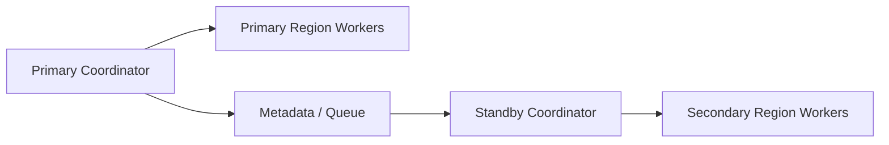

# Remote Coordination And Disaster Recovery Contract

---

## OAPEFLIR 关联

本 contract 参与 OAPEFLIR 八阶段循环中的以下阶段：

- **Observe**：信号采集与聚合
- **Assess**：执行前评估与风险判断
- **Plan**：任务分解与 DAG 构建
- **Execute**：步骤执行与容错
- **Feedback**：信号收集与预处理
- **Learn**：模式检测与知识提取
- **Improve**：改进候选评估与 release
- **Release**：受控发布与回滚

---

## 1. 范围

本 contract 定义 Bridge / Worker 远程协调场景下的文件一致性、远程执行观测和异地容灾边界。

相关文档：

- `execution_plane_contract.md`
- `ha_coordinator_and_leader_election_contract.md`
- `tenant_isolation_and_shared_worker_safety_contract.md`
- `production_storage_and_queue_contract.md`

## 2. 目标

- 让远程 worker 不只是“能连上”，而是具备一致性和可恢复性。
- 让跨区域协调、worker 失联和同步断裂有正式恢复路径。
- 为未来 coordinator 集群和区域级故障切换建立事实源。

## 3. 远程文件一致性

至少定义：

- 冲突检测
- 增量校验
- hash 对账
- 会话断线后的同步恢复
- 大文件同步限速
- 同步失败后的阻断执行规则

## 4. 远程执行观测

每个远程 worker 至少上报：

- saturation
- active lease count
- mean startup latency
- sandbox success rate
- repo cache hit rate

还应至少支持：

- bridge credential refresh 成功率
- stream resume 成功率
- last acknowledged stream offset
- reconnect 后 session consistency check 结果

远程会话状态至少区分：

- `connecting`
- `connected`
- `reconnecting`
- `degraded`
- `failed`
- `viewer_only`

## 5. 容灾能力

成熟工业平台应逐步支持：

- 区域级故障切换
- worker 跨区域重分配
- metadata store 主从切换
- queue / lease repair

### 5.1 一致性对象

```typescript
interface DisasterRecoveryConsistencyPolicy {
  policyId: string;
  scope: "truth" | "event" | "artifact";
  consistencyMode: "single_writer_strict" | "quorum_commit" | "eventual_replay";
  failureBehavior: "read_only" | "fail_close" | "guarded_failover";
}
```

规则：

- 每类恢复范围都必须声明 `consistencyMode` 与 `failureBehavior`，不能只写原则性 bullet。
- `truth` 默认 `single_writer_strict + fail_close`；未完成 owner 切换前不得双写。

## 6. 关键不变量

- 远程 worker 失联后，旧租约不得继续写回 authoritative state。
- 文件同步状态必须可验证，不得仅依赖“上次看起来成功”。
- 区域级切换后，control plane 必须能判断哪些 execution 需要重建、哪些只需重连。
- 同步 hash 不一致、repo version 不一致或 lease 归属不一致时，默认不得继续执行。
- bridge 凭证刷新后，新的 epoch / session generation 必须覆盖旧 transport 的写权限。
- 远程流恢复应从已确认 offset 继续，而不是默认全量重放。
- `viewer_only` 会话可以消费日志和状态，但不得发送中断、批准、派发或写回 authoritative state。
- transient reconnect 与 permanent disconnect 必须在事件和 UI 层显式区分，避免把短时抖动误判为最终失败。

## 7. 拓扑示意



## 8. 收口结论

远程协调进入工业级后，重点不再是“能不能派发”，而是：

- 文件和状态是否一致
- worker 失联后是否可安全回收
- 区域故障后是否可控切换
- 不一致时是否能及时阻断、重建并给出明确恢复路径

补充说明：

- 当前只借鉴远程桥接中的 token refresh、401 恢复、offset 续流等通用模式。
- 不把外部系统的专有 session / bridge 协议直接写成本系统事实源。
