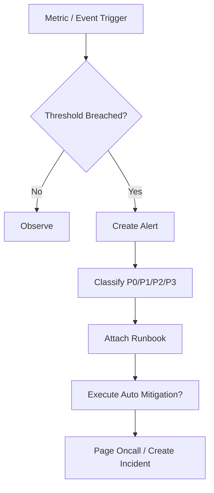

# SLO Alerting And Runbook Contract

## 1. 范围

本 contract 定义工业级运行的 SLI/SLO/SLA、告警分级和 runbook 目录。

它回答的问题是：什么才算“生产可用”，什么时候需要告警，值班人员出事时该看什么、做什么、如何止损。

相关文档：

- `observability_contract.md`
- `debug_inspect_health_backpressure_contract.md`
- `enterprise_operations_plane_contract.md`

## 2. SLI 分层

| 层 | SLI 示例 |
| --- | --- |
| OAPEFLIR 层 | loop 收敛率、feedback 正向率、rollout 成功率 |
| 系统层 | API 可用性、事件循环延迟、DB 可写性 |
| 平台层 | 任务成功率、启动延迟、恢复成功率 |
| 交互层 | approval 可用性、streaming 首包延迟 |
| 成本层 | 预算估算误差、token 计量延迟 |

## 3. 最小 SLO 集

- `task_success_rate`
- `task_start_latency`
- `approval_delivery_availability`
- `recovery_success_rate`
- `tier1_event_delivery_latency`
- `cost_accounting_accuracy`
- `oapeflir_loop_convergence_rate`
- `feedback_positive_rate`
- `rollout_success_rate`

规则：

- 生产声明前，每个 SLO 必须有计算口径、取数来源和告警阈值。
- 没有可观测口径的目标不得写成对外 SLA。

## 4. 告警分级

| 级别 | 说明 | 典型例子 |
| --- | --- | --- |
| `P0` | 平台核心不可用 | 新任务无法执行、authoritative DB 不可写 |
| `P1` | 关键租户或关键链路失效 | 关键租户无法下发任务、审批链大面积失效 |
| `P2` | 单事业部或局部能力显著退化 | 某 division 失败率暴涨 |
| `P3` | 局部异常或容量预警 | 队列延迟上涨、cost drift 偏高 |

## 5. 告警必须包含

- 触发指标和阈值
- 影响范围
- 首次发现时间
- 建议 runbook
- 自动止损动作是否已执行

## 6. Runbook 目录

至少应有以下 runbook：

- `worker_mass_disconnect`
- `provider_429_or_5xx_spike`
- `queue_backlog_breach`
- `approval_channel_unavailable`
- `cost_spike_containment`
- `database_lock_contention`
- `stale_lease_repair`
- `secret_rotation_failure`
- `oapeflir_loop_stalled`
- `rollout_blocked_or_rollback`

## 7. 告警流程图

## 8. 自动止损边界

允许自动执行：

- admission control 收紧
- provider 切流
- queue rate 限制
- 某 tenant / division 限流

禁止自动执行：

- 未经授权的大范围 destructive rollback
- 跨租户数据级操作
- 直接忽略审批链

## 9. Phase 边界

Phase 1a / 1b 至少要冻结：

- SLI 名称与口径
- P0-P3 分级
- 基础 runbook 清单

进入生产前必须完成：

- 阈值定稿
- 值班联系人和升级路径
- 演练记录

## 10. 收口结论

工业级运行不是“日志很多”，而是：

- 有明确 SLO
- 有可执行告警
- 有 runbook
- 有自动止损边界
