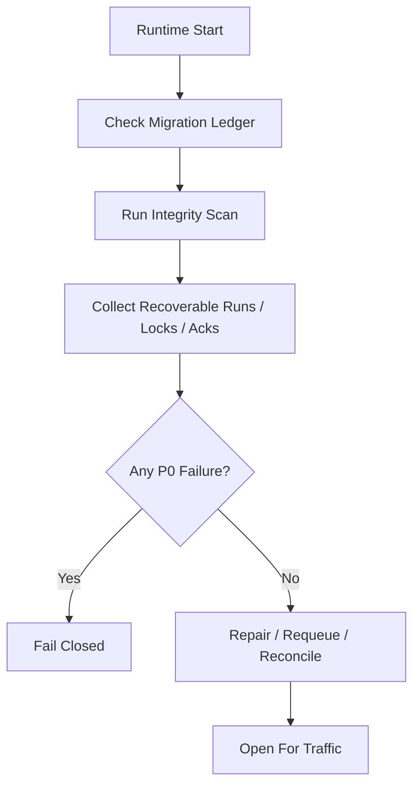

# Startup Consistency And Recovery Drill Contract

## 1. 范围

本 contract 定义 runtime 启动一致性巡检项，以及必须定期演练的崩溃恢复场景。

相关文档：

- `runtime_repository_and_migration_contract.md`
- `runtime_execution_contract.md`
- `file_lock_contract.md`
- `event_reliability_matrix_contract.md`

## 2. 目标

系统在真正写代码前，要先冻结两件事：

- 启动时到底检查哪些一致性问题。
- 崩溃恢复测试到底必须覆盖哪些场景。

## 3. 启动一致性巡检矩阵

| 检查项 | 判定规则 | 失败动作 |
| --- | --- | --- |
| 迁移版本 | schema 版本与 ledger 一致 | fail-closed |
| 活跃任务与运行链对齐 | `running / waiting_hitl / sleeping / recovering` 的 `HarnessRun` 必须能关联到对应 `NodeRun` / `PlanGraphBundle`，缺失必须可解释 | 标记恢复 |
| 非法节点游标 | `currentNodeRunId` / `PlanGraph` entry/terminal 指针不得悬空或越图 | fail-closed 或人工修复 |
| stale execution | `prechecking / executing` 且心跳过期（注：`retrying` 已废弃，重试通过新 execution attempt 实现） | 标记 recoverable |
| 悬挂 session | session 处于活跃态但 task 已终态 | 自动收口或告警 |
| 过期 file lock | `expires_at < now` 且 holder 已失活 | 清理并记事件 |
| Tier 1 ack 积压 | 存在长期未 ack 的关键事件 | 告警并进入补发 |
| 活跃 execution 所有权冲突 | 同一 task 同时存在多个活跃 execution | fail-closed 或人工修复 |
| OAPEFLIR stage 一致性 | `HarnessRun.currentStage / loopIteration` 与 `NodeRun` / timeline / evidence 一致 | fail-closed 或标记 recoverable |
| rollout 记录一致性 | rollout level / status / approval / strategy lineage 可闭合 | fail-closed 或人工修复 |

## 4. 启动流程

## 5. 恢复演练最小场景

必须覆盖以下场景：

1. step 完成前崩溃
2. DB 写成功但事件 emit 失败
3. tool 执行后 assistant message 未完整保存
4. 恢复时重复进入同一步
5. file lock 未释放残留
6. approval 已批准但 execution 尚未恢复
7. heartbeat 停止但 execution 状态仍为 `executing`
8. SQLite `BUSY` 或事务中断后恢复
9. cancel 已提交但子进程仍存活
10. feedback 已写入但 learn 未完成
11. improve candidate accepted 后 release 中断
12. rollout / timeline 已写入但 inspect projection 未更新

## 6. 每个演练场景的断言

每个 drill 至少断言：

- 不会把已完成步骤误当成未执行
- 不会重复执行不可安全重放的副作用步骤
- 任务主状态不会被错误推进到成功
- 恢复链最终能给出 `resume / retry / dead-letter / manual-handoff`
- 取消传播场景下不会残留继续推进的 child process 或 stale lock

## 7. 巡检输出对象

最小输出：

- `StartupConsistencyReport`
- `RecoveryCandidate`
- `RepairAction`
- `RecoveryDrillResult`

`RepairAction` 建议枚举：

- `requeue_execution`
- `release_stale_lock`
- `rebuild_ack`
- `close_orphan_session`
- `manual_intervention_required`

## 8. 运行规则

- 启动巡检属于 fail-closed 能力，不应在发现 P0 不一致后继续默默接流量。
- 恢复演练应优先依赖 fixture / replay 数据，而不是只靠人工口头验证。
- 新增关键状态、Tier 1 事件或 file lock 语义后，必须补对应 drill。

## 9. Phase 边界

Phase 1a 明确做：

- 单机 SQLite 一致性巡检
- stale execution / stale lock / pending ack 扫描
- 固定恢复演练矩阵
- OAPEFLIR stage / rollout consistency 扫描

当前不做：

- 多机协同恢复演练
- chaos engineering 平台
- 自动化跨区域容灾切换

## 10. 收口结论

恢复能力是否真实存在，不看文档里写了多少“支持恢复”，而看启动巡检和 drill 是否已经把最容易出事的断点逐项冻结下来。
