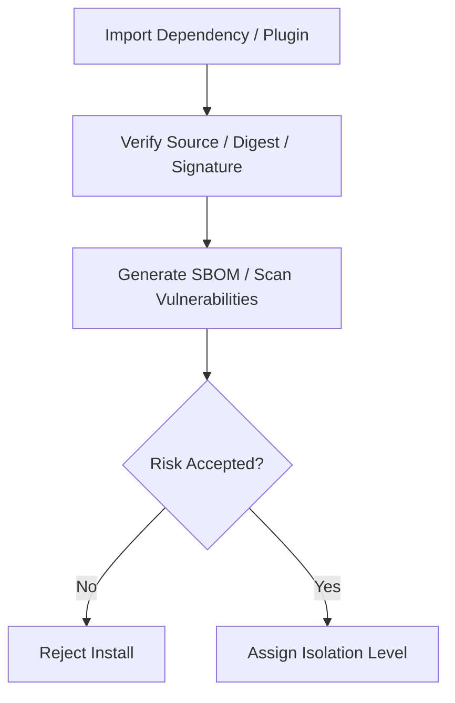

# Supply Chain And Dependency Security Contract

---

## OAPEFLIR 关联

本 contract 参与 OAPEFLIR 八阶段循环中的以下阶段：

- **Observe**：信号采集与聚合
- **Assess**：执行前评估与风险判断
- **Plan**：任务分解与 DAG 构建
- **Execute**：步骤执行与容错
- **Feedback**：信号收集与预处理
- **Learn**：模式检测与知识提取
- **Improve**：改进候选评估与 rollout
- **Release**：受控发布与回滚

---

## 1. 范围

本 contract 定义依赖、插件、skill、MCP 和第三方分发单元的供应链安全基线。

相关文档：

- `tool_skill_plugin_contract.md`
- `ecosystem_extension_plane_contract.md`
- `enterprise_secret_management_contract.md`
- `sandbox_and_auth_contract.md`

## 2. 目标

- 降低第三方依赖、插件和外部执行单元带来的供应链风险。
- 让安装、更新、签名、扫描、隔离等级有统一规则。
- 为工业级审计和准入提供可追溯证据。

## 3. 最小要求

- 依赖锁定
- 包来源校验
- 签名或完整性校验
- SBOM 生成
- 漏洞扫描
- 第三方插件隔离等级

## 4. 分发单元分类

| 类型 | 最低要求 |
| --- | --- |
| `first_party tool` | locked dependency + review evidence |
| `skill bundle` | source provenance + permission declaration |
| `plugin bundle` | signature / digest + capability declaration |
| `MCP server` | trust level + isolation level + domain allowlist |

## 5. 隔离等级

- `trusted_first_party`
- `reviewed_partner`
- `untrusted_third_party`

规则：

- `untrusted_third_party` 不得默认获得 destructive 权限。
- MCP 不得伪装成本地 trusted tool。
- 插件权限不得绕过 ToolRegistry 和 Policy Engine。

## 6. 安全检查流程

## 7. 审计要求

必须记录：

- install source
- version / digest
- approver
- granted capability scope
- scan result summary
- disable / revoke action

## 8. 收口结论

工业级扩展生态不能只问“能不能装上去”。

它必须同时回答：

- 来源是否可信
- 权限是否最小
- 更新是否可追踪
- 出问题时能否快速禁用和追责
