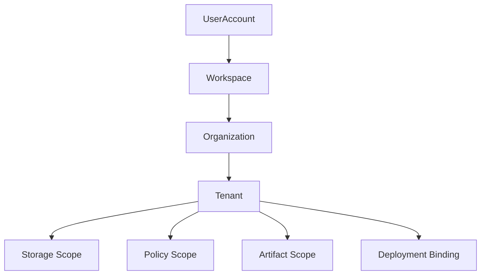
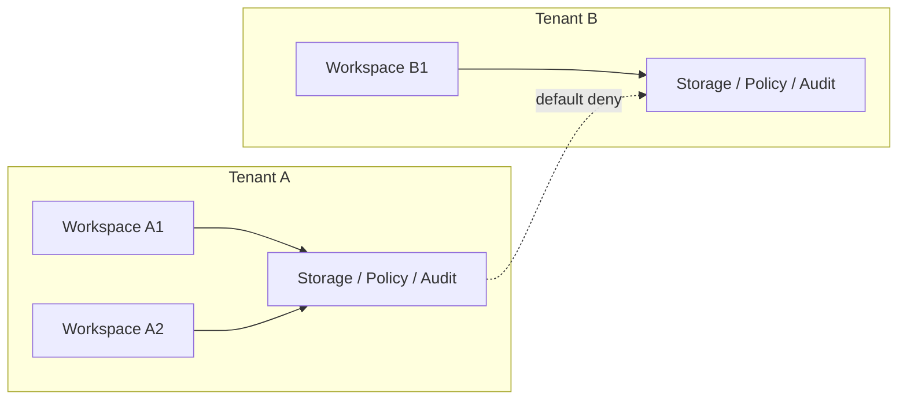
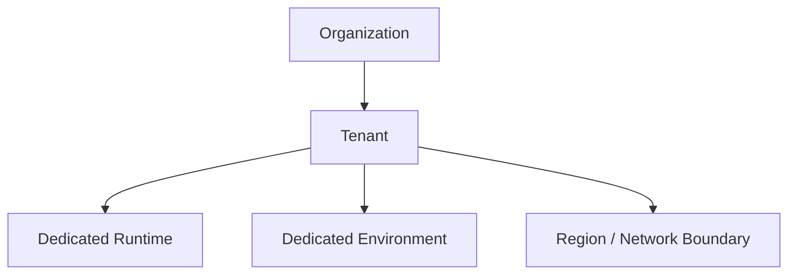

# Tenant And Organization Contract

---

## OAPEFLIR 关联

本 contract 参与 OAPEFLIR 八阶段循环中的以下阶段：

- **Observe**：信号采集与聚合
- **Assess**：执行前评估与风险判断
- **Plan**：任务分解与 DAG 构建
- **Execute**：步骤执行与容错
- **Feedback**：信号收集与预处理
- **Learn**：模式检测与知识提取
- **Improve**：改进候选评估与 release
- **Release**：受控发布与回滚

---

## 1. 范围

本 contract 定义最终平台的用户、workspace、organization、tenant 与 enterprise 私有化边界。

它扩展 `billing_and_tenant_contract.md`，用于回答“谁属于谁、哪些数据与权限需要隔离、哪些资源在什么层被拥有”。

## 2. 目标

- 明确 `user / workspace / organization / tenant` 的层级关系。
- 明确存储、身份、策略、artifact 和审计的 tenant-aware 边界。
- 为 enterprise 私有化、组织级运营和账务归集打基础。

## 3. 非目标

- 本 contract 不直接定义 payment provider 或发票流程。
- 本 contract 不替代 auth provider 的技术实现细节。
- 本 contract 不要求 Phase 1a 就实现完整 enterprise 组织树。

## 4. 层级模型

`UserAccount -> Workspace -> Organization -> Tenant`

解释：

- `UserAccount` 是身份主体。
- `Workspace` 是默认的产品使用边界和协作边界。
- `Organization` 是多 workspace 的经营与治理归属。
- `Tenant` 是最终存储、策略、部署和审计的隔离边界。

## 5. 分阶段落地策略

- Phase 3 可先启用 `UserAccount + Workspace`。
- Phase 4 再补 `Organization + Tenant` 的正式治理模型。
- Enterprise 私有化必须以 `Tenant` 为最终隔离单位。

## 6. 关键对象

- `UserAccount`
- `Workspace`
- `WorkspaceMembership`
- `Organization`
- `OrganizationMembership`
- `Tenant`
- `TenantIsolationMode`
- `DeploymentBinding`

## 7. `Workspace` 最小字段

| 字段 | 类型 | 说明 |
| --- | --- | --- |
| `workspace_id` | `string` | workspace ID |
| `owner_id` | `string` | workspace owner |
| `display_name` | `string` | 展示名 |
| `plan_id` | `string` | 当前套餐 |
| `default_policy_set` | `string` | 默认治理集 |
| `organization_id?` | `string` | 所属组织 |
| `created_at` | `timestamp` | 创建时间 |

## 8. `Organization` 最小字段

- `organization_id`
- `display_name`
- `billing_account_id`
- `default_tenant_id`
- `created_at`

## 9. `Tenant` 最小字段

- `tenant_id`
- `organization_id`
- `storage_scope`
- `identity_scope`
- `policy_scope`
- `artifact_scope`
- `deployment_mode`
- `created_at`

## 10. `TenantIsolationMode`

建议枚举：

- `shared_logical`
- `shared_hard_scoped`
- `dedicated_runtime`
- `dedicated_environment`

说明：

- `shared_logical`: 适合早期 Pro / 小团队。
- `shared_hard_scoped`: 共享基础设施但在数据与权限层硬隔离。
- `dedicated_runtime`: 运行资源独立。
- `dedicated_environment`: 私有化或企业专属环境。

## 11. Membership 规则

`WorkspaceMembership` 至少包括：

- `workspace_id`
- `user_id`
- `role`
- `joined_at`

`OrganizationMembership` 至少包括：

- `organization_id`
- `user_id`
- `role`
- `joined_at`

规则：

- 用户可属于多个 workspace。
- workspace 可属于一个 organization。
- organization 负责集中治理、账务和 tenant 分配。

## 12. 隔离边界

必须显式按 tenant 隔离的域包括：

- transaction data
- artifact/object
- identity/session
- policy / governance
- audit / observability
- billing / entitlement

规则：

- Pro 与 Enterprise 的差异不能只靠 UI 或配置约定表达。
- 跨 tenant 的引用、搜索和 artifact 访问必须默认拒绝。
- tenant scope 必须能贯穿 execution、artifact、analytics 和审计链。
- tenant scope 必须能贯穿 cache key、debug dump、inspect API 和人工接管动作。
- tenant / organization 迁移不得静默改写历史归属；必须保留映射变更审计与可追溯 lineage。

### 12.1 隔离边界图

### 12.2 组织与部署绑定图

## 13. Deployment 绑定

`DeploymentBinding` 最小字段：

- `binding_id`
- `tenant_id`
- `environment_id`
- `deployment_mode`
- `region`
- `network_boundary`
- `created_at`

用途：

- 说明某 tenant 对应哪套运行环境。
- 支撑 enterprise 私有化、region 限制和合规要求。

## 14. Cross-Tenant 规则

默认规则：

- 跨 tenant 数据访问默认拒绝。
- 跨 tenant 搜索默认拒绝。
- 跨 tenant artifact 分享必须走显式授权或脱敏导出。
- 跨 tenant replay / analytics 聚合必须是治理允许的特例。
- 任何跨 tenant 特例都必须显式记录 policy、审批或治理依据，默认不得依赖代码内置豁免。

## 15. 与计量和治理的关系

- `monetization_metering_plane_contract.md` 负责 usage / entitlement / ledger。
- tenant / organization contract 负责这些账务对象的归属边界。
- `governance_control_plane_contract.md` 负责跨 tenant 管理动作的治理入口。

## 16. Failure Mode

需要重点防范：

- identity scope 正确，但 artifact scope 泄漏。
- workspace 迁移 organization 后遗留旧 tenant 引用。
- enterprise 私有化环境与 tenant 映射不一致。
- 跨 tenant analytics 聚合反向暴露敏感信息。

处理原则：

- 隔离错误优先 fail-closed。
- tenant boundary 相关变更必须带审计与迁移计划。
- 若 tenant / deployment binding 不一致，应优先阻断执行，而不是继续在错误隔离面上运行。

## 17. 分阶段引入

- Phase 3: workspace / Pro 边界与基础成员关系。
- Phase 4: organization / tenant / private deployment / enterprise isolation。

## 18. 收口结论

Tenant and organization plane 的核心不是“多一个 tenant_id 字段”，而是把产品层协作、平台层隔离、企业层部署绑定到同一套层级模型中。

后续所有 enterprise、billing、policy 和 deployment 设计，都应先回到这份 contract 的层级定义上。
