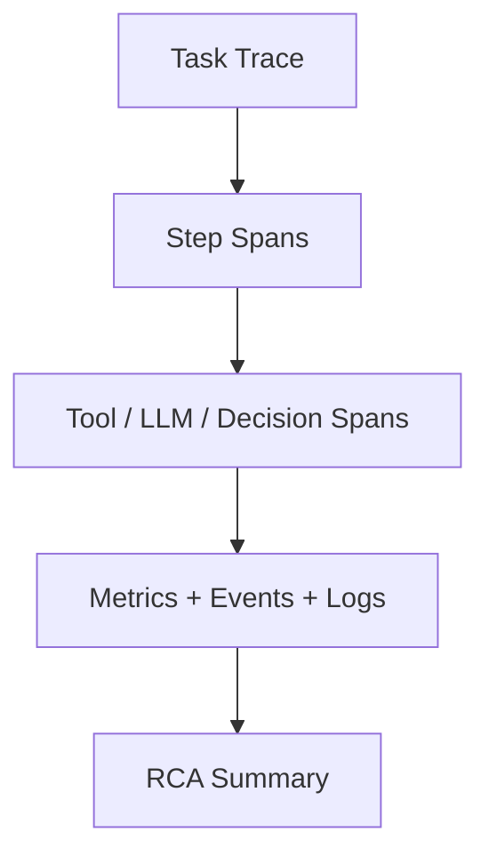

# Trace And Root Cause Observability Contract

## 1. 范围

本 contract 定义 trace/span 模型、业务与技术指标分层，以及故障根因分析辅助能力。

相关文档：

- `observability_contract.md`
- `debug_inspect_health_backpressure_contract.md`
- `diagnostics_snapshot_and_repro_bundle_contract.md`
- `event_registry_and_ops_threshold_contract.md`

## 2. 目标

- 让一次任务从入口到 step、tool、LLM、decision 都能在 trace 上串起来。
- 把业务 dashboard 与技术 dashboard 分开治理。
- 让故障后自动生成初步 RCA 线索，而不是只留下分散日志。

## 3. Trace 模型

最小层级：

- 一个 task = 一个 `trace`
- 一个 agent step = 一个 `span`
- 一次 tool call = 一个 `span`
- 一次 LLM call = 一个 `span`
- 一次 decision / escalation = 一个 `span`
- 一次 OAPEFLIR stage = 一个上层 `span`

必须传播的关联字段：

- `trace_id`
- `span_id`
- `parent_span_id`
- `correlation_id`
- `task_id`
- `execution_id`
- `session_id`

推荐 baggage：

- `tenant_id`
- `workspace_id`
- `organization_id?`
- `agent_id?`
- `user_id?`
- `priority?`
- `oapeflir_stage?`
- `loop_iteration?`
- `domain_id?`

## 4. Trace Carrier 与传播规则

推荐 carrier 类型：

- `http_headers`
- `message_attributes`
- `queue_metadata`
- `worker_runtime_context`

最小要求：

- gateway ingress 必须能创建或提取 trace context。
- runtime / worker / gateway / approval / remote bridge 之间必须显式注入与提取 trace context。
- trace 传播失败不得中断主任务执行，但必须记录 observability warning。
- trace sink、callback、subscriber 或 exporter 的异常不得反向打断主执行链；观测面默认 fail-open，但必须保留 warning / dropped event 证据。

推荐字段：

- `traceparent`
- `tracestate`
- `x-correlation-id`
- `x-tenant-scope`

## 5. Trace Sampling

推荐规则：

| 条件 | 采样率 |
| --- | --- |
| debug / operator takeover | `100%` |
| error / dead-letter / stale write | `100%` |
| approval / policy escalation | `100%` |
| normal task | `10%` |
| background / periodic maintenance | `1%` |

## 6. 指标分层

| 层 | 指标示例 |
| --- | --- |
| `oapeflir` | loop 收敛率、feedback 正负比、rollout 成功率 |
| `business` | 任务成功率、审批率、事业部产出、用户升级率 |
| `platform` | 吞吐、队列积压、恢复成功率、租约回收数 |
| `runtime` | worker 心跳、执行时长、重试率、背压触发率 |
| `infra` | DB 延迟、cache 命中、CPU、内存、事件循环延迟 |

## 7. 根因分析辅助

故障视图至少应自动聚合：

- 最近相关事件
- 最近相关配置变更
- 最近相关 prompt / model / policy 变更
- 最近相关 worker / lease 切换
- 最近相关成本异常
- 最近相关 feedback / learning / rollout 动作

## 8. 异常模式检测

至少支持识别：

- 某角色连续卡在同一步
- 某工具近期失败率激增
- 某租户或事业部成本异常抬升
- 某 worker 心跳抖动异常
- 某 loop 长时间不收敛
- 某 rollout 连续受阻或回滚

## 9. 可视化目标

## 10. 收口结论

工业级可观测性不能停留在“有日志”和“有 healthz”。

它必须支持：

- trace 级串联
- 业务与技术指标分层
- 故障后自动收束根因线索
