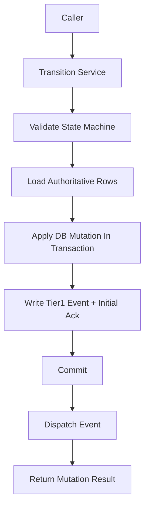

# Transition Service Contract

> **OAPEFLIR 相关**：本 contract 定义 OAPEFLIR 8 阶段状态转换，对应 ADR-016。
> **更新日期**：2026-04-17

## 1. 范围

本 contract 把 `state_transition_matrix_contract.md` 下钻到实现前必须冻结的统一状态变更入口。

它回答 3 个问题：

- 哪些服务函数是唯一允许的状态写入口。
- 一次状态推进应携带哪些上下文。
- 跨表状态收口时事务、事件和恢复顺序如何约束。

相关文档：

- `runtime_state_machine_contract.md`
- [ADR-016 OAPEFLIR 八阶段模型](../adr/016-oapeflir-loop-model.md)
- `state_transition_matrix_contract.md`
- `runtime_repository_and_migration_contract.md`
- `event_bus_contract.md`
- `app_error_contract.md`

## 2. 核心原则

- 不允许调用方直接散写状态字段。
- 所有状态推进都必须带 `reason_code`、`trace_id` 和 `occurred_at`。
- 跨表状态推进优先走聚合 transition，而不是多次局部更新。
- Tier 1 状态事实必须先落库，再进入事件分发链。

## 3. 关键对象

### 3.1 `TransitionCommand`

说明：

- TypeScript 实现按仓库约定使用 camelCase 字段名，但语义与本表一一对应。
- 实现字段映射为：`entityKind` / `entityId` / `fromStatus` / `toStatus` / `reasonCode` / `reasonDetail` / `traceId` / `actorType` / `actorId` / `idempotencyKey` / `occurredAt` / `metadataJson`。

| 字段 | 类型 | 说明 |
| --- | --- | --- |
| `entity_kind` | `harness_run \| node_run \| side_effect \| budget_reservation \| session_projection \| approval_projection \| task_projection \| workflow_projection` | 目标实体类型 |
| `entity_id` | `string` | 目标 ID |
| `from_status` | `string?` | 期望旧状态，可选 optimistic guard |
| `to_status` | `string` | 目标状态 |
| `reason_code` | `string` | 推进原因码 |
| `reason_detail` | `string?` | 可审计的附加说明 |
| `trace_id` | `string` | 链路追踪 ID |
| `actor_type` | `user \| agent \| system \| scheduler \| admin \| webhook \| recovery` | 谁触发了变更（对齐 `audit_lineage_and_retention_contract.md` §4 统一 actor model，扩展 `recovery` 用于恢复链） |
| `actor_id` | `string?` | 触发者 ID |
| `idempotency_key` | `string?` | 防重入键 |
| `occurred_at` | `timestamp` | 事实发生时间 |
| `metadata_json` | `json?` | 附加上下文 |

规则：

- `harness_run`、`node_run`、`side_effect`、`budget_reservation` 是 truth entity kind；`task_projection`、`workflow_projection`、`session_projection`、`approval_projection` 只允许作为投影更新目标。
- `execution`、`task`、`workflow` 这类 pre-v4.3 `entity_kind` 只能作为 migration input，在入口归一化后不得继续作为 canonical transition target。

### 3.2 `TransitionMutationResult`

- `applied`
- `previous_status`
- `current_status`
- `mutation_group_id`
- `updated_rows`
- `emitted_event_types`

### 3.3 `TransitionGuardFailure`

- `expected_status_mismatch`
- `invalid_transition`
- `terminal_state_reentry`
- `missing_dependency`
- `duplicate_mutation`

## 4. 服务入口

Phase 1a / 1b 最少冻结以下入口：

- `RuntimeStateMachine.transition(command)`
- `transitionHarnessRun(command)`
- `transitionNodeRun(command)`
- `transitionSideEffect(command)`
- `transitionBudgetReservation(command)`
- `projectHarnessRunToTaskView(input)`
- `projectNodeRunToWorkflowView(input)`
- `projectNodeRunToSessionView(input)`
- `projectDecisionToApprovalView(input)`
- `transitionBlockedForApproval(input)`
- `transitionHarnessTerminalState(input)`

聚合入口说明：

- `transitionBlockedForApproval(...)`
  - truth 上推进 `node_run=awaiting_hitl` 或 `policy_blocked`
  - truth 上保持或推进 `harness_run=running / paused`
  - 投影上同步 `tasks.status=awaiting_decision`
  - 投影上同步 `workflow_state.status=paused`
  - 创建或关联 approval projection
  - 同事务追加 `platform.*` Tier 1 事件
- `transitionHarnessTerminalState(...)`
  - truth 上统一收口 `harness_run / node_run / budget reservation / side-effect`
  - 投影上统一收口 `task / workflow / session`
  - 负责成功、失败、取消三类终态

## 5. 调用顺序与事务边界

规则：

- 状态合法性校验必须先于写库。
- 需要跨表一致性的 transition 必须在同一事务内写入主状态和 Tier 1 事件。
- 事件分发失败不得回滚已提交的事实状态；恢复链应基于 `events` 与 `event_consumer_acks` 补发。

## 6. 状态推进约束

### 6.1 单实体推进

- 单实体推进必须验证 `runtime_state_machine_contract.md` 中的合法跃迁。
- 若提供 `from_status`，数据库更新必须带旧状态条件，避免并发覆盖。
- 终态重复写入默认视为幂等 no-op，仅当字段语义冲突时返回错误。

### 6.2 聚合推进

- `harness_run=completed` 时，`task_projection=done`、`workflow_projection=completed` 与 `session_projection=completed` 应在同一聚合 transition 或同一恢复收口中完成。
- `node_run=awaiting_hitl` 或 `policy_blocked` 且原因为审批等待时，不得遗漏 `task_projection=awaiting_decision`。
- `DecisionDirective(approve / deny / expire_approval)` 生效时，必须能回溯对应被阻塞的 `node_run` / `budget_reservation` / `side_effect`。
- `harness_run` 存在活跃 `node_run` 时，不得由并发调用创建第二个活跃推进者；若进入恢复或接管，必须先完成旧 node attempt 的显式收口。

### 6.3 终态重入与 attempt 规则

- `completed` / `failed` / `aborted` 的 `HarnessRun` 不得通过普通 transition 重新进入活跃态。
- `failed / cancelled / aborted` 的 `NodeRun` 若要恢复，必须创建新的 `NodeAttempt` 或追加 `GraphPatch`，并保留旧终态、旧错误码和旧 trace 证据。
- 对同一 step 的重复 `completed` 写入，只允许作为幂等 no-op 返回，不得重复派生新的副作用或 Tier 1 事件。

## 7. 幂等与恢复

- 每个 transition 应支持 `idempotency_key`，用于处理恢复重放或重试。
- 相同 `entity_kind + entity_id + to_status + idempotency_key` 的重复请求默认只生效一次。
- 若事务已经完成但调用方未收到响应，应允许安全重放并返回最终状态。
- 恢复逻辑不得绕过 Transition Service 直接写终态。
- 聚合 transition 的 `idempotency_key` 应覆盖整组跨表变更，而不是只覆盖单表 update。

## 8. 错误语义

典型错误码：

- `workflow.invalid_transition`
- `validation.invalid_input`
- `runtime.recovery_required`
- `storage.write_failed`
- `internal.unexpected_error`

补充规则：

- optimistic guard 失败应返回可识别错误，而不是静默覆盖。
- 终态冲突必须返回不可重试错误。
- 半完成写入若被检测到，Transition Service 应抛出 `runtime.recovery_required` 并交由恢复链处理。

## 9. 最小审计字段

每次 transition 至少要能追溯：

- 谁触发
- 从什么状态到什么状态
- 为什么推进
- 哪些表被改动
- 写了哪些 Tier 1 事件

## 10. Phase 边界

Phase 1a 明确只做：

- 单机进程内统一 transition service
- SQLite 事务内聚合推进
- 基于 `idempotency_key` 的最小防重

当前不做：

- 跨进程分布式状态协调
- saga 编排器
- 通用状态图 DSL

## 11. 收口结论

主状态机是否清晰，最终取决于状态是不是只能通过一组收紧后的入口变更；本 contract 就是这组入口的 authoritative 边界。

## v4.3 Architecture Remediation

以下条目修复 `platform-architecture-implementation-consistency-audit.md` 中记录的 contract 偏差。本文档历史段落如与本节冲突，以本节、`docs_zh/architecture/00-platform-architecture.md`、ADR-109 至 ADR-113、以及 `src/platform/contracts/executable-contracts/` 为准。

- T-32: 本文原先把 `TransitionCommand.entity_kind` 绑定在 `task / workflow / session / approval / execution` 这组 pre-v4.3 对象上，根因是 transition service 直接继承了旧 repository 表模型，没有随着 `HarnessRun / NodeRun / SideEffect / BudgetReservation` 成为 truth aggregate 一起迁移。修复：正文现把 canonical `entity_kind` 收敛到 `harness_run / node_run / side_effect / budget_reservation`，其余仅保留为 projection 或 migration 输入。

强制规则：状态迁移必须通过 `RuntimeStateMachine.transition(command)`；执行计划必须使用 `PlanGraphBundle`；执行结果必须使用 `NodeAttemptReceipt`；truth event 只能使用 `platform.*`；OAPEFLIR 只能作为 `oapeflir.view.*` / rationale 投影；预算必须使用 `BudgetLedger` / `BudgetReservation` / `BudgetSettlement`。
