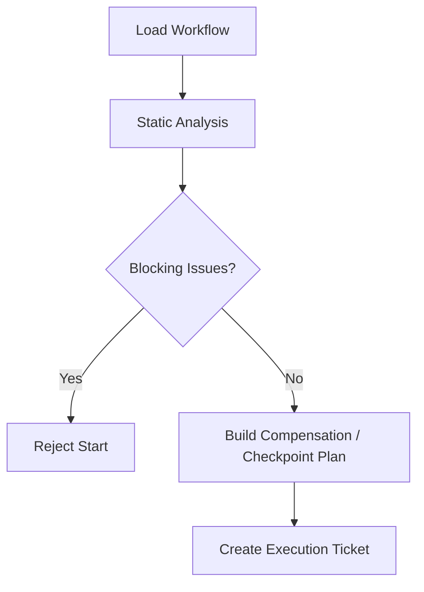

# Workflow Static Analysis And Compensation Contract

## 1. 范围

本 contract 定义 workflow 在运行前的静态分析规则、补偿事务边界，以及长任务分片与 partial commit 语义。

相关文档：

- `task_and_workflow_contract.md`
- `workflow_io_compatibility_precheck_contract.md`
- `idempotency_and_recovery_matrix_contract.md`
- `runtime_execution_contract.md`

## 2. 目标

- 把明显错误在运行前拦下，而不是运行中才暴露。
- 为有副作用步骤提供正式补偿模型。
- 为长任务、子图恢复、分阶段提交提供统一语义。

## 3. 静态分析最小检查

运行前至少检查：

- 死循环检测
- 不可达 node 检测
- dependency 闭环检测
- required input key 缺失
- schema 不兼容
- timeout / retry 缺失或非法
- node type 与 side effect level 不一致
- node id 唯一性检查
- output key 重复检查
- 未知依赖引用检查
- OAPEFLIR stage 顺序是否合法
- plugin / domain tool bundle 引用是否存在
- release rollback 是否声明 compensating_action 或等价补偿策略

## 4. 分析结果对象

- `WorkflowLintReport`
- `StaticCompatibilityIssue`
- `DependencyCycle`
- `CompensationPlan`
- `CheckpointPlan`
- `WorkflowTemplate`

v4.3 对齐说明：

- 代码侧 `StaticCompatibilityIssue` 现作为 `WorkflowLintIssue` 的 canonical compatibility alias 导出，供 contract 调用面直接消费 issue array。
- 代码侧 `WorkflowTemplate` 现作为 `MinimalWorkflowDefinition` 的 compatibility alias 导出，统一指向仓内 authoritative workflow definition 结构，而不是额外维护第二份模板实体。

## 5. 补偿模型

每个有副作用的 node 必须声明下列之一：

- `idempotent_replay`
- `compare_and_swap_write`
- `compensating_action`
- `manual_reconciliation_required`

补偿动作至少应说明：

- trigger condition
- compensation owner
- compensation timeout
- compensation idempotency
- evidence artifact

## 6. 长任务分片

长任务至少支持：

- checkpoint 分片
- 子图恢复
- 分阶段提交
- 任务级 partial commit

规则：

- checkpoint 只能建立在 side effect 边界之后。
- 子图恢复不得越过未完成补偿的 node。
- partial commit 必须可审计并可回溯到对应 node group。
- upstream node 若进入 `failed` 或 `skipped` 且依赖不可再满足，下游 node 不得无限期停留在 `blocked`；系统应有明确的级联失败或级联跳过语义。

## 6.1 模板化 workflow / recipe

若系统支持 workflow / recipe 模板，模板至少应显式声明：

- `version`
- `title`
- `description`
- `instructions`
- `parameters`
- `required_extensions_or_capabilities`
- `prompt_or_execution_entry`

规则：

- 模板不应只是自由文本 prompt；参数、扩展依赖和执行入口必须结构化。
- 新模板在进入共享目录、市场或团队分发前，应通过结构校验与最小安全扫描。
- 模板作者指南应明确：哪些字段必填、哪些扩展需要信任确认、哪些参数必须显式输入。
- 若系统同时存在 server、web console、desktop 或其他编辑入口，模板校验规则应尽量从统一的 authoritative schema artifact 派生，而不是手工维护多份平行校验逻辑。
- 模板 schema 中的 `$ref`、复合类型与依赖字段应能在各入口被一致解析，避免“服务端能过、编辑器不能过”或反之。

## 7. 运行前门禁

## 8. Phase 边界

Phase 1a：

- key existence
- dependency cycle
- timeout / retry presence
- side effect declaration required
- OAPEFLIR stage order validity

Phase 1b / 2：

- unreachable node
- more complete schema compatibility
- compensation templates
- partial commit orchestration
- release rollback orchestration

## 9. 收口结论

工业级 workflow 不能只会“顺着跑”。

它必须在开始前知道：

- 结构是否有效
- 哪些 node 有副作用
- 失败后如何补偿
- 长任务如何分片恢复
