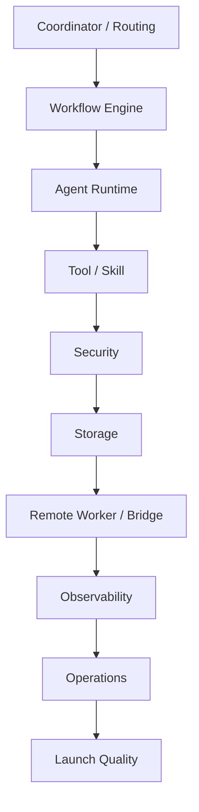

# Module Remediation Backlog

## 1. 目标

本文件把按模块拆分的整改项整理成正式 backlog，服务后续稳定化与平台化实现。

它回答 3 个问题：

- 每个模块当前最需要补什么。
- 哪些项是 `P0 / P1 / P2`。
- 哪些整改项应优先进入稳定化执行计划。

## 2. 使用规则

- 这是执行 backlog，不替代 contract。
- 所有整改项都应回链到对应 contract、review 或 phase 文档。
- `P0` 代表上线前或稳定运行前的硬阻塞。
- `P1` 代表强烈建议上线前完成。
- `P2` 代表上线后尽快补齐。

## 3. 模块总览

## 4. 调度层（Coordinator / VP 运营 / VP 编排）

| 编号 | 问题 | 目标 | 建议动作 | 优先级 |
| --- | --- | --- | --- | --- |
| `SCHED-01` | VP 运营分类和路由部分依赖 LLM，结果易漂移 | 相同输入在相同配置下得到稳定路由 | 先规则匹配，再 LLM 兜底；输出结构化原因；记录 route trace；建立回放测试 | `P0` |
| `SCHED-02` | 调度决策不可追溯 | 每次 dispatch 都可解释 | 记录 affinity、load、constraint、fallback 原因；为每次调度生成 decision record | `P1` |
| `SCHED-03` | 亲和性优先可能导致热点 worker 过载 | 平衡亲和性与负载均衡 | affinity 加权；限制单 worker 最大粘性占比；检测长期负载倾斜 | `P1` |
| `SCHED-04` | remote 不可用时 fallback 规则不严谨 | 所有降级路径清晰可测 | 定义 `remote unavailable / degraded / partial available`；明确本地执行、排队、fail-fast 条件 | `P0` |
| `SCHED-05` | 缺少 admission control | 过载前拒绝或降级 | 调度前检查并发、成本、worker 容量、队列长度；任务分池；低优先级延迟入队 | `P0` |
| `SCHED-06` | dispatch 后 ownership 边界不严谨 | 任务 ownership 明确 | dispatch 后写 lease owner；支持 step 边界 handover；lease 超时回收；worker 失联自动重分派 | `P0` |
| `SCHED-07` | 跨事业部依赖图易出错 | 执行前发现 DAG 配置问题 | 检测环、孤儿节点、引用缺失、跨 division output/input key 不匹配 | `P0` |
| `SCHED-08` | urgent 任务抢占策略未明确 | 重要任务可获得资源且不破坏一致性 | 只在 step 边界抢占；被抢占任务自动 pause；记录来源与恢复点 | `P1` |
| `P2-37` | 背压判断在 admission、runtime、dispatch 入口不一致 | 过载策略跨入口一致 | 统一消费 health/backpressure snapshot；按 `occurredAt` 判定 starvation/stale；operator 与 CLI 走同一背压口径 | `P1` |

## 5. 工作流层（Workflow Engine）

| 编号 | 问题 | 目标 | 建议动作 | 优先级 |
| --- | --- | --- | --- | --- |
| `WF-09` | YAML 工作流错误运行期才暴露 | 启动或变更时即发现 | step id 唯一性、output key 重复、role 存在性、precondition 注册检查 | `P0` |
| `WF-10` | step 级超时治理不完整 | 每个 step 有明确最大执行时间 | step 级 timeout；超时统一进入 retry 或 fail；区分 LLM、tool、queue、dependency 超时 | `P0` |
| `WF-11` | 失败统一一套 retry 不合理 | 按失败类型重试 | transient retry、semantic retry、permission fail 不重试、destructive fail 直接升级 | `P0` |
| `WF-12` | 输出不完整时后续仍执行 | 后续步骤只能吃合法输出 | step 完成后做 output schema validate；required 缺失直接失败 | `P0` |
| `WF-13` | 恢复过度依赖 message/tool result | 每个 step 完成时有稳定快照 | 保存 step output、artifact id、file diff 摘要、decision context | `P1` |
| `WF-14` | 恢复逻辑难系统性验证 | 可系统性测试恢复 | 支持在 `step started / tool completed / before commit` 注入 crash | `P1` |
| `WF-15` | 中间状态错了缺少人工修正 | 人工修补后继续跑 | 手动设置 `current_step_index`、手动写 output、手动跳过 step | `P1` |
| `WF-16` | workflow completed 但 task 可能不是 done | 状态最终一致 | workflow/task/session/division result 结束时做 reconcile，并支持自动修复 | `P0` |

## 6. Agent Runtime

| 编号 | 问题 | 目标 | 建议动作 | 优先级 |
| --- | --- | --- | --- | --- |
| `AGENT-17` | Agent 生命周期边界仍可收紧 | 每个 Agent 状态可控 | 定义标准生命周期图；terminated 不再接消息；paused 只能 resume 或 terminate | `P0` |
| `AGENT-18` | 心跳只看“活着”不够 | 心跳反映负载与健康 | 增加 cpu、mem、tool backlog、current step、last progress time | `P1` |
| `AGENT-19` | Agent 可能卡住但未死亡 | 检测 stalled agent | 记录 `last_progress_at`；无进展自动 dump context + 重启/升级 | `P0` |
| `AGENT-20` | 单个 Agent 可无限吃资源 | 单 Agent 资源可控 | 限制 llm rounds、tool calls、memory footprint、elapsed time | `P0` |
| `AGENT-21` | 运行证据分散在日志与事件里 | 单 Agent 有完整执行轨迹 | 增加 agent execution record，记录 plan、step、tool、error、retry、decision | `P1` |
| `AGENT-22` | restart 后身份语义不清 | 恢复与审计一致 | 保留 logical agent id；restart 生成新 runtime instance id 和 restart chain | `P1` |
| `AGENT-23` | 中间件链设计存在，但未被当作正式 runtime 骨架治理 | 让 loop detection、compaction、tool repair、memory update 真正进入主链 | 把 `before_agent / before_model / after_model / wrap_model_call / wrap_tool_call / after_agent` 作为正式 runtime seam；中间件异常默认 fail-open 但留 warning | `P0` |
| `AGENT-24` | 超长输出截断后缺 continuation 恢复语义 | 长输出任务可稳定续写 | 检测 `max_output_tokens` / equivalent stop reason；自动提高输出预算或进入 continuation prompt；加入收益递减停止条件 | `P1` |
| `AGENT-25` | loop detection 仍偏粗粒度 | 精准识别重复工具调用和 Doom Loop | 按 `tool + normalized input hash` 检测；3 次 warn / ask，5 次升级或终止 | `P1` |
| `AGENT-26` | retry / breaker / limiter 仍偏分散 | 形成统一可组合的调用治理 | 增加 composable limiter，按 provider / model / tenant / task 组合限流；与 retry-after、breaker、admission control 共享同一治理面 | `P1` |
| `P2-26` | message payload 只存纯文本，tool 结果与摘要难分层消费 | 消息可按 part 类型稳定持久化和压缩 | 为 message 引入 `parts_json`；区分 `summary / artifact_ref / tool_result`；context compaction 优先裁掉大体积 `tool_result` part | `P1` |
| `P2-27` | 事件发布缺少类型边界，schema 兼容策略不显式 | 事件总线可编译期校验且兼容策略清晰 | 为 event registry 增加 `payloadSchemaRef / compatibilityPolicy`；引入 typed publish 包装层收口事件发布 | `P1` |

## 6.1 记忆层（Phase 2b）

| 编号 | 问题 | 目标 | 建议动作 | 优先级 |
| --- | --- | --- | --- | --- |
| `MEM-05` | `memories` 表已预留但缺 repository / recall / lifecycle / quality 基线（当前切片已完成） | 记忆可持久化、可召回、可撤销、可度量 | 已扩 memories schema、补 `MemoryService` / `memory` CLI、支持 scope/trust/lifecycle recall 过滤、命中计数/撤销/质量报告，并在 failure 路径自动沉淀 operational memory；后续继续补 recall ranking / injection 层增强 | `P1` |

## 7. Tool / Skill 层

| 编号 | 问题 | 目标 | 建议动作 | 优先级 |
| --- | --- | --- | --- | --- |
| `TOOL-23` | 工具注册不等于可安全运行 | 每个 tool 上线前经过基线验证 | 参数校验、timeout、cancellation、large output、secret redaction 测试 | `P0` |
| `TOOL-24` | tool 超时与重试处理不统一 | 统一超时和重试模型 | 每个 tool 定义 timeout 和 retryable error set，由 executor 统一处理 | `P0` |
| `TOOL-25` | 返回值风格不一 | 上层稳定消费 | 标准化 `success / output / data / error / duration / metadata` | `P0` |
| `TOOL-26` | 超大输出污染上下文 | 上下文最小化 | 超阈值写 ArtifactStore，message 只放引用与摘要 | `P0` |
| `TOOL-27` | Skill 失败点不清楚 | Skill 像 mini workflow 一样可观测 | Skill step 级事件、重试、output 记录 | `P1` |
| `TOOL-28` | cacheable skill 可能吃过期结果 | 只在安全条件下命中缓存 | cache key 加 git HEAD / source hash；记录 cache 来源；可禁用 | `P1` |
| `TOOL-29` | Skill 组合可能扩大权限 | Skill 不能绕过角色权限 | 静态检查 `requires_tools ⊆ role tools`；运行时再次校验 | `P0` |
| `TOOL-30` | MCP 是高风险外部面 | 不信任 MCP 元数据与输出 | namespace 强制、白名单、output sanitize、环境变量最小化、server sandbox | `P0` |
| `TOOL-31` | 工具默认串行执行，读多写少场景延迟高 | 并发安全工具可真正并行 | `ToolDefinition` 增加 `isConcurrencySafe / interruptBehavior / isLongRunning / retryPolicy / maxResultSizeChars`；读工具并行，写工具串行 | `P0` |
| `TOOL-32` | 缺少原生网页抓取能力 | 文档 / 链接类任务不必依赖外部手工复制 | 增加 `WebFetch`：URL 抓取、HTML 转 Markdown、大小限制、超时、禁内网、域名白黑名单 | `P1` |
| `TOOL-33` | 工具数量增大后全量暴露会拖重 prompt | 工具面可按需发现 | 增加 tool recommend / deferred loading / tool_search；工具少时全量暴露，工具多时按 recall + promote 机制暴露 | `P2` |
| `TOOL-34` | 大规模代码修改仍缺正式 patch 路径 | 提升多文件、多片段修改成功率 | 增加 patch DSL / apply patch 路径；支持 add/update/delete/move、模糊匹配和失败回退 | `P1` |
| `TOOL-35` | 同文件多处修改缺少原子提交能力 | 避免半成功半失败写入 | 增加 multiedit / 原子批量替换；全部成功才提交 | `P1` |
| `TOOL-36` | 旧 tool result 只会裁剪，不会渐进摘要 | 保留审计可见性同时减小 prompt 体积 | 已完成 tool result 成对压缩与摘要 part；原始结果 `user_visible=true / agent_visible=false`，摘要 `agent_visible=true` | `P1` |
| `TOOL-37` | 缺结构化用户提问工具 | 必须打断让用户决策时更精确 | 增加 `question` 工具，支持单选 / 多选 / 批量问题 / skipped 语义，接入 approval / HITL 渲染 | `P2` |
| `TOOL-38` | 长任务缺少会话级 todo 视图 | 任务进度对用户与 operator 更透明 | 增加 `todo_write` 工具，支持 `pending / in_progress / completed / cancelled`，并接入 timeline / diagnostics | `P2` |
| `P2-28` | 同一 skill 在不同 model profile 下缺少确定性工具解析 | 工具选择可随模型能力切换且可审计 | skill step 支持 `modelOverrides`；按 profile / tier / capability 解析 resolved tool；requested/resolved tool 写入执行证据；未知 override 默认 fail-close | `P1` |
| `P2-29` | 高风险命令缺少签名表和参数位数约束 | 命令执行面更可控 | 为 `command_exec` 建立命令签名表、arity 校验、interpreter script-file 模式与参数级 sandbox 校验 | `P0` |

## 8. 安全层

| 编号 | 问题 | 目标 | 建议动作 | 优先级 |
| --- | --- | --- | --- | --- |
| `SEC-31` | 缺实际 prompt injection 样本库 | 持续回归测试 | 建立恶意样本库，覆盖 web、mcp、bash、memory、artifact | `P1` |
| `SEC-32` | secrets 扫描更偏日志脱敏 | 输入到输出全链路扫描 | ingress、tool output、user-visible output、artifact 扫描 | `P0` |
| `SEC-33` | 未知命令稳妥判定不足 | 未知命令默认保守 | unknown = ask 或 deny；classifier 只能升不降；结果缓存带 TTL | `P1` |
| `SEC-34` | 高风险配置被改动后可能潜伏 | 关键配置完整性保护 | division yaml、AGENT.md、features hash；差异审计与告警 | `P1` |
| `SEC-35` | 边界仍部分留在 prompt 层 | 代码级强约束 | spawn_agent division check、tool permission runtime check、write path scope check | `P0` |
| `SEC-36` | 审计事件可篡改风险 | 安全审计可信 | 关键审计表 append-only；hash chain 或 checksum 批次校验 | `P2` |
| `SEC-37` | 网络出口只靠命令黑名单，可观测性不足 | 外发行为可追踪 | 从命令与工具调用中提取 URL / ssh / s3 / registry / publish 目标，先审计再逐步引入策略阻断 | `P1` |
| `SEC-38` | 隐形 Unicode 字符可绕过文本安全检测 | 降低隐写与 prompt injection 风险 | 在 sanitize 主链中做 NFC normalize、过滤 Unicode Tags block 与控制字符，并保留风险标记 | `P1` |
| `P2-30` | 同 session 多个 pending approval 彼此独立，单点拒绝后仍可能残留等待 | 审批拒绝语义一致 | 一个明确拒绝自动级联拒绝同 session 相关 pending request；保留 cascade audit event | `P1` |

## 9. 存储层

| 编号 | 问题 | 目标 | 建议动作 | 优先级 |
| --- | --- | --- | --- | --- |
| `DB-37` | 并发写冲突高 | 写入串行化、读写稳定 | DatabaseWriter 单线程写；批量提交；关键写优先队列 | `P1` |
| `DB-38` | 长期运行后会有孤儿数据 | 数据整洁 | 周期性 orphan cleanup；清理前引用检查 | `P1` |
| `DB-39` | 有 migration 设计不等于可靠 | 升级可重复且具备 PG portability 基线 | 旧版本自动迁移测试；迁移失败回滚；恢复后再迁移测试；补 migration portability preflight 与 checksum 兼容策略 | `P0` |
| `DB-40` | artifact/log/debug/backup 会膨胀 | 可控磁盘占用 | 分类型 quota；自动清理 temp/debug；artifact pin 白名单 | `P1` |
| `DB-41` | 刚写完马上读可能不一致 | 关键路径读一致 | 关键路径统一经 repository；明确 eventual consistency 范围 | `P1` |
| `DB-42` | PG 不可写只有局部拒绝逻辑，缺正式演练与发布证据 | authoritative-state admission 必须 fail-close，operator 能看到 read-only/fail-closed 信号 | 增加 stable DB writability rehearsal；覆盖 health/doctor read-only fail-close、phase1b admission reject、dispatch pending ticket preserve，并把证据接入 gate/package | `P0` |
| `DB-43` | 事件、UI、副作用与状态提交仍可能分叉 | 状态提交后再触发副作用 | 引入 Effect Buffer / 事务后副作用；DB / authoritative state 成功后再发事件、刷 UI、触发外部回调；失败时统一回滚 side-effect callbacks | `P0` |
| `DB-44` | 外部修改检测不足，可能覆盖用户新改动 | 写前感知文件是否陈旧 | read 时记录 mtime / digest；write/edit 前校验 freshness；过期时要求 re-read 或人工确认 | `P1` |
| `DB-45` | 只有 SQLite authoritative store，缺 append-only 会话日志层 | 兼顾可查询与可回放 | 增加 session dual storage：SQLite 做 authoritative index，JSONL 做 append-only 审计/回放；两者通过 session/event sequence 对账 | `P2` |
| `P2-33` | task output、step output 与 artifact 引用模型分裂 | 结果视图统一可投影 | 定义统一 result envelope；让 inspect、diagnostics 与 CLI 直接消费 task/step/artifact 同构结果 | `P1` |
| `QUEUE-01` | queue replay 与 duplicate delivery 缺正式演练 | 队列可由 authoritative DB truth 重建且重复投递不会造成重复执行 | 增加 stable queue delivery rehearsal；覆盖 replay rebuild、capacity/lease fencing、terminal reconciliation cleanup，并把证据接入 gate/package | `P1` |
| `DBQ-01` | 缺 DB/queue 断连正式演练与 repair drill | queue 断连显式降级、DB 真相可重建 queue、DB 写回故障 fail-close | 增加 stable DB/queue disconnect rehearsal；补 missing dispatch ticket repair job、queue unavailable block reason、authoritative store unavailable writeback reason，并把证据接入 gate/package | `P0` |

## 10. 远程 Worker / Bridge

| 编号 | 问题 | 目标 | 建议动作 | 优先级 |
| --- | --- | --- | --- | --- |
| `REMOTE-42` | worker 注册信息可伪造 | 可信 worker registry | mTLS、token/OIDC、capability 白名单、challenge 校验 | `P0` |
| `REMOTE-43` | worker 状态过粗 | 更细粒度调度 | `healthy / degraded / draining / quarantined / offline` | `P1` |
| `REMOTE-44` | 不同 worker 沙箱强度不同 | 调度感知安全等级 | capability 增加 `isolation_level`；高风险任务只发高隔离 worker | `P1` |
| `REMOTE-45` | Bridge 断线重连语义不够严 | 不丢上下文、不重复执行 | stream offset、input ack、replay last N events、session consistency check | `P1` |
| `REMOTE-46` | 文件同步两端都改会冲突 | 明确冲突语义 | 单向主权模式、hash 比对、冲突直接暂停等待人工 | `P1` |
| `REMOTE-47` | 维护前需要优雅下线 | 无损维护 | draining 模式，不接新任务，老任务执行到 step 边界交接 | `P1` |
| `REMOTE-48` | 分布式模式日志分散 | 单任务全链路可看 | taskId 统一透传；coordinator 聚合 remote logs；CLI 可看远程 timeline | `P1` |

## 11. 可观测性

| 编号 | 问题 | 目标 | 建议动作 | 优先级 |
| --- | --- | --- | --- | --- |
| `OBS-49` | taskId 不够覆盖跨 bridge / worker | 全链路 tracing | `traceId / spanId`，关联 LLM、tool、event、db write | `P1` |
| `OBS-50` | 缺核心 metrics 面板 | 基本稳定运行可视化 | task success rate、retry rate、recovery success、worker health、queue、event backlog、step duration、cost per task | `P0` |
| `OBS-51` | 后期告警会很多 | 避免告警风暴 | 按 task 聚合、同类事件抑制、升级路径定义 | `P1` |
| `OBS-52` | 出故障后时间线拼装困难 | 自动事故时间线 | 从 events/logs/messages/step outputs 拼装 timeline，可导出 markdown/json | `P1` |
| `OBS-53` | 观测数据无限增长 | 保留关键、清理噪音 | 事件按 tier 分天数；debug logs 限量；历史 summary 保留 | `P1` |
| `P2-34` | inspect 只适合钻单条记录，缺摘要查询层 | 先筛选再下钻 | 增加 task/workflow/decision 摘要查询、筛选与 CLI 查询模式 | `P1` |
| `P2-35` | debug dump、repro bundle 与 diagnostics 视图割裂 | 调试链路统一 | 收口 diagnostics CLI、debug dump、repro bundle 载荷与统一结果视图 | `P1` |
| `P2-36` | health report 信号过粗 | 健康检查可直接指导运维动作 | 增加 queue governance、worker health、structured findings 与更细 degradation / overload 判定 | `P1` |

## 12. 记忆与学习层

| 编号 | 问题 | 目标 | 建议动作 | 优先级 |
| --- | --- | --- | --- | --- |
| `MEM-01` | token 估算仍可能偏粗（当前切片已完成） | 压缩、预算、overflow 判断更准确 | 已优先消费 message parts / provider usage，并在本地 fallback 改用更精确 token estimator；context compaction 在 trim 后会按渲染内容重算，已废弃粗糙 `chars/4` 估算口径；后续如接入 provider 原生 tokenizer 再继续增强 | `P1` |
| `MEM-02` | STM 与长期记忆迁移语义不完整（当前切片已完成） | 长对话内容可沉淀、可检索 | 已补 memory consolidation：满足阈值的 `layer_3` 记忆可在显式 boundary 内汇总为 `layer_5` 摘要记忆，并对源记忆做可审计撤销；后续继续补自动触发策略、FTS5 / embedding 检索与更强 rerank | `P1` |
| `MEM-03` | 记忆 schema 仍偏弱 | 形成结构化长期记忆 | 统一 `workContext / topOfMind / recentHistory / longTermBackground / facts[]` 结构；带 category / confidence / provenance | `P2` |
| `MEM-04` | 经验复用还缺正式缓存层 | 相似任务可复用 few-shot 与策略经验 | 增加经验缓存、few-shot builder、相似任务注入和命中审计 | `P2` |
| `MEM-06` | 记忆检索仍偏静态注入 | 经验与长期记忆要“相关再注入” | 增加 memory/experience 检索层，先 FTS5 / 关键词召回，再补 embedding / rerank；命中结果进入 few-shot 与 memory injection | `P2` |

## 13. 代码理解与修改层

| 编号 | 问题 | 目标 | 建议动作 | 优先级 |
| --- | --- | --- | --- | --- |
| `CODE-01` | Repo Map 仍偏文件树与浅符号 | 代码理解更语义化 | 升级为 tree-sitter / AST / 定义引用图 / 相关性排序驱动的语义 Repo Map | `P2` |
| `CODE-02` | 缺正式 patch 路径 | 大规模修改成功率提升 | 引入 patch DSL / apply patch，与 edit 并存 | `P1` |
| `CODE-03` | 缺 LSP 诊断闭环 | “写错即回看即修复”形成闭环 | 支持至少 TypeScript / Python 的 diagnostics，把错误摘要回灌模型 | `P1` |
| `CODE-04` | 缺 Git 快照级试错保护 | 修改可撤销、可恢复 | 增加 step 级 Git 快照、undo / redo、快照点与对话历史联动 | `P1` |
| `CODE-05` | 外部文件修改检测尚未纳入修改主链 | 避免覆盖真实用户更新 | 将 freshness / mtime / digest 检查纳入 edit / patch / write 主链，过期则 fail-close | `P1` |

## 14. 运维层

| 编号 | 问题 | 目标 | 建议动作 | 优先级 |
| --- | --- | --- | --- | --- |
| `OPS-54` | 缺统一自检命令 | 一键诊断当前系统 | `agent doctor` 检查 DB、config、backup、locks、workers、event backlog、provider health | `P1` |
| `OPS-55` | 坏配置/坏 DB 不应运行时才炸 | fail fast | config validate、db integrity check、migration dry-run、provider ping | `P0` |
| `OPS-56` | 分布式升级需要兼容矩阵 | 升级不中断业务 | coordinator / worker 升级顺序与 protocol versioning | `P2` |
| `OPS-57` | 备份不等于可恢复 | 定期验证恢复 | 每周 restore test、DB+artifact 联合恢复、恢复后 integrity verify | `P1` |
| `OPS-58` | 难随时知道系统跑什么版本 | 版本与配置可见 | build info、config version、feature flags snapshot、schema version、prompt bundle version | `P1` |
| `OPS-59` | 配置覆盖链条缺少正式约束治理 | 不同环境与阶段的 override 可解释且 fail-close | 建立动态配置约束覆盖规则；限制 env / tenant / rollout / break-glass 的可覆盖范围；所有 override 进入审计与 readiness 检查 | `P1` |
| `P2-31` | 配置文件不支持注释与尾逗号，治理可读性差 | 配置可读但仍 fail-close | 支持 JSONC 解析；允许 `//`、`/* */` 与尾逗号；保留 malformed config 拒绝语义 | `P2` |
| `P2-32` | provider / model profile 元数据分散 | 模型默认值与覆盖源统一 | 建立 `models.json` registry；支持本地覆盖；未知 profile 与非法 metadata 默认 fail-close | `P1` |

## 15. 上线验收与质量体系

| 编号 | 问题 | 目标 | 建议动作 | 优先级 |
| --- | --- | --- | --- | --- |
| `QA-59` | 上线门禁未正式成体系 | 发布前统一门禁 | 单元/集成、恢复回归、安全红队、限流熔断、灰度 soak test | `P0` |
| `QA-60` | 没有固定标准任务集 | 版本间可对比 | 编程、研究、内容、多事业部、远程协调 representative golden tasks | `P0` |
| `QA-61` | 缺统一回归基准线 | 版本退化可量化 | 成功率、成本、时延、重试率、人工升级率、恢复成功率 | `P0` |
| `QA-62` | 一次性升级风险高 | 渐进发布 | feature flags、canary worker、canary user group、回滚开关 | `P1` |
| `QA-63` | 没有回滚剧本 | 故障时可快速降级 | 回滚配置、feature、worker version、prompt bundle | `P0` |
| `QA-64` | 缺稳定运行验收线 | 有客观长期运行门槛 | 14 天连续运行、无人工 DB 修复、无 orphan queue、无 zombie lock、恢复成功率 100%、P95 延迟在预算内 | `P0` |
| `EXP-01` | 研究层建议缺正式吸收闭环 | 推荐项必须有去向或拒绝理由 | 建立 `research_analysis_absorption_matrix`，逐项记录 `adopted / deferred / rejected` 与对应方案文档 | `P0` |

## 16. 收口结论

这份 backlog 的作用不是继续扩功能，而是把各模块真正会影响上线与稳定运行的问题拆成可执行项。

后续如果进入实现阶段，应优先按：

1. `P0` 先清硬阻塞
2. 再做 `P1` 的稳定性和运维收口
3. 最后再补 `P2` 的工业化增强
