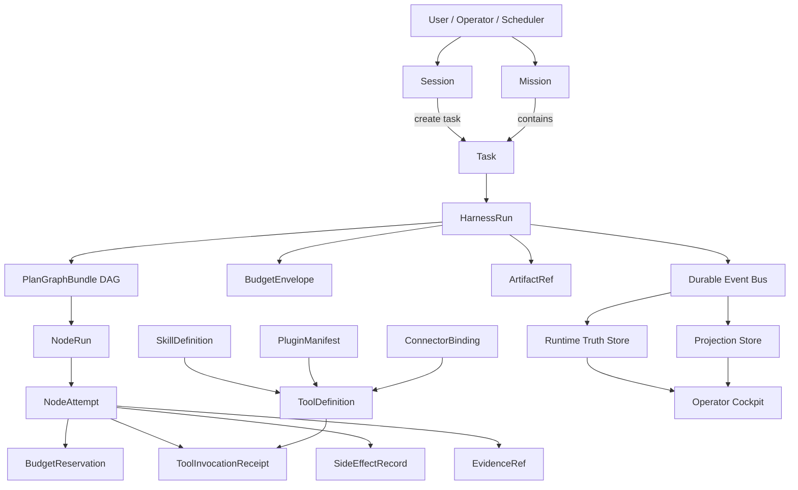
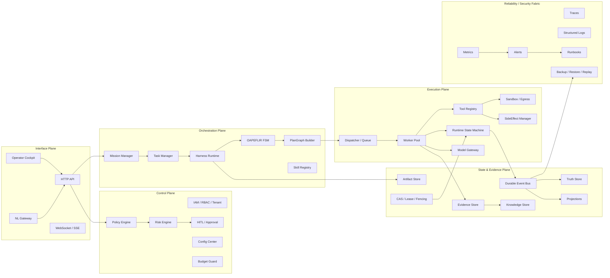
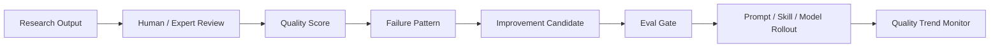

# Automatic Agent Platform — 验证与实时监控完整方案

> **版本**：v1.7.1 — Freeze Patch / v2.0 Baseline Candidate  
> **状态**：`freeze_ready_candidate`  
> **适用系统**：Automatic Agent Platform  
> **首个验证业务**：LLM Research Intelligence Mission  
> **核心目标**：证明平台在 Research Intelligence 场景下具备可执行、可观测、可审计、可回放、可阻断、可签字、可复盘的准生产能力。  
> **术语策略**：弱化 `Step`，统一使用 `PlanGraphBundle / NodeRun / NodeAttempt` 描述执行单元。`Step` 仅允许出现在 legacy 兼容、外部文档引用或迁移说明中。  
> **Roadmap Stage 与 Validation Phase 分离**：Roadmap Stage 表示产品/业务推进阶段；Validation Phase 表示验证阶段；Runtime Ring / Release Ring 表示运行时发布级别，三者不得混用。  

---

## Changelog

| 版本 | 变化 |
|---|---|
| v1.0 | 建立 Research Intelligence Mission 验证方案主框架 |
| v1.1 | 补充 Skills / Plugins / Tool Registry / Connector Runtime |
| v1.2 | 增加 RTM、Evidence Bundle、CI/CD、OTel、数据治理、质量评分、压测、状态矩阵、DR、Incident、RACI |
| v1.3 | 增加 OAPEFLIR 阶段矩阵、Mission/Task/Session 创建策略、Security/IAM、Operator Cockpit、Metric Definition、Example Validation Run |
| v1.4 | 增加 RSM/CAS/Lease/Fencing、SideEffect、Config、Model Gateway、Persistence、SLO、Tenant Scheduling、Event/Gate/Metric Registry、Freeze Checklist |
| v1.5 | 修复事件命名、插件签名规则、RTM Gate/Metric 对齐；补 Dispatch、Test Quality、Autonomy、Rollout、Docs Drift |
| v1.6 | 补齐 Gate/Metric/Event/CI/Runbook 五类 Registry 闭环；增加 Artifact 生命周期、L40S 条件验证、Cost attribution 扩展 |
| **v1.7** | **补齐数据治理 Gate/Metric/CI/Runbook，Evidence Bundle 防篡改，Event Payload Schema Registry，Runbook 机器元数据，Mission-specific SLO，UI 权限链路，全部指标闭环** |
| **v1.7.1** | **Freeze Patch：合并 Evidence Bundle Gate 子项，补齐 hitl-e2e CI Job，明确 eventName segment regex，明确 aa.* span name 不进入 Metric Registry Closure** |

---

## 目录

1. 文档目标与验证边界  
2. 首个验证业务选择  
3. 核心对象关系  
4. Mission / Task / Session 创建策略  
5. 验证原则  
6. Roadmap Stage 与 Validation Phase  
7. 系统总体架构图  
8. 实时监控体系  
9. Dashboard 设计  
10. Alert 体系  
11. 全覆盖验证方法  
12. 测试体系  
13. 质量 Scorecard  
14. Release / Graduation Gate  
15. 阻断策略  
16. Evidence Bundle  
17. OAPEFLIR Stage-level Validation  
18. Skills / Plugins / Tool Registry / Connector Runtime Validation  
19. Security / Tenant / IAM Validation  
20. Operator Cockpit / UI Validation  
21. Runtime State / CAS / Lease / Fencing Validation  
22. SideEffect / Reconciliation Validation  
23. Config Center / Drift / Rollout Validation  
24. Model Gateway Provider / Streaming Validation  
25. Persistence / Repository / Migration Validation  
26. Dispatch / Queue / Worker Pool Validation  
27. Test Quality Governance  
28. Autonomy / Runtime Mode Validation  
29. Prompt / Skill / Knowledge Rollout Validation  
30. Documentation / ADR / Contract Drift Validation  
31. Requirement Traceability Matrix  
32. Metric Summary  
33. CI/CD Validation Pipeline  
34. Observability Semantic Convention  
35. Research Data Governance  
36. Research Output Quality Rubric and Feedback Loop  
37. Load / Stress / Capacity Validation  
38. Lifecycle Transition Matrix  
39. Backup / Restore / DR Validation  
40. Incident Lifecycle / Postmortem  
41. SLO / Error Budget / Burn-rate Validation  
42. Tenant Quota / Fair Scheduling Validation  
43. Local Model / L40S GPU Capacity Validation  
44. Example Validation Run  
45. RACI / Sign-off Matrix  
46. Event Naming / Event Schema Registry  
47. Gate Registry  
48. Metric Registry  
49. Runbook Registry  
50. Artifact Lifecycle / Integrity Validation  
51. Freeze Checklist  
52. 最终验收标准  
53. 附录 A：Canonical Event 清单  
54. 附录 B：测试清单  
55. 附录 C：Dashboard 字段清单  
56. 附录 D：Runbook Registry  
57. 附录 E：机器可执行工件清单  

---

# 1. 文档目标与验证边界

## 1.1 验证目标

本方案用于验证 Automatic Agent Platform 是否具备承载第一阶段业务的准生产能力。验证不以“能跑一个 Demo”为目标，而以如下能力为准：

| 能力 | 验证问题 |
|---|---|
| 正确性 | 状态、预算、证据、权限、输出是否符合 contract |
| 可靠性 | worker crash、provider failure、event lag、DB restore 后是否能恢复 |
| 安全性 | tenant isolation、IAM、secret、sandbox、egress 是否 fail-closed |
| 可审计性 | 每个关键决策是否有 principal、trace、auditRef、evidenceRef |
| 可回放性 | Event → Truth → Projection 是否可重建且 diff=0 |
| 可观测性 | 是否能通过 trace / metric / log / dashboard 实时判断系统状态 |
| 可扩展性 | Skills / Plugins / Tools / Connectors 是否可安全扩展 |
| 可治理性 | Prompt / Skill / Knowledge / Config / Policy 是否能渐进 rollout 与 rollback |
| 可签字 | 每次验证是否形成可归档、可验签的 Evidence Bundle |

## 1.2 验证边界

第一阶段验证以 **LLM Research Intelligence Mission** 为业务载体，覆盖平台核心底座，不覆盖完全开放的第三方 Marketplace。

| 范围 | 是否纳入 v1.7 |
|---|---:|
| Mission / Task / Session / Harness / PlanGraph / NodeRun | 是 |
| OAPEFLIR 八阶段 | 是 |
| Tool Registry / First-party Skills / First-party Plugins / Connectors | 是 |
| Model Gateway / Budget / Cost Attribution | 是 |
| EventBus / Truth / Projection / CAS / Lease / Fencing | 是 |
| HITL / Governance / Knowledge Promotion | 是 |
| Operator Cockpit / Dashboard / Alert / Runbook | 是 |
| Data Governance / Evidence Integrity / Artifact Integrity | 是 |
| Third-party Marketplace | 默认关闭，仅验证“不得提前开启” Gate |
| External Business Mission | 后续 Roadmap Stage 验证 |

---

# 2. 首个验证业务选择

## 2.1 推荐首个业务：LLM Research Intelligence Mission

选择原因：

1. **副作用低**：主要产出报告、知识条目、证据包，外部破坏性副作用少。
2. **覆盖面广**：能覆盖论文摄入、网页抓取、LLM 评审、证据链接、知识沉淀、HITL、发布治理。
3. **业务价值高**：能支撑 Reasoning / Code / Function Call / Agent / Token Efficiency 研究沉淀。
4. **适合验证 Mission 概念**：研究任务通常是长期目标，不是单个 Agent Session。
5. **适合逐步引入 Skills / Plugins**：Paper Reader、Web Search、Evidence Extractor、Knowledge Writer、Report Generator 均可作为 first-party skills。

## 2.2 不建议首个业务直接选择

| 业务 | 不建议原因 |
|---|---|
| Code Agent 自动改代码 | 副作用更高，需要 PR sandbox、repo writeback、CI rollback |
| Engineering Ops 自动运维 | 容易触发生产环境副作用，需要更强 incident governance |
| Quant Trading / Legal / YONO 预测业务 | 领域风险高，需额外监管、合规、业务模型验证 |
| Third-party Marketplace | 供应链和插件隔离复杂，应在核心平台稳定后推进 |

---

# 3. 核心对象关系

## 3.1 对象定义

| 对象 | 定义 | 是否权威 |
|---|---|---:|
| Mission | 长期目标、持续工作流、跨多个 Task 的业务单元 | 是 |
| Task | Mission 下的单次可执行工作请求 | 是 |
| Session | 人机交互上下文，可产生 Task，但不等于 Task | 部分权威 |
| HarnessRun | 一次受控执行循环，绑定 Task / PlanGraph / Budget / Risk | 是 |
| PlanGraphBundle | DAG 计划结构，替代线性 `steps[]` | 是 |
| NodeRun | PlanGraph 中一个节点的运行实例，替代 legacy step execution | 是 |
| NodeAttempt | NodeRun 的一次尝试，可重试、多次 attempt | 是 |
| BudgetReservation | LLM/tool/connector 调用前的预算预留 | 是 |
| SideEffectRecord | 所有外部写入/发布/通知/连接器调用的副作用记录 | 是 |
| EvidenceRef | 结论、决策、输出绑定的证据引用 | 是 |
| ArtifactRef | 报告、文件、快照、证据包等产物引用 | 是 |
| SkillDefinition | 可复用平台能力定义，如 Paper Review、Evidence Link | 是 |
| PluginManifest | 插件/适配器制品元数据、签名、SBOM、sandbox 声明 | 是 |
| ToolInvocationReceipt | 工具调用审计收据 | 是 |
| ConnectorBinding | 外部系统连接器绑定与权限边界 | 是 |

## 3.2 对象关系图



---

# 4. Mission / Task / Session 创建策略

## 4.1 创建规则

| 输入类型 | 创建对象 | 规则 |
|---|---|---|
| 长期目标、持续跟踪、跨任务目标 | Mission | 必须显式创建 Mission |
| 单次可完成工作 | Task | 必须归属 Mission 或 System Mission |
| 人机对话、澄清、审核 | Session | Session 可创建 Task，但不能替代 Task |
| 定时研究摘要 | Scheduled Task | 归属 Research Mission |
| 临时 operator 查询 | Session only | 不创建 Task，除非产生执行动作 |
| P0 incident 修复 | Task | 归属 System Incident Mission |
| 无归属一次性请求 | Task | 自动归入 `default_system_mission`，禁止 orphan task |

## 4.2 禁止对象

| 禁止项 | 原因 |
|---|---|
| Orphan Task | 无法做预算、证据、归档、追责 |
| Session 直接执行副作用 | 绕过 Mission/Task/Harness 治理 |
| PlanStep[] 作为执行契约 | 与 PlanGraphBundle 冲突 |
| Step 作为主 UI 术语 | 应展示 NodeRun / NodeAttempt |
| Task 直接写 Truth 绕过 RSM | 违反状态机与事件驱动不变量 |

---

# 5. 验证原则

## 5.1 所有验证必须事件驱动

所有权威状态变化必须产生 `PlatformFactEvent`，并能从事件重建 Truth / Projection。

## 5.2 所有执行必须预算先行

任何阶段内只要发生 LLM / tool / connector / embedding / reranker / external API 调用，都必须先 `reserveBudget()`，完成后 `settleBudget()`。

## 5.3 所有结论必须证据绑定

研究结论、风险判断、质量评分、知识推广、发布决策必须绑定 EvidenceRef。

## 5.4 所有验证必须可回放

验证结果必须能通过 Event Log、Truth Snapshot、Artifact、Evidence Bundle 复核。

## 5.5 所有写入必须可审计

写入必须包含 principal、tenantId、traceId、auditRef、expectedVersion、leaseId / fencingToken。

## 5.6 能力扩展层是一等验证对象

Skill、Tool、Plugin、Connector 不是附属能力，而是 Phase 1 必测核心对象。

---

# 6. Roadmap Stage 与 Validation Phase

## 6.1 Roadmap Stage

| Roadmap Stage | 业务范围 |
|---|---|
| Stage 1 | Research Intelligence Mission |
| Stage 2 | Supervised Code Agent Mission |
| Stage 3 | Engineering Ops Mission |
| Stage 4 | External Business Mission |
| Stage 5 | Marketplace / Third-party Ecosystem |

## 6.2 Validation Phase

| Validation Phase | 目标 | 通过条件 |
|---|---|---|
| validation_phase_0 | Static / Contract / Schema | Contract、schema、types、event、metric、gate registry 全通过 |
| validation_phase_1 | Single Task E2E | 单个 Research Task 从输入到 Evidence Bundle 全链路通过 |
| validation_phase_2 | Multi-task Mission | 多 Task Research Mission 稳定运行 |
| validation_phase_3 | Reliability / Security / Chaos | 故障、攻击、恢复、回放、DR 通过 |
| validation_phase_4 | Pre-production Soak | 持续运行、监控、告警、SLO、成本、质量达标 |

---

# 7. 系统总体架构图



---

# 8. 实时监控体系

## 8.1 监控分层

| 层级 | 监控对象 |
|---|---|
| Business | Mission success、Research quality、Evidence coverage |
| Runtime | HarnessRun、NodeRun、NodeAttempt、Worker、Queue |
| Governance | HITL、Policy、Risk、Autonomy、Config drift |
| Extension | Skill、Tool、Plugin、Connector、Sandbox、Egress |
| State | EventBus、Truth、Projection、CAS、Lease、Fencing |
| Provider | Model Gateway、usage、finish_reason、fallback、cost |
| Security | Tenant isolation、IAM、Secret、PII、Data governance |
| UI | Operator action latency、permission rendering、dashboard freshness |

---

# 9. Dashboard 设计

Dashboard 必须支持从 Mission 下钻到：

```text
Mission → Task → HarnessRun → PlanGraphBundle → NodeRun → NodeAttempt → Tool/Model/Connector → Evidence/Artifact
```

## 9.1 核心面板

| 面板 | 内容 |
|---|---|
| Mission Overview | active/completed/failed missions、SLO、质量、成本 |
| Runtime Execution | HarnessRun、NodeRun、queue、worker、lease、stuck runtime |
| OAPEFLIR Stage | stage progress、stage failure、stage skip、replan |
| Tool / Plugin Runtime | tool qps、receipt coverage、sandbox violation、signature failure |
| Model Gateway | provider latency、streaming completion、usage coverage、fallback |
| Evidence / Knowledge | evidence coverage、knowledge promotion、artifact integrity |
| Security / Tenant | cross-tenant denial、secret access、data governance |
| CI / Validation | gate status、test quality、mutation score、registry closure |
| Operator Cockpit | HITL queue、P0 alerts、runbook links、action latency |

---

# 10. Alert 体系

Alert 仅做运行时触发说明，正式阻断条件以 **Gate Registry** 为准。

| Severity | 响应目标 | 示例 |
|---|---|---|
| P0 | 立即阻断 / fail-closed | cross-tenant read、stale fencing write、budget missing before tool |
| P1 | 降级 / 暂停 rollout / 人工介入 | projection lag、provider streaming missing usage |
| P2 | 观察 / 排期修复 | dashboard stale、low mutation score on noncritical module |
| P3 | 统计优化 | cost trend、quality drift warning |

---

# 11. 全覆盖验证方法

## 11.1 按五平面覆盖

| 平面 | 验证对象 |
|---|---|
| Interface | API、WS、NL Gateway、Operator Cockpit |
| Control | IAM、Policy、Risk、HITL、Budget、Config |
| Orchestration | Mission、Task、OAPEFLIR、Harness、PlanGraph |
| Execution | Dispatcher、Worker、RSM、Tool、Model、Sandbox |
| State & Evidence | EventBus、Truth、Projection、Evidence、Knowledge、Artifact |

## 11.2 按生命周期覆盖

所有核心对象必须覆盖：

```text
created → validated → active/running → blocked/retrying → terminal → archived/replayed
```

## 11.3 按能力扩展层覆盖

必须覆盖：

```text
SkillDefinition
SkillRegistry
ToolDefinition
ToolRegistry
ToolInvocationRequest
ToolInvocationReceipt
PluginManifest
PluginLifecycle
ConnectorBinding
ConnectorRuntime
SandboxPolicy
EgressPolicy
CapabilityProfile
```

---

# 12. 测试体系

| 测试类型 | 目标 |
|---|---|
| Unit | 单模块行为正确 |
| Contract | 类型、schema、event、API、registry 对齐 |
| Integration | 多真实服务组合，禁止纯 mock 冒充 integration |
| E2E | Research Mission 全链路 |
| Replay | Event → Truth → Projection 重建 diff=0 |
| Chaos | provider failure、worker crash、DB restore、network failure |
| Security | tenant isolation、SSRF、path traversal、secret leak、PII redaction |
| Test Quality | no-op assertion、fake concurrency、mutation score、fixture schema |
| UI E2E | operator workflow、permission rendering、HITL、dashboard freshness |
| Load / Soak | 并发、背压、内存增长、长稳 |

---

# 13. 质量 Scorecard

Scorecard 用于综合判断，但 **任何 P0 hard gate failure 都覆盖 Scorecard 分数**。

| 维度 | 权重 |
|---|---:|
| Functional correctness | 20 |
| Runtime reliability | 15 |
| State / Event / Replay consistency | 15 |
| Security / Tenant / IAM | 15 |
| Evidence / Research quality | 10 |
| Extension runtime safety | 10 |
| Observability / Runbook readiness | 10 |
| Cost / Budget attribution | 5 |

判定：

```text
score >= 90 且无 P0/P1 open issue → pass
score >= 85 且仅 P2 waiver → conditional pass
任何 P0 hard gate failure → fail
```

---

# 14. Release / Graduation Gate

## 14.1 Roadmap Stage 1 进入准生产

必须通过：

```text
validation_phase_0 ~ validation_phase_4
Gate Registry 全 P0/P1 通过
Metric / Event / Runbook / CI / Evidence Bundle registry 闭环
SLO profile for Research Intelligence Mission 达标
```

## 14.2 后续 Roadmap Stage 进入条件

Code Agent、Engineering Ops、External Business Mission 必须额外通过各自副作用、权限、回滚、领域合规 Gate。

---

# 15. 阻断策略

所有阻断策略以 Gate Registry 为准。以下情况必须 fail-closed：

```text
cross-tenant read/write
secret access without audit
tool/model call without budget
external side effect without SideEffectRecord
state write without CAS / lease / fencing
plugin signature/provenance/SBOM/sandbox failure
data governance P0 violation
event/truth/projection replay diff
P0 alert without runbook
```

---

# 16. Evidence Bundle

## 16.1 ValidationEvidenceBundle

```ts
type ValidationEvidenceBundle = {
  validationRunId: string
  missionId: string
  taskIds: string[]
  validationPhase:
    | "validation_phase_0"
    | "validation_phase_1"
    | "validation_phase_2"
    | "validation_phase_3"
    | "validation_phase_4"

  roadmapStage: "stage_1_research" | "stage_2_code" | "stage_3_ops" | "stage_4_business" | "stage_5_marketplace"
  runtimeRing?: string

  sourceDatasetVersion: string
  gitCommitSha: string
  configVersion: string
  contractSchemaVersion: string

  eventRegistryVersion: string
  gateRegistryVersion: string
  metricRegistryVersion: string
  ciJobRegistryVersion: string
  runbookRegistryVersion: string

  eventRegistryHash: string
  gateRegistryHash: string
  metricRegistryHash: string
  ciJobRegistryHash: string
  runbookRegistryHash: string

  testReportRefs: string[]
  coverageReportRefs: string[]
  mutationReportRefs: string[]
  scorecardRef: string
  dashboardSnapshotRefs: string[]
  eventTruthConsistencyReportRef: string
  projectionRebuildReportRef: string
  budgetAuditReportRef: string
  hitlAuditReportRef: string
  securityScanReportRef: string
  pluginRuntimeReportRef: string
  dataGovernanceReportRef: string
  artifactIntegrityReportRef: string

  bundleHash: string
  signature: string
  signedBy: string[]
  signedAt: string

  decision: "pass" | "fail" | "conditional_pass"
  approvedBy: string[]
  createdAt: string
}
```

## 16.2 Evidence Bundle Gate

Evidence Bundle 完整性统一由 `GATE-EVIDENCE-BUNDLE-001` 管理，避免同一证据包完整性要求被拆成多个 Gate 后产生 Registry 漂移。

| Gate | 阻断条件 |
|---|---|
| GATE-EVIDENCE-BUNDLE-001 | registry snapshot/version/hash/signature 缺失或不匹配；证据包未绑定 git/config/contract/event/gate/metric/CI/runbook 版本；`bundleHash` 验证失败；signature 无效；`signedBy/signedAt` 缺失 |

---

# 17. OAPEFLIR Stage-level Validation

## 17.1 阶段矩阵

| 阶段 | 必须验证 | Budget 语义 | Evidence | Gate |
|---|---|---|---|---|
| Observe | 输入规范化、tenant/principal/source 绑定 | 阶段本身可无预算；若调用 parser/tool/model 必须 reserve | source evidence | GATE-OAPEFLIR-001 |
| Assess | 风险、复杂度、路由、预算可行性 | 预算估算必需；模型调用必须 reserve | assessment evidence | GATE-OAPEFLIR-001 |
| Plan | 输出 PlanGraphBundle DAG，禁止 PlanStep[] | worst-path budget | plan validation report | GATE-OAPEFLIR-002 |
| Execute | NodeRun / NodeAttempt 执行 | 每个 model/tool/connector 必须 reserve | execution receipt | GATE-RUNTIME-001 |
| Feedback | 质量评估、失败分类、replan/HITL/terminate | evaluator/model 调用必须 reserve | quality report | GATE-OAPEFLIR-003 |
| Learn | LearningObject 隔离、验证、promotion candidate | embedding/model/write 调用必须 reserve | learning evidence | GATE-ROLLOUT-001 |
| Improve | improvement proposal、rollout proposal | 成本评估必需 | improvement evidence | GATE-ROLLOUT-001 |
| Release | artifact/knowledge/report 发布 | settle + side-effect record | release evidence | GATE-SIDEEFFECT-001 |

## 17.2 Canonical Stage Event

使用统一事件名，通过 payload 区分 stage：

```text
oapeflir.stage.started
oapeflir.stage.completed
oapeflir.stage.failed
oapeflir.stage.skipped
oapeflir.stage.blocked
oapeflir.stage.replanned
```

Payload 必须包含：

```ts
type OapeflirStageEventPayload = {
  stage: "observe" | "assess" | "plan" | "execute" | "feedback" | "learn" | "improve" | "release"
  missionId: string
  taskId: string
  harnessRunId: string
  traceId: string
  principalId: string
  tenantId: string
  startedAt?: string
  completedAt?: string
  skipReason?: string
  failureReason?: string
  evidenceRefs: string[]
  budgetReservationIds: string[]
  auditRef: string
}
```

---

# 18. Skills / Plugins / Tool Registry / Connector Runtime Validation

## 18.1 一等验证对象

| 对象 | 说明 |
|---|---|
| SkillDefinition | 平台能力抽象 |
| ToolDefinition | 工具 schema 与执行策略 |
| PluginManifest | 插件制品、签名、SBOM、sandbox |
| ConnectorBinding | 外部系统连接配置 |
| ToolInvocationReceipt | 所有工具调用审计收据 |

## 18.2 Plugin 生命周期

```text
registered
→ manifest_validated
→ signature_verified
→ sbom_scanned
→ sandbox_validated
→ loaded
→ active
→ suspended
→ deprecated
→ archived

异常路径：
signature_failed → rejected
sandbox_violation → suspended / quarantined
critical_cve_detected → revoked
```

## 18.3 Plugin 签名规则

允许三种路径：

```text
1. signature verified
2. first-party signed build provenance verified
3. explicit temporary waiver with owner + expiry + risk acceptance
```

限制：

```text
waiver 不得绕过 sandbox / egress / capability / SBOM gate
waiver 不得用于第三方 marketplace plugin production activation
waiver 必须有 owner、expiry、risk acceptance、auditRef
```

---

# 19. Security / Tenant / IAM Validation

| 领域 | 必须验证 |
|---|---|
| Tenant Isolation | tenantId 必填、cross-tenant read/write deny |
| IAM / RBAC | principal capability、role、policy decision |
| Secret Access | secret read audit、rotation、redaction |
| OAuth / SSO | PKCE、token storage、session expiry |
| Sandbox | filesystem/network/process/resource |
| Egress | allowlist、DNS rebinding、SSRF |
| Encryption | AES-GCM/KMS/BYOK、key rotation |
| Audit Integrity | append-only、hash chain、tamper detection |
| Data Classification | public/internal/confidential/restricted |
| Prompt Injection | input/output guardrail |

---

# 20. Operator Cockpit / UI Validation

## 20.1 必测工作流

```text
Mission list filter
Task detail drilldown
PlanGraph DAG visualization
NodeRun receipt/error/evidence
HITL approve/reject/request_more_context/escalate
Knowledge promotion review
P0 alert → runbook → affected objects
Projection degraded UI warning
offline/reconnect replay
```

## 20.2 UI 权限链路矩阵

| UI Action | API | Policy Action | Required Capability | Audit Event |
|---|---|---|---|---|
| approve HITL | `POST /hitl/:id/decision` | `approve_hitl` | `hitl.approve` | `hitl.decision.recorded` |
| reject HITL | `POST /hitl/:id/decision` | `reject_hitl` | `hitl.reject` | `hitl.decision.recorded` |
| request more context | `POST /hitl/:id/request-context` | `request_hitl_context` | `hitl.request_context` | `hitl.context.requested` |
| retry NodeRun | `POST /node-runs/:id/retry` | `retry_node_run` | `runtime.retry` | `node.run.retrying` |
| pause Mission | `POST /missions/:id/pause` | `pause_mission` | `mission.pause` | `mission.paused` |
| resume Mission | `POST /missions/:id/resume` | `resume_mission` | `mission.resume` | `mission.resumed` |
| suspend plugin | `POST /plugins/:id/suspend` | `suspend_plugin` | `plugin.admin` | `plugin.suspended` |
| approve rollout | `POST /rollouts/:id/approve` | `approve_rollout` | `rollout.approve` | `rollout.approved` |
| change policy | `PATCH /policies/:id` | `modify_policy` | `policy.admin` | `policy.updated` |

## 20.3 UI SLO

| Metric | Target |
|---|---:|
| `aa.ui.operator.action_latency_ms` | p95 < 800ms |
| `aa.ui.permission.render_mismatch.count` | 0 |
| `aa.ui.dashboard.staleness_ms` | p95 < 5000ms |

---

# 21. Runtime State / CAS / Lease / Fencing Validation

| 能力 | 验证要求 |
|---|---|
| RSM | 所有状态变更必须通过 RuntimeTransitionCommand |
| CAS | expectedVersion 不匹配必须拒绝 |
| Lease | 过期 lease 不能写入 |
| Fencing | stale fencingToken 必须拒绝 |
| Terminal | completed/failed/cancelled 后不可反向转换 |
| Recovery | recovery worker 也必须携带 lease + fencing |
| Concurrent terminal | 并发 terminal transition 只能一个成功 |

---

# 22. SideEffect / Reconciliation Validation

| 能力 | 验证要求 |
|---|---|
| SideEffectRecord | 每次外部写入必须先登记 |
| Idempotency | 重试不能重复提交 |
| State machine | proposed → reserved → committing → committed / failed / unknown / compensated |
| Pre-commit revalidation | 提交前重新检查 policy/budget/lease/fencing |
| Reconciliation | 周期 probe 外部状态并对账 |
| Compensation | 失败必须有补偿或 HITL |
| Replay safety | replay/time-travel 不得产生真实副作用 |

---

# 23. Config Center / Drift / Rollout Validation

| 能力 | 验证要求 |
|---|---|
| Config Schema | strict schema |
| Config Version | 每次发布有 configVersion |
| Impact Analyzer | 高风险配置发布前必须影响分析 |
| Canary Config Rollout | canary / rollback |
| Drift Detection | security/budget/egress/sandbox drift fail-closed |
| Hot Reload | 热更新失败不得污染运行态 |
| Audit | 所有变更有 principal/auditRef |
| Lifecycle | draft → validated → canary → active → rolled_back / archived |

---

# 24. Model Gateway Provider / Streaming Validation

| 场景 | 验证点 |
|---|---|
| Non-streaming | response schema、usage、finish reason |
| Streaming | final chunk、finish_reason、usage 累加、error propagation |
| Retry | 仅 retry 429/5xx/timeout，不 retry 4xx |
| Circuit breaker | open/half-open/closed 状态准确 |
| Fallback | fallback decision event |
| Budget | 每次模型调用前 reserve，结束 settle |
| Version Lock | 结论绑定 model/prompt/config version |
| Credential | 401/403 key disable/cooldown |

---

# 25. Persistence / Repository / Migration Validation

| 能力 | 验证要求 |
|---|---|
| SQLite / PG parity | 同一 repository 测试双后端跑 |
| SQL Parameterization | 禁止字符串拼接用户输入 |
| Transaction Boundary | event + truth 写入同事务 |
| Migration | up/down dry-run、backup、rollback |
| Optimistic Locking | version/CAS |
| Pagination | cursor pagination |
| Retention / Compaction | event/projection/inbox 不得无界增长 |

---

# 26. Dispatch / Queue / Worker Pool Validation

| 能力 | 验证要求 |
|---|---|
| Dispatch Ticket | 创建、失效、替换必须原子 |
| Queue Admission | 入队前检查 tenant quota、budget、risk、priority |
| Worker Claim | claim + lease 必须等价原子 |
| Worker Capacity | 并发不得超过 capacity |
| Backpressure | queue/event/worker 饱和时限流 |
| Preemption | critical/high 正确抢占，protected task 不被抢占 |
| Reconciliation | stale ticket、lost claim、orphan lease 可修复 |
| Ordering | same aggregate / same NodeRun 写入顺序受控 |

---

# 27. Test Quality Governance

| 项 | 要求 |
|---|---|
| No-op Assertion Scan | 禁止 `assert.ok(true)`、`x >= 0` 恒真断言 |
| Catch Swallow Scan | 禁止 `catch { assert.ok(true) }` |
| Integration Reality | integration 必须导入真实服务或轻量真实实现 |
| E2E Concurrency Reality | 并发必须用 Promise.all / worker / race harness |
| Mutation Testing | critical modules 需达标 |
| Fixture Validation | 测试 fixture 必须 schema validate |
| Coverage Quality | 行覆盖 + branch + mutation + invariant coverage |

## 27.1 Mutation Score 分层

| 模块 | 最低 mutation score |
|---|---:|
| RSM / CAS / Lease / Fencing | ≥90% |
| Budget / Risk / Policy / HITL | ≥85% |
| Tool Registry / Sandbox / Egress | ≥85% |
| Dispatch / Worker claim / SideEffect | ≥85% |
| Research quality rubric | ≥75% |
| UI components | 不强制 mutation，使用 interaction + visual regression |

---

# 28. Autonomy / Runtime Mode Validation

| 场景 | 要求 |
|---|---|
| High risk write | 最高只能 supervised / manual approval |
| P0/P1 incident | 自动降级到 suggestion / supervised |
| frozen | 限制态，不得视为高于 full_auto |
| full_auto | 不能绕过 risk / budget / HITL |
| propagation | RequestEnvelope → Task → HarnessRun → NodeRun → tool/model call |
| override | 必须有 policy decision + auditRef |
| recover from frozen | 必须人工审批 |

---

# 29. Prompt / Skill / Knowledge Rollout Validation

| 对象 | 验证要求 |
|---|---|
| PromptBundle | version lock、eval gate、canary、rollback |
| SkillDefinition | schema compatibility、runtime compatibility、deprecation |
| KnowledgeObject | quarantine、validation、promotion、rollback |
| LearningObject | trust state、evidence refs、conflict handling |
| ImprovementCandidate | source evidence、guardrail、rollout level |
| ReleaseRecord | metrics、triggeredBy、auditContext、rollbackRef |

---

# 30. Documentation / ADR / Contract Drift Validation

必须验证：

```text
docs contracts vs TS schemas
ADR canonical objects vs exported types
event list vs Event Registry
metric names vs Metric Registry
gate names vs Gate Registry
deprecated terms scan: WorkflowStep / PlanStep[] / WorkflowState / ControlDirective
```

---

# 31. Requirement Traceability Matrix

> RTM 中 Gate 必须引用 Gate Registry ID；Metric 必须引用 Metric Registry 中登记的正式 `aa.*` 名称。

| Requirement ID | 要求 | Test | Metric | Gate |
|---|---|---|---|---|
| INV-STATE-001 | 状态变更必须事件驱动 | state-transition.e2e | `aa.truth.atomicity.violation.count` | GATE-STATE-001 |
| INV-RSM-001 | 所有状态变更走 RSM | rsm-contract | `aa.rsm.bypass.count` | GATE-RSM-001 |
| INV-CAS-001 | 权威写入必须 expectedVersion | cas-concurrency | `aa.cas.conflict.rejected.count` | GATE-CAS-001 |
| INV-LEASE-001 | 写入必须校验 active lease | lease-expiry | `aa.lease.expired_write.rejected.count` | GATE-LEASE-001 |
| INV-FENCING-001 | stale fencingToken 拒绝 | fencing-stale | `aa.fencing.stale_write.rejected.count` | GATE-FENCING-001 |
| INV-TERMINAL-001 | terminal state immutable | terminal-cas | `aa.terminal.reverse_transition.count` | GATE-TERMINAL-001 |
| INV-BUDGET-001 | LLM/tool 前 reserve budget | budget-invariant | `aa.budget.reservation.missing.count` | GATE-BUDGET-001 |
| INV-EVIDENCE-001 | 结论绑定 evidence | evidence-link | `aa.evidence.ref.coverage_ratio` | GATE-EVIDENCE-001 |
| INV-TOOL-001 | Tool 必须经 Tool Registry | tool-registry | `aa.tool.direct_invocation.count` | GATE-TOOL-001 |
| INV-PLUGIN-001 | Plugin 必须签名/provenance/SBOM/sandbox | plugin-validate | `aa.plugin.signature.failed.count` | GATE-PLUGIN-001 |
| INV-CONNECTOR-001 | Connector egress 必须 allowlist | connector-egress | `aa.connector.egress.denied.count` | GATE-CONNECTOR-001 |
| INV-HITL-001 | HITL 决策必须授权且幂等 | hitl-e2e | `aa.hitl.double_decision.count` | GATE-HITL-001 |
| INV-OAPEFLIR-001 | 每阶段边界必须发事件 | oapeflir-stage | `aa.oapeflir.stage.event_missing.count` | GATE-OAPEFLIR-001 |
| INV-OAPEFLIR-002 | Plan 输出 PlanGraphBundle | plan-graph | `aa.oapeflir.plan.linear_plan.count` | GATE-OAPEFLIR-002 |
| INV-OAPEFLIR-003 | Feedback fail 必须 replan/HITL/terminate | feedback-gate | `aa.oapeflir.feedback.unresolved.count` | GATE-OAPEFLIR-003 |
| INV-TENANT-001 | 所有对象 tenant scoped | tenant-isolation | `aa.tenant.cross_access.denied.count` | GATE-TENANT-001 |
| INV-SECURITY-001 | Secret 读取需 policy + audit | secret-audit | `aa.secret.access.without_audit.count` | GATE-SECURITY-001 |
| INV-SIDEEFFECT-001 | 外部副作用必须有 SideEffectRecord | sideeffect-e2e | `aa.side_effect.without_record.count` | GATE-SIDEEFFECT-001 |
| INV-CONFIG-001 | 高风险配置需 impact analysis | config-validate | `aa.config.impact_analysis.missing.count` | GATE-CONFIG-001 |
| INV-CONFIG-002 | 安全漂移 fail-closed | config-drift | `aa.config.security_drift.failopen.count` | GATE-CONFIG-002 |
| INV-MODEL-001 | model call 绑定预算 | model-provider | `aa.model.request.without_budget.count` | GATE-MODEL-001 |
| INV-STORE-001 | SQLite/PG parity | repo-parity | `aa.repository.parity.diff.count` | GATE-STORE-001 |
| INV-DISPATCH-001 | worker claim 必须绑定 lease | dispatch-validate | `aa.worker.claim.without_lease.count` | GATE-DISPATCH-001 |
| INV-TEST-001 | 禁止 no-op test | test-quality | `aa.test.noop_assertion.count` | GATE-TEST-001 |
| INV-AUTONOMY-001 | high-risk write 不可 full_auto 绕过 HITL | autonomy-validate | `aa.autonomy.high_risk_full_auto.count` | GATE-AUTONOMY-001 |
| INV-DOCS-001 | docs/contracts 不得引用 non-canonical execution object | docs-canonical | `aa.docs.noncanonical_reference.count` | GATE-DOCS-001 |
| INV-DATA-001 | Research 数据必须 license/retention/classification | data-governance | `aa.data.source.license_missing.count` | GATE-DATA-001 |
| INV-EVIDENCE-BUNDLE-001 | Evidence Bundle 必须验签且含 registry digest | evidence-bundle | `aa.evidence_bundle.signature.invalid.count` | GATE-EVIDENCE-BUNDLE-001 |
| INV-OBS-001 | P0 Alert 必须有 trace/log/metric/runbook | observability-smoke | `aa.observability.runbook_missing.count` | GATE-OBS-001 |
| INV-DR-001 | Restore 后 projection diff=0 | dr-restore | `aa.projection.rebuild.diff.count` | GATE-DR-001 |

---

# 32. Metric Summary

本章仅提供核心指标摘要。**正式定义以第 48 章 Metric Registry 为唯一来源。**

核心类别：

```text
runtime / state / budget / evidence / tool / plugin / connector / model
security / tenant / data / side_effect / config / dispatch / test / autonomy
docs / artifact / gpu / ui / slo / evidence_bundle
```

---

# 33. CI/CD Validation Pipeline

## 33.1 CI Stage

| Stage | 目标 |
|---|---|
| CI-1 Static | lint、typecheck、schema、docs drift |
| CI-2 Contract | API/Event/Gate/Metric/Runbook registry |
| CI-3 Unit | unit + mutation |
| CI-4 Integration | real service integration |
| CI-5 E2E | Research Mission E2E |
| CI-6 Replay / DR | projection rebuild、restore drill |
| CI-7 Security | tenant/IAM/sandbox/egress/data governance |
| CI-8 Evidence | Evidence Bundle generation + signature |

## 33.2 CI Job Registry

| CI Job | Command | Artifact | Required |
|---|---|---|---|
| contract-validate | `npm run contract:validate` | `contract-report.json` | PR |
| schema-strict | `npm run schema:strict` | `schema-report.json` | PR |
| unit-test | `npm run test:unit` | `unit-report.json` | PR |
| mutation-critical | `npm run test:mutation:critical` | `mutation-report.json` | PR/main |
| integration-test | `npm run test:integration` | `integration-report.json` | main |
| research-e2e | `npm run test:e2e:research` | `research-e2e-report.json` | staging |
| hitl-e2e | `npm run test:e2e:hitl` | `hitl-e2e-report.json` | staging |
| projection-replay | `npm run test:replay` | `projection-diff.json` | staging |
| dr-restore | `npm run test:dr:restore` | `restore-report.json` | weekly/staging |
| tool-registry-validate | `npm run tool-registry:validate` | `tool-registry-audit.json` | PR |
| plugin-validate | `npm run plugin:validate` | `plugin-validation.json` | PR |
| connector-egress | `npm run connector:egress:test` | `connector-egress.json` | main |
| security-scan | `npm run security:scan` | `security-report.json` | PR |
| security-tenant | `npm run security:tenant` | `tenant-isolation.json` | main |
| data-governance | `npm run data-governance:validate` | `data-governance-report.json` | PR/main |
| budget-invariant | `npm run budget:invariant` | `budget-report.json` | PR |
| rsm-contract | `npm run rsm:contract` | `rsm-report.json` | PR |
| cas-concurrency | `npm run cas:concurrency` | `cas-report.json` | main |
| lease-fencing | `npm run lease:fencing` | `lease-fencing-report.json` | main |
| sideeffect-e2e | `npm run sideeffect:e2e` | `sideeffect-report.json` | staging |
| config-validate | `npm run config:validate` | `config-report.json` | PR |
| config-drift | `npm run config:drift` | `config-drift-report.json` | main |
| model-provider | `npm run model:provider:test` | `model-provider-report.json` | main |
| repo-parity | `npm run repo:parity` | `repo-parity-report.json` | main |
| dispatch-validate | `npm run dispatch:validate` | `dispatch-report.json` | main |
| test-quality | `npm run test:quality` | `test-quality-report.json` | PR |
| test-reality | `npm run test:reality` | `test-reality-report.json` | main |
| autonomy-validate | `npm run autonomy:validate` | `autonomy-report.json` | PR |
| rollout-validate | `npm run rollout:validate` | `rollout-report.json` | main |
| docs-canonical | `npm run docs:canonical` | `docs-canonical-report.json` | PR |
| contract-drift | `npm run contract:drift` | `contract-drift-report.json` | PR |
| docs-registry | `npm run docs:registry` | `docs-registry-report.json` | PR |
| observability-smoke | `npm run observability:smoke` | `observability-report.json` | main |
| evidence-bundle | `npm run validation:bundle` | `validation-bundle.json` | staging |
| artifact-integrity | `npm run artifact:integrity` | `artifact-integrity-report.json` | staging |
| gpu-capacity | `npm run gpu:capacity` | `gpu-capacity-report.json` | conditional |

---

# 34. Observability Semantic Convention

## 34.1 Span Names

```text
aa.mission.run
aa.task.run
aa.harness.run
aa.oapeflir.stage
aa.plangraph.validate
aa.node.run
aa.node.attempt
aa.tool.invoke
aa.model.request
aa.budget.reserve
aa.budget.settle
aa.hitl.request
aa.hitl.decision
aa.knowledge.promote
aa.event.publish
aa.projection.rebuild
aa.side_effect.commit
```

说明：上述 `aa.*` 是 OTel span name，不是 metric name。Metric Registry Closure 只扫描被标记为 `Metric`、`指标`、`Alert Metric`、Dashboard 指标、RTM Metric、Runbook linkedMetrics 的 `aa.*` 名称；span name 由本章管理，不进入第 48 章 Metric Registry。

## 34.2 Required Attributes

```text
trace_id
span_id
tenant_id
mission_id
task_id
harness_run_id
plan_graph_id
node_run_id
node_attempt_id
principal_id
runtime_mode
risk_level
budget_reservation_id
tool_name
model_provider
model_name
prompt_bundle_version
evidence_ref_count
artifact_ref_count
```

## 34.3 禁止项

```text
禁止 prompt / secret / PII 进入普通日志
禁止高基数字段作为 metric label
大字段必须进入 artifact/evidence store，日志只存 ref
```

---

# 35. Research Data Governance

## 35.1 数据治理字段

```ts
type ResearchSourceGovernance = {
  sourceId: string
  sourceType: "paper" | "blog" | "webpage" | "internal_report" | "benchmark" | "experiment_log"
  license?: string
  copyrightBoundary: "summary_only" | "short_excerpt_allowed" | "internal_fulltext_allowed" | "restricted"
  dataClass: "public" | "internal" | "confidential" | "restricted"
  retentionPolicy: string
  contaminationTag?: "benchmark" | "train_candidate" | "do_not_train" | "unknown"
  piiDetected: boolean
  redactionApplied: boolean
  tenantId: string
  accessPolicyRef: string
}
```

## 35.2 数据治理 Gate

所有 Research 数据源必须具备：

```text
license / source attribution
copyright boundary
retention policy
contamination tag
PII scan / redaction
tenant scoped access
```

---

# 36. Research Output Quality Rubric and Feedback Loop

## 36.1 Rubric

| 维度 | 评分 |
|---|---:|
| Claim Faithfulness | 0-5 |
| Evidence Precision | 0-5 |
| Method Understanding | 0-5 |
| Experiment Reliability | 0-5 |
| Self-research Relevance | 0-5 |
| Actionability | 0-5 |
| Risk Awareness | 0-5 |
| Novelty Detection | 0-5 |
| Contradiction Handling | 0-5 |

## 36.2 Feedback Loop



## 36.3 Golden Set

必须维护：

```text
golden paper set
golden claim/evidence set
expert-labeled benchmark
inter-reviewer agreement report
reviewer drift detection report
```

---

# 37. Load / Stress / Capacity Validation

| 档位 | 目标 |
|---|---|
| Smoke Load | 10 concurrent tasks |
| Pilot Load | 50 concurrent tasks |
| Stress Load | 200 concurrent tasks |
| Soak Test | 7 天持续运行 |
| Spike Test | 5 分钟内突增 10x task |
| Backpressure Test | EventBus / WorkerPool 队列堆积后限流 |

---

# 38. Lifecycle Transition Matrix

## 38.1 Mission

| From | To | Allowed | Guard |
|---|---|---:|---|
| draft | active | yes | owner + budget + policy |
| active | paused | yes | operator permission |
| paused | active | yes | resume approval |
| active | completed | yes | all required tasks terminal |
| active | failed | yes | failure evidence |
| completed | active | no | terminal immutable |

## 38.2 NodeRun

| From | To | Allowed | Guard |
|---|---|---:|---|
| queued | running | yes | worker claim + lease |
| running | completed | yes | lease + fencing + receipt |
| running | failed | yes | error + evidence |
| running | retrying | yes | retry budget |
| completed | running | no | terminal immutable |
| failed | completed | no | terminal immutable |

## 38.3 Plugin

| From | To | Allowed | Guard |
|---|---|---:|---|
| registered | manifest_validated | yes | schema strict |
| manifest_validated | signature_verified | yes | signature/provenance |
| signature_verified | sbom_scanned | yes | SBOM scan |
| sbom_scanned | sandbox_validated | yes | sandbox policy |
| sandbox_validated | loaded | yes | lifecycle hook |
| loaded | active | yes | health check |
| active | suspended | yes | operator/security |
| suspended | active | yes | revalidation |
| active | revoked | yes | critical CVE/security |
| active | archived | no | must deprecate first |

## 38.4 ArtifactRef

| From | To | Allowed | Guard |
|---|---|---:|---|
| created | verified | yes | content hash |
| verified | published | yes | access policy + audit |
| published | deprecated | yes | replacement/ref |
| deprecated | archived | yes | retention policy |
| published | recalled | yes | security/compliance incident |
| archived | published | no | immutable archive |

---

# 39. Backup / Restore / DR Validation

必须验证：

```text
Event log backup
Truth store backup
Artifact / Evidence store backup
Knowledge store backup
Config snapshot backup
Restore to staging
Projection rebuild after restore
RPO / RTO measurement
```

---

# 40. Incident Lifecycle / Postmortem

```text
detected
→ triaged
→ mitigated
→ root_caused
→ fixed
→ verified
→ closed
→ postmortem_published
```

每个 P0/P1 必须有：

```text
incidentId
severity
impact
affectedMissionIds
affectedTaskIds
timeline
rootCause
mitigation
permanentFix
regressionTest
owner
deadline
postmortemRef
```

---

# 41. SLO / Error Budget / Burn-rate Validation

## 41.1 Mission-specific SLO Profiles

| SLO | Research Mission | Code Agent Mission | Ops Mission |
|---|---:|---:|---:|
| Evidence coverage | 100% | 100% | 100% |
| Tool receipt coverage | 100% | 100% | 100% |
| Budget attribution coverage | 100% | 100% | 100% |
| Harness completion | ≥95% | ≥90% | ≥98% |
| HITL SLA | 24h | 2h | 15min |
| Recovery RTO | 4h | 1h | 15min |
| Projection lag p95 | <5s | <5s | <2s |
| API availability | ≥99.9% | ≥99.9% | ≥99.95% |

## 41.2 Burn-rate

```text
burn_rate = actual_error_rate / allowed_error_rate
```

| Window | Alert |
|---|---|
| 1h burn_rate > 14x | P1 |
| 6h burn_rate > 6x | P1 |
| 24h burn_rate > 3x | P2 |

---

# 42. Tenant Quota / Fair Scheduling Validation

必须验证：

```text
per-tenant budget
per-tenant concurrency
per-tenant rate limit
worker pool fairness
noisy neighbor isolation
preemption
priority scheduling
protected/system task 不被驱逐
```

---

# 43. Local Model / L40S GPU Capacity Validation

> 条件性章节：若 Roadmap Stage 1 使用本地 embedding/reranker/local LLM，则本章必须启用。

必须验证：

```text
single L40S GPU admission control
GPU memory watermark alert
embedding queue isolation
reranker queue isolation
local model OOM recovery
model unload / evict policy
local vs remote provider fallback
GPU capacity report in Evidence Bundle
```

---

# 44. Example Validation Run

输入：一篇 Reasoning RL 论文。

```text
Mission: LLM Research Intelligence Mission
Task: Paper Review Task
PlanGraph nodes:
  source_ingest
  pdf_parse
  claim_extract
  evidence_link
  research_review
  quality_score
  hitl_review
  knowledge_promotion
```

Canonical event sequence 示例：

```text
oapeflir.stage.started(stage=observe)
oapeflir.stage.completed(stage=observe)
oapeflir.stage.started(stage=assess)
oapeflir.stage.completed(stage=assess)
oapeflir.stage.started(stage=plan)
oapeflir.stage.completed(stage=plan)
oapeflir.stage.started(stage=execute)
node.run.started(node=source_ingest)
tool.invocation.started(tool=paper_fetch)
tool.invocation.completed(tool=paper_fetch)
node.run.completed(node=source_ingest)
node.run.started(node=claim_extract)
model.request.started(provider=...)
model.request.completed(provider=...)
node.run.completed(node=claim_extract)
oapeflir.stage.completed(stage=execute)
oapeflir.stage.started(stage=feedback)
oapeflir.stage.completed(stage=feedback)
oapeflir.stage.started(stage=learn)
oapeflir.stage.completed(stage=learn)
oapeflir.stage.started(stage=release)
artifact.published
oapeflir.stage.completed(stage=release)
validation.evidence_bundle.signed
```

产出：

```text
Trace tree
Budget ledger
ToolInvocationReceipt
Model usage receipt
Evidence Bundle
Research Quality Scorecard
Knowledge Promotion Record
Dashboard Snapshot
```

---

# 45. RACI / Sign-off Matrix

| 模块 | Owner | Reviewer | Sign-off |
|---|---|---|---|
| Contract / Schema | Platform Architect | Runtime Owner | Tech Lead |
| EventBus / Truth | State-Evidence Owner | QA | Platform Lead |
| Model Gateway / Budget | Model Infra Owner | FinOps | Platform Lead |
| Skills / Plugins | Extension Runtime Owner | Security | Platform Lead |
| Security / Tenant / IAM | Security Owner | Compliance | CISO/Tech Lead |
| HITL / Governance | Control Plane Owner | Compliance | Product Owner |
| Research Quality | Research Lead | Human Reviewer | Business Owner |
| UI Dashboard | Frontend Owner | Operator | Product Owner |
| CI / Test Quality | QA Owner | Platform Owner | Engineering Lead |
| Data Governance | Data Owner | Legal/Compliance | Business Owner |

---

# 46. Event Naming / Event Schema Registry

## 46.1 Naming Convention

```text
<domain>.<object>.<verb>
```

Examples:

```text
oapeflir.stage.completed
tool.invocation.completed
plugin.signature.verified
connector.egress.denied
budget.reservation.created
side_effect.committed
```

规则：

```text
eventName 必须使用 dot-separated canonical form
每个 segment 必须匹配 ^[a-z][a-z0-9_]*$
允许 segment 内使用 snake_case，例如 side_effect、critical_cve、rate_limited
禁止 kebab-case、camelCase、空 segment、连续点号、首尾点号
payload 字段可使用 camelCase 或 snake_case，但同一 schema 内必须一致
事件 schema 必须由 machine-readable registry 管理
```

因此，`tool.schema.validation_failed`、`plugin.critical_cve.detected`、`connector.side_effect.recorded` 属于合法事件名；`tool.schemaValidationFailed`、`plugin-critical-cve.detected`、`connector..egress.denied` 非法。

## 46.2 Machine-readable Event Registry

正式 Event Registry 必须以机器可执行工件为准：

```text
event-registry.canonical.json
event-payload-schemas/*.schema.json
typed-event-payloads.generated.ts
event-registry.hash
```

附录 A 仅为阅读清单。CI 以机器 registry 为准。

每个事件必须定义：

```text
eventName
producer
consumers
payloadSchemaRef
requiredFields
compatibilityPolicy
replayBehavior
retentionPolicy
piiPolicy
```

---

# 47. Gate Registry

> Gate Registry 是唯一正式阻断条件来源。其他章节只能引用 Gate ID。

## 47.1 Gate Severity Model

每个 Gate 必须定义：

```yaml
gateId: string
defaultSeverity: P0 | P1 | P2 | P3
escalationRules:
  - condition: string
    severity: P0 | P1 | P2 | P3
blocking: true | false
ciJob: string
runbookId: string
owner: string
```

## 47.2 Core Gate Registry

| Gate ID | Name | Default Severity | Blocking Condition | CI Job | Runbook |
|---|---|---:|---|---|---|
| GATE-PRIORITY-001 | P0 hard gate priority | P0 | any P0 hard gate failed | evidence-bundle | D.1 |
| GATE-STATE-001 | Event/Truth atomicity | P0 | event/truth diff > 0 | projection-replay | D.1 |
| GATE-RSM-001 | RSM transition | P0 | state write bypass RSM | rsm-contract | D.6 |
| GATE-CAS-001 | CAS write | P0 | expectedVersion bypass | cas-concurrency | D.7 |
| GATE-LEASE-001 | Lease validation | P0 | expired lease write accepted | lease-fencing | D.8 |
| GATE-FENCING-001 | Fencing validation | P0 | stale token write accepted | lease-fencing | D.9 |
| GATE-TERMINAL-001 | Terminal immutability | P0 | terminal reverse transition | rsm-contract | D.10 |
| GATE-BUDGET-001 | Budget reservation | P0 | model/tool/connector without reservation | budget-invariant | D.2 |
| GATE-EVIDENCE-001 | Evidence coverage | P0 | claim without evidence | research-e2e | D.11 |
| GATE-EVIDENCE-BUNDLE-001 | Evidence bundle integrity | P0 | missing registry hash/signature | evidence-bundle | D.12 |
| GATE-TOOL-001 | Tool registry | P0 | direct tool invocation | tool-registry-validate | D.13 |
| GATE-PLUGIN-001 | Plugin validation | P0 | signature/provenance/SBOM/sandbox fail | plugin-validate | D.5 |
| GATE-CONNECTOR-001 | Connector egress | P0 | egress bypass allowlist | connector-egress | D.14 |
| GATE-HITL-001 | HITL decision | P0 | unauthorized/double decision | hitl-e2e | D.4 |
| GATE-OAPEFLIR-001 | Stage event | P0 | stage boundary event missing | research-e2e | D.15 |
| GATE-OAPEFLIR-002 | PlanGraph | P0 | linear PlanStep[] used | research-e2e | D.16 |
| GATE-OAPEFLIR-003 | Feedback resolution | P1 | failed feedback unresolved | research-e2e | D.17 |
| GATE-TENANT-001 | Tenant isolation | P0 | cross-tenant access | security-tenant | D.18 |
| GATE-SECURITY-001 | Secret/IAM | P0 | secret access without audit | security-scan | D.19 |
| GATE-DATA-001 | Data governance | P0 | license/retention/PII/classification missing | data-governance | D.26 |
| GATE-SIDEEFFECT-001 | Side effect record | P0 | external write without SideEffectRecord | sideeffect-e2e | D.20 |
| GATE-CONFIG-001 | Config impact | P1 | high-risk config without impact analysis | config-validate | D.22 |
| GATE-CONFIG-002 | Security drift fail-closed | P0 | security drift fail-open | config-drift | D.22 |
| GATE-CONFIG-003 | Budget/egress/sandbox drift | P1 | governance drift unresolved | config-drift | D.22 |
| GATE-CONFIG-004 | Config rollback | P1 | rollout without rollback | config-validate | D.22 |
| GATE-CONFIG-005 | Hot reload safety | P1 | hot reload corrupts runtime | config-validate | D.22 |
| GATE-MODEL-001 | Model provider | P1 | missing usage/finish_reason/version lock | model-provider | D.23 |
| GATE-STORE-001 | Repository parity | P1 | SQLite/PG diff | repo-parity | D.24 |
| GATE-DISPATCH-001 | Dispatch/worker claim | P0 | claim without lease / duplicate active ticket | dispatch-validate | D.21 |
| GATE-RUNTIME-001 | Stuck runtime | P1 | stuck NodeRun over threshold | dispatch-validate | D.3 |
| GATE-TEST-001 | No-op test | P0 | no-op assertion detected | test-quality | D.27 |
| GATE-TEST-002 | Integration reality | P1 | integration uses only mocks/literals | test-reality | D.27 |
| GATE-TEST-003 | Mutation threshold | P1 | mutation score below module threshold | mutation-critical | D.27 |
| GATE-AUTONOMY-001 | Autonomy boundary | P0 | high-risk write full_auto without HITL | autonomy-validate | D.28 |
| GATE-ROLLOUT-001 | Rollout eval/rollback | P1 | release without eval/canary/rollback | rollout-validate | D.29 |
| GATE-DOCS-001 | Docs canonical | P1 | docs mention non-canonical object | docs-canonical | D.30 |
| GATE-DOCS-002 | Duplicate contract | P1 | duplicate incompatible types | contract-drift | D.30 |
| GATE-DOCS-003 | Registry drift | P1 | docs event/metric/gate not registered | docs-registry | D.30 |
| GATE-OBS-001 | Observability/runbook | P0 | P0 alert without runbook/trace/metric | observability-smoke | D.25 |
| GATE-DR-001 | Restore/replay | P0 | restore projection diff > 0 | dr-restore | D.31 |
| GATE-ARTIFACT-001 | Artifact integrity | P1 | hash mismatch / access without policy | artifact-integrity | D.32 |
| GATE-GPU-001 | Local GPU capacity | P1 | local model OOM/admission failure | gpu-capacity | D.33 |
| GATE-MARKETPLACE-OFF-001 | Marketplace disabled | P0 | third-party marketplace enabled in Stage 1 | config-validate | D.34 |

---

# 48. Metric Registry

> Metric Registry 是唯一正式指标来源。所有正文、Runbook、Dashboard、RTM 中出现的 `aa.*` 指标必须在本章登记。

Metric Closure 扫描规则：只扫描表格列名或字段名明确标记为 `Metric`、`指标`、`Alert Metric`、`linkedMetrics`、`RTM Metric`、`Dashboard Metric` 的 `aa.*` 名称。第 34 章列出的 OTel span name 虽然同样使用 `aa.*` 前缀，但不属于 metric，不要求进入本章。

字段：

| 字段 | 说明 |
|---|---|
| Metric | 指标名 |
| Type | counter / gauge / histogram |
| Formula | 计算口径 |
| Window | 聚合窗口 |
| Labels | 允许标签 |
| Source | 数据来源 |
| Dashboard | 所属面板 |
| Alert | 关联 Alert/Gate |
| Owner | 负责人 |
| Target | 目标 |

## 48.1 Core Metrics

| Metric | Type | Formula | Window | Labels | Source | Dashboard | Alert | Owner | Target |
|---|---|---|---|---|---|---|---|---|---|
| `aa.truth.atomicity.violation.count` | counter | event/truth mismatch | real-time | tenant,aggregate | Truth/Event audit | State | GATE-STATE-001 | State Owner | 0 |
| `aa.rsm.bypass.count` | counter | state writes not via RSM | real-time | aggregate | RSM audit | Runtime | GATE-RSM-001 | Runtime Owner | 0 |
| `aa.cas.conflict.rejected.count` | counter | CAS conflicts rejected | real-time | aggregate | CAS | Runtime | GATE-CAS-001 | Runtime Owner | >=0 |
| `aa.lease.expired_write.rejected.count` | counter | expired lease writes rejected | real-time | worker,node | Lease service | Runtime | GATE-LEASE-001 | Runtime Owner | >=0 |
| `aa.fencing.stale_write.rejected.count` | counter | stale token writes rejected | real-time | worker,node | Fencing | Runtime | GATE-FENCING-001 | Runtime Owner | >=0 |
| `aa.terminal.reverse_transition.count` | counter | terminal reverse attempts | real-time | object | RSM | Runtime | GATE-TERMINAL-001 | Runtime Owner | 0 accepted |
| `aa.budget.reservation.missing.count` | counter | calls without budgetReservationId | real-time | stage,kind | Budget audit | Budget | GATE-BUDGET-001 | FinOps | 0 |
| `aa.model.request.without_budget.count` | counter | model calls without budget | real-time | provider,model | ModelGateway | Model | GATE-MODEL-001 | Model Infra | 0 |
| `aa.model.usage.missing.count` | counter | model response missing usage | real-time | provider,model | ModelGateway | Model | GATE-MODEL-001 | Model Infra | 0 |
| `aa.model.streaming.finish_reason.missing.count` | counter | streaming missing finish reason | real-time | provider,model | ModelGateway | Model | GATE-MODEL-001 | Model Infra | 0 |
| `aa.model.version_lock.missing.count` | counter | output missing model/prompt/config version | per task | provider | Model receipts | Model | GATE-MODEL-001 | Model Infra | 0 |
| `aa.evidence.ref.coverage_ratio` | gauge | claims_with_evidence / total_claims | per task | mission,domain | EvidenceStore | Evidence | GATE-EVIDENCE-001 | Research Owner | 1.0 |
| `aa.evidence_bundle.signature.invalid.count` | counter | invalid bundle signature/hash | per validation | phase | EvidenceBundle | Validation | GATE-EVIDENCE-BUNDLE-001 | QA Owner | 0 |
| `aa.tool.direct_invocation.count` | counter | tool invoked outside registry | real-time | tool | Tool audit | Tool | GATE-TOOL-001 | Extension Owner | 0 |
| `aa.tool.invocation.without_receipt.count` | counter | tool call missing receipt | real-time | tool | ToolRegistry | Tool | GATE-TOOL-001 | Extension Owner | 0 |
| `aa.plugin.signature.failed.count` | counter | signature/provenance failed | real-time | plugin | PluginRegistry | Plugin | GATE-PLUGIN-001 | Extension Owner | 0 active |
| `aa.plugin.sandbox_violation.count` | counter | sandbox violation | real-time | plugin | Sandbox | Plugin | GATE-PLUGIN-001 | Security | 0 |
| `aa.plugin.sbom.scan_failed.count` | counter | SBOM scan failed | per plugin | plugin | SBOM scanner | Plugin | GATE-PLUGIN-001 | Security | 0 active |
| `aa.connector.egress.denied.count` | counter | egress denied | real-time | connector,domain | Egress policy | Connector | GATE-CONNECTOR-001 | Security | >=0 |
| `aa.hitl.unauthorized_decision.count` | counter | unauthorized HITL decision | real-time | tenant | HITL audit | HITL | GATE-HITL-001 | Control Owner | 0 |
| `aa.hitl.double_decision.count` | counter | repeated terminal decision | real-time | request | HITL audit | HITL | GATE-HITL-001 | Control Owner | 0 |
| `aa.oapeflir.stage.event_missing.count` | counter | missing stage event | per run | stage | Stage audit | OAPEFLIR | GATE-OAPEFLIR-001 | Orchestration | 0 |
| `aa.oapeflir.plan.linear_plan.count` | counter | PlanStep[] detected | per plan | mission | Plan validator | OAPEFLIR | GATE-OAPEFLIR-002 | Orchestration | 0 |
| `aa.oapeflir.feedback.unresolved.count` | counter | feedback fail without action | per run | stage | Harness | OAPEFLIR | GATE-OAPEFLIR-003 | Orchestration | 0 |
| `aa.tenant.cross_access.denied.count` | counter | cross-tenant attempts denied | real-time | tenant | IAM | Security | GATE-TENANT-001 | Security | >=0 |
| `aa.secret.access.without_audit.count` | counter | secret read missing audit | real-time | principal | IAM | Security | GATE-SECURITY-001 | Security | 0 |
| `aa.data.source.license_missing.count` | counter | source without license metadata | per source | sourceType | Data governance | Data | GATE-DATA-001 | Data Owner | 0 |
| `aa.data.source.retention_policy_missing.count` | counter | missing retention policy | per source | sourceType | Data governance | Data | GATE-DATA-001 | Data Owner | 0 |
| `aa.data.pii.redaction_missing.count` | counter | PII detected without redaction | per source | dataClass | PII scanner | Data | GATE-DATA-001 | Security | 0 |
| `aa.data.contamination_tag_missing.count` | counter | benchmark/train tag missing | per source | sourceType | Data governance | Data | GATE-DATA-001 | Data Owner | 0 |
| `aa.data.copyright_boundary_violation.count` | counter | content exceeds allowed boundary | per output | sourceType | Data governance | Data | GATE-DATA-001 | Legal | 0 |
| `aa.data.restricted_access_bypass.count` | counter | restricted data access bypass | real-time | tenant | IAM/Data | Security | GATE-DATA-001 | Security | 0 |
| `aa.side_effect.without_record.count` | counter | external effect without record | real-time | connector | SideEffectMgr | SideEffect | GATE-SIDEEFFECT-001 | Runtime | 0 |
| `aa.side_effect.unknown.count` | gauge | unknown side effects | 5m | connector | Reconciliation | SideEffect | GATE-SIDEEFFECT-001 | Runtime | 0 |
| `aa.side_effect.reconciliation.lag_ms` | histogram | now - last reconciliation | 5m | connector | Reconciliation | SideEffect | GATE-SIDEEFFECT-001 | Runtime | p95 < 5m |
| `aa.config.impact_analysis.missing.count` | counter | high-risk config without impact | per rollout | configType | ConfigCenter | Config | GATE-CONFIG-001 | Control | 0 |
| `aa.config.security_drift.failopen.count` | counter | security drift did not fail-close | real-time | configType | Config drift | Config | GATE-CONFIG-002 | Security | 0 |
| `aa.repository.parity.diff.count` | counter | SQLite/PG behavior diff | per test | repo | Repo parity | Storage | GATE-STORE-001 | Storage | 0 |
| `aa.dispatch.ticket.duplicate.count` | counter | duplicate active ticket | real-time | queue | Dispatcher | Dispatch | GATE-DISPATCH-001 | Runtime | 0 |
| `aa.worker.claim.without_lease.count` | counter | worker claim without lease | real-time | worker | Dispatcher | Dispatch | GATE-DISPATCH-001 | Runtime | 0 |
| `aa.queue.backpressure.active` | gauge | queue/event/worker backpressure active | real-time | queue | Queue | Dispatch | GATE-DISPATCH-001 | Runtime | expected under saturation |
| `aa.node.run.stuck.count` | gauge | running NodeRun older than timeout | 1m | tenant,risk | Truth/Dispatcher | Runtime | GATE-RUNTIME-001 | Runtime | 0 |
| `aa.node.run.stuck.duration_ms` | histogram | now - startedAt for stuck NodeRun | 1m | tenant,risk | Truth | Runtime | GATE-RUNTIME-001 | Runtime | p95 within SLA |
| `aa.node.run.recovery.success_ratio` | gauge | recovered / stuck | 1h | tenant | Recovery | Runtime | GATE-RUNTIME-001 | Runtime | >=0.95 |
| `aa.test.noop_assertion.count` | counter | no-op assertions detected | per CI | file | Static scan | CI | GATE-TEST-001 | QA | 0 |
| `aa.test.catch_swallow.count` | counter | catch swallowing failures | per CI | file | Static scan | CI | GATE-TEST-001 | QA | 0 |
| `aa.test.fake_concurrency.count` | counter | fake concurrency tests | per CI | file | Test audit | CI | GATE-TEST-002 | QA | 0 |
| `aa.test.mutation.score` | gauge | mutation score | per module | module | Mutation | CI | GATE-TEST-003 | QA | threshold |
| `aa.autonomy.high_risk_full_auto.count` | counter | high-risk full_auto without HITL | real-time | domain | Autonomy | Governance | GATE-AUTONOMY-001 | Control | 0 |
| `aa.autonomy.override_without_audit.count` | counter | runtime mode override without audit | real-time | principal | Autonomy | Governance | GATE-AUTONOMY-001 | Control | 0 |
| `aa.docs.noncanonical_reference.count` | counter | docs legacy object refs | per CI | doc | Docs scan | Docs | GATE-DOCS-001 | Architect | 0 |
| `aa.docs.unregistered_metric.count` | counter | metric in docs not in registry | per CI | doc | Docs registry scan | Docs | GATE-DOCS-003 | Architect | 0 |
| `aa.docs.unregistered_gate.count` | counter | gate in docs not in registry | per CI | doc | Docs registry scan | Docs | GATE-DOCS-003 | Architect | 0 |
| `aa.observability.trace_missing.count` | counter | required trace missing | per validation | span | OTel audit | Observability | GATE-OBS-001 | SRE | 0 |
| `aa.observability.runbook_missing.count` | counter | P0 alert missing runbook | per validation | gate | Runbook registry | Observability | GATE-OBS-001 | SRE | 0 |
| `aa.projection.rebuild.diff.count` | counter | projection diff after replay | per replay | projection | Replay job | State | GATE-DR-001 | State | 0 |
| `aa.dr.restore_success.count` | counter | successful restore drills | weekly | env | DR job | DR | GATE-DR-001 | SRE | >=1/week |
| `aa.research.quality.score` | gauge | rubric weighted score | per output | mission | Review | Research | Quality gate | Research | >= target |
| `aa.cost.attribution.coverage_ratio` | gauge | attributed_cost / total_cost | per mission | provider,stage | CostTracker | Cost | GATE-BUDGET-001 | FinOps | 1.0 |
| `aa.artifact.hash_mismatch.count` | counter | artifact hash mismatch | per artifact | artifactType | ArtifactStore | Artifact | GATE-ARTIFACT-001 | State | 0 |
| `aa.artifact.recall.propagation_lag_ms` | histogram | recall propagation lag | per recall | artifactType | ArtifactStore | Artifact | GATE-ARTIFACT-001 | State | p95 < 1h |
| `aa.artifact.access_without_policy.count` | counter | artifact access without policy | real-time | tenant | IAM/Artifact | Artifact | GATE-ARTIFACT-001 | Security | 0 |
| `aa.gpu.memory.watermark_ratio` | gauge | used / total gpu memory | 1m | gpu,model | GPU monitor | GPU | GATE-GPU-001 | Infra | <0.9 |
| `aa.gpu.oom.count` | counter | GPU OOM events | real-time | model | GPU monitor | GPU | GATE-GPU-001 | Infra | 0 in validation |
| `aa.ui.operator.action_latency_ms` | histogram | user action to acknowledged response | 5m | action,role | UI telemetry | UI | UI SLO | Frontend | p95 < 800ms |
| `aa.ui.permission.render_mismatch.count` | counter | UI allowed but backend denied or inverse | per test | role,action | UI E2E | UI | UI Gate | Frontend | 0 |
| `aa.ui.dashboard.staleness_ms` | histogram | now - last projection update | 1m | dashboard | UI telemetry | UI | UI Gate | Frontend | p95 < 5000ms |

---

# 49. Runbook Registry

> Runbook Registry 必须机器可读。附录 D 提供人类可读版本。

每个 runbook 必须有：

```yaml
runbookId: string
title: string
severity: P0 | P1 | P2 | P3
owner: string
linkedGates: string[]
linkedMetrics: string[]
automationAllowed: none | partial | full
requiresHumanApproval: boolean
rollbackSupported: boolean
lastReviewedAt: string
```

---

# 50. Artifact Lifecycle / Integrity Validation

必须验证：

```text
artifact content hash
artifact storage backend
artifact immutability
artifact retention
artifact recall propagation
artifact access policy
artifact export audit
```

---

# 51. Freeze Checklist

## 51.1 Registry Closure

| Registry | 必须满足 |
|---|---|
| Gate Registry | 正文引用的所有 Gate 均登记 |
| Metric Registry | 正文/Runbook/Dashboard/RTM 所有 aa.* 均登记 |
| Event Registry | 所有事件 dot-separated，且有 payload schema |
| CI Job Registry | Gate 中引用的所有 CI job 均登记 |
| Runbook Registry | 每个 P0 Gate 绑定 runbook |
| Evidence Bundle | 包含所有 registry version/hash/signature；仅使用 `GATE-EVIDENCE-BUNDLE-001` 作为统一完整性 Gate |

## 51.2 Final Freeze 条件

```text
所有 P0 Gate pass
所有 P1 Gate pass 或有 owner+expiry+waiver
Scorecard >= 90
Research Mission SLO 达标
Evidence Bundle 验签通过
Projection rebuild diff = 0
Data Governance Gate pass
Runbook Registry closure pass
```

---

# 52. 最终验收标准

v1.7 通过后，可 freeze 为：

```text
v2.0 — Automatic Agent Platform Validation Baseline
```

准入条件：

1. Research Intelligence Mission 完整 E2E 通过。
2. Mission / Task / HarnessRun / PlanGraph / NodeRun / NodeAttempt 全链路可追踪。
3. 所有状态变更事件驱动，并可 replay。
4. 所有 LLM / tool / connector 调用先预算预留。
5. 所有结论和发布绑定 EvidenceRef / ArtifactRef。
6. Skills / Plugins / Tool Registry 通过签名、SBOM、sandbox、egress、receipt 验证。
7. Security / Tenant / IAM / Data Governance 全部 P0 Gate 通过。
8. RSM / CAS / Lease / Fencing 全部并发验证通过。
9. Dispatch / Worker / Queue / Backpressure 验证通过。
10. Model Gateway streaming / usage / fallback / version lock 通过。
11. Persistence / Migration / DR restore / Projection rebuild diff=0。
12. CI/CD、Gate、Metric、Event、Runbook、Evidence Bundle 五类 Registry 闭环。
13. Operator Cockpit 能完成真实治理操作，并通过权限链路验证。
14. Evidence Bundle 验签通过，并可归档复核。

---

# 53. 附录 A：Canonical Event 清单

## A.1 OAPEFLIR

```text
oapeflir.stage.started
oapeflir.stage.completed
oapeflir.stage.failed
oapeflir.stage.skipped
oapeflir.stage.blocked
oapeflir.stage.replanned
```

## A.2 Runtime

```text
mission.created
mission.activated
mission.paused
mission.resumed
mission.completed
mission.failed
task.created
task.accepted
task.running
task.completed
task.failed
harness.run.created
harness.run.started
harness.run.blocked
harness.run.completed
node.run.queued
node.run.started
node.run.retrying
node.run.completed
node.run.failed
node.attempt.started
node.attempt.completed
node.attempt.failed
```

## A.3 Budget / Cost

```text
budget.reservation.created
budget.reservation.denied
budget.reservation.settled
budget.reservation.expired
cost.attribution.recorded
```

## A.4 Tool

```text
tool.registered
tool.resolved
tool.invocation.requested
tool.invocation.started
tool.invocation.completed
tool.invocation.failed
tool.schema.validation_failed
tool.policy.denied
tool.budget.denied
```

## A.5 Plugin

```text
plugin.registered
plugin.manifest.validated
plugin.signature.verified
plugin.signature.failed
plugin.sbom.scanned
plugin.sbom.scan_failed
plugin.sandbox.validated
plugin.sandbox.violation
plugin.loaded
plugin.activated
plugin.suspended
plugin.deprecated
plugin.archived
plugin.rejected
plugin.quarantined
plugin.revoked
plugin.critical_cve.detected
```

## A.6 Connector

```text
connector.bound
connector.health.changed
connector.egress.allowed
connector.egress.denied
connector.rate_limited
connector.circuit.opened
connector.side_effect.recorded
```

## A.7 Evidence / Artifact / Knowledge

```text
evidence.ref.created
evidence.bundle.created
evidence.bundle.signed
artifact.created
artifact.verified
artifact.published
artifact.deprecated
artifact.archived
artifact.recalled
knowledge.object.quarantined
knowledge.object.validated
knowledge.object.promoted
knowledge.object.rollback_requested
```

## A.8 Data Governance

```text
data.source.registered
data.source.classified
data.source.license.missing
data.pii.detected
data.pii.redacted
data.retention.applied
data.contamination.tagged
data.governance.failed
```

---

# 54. 附录 B：测试清单

```text
B.1 Mission / Task / Session Tests
B.2 OAPEFLIR Stage Tests
B.3 PlanGraph / DAG Tests
B.4 RSM / CAS / Lease / Fencing Tests
B.5 Budget / Cost Tests
B.6 Tool Registry Tests
B.7 Plugin Runtime Tests
B.8 Connector Runtime Tests
B.9 Sandbox / Egress Tests
B.10 Model Gateway / Streaming Tests
B.11 EventBus / Truth / Projection Tests
B.12 SideEffect / Reconciliation Tests
B.13 Config / Drift / Rollout Tests
B.14 Persistence / Migration Tests
B.15 Dispatch / Worker / Queue Tests
B.16 Test Quality Governance Tests
B.17 Autonomy / Runtime Mode Tests
B.18 Prompt / Skill / Knowledge Rollout Tests
B.19 Docs / ADR / Contract Drift Tests
B.20 Data Governance Tests
B.21 Evidence Bundle Integrity Tests
B.22 UI Operator Cockpit Tests
B.23 DR / Restore Tests
B.24 GPU Capacity Tests
```

---

# 55. 附录 C：Dashboard 字段清单

```text
Mission:
  active_missions
  failed_missions
  mission_slo_status
  research_quality_score

Runtime:
  harness_runs
  node_runs
  stuck_node_runs
  worker_claims
  queue_depth
  backpressure_active

OAPEFLIR:
  stage_status
  stage_failure_count
  stage_skip_count
  replan_count

Tool / Plugin / Connector:
  tool_invocation_qps
  tool_receipt_coverage
  plugin_signature_failed_count
  plugin_sandbox_violation_count
  connector_egress_denied_count

Model:
  model_usage_missing_count
  streaming_finish_reason_missing_count
  fallback_count
  cost_attribution_ratio

Security / Data:
  cross_tenant_denied_count
  secret_access_without_audit
  data_license_missing_count
  pii_redaction_missing_count

Artifact / Evidence:
  evidence_coverage_ratio
  artifact_hash_mismatch_count
  evidence_bundle_signature_status

CI / Registry:
  gate_closure_status
  metric_registry_closure_status
  event_schema_registry_status
  runbook_registry_closure_status
```

---

# 56. 附录 D：Runbook Registry

## D.1 Event / Truth Inconsistency

```yaml
runbookId: D.1
title: Event / Truth Inconsistency
severity: P0
owner: State-Evidence Owner
linkedGates: [GATE-STATE-001, GATE-PRIORITY-001]
linkedMetrics: [aa.truth.atomicity.violation.count]
automationAllowed: partial
requiresHumanApproval: true
rollbackSupported: true
lastReviewedAt: "YYYY-MM-DD"
```

## D.2 Budget Missing / Overspend

```yaml
runbookId: D.2
title: Budget Missing / Overspend
severity: P0
owner: FinOps Owner
linkedGates: [GATE-BUDGET-001]
linkedMetrics: [aa.budget.reservation.missing.count, aa.cost.attribution.coverage_ratio]
automationAllowed: partial
requiresHumanApproval: true
rollbackSupported: true
lastReviewedAt: "YYYY-MM-DD"
```

## D.3 Stuck NodeRun

```yaml
runbookId: D.3
title: Stuck NodeRun
severity: P1
owner: Runtime Owner
linkedGates: [GATE-RUNTIME-001]
linkedMetrics: [aa.node.run.stuck.count, aa.node.run.stuck.duration_ms, aa.node.run.recovery.success_ratio]
automationAllowed: partial
requiresHumanApproval: false
rollbackSupported: true
lastReviewedAt: "YYYY-MM-DD"
```

## D.4 HITL Timeout / Invalid Decision

```yaml
runbookId: D.4
title: HITL Timeout / Invalid Decision
severity: P0
owner: Control Plane Owner
linkedGates: [GATE-HITL-001]
linkedMetrics: [aa.hitl.unauthorized_decision.count, aa.hitl.double_decision.count]
automationAllowed: partial
requiresHumanApproval: true
rollbackSupported: true
lastReviewedAt: "YYYY-MM-DD"
```

## D.5 Plugin Sandbox Violation

```yaml
runbookId: D.5
title: Plugin Sandbox Violation
severity: P0
owner: Extension Runtime Owner
linkedGates: [GATE-PLUGIN-001]
linkedMetrics: [aa.plugin.sandbox_violation.count, aa.plugin.signature.failed.count]
automationAllowed: partial
requiresHumanApproval: true
rollbackSupported: true
lastReviewedAt: "YYYY-MM-DD"
```

## D.6 RSM Bypass

```yaml
runbookId: D.6
title: Runtime State Machine Bypass
severity: P0
owner: Runtime Owner
linkedGates: [GATE-RSM-001]
linkedMetrics: [aa.rsm.bypass.count]
automationAllowed: none
requiresHumanApproval: true
rollbackSupported: true
lastReviewedAt: "YYYY-MM-DD"
```

## D.7 CAS Conflict / Bypass

```yaml
runbookId: D.7
title: CAS Conflict / Bypass
severity: P0
owner: Runtime Owner
linkedGates: [GATE-CAS-001]
linkedMetrics: [aa.cas.conflict.rejected.count]
automationAllowed: partial
requiresHumanApproval: true
rollbackSupported: true
lastReviewedAt: "YYYY-MM-DD"
```

## D.8 Lease Expired Write

```yaml
runbookId: D.8
title: Lease Expired Write
severity: P0
owner: Runtime Owner
linkedGates: [GATE-LEASE-001]
linkedMetrics: [aa.lease.expired_write.rejected.count]
automationAllowed: partial
requiresHumanApproval: true
rollbackSupported: true
lastReviewedAt: "YYYY-MM-DD"
```

## D.9 Fencing Stale Write

```yaml
runbookId: D.9
title: Fencing Stale Write
severity: P0
owner: Runtime Owner
linkedGates: [GATE-FENCING-001]
linkedMetrics: [aa.fencing.stale_write.rejected.count]
automationAllowed: partial
requiresHumanApproval: true
rollbackSupported: true
lastReviewedAt: "YYYY-MM-DD"
```

## D.10 Terminal Reverse Transition

```yaml
runbookId: D.10
title: Terminal Reverse Transition
severity: P0
owner: Runtime Owner
linkedGates: [GATE-TERMINAL-001]
linkedMetrics: [aa.terminal.reverse_transition.count]
automationAllowed: none
requiresHumanApproval: true
rollbackSupported: true
lastReviewedAt: "YYYY-MM-DD"
```

## D.11 Evidence Coverage Failure

```yaml
runbookId: D.11
title: Evidence Coverage Failure
severity: P0
owner: Research Owner
linkedGates: [GATE-EVIDENCE-001]
linkedMetrics: [aa.evidence.ref.coverage_ratio]
automationAllowed: partial
requiresHumanApproval: true
rollbackSupported: false
lastReviewedAt: "YYYY-MM-DD"
```

## D.12 Evidence Bundle Integrity Failure

```yaml
runbookId: D.12
title: Evidence Bundle Integrity Failure
severity: P0
owner: QA Owner
linkedGates: [GATE-EVIDENCE-BUNDLE-001]
linkedMetrics: [aa.evidence_bundle.signature.invalid.count]
automationAllowed: none
requiresHumanApproval: true
rollbackSupported: false
lastReviewedAt: "YYYY-MM-DD"
```

## D.13 Tool Registry Bypass

```yaml
runbookId: D.13
title: Tool Registry Bypass
severity: P0
owner: Extension Runtime Owner
linkedGates: [GATE-TOOL-001]
linkedMetrics: [aa.tool.direct_invocation.count, aa.tool.invocation.without_receipt.count]
automationAllowed: partial
requiresHumanApproval: true
rollbackSupported: true
lastReviewedAt: "YYYY-MM-DD"
```

## D.14 Connector Egress Denied / Bypass

```yaml
runbookId: D.14
title: Connector Egress Policy Failure
severity: P0
owner: Security Owner
linkedGates: [GATE-CONNECTOR-001]
linkedMetrics: [aa.connector.egress.denied.count]
automationAllowed: partial
requiresHumanApproval: true
rollbackSupported: true
lastReviewedAt: "YYYY-MM-DD"
```

## D.15 OAPEFLIR Stage Event Missing

```yaml
runbookId: D.15
title: OAPEFLIR Stage Event Missing
severity: P0
owner: Orchestration Owner
linkedGates: [GATE-OAPEFLIR-001]
linkedMetrics: [aa.oapeflir.stage.event_missing.count]
automationAllowed: partial
requiresHumanApproval: true
rollbackSupported: true
lastReviewedAt: "YYYY-MM-DD"
```

## D.16 Linear Plan Detected

```yaml
runbookId: D.16
title: Linear Plan Detected
severity: P0
owner: Orchestration Owner
linkedGates: [GATE-OAPEFLIR-002]
linkedMetrics: [aa.oapeflir.plan.linear_plan.count]
automationAllowed: none
requiresHumanApproval: true
rollbackSupported: false
lastReviewedAt: "YYYY-MM-DD"
```

## D.17 Feedback Gate Unresolved

```yaml
runbookId: D.17
title: Feedback Gate Unresolved
severity: P1
owner: Orchestration Owner
linkedGates: [GATE-OAPEFLIR-003]
linkedMetrics: [aa.oapeflir.feedback.unresolved.count]
automationAllowed: partial
requiresHumanApproval: true
rollbackSupported: true
lastReviewedAt: "YYYY-MM-DD"
```

## D.18 Tenant Isolation Breach

```yaml
runbookId: D.18
title: Tenant Isolation Breach
severity: P0
owner: Security Owner
linkedGates: [GATE-TENANT-001]
linkedMetrics: [aa.tenant.cross_access.denied.count]
automationAllowed: none
requiresHumanApproval: true
rollbackSupported: true
lastReviewedAt: "YYYY-MM-DD"
```

## D.19 Secret / IAM Audit Failure

```yaml
runbookId: D.19
title: Secret / IAM Audit Failure
severity: P0
owner: Security Owner
linkedGates: [GATE-SECURITY-001]
linkedMetrics: [aa.secret.access.without_audit.count]
automationAllowed: none
requiresHumanApproval: true
rollbackSupported: true
lastReviewedAt: "YYYY-MM-DD"
```

## D.20 SideEffect Duplicate / Missing Record

```yaml
runbookId: D.20
title: SideEffect Duplicate / Missing Record
severity: P0
owner: Runtime Owner
linkedGates: [GATE-SIDEEFFECT-001]
linkedMetrics: [aa.side_effect.without_record.count, aa.side_effect.unknown.count, aa.side_effect.reconciliation.lag_ms]
automationAllowed: partial
requiresHumanApproval: true
rollbackSupported: true
lastReviewedAt: "YYYY-MM-DD"
```

## D.21 Dispatch Ticket / Worker Claim Failure

```yaml
runbookId: D.21
title: Dispatch Ticket / Worker Claim Failure
severity: P0
owner: Runtime Owner
linkedGates: [GATE-DISPATCH-001]
linkedMetrics: [aa.dispatch.ticket.duplicate.count, aa.worker.claim.without_lease.count, aa.queue.backpressure.active]
automationAllowed: partial
requiresHumanApproval: true
rollbackSupported: true
lastReviewedAt: "YYYY-MM-DD"
```

## D.22 Config Drift / Rollout Failure

```yaml
runbookId: D.22
title: Config Drift / Rollout Failure
severity: P0
owner: Control Plane Owner
linkedGates: [GATE-CONFIG-001, GATE-CONFIG-002, GATE-CONFIG-003, GATE-CONFIG-004, GATE-CONFIG-005]
linkedMetrics: [aa.config.impact_analysis.missing.count, aa.config.security_drift.failopen.count]
automationAllowed: partial
requiresHumanApproval: true
rollbackSupported: true
lastReviewedAt: "YYYY-MM-DD"
```

## D.23 Model Gateway Provider Failure

```yaml
runbookId: D.23
title: Model Gateway Provider Failure
severity: P1
owner: Model Infra Owner
linkedGates: [GATE-MODEL-001]
linkedMetrics: [aa.model.request.without_budget.count, aa.model.usage.missing.count, aa.model.streaming.finish_reason.missing.count, aa.model.version_lock.missing.count]
automationAllowed: partial
requiresHumanApproval: false
rollbackSupported: true
lastReviewedAt: "YYYY-MM-DD"
```

## D.24 Repository Parity / Migration Failure

```yaml
runbookId: D.24
title: Repository Parity / Migration Failure
severity: P1
owner: Storage Owner
linkedGates: [GATE-STORE-001]
linkedMetrics: [aa.repository.parity.diff.count]
automationAllowed: partial
requiresHumanApproval: true
rollbackSupported: true
lastReviewedAt: "YYYY-MM-DD"
```

## D.25 Observability / Runbook Missing

```yaml
runbookId: D.25
title: Observability / Runbook Missing
severity: P0
owner: SRE Owner
linkedGates: [GATE-OBS-001]
linkedMetrics: [aa.observability.trace_missing.count, aa.observability.runbook_missing.count]
automationAllowed: partial
requiresHumanApproval: true
rollbackSupported: false
lastReviewedAt: "YYYY-MM-DD"
```

## D.26 Data Governance / Retention / Contamination Failure

```yaml
runbookId: D.26
title: Data Governance / Retention / Contamination Failure
severity: P0
owner: Data Governance Owner
linkedGates: [GATE-DATA-001]
linkedMetrics: [aa.data.source.license_missing.count, aa.data.source.retention_policy_missing.count, aa.data.pii.redaction_missing.count, aa.data.contamination_tag_missing.count, aa.data.copyright_boundary_violation.count, aa.data.restricted_access_bypass.count]
automationAllowed: partial
requiresHumanApproval: true
rollbackSupported: true
lastReviewedAt: "YYYY-MM-DD"
```

## D.27 Test Quality Failure

```yaml
runbookId: D.27
title: Test Quality Failure
severity: P0
owner: QA Owner
linkedGates: [GATE-TEST-001, GATE-TEST-002, GATE-TEST-003]
linkedMetrics: [aa.test.noop_assertion.count, aa.test.catch_swallow.count, aa.test.fake_concurrency.count, aa.test.mutation.score]
automationAllowed: partial
requiresHumanApproval: false
rollbackSupported: false
lastReviewedAt: "YYYY-MM-DD"
```

## D.28 Autonomy Boundary Failure

```yaml
runbookId: D.28
title: Autonomy Boundary Failure
severity: P0
owner: Control Plane Owner
linkedGates: [GATE-AUTONOMY-001]
linkedMetrics: [aa.autonomy.high_risk_full_auto.count, aa.autonomy.override_without_audit.count]
automationAllowed: partial
requiresHumanApproval: true
rollbackSupported: true
lastReviewedAt: "YYYY-MM-DD"
```

## D.29 Rollout Gate Failure

```yaml
runbookId: D.29
title: Rollout Gate Failure
severity: P1
owner: Release Owner
linkedGates: [GATE-ROLLOUT-001]
linkedMetrics: []
automationAllowed: partial
requiresHumanApproval: true
rollbackSupported: true
lastReviewedAt: "YYYY-MM-DD"
```

## D.30 Documentation / Contract Drift

```yaml
runbookId: D.30
title: Documentation / Contract Drift
severity: P1
owner: Platform Architect
linkedGates: [GATE-DOCS-001, GATE-DOCS-002, GATE-DOCS-003]
linkedMetrics: [aa.docs.noncanonical_reference.count, aa.docs.unregistered_metric.count, aa.docs.unregistered_gate.count]
automationAllowed: partial
requiresHumanApproval: false
rollbackSupported: false
lastReviewedAt: "YYYY-MM-DD"
```

## D.31 Restore / Replay Failure

```yaml
runbookId: D.31
title: Restore / Replay Failure
severity: P0
owner: SRE Owner
linkedGates: [GATE-DR-001]
linkedMetrics: [aa.projection.rebuild.diff.count, aa.dr.restore_success.count]
automationAllowed: partial
requiresHumanApproval: true
rollbackSupported: true
lastReviewedAt: "YYYY-MM-DD"
```

## D.32 Artifact Integrity Failure

```yaml
runbookId: D.32
title: Artifact Integrity Failure
severity: P1
owner: State-Evidence Owner
linkedGates: [GATE-ARTIFACT-001]
linkedMetrics: [aa.artifact.hash_mismatch.count, aa.artifact.recall.propagation_lag_ms, aa.artifact.access_without_policy.count]
automationAllowed: partial
requiresHumanApproval: true
rollbackSupported: true
lastReviewedAt: "YYYY-MM-DD"
```

## D.33 Local GPU Capacity Failure

```yaml
runbookId: D.33
title: Local GPU Capacity Failure
severity: P1
owner: Infra Owner
linkedGates: [GATE-GPU-001]
linkedMetrics: [aa.gpu.memory.watermark_ratio, aa.gpu.oom.count]
automationAllowed: partial
requiresHumanApproval: false
rollbackSupported: true
lastReviewedAt: "YYYY-MM-DD"
```

## D.34 Marketplace Premature Enablement

```yaml
runbookId: D.34
title: Marketplace Premature Enablement
severity: P0
owner: Platform Owner
linkedGates: [GATE-MARKETPLACE-OFF-001]
linkedMetrics: []
automationAllowed: partial
requiresHumanApproval: true
rollbackSupported: true
lastReviewedAt: "YYYY-MM-DD"
```

---

# 57. 附录 E：机器可执行工件清单

v1.7 freeze 前必须能生成或维护以下机器可执行工件：

```text
contracts/
  event-registry.canonical.json
  gate-registry.canonical.json
  metric-registry.canonical.json
  runbook-registry.canonical.yaml
  ci-job-registry.canonical.json
  lifecycle-matrix.canonical.json

schemas/
  event-payload-schemas/*.schema.json
  validation-evidence-bundle.schema.json
  plugin-manifest.schema.json
  tool-definition.schema.json
  data-governance.schema.json

generated/
  typed-event-payloads.generated.ts
  gate-registry.generated.ts
  metric-registry.generated.ts

reports/
  contract-report.json
  metric-registry-closure-report.json
  gate-registry-closure-report.json
  event-schema-coverage-report.json
  runbook-registry-closure-report.json
  validation-bundle.json
```

