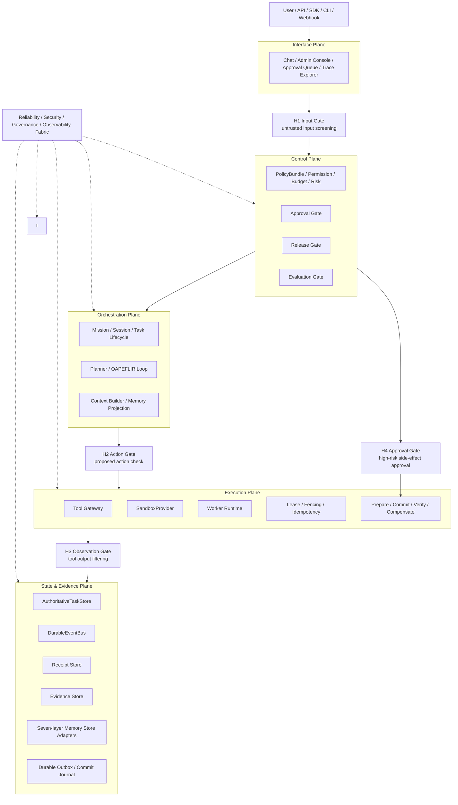
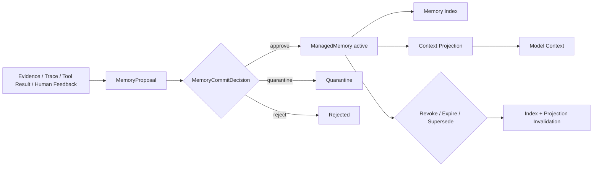

# Automatic Agent System — Agent Harness 改进方案 v1.9-Architecture-Release

| 字段 | 内容 |
|---|---|
| 文档版本 | v1.9-Architecture-Release |
| 日期 | 2026-05-26 |
| 基线版本 | `automatic_agent_system_harness_improvement_plan_v1_8_completed.md` |
| 适用系统 | Automatic Agent System / Automatic Agent Platform |
| 顶层架构 | Five Plane Architecture |
| 任务生命周期 | OAPEFLIR：Observe → Assess → Plan → Execute → Feedback → Learn → Improve → Release |
| 驱动方式 | Harness-driven：模型作为推理、生成、候选决策组件，不作为系统控制器 |
| 能力地图 | Agent Harness Engineering / ETCLOVG 作为能力成熟度地图，不替代 Five Plane |
| Memory 架构 | Seven-layer Memory Governance，通过 Memory Gateway 统一治理，不强制统一物理存储 |
| 本版目标 | 在 v1.8-RC 基础上完成 release 前收敛：统一版本引用、明确 release 类型、修正工程冻结条件、收敛 ADR 状态、补充首批验证场景建议，并保留真实代码扫描 / owner / CI / P0a shadow 的工程阻断项 |
| 发布结论 | **可以 release 为 v1.9 Architecture Review Release**；不可作为 Engineering Freeze Baseline 或 Production Governance Baseline。进入工程冻结前仍必须完成真实仓库扫描、真实 owner 绑定、CI 命令落地和 P0a shadow 路径验证 |

---

## 0. 一页结论

v1.8-RC 已经具备架构评审条件；v1.9 在此基础上完成 release 前收敛，修复版本一致性、ADR 状态、工程冻结条件、首批验证场景建议和 release 边界表述。

本版**可以正式 release 为 Architecture Review Release**，用于团队架构评审、工程排期、真实代码扫描和 P0a 影子链路启动；但**不能**作为 Engineering Freeze Baseline 或 Production Governance Baseline。冻结工程基线前必须完成真实仓库扫描、真实 owner 绑定、CI 命令落地、P0a shadow 路径跑通。

本版主要改进：

1. **代码映射不再伪装为事实**：Current Codebase Gap Matrix 明确区分 `已扫描确认 / 假设路径 / 待扫描确认 / 新增模块`，防止把目标设计误读为当前实现。
2. **TODO 增加真实执行字段**：所有 Canonical TODO 增加 `OwnerName / Reviewer / TargetStart / TargetEnd / IssueLink / VerifyCommandStatus`，未确定项统一标记 `TBD`，不再伪装为已分配。
3. **CI 命令契约化**：所有 verify command 明确分为 `existing / to_add / TBD`，避免出现“文档里有验收命令但仓库里不存在”的问题。
4. **P0b 再拆分**：P0b 拆成 `P0b-1 high-risk tool enforce`、`P0b-2 L4-L7 memory enforce`、`P0b-3 production release gate`、`P0b-4 H3 untrusted output enforce`、`P0b-5 minimal approval UI/API`。
5. **H1-lite 前移**：外部文本、文件、检索结果、第三方资料的 untrusted 标记与基础注入检测进入 P0b/P0c；H1-full 保持 P1。
6. **Release Gate 阈值具体化**：按场景定义 Golden / Security / Trajectory / Evidence / Cost 阈值；high/critical 任务的 Policy Compliance 与 Approval Compliance 必须满分。
7. **Cost/Latency 依赖修正**：P0c 只做 advisory；P1 才允许作为 release blocking gate。
8. **Receipt / Outbox 原子性补强**：高风险副作用 commit 前必须写入 `PrepareReceipt` 或 durable outbox record，避免“副作用已发生但证据层无记录”。
9. **Tool 可逆性进入风险决策**：`not_reversible` / `forward_fix_only` 等可逆性等级参与 risk resolution，不再只是 metadata。
10. **Memory Gateway 接口落地**：补充 `ManagedMemoryMinimal`、`MemoryProposal`、`MemoryProjection`、`MemoryCommitDecision`、`MemoryRevokeDecision`。
11. **Security & Privacy Baseline 补齐**：覆盖 secret、PII、cross-tenant isolation、retention、export/delete、restricted evidence access。
12. **增加三流图与系统边界图**：补充控制流、证据流、Memory 流和 Five Plane × Gate 总图，便于评审理解。
13. **首批业务场景展开**：论文调研 Agent、代码审查/测试失败分析 Agent 给出输入、工具、风险、Gate、Memory、Eval 和验收指标。
14. **TODO 去重**：Release Console、Memory Review Console 等拆成 backend/API 与 frontend/UI，使用唯一 Canonical TODO ID。

最终架构表达仍然不变：

```text
Automatic Agent System
= Five Plane Architecture
+ Harness-driven Runtime
+ OAPEFLIR Task Lifecycle
+ ETCLOVG Capability Maturity Map
+ Seven-layer Memory Governance
+ Trace-native Evaluation
+ Release / Evaluation / Governance Gate
```

### 0.1 v1.9 Release 声明

| 项 | 结论 |
|---|---|
| Release 名称 | Automatic Agent System — Agent Harness 改进方案 v1.9-Architecture-Release |
| Release 类型 | Architecture Review Release |
| 允许用途 | 架构评审、工程排期、真实代码扫描、P0a shadow 实施准备、首批业务场景基线评测准备 |
| 禁止用途 | 不得作为工程冻结基线、生产治理标准、生产发布门禁的唯一依据 |
| 仍阻断工程冻结的事项 | 真实代码扫描、真实 Owner/Reviewer/Issue、CI 命令落地、P0a shadow E2E、Eval baseline 校准 |
| 下一目标版本 | v2.0 Engineering Baseline Candidate，前提是完成所有工程冻结条件 |

---

## 1. v1.9 相比 v1.8-RC 的 release 前收敛

| 类别 | v1.8-RC 剩余问题 | v1.9 收敛方式 |
|---|---|---|
| 代码映射 | Gap Matrix 仍是“待扫描确认”的假设路径 | 增加 `MappingConfidence` 与 `ScanAction`，明确哪些是事实、哪些是待扫描 |
| TODO 执行 | Owner 是团队角色，不是真实负责人 | 增加 `OwnerName / Reviewer / TargetStart / TargetEnd / IssueLink`，未确定统一标记 TBD |
| 验收命令 | verify command 可能不存在 | 增加 `VerifyCommandStatus: existing / to_add / TBD` 与 CI Command Contract |
| TODO 重复 | Release Console、Memory Review Console 等重复 | 拆成 backend/API 与 frontend/UI，建立依赖关系 |
| P0 阶段 | P0b 仍过重 | 拆成 P0b-1 到 P0b-5，分批 enforce |
| H1 风险 | H1 Input Gate 放到 P1 过晚 | H1-lite 前移到 P0b/P0c，H1-full 保持 P1 |
| Evaluation 阈值 | release threshold 偏抽象 | 增加按场景的 blocking threshold 与 high-risk 满分项 |
| Cost/Latency | P0c Release Gate 依赖 P1 observability | P0c advisory，P1 blocking |
| Receipt 原子性 | receipt 写失败后的兜底不够底层 | 增加 durable outbox / commit journal 设计 |
| Tool rollback | 可逆性 metadata 未参与决策 | 增加 reversibility risk rule |
| Memory schema | Memory Gateway 接口偏概念 | 增加 ManagedMemoryMinimal 等最小接口 |
| 安全隐私 | L5/L6/L7 memory 与 trace privacy 不足 | 增加 Security & Privacy Baseline |
| 可读性 | 缺系统边界图和三流图 | 增加 Mermaid 架构图、控制流、证据流、Memory 流 |
| 业务落地 | Business Scenario Matrix 偏粗 | 展开首批两个场景的落地设计 |

---

## 2. 架构定位与 Non-goals

### 2.1 主架构仍是 Five Plane

```text
1. Interface Plane
2. Control Plane
3. Orchestration Plane
4. Execution Plane
5. State & Evidence Plane

+ Reliability / Security / Governance / Observability Fabric
```

### 2.2 OAPEFLIR 是任务生命周期

```text
Observe → Assess → Plan → Execute → Feedback → Learn → Improve → Release
```

Release 必须区分两类：

| Release 类型 | 含义 | 示例 | 是否需要 Release Gate |
|---|---|---|---|
| Mission Release | 单次任务产物交付、验收、归档 | 报告、PR 草稿、实验建议、预测辅助结论 | 需要任务级验收，不等同系统发布 |
| System Artifact Release | 系统能力版本发布 | prompt、tool schema、policy、workflow、model config、evaluator、sandbox config | 必须经过 EvalReport、Approval、Canary、RollbackPlan |

### 2.3 ETCLOVG 是能力地图，不是顶层架构

| ETCLOVG | 对应 Five Plane | 用途 |
|---|---|---|
| E Execution Environment & Sandbox | Execution Plane | sandbox、worker、lease、side-effect commit |
| T Tool Interface & Protocol | Execution + Control | tool gateway、schema、routing、permission、tool version |
| C Context & Memory Management | Orchestration + State & Evidence | seven-layer memory、projection、context drift |
| L Lifecycle & Orchestration | Orchestration Plane | mission/session/task lifecycle、多 agent 协同 |
| O Observability & Operations | State & Evidence + Fabric | trace、metrics、cost、latency、failure diagnosis |
| V Verification & Evaluation | Control + State & Evidence | readiness、trajectory eval、regression、release gate |
| G Governance & Security | Control + Fabric | policy、approval、identity、audit、security guardrail |

### 2.4 Non-goals

本次改造明确不做：

1. 不把 Five Plane 改成 ETCLOVG 七层。
2. 不一次性重构目录结构。
3. 不让模型直接执行副作用工具。
4. 不让模型直接 commit L4-L7 Memory。
5. 不把 Memory 当 Policy。
6. 不把 Evidence 当 Memory。
7. 不把 Context 当事实源。
8. 不把最终答案评分当完整 Agent 评测。
9. 不把 Tool Registry 等同于 Tool Gateway。
10. 不允许没有 EvalReport / RollbackPlan 的 System Artifact Release 进入生产。
11. 不在 P0 阶段强行完成全量 sandbox、全量 UI、全量自优化。
12. 不把文档 release 等同于运行时治理基线。
13. 不把本文件中的假设代码路径当作当前代码事实；必须经过仓库扫描确认。
14. 不把团队角色 owner 当作真实负责人；真实负责人必须在工程排期时补齐。

---

## 3. 系统边界图：Five Plane × Gate × Evidence



---

## 4. 术语表

| 术语 | 定义 |
|---|---|
| Harness | 包裹模型的执行控制系统，负责生命周期、工具、状态、证据、评测、治理与发布 |
| Plane | 顶层职责边界，用于划分系统控制、编排、执行、状态和接口职责 |
| Capability | 生产级 Agent 所需能力域，例如 Tool Gateway、Memory Governance、Trace-native Evaluation |
| Mission | 面向业务目标的一次完整任务单元，可以跨 session、跨 task、跨工具运行 |
| Session | 用户或系统与 Agent 的一次交互上下文，隶属于 Mission |
| Task | Mission 下可调度、可执行、可评测的子任务 |
| Receipt | 结构化执行凭证，记录 policy、approval、tool、memory、evaluation、release 等关键动作 |
| Evidence | 原始证据、工具结果、trace、日志、文件、评测结果等不可直接替代的事实材料 |
| Memory | 从 evidence、state、feedback 中提炼出的可复用知识、偏好、经验或摘要 |
| Context | 本次模型调用看到的投影，不是事实源 |
| Projection | 按权限、任务、预算、风险从 memory/evidence/state 中选择并压缩后的上下文视图 |
| PolicyBundle | Control Plane 中可执行策略的唯一权威版本对象 |
| Governance Memory | 治理经验、失败模式、policy proposal、eval case，不能替代 PolicyBundle |
| Release Artifact | 可版本发布的系统对象，如 prompt、tool schema、policy、workflow、model config、evaluator、sandbox config |
| Harness Lockfile | System Artifact Release 的不可变依赖锁定文件，用于可复现、灰度、回滚 |
| Durable Outbox | 在副作用动作前后记录可恢复事件的可靠写入缓冲，用于修复 receipt 写失败 |

---

## 5. 核心不变量 Invariants

这些不变量必须进入代码、测试和 review checklist：

1. 模型不能直接执行副作用工具。
2. 模型不能直接 commit L4-L7 Memory。
3. 工具输出不能绕过 H3 进入 Context 或 Memory。
4. 高风险动作不能绕过 H4 Approval。
5. System Artifact Release 不能绕过 EvalReport、Approval 和 RollbackPlan。
6. Receipt 不能缺少 `tenantId / traceId / missionId / schemaVersion / timestamp`。
7. PolicyBundle 是可执行策略的唯一权威来源。
8. L7 Governance / Experience / Evaluation Memory 只能存放 policy evidence、policy proposal、failure pattern、eval case 和 release 经验；不能替代 PolicyBundle。
9. Evidence 是原始证据；Memory 是证据派生资产；Context 是投影。
10. L1 Active Context Memory 是 projection output，不是 authoritative source。
11. Mission Memory 不能替代 AuthoritativeTaskStore。Mission 状态的权威来源是 `StateCommand / AuthoritativeTaskStore`；Mission Memory 只是对目标、约束、决策、摘要和经验的可复用表示。
12. 高风险副作用 commit 前必须至少写入 `PrepareReceipt` 或 durable outbox record。
13. `production_mutation + not_reversible` 默认 critical 且默认 block，除非 break-glass。
14. Revoked / expired / quarantined memory 不得进入 Context Projection。
15. 跨租户 memory、evidence、trace 默认不可见，除非显式授权。
16. P0c 阶段 cost / latency 只能作为 advisory；P1 以后才能作为 release blocking gate。

---

## 6. Current Codebase Gap Matrix / 当前代码映射

> 说明：本节不是代码事实审计结果，而是 v1.9 的工程扫描清单。所有 `MappingConfidence = 待扫描确认` 的条目必须通过仓库扫描、测试运行和 owner 确认后，才能进入工程实施基线。

### 6.1 映射状态定义

| 字段 | 取值 | 含义 |
|---|---|---|
| MappingConfidence | 已扫描确认 / 部分确认 / 假设路径 / 待扫描确认 / 新增模块 | 当前映射可信度 |
| ImplementationStatus | 已实现 / 部分实现 / 缺失 / mock / unknown | 当前实现状态 |
| MigrationMode | 包装 / 替换 / 新增 / 下沉 / 删除 / 保持 | 改造方式 |
| VerifyCommandStatus | existing / to_add / TBD | 验收命令是否已存在 |
| ReleaseBlocking | yes / no / conditional | 是否阻断工程冻结基线 |

### 6.2 Gap Matrix

| 目标能力 | 当前可能模块 | MappingConfidence | 当前状态 | 改造方式 | 目标模块 | Verify Command | VerifyCommandStatus | ReleaseBlocking |
|---|---|---:|---|---|---|---|---|---|
| Tool Registry | `src/tools/` | 待扫描确认 | unknown | 包装 | `src/execution/tool-gateway/` | `npm run test:tool-gateway` | to_add | yes |
| Policy Engine | `src/control/` | 待扫描确认 | unknown | 扩展 | `src/control/governance-hooks/` | `npm run test:policy-gate` | to_add | yes |
| Event Bus | `src/events/` | 待扫描确认 | unknown | 扩展 | `src/state/receipts/` | `npm run test:receipt-store` | to_add | yes |
| Task Store | `src/storage/` | 待扫描确认 | unknown | 扩展 | `src/state/authoritative-task-store/` | `npm run test:state-evidence` | to_add | yes |
| Memory | `src/memory/` | 待扫描确认 | unknown | facade 包装 | `src/state/memory-gateway/` | `npm run test:memory-gateway` | to_add | yes |
| Release | `src/release/` | 待扫描确认 | unknown | 新增/扩展 | `src/release/release-gate/` | `npm run test:release-gate` | to_add | yes |
| Evaluation | `src/evaluation/` | 待扫描确认 | unknown | 新增/扩展 | `src/evaluation/agent-harness/` | `npm run test:evaluation-gate` | to_add | conditional |
| Observability | `src/observability/` | 待扫描确认 | unknown | 扩展 | `src/observability/agent-trace/` | `npm run test:agent-trace` | to_add | conditional |
| Sandbox | `src/runtime/` / `src/execution/` | 待扫描确认 | unknown | 新增抽象 | `src/execution/sandbox/` | `npm run test:sandbox-provider` | to_add | no |
| Interface Console | `ui/` | 待扫描确认 | unknown | 新增 | `ui/admin-console/` | `npm run test:ui-admin-console` | to_add | conditional |
| CI boundary scan | `scripts/` / `.github/` | 待扫描确认 | unknown | 新增 | `scripts/architecture-boundary-scan.*` | `npm run lint:architecture-boundary` | to_add | yes |

### 6.3 必须补充的真实扫描输出

工程冻结前必须生成：

```text
docs_zh/reviews/current-codebase-gap-review-v1.9.md
```

该审查文档至少包含：

1. 真实目录树与模块清单。
2. 当前 Tool / Policy / Memory / Event / Release / Evaluation / Observability 实现状态。
3. 所有 direct tool import、direct memory write、direct release publish 的代码位置。
4. 当前 package.json 中已存在的 test/lint/build 命令。
5. 当前测试覆盖情况与缺失的 P0 gate 测试。
6. 改造风险、owner、预计工作量。

### 6.4 Current Codebase Gap Review 输出模板

真实仓库扫描报告必须是可复现产物，而不是人工口头确认。建议由 `npm run scan:current-codebase-gap` 生成 Markdown + JSON 两份结果：

```text
docs_zh/reviews/current-codebase-gap-review-v1.9.md
artifacts/current-codebase-gap-review-v1.9.json
```

JSON 最小结构：

```ts
export interface CodebaseGapReviewItem {
  capability: string;
  expectedPath: string;
  actualPaths: string[];
  implementationStatus: "implemented" | "partial" | "missing" | "mock" | "unknown";
  directBypassLocations: string[];
  testFiles: string[];
  packageScripts: string[];
  migrationMode: "wrap" | "replace" | "extend" | "new" | "remove" | "keep";
  migrationRisk: "low" | "medium" | "high" | "critical";
  estimatedEffort: "S" | "M" | "L" | "XL";
  ownerName?: string;
  reviewer?: string;
}
```

扫描至少覆盖：

1. `src/`、`tests/`、`ui/`、`scripts/`、`.github/`、`package.json`。
2. direct tool import / direct memory write / release bypass / policy bypass。
3. 当前已有 event bus、task store、memory、tool、policy、observability、release、evaluation 模块。
4. 当前测试命令、覆盖率命令、E2E 命令和 CI workflow。
5. 与 P0 TODO 对应的代码路径和测试路径是否存在。

**基线冻结规则：** 若 `MappingConfidence` 仍为 `待扫描确认`，该能力不得进入工程冻结基线，只能作为待办项进入排期。

---

## 7. CI Command Contract / 验收命令契约

### 7.1 命令状态定义

| 状态 | 含义 | 处理方式 |
|---|---|---|
| existing | 当前仓库已存在 | 可以直接作为验收命令 |
| to_add | 当前未确认存在，v1.9 要求新增 | 对应 TODO 必须创建脚本和测试集合 |
| TBD | 需要扫描仓库后确认 | 阻断工程基线冻结 |

### 7.2 P0 必需命令

| 命令 | 目标 | 当前状态 | 对应 TODO |
|---|---|---|---|
| `npm run lint:architecture-boundary` | 禁止 direct tool import / direct memory write / release bypass | to_add | CI-001 |
| `npm run scan:current-codebase-gap` | 生成真实代码映射报告 | to_add | DOC-014 |
| `npm run test:receipt-store` | 验证 receipt minimal/full schema 与持久化 | to_add | REC-001 |
| `npm run test:tool-gateway` | 验证 shadow/prepare/commit/compensation | to_add | TOOL-001 |
| `npm run test:policy-gate` | 验证 H2/H3/H4 与 H1-lite | to_add | GOV-001 |
| `npm run test:memory-gateway` | 验证 L4-L7 proposal-only、revoke、projection | to_add | MEM-001 |
| `npm run test:release-gate` | 验证 manifest、eval report、rollback plan | to_add | REL-001 |
| `npm run test:e2e:harness-p0b` | 验证 high-risk tool approval 与 side-effect receipt | to_add | E2E-001 |
| `npm run test:security-agent-harness` | 验证 prompt/tool/memory injection 基础样例 | to_add | SEC-001 |

### 7.3 CI Gate 原则

1. `to_add` 命令在工程基线冻结前必须进入 `package.json` 或 CI workflow。
2. `TBD` 命令不允许作为 release checklist 的通过项。
3. P0b enforce 之前，`lint:architecture-boundary` 必须至少能发现 bypass，但可以不 fail build。
4. P0c 之后，P0 blocking gate 的 bypass 必须 fail build。


### 7.4 package.json 脚本契约

P0a 前允许脚本处于 `to_add`；进入工程冻结基线前，以下脚本必须至少能运行并输出稳定报告：

```json
{
  "scripts": {
    "scan:current-codebase-gap": "node scripts/scan-current-codebase-gap.mjs",
    "lint:architecture-boundary": "node scripts/architecture-boundary-scan.mjs",
    "test:receipt-store": "node --test tests/state/receipts",
    "test:tool-gateway": "node --test tests/execution/tool-gateway",
    "test:policy-gate": "node --test tests/control/governance-hooks",
    "test:memory-gateway": "node --test tests/state/memory-gateway",
    "test:release-gate": "node --test tests/release/release-gate",
    "test:evaluation-gate": "node --test tests/evaluation/agent-harness",
    "test:security-agent-harness": "node --test tests/security/agent-harness",
    "test:e2e:harness-p0b": "node --test tests/e2e/harness-p0b"
  }
}
```

脚本输出要求：

| 脚本 | P0a 输出 | P0b/P0c 输出 | 是否允许空实现 |
|---|---|---|---|
| `scan:current-codebase-gap` | gap report | gap report + blocking summary | 不允许 |
| `lint:architecture-boundary` | detect-only report | fail high-risk bypass | 不允许 |
| `test:receipt-store` | minimal receipt tests | full receipt + outbox tests | 不允许 |
| `test:tool-gateway` | shadow adapter tests | prepare/commit/compensate tests | 不允许 |
| `test:security-agent-harness` | sample suite exists | high-risk samples blocking | 不允许 |

禁止用“脚本存在但不执行真实断言”的方式满足验收。

---

## 8. Minimal P0 Contract / P0 最小接口契约

### 8.1 P0a-0 文档冻结契约

必须冻结以下接口草案：

```text
HarnessCapabilityDomain
ArchitecturePlane
BaseReceiptMinimal
ToolGatewayShadow
PolicyDryRunDecision
MemoryProposal
ReleaseManifestDraft
ActionRiskInput
```

### 8.2 BaseReceiptMinimal

```ts
export interface BaseReceiptMinimal {
  receiptId: string;
  schemaVersion: string;
  tenantId: string;
  missionId: string;
  sessionId?: string;
  taskId?: string;
  traceId: string;
  actorId: string;
  actionType: string;
  status: "success" | "failed" | "blocked" | "requires_approval" | "prepared" | "committed";
  timestamp: string;
  inputHash?: string;
  outputHash?: string;
  evidenceIds: string[];
}
```

### 8.3 BaseReceiptFull

```ts
export interface BaseReceiptFull extends BaseReceiptMinimal {
  parentReceiptId?: string;
  causalityId: string;
  eventSequence: number;

  canonicalizationVersion: string;
  hashAlgorithm: "sha256";

  capability: HarnessCapabilityDomain;
  plane: ArchitecturePlane;

  policyBundleVersion?: string;
  approvalPolicyId?: string;
  approvalId?: string;
  leaseId?: string;
  fencingToken?: string;
  idempotencyKey?: string;

  redactedPayloadRef?: string;
  payloadEncryptionKeyRef?: string;
  accessPolicyId: string;
  retentionPolicyId: string;

  replaySafety: "safe_to_replay" | "replay_with_mock_only" | "not_replayable";
}
```

### 8.4 PolicyDryRunDecision

```ts
export interface PolicyDryRunDecision {
  decisionId: string;
  traceId: string;
  missionId: string;
  tenantId: string;
  actorId: string;
  action: string;
  finalRisk: RiskLevel;
  wouldAllow: boolean;
  wouldRequireApproval: boolean;
  blockingReasons: string[];
  advisoryWarnings: string[];
  policyBundleVersion: string;
}
```

### 8.5 ReleaseManifestDraft

```ts
export interface ReleaseManifestDraft {
  releaseId: string;
  artifactType: "agent" | "workflow" | "prompt" | "tool" | "policy" | "model" | "evaluator" | "sandbox_config" | "memory_schema";
  artifactId: string;
  artifactVersion: string;
  dependencies: Record<string, string>;
  evalReportId?: string;
  rollbackPlanId?: string;
  createdBy: string;
  createdAt: string;
}
```

---

## 9. Rollout Mode Transition Criteria

### 9.1 Rollout Mode 定义

| 模式 | 含义 | 是否阻断 |
|---|---|---|
| shadow | 新链路旁路观察，不影响原执行 | 否 |
| dry-run | 新链路产生决策，但只报警不阻断 | 否 |
| enforce | 新链路正式阻断不合规动作 | 是 |
| fail-closed | 新链路不可用时默认拒绝高风险动作 | 是，高风险默认拒绝 |

### 9.2 切换标准

| Gate | Shadow → Dry-run | Dry-run → Enforce | Enforce → Fail-closed |
|---|---|---|---|
| ToolGateway | 100% tool call 有 shadow receipt | high-risk tool dry-run 7 天无漏拦截；误拦截 < 2% | high/critical tool 的 policy/approval/evidence 全覆盖 |
| H1-lite | 外部输入 100% 标记 trust tier | 基础注入样例检出率 ≥ 90%，误报可人工放行 | high-risk untrusted input 无法绕过 H1-lite |
| Policy Gate | 100% action 有 dry-run decision | high/critical 漏拦截 0；误拦截 < 2% | policy service 不可用时 high/critical 默认拒绝 |
| Memory Gate | L4-L7 direct write 100% 可发现 | L4-L7 proposal path 覆盖 100% | direct write 被 runtime 和 CI 双重阻断 |
| Release Gate | 100% release 生成 manifest draft | prod release 100% 有 eval report + rollback plan | release gate 不可用时禁止 production release |
| Receipt | 关键动作 100% 生成 minimal receipt | high-risk 动作有 prepare/commit receipt | receipt/outbox 不可用时禁止 high-risk commit |

---

## 10. 统一风险模型与 Action Risk Resolution Matrix

### 10.1 输入维度

```ts
export type RiskLevel = "low" | "medium" | "high" | "critical";
export type SideEffectLevel = "none" | "read_only" | "write_internal" | "write_external" | "production_mutation";
export type DataSensitivity = "public" | "internal" | "confidential" | "restricted";
export type TargetEnvironment = "local" | "dev" | "staging" | "prod";
export type ApprovalLevel = "none" | "single_reviewer" | "team_lead" | "security_admin" | "multi_party" | "break_glass";
export type Reversibility = "automatic_rollback" | "manual_repair" | "forward_fix_only" | "not_reversible";
```

### 10.2 finalRisk 计算规则

```text
finalRisk = max(
  modelRisk,
  toolRisk,
  dataRisk,
  environmentRisk,
  sideEffectRisk,
  policyRisk,
  reversibilityRisk,
  confidenceRisk
)
```

任何一个维度为 `critical`，最终风险不得低于 `critical`。任何一个维度为 `restricted data + prod + write_external/production_mutation`，最终风险不得低于 `critical`。

### 10.3 Action Risk Resolution Matrix

| sideEffectLevel | dataSensitivity | targetEnv | reversibility | 默认 riskLevel | 默认 Gate |
|---|---|---|---|---|---|
| none | public/internal | local/dev | N/A | low | H1/H2-lite + receipt |
| read_only | internal | dev/staging | N/A | low/medium | H2 + receipt |
| read_only | confidential | prod | N/A | medium | H2 + access policy + receipt |
| write_internal | internal | staging | automatic_rollback | medium | H2 + idempotency + receipt |
| write_internal | confidential | prod | automatic_rollback/manual_repair | high | H2 + H4 + prepare/commit |
| write_external | confidential | prod | manual_repair/forward_fix_only | high/critical | H2 + H4 + approval + rollback/repair owner |
| production_mutation | any | prod | automatic_rollback | critical | H2 + H4 + multi-party approval + prepare/commit/verify |
| production_mutation | any | prod | not_reversible | critical | default block；仅 break-glass |
| any write | restricted | prod | any | critical | default block；security admin / multi-party |

### 10.4 Tool 可逆性风险规则

| reversibility | high-risk prod 自动执行策略 |
|---|---|
| automatic_rollback | 可审批后执行，必须注册 rollback plan |
| manual_repair | 必须 H4 + repair owner + repair runbook |
| forward_fix_only | critical，默认不自动执行；需要多方审批 |
| not_reversible | 默认禁止；仅 break-glass 且必须 incident 记录 |

---

## 11. Tool Gateway 详细设计

### 11.1 Tool Gateway 目标

Tool Gateway 是 Execution Plane 与 Control Plane 的交界面，不是普通 Tool Registry。

它必须统一处理：

```text
tool schema validation
permission check
policy check
approval check
risk resolution
idempotency
lease / fencing
prepare / commit / verify
compensation / rollback
trace capture
evidence and receipt write
mock / replay
cost / latency accounting
```

### 11.2 调用链

```text
Agent / Planner proposes action
→ H2 Action Gate
→ ToolGateway.prepareToolAction()
→ Schema / Permission / Policy / Risk / Idempotency / Lease
→ H4 Approval if required
→ Durable Outbox / PrepareReceipt
→ ToolGateway.commitToolAction()
→ Tool execution
→ ToolGateway.verifyToolAction()
→ H3 Observation Gate
→ CommitReceipt / Evidence / Trace
→ Compensation or rollback if needed
```

### 11.3 Prepare / Commit / Verify / Compensate 接口

```ts
export interface ToolPrepareInput {
  missionId: string;
  sessionId?: string;
  taskId?: string;
  tenantId: string;
  actorId: string;
  toolName: string;
  toolVersion?: string;
  arguments: unknown;
  sideEffectLevel: SideEffectLevel;
  dataSensitivity: DataSensitivity;
  targetEnv: TargetEnvironment;
  proposedBy: "model" | "human" | "system";
}

export interface ToolPrepareResult {
  preparedActionId: string;
  status: "prepared" | "blocked" | "requires_approval";
  finalRisk: RiskLevel;
  requiredApprovalId?: string;
  idempotencyKey: string;
  leaseId?: string;
  fencingToken?: string;
  estimatedBlastRadius: "none" | "low" | "medium" | "high" | "critical";
  compensationPlanId?: string;
  receiptId: string;
}

export interface ToolCommitInput {
  preparedActionId: string;
  approvalId?: string;
  fencingToken?: string;
  idempotencyKey: string;
}

export interface ToolCommitResult {
  status: "committed" | "failed" | "partial" | "blocked";
  output?: unknown;
  receiptId: string;
  evidenceIds: string[];
  compensationRequired: boolean;
}

export interface ToolCompensationPlan {
  compensationPlanId: string;
  preparedActionId: string;
  supported: boolean;
  compensationType: "automatic_rollback" | "manual_repair" | "forward_fix_only" | "not_reversible";
  repairOwner?: string;
  requiredEvidenceIds: string[];
  runbookRef?: string;
}
```

### 11.4 ToolRiskMetadata 必填契约

所有可被 Agent 调用的工具必须声明风险元数据。缺失风险元数据的工具只能在 shadow / dry-run 中出现，不允许进入 production enforce。

```ts
export interface ToolRiskMetadata {
  toolName: string;
  toolVersion: string;
  sideEffectLevel: SideEffectLevel;
  targetEnvironments: TargetEnvironment[];
  allowedDataSensitivity: DataSensitivity[];
  reversibility: "automatic_rollback" | "manual_repair" | "forward_fix_only" | "not_reversible";
  rollbackPlanRequired: boolean;
  compensationSupported: boolean;
  defaultApprovalLevel: "none" | "single_human" | "two_person" | "security_admin" | "break_glass_only";
  replaySafety: "safe_to_replay" | "replay_with_mock_only" | "not_replayable";
  idempotencyRequired: boolean;
  leaseRequired: boolean;
  networkAccess: "none" | "internal_only" | "external";
  secretAccess: "none" | "scoped" | "privileged";
}
```

风险决策规则：

| 条件 | 默认处理 |
|---|---|
| `production_mutation + not_reversible` | `critical`，默认 block，除非 break-glass |
| `write_external + forward_fix_only` | `high/critical`，必须 H4 + manual approval |
| `secretAccess = privileged` | 至少 `high`，必须最小权限 token + audit |
| `replaySafety = not_replayable` | 禁止自动 replay，只允许 mock replay / manual repair |
| 缺失 ToolRiskMetadata | production 禁止执行 |

### 11.5 Partial Failure 处理

| 状态 | 处理 |
|---|---|
| prepare failed | 不执行副作用，写 PrepareReceipt failed |
| approval denied | 不执行副作用，写 ApprovalReceipt denied |
| commit partial | 写 PartialCommitReceipt，进入 repair queue |
| commit success but verify failed | 写 VerifyReceipt failed，触发 compensation / manual repair |
| side-effect occurred but commit receipt missing | 通过 durable outbox / commit journal repair |
| compensation failed | 升级 incident，进入 manual repair |

### 11.6 Durable Outbox / Commit Journal

高风险副作用执行顺序必须是：

```text
write PrepareReceipt or DurableOutboxRecord
→ commit side effect
→ write CommitReceipt
→ verify side effect
→ write VerifyReceipt
→ repair if any receipt missing
```

不允许：

```text
commit side effect
→ best effort write receipt
```

否则会出现副作用已发生但 State & Evidence Plane 无记录的不可接受状态。


### 11.7 Transactional Outbox 事务边界

P0b 默认采用 transactional outbox，而不是 best-effort log。

**强制顺序：**

```text
BEGIN TRANSACTION
  write StateCommand(preparing)
  write PrepareReceipt or DurableOutboxRecord
COMMIT
commit external side effect with idempotencyKey
BEGIN TRANSACTION
  write CommitReceipt
  update StateCommand(committed)
COMMIT
verify side effect
write VerifyReceipt
```

异常处理：

| 异常 | 处理 |
|---|---|
| PrepareReceipt / outbox 写失败 | 禁止 high-risk commit |
| 外部副作用 commit 超时 | 使用 idempotencyKey 查询最终状态，禁止盲重试 |
| CommitReceipt 写失败 | repair worker 从 outbox 重建 |
| verify 失败 | 按 ToolCompensationPlan 进入 rollback / manual repair |
| State Store 不可用 | fail closed；critical break-glass 需 local durable emergency log |

repair worker 幂等键：`tenantId + preparedActionId + idempotencyKey + toolVersion`。

---

## 12. Governance Hooks 与 Trust Tier

### 12.1 H1/H2/H3/H4 定义

| Hook | 位置 | 职责 | P0/P1 策略 |
|---|---|---|---|
| H1 Input Gate | 输入进入模型前 | untrusted input 标记、基础 injection 检测、敏感信息识别 | H1-lite 进入 P0b/P0c；H1-full P1 |
| H2 Action Gate | 模型提出 action 后、执行前 | 工具权限、参数、policy、risk、approval 判断 | P0b enforce high-risk |
| H3 Observation Gate | 工具输出进入 context/memory 前 | redaction、quarantine、untrusted label、summarize-only | P0b/P0c enforce untrusted output |
| H4 Approval Gate | 高风险副作用提交前 | 人工审批、多方审批、break-glass | P0b enforce critical/high |

### 12.2 Trust Tier

| 来源 | 默认 Trust Tier | Gate |
|---|---|---|
| 用户输入 | untrusted | H1-lite |
| 外部网页 / PDF / 论文 / 检索结果 | untrusted | H1-lite + H3 when re-entering context |
| 第三方工具输出 | untrusted | H3 |
| 内部只读结构化系统 | controlled | H3-lite + schema validation |
| Control Plane policy decision | trusted-control | receipt，无需 H1/H3 |
| State & Evidence authoritative state | trusted-state | access policy + receipt |
| Human approved release artifact | trusted-artifact | ReleaseGate + audit |

### 12.3 ObservationGateDecision

```ts
export type ObservationGateDecision =
  | "allow"
  | "allow_with_redaction"
  | "allow_with_untrusted_label"
  | "summarize_only"
  | "quarantine"
  | "block";
```

H3 不应只有 allow/block。对研究、代码、日志场景，`allow_with_untrusted_label` 和 `summarize_only` 非常重要，可以减少误拦截。

### 12.4 H1-lite 最小测试集

H1-lite 进入 P0b/P0c 后，必须有可运行样例集。建议目录：

```text
tests/security/agent-harness/h1-lite/
├── prompt-injection.md
├── tool-injection.md
├── retrieved-doc-injection.md
├── pdf-injection.md
├── log-injection.md
├── code-comment-injection.md
└── benign-samples.md
```

最小覆盖：

| 样例类型 | 目标 | P0 阈值 |
|---|---|---:|
| 用户输入注入 | 标记 untrusted / risk | ≥ 90% 检出 |
| 检索内容注入 | 禁止作为系统指令执行 | 100% 不执行 |
| PDF / 论文注入 | 只作为引用内容处理 | 100% 标记 untrusted |
| 日志注入 | 不允许触发工具动作 | 100% 不执行 |
| benign samples | 控制误报 | false positive ≤ 10% 起步，P1 继续校准 |

H1-lite 的输出不是简单 block，而是生成 `InputTrustLabel`：

```ts
export interface InputTrustLabel {
  sourceId: string;
  trustTier: "untrusted" | "controlled" | "trusted-state";
  detectedRisks: string[];
  allowedUse: "quote_only" | "summarize_only" | "context_with_label" | "block";
  receiptId: string;
}
```

---

## 13. Seven-layer Memory Gateway 修正版

### 13.1 七层 Memory

| 层级 | 名称 | 作用 | 写入策略 |
|---|---|---|---|
| L1 | Active Context Memory | 当前模型调用看到的上下文投影 | 由 Context Builder 动态生成，不作为 source |
| L2 | Task Working Memory | 单个 task 内临时工作状态 | 可自动写，必须 trace |
| L3 | Session Memory | 一个 session 内上下文连续性 | 可自动维护，session scope |
| L4 | Mission Memory | mission 目标、约束、关键决策摘要 | 模型只能 propose，不能覆盖 AuthoritativeTaskStore |
| L5 | Project / Domain Memory | 项目知识、领域知识、技术结论、业务规则 | 需 evidence、version、conflict check |
| L6 | User / Team Preference Memory | 用户偏好、团队规范、工作流习惯 | 需隐私、权限、可查看/删除 |
| L7 | Governance / Experience / Evaluation Memory | 失败模式、eval case、policy proposal、release 经验 | 不能替代 PolicyBundle，需 Release/Eval 约束 |

### 13.2 Memory / Policy / Evidence / Context 边界

| 对象 | 归属 | 是否权威 | 说明 |
|---|---|---|---|
| Evidence | State & Evidence Plane | 原始证据权威 | 工具结果、trace、日志、文件、评测输出 |
| AuthoritativeTaskStore | State & Evidence Plane | mission/task 状态权威 | StateCommand 和任务状态真源 |
| Memory | State & Evidence Plane + Memory Gateway | 派生知识源 | 在其 scope、version、status、evidence 和 policy 允许范围内可使用；不能覆盖 Evidence、PolicyBundle 或 Authoritative State |
| Context | Orchestration Plane | 非权威 | 当前模型调用投影 |
| PolicyBundle | Control Plane | 策略权威 | 可执行策略的唯一来源 |

### 13.3 ManagedMemoryMinimal

```ts
export interface ManagedMemoryMinimal {
  memoryId: string;
  layer: "L1" | "L2" | "L3" | "L4" | "L5" | "L6" | "L7";
  tenantId: string;
  scope: "task" | "session" | "mission" | "project" | "domain" | "user" | "team" | "organization" | "governance";
  status: "proposed" | "active" | "quarantined" | "revoked" | "expired" | "superseded";
  subject: string;
  contentRef: string;
  sourceEvidenceIds: string[];
  sourceTraceIds: string[];
  confidence: number;
  sensitivity: DataSensitivity;
  createdBy: "model" | "human" | "system";
  approvedBy?: string;
  validFrom: string;
  validUntil?: string;
  version: number;
  supersedes?: string[];
  conflictSet?: string[];
  accessPolicyId: string;
  retentionPolicyId: string;
}
```

### 13.4 MemoryProposal / Commit / Revoke

```ts
export interface MemoryProposal {
  proposalId: string;
  missionId: string;
  tenantId: string;
  actorId: string;
  proposedLayer: ManagedMemoryMinimal["layer"];
  proposedScope: ManagedMemoryMinimal["scope"];
  contentRef: string;
  sourceEvidenceIds: string[];
  sourceTraceIds: string[];
  confidence: number;
  sensitivity: DataSensitivity;
  rationale: string;
}

export interface MemoryCommitDecision {
  decisionId: string;
  proposalId: string;
  decision: "approve" | "reject" | "quarantine" | "require_more_evidence";
  committedMemoryId?: string;
  approvalId?: string;
  reasons: string[];
}

export interface MemoryRevokeDecision {
  decisionId: string;
  memoryId: string;
  decision: "revoke" | "expire" | "supersede" | "keep_active";
  reason: string;
  projectionInvalidationRequired: boolean;
  indexInvalidationRequired: boolean;
}
```

### 13.5 MemoryProjection

```ts
export interface MemoryProjection {
  projectionId: string;
  missionId: string;
  sessionId?: string;
  taskId?: string;
  tenantId: string;
  allowedLayers: ManagedMemoryMinimal["layer"][];
  memoryIds: string[];
  evidenceIds: string[];
  tokenBudget: number;
  redactionApplied: boolean;
  projectionHash: string;
  createdAt: string;
}
```

### 13.6 Memory Resolution 规则

不使用单一全局读取顺序。按冲突类型解决：

| 冲突类型 | 优先级 |
|---|---|
| 安全 / 合规 / 权限 | Control Plane PolicyBundle 是唯一可执行权威；L7 只提供证据和候选 |
| Mission 状态 | AuthoritativeTaskStore > L4 Mission Memory > L3 Session > L2 Task |
| 项目 / 领域事实 | L5 Project / Domain > L3 Session > L2 Task |
| 用户 / 团队偏好 | L6 只影响格式、风格、工作流偏好，不能覆盖 L5 事实或 PolicyBundle |
| 当前任务临时假设 | L2 只能作为 hypothesis，不能覆盖 L4/L5 |
| 模型上下文 | L1 是 projection output，不是 source |

### 13.7 Memory Flow



---

## 14. Release Gate 与 Harness Lockfile

### 14.1 AgentReleaseManifest / Harness Lockfile

```yaml
releaseId: agent-release-2026-05-26-001
artifactType: agent
agentVersion: v1.9.0
promptVersion: prompt-2026-05-21
modelConfigVersion: modelcfg-2026-05-20
toolRegistryVersion: tools-2026-05-23
policyBundleVersion: policy-2026-05-24
workflowVersion: workflow-2026-05-22
contextBuilderVersion: ctx-2026-05-19
memorySchemaVersion: mem-2026-05-26
evaluatorVersion: eval-2026-05-25
sandboxConfigVersion: sandbox-2026-05-18
evalDatasetVersion: evalset-2026-05-25
rollbackTarget: agent-release-2026-05-20-003
canonicalizationVersion: manifest-canon-v1
hashAlgorithm: sha256
hash: sha256:...
```

### 14.2 Canonical Serialization Spec

ReleaseManifest hash 必须可复现：

1. 所有 key 按字典序排序。
2. 时间使用 ISO-8601 UTC。
3. 空字段不参与 hash。
4. 数组按稳定排序规则排序。
5. 所有依赖版本使用不可变 version id 或 digest。
6. canonicalizationVersion 变更必须触发 manifest rehash。

### 14.3 Release Gate 检查

| 检查项 | P0c | P1 |
|---|---|---|
| Manifest 完整性 | blocking | blocking |
| EvalReportId | blocking | blocking |
| RollbackPlanId | blocking | blocking |
| Policy compatibility | blocking | blocking |
| Tool schema compatibility | blocking | blocking |
| Security eval | blocking for high/critical | blocking |
| Cost/Latency | advisory | blocking when budget defined |
| Canary plan | advisory | blocking for production |
| Human approval | high/critical blocking | high/critical blocking |

---

## 15. Evaluation Dataset and Metric Design

### 15.1 Eval Set 类型

| Eval Set | 用途 | P0/P1 |
|---|---|---|
| Golden Tasks | 回归稳定性 | P0c-lite |
| Adversarial Tasks | prompt/tool/memory injection | P0c-lite |
| Long-horizon Tasks | context drift、memory、lifecycle | P1 |
| Business Scenario Tasks | 研究、代码、测试、实验、YONO | P0c/P1 分场景建设 |

### 15.2 Trajectory Rubric

| 维度 | 分值 | high/critical 是否必须满分 |
|---|---:|---|
| Tool selection correctness | 5 | 否 |
| Tool argument correctness | 5 | 否 |
| Policy compliance | 5 | 是 |
| Approval compliance | 5 | 是 |
| Evidence usage | 5 | 关键任务 ≥ 4 |
| Context usage | 5 | 否 |
| Cost / latency discipline | 5 | P0c advisory，P1 可 blocking |
| Final task success | 5 | 按场景定义 |
| 总分 | 40 | high/critical 最低 34，且 policy/approval 满分 |

### 15.3 Release Blocking Threshold

| 场景 | Golden Success | Security | Trajectory | Evidence Usage | Cost / Latency |
|---|---:|---:|---:|---:|---:|
| 论文调研 Agent | 不低于 baseline - 3% | injection 样例阻断率 100% | ≥ 32/40 | ≥ 4/5 | P0c advisory；P1 P95 不超 20% |
| 代码审查 Agent | 不低于 baseline - 2% | 危险命令阻断率 100% | ≥ 34/40 | ≥ 3/5 | P0c advisory；P1 P95 不超 20% |
| 测试失败分析 Agent | 不低于 baseline - 3% | 日志注入阻断率 100% | ≥ 32/40 | ≥ 4/5 | P0c advisory；P1 P95 不超 20% |
| 高风险工具动作 | 不允许 policy/approval 失败 | 100% | policy/approval 必须满分 | N/A | N/A |
| System Artifact Release | 不低于 baseline - threshold | security blocking 必须通过 | 关键路径不退化 | eval report 必须引用 evidence | P0c advisory；P1 可 blocking |

### 15.4 LLM Judge 校准

1. LLM judge 不能单独作为 high/critical blocking 的唯一依据。
2. high/critical 场景必须有 rule-based evaluator 或人工复核。
3. LLM judge 与人工一致率低于 80% 时，不得作为 blocking evaluator。
4. 每个 evaluator 必须有 version、prompt/config、sample audit record。

### 15.5 Baseline Calibration Protocol

15.3 中的阈值是 **initial threshold**，不得在未校准时直接作为长期生产阈值。首次进入工程基线前必须完成 baseline eval run：

1. 选择一个冻结 Harness Lockfile 作为 baseline。
2. 每个首批场景至少准备：Golden ≥ 50、Adversarial ≥ 30、Benign ≥ 30、Long-horizon ≥ 10。
3. 记录 final answer、trajectory、policy、approval、evidence、cost、latency。
4. LLM judge 必须抽样人工复核；一致率低于 80% 不得作为 blocking evaluator。
5. 校准后的阈值写入 `EvalThresholdVersion`，并由 Release Gate 引用。

```ts
export interface EvalThresholdVersion {
  thresholdVersion: string;
  scenario: string;
  baselineReleaseId: string;
  evalDatasetVersion: string;
  goldenMinSuccessDelta: number;
  trajectoryMinScore: number;
  securityRequiredPassRate: number;
  evidenceMinScore?: number;
  costLatencyMode: "advisory" | "blocking";
  approvedBy: string;
}
```

### 15.6 Eval Dataset 版本管理

Eval dataset 必须版本化，不得以“当前目录内容”隐式作为发布依据。

```text
evals/
├── golden/
├── adversarial/
├── long-horizon/
├── business-scenarios/
└── evalset.lock.yaml
```

`evalset.lock.yaml` 至少记录样例数量、hash、owner、reviewer、适用场景、是否 blocking。

---

## 16. Security & Privacy Baseline

### 16.1 数据与密钥

| 项 | 要求 |
|---|---|
| Secret handling | secret 不得进入 model context；工具只拿最小权限 token |
| PII / sensitive data | 进入 context 前按 sensitivity 执行 redaction 或 access check |
| payload encryption | restricted payload 必须有 `payloadEncryptionKeyRef` |
| restricted evidence access | 需要 `accessPolicyId` 与审计 receipt |
| cross-tenant isolation | 默认 deny；tenantId 缺失时 fail closed |

### 16.2 Memory Privacy

| Memory 层 | 隐私要求 |
|---|---|
| L5 Project / Domain | 需要项目/团队 ACL，支持 retention policy |
| L6 User / Team Preference | 用户可查看、修改、删除；敏感偏好不得跨任务滥用 |
| L7 Governance / Evaluation | 可用于系统改进，但不得泄露原始租户数据 |

### 16.3 Export / Delete / Revoke

必须支持：

```text
memory export
memory delete / revoke
trace/evidence retention policy
audit log retention
index invalidation
projection rebuild
```

### 16.4 Break-glass

生产紧急场景允许 break-glass，但必须满足：

1. 仅授权角色可触发。
2. 必须填写原因。
3. 必须生成 BreakGlassReceipt。
4. 必须在事后进入 Incident Review。
5. break-glass 不得绕过 trace/evidence 写入。


### 16.5 Security Gate 组件化落地

Security & Privacy Baseline 必须落到可测试组件，不应只保留原则。

| 组件 | 阶段 | 职责 | 验收 |
|---|---|---|---|
| SecretScanner | P0c | 防止 secret 进入 context / memory / evidence 展示层 | secret sample 100% redacted |
| PIIRedactor | P0c/P1 | 对 PII 和敏感字段执行 redaction / masking | P0 样例集通过，P1 接真实 schema |
| TenantIsolationGuard | P0b/P0c | tenantId 缺失 fail closed，跨租户访问禁止 | cross-tenant adversarial tests 0 泄露 |
| EvidenceAccessPolicy | P0c | restricted evidence 访问必须校验 accessPolicyId | restricted trace access 100% receipt |
| RetentionPolicyEnforcer | P1 | trace/evidence/memory 到期处理 | retention test + audit log |
| MemoryExportDeleteWorkflow | P1 | L6/L5 memory 查看、导出、删除、撤销 | user/team scope tests |

P0c 起，restricted payload 不得直接进入模型上下文；只能进入 redacted projection 或 quote-only projection。

---

## 17. Interface Plane Control Console RBAC / Audit Matrix

| Console | 操作 | 允许角色 | 二次审批 | Receipt |
|---|---|---|---|---|
| Approval Console | Approve high-risk tool | Team Lead / Admin | critical 需要 | ApprovalReceipt |
| Approval Console | Break-glass approve | Security Admin + Release Manager | 必须 | BreakGlassReceipt |
| Memory Review Console | Approve L5/L6/L7 memory | Domain Owner / Team Lead | sensitive 需要 | MemoryWriteReceipt |
| Memory Review Console | Revoke memory | User / Domain Owner / Admin | critical memory 需要 | MemoryRevokeReceipt |
| Release Console | Publish PolicyBundle | Policy Admin | 必须 | ReleaseReceipt |
| Release Console | Rollback release | Release Manager | critical 需要 | ReleaseReceipt |
| Trace Explorer | View restricted trace | Security / Admin | 按租户策略 | AuditReceipt |
| Policy Console | Run policy dry-run | Policy Admin / Developer | 否 | PolicyDecisionReceipt |
| Evaluation Dashboard | Approve eval threshold | Eval Owner | high-risk 需要 | EvaluationReceipt |
| Incident Console | Close incident | Incident Owner | high/critical 需要 | IncidentReceipt |

---

## 18. Operational Runbooks

### 18.1 Gate 误拦截

```text
1. 标记 false_positive candidate。
2. 收集 PolicyDecisionReceipt、ActionRiskInput、Trace。
3. 进入 Policy Dry-run Review。
4. 若确认误拦截，调整 policy proposal。
5. policy proposal 进入 Release Gate，不直接生效。
```

### 18.2 Memory 污染

```text
1. quarantine suspected memory。
2. revoke projection and index。
3. 查找 sourceEvidenceIds / sourceTraceIds。
4. 回放受影响 mission。
5. 生成 MemoryContaminationIncident。
6. 必要时发布 MemorySchema/Policy 修复版本。
```

### 18.3 Release 回滚

```text
1. Release Gate 或 online monitor 触发 rollback。
2. 读取 Harness Lockfile。
3. 校验 rollbackTarget。
4. 执行 canary rollback。
5. 监控 golden/security/latency 指标。
6. 生成 RollbackReceipt 与 postmortem。
```

### 18.4 Tool partial failure

```text
1. 读取 PartialCommitReceipt。
2. 查找 ToolCompensationPlan。
3. 如果 automatic_rollback，执行 rollback 并 verify。
4. 如果 manual_repair，派发 repair owner。
5. 如果 forward_fix_only，升级 incident。
6. 如果 not_reversible，升级 critical incident。
```

### 18.5 Receipt / Evidence 写失败

```text
1. 如果是 high-risk action，commit 前必须已有 PrepareReceipt 或 durable outbox record。
2. CommitReceipt 写失败时，repair worker 从 outbox / commit journal 重建。
3. 若 outbox 不可用，禁止 high-risk commit。
4. 已发生副作用但 receipt 缺失时，立即生成 IncidentReceipt；若 State Store 不可用，则写 local durable emergency log，恢复后补录。
```

---

## 19. P0 / P1 / P2 路线图

### 19.1 P0a：只读打点与边界扫描

| 子阶段 | 内容 | 目标 |
|---|---|---|
| P0a-0 | 文档冻结、schema 草案、接口 contract | 统一团队理解 |
| P0a-1 | traceId、missionId、tenantId、BaseReceiptMinimal shadow | 不改变执行行为 |
| P0a-2 | direct tool import、direct memory write、release bypass scan | 先发现问题 |
| P0a-3 | ToolGateway shadow、Policy dry-run、Capability coverage | 输出差距报告 |

### 19.2 P0b：分批 enforce

| 子阶段 | 内容 | 目标 |
|---|---|---|
| P0b-1 | enforce high-risk tool + H4 approval | 高风险工具不能绕过审批 |
| P0b-2 | enforce L4-L7 memory proposal-only | 长期 memory 不能直写 |
| P0b-3 | enforce production release gate | 生产发布必须有 manifest/eval/rollback |
| P0b-4 | enforce H3 for untrusted tool output | 不可信工具输出不能直接进 context/memory |
| P0b-5 | minimal approval UI/API | 人能处理 H4 审批 |

### 19.3 P0c：闭环与最小评测

| 内容 | 目标 |
|---|---|
| H1-lite injection detection | 外部输入基本防注入 |
| ReleaseManifest canonical hash | 发布可复现 |
| EvalReport minimal | release 有最低评测依据 |
| Memory revoke/projection invalidation | memory 污染可撤销 |
| Security P0 test suite | prompt/tool/memory injection 基础样例 |
| Receipt/outbox repair worker | 高风险副作用可补证据 |

### 19.4 P1：生产增强

| 内容 | 目标 |
|---|---|
| H1-full | 完整输入治理 |
| SandboxProvider | 风险自适应执行环境 |
| Trace-native Evaluation | 评估 trajectory 而非只评最终答案 |
| Cost/Latency blocking gate | 成本和延迟可阻断 release |
| Memory privacy workflows | export/delete/revoke/access review |
| Full Admin Console | Approval/Memory/Release/Trace/Policy/Eval/Incident |

### 19.5 P2：平台化增强

| 内容 | 目标 |
|---|---|
| Harness A/B test | 比较 prompt/tool/context/evaluator/sandbox 组合 |
| Adaptive Harness Simplification | 降低过度治理成本 |
| Multi-agent handoff protocol | agent/tool/human 责任转移可追踪 |
| Cross-tool interoperability | MCP/OpenAPI/internal tool gateway 统一测试 |
| Automated improvement loop | Feedback → Learn → Improve → Release 半自动闭环 |

---

## 20. Canonical TODO List v1.9

> 说明：`OwnerName`、`Reviewer`、`TargetStart`、`TargetEnd`、`IssueLink` 在本文中默认 `TBD`，必须在工程排期阶段补齐。团队角色 owner 不能替代真实 owner。

### 20.1 TODO 字段定义

| 字段 | 说明 |
|---|---|
| ID | 唯一 Canonical TODO ID |
| Task | 任务 |
| Priority | P0a/P0b/P0c/P1/P2 |
| TeamOwner | 团队角色 |
| OwnerName | 真实负责人，未确定为 TBD |
| Reviewer | 评审人，未确定为 TBD |
| TargetStart / TargetEnd | 计划时间，未确定为 TBD |
| CodePath | 目标代码路径 |
| TestPath | 目标测试路径 |
| VerifyCommand | 验收命令 |
| VerifyCommandStatus | existing / to_add / TBD |
| Rollout | shadow / dry-run / enforce / fail-closed |
| Blocking | 是否阻断工程基线 |
| DependsOn | 依赖 TODO |
| IssueLink | 任务链接，未创建为 TBD |

### 20.2 P0 Blocking TODO

| ID | Task | Priority | TeamOwner | OwnerName | Reviewer | CodePath | TestPath | VerifyCommand | VerifyCommandStatus | Rollout | Blocking | DependsOn | IssueLink |
|---|---|---|---|---|---|---|---|---|---|---|---|---|---|
| DOC-014 | 真实仓库扫描并生成 Current Codebase Gap Review | P0a | Architecture | TBD | TBD | `scripts/` | `tests/architecture/` | `npm run scan:current-codebase-gap` | to_add | shadow | yes | - | TBD |
| DOC-018 | 去重 TODO，建立 canonical TODO ID 与依赖关系 | P0a | Architecture | TBD | TBD | `docs_zh/architecture/` | N/A | doc review | TBD | N/A | yes | - | TBD |
| CI-001 | architecture boundary lint：禁止 direct tool import / direct memory write / release bypass | P0a | Platform | TBD | TBD | `scripts/architecture-boundary-scan.*` | `tests/architecture/` | `npm run lint:architecture-boundary` | to_add | dry-run | yes | DOC-014 | TBD |
| REC-001 | BaseReceiptMinimal schema + receipt shadow write | P0a | State | TBD | TBD | `src/state/receipts/` | `tests/state/receipts/` | `npm run test:receipt-store` | to_add | shadow | yes | DOC-014 | TBD |
| TOOL-001 | ToolGateway shadow adapter | P0a | Runtime | TBD | TBD | `src/execution/tool-gateway/` | `tests/execution/tool-gateway/` | `npm run test:tool-gateway` | to_add | shadow | yes | REC-001 | TBD |
| GOV-001 | H2 Action Gate dry-run | P0a | Control | TBD | TBD | `src/control/governance-hooks/` | `tests/control/governance-hooks/` | `npm run test:policy-gate` | to_add | dry-run | yes | REC-001 | TBD |
| GOV-002 | H4 Approval enforce for high-risk tool | P0b-1 | Control | TBD | TBD | `src/control/approval/` | `tests/control/approval/` | `npm run test:approval-gate` | to_add | enforce | yes | TOOL-001,GOV-001 | TBD |
| TOOL-002 | prepare/commit/verify/compensate with durable outbox | P0b-1 | Runtime | TBD | TBD | `src/execution/tool-gateway/` | `tests/execution/tool-gateway/` | `npm run test:tool-gateway` | to_add | enforce | yes | REC-001,TOOL-001 | TBD |
| MEM-001 | MemoryGateway facade + L4-L7 proposal-only | P0b-2 | State | TBD | TBD | `src/state/memory-gateway/` | `tests/state/memory-gateway/` | `npm run test:memory-gateway` | to_add | enforce | yes | REC-001 | TBD |
| REL-001 | ReleaseManifestDraft + ReleaseGate enforce for prod | P0b-3 | Release | TBD | TBD | `src/release/release-gate/` | `tests/release/release-gate/` | `npm run test:release-gate` | to_add | enforce | yes | REC-001 | TBD |
| GOV-003 | H3 Observation Gate for untrusted tool output | P0b-4 | Control | TBD | TBD | `src/control/governance-hooks/h3-*` | `tests/control/governance-hooks/` | `npm run test:policy-gate` | to_add | enforce | yes | TOOL-002 | TBD |
| UI-001 | Minimal Approval UI/API | P0b-5 | UI | TBD | TBD | `ui/admin-console/approval/` | `ui/tests/admin-console/` | `npm run test:ui-admin-console` | to_add | enforce | conditional | GOV-002 | TBD |
| GOV-004 | H1-lite untrusted input marking | P0c | Control | TBD | TBD | `src/control/governance-hooks/h1-*` | `tests/control/governance-hooks/` | `npm run test:policy-gate` | to_add | dry-run/enforce for external | yes | DOC-014 | TBD |
| SEC-001 | P0 security suite：prompt/tool/memory injection | P0c | Security | TBD | TBD | `tests/security/agent-harness/` | `tests/security/agent-harness/` | `npm run test:security-agent-harness` | to_add | enforce for high-risk | yes | GOV-003,GOV-004,MEM-001 | TBD |
| EVAL-001 | Minimal eval report and release blocking threshold | P0c | Eval | TBD | TBD | `src/evaluation/agent-harness/` | `tests/evaluation/agent-harness/` | `npm run test:evaluation-gate` | to_add | enforce for release | yes | REL-001 | TBD |
| OBS-001 | Basic cost/latency tracing advisory | P0c | Observability | TBD | TBD | `src/observability/agent-trace/` | `tests/observability/` | `npm run test:agent-trace` | to_add | advisory | conditional | REC-001 | TBD |

### 20.3 P1/P2 TODO 摘要

| ID | Task | Priority | TeamOwner | Notes |
|---|---|---|---|---|
| SAN-001 | SandboxProvider abstraction | P1 | Runtime | local/container/browser/microVM/remote provider |
| EVAL-002 | Full trajectory evaluator | P1 | Eval | LLM judge 校准 + rule evaluator |
| OBS-002 | Cost/latency release blocking gate | P1 | Observability | P1 以后才允许 blocking |
| MEM-002 | Memory export/delete/revoke privacy workflow | P1 | State/Security | L5/L6/L7 隐私治理 |
| UI-002 | Memory Review Console frontend | P1 | UI | depends on MEM-001 backend/API |
| UI-003 | Release Console frontend | P1 | UI | depends on REL-001 backend/API |
| UI-004 | Trace Explorer frontend | P1 | UI | depends on OBS-001/Receipt Store |
| OPS-001 | Operational runbook automation | P1 | Ops | incident workflow |
| AB-001 | Harness A/B test | P2 | Eval/Platform | prompt/tool/context/sandbox/eval combinations |
| MAG-001 | Multi-agent handoff protocol | P2 | Orchestration | responsibility transfer |

---

## 21. CI / Runtime Gate

| Gate | P0a | P0b | P0c | P1 |
|---|---|---|---|---|
| Direct tool import scan | detect only | fail high-risk bypass | fail all production bypass | fail all bypass |
| Direct memory write scan | detect only | fail L4-L7 bypass | fail L3-L7 bypass in prod | fail all unauthorized writes |
| Release bypass scan | detect only | fail prod bypass | fail prod/staging bypass | fail all artifact release bypass |
| Receipt completeness | advisory | high-risk blocking | production blocking | all critical path blocking |
| Security injection suite | N/A | high-risk samples | P0 baseline | full regression |
| Cost/latency | trace only | advisory | advisory | blocking when budget defined |

---

## 22. 业务场景落地矩阵

### 22.1 总览

| 场景 | 首批适合度 | 必需 P0 能力 | 主要风险 |
|---|---:|---|---|
| 论文调研 Agent | 高 | H1-lite、MemoryGateway、Trace/Eval、Evidence | 外部文档注入、错误结论沉淀 |
| 代码审查 / 测试失败分析 Agent | 高 | ToolGateway、Sandbox-lite、Receipt、H3、Eval | 危险命令、错误 patch、日志注入 |
| 训练实验分析 Agent | 中 | ToolGateway、Release/Eval、Cost、Memory | GPU 资源浪费、错误归因 |
| YONO 预测辅助 Agent | 中低 | Governance、Evaluation、Audit、H4 | 决策责任、外部输出风险 |
| 生产数据库操作 Agent | 低 | H4、Rollback、Policy、Sandbox、Audit | 高风险副作用，不适合首批全自动 |

### 22.3 论文调研 Agent 落地设计

| 项 | 设计 |
|---|---|
| 输入 | 论文 PDF、arXiv/OpenReview 页面、用户研究问题、内部实验记录 |
| 工具 | 搜索、PDF parser、文档摘要、知识库写入、eval case 生成 |
| 风险 | 外部文档 prompt injection、错误论文结论进入 L5/L7、引用错误 |
| 必需 Gate | H1-lite、H3、MemoryProposal、Evidence binding、EvalReport |
| Memory 层 | L2 task notes、L3 session summary、L5 domain conclusion、L7 eval/failure pattern |
| Evaluation | 论文召回率、引用准确率、结论正确率、实验建议可执行性 |
| Release | Mission Release 交付调研报告；L5/L7 memory 需 review 后 commit |
| 验收指标 | 引用准确率 ≥ 95%；L5 memory 100% 有 evidence；外部注入样例 100% 标记 untrusted |

### 22.4 代码审查 / 测试失败分析 Agent 首批落地设计

| 项 | 设计 |
|---|---|
| 输入 | repo、diff、测试日志、CI 结果、架构文档 |
| 工具 | repo read、test runner、static analyzer、patch generator、PR draft |
| 风险 | 危险命令执行、错误 patch、日志注入、误删文件 |
| 必需 Gate | H1-lite for logs/docs、H2 for commands、H3 for tool output、ToolGateway、Receipt、Sandbox-lite |
| Memory 层 | L2 task debug notes、L3 session state、L5 project conventions、L7 recurring failure patterns |
| Evaluation | bug finding precision、false positive、test pass rate、dangerous command block rate |
| Release | Mission Release 交付审查报告或 PR 草稿；代码合并仍需人工 review |
| 验收指标 | dangerous command block rate 100%；tool call receipt 100%；patch 只能以 draft 形式输出，不能自动 merge |

---

## 23. ADR 决策记录

| ADR | 决策 | 状态 |
|---|---|---|
| ADR-001 | 保留 Five Plane，不替换为 ETCLOVG | accepted |
| ADR-002 | Harness-driven，不采用 model-driven | accepted |
| ADR-003 | Tool Registry 升级为 Tool Gateway | accepted for architecture release; engineering validation pending |
| ADR-004 | Memory 统一治理，不统一物理存储 | accepted |
| ADR-005 | L7 memory 不等于 PolicyBundle | accepted |
| ADR-006 | Release Artifact Graph 必须 lockfile 化 | accepted for architecture release; engineering validation pending |
| ADR-007 | H1-lite 前移到 P0b/P0c | accepted for architecture release; engineering validation pending |
| ADR-008 | high-risk side-effect 必须 durable outbox / PrepareReceipt first | accepted for architecture release; engineering validation pending |
| ADR-009 | cost/latency P0c advisory，P1 blocking | accepted for architecture release; engineering validation pending |
| ADR-010 | Tool reversibility 必须参与 risk decision | accepted for architecture release; engineering validation pending |

---

## 24. Release Checklist

### 24.1 文档 release checklist

| 项 | 状态 |
|---|---|
| Five Plane / ETCLOVG / OAPEFLIR 关系清晰 | 已完成 |
| Memory / Policy / Evidence / Context 边界清晰 | 已完成 |
| P0a/P0b/P0c 路线图清晰 | 已完成 |
| Current Codebase Gap Matrix 已定义 | 已完成 |
| 真实仓库扫描结果已填入 | 未完成，阻断工程基线 |
| TODO owner 真实姓名已填入 | 未完成，阻断工程基线 |
| Verify command 是否存在已标记 | 已完成，但多数为 to_add |
| CI command 已进入 package.json / workflow | 未完成，阻断工程基线 |
| Release blocking threshold 已定义 | 已完成 |
| Security & Privacy Baseline 已定义 | 已完成 |

### 24.2 工程基线冻结条件

v1.9 文档已经可以作为 Architecture Review Release；冻结为工程实施基线前必须满足：

```text
1. current-codebase-gap-review-v1.9.md 已生成。
2. 所有 P0 Blocking TODO 已绑定真实 OwnerName / Reviewer。
3. 所有 P0 verify command 已进入 package.json 或 CI workflow。
4. P0a boundary scan 能运行并输出报告。
5. ToolGateway shadow / Policy dry-run / Receipt shadow 至少有一条 E2E 路径。
6. Release Gate 的 prod bypass 能被 lint 或 runtime guard 发现。
```


---

## 25. v1.9 Release Decision Matrix

### 25.1 本版本可以 release 的范围

| Release 类型 | 是否允许 | 说明 |
|---|---:|---|
| Architecture Review Release | 是 | 本版本允许正式 release 为架构评审版本，可用于架构评审、工程排期、真实代码扫描 |
| Engineering Planning Input | 是 | TODO、风险、Gate、接口足够支持排期讨论 |
| P0a Implementation Draft | 有条件 | 需要先补 package scripts 和扫描脚本 |
| Engineering Freeze Baseline | 否 | 真实仓库扫描、真实 owner、CI 命令尚未完成 |
| Production Governance Baseline | 否 | 未经过 E2E、security、eval baseline 和 P0b enforce 验证 |

### 25.2 从 v1.9 Architecture Review Release 升级到工程冻结基线的必要条件

1. `current-codebase-gap-review-v1.9.md` 与 JSON 扫描报告已生成。
2. 所有 P0 Blocking TODO 已绑定真实 `OwnerName / Reviewer / TargetStart / TargetEnd / IssueLink`。
3. 所有 P0 verify command 已进入 `package.json` 或 CI workflow，且不允许空实现。
4. P0a 至少跑通一条 E2E shadow 路径：`Receipt shadow + ToolGateway shadow + Policy dry-run + boundary scan`。
5. H1-lite 样例集、ToolRiskMetadata、Transactional Outbox、ReleaseManifest hash、ManagedMemoryMinimal 均有最小测试。
6. 首批场景至少选择一个进入 baseline eval run，并生成 `EvalThresholdVersion`。

### 25.3 仍需外部输入的事项

| 事项 | 为什么不能在文档内直接完成 |
|---|---|
| 真实代码路径 | 需要接入仓库并运行扫描 |
| 真实 owner | 需要团队排期与管理决策 |
| CI 命令 existing 状态 | 需要读取 package.json / workflow |
| 评测 baseline | 需要真实 eval set 与 baseline run |
| 生产安全策略 | 需要公司安全/合规要求 |

---

## 26. 最终建议

v1.9-Architecture-Release 的定位是：

```text
可以作为：
- 架构评审稿
- 工程排期输入
- P0 改造任务书草案
- 真实代码扫描 checklist

不应直接作为：
- 已冻结工程实施基线
- 生产治理标准
- release baseline
- 已完成 owner 分配的项目计划
```

下一步重点不是继续增加新模块，而是完成四件事：

```text
1. 扫描真实代码，把 Gap Matrix 从“假设路径”变成“代码事实”。
2. 给 P0 TODO 绑定真实 owner、reviewer、issue、target date。
3. 把 verify command 加入 package.json/CI，并至少跑通 P0a。 
4. 优先选择代码审查 / 测试失败分析 Agent 作为首批验证场景，论文调研 Agent 作为第二验证场景，打通一条最小 Harness E2E。
```

一句话结论：

> **v1.9 已经把 v1.8-RC 剩余的 release 表述、版本一致性、ADR 状态、工程冻结条件和首批验证路径收敛到“可正式发布为架构评审版本”的程度；但它仍然不是工程冻结基线，也不是生产基线。真正进入实施前，必须用真实仓库扫描和真实 owner 信息替换文档中的 TBD 与假设路径。**

---

## 参考资料

1. 《Agent Harness Engineering: A Survey》及其 ETCLOVG taxonomy。
2. Automatic Agent System 既有 Five Plane / OAPEFLIR / Harness-driven 架构讨论。
3. `automatic_agent_system_harness_improvement_plan_v1_6_reviewed.md`。
4. v1.6/v1.7/v1.8 review 中提出的代码映射、owner、CI 命令、H1-lite、安全隐私、receipt/outbox、evaluation threshold、release 边界等问题清单。

---

## 附录 A：v1.9 Release 修订摘要

| 修订项 | 状态 |
|---|---|
| 增加系统边界图 | 已完成 |
| 增加 Current Codebase Gap Matrix 可信度标记 | 已完成 |
| 增加 CI Command Contract | 已完成 |
| 增加 P0b-1 到 P0b-5 | 已完成 |
| H1-lite 前移 | 已完成 |
| Release threshold 具体化 | 已完成 |
| Cost/Latency advisory/blocking 阶段修正 | 已完成 |
| Receipt / durable outbox 原子性 | 已完成 |
| Tool reversibility risk rule | 已完成 |
| ManagedMemoryMinimal schema | 已完成 |
| Security & Privacy Baseline | 已完成 |
| 首批业务场景展开 | 已完成 |
| TODO 去重 | 已完成 |
| 真实代码扫描 | 未完成，需工程执行 |
| 真实 owner 填写 | 未完成，需项目排期 |
| CI 命令落地 | 未完成，需工程执行 |
| H1-lite 最小测试集定义 | 已完成 |
| ToolRiskMetadata 必填契约 | 已完成 |
| Transactional Outbox 事务边界 | 已完成 |
| Eval baseline 校准协议 | 已完成 |
| Security Gate 组件化 | 已完成 |
| Release Decision Matrix | 已完成 |

---

## 附录 B：版本修订记录

| 版本 | 说明 |
|---|---|
| v1.1 | 初版 Harness 改进计划 |
| v1.2 | 增加 Seven-layer Memory 修正 |
| v1.3 | Memory Gate 独立增强补丁 |
| v1.4 | 合并 Memory Gate 到主文档 |
| v1.5 | 增加 TODO List、Release / Memory / Policy 边界修复 |
| v1.6 | 增加 Current Gap Matrix、Minimal P0、Rollout、Risk Matrix、Runbook、RBAC |
| v1.7 | 修复 v1.6 的可落地性问题：真实扫描标记、CI 命令状态、P0b 细分、H1-lite、安全隐私、receipt/outbox、阈值和业务场景 |
| v1.8 | 修复 v1.7 的 release 边界问题：H1-lite 测试集、ToolRiskMetadata、Transactional Outbox、Eval baseline 校准、Security Gate 组件化、package.json 脚本契约和 Release Decision Matrix |
| v1.9 | Architecture Review Release：修复版本引用、工程冻结条件、ADR release 状态、首批验证场景建议，并明确 release 类型与禁止用途 |
