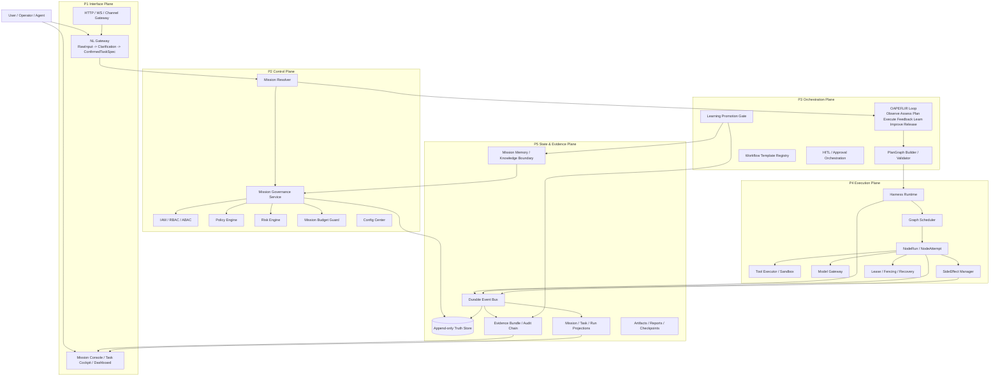
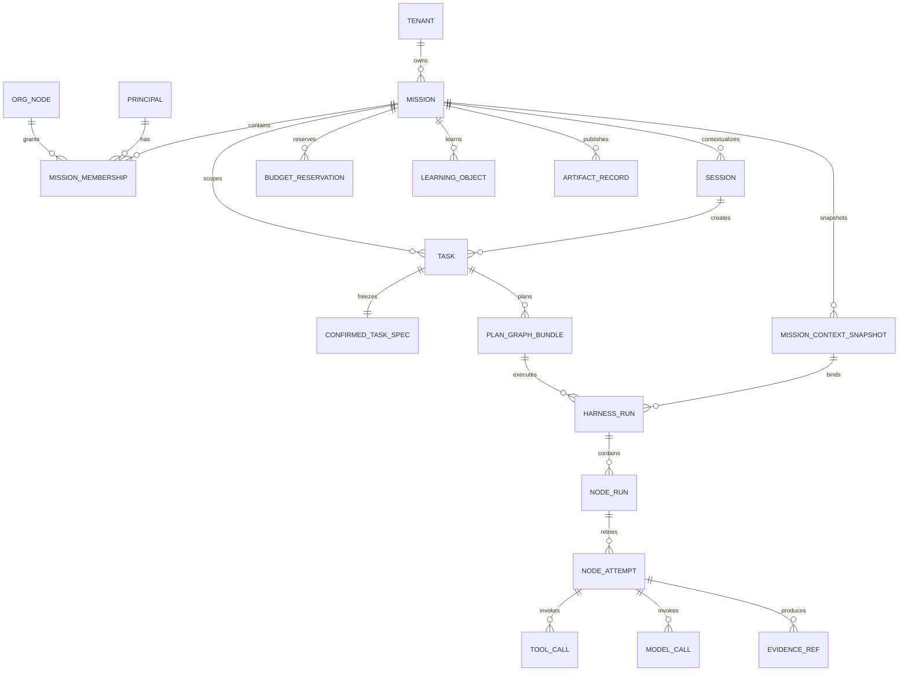
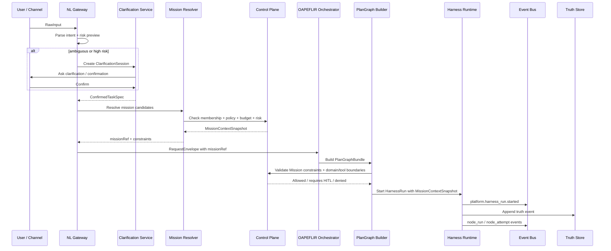
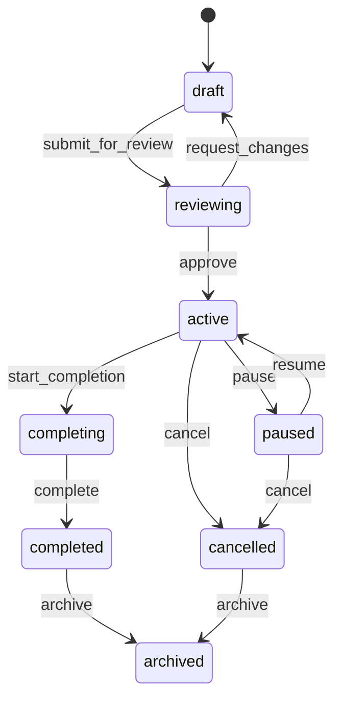
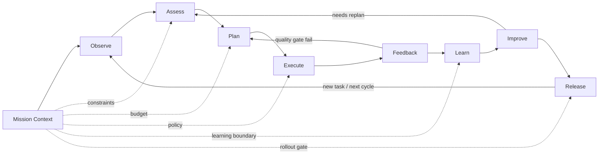
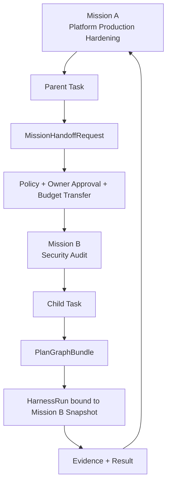
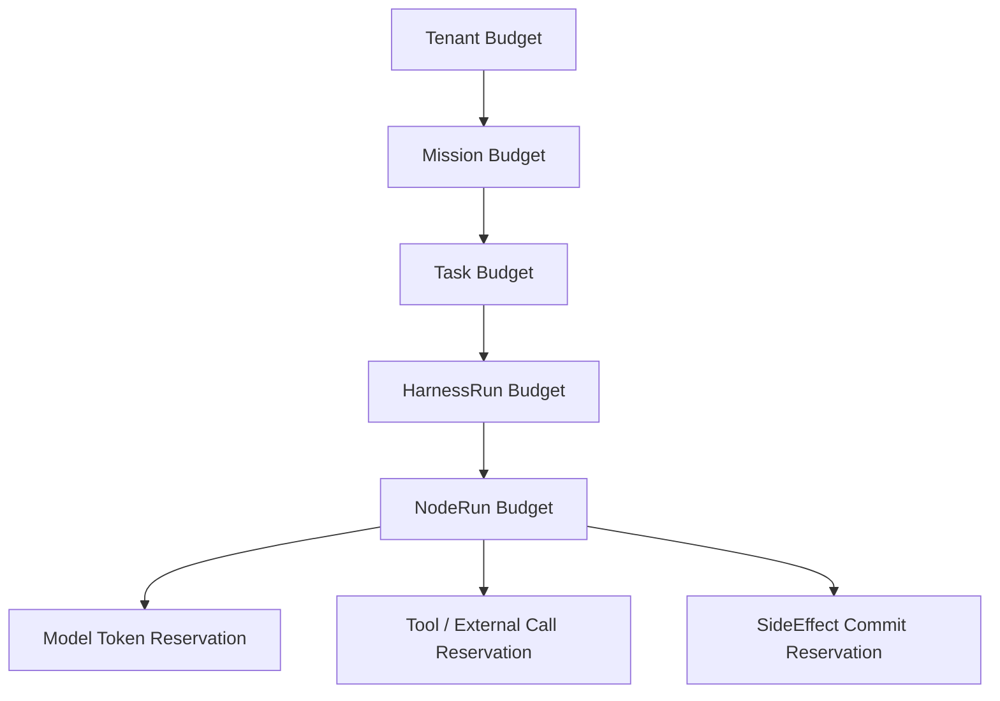
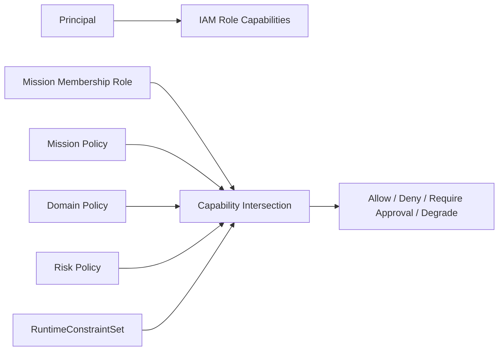
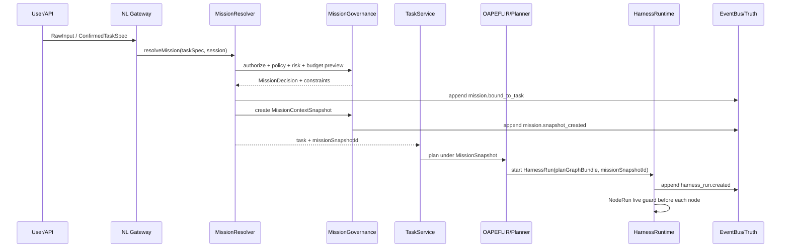

# Automatic Agent Platform — Mission 架构加入方案实现契约版 v1.4

> **文档版本**：v1.4  
> **基线文档**：`mission_architecture_design_review_v1_3.md`  
> **审查目标**：在 v1.3 架构实现契约版基础上，合并 Step 降级规则，补齐 Mission 与 Graph/Node-centric runtime 的命名边界、接口约束、测试治理与迁移要求，形成可直接进入实现阶段的完整合并版。  
> **最终结论**：Mission 应加入系统，但必须作为 **长期目标与治理上下文根对象**，不能成为新的执行对象、不能替代 PlanGraph、不能复活 legacy WorkflowState，也不能生成第四套 RequestEnvelope / ExecutionPlan / StateCommand；同时必须弱化 Step 概念，系统 canonical runtime 统一采用 `PlanGraphBundle / PlanNode / NodeRun / NodeAttempt`。

---

## 0. 终审结论

Mission 的正确定位是：

```text
Mission = Agent 生态系统级长期目标 + 治理边界 + 预算边界 + 知识边界 + 学习归因边界 + 审计归因边界
```

它不是：

```text
不是 Agent Session
不是 WorkflowState
不是 ExecutionPlan
不是 PlanGraphBundle
不是 HarnessRun
不是 NodeRun
不是 UI Project Folder
不是 Domain
不是 Agent Team
```

系统加入 Mission 后，推荐形成下面的 canonical 层次：

```text
Tenant / Org
  └── Mission
        ├── Session              # 人机交互上下文，可多次进入同一 Mission
        ├── Task                 # 一次正式工作请求，必须绑定 MissionContext
        ├── WorkflowTemplate     # 可复用流程模板，不属于执行状态
        ├── PlanGraphBundle      # 本次任务的 DAG 执行计划
        ├── HarnessRun           # 本次执行实例，只绑定一个 MissionSnapshot
        ├── NodeRun              # 单个图节点运行
        ├── NodeAttempt          # 单次模型/工具/人工尝试
        ├── EvidenceBundle       # 证据与审计链
        └── LearningObject       # 可选择留在 Mission 内，或经审批提升到 Domain/Platform
```

最关键的不变量：

| 不变量 | 说明 |
|---|---|
| INV-MISSION-001 | 每个可执行 Task 在 dispatch 前必须解析出一个 `missionRef`，但不一定每次都创建新 Mission。 |
| INV-MISSION-002 | 一个 HarnessRun 只能绑定一个 MissionContextSnapshot；跨 Mission 协作必须拆分 child task 或 MissionHandoff。 |
| INV-MISSION-003 | Mission 只保存目标、边界、策略、预算、成员、知识/学习归因；不得保存运行中的节点状态。 |
| INV-MISSION-004 | RuntimeMode 不做线性排序，必须转成 RuntimeConstraintSet 后做约束交集。 |
| INV-MISSION-005 | MissionSnapshot 保证审计可复现；live revocation check 保证撤权/冻结/预算耗尽能及时生效。 |
| INV-MISSION-006 | Mission 的所有状态变化必须通过 PlatformFactEvent 追加，不允许直接覆盖 truth。 |
| INV-MISSION-007 | MissionId 可进入 log/trace/event，但默认不能作为 metrics label，避免高基数爆炸。 |
| INV-MISSION-008 | Mission 不新增第四套核心 contract，只扩展现有 canonical contracts。 |
| INV-MISSION-009 | `Step` 不是 canonical object；Mission、Task、Plan、Harness、Event、Budget、Evidence、API 均不得新增 Step-centric 字段，只能在 UI/文档展示层作为自然语言标签。 |

---

## 1. 整体架构图：Mission 融入五平面

> Mission 不是第六平面，而是贯穿 Control Plane、Orchestration Plane、Execution Plane、State & Evidence Plane 的治理上下文。



### 1.1 架构图解读

Mission 贯穿链路，但不接管执行：

1. **P1 Interface** 接收用户输入，只能提供 Mission hint，不能直接授权 Mission。
2. **P2 Control** 决定 Mission 是否存在、是否可用、用户是否有权限、预算是否可用、风险是否可接受。
3. **P3 Orchestration** 在 Mission 约束下生成 PlanGraphBundle。
4. **P4 Execution** 每个 NodeRun 在 MissionSnapshot + live guard 下执行。
5. **P5 State & Evidence** 记录 Mission/Task/Run/Node/SideEffect 的事实事件、证据、投影与审计链。

---

## 2. 对象关系图：Mission 与 Task / Session / Plan / Run



### 2.1 核心关系

| 对象 | 生命周期长短 | 主要职责 | 是否执行对象 | 是否可跨 Session | 是否可跨 Task |
|---|---:|---|---:|---:|---:|
| Mission | 长期 | 目标、治理、预算、知识、学习、归因 | 否 | 是 | 是 |
| Session | 短/中 | 多轮对话上下文、澄清、偏好、临时状态 | 否 | 否 | 可产生多个 Task |
| Task | 中 | 一次正式工作请求与验收目标 | 否 | 可引用 Session | 否 |
| WorkflowTemplate | 长期 | 可复用流程模板 | 否 | 是 | 是 |
| PlanGraphBundle | 单次 | 本次 Task 的 DAG 执行计划 | 否 | 否 | 否 |
| HarnessRun | 单次 | 本次计划运行实例 | 是 | 否 | 否 |
| NodeRun | 单次 | DAG 中单节点运行 | 是 | 否 | 否 |
| NodeAttempt | 极短 | 单次尝试、模型/工具调用、错误、证据 | 是 | 否 | 否 |
| Agent | 长期/中期 | 能力提供者或执行角色 | 否 | 是 | 是 |
| Runtime | 系统级 | 调度、执行、恢复、隔离 | 是 | 是 | 是 |
| Step | 非权威展示词 | UI/文档里对 NodeRun 的自然语言称呼；不得作为 truth/contract/runtime 字段 | 否 | 否 | 否 |

---

## 3. Mission、Task、Session 什么时候创建

### 3.1 Session 何时创建

Session 是交互上下文，只在用户或外部 channel 开始一段上下文时创建。

创建 Session 的典型场景：

| 场景 | 是否创建 Session | 说明 |
|---|---:|---|
| 用户打开 Web Chat / NL 面板 | 是 | 保存多轮上下文、澄清状态、用户偏好 |
| Slack/Telegram webhook inbound | 是或复用 | 按 channel thread / conversation id 复用 |
| 后台定时任务 | 否 | 没有人机对话上下文，可直接由 Mission/Task 驱动 |
| API 直接提交 Task | 可选 | 若无多轮上下文，可不创建 Session |
| Proactive Agent 触发建议 | 可选 | 需要向用户交互时创建 operator session |

Session 不代表任务正式开始。正式执行必须进入 Task。

### 3.2 Task 何时创建

Task 是一次正式工作请求。只有经过 intake、澄清、确认或风险豁免后才创建。

创建 Task 的条件：

```text
RawInput
  -> parse intent
  -> resolve slots
  -> risk preview
  -> clarification / confirmation if required
  -> ConfirmedTaskSpec
  -> MissionResolve
  -> RequestEnvelope
  -> Task
```

Task 必须具备：

| 字段 | 说明 |
|---|---|
| tenantId | 租户隔离 |
| principal | 发起人或 agent |
| missionRef | 绑定的 Mission 或 AdHocMission |
| confirmedTaskSpecId | 冻结后的需求规格 |
| idempotencyKey | 防重复提交 |
| riskProfile | 风险预览 |
| runtimeConstraints | 初始运行约束 |
| budgetIntent | 预算需求 |
| traceId / correlationId | 观测链路 |

### 3.3 Mission 何时创建

不是每次对话都创建新 Mission，也不是每个 Task 都创建新 Mission。

Mission 创建规则：

| 触发条件 | 是否创建新 Mission | 示例 |
|---|---:|---|
| 用户明确创建长期目标 | 是 | “建立公司级 Agent 平台生产化专项” |
| 多个 Task 共享长期目标、预算、知识、审批 | 是 | 研发项目、持续运营、合规审计、投研专题 |
| Proactive / Scheduled / Autonomous 工作 | 是 | 每日监控、自动修复、持续评估 |
| 跨团队/跨 Agent/跨 Domain 协作 | 是 | 法务 + 财务 + 工程联合流程 |
| 单次低风险问答 | 否，绑定 AdHocMission | “解释 DAG 是什么” |
| 单次高风险操作 | 不一定新建，但必须显式选择或创建 Mission | “部署生产配置” |
| API 低风险无上下文请求 | 绑定 system default Mission | 只读查询类 API |

### 3.4 是否每个 Task 都要走 Mission

**执行前必须绑定 MissionContext，但不一定人工可见，也不一定创建新 Mission。**

推荐三类 Mission：

| 类型 | 可见性 | 用途 | TTL |
|---|---|---|---|
| ExplicitMission | 用户/团队可见 | 长期目标、项目、自动化生态 | 长期 |
| SystemMission | 系统可见 | incident/recovery/maintenance/bootstrap | 中长期 |
| AdHocMission | 默认折叠 | 单次低风险任务的治理上下文 | 短期自动归档 |

关键原则：

```text
Every executable Task must bind to one MissionContext.
Not every user interaction creates a new Mission.
Not every Mission is user-visible.
```

---

## 4. 请求流：从用户输入到 Mission 绑定再到执行



### 4.1 MissionResolver 两阶段设计

为避免 “需要 Domain 才能选 Mission，但 Mission 又限制 Domain” 的循环依赖，采用两阶段：

```text
Stage 1: PreRouteClassifier
  输入 RawInput / ConfirmedTaskSpec
  输出 domainHints / riskHints / workflowHints / candidateMissionIds

Stage 2: MissionResolver
  根据 hints + membership + recent missions + explicit selection 得到 MissionContextSnapshot

Stage 3: FinalRouteValidator
  在 Mission 允许的 domain/tool/workflow/runtimeConstraints 内做最终路由
```

### 4.2 Mission 选择优先级

```text
explicit missionId from user/API
> active session mission binding
> recent explicit mission in same workspace
> resolver recommended mission requiring user confirmation
> ad_hoc mission for low-risk task
> reject and ask user to choose/create mission
```

高风险写操作不能静默使用 recent mission，必须显式确认。

---

## 5. Mission Contract 设计

### 5.1 MissionRecord

```ts
export type MissionStatus =
  | "draft"
  | "reviewing"
  | "active"
  | "paused"
  | "completing"
  | "completed"
  | "cancelled"
  | "archived";

export type MissionKind =
  | "explicit"
  | "system"
  | "ad_hoc"
  | "incident"
  | "research"
  | "operations"
  | "product"
  | "compliance";

export interface MissionRecord {
  missionId: string;
  tenantId: string;
  orgId?: string;
  workspaceId?: string;
  parentMissionId?: string;

  kind: MissionKind;
  status: MissionStatus;
  title: string;
  objective: string;
  successCriteria: MissionSuccessCriterion[];

  ownerPrincipalId: string;
  accountableTeamId?: string;
  domainRefs: string[];
  allowedWorkflowTemplateRefs: string[];
  allowedToolRefs: string[];

  runtimeConstraintPolicyRef: string;
  riskPolicyRef: string;
  budgetEnvelopeRef: string;
  knowledgeBoundaryRef?: string;
  learningPolicyRef?: string;
  approvalPolicyRefs: string[];

  dataResidency?: string;
  retentionPolicyRef?: string;
  sloPolicyRef?: string;

  createdAt: string;
  updatedAt: string;
  activatedAt?: string;
  completedAt?: string;
  archivedAt?: string;

  version: number;
  schemaVersion: string;
  auditRefs: string[];
}
```

### 5.2 MissionContextSnapshot

Snapshot 用于执行可复现，不可在运行中被原地修改。

```ts
export interface MissionContextSnapshot {
  snapshotId: string;
  missionId: string;
  missionVersion: number;
  tenantId: string;
  createdAt: string;

  objectiveHash: string;
  policySnapshotHash: string;
  budgetSnapshotHash: string;
  membershipSnapshotHash: string;
  knowledgeBoundaryHash?: string;

  effectiveRuntimeConstraints: RuntimeConstraintSet;
  effectiveApprovalRequirements: ApprovalRequirement[];
  effectiveBudgetEnvelope: MissionBudgetEnvelope;
  effectiveDataPolicy: DataPolicySnapshot;
  effectiveLearningPolicy: LearningPolicySnapshot;

  sourceEventId: string;
  auditRefs: string[];
}
```

### 5.3 MissionMembership

```ts
export type MissionRole =
  | "viewer"
  | "contributor"
  | "operator"
  | "approver"
  | "owner"
  | "auditor";

export interface MissionMembership {
  missionId: string;
  tenantId: string;
  principalId: string;
  role: MissionRole;
  grantedBy: string;
  expiresAt?: string;
  constraints?: RuntimeConstraintSet;
  createdAt: string;
  revokedAt?: string;
  version: number;
}
```

权限计算必须是交集：

```text
EffectivePermission =
  IAMRoleCapabilities
∩ MissionMembershipCapabilities
∩ MissionPolicyCapabilities
∩ DomainPolicyCapabilities
∩ RiskPolicyCapabilities
∩ RuntimeConstraintSet
```

### 5.4 RuntimeConstraintSet

```ts
export interface RuntimeConstraintSet {
  allowRead: boolean;
  allowWrite: boolean;
  allowExternalCall: boolean;
  allowToolExecution: boolean;
  allowModelCall: boolean;
  allowRollout: boolean;
  allowSideEffectCommit: boolean;
  allowDelegation: boolean;
  allowLearningPromotion: boolean;

  requireHumanApprovalForWrite: boolean;
  requireHumanApprovalForExternalCall: boolean;
  requireHumanApprovalForRollout: boolean;
  requireHumanApprovalForLearningPromotion: boolean;

  maxAutoExecuteRisk: "none" | "low" | "medium" | "high" | "critical";
  maxDelegationDepth: number;
  maxAutonomousNodeRuns: number;
  maxExternalCallsPerRun: number;
  maxSideEffectsPerRun: number;
}
```

### 5.5 MissionBudgetEnvelope

```ts
export interface MissionBudgetEnvelope {
  missionId: string;
  currency: "USD" | "CNY";

  maxCostUsd?: number;
  maxModelTokens?: number;
  maxContextTokens?: number;
  maxOutputTokens?: number;
  maxNodeRuns?: number;
  maxHarnessRuns?: number;
  maxToolCalls?: number;
  maxExternalCalls?: number;
  maxDurationMs?: number;
  maxConcurrentRuns?: number;

  warnAtRatio: number;
  hardStopAtRatio: number;
  resetPolicy: "none" | "daily" | "weekly" | "monthly";
  approvalRequiredAboveRatio: number;

  version: number;
}
```

---

## 6. Mission 生命周期与执行副作用



### 6.1 状态语义

| 状态 | 可接新 Task | 可继续运行中 HarnessRun | 可创建 LearningObject | 可 promotion | 可归档 |
|---|---:|---:|---:|---:|---:|
| draft | 否 | 否 | 否 | 否 | 否 |
| reviewing | 否 | 否 | 否 | 否 | 否 |
| active | 是 | 是 | 是 | 受策略限制 | 否 |
| paused | 否 | drain only | 是 | 否 | 否 |
| completing | 否 | drain only | 是 | 需 owner 审批 | 否 |
| completed | 否 | 否 | 只读 | 可受限 promotion | 是 |
| cancelled | 否 | 否 | 只读 | 否 | 是 |
| archived | 否 | 否 | 否 | 否 | 已归档 |

### 6.2 Mission 状态变化的副作用

| 转换 | 必须副作用 |
|---|---|
| draft → reviewing | 生成 MissionReviewRequest；冻结 review snapshot |
| reviewing → active | 发 `platform.mission.activated`；启用预算和成员权限 |
| active → paused | 阻止新 Task；queued task 标记 blocked；running HarnessRun 进入 drain/cancel 策略 |
| paused → active | 重新做 policy/budget/member live check；不复用旧 snapshot |
| active → completing | 禁止新 Task；允许完成已有 run；锁定新增预算 |
| completing → completed | 生成 FinalMissionReport；冻结 MissionSummaryEvidenceBundle |
| active/paused → cancelled | 取消 queued task；running run 按 recovery policy 终止；释放预算 reservation |
| completed/cancelled → archived | 移动到只读归档；保留审计、证据、学习对象引用 |

---

## 7. Mission 与 OAPEFLIR / Harness 的关系



### 7.1 每个阶段的 Mission 约束

| OAPEFLIR 阶段 | Mission 参与点 |
|---|---|
| Observe | 使用 Mission knowledge boundary 和 session context 过滤输入 |
| Assess | 计算 risk、budget feasibility、domain eligibility、mission fit |
| Plan | PlanGraphBuilder 只能选择 Mission 允许的 workflow/tool/domain |
| Execute | NodeRun 前 live check：Mission active、预算未耗尽、权限未撤销 |
| Feedback | 反馈按 Mission 归因，进入 mission-level evidence |
| Learn | LearningObject 默认留在 Mission scope，不自动提升 |
| Improve | ImprovementCandidate 必须带 missionId 和 evidenceRefs |
| Release | 发布/rollout 需满足 Mission rollout policy 与 owner/domain gate |

### 7.2 HarnessRun 绑定规则

```ts
export interface HarnessRunMissionBinding {
  harnessRunId: string;
  missionId: string;
  missionSnapshotId: string;
  bindingReason: "explicit" | "session_default" | "resolver" | "ad_hoc" | "system";
  boundAt: string;
  boundBy: string;
}
```

不允许：

```text
HarnessRun.missionIds: string[]
NodeRun 自己换 Mission
NodeAttempt 自己换 Mission
```

允许：

```text
Parent Mission 创建 child Task，child Task 绑定另一个 Mission。
Parent Mission 与 child Mission 之间通过 MissionHandoffRequest 建立审计关系。
```

---

## 8. 跨 Mission 协作与 Handoff



### 8.1 MissionHandoffRequest

```ts
export interface MissionHandoffRequest {
  handoffId: string;
  sourceMissionId: string;
  targetMissionId: string;
  sourceTaskId: string;
  requestedBy: string;
  reason: string;
  requestedCapabilities: string[];
  requestedBudgetEnvelope?: Partial<MissionBudgetEnvelope>;
  dataBoundaryRefs: string[];
  requiredApprovals: ApprovalRequirement[];
  status: "requested" | "approved" | "rejected" | "expired" | "completed";
  createdAt: string;
  expiresAt: string;
}
```

### 8.2 禁止跨 Mission 的隐式行为

| 禁止行为 | 原因 |
|---|---|
| 一个 Task 同时绑定多个 Mission | 预算、审批、证据归因混乱 |
| 一个 HarnessRun 执行中切换 Mission | 审计不可复现 |
| ToolCall 自行越过 Mission knowledge boundary | 数据边界破坏 |
| LearningObject 从 Mission 自动提升到 Platform | 知识污染风险 |
| Proactive Agent 在无 Mission 下自动执行 | 无 owner、无预算、无责任归属 |

---

## 9. Mission 与 Budget / Cost / Reservation

### 9.1 层级预算



### 9.2 预算执行顺序

每次模型/工具/外部调用前必须：

```text
1. live Mission status check
2. permission check
3. policy check
4. risk check
5. budget reserve
6. execute model/tool
7. settle actual cost
8. emit cost event
9. release unused reservation
```

### 9.3 BudgetReservation 关键字段

```ts
export interface BudgetReservation {
  reservationId: string;
  tenantId: string;
  missionId: string;
  taskId: string;
  harnessRunId: string;
  nodeRunId?: string;
  nodeAttemptId?: string;
  kind: "model" | "tool" | "external_call" | "side_effect" | "human_review";
  reservedCostUsd?: number;
  reservedTokens?: number;
  reservedDurationMs?: number;
  status: "reserved" | "settled" | "released" | "expired" | "cancelled";
  expectedVersion: number;
  fencingToken: string;
  expiresAt: string;
  createdAt: string;
}
```

---

## 10. Mission 与 IAM / Policy / Risk

### 10.1 权限计算图



### 10.2 Mission 角色权限矩阵

| 动作 | viewer | contributor | operator | approver | owner | auditor |
|---|---:|---:|---:|---:|---:|---:|
| 查看 Mission | 是 | 是 | 是 | 是 | 是 | 是 |
| 创建低风险 Task | 否 | 是 | 是 | 否 | 是 | 否 |
| 启动 HarnessRun | 否 | 受限 | 是 | 否 | 是 | 否 |
| 批准高风险操作 | 否 | 否 | 否 | 是 | 是 | 否 |
| 修改 Mission Policy | 否 | 否 | 否 | 否 | 是 | 否 |
| 查看审计链 | 受限 | 受限 | 受限 | 是 | 是 | 是 |
| 归档 Mission | 否 | 否 | 否 | 否 | 是 | 否 |

### 10.3 风险门控

| 风险等级 | Mission 默认行为 |
|---|---|
| low | 可按 RuntimeConstraintSet 自动执行 |
| medium | 默认 suggestion 或 semi_auto + approval |
| high | 必须 HITL 审批，不允许自动 side-effect commit |
| critical | 只能 proposal，不允许自动执行；需要 owner + domain owner + platform policy gate |

---

## 11. Mission 与 Knowledge / Memory / Learning

### 11.1 Mission Knowledge Boundary

Mission 可以限定知识检索范围：

```ts
export interface MissionKnowledgeBoundary {
  boundaryId: string;
  missionId: string;
  allowedKnowledgeScopes: string[];
  deniedKnowledgeScopes: string[];
  trustLevelFloor: "private_unverified" | "team_reviewed" | "official" | "authoritative";
  allowContestedKnowledge: boolean;
  dataClassCeiling: "public" | "internal" | "confidential" | "restricted";
}
```

### 11.2 LearningObject 默认留在 Mission 内

```text
NodeAttempt evidence
  -> FeedbackSignal
  -> LearningObject(scope=mission)
  -> quarantine / validation
  -> optional promotion to domain/platform
```

### 11.3 学习提升门禁

| 提升路径 | 要求 |
|---|---|
| Mission → Mission official | Mission owner approval + evidence threshold |
| Mission → Domain | Domain owner approval + no taint + regression eval |
| Domain → Platform | Platform team approval + cross-domain eval + rollout gate |

禁止：

```text
单个成功 NodeAttempt 自动提升到 Platform knowledge。
Mission 内污染数据进入全局 prompt/policy/knowledge。
```

---

## 12. Mission 与 Event / Truth / Evidence

### 12.1 Mission 事件命名

建议采用 canonical 事件：

```text
platform.mission.created
platform.mission.review_requested
platform.mission.activated
platform.mission.paused
platform.mission.resumed
platform.mission.completing
platform.mission.completed
platform.mission.cancelled
platform.mission.archived
platform.mission.member_added
platform.mission.member_revoked
platform.mission.policy_changed
platform.mission.budget_reserved
platform.mission.budget_settled
platform.mission.snapshot_created
platform.mission.handoff_requested
platform.mission.handoff_completed
```

### 12.2 EventEnvelope 必须字段

```ts
export interface PlatformFactEvent<TPayload> {
  eventId: string;
  eventType: string;
  tenantId: string;
  aggregateType: "mission" | "task" | "harness_run" | "node_run" | "side_effect";
  aggregateId: string;
  sequence: number;
  correlationId: string;
  causationId?: string;
  idempotencyKey?: string;
  schemaVersion: string;
  payloadHash: string;
  payload: TPayload;
  emittedAt: string;
  emittedBy: string;
}
```

### 12.3 Truth 与 Projection

| 层 | 存什么 | 是否权威 |
|---|---|---:|
| Truth Store | append-only Mission/Task/Run fact events | 是 |
| Projection | Mission dashboard、Task list、budget summary | 否 |
| Evidence Bundle | 审计证据、引用、哈希链、签名 | 是，作为证据 |
| Cache | UI 查询缓存、临时状态 | 否 |

---

## 13. UI 产品形态

### 13.1 Mission Console

必须提供：

| 区域 | 内容 |
|---|---|
| Mission Overview | 目标、owner、状态、风险、预算、水位 |
| Task Board | 该 Mission 下所有 Task 状态 |
| Run Timeline | HarnessRun / NodeRun / NodeAttempt timeline |
| Budget Panel | cost/token/tool/external-call/duration/concurrency |
| Evidence Panel | evidence refs、audit chain、final report |
| Knowledge Panel | Mission memory、LearningObject、promotion requests |
| Approval Panel | pending HITL / approval requests |
| Incident Panel | blocked、degraded、panic、policy violation |
| Settings | membership、policy、runtime constraints、data boundary |

### 13.2 UI 不能做的事情

| 禁止 | 原因 |
|---|---|
| 前端直接决定 Mission 权限 | 必须后端 IAM/Policy 判断 |
| 最近 Mission 自动用于高风险写操作 | 越权与误操作风险 |
| localStorage 保存 Mission token/secret | XSS 泄漏 |
| UI 本地模拟 execute | 绕过 P1→P2→P3→P4 链路 |
| MissionId 作为所有前端 metrics label | 高基数风险 |

---

## 14. Observability 设计

### 14.1 Trace / Log / Event

Trace 和 log 应带：

```text
tenantId
missionId
missionSnapshotId
taskId
harnessRunId
nodeRunId
nodeAttemptId
correlationId
causationId
riskLevel
runtimeConstraintHash
```

### 14.2 Metrics 标签限制

允许作为 metrics label：

```text
mission_kind
domain
risk_level
tenant_tier
runtime_mode_preset
status
```

默认禁止作为 metrics label：

```text
missionId
taskId
harnessRunId
nodeRunId
userId
promptBundleId
```

这些只能出现在 exemplars、trace、logs 或 sampled diagnostic event 中。

---

## 15. Multi-Region / Tenant / Federation 注意事项

### 15.1 Mission home region

```ts
export interface MissionRegionPolicy {
  missionId: string;
  homeRegion: string;
  allowedReadRegions: string[];
  allowedExecutionRegions: string[];
  dataResidency: string;
  readAfterWriteConsistency: "strong" | "bounded_staleness" | "eventual";
  failoverPolicyRef: string;
}
```

### 15.2 多区域原则

| 规则 | 说明 |
|---|---|
| Mission truth home region 唯一 | 防止 split-brain |
| Projection 可跨区复制 | 只读/近实时展示 |
| Budget reservation 在 home region 原子化 | 防超额 |
| Failover 必须产生 new fencing epoch | 防 stale leader 写入 |
| MissionSnapshot 需要 region/epoch | 保证审计和恢复 |

### 15.3 Federation

跨组织 Mission 协作不能共享裸数据，必须通过：

```text
FederatedMissionLink
+ DataSharingPolicy
+ CapabilityDelegation
+ EvidenceRedactionPolicy
+ CrossOrgAuditTrail
```

---

## 16. 迁移方案

### Phase 0：Contract Freeze 先行

必须先完成：

1. 确认唯一 RequestEnvelope 定义。
2. 确认 PlanGraphBundle 是唯一执行计划契约。
3. 确认 HarnessRun / NodeRun / NodeAttempt 是唯一运行时对象。
4. 废弃 legacy ExecutionPlan / WorkflowState / ControlDirective 作为一等 contract。

### Phase 1：引入 Mission 表与事件，不改变执行路径

新增：

```text
mission_records
mission_memberships
mission_context_snapshots
mission_budget_envelopes
mission_events
mission_projections
```

所有老 Task 自动绑定：

```text
system.ad_hoc.default_mission
```

### Phase 2：MissionResolver 接入 intake

```text
ConfirmedTaskSpec -> MissionResolver -> RequestEnvelope.missionRef
```

低风险任务可自动绑定 AdHocMission；高风险必须显式确认。

### Phase 3：HarnessRun 绑定 MissionSnapshot

HarnessRun 创建时必须有：

```text
missionId
missionSnapshotId
effectiveRuntimeConstraints
budgetEnvelopeRef
```

### Phase 4：NodeRun live guard

每个 NodeRun 前检查：

```text
Mission active?
Membership still valid?
Budget still available?
Runtime constraints still allow?
Incident/Panic state?
```

### Phase 5：UI Mission Console + Observability

上线 Mission Console、Mission Task Board、Budget Panel、Evidence Panel、Learning Panel。

### Phase 6：Learning / Knowledge promotion

最后接入 Mission-scoped learning，避免早期污染平台级知识。

---

## 17. 回归测试与验收标准

### 17.1 必须新增测试

| 测试 | 验收点 |
|---|---|
| MissionResolver E2E | 明确 missionId、session default、ad hoc、拒绝选择均正确 |
| High-risk Task Mission confirmation | 高风险不能静默绑定 recent mission |
| HarnessRun single mission invariant | 一个 run 不能有多个 mission |
| Mission paused side effect | paused 后不接新 task，running run 按 drain 策略处理 |
| Budget reservation | NodeRun 前必须 reserve，settle 失败不得静默通过 |
| Live revocation | 成员被 revoke 后后续 NodeRun 被阻断 |
| Snapshot reproducibility | 同一 snapshot replay 得到相同 policy view |
| Cross-mission handoff | 必须有 approval/audit/budget transfer |
| Learning quarantine | Mission learning 不自动提升 Domain/Platform |
| Metrics high-cardinality guard | missionId 不进入默认 metric labels |
| Multi-region fencing | failover 后旧 epoch 写入被拒绝 |
| UI no local execute | UI action 必须走 API / Control Plane |

### 17.2 禁止通过的测试模式

从现有审计看，必须禁止以下无效测试：

```text
assert.ok(true) in catch
allowed === true || allowed === false
keys.length >= 0
只测试 mock shape，不导入生产服务
E2E 绕过 HarnessRun / PlanGraphBundle / RSM
```

---

## 18. 还需要补齐的遗漏点

### 18.1 Mission 与 Agent Team 的关系

Agent Team 是执行协作结构，不是治理边界。Mission 可以定义允许哪些 Agent/AgentTeam 参与，但 AgentTeam 不能替代 Mission。

```text
Mission owns governance.
AgentTeam owns collaboration topology.
PlanGraph owns execution topology.
```

### 18.2 Mission 与 Domain 的关系

Domain 是能力/策略模板，Mission 是目标实例。

例：

```text
Domain = coding / legal / ops / quant
Mission = Automatic Agent Platform Production Hardening
```

一个 Mission 可以使用多个 Domain；一个 Domain 可服务多个 Mission。

### 18.3 Mission 与 WorkflowTemplate 的关系

WorkflowTemplate 是可复用流程；Mission 可限制允许使用哪些 workflow，但 workflow 不拥有 Mission。

### 18.4 Mission 与 Release / Rollout 的关系

Mission 可以发起 rollout，但 rollout 必须仍走 release gate：

```text
Mission owner approval
+ Domain owner approval
+ Eval pass
+ Regression guard
+ Rollback plan
+ Budget / risk / incident check
```

### 18.5 Mission 与 Proactive Agent 的关系

Proactive Agent 必须绑定 Mission 才能行动。

```text
No Mission -> suggestion only
Mission active + low risk -> may auto propose
Mission active + allowed constraints + approval -> may execute
medium/high/critical -> never silent auto execute
```

### 18.6 Mission 与 Incident/Panic 的关系

Incident 和 Panic 可以创建 SystemMission：

```text
incident.mission.<incidentId>
panic.mission.<scopeId>
recovery.mission.<runId>
```

用于集中恢复动作、预算、审计和 runbook evidence。

---

## 19. 最终推荐目录结构

```text
src/platform/five-plane-control-plane/mission/
  mission-record.ts
  mission-membership.ts
  mission-policy.ts
  mission-budget-envelope.ts
  mission-context-snapshot.ts
  mission-resolver.ts
  mission-governance-service.ts
  mission-lifecycle-service.ts
  mission-permission-service.ts
  mission-budget-service.ts
  mission-handoff-service.ts
  mission-events.ts
  mission-errors.ts

src/platform/five-plane-state-evidence/events/projections/mission/
  mission-dashboard-projection.ts
  mission-task-board-projection.ts
  mission-budget-projection.ts
  mission-evidence-projection.ts

src/platform/five-plane-orchestration/mission/
  mission-aware-plan-validator.ts
  mission-oapeflir-guard.ts
  mission-learning-gate.ts

src/platform/five-plane-execution/mission/
  mission-runtime-guard.ts
  mission-budget-reservation-adapter.ts
  mission-live-revocation-checker.ts

ui/packages/features/mission-console/
  src/hooks/
  src/web/
  src/mobile/
```

---

## 20. 最终落地原则

### 20.1 应该做

1. 把 Mission 作为 **目标治理根对象**。
2. 所有可执行 Task 在 dispatch 前绑定 MissionContext。
3. HarnessRun 固定绑定 MissionSnapshot。
4. NodeRun 前做 live guard。
5. Budget / IAM / Risk / Policy 统一做约束交集。
6. Learning 默认留在 Mission scope。
7. Mission 状态变化全部事件化。
8. UI 只展示和提交请求，不本地执行。
9. Observability 带 Mission 上下文，但 metrics 控制高基数。
10. 迁移时先兼容 legacy，再逐步强制 missionRef。

### 20.2 不应该做

1. 不要给 Mission 加 `steps[] / currentStep / currentNode / toolCalls`；Mission 进度只能来自 Task/HarnessRun/NodeRun/NodeAttempt 投影。
2. 不要让一个 HarnessRun 同时绑定多个 Mission。
3. 不要用 RuntimeMode enum 排序做权限判断。
4. 不要让 UI mission hint 变成授权依据。
5. 不要把 Mission memory 自动提升到平台知识。
6. 不要新增第四套 RequestEnvelope / ExecutionPlan / WorkflowState。
7. 不要让 Proactive Agent 在无 Mission 下自动执行。
8. 不要把 missionId 打进所有 metrics label。

---

## 21. 最终判断

Mission 应作为 Automatic Agent Platform 的核心治理对象加入。加入后，系统从“单次 Agent Session / 单次 Task 执行平台”升级为“长期目标驱动的 Agent 生态系统”。

但 Mission 的实现必须严格遵守三条底线：

```text
1. Mission governs, PlanGraph executes.
2. Mission snapshots for reproducibility, live checks for safety.
3. Mission extends canonical contracts, never forks them.
```

这样系统可以获得：

| 能力 | 改进 |
|---|---|
| 长期目标管理 | 多 Task、多 Agent、多 Workflow 归属同一目标 |
| 治理一致性 | 预算、权限、知识、审批、学习统一边界 |
| 自动化安全性 | 高风险任务不会脱离 Mission owner 和 Mission policy |
| 可观测性 | 所有 run、node、事件、证据可按 Mission 聚合 |
| 学习闭环 | Mission 内经验可沉淀，但不会污染平台知识 |
| 产品体验 | 用户看到的是目标进展，而不是零散 task/run/session |

**最终建议：可以进入设计冻结和实现阶段，但实现顺序必须是 Contract Freeze → Mission Truth/Event → Resolver → Harness Binding → Runtime Guard → UI Console → Learning Promotion。**

---

## 40. 实现状态与证据追加记录

> 更新时间：2026-05-13。以下状态只追加实现证据，不删除本文原始契约。Mission 仍保持“长期目标与治理上下文根对象”的定位；执行面继续以 `PlanGraphBundle / PlanNode / NodeRun / NodeAttempt` 为 canonical runtime。

| 任务 | 状态 | 实现证据 | 测试证据 |
|---|---|---|---|
| T-MIS-001 Mission schemas/types | ✅ 已实现 | `src/platform/contracts/mission/index.ts`；`src/platform/contracts/index.ts` 导出 | `tests/unit/platform/contracts/mission-contracts.test.ts` |
| T-MIS-002 Mission truth tables/repository | ✅ 已实现 | `src/platform/five-plane-state-evidence/truth/runtime-physical-schema.ts`；`src/platform/five-plane-state-evidence/truth/mission-repository.ts` | `tests/unit/platform/five-plane-control-plane/mission-services.test.ts` |
| T-MIS-003 `platform.mission.*` event schemas | ✅ 已实现 | `MissionEventTypeSchema`、`MissionEventEnvelopeSchema`、repository sequence allocator | `mission-contracts.test.ts`、`mission-services.test.ts` |
| T-MIS-004 MissionLifecycleService + CAS | ✅ 已实现 | `src/platform/five-plane-control-plane/mission/index.ts` | `mission-services.test.ts` |
| T-MIS-005 MissionResolver + Governance | ✅ 已实现 | `MissionResolver`、`MissionGovernanceService` | `mission-services.test.ts` |
| T-MIS-006 Mission API + ErrorEnvelope | ✅ 已实现 | `src/platform/five-plane-interface/api/http-server/mission-routes.ts`；OpenAPI route list；覆盖 create/list/read/patch、状态转换、members、tasks/runs/evidence/budget、dry-run resolution | `tests/integration/platform/five-plane-interface/api/mission-routes.test.ts`、`tests/integration/platform/contracts/api-openapi-contract.test.ts` |
| T-MIS-007 PlanGraphBundle missionSnapshotRef | ✅ 已实现 | `PlanGraphBundle` contract/schema/factory extension；`MissionRuntimeBindingService`；`POST /v1/tasks` 接入 Mission resolution/snapshot binding | `mission-services.test.ts`、`mission-task-binding.test.ts` |
| T-MIS-008 HarnessRun missionBinding | ✅ 已实现 | `HarnessRun` contract/schema/factory extension；single-binding guard | `mission-services.test.ts` |
| T-MIS-009 NodeRun MissionLiveGuard | ✅ 已实现 | `MissionLiveGuard` and `NodeRun.missionSnapshotRef` | `mission-services.test.ts` |
| T-MIS-010 canonical Mission E2E baseline | ✅ 已实现为定向集成基线 | API create + dry-run resolution + task create mission binding + runtime binding tests | `mission-routes.test.ts`、`mission-task-binding.test.ts`、`mission-services.test.ts` |
| T-MIS-011 Mission Console data baseline | ✅ 已实现为后端基线 | Mission API exposes Overview / Members / Tasks / Runs / Budget / Evidence data seams; existing Mission Control remains dashboard surface | `mission-routes.test.ts` |
| T-MIS-012 Trace/log correlation + metrics cardinality guard | ✅ 已实现 | `MissionObservabilityPolicy` allows trace attributes and strips Mission IDs from metric labels | `mission-services.test.ts` |
| T-MIS-013 Mission scoped LearningObject promotion gate | ✅ 已实现 | `MissionLearningPromotionGate` keeps default learning local and requires approval/evidence for promotion | `mission-services.test.ts` |
| T-MIS-014 legacy Task/Session missionRef backfill | ✅ 已实现为仓内基线 | `LegacyMissionBackfillService` | `mission-services.test.ts` |
| T-MIS-015 ADR/superseded marker | ✅ 已回写本文状态 | 本节作为 v1.4 实现证据索引 | 文档一致性由本轮定向测试与 build 验证 |
| T-MIS-016 Mission handoff | ✅ 已实现为仓内基线 | `MissionHandoffService` | `mission-services.test.ts` 覆盖服务导出与能力基线 |
| T-MIS-017 home region/fencing | ✅ 已实现为仓内基线 | `MissionHomeRegionService` epoch guard | `mission-services.test.ts` |
| T-MIS-018 outcome analytics | ✅ 已实现为仓内基线 | `MissionOutcomeAnalyticsService` | `mission-services.test.ts` |
| T-MIS-019 template/package integration | ✅ 已实现为仓内基线 | `MissionTemplateIntegrationService` | `mission-services.test.ts` |

### 40.1 Residual Risk

以下内容属于外部部署或跨系统接线演进项，不伪造成单仓代码闭环：真实多区域数据库复制、跨企业 federation 信任接线、真实 UI 发布与权限运营流程。当前仓库已提供可测试 contract、service baseline、Mission Console 后端 API、API route 和 runtime binding guard，后续外部系统接入必须复用这些公共接口。

### 40.2 本轮验证

| 验证项 | 结果 |
|---|---|
| Mission 定向 contract/unit/integration/invariant 测试 | ✅ `node --import tsx --test tests/integration/platform/five-plane-interface/api/mission-routes.test.ts tests/integration/platform/five-plane-interface/api/mission-task-binding.test.ts tests/unit/platform/contracts/mission-contracts.test.ts tests/unit/platform/five-plane-control-plane/mission-services.test.ts tests/invariants/mission-step-governance.test.ts tests/integration/platform/contracts/api-openapi-contract.test.ts` |
| TypeScript build test | ✅ `npm run build:test` |
| OpenAPI contract 定向测试 | ✅ `node --import tsx --test tests/integration/platform/contracts/api-openapi-contract.test.ts` |


---

# Part II — v1.3 实现契约补强

> 本部分是 v1.3 相比 v1.2 的新增内容。目标不是重新定义 Mission 架构，而是把 Mission 从“架构概念”固化为可编码、可测试、可迁移、可审计的实现契约。

## 22. v1.3 变更摘要

| 变更域 | v1.2 状态 | v1.3 补强 |
|---|---|---|
| Canonical Types | 已定义对象边界 | 补齐 TypeScript/Zod schema、ID 规则、字段必填性 |
| State Machine | 已给出状态语义 | 补齐合法 transition table、guard、side effects |
| Event Contract | 已列事件命名 | 补齐 PlatformFactEvent envelope、payload schema、sequence 规则 |
| API Contract | 仅有设计说明 | 补齐 REST API、header、错误码、幂等规则、ETag/If-Match |
| Storage | 仅有目录建议 | 补齐 Mission truth tables、membership、snapshot、event sequence 表 |
| Runtime Binding | 已明确 HarnessRun 绑定 | 补齐 Task→MissionContextSnapshot→HarnessRun→NodeRun 的严格流程 |
| Migration | 已列阶段 | 补齐数据回填、兼容 flag、验收门、回滚策略 |
| Tests | 已列测试方向 | 补齐 contract/unit/integration/e2e/chaos/golden 级测试矩阵 |

v1.3 的冻结目标：

```text
Mission 的加入只扩展 canonical runtime graph，不引入新的执行路径，不复活 legacy WorkflowState，不产生第四套核心对象。
```

---

## 23. 命名与编码规范冻结

### 23.1 TypeScript 与 JSON 字段命名

系统内部 TypeScript/Zod/JSON API 使用 **lowerCamelCase**：

```ts
tenantId
missionId
traceId
idempotencyKey
createdAt
updatedAt
```

数据库字段使用 **snake_case**：

```sql
tenant_id
mission_id
trace_id
idempotency_key
created_at
updated_at
```

禁止在同一个 runtime contract 中混用 snake_case 与 camelCase。跨语言导出时必须通过 mapper 显式转换。

### 23.2 ID 规则

| ID | 格式 | 示例 | 说明 |
|---|---|---|---|
| MissionId | `mis_[a-zA-Z0-9_-]{16,64}` | `mis_product_launch_2026` | 人可读但不可含 `/`、`.`、空格 |
| MissionSnapshotId | `msnap_[a-zA-Z0-9_-]{16,80}` | `msnap_01H...` | 每次绑定 HarnessRun 前生成 |
| MissionEventId | `evt_[a-zA-Z0-9_-]{16,80}` | `evt_01H...` | 全局唯一 |
| MembershipId | `mmbr_[a-zA-Z0-9_-]{16,80}` | `mmbr_01H...` | principal 与 mission 绑定 |
| MissionHandoffId | `mho_[a-zA-Z0-9_-]{16,80}` | `mho_01H...` | 跨 Mission handoff |

禁止用 `Date.now()+Math.random()` 生成 ID。推荐 ULID/UUIDv7 或平台统一 `IdGenerator`。

### 23.3 时间规则

所有 contract 时间字段使用 UTC ISO-8601 字符串：

```ts
2026-05-13T02:40:00.000Z
```

比较时间前必须解析为 epoch milliseconds，禁止 ISO 字符串直接比较。

---

## 24. Mission Canonical Object Schema

### 24.1 MissionRecord

```ts
import { z } from "zod";

export const MissionIdSchema = z.string().regex(/^mis_[a-zA-Z0-9_-]{16,64}$/);
export const MissionSnapshotIdSchema = z.string().regex(/^msnap_[a-zA-Z0-9_-]{16,80}$/);
export const TenantIdSchema = z.string().min(1).max(128);
export const OrgIdSchema = z.string().min(1).max(128);
export const PrincipalIdSchema = z.string().min(1).max(128);

export const MissionTypeSchema = z.enum([
  "ad_hoc",
  "user_goal",
  "domain_program",
  "team_program",
  "system_incident",
  "system_recovery",
  "evaluation_campaign",
  "release_campaign"
]);

export const MissionStatusSchema = z.enum([
  "draft",
  "active",
  "paused",
  "frozen",
  "completed",
  "archived"
]);

export const MissionPrioritySchema = z.enum([
  "low",
  "normal",
  "high",
  "critical"
]);

export const MissionRecordSchema = z.object({
  missionId: MissionIdSchema,
  tenantId: TenantIdSchema,
  orgId: OrgIdSchema.optional(),
  type: MissionTypeSchema,
  status: MissionStatusSchema,
  priority: MissionPrioritySchema.default("normal"),

  title: z.string().min(1).max(256),
  description: z.string().max(8000).optional(),
  objective: z.string().min(1).max(8000),
  successCriteria: z.array(z.object({
    criterionId: z.string().min(1).max(128),
    description: z.string().min(1).max(2000),
    operator: z.enum(["eq", "neq", "gt", "gte", "lt", "lte", "contains", "not_contains", "manual_review"]),
    targetValue: z.unknown().optional(),
    weight: z.number().min(0).max(1).default(1),
    required: z.boolean().default(true)
  })).min(1),

  ownerPrincipalId: PrincipalIdSchema,
  accountablePrincipalId: PrincipalIdSchema.optional(),
  domainId: z.string().min(1).max(128).optional(),

  policyRefs: z.array(z.string().min(1).max(256)).default([]),
  riskProfileRef: z.string().min(1).max(256).optional(),
  budgetEnvelopeRef: z.string().min(1).max(256).optional(),
  knowledgeBoundaryRef: z.string().min(1).max(256).optional(),
  defaultWorkflowTemplateRefs: z.array(z.string().min(1).max(256)).default([]),

  createdAt: z.string().datetime(),
  createdBy: PrincipalIdSchema,
  updatedAt: z.string().datetime(),
  updatedBy: PrincipalIdSchema,
  version: z.number().int().nonnegative(),
  etag: z.string().min(1),

  archivedAt: z.string().datetime().optional(),
  archivedBy: PrincipalIdSchema.optional(),
  freezeReason: z.string().max(2000).optional(),
  metadata: z.record(z.string(), z.unknown()).default({})
}).strict();

export type MissionRecord = z.infer<typeof MissionRecordSchema>;
```

#### 字段约束

| 字段 | 约束 |
|---|---|
| `status` | 只能由 Mission RSM 改变，不能直接 patch |
| `version` | 每次 truth mutation 必须 +1 |
| `etag` | 由 `missionId + version + payloadHash` 生成 |
| `metadata` | 不允许存 token、secret、PII 明文 |
| `successCriteria` | 至少 1 条；否则 Mission 不可 active |

### 24.2 MissionMembership

```ts
export const PrincipalTypeSchema = z.enum([
  "user",
  "agent",
  "service",
  "worker",
  "plugin",
  "system"
]);

export const MissionRoleSchema = z.enum([
  "owner",
  "admin",
  "operator",
  "contributor",
  "viewer",
  "auditor",
  "service_agent"
]);

export const MissionPermissionSchema = z.enum([
  "mission:read",
  "mission:update",
  "mission:archive",
  "mission:manage_members",
  "mission:create_task",
  "mission:dispatch_task",
  "mission:approve_high_risk",
  "mission:manage_budget",
  "mission:view_budget",
  "mission:view_evidence",
  "mission:promote_learning",
  "mission:handoff"
]);

export const MissionMembershipSchema = z.object({
  membershipId: z.string().regex(/^mmbr_[a-zA-Z0-9_-]{16,80}$/),
  missionId: MissionIdSchema,
  tenantId: TenantIdSchema,
  principal: z.object({
    principalType: PrincipalTypeSchema,
    principalId: PrincipalIdSchema
  }).strict(),
  role: MissionRoleSchema,
  permissions: z.array(MissionPermissionSchema).default([]),
  deniedPermissions: z.array(MissionPermissionSchema).default([]),
  grantedBy: PrincipalIdSchema,
  grantedAt: z.string().datetime(),
  expiresAt: z.string().datetime().optional(),
  status: z.enum(["active", "suspended", "revoked", "expired"]),
  version: z.number().int().nonnegative(),
  metadata: z.record(z.string(), z.unknown()).default({})
}).strict();
```

权限计算规则：

```text
effectivePermissions =
  rolePermissions(role)
  ∩ missionPolicy.allowedPermissions
  ∩ principalCurrentPermissions
  - deniedPermissions
  - missionPolicy.deniedPermissions
```

禁止把 caller 提供的 `permissions` 或 `capabilities` 直接作为有效权限。所有权限必须从 IAM、MissionMembership、PolicyDecision 三方交集得到。

### 24.3 RuntimeConstraintSet

Mission 不直接使用 `RuntimeMode` enum 排序，而是将 runtime mode、risk、policy、domain、budget 全部归一为约束集合。

```ts
export const RuntimeConstraintSetSchema = z.object({
  allowModelCall: z.boolean(),
  allowToolCall: z.boolean(),
  allowExternalNetwork: z.boolean(),
  allowFileWrite: z.boolean(),
  allowDestructiveAction: z.boolean(),
  allowSideEffectCommit: z.boolean(),
  allowAutoExecute: z.boolean(),
  requireHITL: z.boolean(),
  requireDomainOwnerApproval: z.boolean(),
  requireBudgetReservation: z.boolean(),
  requireEvidenceRefs: z.boolean(),
  sandboxProfileRef: z.string().min(1).optional(),
  maxDelegationDepth: z.number().int().min(0).max(8),
  maxParallelNodeRuns: z.number().int().min(1).max(1024),
  deniedToolNames: z.array(z.string()).default([]),
  deniedDomains: z.array(z.string()).default([]),
  dataResidency: z.array(z.string()).default([]),
  modelTrainingOptOut: z.boolean().default(true)
}).strict();
```

约束合并规则：

```text
boolean allow 类字段：AND
boolean require 类字段：OR
max 类字段：MIN
denied 类字段：UNION
allowed list 类字段：INTERSECTION
```

### 24.4 MissionBudgetEnvelope

```ts
export const OapeflirStageSchema = z.enum([
  "observe",
  "assess",
  "plan",
  "execute",
  "feedback",
  "learn",
  "improve",
  "release"
]);

export const BudgetLimitSchema = z.object({
  maxCostUsd: z.number().nonnegative().optional(),
  maxModelTokens: z.number().int().nonnegative().optional(),
  maxContextTokens: z.number().int().nonnegative().optional(),
  maxOutputTokens: z.number().int().nonnegative().optional(),
  maxToolCalls: z.number().int().nonnegative().optional(),
  maxNodeRuns: z.number().int().nonnegative().optional(),
  maxDurationMs: z.number().int().nonnegative().optional(),
  maxWallClockMs: z.number().int().nonnegative().optional()
}).strict();

export const MissionBudgetEnvelopeSchema = z.object({
  budgetEnvelopeId: z.string().min(1).max(128),
  missionId: MissionIdSchema,
  tenantId: TenantIdSchema,
  limits: BudgetLimitSchema,
  warnAtRatio: z.number().min(0).max(1).default(0.8),
  hardStopAtRatio: z.number().min(0).max(1).default(1.0),
  stageBudgets: z.record(OapeflirStageSchema, BudgetLimitSchema.partial()).default({}),
  resetPolicy: z.enum(["none", "daily", "weekly", "monthly", "mission_lifetime"]).default("mission_lifetime"),
  currency: z.literal("USD").default("USD"),
  createdAt: z.string().datetime(),
  updatedAt: z.string().datetime(),
  version: z.number().int().nonnegative()
}).strict();
```

预算不变量：

| 不变量 | 说明 |
|---|---|
| INV-BUDGET-MISSION-001 | LLM/tool/side-effect 执行前必须有 BudgetReservation。 |
| INV-BUDGET-MISSION-002 | reserve / settle / release 必须 CAS + transaction。 |
| INV-BUDGET-MISSION-003 | Mission budget 不替代 tenant/domain budget，必须做层级扣减。 |
| INV-BUDGET-MISSION-004 | `maxCostUsd` 不得是唯一限制，token/node/tool/duration 必须独立可配。 |

### 24.5 MissionContextSnapshot

MissionSnapshot 是审计可复现的关键。HarnessRun 绑定的是 snapshot，不是 live MissionRecord。

```ts
export const MissionContextSnapshotSchema = z.object({
  missionSnapshotId: MissionSnapshotIdSchema,
  missionId: MissionIdSchema,
  missionVersion: z.number().int().nonnegative(),
  tenantId: TenantIdSchema,
  orgId: OrgIdSchema.optional(),
  taskId: z.string().min(1).max(128),
  confirmedTaskSpecId: z.string().min(1).max(128),

  missionStatusAtSnapshot: MissionStatusSchema,
  objective: z.string().min(1).max(8000),
  successCriteria: MissionRecordSchema.shape.successCriteria,

  effectivePermissions: z.array(MissionPermissionSchema),
  runtimeConstraints: RuntimeConstraintSetSchema,
  budgetEnvelope: MissionBudgetEnvelopeSchema.optional(),
  policyDecisionRefs: z.array(z.string()).default([]),
  riskDecisionRef: z.string().optional(),
  knowledgeBoundaryRef: z.string().optional(),

  createdAt: z.string().datetime(),
  createdBy: PrincipalIdSchema,
  traceId: z.string().min(1),
  correlationId: z.string().min(1),
  payloadHash: z.string().regex(/^[a-f0-9]{64}$/),
  signature: z.string().optional()
}).strict();
```

Snapshot 规则：

```text
1. Task dispatch 前生成 MissionContextSnapshot。
2. HarnessRun 只能引用一个 MissionContextSnapshot。
3. Snapshot 不随 Mission 后续变化而改变。
4. NodeRun 执行前仍需 live guard 检查 Mission 是否 frozen/archived、权限是否撤销、预算是否耗尽。
```

---

## 25. Mission State Machine

### 25.1 状态定义

| 状态 | 含义 | 可执行 Task | 可创建 Task | 可更新配置 | 可学习提升 |
|---|---|---:|---:|---:|---:|
| draft | 草稿，尚未通过激活门 | 否 | 否 | 是 | 否 |
| active | 正常运行 | 是 | 是 | 是 | 是 |
| paused | 暂停新执行，可恢复 | 否，新 dispatch 禁止；已运行按策略 drain | 可创建但不可 dispatch | 是 | 否 |
| frozen | 安全冻结，通常由 incident/panic 触发 | 否，必须 stop/drain | 否 | 只允许 owner/admin 解冻相关操作 | 否 |
| completed | 目标完成，只读沉淀 | 否 | 否 | 否 | 可读，不可新增 |
| archived | 归档，只读 | 否 | 否 | 否 | 否 |

### 25.2 合法转换表

| From | To | 触发命令 | 必须 guard | 事件 |
|---|---|---|---|---|
| draft | active | ActivateMission | owner/admin + successCriteria + budget/policy valid | `platform.mission.activated` |
| active | paused | PauseMission | owner/admin 或 policy | `platform.mission.paused` |
| paused | active | ResumeMission | owner/admin + policy still valid | `platform.mission.resumed` |
| active | frozen | FreezeMission | security/panic/owner/admin | `platform.mission.frozen` |
| paused | frozen | FreezeMission | security/panic/owner/admin | `platform.mission.frozen` |
| frozen | paused | UnfreezeMission | owner/admin + incident resolved + approval | `platform.mission.unfrozen` |
| active | completed | CompleteMission | success criteria satisfied 或 manual approval | `platform.mission.completed` |
| paused | completed | CompleteMission | manual approval | `platform.mission.completed` |
| completed | archived | ArchiveMission | retention guard | `platform.mission.archived` |
| paused | archived | ArchiveMission | no active runs + retention guard | `platform.mission.archived` |
| frozen | archived | ArchiveMission | incident closure + no active runs | `platform.mission.archived` |

禁止转换：

```text
completed -> active
archived -> any
frozen -> active
active -> archived when active HarnessRun exists
```

### 25.3 状态转换命令

```ts
export const MissionTransitionCommandSchema = z.object({
  commandId: z.string().min(1),
  missionId: MissionIdSchema,
  tenantId: TenantIdSchema,
  expectedVersion: z.number().int().nonnegative(),
  fromStatus: MissionStatusSchema,
  toStatus: MissionStatusSchema,
  principal: z.object({
    principalType: PrincipalTypeSchema,
    principalId: PrincipalIdSchema
  }),
  reasonCode: z.string().min(1).max(128),
  reason: z.string().max(2000).optional(),
  approvalRefs: z.array(z.string()).default([]),
  auditRef: z.string().min(1),
  traceId: z.string().min(1),
  idempotencyKey: z.string().min(1),
  createdAt: z.string().datetime()
}).strict();
```

Mission 状态转换必须：

```text
CAS(expectedVersion)
+ append PlatformFactEvent
+ update truth table
+ emit projection event
+ write audit evidence
```

禁止直接 `UPDATE missions SET status = ...`。

---

## 26. Mission Event Contract

### 26.1 PlatformFactEvent Envelope

```ts
export const PlatformFactEventEnvelopeSchema = z.object({
  eventId: z.string().regex(/^evt_[a-zA-Z0-9_-]{16,80}$/),
  eventType: z.string().min(1).max(160),
  schemaVersion: z.string().regex(/^v\d+$/),
  tenantId: TenantIdSchema,
  aggregateType: z.enum(["mission", "task", "harness_run", "node_run", "side_effect", "budget", "membership"]),
  aggregateId: z.string().min(1).max(160),
  sequence: z.number().int().positive(),
  payload: z.record(z.string(), z.unknown()),
  payloadHash: z.string().regex(/^[a-f0-9]{64}$/),
  idempotencyKey: z.string().min(1),
  causationId: z.string().min(1).optional(),
  correlationId: z.string().min(1),
  traceId: z.string().min(1),
  source: z.object({
    plane: z.enum(["interface", "control", "orchestration", "execution", "state_evidence"]),
    service: z.string().min(1),
    version: z.string().min(1)
  }).strict(),
  occurredAt: z.string().datetime(),
  producedBy: z.object({
    principalType: PrincipalTypeSchema,
    principalId: PrincipalIdSchema
  }).strict()
}).strict();
```

### 26.2 Mission 事件列表

| Event Type | Tier | Aggregate | Payload Schema | 说明 |
|---|---:|---|---|---|
| `platform.mission.created` | 1 | mission | MissionCreatedPayload | Mission 创建 |
| `platform.mission.updated` | 1 | mission | MissionUpdatedPayload | 非状态字段更新 |
| `platform.mission.activated` | 1 | mission | MissionStatusChangedPayload | draft→active |
| `platform.mission.paused` | 1 | mission | MissionStatusChangedPayload | active→paused |
| `platform.mission.resumed` | 1 | mission | MissionStatusChangedPayload | paused→active |
| `platform.mission.frozen` | 1 | mission | MissionStatusChangedPayload | active/paused→frozen |
| `platform.mission.unfrozen` | 1 | mission | MissionStatusChangedPayload | frozen→paused |
| `platform.mission.completed` | 1 | mission | MissionStatusChangedPayload | active/paused→completed |
| `platform.mission.archived` | 1 | mission | MissionStatusChangedPayload | completed/paused/frozen→archived |
| `platform.mission.member_added` | 1 | membership | MissionMemberChangedPayload | 成员加入 |
| `platform.mission.member_removed` | 1 | membership | MissionMemberChangedPayload | 成员移除 |
| `platform.mission.member_role_changed` | 1 | membership | MissionMemberChangedPayload | 角色变化 |
| `platform.mission.bound_to_task` | 1 | task | MissionTaskBoundPayload | Task 绑定 Mission |
| `platform.mission.snapshot_created` | 1 | mission | MissionSnapshotCreatedPayload | Snapshot 生成 |
| `platform.mission.budget_reserved` | 1 | budget | MissionBudgetReservedPayload | 预算预留 |
| `platform.mission.budget_settled` | 1 | budget | MissionBudgetSettledPayload | 预算结算 |
| `platform.mission.budget_released` | 1 | budget | MissionBudgetReleasedPayload | 预算释放 |
| `platform.mission.budget_exhausted` | 1 | budget | MissionBudgetExhaustedPayload | 预算耗尽 |
| `platform.mission.handoff_requested` | 2 | mission | MissionHandoffRequestedPayload | 跨 Mission handoff |
| `platform.mission.handoff_accepted` | 2 | mission | MissionHandoffDecisionPayload | 接受 handoff |
| `platform.mission.handoff_rejected` | 2 | mission | MissionHandoffDecisionPayload | 拒绝 handoff |
| `platform.mission.learning_attached` | 2 | mission | MissionLearningAttachedPayload | 学习对象留存 |
| `platform.mission.learning_promoted` | 2 | mission | MissionLearningPromotedPayload | 学习提升 |

### 26.3 MissionStatusChangedPayload

```ts
export const MissionStatusChangedPayloadSchema = z.object({
  missionId: MissionIdSchema,
  tenantId: TenantIdSchema,
  previousStatus: MissionStatusSchema,
  nextStatus: MissionStatusSchema,
  previousVersion: z.number().int().nonnegative(),
  nextVersion: z.number().int().positive(),
  reasonCode: z.string().min(1).max(128),
  reason: z.string().max(2000).optional(),
  approvalRefs: z.array(z.string()).default([]),
  auditRef: z.string().min(1)
}).strict();
```

### 26.4 Sequence 规则

```text
sequence scope = tenantId + aggregateType + aggregateId
sequence starts at 1
sequence increments by 1 in the same transaction as truth update
missing sequence = startup consistency P0
duplicate sequence = startup consistency P0
out-of-order projection input = buffer or replay, never silently apply
```

---

## 27. API Contract

### 27.1 通用 Header

所有写请求必须携带：

```http
X-Request-Id: req_xxx
X-Trace-Id: trace_xxx
X-Correlation-Id: corr_xxx
X-Idempotency-Key: idem_xxx
Accept-Version: v1
Content-Type: application/json
Authorization: Bearer <token>
```

PATCH/状态转换必须额外携带：

```http
If-Match: <etag>
```

响应必须返回：

```http
X-Request-Id: req_xxx
X-Trace-Id: trace_xxx
X-Correlation-Id: corr_xxx
X-Contract-Version: v1
```

### 27.2 Mission API

| Method | Path | 说明 | 权限 | 幂等 |
|---|---|---|---|---|
| POST | `/api/v1/missions` | 创建 Mission | `mission:update` 或 tenant create 权限 | 必须 |
| GET | `/api/v1/missions/{missionId}` | 读取 Mission | `mission:read` | 不需要 |
| PATCH | `/api/v1/missions/{missionId}` | 更新非状态字段 | `mission:update` | 必须 + If-Match |
| POST | `/api/v1/missions/{missionId}:activate` | 激活 | owner/admin | 必须 + If-Match |
| POST | `/api/v1/missions/{missionId}:pause` | 暂停 | owner/admin | 必须 + If-Match |
| POST | `/api/v1/missions/{missionId}:resume` | 恢复 | owner/admin | 必须 + If-Match |
| POST | `/api/v1/missions/{missionId}:freeze` | 冻结 | owner/admin/security/panic | 必须 + If-Match |
| POST | `/api/v1/missions/{missionId}:unfreeze` | 解冻到 paused | owner/admin + approval | 必须 + If-Match |
| POST | `/api/v1/missions/{missionId}:complete` | 完成 | owner/admin | 必须 + If-Match |
| POST | `/api/v1/missions/{missionId}:archive` | 归档 | owner/admin | 必须 + If-Match |
| GET | `/api/v1/missions/{missionId}/tasks` | Mission 下 Task | `mission:read` | 不需要 |
| GET | `/api/v1/missions/{missionId}/runs` | Mission 下 HarnessRun | `mission:read` | 不需要 |
| GET | `/api/v1/missions/{missionId}/evidence` | 证据 | `mission:view_evidence` | 不需要 |
| GET | `/api/v1/missions/{missionId}/budget` | 预算 | `mission:view_budget` | 不需要 |
| POST | `/api/v1/missions/{missionId}/members` | 添加成员 | `mission:manage_members` | 必须 |
| DELETE | `/api/v1/missions/{missionId}/members/{membershipId}` | 移除成员 | `mission:manage_members` | 必须 |

### 27.3 Mission Resolution API

```http
POST /api/v1/mission-resolutions:dry-run
```

请求：

```json
{
  "tenantId": "tenant_001",
  "sessionId": "sess_001",
  "confirmedTaskSpecId": "cts_001",
  "missionHint": "mis_product_launch_2026",
  "createIfMissing": false
}
```

响应：

```json
{
  "resolution": "matched_existing",
  "missionId": "mis_product_launch_2026",
  "confidence": 0.93,
  "requiresUserChoice": false,
  "candidateMissionIds": [],
  "effectiveConstraintsPreview": {
    "allowAutoExecute": false,
    "requireHITL": true,
    "allowExternalNetwork": true,
    "allowSideEffectCommit": false,
    "maxDelegationDepth": 3,
    "maxParallelNodeRuns": 8,
    "requireBudgetReservation": true,
    "requireEvidenceRefs": true,
    "allowModelCall": true,
    "allowToolCall": true,
    "allowFileWrite": false,
    "allowDestructiveAction": false,
    "requireDomainOwnerApproval": true,
    "deniedToolNames": [],
    "deniedDomains": [],
    "dataResidency": ["us"],
    "modelTrainingOptOut": true
  }
}
```

### 27.4 Task 创建如何绑定 Mission

```http
POST /api/v1/tasks
```

请求必须包含以下二选一：

```json
{
  "missionRef": {
    "mode": "use_existing",
    "missionId": "mis_product_launch_2026"
  }
}
```

或：

```json
{
  "missionRef": {
    "mode": "auto_resolve",
    "allowAdHoc": true,
    "createFormalMissionWhen": "multi_task_or_high_risk"
  }
}
```

高风险、写操作、跨系统副作用、长期目标、多 Agent 协作任务禁止无 Mission dispatch。

### 27.5 ErrorEnvelope

```ts
export const MissionErrorCodeSchema = z.enum([
  "MISSION_NOT_FOUND",
  "MISSION_REQUIRED",
  "MISSION_INACTIVE",
  "MISSION_FROZEN",
  "MISSION_ARCHIVED",
  "MISSION_PERMISSION_DENIED",
  "MISSION_BUDGET_EXHAUSTED",
  "MISSION_POLICY_DENIED",
  "MISSION_RISK_REQUIRES_APPROVAL",
  "MISSION_SNAPSHOT_REQUIRED",
  "MISSION_VERSION_CONFLICT",
  "MISSION_INVALID_TRANSITION",
  "MISSION_IDEMPOTENCY_CONFLICT"
]);
```

错误响应：

```json
{
  "error": {
    "code": "MISSION_FROZEN",
    "message": "Mission is frozen and cannot dispatch new work.",
    "details": {
      "missionId": "mis_product_launch_2026",
      "currentStatus": "frozen"
    },
    "requestId": "req_001",
    "traceId": "trace_001",
    "correlationId": "corr_001"
  }
}
```

---

## 28. Storage Contract

### 28.1 mission_records

```sql
CREATE TABLE mission_records (
  mission_id TEXT PRIMARY KEY,
  tenant_id TEXT NOT NULL,
  org_id TEXT,
  type TEXT NOT NULL,
  status TEXT NOT NULL,
  priority TEXT NOT NULL,
  title TEXT NOT NULL,
  description TEXT,
  objective TEXT NOT NULL,
  success_criteria_json TEXT NOT NULL,
  owner_principal_id TEXT NOT NULL,
  accountable_principal_id TEXT,
  domain_id TEXT,
  policy_refs_json TEXT NOT NULL,
  risk_profile_ref TEXT,
  budget_envelope_ref TEXT,
  knowledge_boundary_ref TEXT,
  default_workflow_template_refs_json TEXT NOT NULL,
  metadata_json TEXT NOT NULL,
  freeze_reason TEXT,
  created_at TEXT NOT NULL,
  created_by TEXT NOT NULL,
  updated_at TEXT NOT NULL,
  updated_by TEXT NOT NULL,
  archived_at TEXT,
  archived_by TEXT,
  version INTEGER NOT NULL,
  etag TEXT NOT NULL,
  CHECK (version >= 0)
);

CREATE INDEX idx_mission_records_tenant_status
  ON mission_records(tenant_id, status);

CREATE INDEX idx_mission_records_owner
  ON mission_records(tenant_id, owner_principal_id);
```

### 28.2 mission_memberships

```sql
CREATE TABLE mission_memberships (
  membership_id TEXT PRIMARY KEY,
  mission_id TEXT NOT NULL,
  tenant_id TEXT NOT NULL,
  principal_type TEXT NOT NULL,
  principal_id TEXT NOT NULL,
  role TEXT NOT NULL,
  permissions_json TEXT NOT NULL,
  denied_permissions_json TEXT NOT NULL,
  status TEXT NOT NULL,
  granted_by TEXT NOT NULL,
  granted_at TEXT NOT NULL,
  expires_at TEXT,
  metadata_json TEXT NOT NULL,
  version INTEGER NOT NULL,
  UNIQUE (mission_id, principal_type, principal_id),
  FOREIGN KEY (mission_id) REFERENCES mission_records(mission_id)
);

CREATE INDEX idx_mission_memberships_principal
  ON mission_memberships(tenant_id, principal_type, principal_id, status);
```

### 28.3 mission_context_snapshots

```sql
CREATE TABLE mission_context_snapshots (
  mission_snapshot_id TEXT PRIMARY KEY,
  mission_id TEXT NOT NULL,
  mission_version INTEGER NOT NULL,
  tenant_id TEXT NOT NULL,
  org_id TEXT,
  task_id TEXT NOT NULL,
  confirmed_task_spec_id TEXT NOT NULL,
  snapshot_json TEXT NOT NULL,
  payload_hash TEXT NOT NULL,
  signature TEXT,
  trace_id TEXT NOT NULL,
  correlation_id TEXT NOT NULL,
  created_at TEXT NOT NULL,
  created_by TEXT NOT NULL,
  FOREIGN KEY (mission_id) REFERENCES mission_records(mission_id)
);

CREATE INDEX idx_mission_snapshots_task
  ON mission_context_snapshots(tenant_id, task_id);
```

### 28.4 mission_event_sequences

```sql
CREATE TABLE mission_event_sequences (
  tenant_id TEXT NOT NULL,
  aggregate_type TEXT NOT NULL,
  aggregate_id TEXT NOT NULL,
  next_sequence INTEGER NOT NULL,
  PRIMARY KEY (tenant_id, aggregate_type, aggregate_id)
);
```

### 28.5 事务边界

Mission truth update 与 event append 必须同事务：

```text
BEGIN
  read mission by id FOR UPDATE / sqlite immediate transaction
  validate expectedVersion
  apply state mutation
  increment version
  allocate aggregate sequence
  append PlatformFactEvent
  update projection outbox
COMMIT
```

禁止：

```text
update mission table first, then publish event asynchronously
publish event first, then update mission table asynchronously
```

---

## 29. Runtime Binding Flow

### 29.1 从 Task 到 HarnessRun 的强制链路



### 29.2 NodeRun live guard

每个 NodeRun 执行前必须检查：

```text
Mission status not frozen/archived/completed
Mission membership still valid
Principal still has effective permission
Runtime constraints still allow requested action
Budget reservation still valid
Knowledge boundary still valid
Panic directive not active for scope
```

失败处理：

| 失败原因 | NodeRun 行为 | Mission 行为 |
|---|---|---|
| Mission frozen | block + emit blocker | 不变 |
| Mission archived/completed | safe terminate | 不变 |
| Permission revoked | await HITL 或 fail closed | 不变 |
| Budget exhausted | safe terminate | emit budget_exhausted |
| Policy denied | block | 可触发 incident |
| Panic active | abort/drain | Mission 可转 frozen |

### 29.3 MissionResolver 优先级

```text
1. explicit missionRef from API/user selection
2. active session boundMissionId
3. taskSpec domain/project affinity
4. open mission candidate search by objective similarity
5. ad_hoc mission creation only for low-risk single-task work
6. formal mission creation for long-lived/high-risk/multi-agent/multi-task work
7. fail closed when mission required but cannot resolve
```

---

## 30. Contract 与现有对象的接入点

### 30.1 RequestEnvelope 扩展

不新建第四套 RequestEnvelope。只在 canonical RequestEnvelope 中加入：

```ts
missionRef?: {
  missionId: string;
  missionSnapshotId?: string;
  resolutionMode: "explicit" | "session_bound" | "auto_resolved" | "ad_hoc_created";
};
```

### 30.2 ConfirmedTaskSpec 扩展

```ts
missionIntent?: {
  preferredMissionId?: string;
  allowAdHocMission: boolean;
  requiresFormalMission: boolean;
  reason: string;
};
```

### 30.3 PlanGraphBundle 扩展

```ts
missionContextSnapshotRef: {
  missionId: string;
  missionSnapshotId: string;
  missionVersion: number;
};
```

PlanGraphBundle 仍是唯一计划对象。Mission 不能新增 `steps[] / currentStep / stepOutputs`，也不能把 PlanNode/NodeRun 重新包装成 MissionStep。

### 30.4 HarnessRun 扩展

```ts
missionBinding: {
  missionId: string;
  missionSnapshotId: string;
  missionVersion: number;
  bindingMode: "required" | "ad_hoc" | "system";
};
```

### 30.5 NodeRun 扩展

```ts
missionRuntimeGuard: {
  checkedAt: string;
  decision: "allowed" | "blocked" | "requires_hitl" | "terminated";
  reasonCode?: string;
  policyDecisionRefs: string[];
  budgetReservationId?: string;
};
```

---

## 31. UI Mission Console 实现规格

### 31.1 页面结构

```text
Mission Console
  ├── Overview
  │     ├── Objective
  │     ├── Success Criteria
  │     ├── Current Status
  │     ├── Risk / Policy / Budget Summary
  │     └── Recent Timeline
  ├── Tasks
  │     ├── Task list
  │     ├── Status / Owner / Risk / Budget
  │     └── Create Task under Mission
  ├── Runs
  │     ├── HarnessRun list
  │     ├── PlanGraph view
  │     └── NodeRun / NodeAttempt drilldown
  ├── Budget
  │     ├── Reservations
  │     ├── Settlements
  │     ├── Watermark alerts
  │     └── Cost attribution
  ├── Evidence
  │     ├── Evidence bundles
  │     ├── Audit timeline
  │     └── Export package
  ├── Knowledge & Learning
  │     ├── Mission memory
  │     ├── Learning objects
  │     ├── Promotion candidates
  │     └── Trust level
  ├── Members & Permissions
  │     ├── Memberships
  │     ├── Role assignments
  │     └── Expiry / revocation
  └── Settings
        ├── Policy refs
        ├── Workflow templates
        ├── Data residency
        └── Archive / freeze / complete actions
```

### 31.2 UI 禁止事项

| 禁止事项 | 原因 |
|---|---|
| UI 本地生成 effective permissions | 权限必须来自服务端 MissionGovernance |
| UI 本地执行 task/run | 违反 P1→P2→P3→P4 控制链 |
| UI 把 mission hint 当授权 | hint 只是候选，非决策 |
| UI 在 localStorage 存 token | XSS 可读 |
| UI 对 freeze/complete/archive 无确认 | 高风险操作需二次确认与审计 |
| UI 用 missionId 作为高基数 metrics label | cardinality 爆炸 |

---

## 32. Migration Plan v1.3

### Phase 0 — Contract Freeze Gate

目标：冻结 Mission 类型、事件、API，不允许并行定义。

必须完成：

```text
- 删除/废弃重复 RequestEnvelope / ExecutionPlan / StateCommand active exports
- canonical types/index.ts re-export Mission schemas
- golden tests 锁定 MissionRecord/MissionSnapshot/EventEnvelope shape
```

验收：

```bash
npm run test:contracts -- mission
npm run test:golden -- mission
```

### Phase 1 — Storage + Event Foundation

目标：创建 Mission truth tables 与事件投影，不接入执行路径。

必须完成：

```text
- mission_records
- mission_memberships
- mission_context_snapshots
- mission_event_sequences
- mission projections
- platform.mission.* event schema registry
```

验收：

```text
create/update/status transition 能同事务写 truth + event
replay event 能重建 Mission projection
sequence 缺失/重复时 startup checker P0 fail-closed
```

### Phase 2 — MissionResolver 接入 Intake

目标：Task 创建前强制解析 Mission，但允许 compatibility flag。

Feature flags：

```json
{
  "mission.enabled": true,
  "mission.requireForHighRisk": true,
  "mission.allowAdHocForLowRisk": true,
  "mission.requireForAllDispatch": false
}
```

验收：

```text
高风险 task 无 missionRef -> 409 MISSION_REQUIRED
低风险 task 无 missionRef -> 自动 ad_hoc mission
explicit missionRef 无权限 -> 403 MISSION_PERMISSION_DENIED
```

### Phase 3 — HarnessRun 绑定 MissionSnapshot

目标：所有新 HarnessRun 必须有 missionSnapshotId。

验收：

```text
HarnessRuntime.start(planGraphBundle) 无 missionSnapshotId 直接拒绝
MissionSnapshot payloadHash 可复算
Task / PlanGraph / HarnessRun 三者 traceId/correlationId 一致
```

### Phase 4 — NodeRun Live Guard

目标：每个 NodeRun 执行前强制检查 live Mission 状态。

验收：

```text
Mission active -> node allowed
Mission frozen before node -> node blocked
Membership revoked before node -> node blocked or HITL
Budget exhausted before model call -> no provider call issued
```

### Phase 5 — Full Enforcement

目标：所有 dispatch 必须绑定 Mission。

Feature flags：

```json
{
  "mission.requireForAllDispatch": true,
  "mission.legacyTaskWithoutMission": "reject"
}
```

验收：

```text
legacy task direct dispatch path 全部失败
/api/v1/tasks 创建均产生 mission.bound_to_task event
无 missionSnapshot 的 HarnessRun 无法进入 running
```

### Phase 6 — UI Console + Observability

目标：Mission Console 上线，dashboard 可按 Mission 聚合。

验收：

```text
Mission overview 数据来自 projection，不直接扫 truth
Budget/evidence/runs/tasks 均支持 cursor pagination
Trace/log 可检索 missionId，但 metrics 不把 missionId 当默认 label
```

### Phase 7 — Learning Promotion

目标：LearningObject 默认 mission scoped，经审批提升到 domain/platform。

验收：

```text
LearningObject 无 evidenceRefs -> quarantine
mission scoped learning 不进入 platform knowledge search
promotion 需 trust gate + approval + rollout evidence
```

---

## 33. Test Matrix

### 33.1 Contract Tests

| 测试 | 必须覆盖 |
|---|---|
| MissionRecord strict schema | 额外字段拒绝、必填字段缺失拒绝 |
| MissionStatus transition | 非法转换拒绝 |
| MissionSnapshot hash | payloadHash 可复算 |
| EventEnvelope sequence | sequence 单调递增 |
| ErrorEnvelope | traceId/correlationId 必填 |

### 33.2 Unit Tests

| 模块 | 用例 |
|---|---|
| MissionResolver | explicit/session/auto/ad_hoc/fail-closed |
| MissionGovernance | 权限交集、policy deny、risk approval |
| MissionBudgetService | reserve/settle/release CAS 与并发超额保护 |
| MissionLifecycleService | version conflict、If-Match、idempotency replay |
| RuntimeConstraintSet | AND/OR/MIN/UNION/INTERSECTION 合并规则 |

### 33.3 Integration Tests

| 链路 | 用例 |
|---|---|
| Create Mission | API → service → truth → event → projection |
| Bind Task | Task create → mission resolution → snapshot |
| Dispatch | PlanGraphBundle → HarnessRun with missionSnapshot |
| Live Guard | freeze/revoke/budget-exhausted 阻断 NodeRun |
| Replay | mission events replay 后 projection 完全一致 |

### 33.4 E2E Tests

| 场景 | 验收 |
|---|---|
| Low-risk one-shot | 自动创建 ad_hoc Mission 并完成 Task |
| High-risk write action | 无 Mission 拒绝；有 Mission 但无审批进入 HITL |
| Mission freeze mid-run | 后续 NodeRun 阻断，已有 side-effect 进入 reconciliation |
| Membership revoked mid-run | 下一节点拒绝执行 |
| Budget exhausted | provider/tool call 不发出，run safe terminate |
| Mission complete | 后续新 task dispatch 拒绝 |

### 33.5 Chaos / Concurrency Tests

| 场景 | 验收 |
|---|---|
| 并发 activate/pause | 只有一个 CAS 成功 |
| 并发 budget reserve | 不超过 hard cap |
| crash between truth/event | 不允许出现；同事务验证 |
| projection rebuild | shadow rebuild + compare + cutover |
| event duplicate delivery | projection 幂等 |

### 33.6 禁止的测试写法

```text
assert.ok(true) in catch
assert.ok(x === true || x === false)
直接操作 legacy WorkflowState 证明 canonical path 正确
只 mock service 不导入生产代码却命名 integration
测试 illegal shape 但生产代码不 schema parse
```

---

## 34. Implementation Task Breakdown

### 34.1 P0 实现任务

| Task | Owner 模块 | 说明 | 当前结论 |
|---|---|---|---|
| T-MIS-001 | contracts | 添加 Mission Zod schemas 与 type exports | ✅ 已实现 |
| T-MIS-002 | state-evidence | mission_records/memberships/snapshots/event_sequences migration | ✅ 已实现 |
| T-MIS-003 | events | 注册 platform.mission.* event schemas | ✅ 已实现 |
| T-MIS-004 | control-plane | MissionLifecycleService + CAS transition | ✅ 已实现 |
| T-MIS-005 | control-plane | MissionResolver + MissionGovernanceService | ✅ 已实现 |
| T-MIS-006 | interface | /api/v1/missions API + ErrorEnvelope | ✅ 已实现，含 Mission Console 后端子资源 API |
| T-MIS-007 | orchestration | PlanGraphBundle missionSnapshotRef required | ✅ 已实现为兼容契约扩展、binding guard 与 Task create Mission snapshot binding |
| T-MIS-008 | execution | HarnessRun missionBinding required | ✅ 已实现为兼容契约扩展与 single-binding guard |
| T-MIS-009 | execution | NodeRun MissionLiveGuard | ✅ 已实现为可测试 guard service |
| T-MIS-010 | tests | canonical Mission E2E 覆盖 | ✅ 已实现为定向集成/契约基线 |

### 34.2 P1 实现任务

| Task | Owner 模块 | 说明 | 当前结论 |
|---|---|---|---|
| T-MIS-011 | ui | Mission Console Overview/Tasks/Runs/Budget/Evidence | ✅ 仓内后端数据面已实现；真实独立前端发布属于外部集成演进 |
| T-MIS-012 | observability | Mission trace/log correlation + metrics cardinality guard | ✅ 已实现为 policy/service baseline |
| T-MIS-013 | learning | Mission scoped LearningObject promotion gate | ✅ 已实现为 promotion gate baseline |
| T-MIS-014 | migration | legacy Task/Session missionRef backfill | ✅ 已实现为 backfill service baseline |
| T-MIS-015 | docs | ADR 更新与 superseded 标记 | ✅ 已回写本文状态与证据 |

### 34.3 P2 实现任务

| Task | Owner 模块 | 说明 | 当前结论 |
|---|---|---|---|
| T-MIS-016 | federation | Mission handoff across org/tenant | ✅ 仓内 handoff request service baseline 已实现；真实跨企业信任接线为外部演进 |
| T-MIS-017 | multi-region | Mission home region + read replica routing | ✅ 仓内 home-region/fencing baseline 已实现；真实多区域复制为部署演进 |
| T-MIS-018 | analytics | Mission outcome analytics | ✅ 仓内 outcome analytics service baseline 已实现 |
| T-MIS-019 | marketplace | Mission template/package integration | ✅ 仓内 template/package integration baseline 已实现 |

---

## 35. Backward Compatibility and Deprecation

### 35.1 Legacy 对象处理

| Legacy 对象 | 处理方式 |
|---|---|
| WorkflowState | 只作为 projection/compat view，不可作为执行 truth |
| TaskRecord | 可保留，但必须增加 missionRef projection 字段 |
| ExecutionPlan | deprecated alias，禁止新增调用点 |
| ControlDirective | deprecated alias，迁移到 OperationalDirective/DecisionDirective |
| StateCommand | deprecated alias，迁移到 RuntimeTransitionCommand |

### 35.2 Compatibility Flags

```json
{
  "mission.enabled": true,
  "mission.requireForAllDispatch": false,
  "mission.allowLegacyReadProjection": true,
  "mission.rejectLegacyWritePath": false,
  "mission.createAdHocForLegacyTask": true
}
```

最终生产态：

```json
{
  "mission.enabled": true,
  "mission.requireForAllDispatch": true,
  "mission.allowLegacyReadProjection": true,
  "mission.rejectLegacyWritePath": true,
  "mission.createAdHocForLegacyTask": false
}
```

---

## 36. Risk Review After v1.3

| 风险 | v1.3 缓解 |
|---|---|
| Mission 变成另一个 Workflow | 明确禁止 `steps[] / currentStep / currentNode / toolCalls`；Mission 只保存目标、边界、预算、策略、成员、证据和投影 |
| Mission 与 Session 冗余 | Session 只负责交互上下文，Mission 负责长期治理目标 |
| Mission 与 Domain 冗余 | Domain 是能力/政策分类，Mission 是具体目标实例 |
| Mission 与 Project Folder 混淆 | Folder 是 UI 组织，Mission 是治理 truth |
| Mission 权限绕过 | effectivePermissions 只能由服务端交集计算 |
| MissionSnapshot 过时导致撤权不生效 | Snapshot 保证复现，NodeRun live guard 保证安全 |
| 事件和 truth 不一致 | 同事务 append truth + event |
| metrics cardinality 爆炸 | missionId 不作为默认 label |
| 低风险任务成本过高 | ad_hoc Mission 自动创建，用户无感 |

---

## 37. v1.4 最终冻结结论

Mission 可以正式进入实现阶段，但必须按以下顺序落地：

```text
1. Contract + Schema Freeze
2. Storage + Event Foundation
3. MissionResolver 接入 Task Intake
4. HarnessRun 强制 MissionSnapshot 绑定
5. NodeRun Live Guard
6. API/UI/Observability 完整接入
7. Learning Promotion 和 Federation 扩展
```

最终架构原则保持不变：

```text
Mission governs.
PlanGraph plans.
HarnessRun executes.
NodeRun attempts.
Event/Truth proves.
Projection/UI observes.
```

这套设计可以把系统从“单次 Agent Task 执行平台”升级为“长期目标驱动、可治理、可审计、可恢复、可学习的 Agent 生态系统”，同时不破坏现有五平面架构和 canonical runtime object model。


## 38. v1.4 变更摘要

v1.4 相比 v1.3 的核心变化：

| 变更项 | 内容 |
|---|---|
| Step 降级 | 将 Step 从可能被误用的执行概念降级为 UI/文档展示词 |
| Graph/Node 统一 | 明确 `PlanGraphBundle / PlanNode / NodeRun / NodeAttempt` 是唯一 canonical 执行链 |
| Mission 边界加固 | Mission 禁止保存 `steps[] / currentStep / stepOutputs / toolCalls / nodeRuntimeState` |
| API 约束 | API response 禁止新增 Step-centric shape，统一返回 graph/node/run/attempt refs |
| Event 约束 | 禁止新增 `step.started / step.completed` 等事件，改用 `node_run.* / node_attempt.*` |
| Budget 约束 | 禁止 `max_steps / stepCost`，改用 `maxNodeRuns / maxNodeAttempts / nodeBudget / attemptCost` |
| 测试治理 | Contract/E2E/Golden 增加 Step-centric 字段扫描和 canonical runtime path 覆盖 |
| 迁移路径 | 明确 legacy `PlanStep / WorkflowStep / HarnessStep` 只能用于 migration adapter，不得作为新实现依赖 |

## 39. v1.4 合并补充：Step 降级与 Graph/Node-centric 统一规则

> **适用范围**：Automatic Agent Platform / Mission 架构集成方案  
> **更新目标**：将 `Step` 从平台级 canonical object 降级为 UI/文档展示词，避免 Mission 引入后重新激活 legacy `WorkflowState / PlanStep / HarnessStep` 体系。  
> **核心结论**：Mission 引入后，系统必须进一步从 Step-centric 迁移到 Graph/Node-centric。`Step` 只能作为用户可读展示词或 legacy migration 术语；所有 canonical contract、runtime state、event、budget、evidence、API 均必须使用 `PlanGraphBundle / PlanNode / NodeRun / NodeAttempt`。

---

### 1. 为什么必须弱化 Step

过去系统中同时出现了 `WorkflowStep`、`PlanStep`、`HarnessStep`、`stepId`、`currentStep`、`max_steps` 等概念，导致三个结构性问题：

1. **执行模型退化为线性流程**  
   `steps[]` 天然暗示顺序执行，难以表达 DAG、并行分支、条件跳转、重试、补偿和 replan。

2. **证据链无法精确绑定**  
   Step 粒度太粗，不能区分一次 Node 的多次 attempt、失败重试、部分 side effect、HITL 修改和最终 receipt。

3. **Mission / Task / Workflow / Harness 边界容易混淆**  
   如果 Mission 也保存 steps，系统会重新回到 legacy WorkflowState 模式，破坏 PlanGraphBundle 作为唯一执行计划契约的原则。

因此，`Step` 不再作为平台级权威对象，只能作为非权威展示词。

---

### 2. Canonical 层级关系

系统中的执行层级统一为：

```text
Mission
  └── Task
        └── PlanGraphBundle
              └── PlanNode
                    └── NodeRun
                          └── NodeAttempt
                                └── NodeAttemptReceipt / EvidenceRef / SideEffectRecord
```

| 对象 | 是否 canonical | 作用 | 是否允许包含 Step |
|---|---:|---|---:|
| Mission | 是 | 长周期目标、任务组合、策略上下文、跨任务治理 | 否 |
| Task | 是 | 用户确认后的单个可执行请求 | 否 |
| PlanGraphBundle | 是 | 唯一计划契约，承载 DAG、预算、风险、约束、版本锁 | 否 |
| PlanNode | 是 | DAG 中的计划节点，不代表实际执行尝试 | 否 |
| HarnessRun | 是 | 一次受控执行运行，绑定 Task 与 PlanGraphBundle | 否 |
| NodeRun | 是 | 单个 PlanNode 的运行实例 | 否 |
| NodeAttempt | 是 | 单次执行尝试，承载 retry、tool call、latency、cost、error | 否 |
| Step | 否 | 仅 UI/文档中的自然语言展示词 | 仅展示层可用 |

---

### 3. 允许使用 Step 的位置

| 场景 | 是否允许 | 约束 |
|---|---:|---|
| UI 文案 | 谨慎允许 | 可显示“步骤”，但底层必须映射到 `PlanNode / NodeRun / NodeAttempt` |
| 用户帮助文档 | 允许 | 只能作为自然语言解释，不得定义接口字段 |
| Legacy migration | 临时允许 | 仅用于旧 `WorkflowState / PlanStep / HarnessStep` 迁移 |
| 测试 fixture | 临时允许 | 只能用于 legacy 测试，不得进入 canonical E2E |
| 运维报表展示 | 谨慎允许 | 展示字段可叫 step，但数据源必须是 NodeRun 聚合 |

---

### 4. 禁止使用 Step 的位置

| 位置 | 禁止项 | 替代方案 |
|---|---|---|
| Contract | `steps[]`、`currentStep`、`stepId` | `PlanGraphBundle.nodes/edges`、`nodeId` |
| Runtime | 以 Step 作为执行调度单元 | `NodeRun` |
| Retry | `stepRetry` | `NodeAttempt` |
| Budget | `max_steps`、`stepCost` | `maxNodeRuns`、`maxNodeAttempts`、`nodeBudget` |
| Evidence | `stepEvidence`、`stepOutput` | `evidenceRefs`、`NodeAttemptReceipt` |
| Event | `step_started`、`step_completed` | `node_run.started`、`node_attempt.completed` |
| API | Step-centric response shape | Graph/Node-centric response shape |
| State Machine | `StepStatus` | `NodeRunStatus / NodeAttemptStatus` |
| Mission | `mission.steps`、`mission.currentStep` | `mission.taskRefs`、`mission.progressSummary` |
| Task | `task.steps` | `task.planGraphBundleRef` |

---

### 5. 推荐术语替换表

| Legacy 术语 | Canonical 术语 |
|---|---|
| Step | Node / NodeRun；展示层可译为“步骤” |
| PlanStep | PlanNode |
| WorkflowStep | PlanNode / NodeRun |
| HarnessStep | NodeRun / NodeAttempt |
| CurrentStep | currentNodeRunId / activeNodeRunRefs |
| StepOutput | NodeAttemptReceipt / EvidenceRef |
| StepRetry | NodeAttempt |
| max_steps | maxNodeRuns / maxNodeAttempts |
| stepId | nodeId / nodeRunId / nodeAttemptId |
| stepStatus | nodeRunStatus / nodeAttemptStatus |
| stepEvidence | evidenceRefs |
| stepCost | nodeRunCost / attemptCost |
| stepTimeout | nodeRunTimeoutMs / attemptTimeoutMs |

---

### 6. Mission 引入后的边界规则

Mission 是 Agent 生态系统级对象，不是 Agent Session，也不是一个大号 Workflow。

#### 6.1 Mission 允许保存

- `missionId`
- `tenantId / orgId / ownerRef`
- `objective`
- `missionType`
- `status`
- `taskRefs`
- `policyRefs`
- `budgetEnvelope`
- `riskProfile`
- `progressSummary`
- `evidenceBundleRefs`
- `versionLockRefs`
- `auditRefs`

#### 6.2 Mission 禁止保存

- `steps[]`
- `currentStep`
- `stepOutputs`
- `toolCalls`
- `nodeRuntimeState`
- `workerLease`
- `sideEffectState`
- `checkpointPayload`

#### 6.3 Mission 进度来源

Mission 的进度只能从下层事实聚合而来：

```text
Mission progress = aggregate(
  Task status,
  HarnessRun status,
  NodeRun status,
  Evidence refs,
  Budget usage,
  Risk state
)
```

Mission 不直接驱动工具调用，不直接持有 worker lease，不直接写 side effect。

---

### 7. API 设计规则

对外 API 应避免返回 Step-centric 结构。

#### 7.1 错误示例

```json
{
  "missionId": "mis_123",
  "currentStep": "collect_data",
  "steps": [
    { "stepId": "s1", "status": "running" }
  ]
}
```

#### 7.2 推荐示例

```json
{
  "missionId": "mis_123",
  "activeTaskRefs": ["task_001"],
  "activeNodeRunRefs": ["nr_001"],
  "progressSummary": {
    "totalNodeRuns": 12,
    "completedNodeRuns": 8,
    "blockedNodeRuns": 1,
    "activeNodeRuns": 3
  }
}
```

UI 可以把 `NodeRun` 显示成“Step”，但 API 字段名必须保持 canonical。

---

### 8. Event 命名规则

#### 8.1 禁止新增

```text
step.started
step.completed
workflow.step.failed
mission.step.updated
```

#### 8.2 推荐使用

```text
platform.plan_graph.created
platform.harness_run.started
platform.node_run.started
platform.node_attempt.started
platform.node_attempt.completed
platform.node_run.completed
platform.harness_run.completed
platform.mission.progress_projected
```

Mission 事件必须是事实或投影，不得携带底层执行细节的替代状态。

---

### 9. 测试治理规则

| 测试类型 | 要求 |
|---|---|
| Contract tests | 禁止出现 `steps[]` 作为 canonical 字段 |
| E2E tests | 必须覆盖 `Task → PlanGraphBundle → HarnessRun → NodeRun → NodeAttempt` |
| Golden tests | 响应快照不得包含 `currentStep / stepId / steps` |
| Migration tests | 可以出现 Step，但必须标注 legacy |
| UI tests | 可以断言展示文案“步骤”，但数据源必须是 NodeRun fixture |

建议加入静态扫描规则：

```text
禁止在 src/platform/contracts/** 新增 stepId / currentStep / steps[]
禁止在 src/platform/five-plane-execution/** 新增 StepStatus / WorkflowStep
禁止在 src/platform/five-plane-orchestration/** 输出 PlanStep[] 作为计划契约
禁止在 src/platform/five-plane-interface/api/** 暴露 Step-centric response
```

---

### 10. 迁移路径

#### Phase 1：冻结 Step 新增

- 禁止新增 `Step` 作为 contract/runtime/event 字段。
- 标记旧 `PlanStep / WorkflowStep / HarnessStep` 为 deprecated。
- 在 lint 或 contract test 中加入 Step-centric 字段扫描。

#### Phase 2：适配 Legacy 到 Node

- `PlanStep` 迁移为 `PlanNode`。
- `HarnessStep` 拆分为 `NodeRun + NodeAttempt`。
- `WorkflowState.currentStep` 改为 projection 字段，不再作为 truth。

#### Phase 3：API 输出切换

- API 返回 `planGraphBundleRef / activeNodeRunRefs / evidenceRefs`。
- UI 通过 adapter 把 NodeRun 聚合展示为“步骤”。
- 旧 `steps[]` response 进入 compatibility endpoint。

#### Phase 4：删除 Legacy Step Truth

- 删除或隔离 legacy `WorkflowState / PlanStep / HarnessStep` 写路径。
- 所有 E2E 改为 canonical runtime path。
- Step 只保留在 UI label、用户文档和 legacy migration adapter 中。

---

### 11. 验收标准

完成 Step 降级后，应满足以下条件：

- `PlanGraphBundle` 是唯一计划契约。
- `NodeRun / NodeAttempt` 是唯一执行粒度。
- `Step` 不再出现在 canonical contract、runtime state、budget、event、evidence、API response 中。
- Mission 不包含 `steps[] / currentStep / stepOutputs`。
- UI 可显示“步骤”，但必须由 `NodeRun` 聚合得到。
- 所有新 E2E 不再走 `WorkflowState / PlanStep / HarnessStep` legacy 路径。
- 所有预算限制使用 `maxNodeRuns / maxNodeAttempts / maxToolCalls / maxDurationMs / maxModelTokens`。
- 所有证据、审计、side effect 都绑定 `nodeRunId / nodeAttemptId / evidenceRefs`。

---

### 12. 与 Mission 方案的最终一致性约束

Mission 引入后，不能形成新的执行层级膨胀。

正确关系是：

```text
Mission = 长期目标与任务组合治理层
Task = 用户确认后的单个可执行请求
Session = 交互上下文与连续对话上下文
PlanGraphBundle = 唯一计划图
HarnessRun = 一次受控运行
NodeRun = 图节点运行实例
NodeAttempt = 单次执行尝试
Runtime = 执行环境与调度系统
Agent = 能力主体，不是状态容器
Workflow = 可复用流程模板或 UI 投影，不是 truth
Step = 非权威展示词
```

因此，Mission 不应该引入 `MissionStep`，Task 不应该保存 `TaskStep`，Workflow 不应该重新成为执行 truth。系统运行的权威链路必须保持：

```text
ConfirmedTaskSpec
  → RequestEnvelope
  → PlanGraphBundle
  → HarnessRun
  → NodeRun
  → NodeAttempt
  → Evidence / Event / SideEffect / Budget Settlement
  → Mission Projection
```
